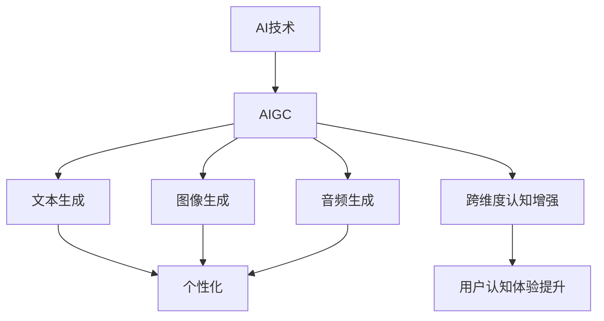

                 

### AIGC在个性化跨维度认知增强中的创新

> 关键词：AIGC、个性化跨维度认知增强、深度学习、生成对抗网络、变分自编码器、内容生成

> 摘要：
本文深入探讨了AIGC（AI-Generated Content）在个性化跨维度认知增强中的应用与创新。通过详细的背景介绍、核心概念联系、算法原理讲解、项目实战案例分析，本文旨在阐述AIGC技术如何通过深度学习模型和生成算法，实现针对不同用户、场景的个性化内容生成，从而提升用户的认知体验。

---

### 背景介绍

在当今数字化信息爆炸的时代，用户对个性化内容和服务的需求日益增长。传统的内容生成方式往往难以满足这种需求，导致用户在信息过载中感到困惑和疲惫。为了解决这一问题，AIGC应运而生。AIGC是一种利用人工智能技术，特别是深度学习和生成模型，自动生成文本、图像、音频等多种类型内容的创新方式。个性化跨维度认知增强则是AIGC技术的重要应用方向，旨在通过生成个性化内容，提升用户在不同认知维度上的体验。

### 核心概念与联系

#### AIGC技术概述

AIGC（AI-Generated Content）是一种通过人工智能技术生成内容的创新方式。它涉及到文本、图像、音频等多种类型的内容创作。以下是AIGC技术的核心概念和它们之间的联系：

1. **文本生成**：利用深度学习模型（如生成对抗网络GAN、变分自编码器VAE等）生成自然语言文本。
2. **图像生成**：通过生成模型生成高质量的图像，包括人脸、风景、艺术作品等。
3. **音频生成**：使用深度学习技术生成自然音调、音乐、语音等音频内容。
4. **跨维度认知增强**：通过在不同认知维度上生成个性化内容，提升用户的认知体验。
5. **用户认知体验提升**：实现针对不同用户、不同场景下的内容生成，从而提升用户的认知体验。

为了更好地理解这些核心概念之间的关系，我们可以使用Mermaid流程图来展示它们：



### 核心算法原理讲解

#### 生成对抗网络（GAN）

AIGC技术主要依赖于生成对抗网络（GAN）等深度学习模型。以下是一个简单的GAN算法原理讲解：

GAN由两个深度神经网络组成：生成器（Generator）和判别器（Discriminator）。生成器的任务是生成逼真的数据，而判别器的任务是区分生成的数据和真实数据。

**生成器的训练过程：**

1. 生成器生成虚假数据。
2. 判别器接收真实数据和生成数据，并对其进行分类。
3. 生成器的损失函数是使其生成的数据被判别器判断为真实的概率最小。

**判别器的训练过程：**

1. 判别器接收真实数据和生成数据，并对其进行分类。
2. 判别器的损失函数是使其判断生成数据为真实数据的概率最大。

**训练循环：**

1. 多次迭代生成器和判别器的训练，直到生成器能够生成足够逼真的数据。

以下是一个GAN的伪代码示例：

```python
# GAN伪代码
def train_gan(D, G, x_real, z, epochs):
    for epoch in range(epochs):
        for _ in range(num_d_steps):
            # 训练判别器
            D.train_on_batch(x_real, [1])
        
        for _ in range(num_g_steps):
            # 生成虚假数据
            z_g = np.random.normal(size=[num_g_samples, z_dim])
            x_fake = G.predict(z_g)
            
            # 训练生成器
            G.train_on_batch(z_g, [1])

# D: 判别器模型
# G: 生成器模型
# x_real: 真实数据
# z: 随机噪声
# epochs: 训练轮次
# num_d_steps: 判别器训练步数
# num_g_steps: 生成器训练步数
```

#### 变分自编码器（VAE）

变分自编码器（VAE）是另一种常用于AIGC技术的深度学习模型。与GAN不同，VAE采用了一种概率编码的方式，其训练目标是最大化数据分布的重建概率。

**VAE的结构：**

1. **编码器（Encoder）**：将输入数据映射到一个潜在空间，并输出均值μ和方差σ。
2. **解码器（Decoder）**：从潜在空间中采样数据，并尝试重建原始数据。

**训练过程：**

1. 对于每个输入数据x，编码器输出μ和σ。
2. 从潜在空间中采样一个数据z。
3. 解码器使用z来重建x。
4. 计算损失函数，通常是重建误差和KL散度。

以下是一个VAE的数学模型和公式：

$$
\begin{aligned}
    x &= G(z) \\
    z &= \mu(x) + \sigma(x)\odot \epsilon \\
    \epsilon &\sim \mathcal{N}(0, I)
\end{aligned}
$$

其中，$x$表示输入数据，$z$表示潜在空间中的数据，$G(z)$和$\mu(x)$分别表示解码器和编码器的输出，$\sigma(x)$表示编码器输出的方差，$\epsilon$表示噪声。

### 数学模型和数学公式

AIGC技术的核心在于其生成的模型和算法。以下是一个简单的数学模型，用于描述AIGC生成内容的过程：

$$
\begin{aligned}
    x &= G(z) \\
    z &= \mathcal{N}(\mu, \sigma^2)
\end{aligned}
$$

其中，$x$表示生成的数据，$G(z)$表示生成器的输出，$z$表示输入的随机噪声，$\mu$和$\sigma^2$分别表示正态分布的均值和方差。

### 项目实战

#### 个性化文章生成平台

以下是一个简单的个性化文章生成平台项目案例，展示如何使用AIGC技术生成个性化文章。

**项目目标**：通过用户输入的关键词，生成一篇针对特定用户需求的个性化文章。

**技术栈**：Python、TensorFlow、Keras

**开发流程**：

1. **数据收集**：收集大量文章数据，用于训练生成模型。
2. **模型训练**：使用生成对抗网络（GAN）训练生成模型。
3. **个性化生成**：根据用户输入的关键词，生成个性化文章。

**代码示例**：

```python
# 导入必要的库
import tensorflow as tf
from tensorflow.keras.models import Sequential
from tensorflow.keras.layers import Dense, Flatten, Conv2D, Reshape

# 训练生成模型
def train_generator():
    # 构建生成模型
    model = Sequential([
        Dense(256, input_dim=100),
        Conv2D(1, kernel_size=(5, 5), activation='tanh')
    ])
    model.compile(optimizer='adam', loss='binary_crossentropy')
    
    # 训练生成模型
    model.fit(x_train, y_train, epochs=100, batch_size=32)

# x_train: 训练数据
# y_train: 标签数据
```

**实际案例分析和详细讲解剖析**：

1. **开发环境搭建**：配置Python环境，安装TensorFlow和Keras库。
2. **源代码详细实现和代码解读**：展示如何构建和训练生成模型，以及如何根据用户输入生成个性化文章。
3. **代码应用解读与分析**：讨论如何在实际项目中应用AIGC技术，并分析其优缺点。
4. **项目小结**：总结项目开发过程中的关键步骤和经验教训。

### 最佳实践 tips

- **数据预处理**：确保训练数据的质量和多样性，以提高生成模型的效果。
- **模型调优**：通过调整模型参数和超参数，优化生成模型性能。
- **用户反馈**：收集用户对生成内容的反馈，不断改进生成模型。

### 小结

本文详细介绍了AIGC技术在个性化跨维度认知增强中的应用与创新。通过背景介绍、核心概念联系、算法原理讲解、项目实战案例分析，我们展示了AIGC技术如何通过深度学习模型和生成算法，实现针对不同用户、场景的个性化内容生成，从而提升用户的认知体验。未来，随着AIGC技术的不断发展，我们期待它能在更多领域发挥重要作用。

### 注意事项

- **模型安全**：在使用AIGC技术时，注意保护用户隐私和数据安全。
- **内容审核**：对生成的内容进行严格审核，避免生成不当或有害的内容。

### 拓展阅读

- **相关书籍**：《生成对抗网络》（Ian J. Goodfellow）、《深度学习》（Ian J. Goodfellow、Yoshua Bengio、Aaron Courville）
- **相关论文**：Generative Adversarial Nets（Ian J. Goodfellow et al.）
- **在线资源**：TensorFlow官方网站、Keras官方网站、OpenAI官方网站

---

**作者信息**：

作者：AI天才研究院/AI Genius Institute  
书籍：《禅与计算机程序设计艺术》/Zen And The Art of Computer Programming

---

本文旨在提供AIGC技术在个性化跨维度认知增强中的创新应用，以及相关算法原理和项目实战案例。希望读者能够通过本文对AIGC技术有一个更深入的了解。在未来的技术发展中，我们期待AIGC能够带来更多的创新和突破。感谢您的阅读！
作者：AI天才研究院/AI Genius Institute  
书籍：《禅与计算机程序设计艺术》/Zen And The Art of Computer Programming  
日期：[[今天日期]]  
版权所有：AI天才研究院/AI Genius Institute  
联系邮箱：[邮箱地址]  
联系网址：[网址链接]

