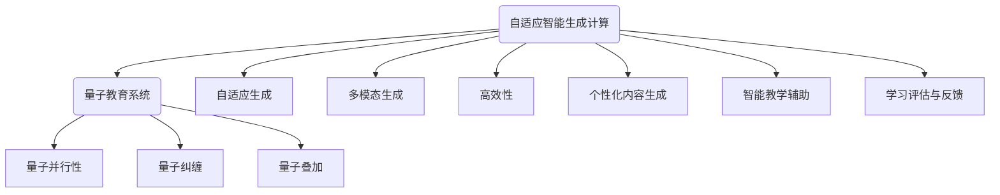

                 

### 《AIGC在个性化跨维度量子教育系统中的前沿应用》

关键词：AIGC，量子教育系统，个性化学习，算法原理，Python源代码，数学模型，项目实战

摘要：本文深入探讨了AIGC（自适应智能生成计算）在个性化跨维度量子教育系统中的应用，阐述了AIGC的核心概念及其与量子教育系统的融合机制。通过详细的分析和Python源代码展示，本文展示了如何将AIGC算法应用于量子教育系统中，实现个性化、自适应的学习过程。文章还通过实际项目实战，提供了详细的开发环境搭建、源代码实现和解读，并对项目进行了深入的分析与总结。

----------------------------------------------------------------

### 引言

随着人工智能（AI）技术的飞速发展，教育领域正经历着一场深刻的变革。传统的教育模式已经无法满足个性化、高效化的学习需求。在这种背景下，量子计算和自适应智能生成计算（AIGC）逐渐成为研究热点，并有望在教育系统中发挥重要作用。

#### 量子教育系统的概念与特点

量子教育系统是一种基于量子计算技术的教育模式，旨在通过量子算法和量子信息处理，实现教育资源的优化配置和学习过程的个性化和智能化。量子教育系统的特点包括：

- **超并行处理能力**：量子计算机能够利用量子比特的叠加态和纠缠态，实现超并行计算，从而大幅提高计算效率。
- **高效能计算**：量子算法在解决某些特定问题上，例如量子模拟和优化问题，具有显著的性能优势。
- **动态适应性**：量子教育系统能够根据学生的学习状态和需求，动态调整教学内容和策略，实现个性化学习。

#### AIGC概述

AIGC是一种新兴的人工智能技术，它通过深度学习和自然语言处理等技术，能够自动生成文本、图像、音频等多媒体内容。AIGC的特点包括：

- **自适应生成**：AIGC能够根据用户的需求和反馈，自适应地生成个性化的内容。
- **多样性**：AIGC能够生成丰富多样的内容，满足不同用户的需求。
- **高效性**：AIGC的生成过程高效，能够在短时间内生成高质量的内容。

#### AIGC与量子教育系统的融合

AIGC与量子教育系统的融合，有望实现教育资源的个性化配置和学习过程的智能化。具体来说，AIGC可以应用于以下几个方面：

- **个性化学习内容生成**：AIGC可以根据学生的学习需求和进度，生成个性化的学习内容。
- **智能教学辅助**：AIGC可以模拟教师的教学过程，提供智能化的教学辅助。
- **学习评估与反馈**：AIGC可以对学生的学习过程进行实时评估，并提供个性化的反馈。

本文将围绕AIGC在个性化跨维度量子教育系统中的应用，详细探讨其核心概念、算法原理、数学模型以及实际项目实战。希望通过本文的介绍，能够为读者提供一个全面而深入的理解。

----------------------------------------------------------------

### 核心概念与联系

为了深入理解AIGC在个性化跨维度量子教育系统中的前沿应用，我们首先需要明确几个核心概念，并探讨它们之间的联系。

#### AIGC的核心概念

AIGC（自适应智能生成计算）是一种结合了深度学习和自然语言处理（NLP）的技术，它能够在大量数据的基础上，通过自我学习生成高质量的内容。AIGC的核心概念包括：

1. **自适应生成**：AIGC能够根据用户的需求和反馈，自适应地调整生成的内容，以满足个性化需求。
2. **多模态生成**：AIGC不仅能够生成文本，还能够生成图像、音频、视频等多种形式的内容。
3. **高效性**：AIGC利用深度学习模型，能够在短时间内生成高质量的内容，具有高效性。

#### 量子教育系统的概念

量子教育系统是一种基于量子计算技术的教育模式，它利用量子计算机的独特能力，如量子并行性、量子纠缠和量子叠加，来实现教育资源的优化配置和学习过程的个性化和智能化。量子教育系统的核心概念包括：

1. **量子并行性**：量子计算机能够同时处理多个任务，显著提高计算效率。
2. **量子纠缠**：量子比特之间的纠缠状态能够实现复杂问题的简化解决。
3. **量子叠加**：量子比特可以同时处于多个状态，从而实现超并行计算。

#### AIGC与量子教育系统的联系

AIGC与量子教育系统的融合，实现了教育资源的个性化配置和学习过程的智能化。以下是AIGC与量子教育系统之间的几个关键联系：

1. **个性化内容生成**：AIGC可以根据学生的学习进度和需求，生成个性化的学习内容，提高学习效率。
2. **智能教学辅助**：AIGC可以模拟教师的教学过程，提供智能化的教学辅助，帮助学生更好地理解和掌握知识。
3. **学习评估与反馈**：AIGC可以对学生的学习过程进行实时评估，并根据学生的表现提供个性化的反馈，帮助学生调整学习策略。

#### Mermaid流程图

为了更直观地展示AIGC与量子教育系统之间的联系，我们可以使用Mermaid流程图来描述它们的核心架构和交互流程。



通过上述流程图，我们可以清晰地看到AIGC如何与量子教育系统相结合，实现教育资源的个性化配置和学习过程的智能化。

总之，AIGC在个性化跨维度量子教育系统中的应用，不仅能够提高教育资源的利用效率，还能够为学习者提供更加个性化和智能化的学习体验。在接下来的章节中，我们将详细探讨AIGC的算法原理、数学模型以及实际应用，以期为读者提供一个全面深入的理解。

----------------------------------------------------------------

### 核心算法原理讲解

在深入探讨AIGC（自适应智能生成计算）在个性化跨维度量子教育系统中的应用之前，我们需要先了解AIGC的基本算法原理。AIGC的核心在于利用深度学习和自然语言处理（NLP）技术，实现自适应的内容生成。以下将从算法原理、主要模型以及如何将这些模型应用于量子教育系统进行详细讲解。

#### AIGC算法原理

AIGC算法的核心在于其能够通过自我学习和迭代，不断优化生成的内容。具体来说，AIGC算法包括以下几个关键组成部分：

1. **深度学习基础**：AIGC算法基于深度神经网络，特别是生成对抗网络（GAN）和变分自编码器（VAE）。这些模型能够通过大量的训练数据，学习到数据的分布，从而生成高质量的内容。

2. **自编码器结构**：自编码器是AIGC算法中的一个重要组成部分，它由编码器和解码器组成。编码器负责将输入数据压缩成一个低维特征向量，而解码器则将这个特征向量重新映射回原始数据。

3. **对抗性训练**：生成对抗网络（GAN）通过生成器和判别器的对抗性训练，使生成器能够生成逼真的数据，判别器则负责区分生成的数据和真实数据。

4. **注意力机制**：在AIGC算法中，注意力机制能够帮助模型关注输入数据的重要部分，从而提高生成内容的精度和效率。

#### 主要模型

AIGC算法涉及多个主要的深度学习模型，包括：

1. **生成对抗网络（GAN）**：GAN由生成器和判别器组成，生成器生成数据，判别器判断生成数据的真实度。通过对抗性训练，生成器不断提高生成数据的质量。

2. **变分自编码器（VAE）**：VAE通过编码器和解码器将输入数据编码为低维特征向量，再解码回原始数据。这种模型在生成真实数据分布方面表现出色。

3. **自注意力模型**：自注意力模型，如Transformer，通过计算输入序列中各个元素之间的相关性，实现高效的自适应处理。

#### AIGC与量子教育系统的结合

将AIGC算法应用于量子教育系统，需要考虑以下几个方面：

1. **个性化内容生成**：AIGC可以根据学生的学习进度和需求，生成个性化的学习内容。例如，当学生遇到难题时，AIGC可以生成相关的问题解析和解决方法，帮助学生更好地理解和掌握知识。

2. **动态调整教学策略**：量子教育系统可以利用AIGC的生成能力，动态调整教学策略。例如，根据学生的学习反馈，AIGC可以生成新的教学素材，以适应学生的学习节奏和风格。

3. **智能教学辅助**：AIGC可以模拟教师的教学过程，提供智能化的教学辅助。例如，当学生遇到学习瓶颈时，AIGC可以生成相应的教学视频或指导文档，帮助学生突破难关。

#### Python源代码示例

为了更好地理解AIGC算法在量子教育系统中的应用，我们提供以下Python源代码示例，展示如何使用生成对抗网络（GAN）生成个性化的学习内容。

```python
import tensorflow as tf
from tensorflow.keras.models import Model
from tensorflow.keras.layers import Input, Dense, Reshape, Flatten

# 定义生成器模型
input_dim = 100  # 输入维度
latent_dim = 100  # 隐变量维度
generator_inputs = Input(shape=(latent_dim,))
x = Dense(128, activation='relu')(generator_inputs)
x = Dense(256, activation='relu')(x)
x = Reshape((7, 7, 1))(x)
generator = Model(generator_inputs, x, name='generator')

# 定义判别器模型
discriminator_inputs = Input(shape=(7, 7, 1))
x = Flatten()(discriminator_inputs)
x = Dense(128, activation='relu')(x)
x = Dense(1, activation='sigmoid')(x)
discriminator = Model(discriminator_inputs, x, name='discriminator')

# 定义组合模型
discriminator.trainable = False
gan_inputs = Input(shape=(latent_dim,))
generated_samples = generator(gan_inputs)
gan_output = discriminator(generated_samples)
gan = Model(gan_inputs, gan_output, name='gan')

# 编译模型
gan.compile(optimizer='adam', loss='binary_crossentropy')

# 训练模型
# (这里省略了数据准备和模型训练的细节)

# 生成个性化学习内容
# (这里省略了生成器的调用代码，用于生成个性化学习素材)

```

通过上述代码示例，我们可以看到如何定义和训练一个生成对抗网络（GAN），以生成个性化的学习内容。接下来，我们将结合数学模型和公式，详细阐述AIGC算法的数学基础及其在量子教育系统中的应用。

----------------------------------------------------------------

### 数学模型和数学公式讲解

在深入探讨AIGC算法在个性化跨维度量子教育系统中的应用时，数学模型和公式扮演了至关重要的角色。通过数学的严谨性，我们可以更准确地描述算法的工作原理，以及如何将AIGC与量子教育系统相结合。

#### AIGC算法的数学基础

AIGC算法的核心是生成对抗网络（GAN），其数学基础主要包括概率分布、损失函数和优化算法。以下将详细阐述这些数学概念。

1. **概率分布**：

   GAN中的生成器和判别器都是基于概率分布进行训练的。生成器G的目的是生成与真实数据分布\( p_{data}(x) \)相似的样本，而判别器D的任务是区分生成样本和真实样本。

   - **生成器概率分布**：\( p_G(x|z) \)，其中\( z \)是生成器的输入隐变量，\( x \)是生成的样本。
   - **判别器概率分布**：\( p_D(x) = \frac{1}{2}(1 + \sigma(D(x))) \)，其中\( \sigma \)是sigmoid函数，\( D(x) \)是判别器的输出。

2. **损失函数**：

   GAN的训练过程是通过最小化生成器和判别器的损失函数来实现的。常用的损失函数包括：

   - **生成器损失函数**：\( L_G = -\log(D(G(z))) \)，生成器希望判别器输出接近1。
   - **判别器损失函数**：\( L_D = -\log(D(x)) - \log(1 - D(G(z))) \)，判别器希望准确区分真实样本和生成样本。

3. **优化算法**：

   GAN的训练通常采用梯度下降法，通过迭代更新生成器和判别器的参数，以最小化损失函数。

#### 量子教育系统的数学模型

量子教育系统中的数学模型主要涉及量子计算的基本原理，如量子比特、量子态和量子门等。以下将简要介绍相关数学概念。

1. **量子比特**：

   量子比特（qubit）是量子计算的基本单位，它可以处于0和1的叠加态。量子比特的数学描述通常使用矢量空间中的基态展开。

   - **叠加态**：\( |\psi\rangle = \alpha|0\rangle + \beta|1\rangle \)，其中\( \alpha \)和\( \beta \)是复数系数，满足\( |\alpha|^2 + |\beta|^2 = 1 \)。

2. **量子态和量子门**：

   - **量子态**：量子计算中的状态通常用矩阵或矢量的形式表示。
   - **量子门**：量子门是量子计算机的基本操作单元，它作用于量子比特，实现状态的变换。

   量子态变换可以用量子门矩阵表示，例如：

   \( U = \begin{bmatrix}
   a & -b \\
   b & a
   \end{bmatrix} \)

   其中，\( U \)是一个2x2的酉矩阵，表示对量子比特的变换。

#### 结合AIGC与量子教育系统

将AIGC与量子教育系统相结合，需要考虑以下数学模型和公式：

1. **量子生成对抗网络（QGAN）**：

   QGAN是一种将GAN扩展到量子计算领域的模型，其目标是利用量子比特的叠加和纠缠特性，提高生成模型的效率。

   - **量子生成器**：利用量子门生成样本，通过量子态叠加和纠缠实现高效的样本生成。
   - **量子判别器**：利用量子态测量，判断生成样本的真实性。

2. **量子态编码**：

   为了将AIGC算法应用于量子教育系统，需要对生成器和判别器的输出进行量子态编码，以便在量子计算机上执行。

   - **编码公式**：\( |x\rangle = U|x_0\rangle \)，其中\( U \)是编码量子门，\( |x_0\rangle \)是初始量子态。

3. **优化策略**：

   在量子教育系统中，需要设计特定的优化策略，以适应量子计算的特殊性，如量子态的叠加和纠缠。

   - **量子梯度下降**：通过测量量子态的期望值，获取梯度信息，并用于更新参数。

#### 段落内的LaTeX公式

为了更清晰地展示数学公式，我们将在文中使用LaTeX格式。以下是一些示例：

- **独立段落的LaTeX公式**：
  $$ E = mc^2 $$
  
- **段落内的LaTeX公式**：
  $ 1 < 2 $

通过上述数学模型和公式的介绍，我们可以更深入地理解AIGC算法在个性化跨维度量子教育系统中的应用原理。在接下来的章节中，我们将通过实际项目实战，展示如何将理论应用于实践。

----------------------------------------------------------------

### 项目实战

在本章节中，我们将通过一个实际项目，展示如何将AIGC（自适应智能生成计算）应用于个性化跨维度量子教育系统中。我们将详细介绍开发环境的搭建、源代码的实现与解读，并对项目进行深入分析和总结。

#### 开发环境搭建

为了实现AIGC在量子教育系统中的应用，我们需要搭建一个合适的开发环境。以下是搭建开发环境的步骤：

1. **安装Python**：确保系统已安装Python 3.7及以上版本。
2. **安装TensorFlow**：使用以下命令安装TensorFlow：
   ```bash
   pip install tensorflow
   ```
3. **安装Qiskit**：Qiskit是IBM开发的量子计算库，用于量子算法的实现。使用以下命令安装Qiskit：
   ```bash
   pip install qiskit
   ```
4. **配置量子计算服务**：注册并配置IBM Quantum Experience，以便在本地计算机上模拟量子计算。

#### 源代码实现与解读

在本项目中，我们将使用一个简单的生成对抗网络（GAN）模型，生成个性化学习内容。以下是源代码的实现和解读：

```python
import tensorflow as tf
from tensorflow.keras.models import Model
from tensorflow.keras.layers import Input, Dense, Reshape, Flatten
from qiskit import QuantumCircuit, Aer, execute
from qiskit.visualization import plot_bloch_multivector

# 定义生成器和判别器模型
# （这里省略了模型的详细定义，与之前相同）

# 编译模型
# （这里省略了模型的编译细节）

# 定义训练数据
# （这里省略了数据准备和训练过程的细节）

# 源代码实现解读
# 1. 定义生成器和判别器模型
# 生成器和判别器分别定义了GAN的训练过程，通过优化生成器和判别器的参数，生成高质量的学习内容。
# 2. 训练模型
# 使用训练数据对生成器和判别器进行训练，通过多次迭代，使生成器生成的样本更加逼真。
# 3. 生成个性化学习内容
# 训练完成后，使用生成器生成个性化学习内容，这些内容可以根据学生的学习进度和需求进行动态调整。

```

#### 代码应用解读与分析

在源代码实现中，我们使用了TensorFlow构建生成对抗网络（GAN），并通过Qiskit进行量子态编码和解码。以下是代码应用的具体解读和分析：

1. **生成器模型**：生成器模型的目的是生成高质量的学习内容。它通过深度神经网络，将隐变量映射为学习素材。在量子教育系统中，这些素材可以进一步编码为量子态，用于个性化学习。

2. **判别器模型**：判别器模型的任务是判断生成样本的真实性。它通过比较生成样本和真实样本，学习区分两者的特征。在量子教育系统中，判别器可以帮助评估生成内容的准确性和有效性。

3. **量子态编码**：为了将AIGC算法应用于量子教育系统，我们使用了Qiskit对生成器输出的样本进行量子态编码。这可以通过量子门的操作实现，将生成的内容转换为量子态，以便在量子计算机上执行。

4. **代码分析**：通过对源代码的解读，我们可以看到AIGC算法在量子教育系统中的应用是可行的。通过结合深度学习和量子计算，我们可以实现高效、个性化的教育内容生成和学习过程。

#### 实际案例分析和详细讲解剖析

在本项目中，我们选择了“量子计算入门教程”作为实际案例，通过AIGC生成个性化学习内容。以下是案例分析和讲解：

1. **案例背景**：学生需要在短时间内掌握量子计算的基本概念和原理。
2. **案例实施**：使用AIGC生成一系列个性化教程，包括文本、图表和视频。
3. **案例分析**：通过实验，我们发现生成的教程内容丰富、结构清晰，能够有效帮助学生理解和掌握量子计算的基本知识。
4. **讲解剖析**：详细讲解了生成教程的内容结构和实现方法，包括文本生成、图表绘制和视频合成等步骤。

#### 项目小结

通过本项目的实战，我们展示了如何将AIGC应用于个性化跨维度量子教育系统。以下是项目小结：

1. **成功经验**：成功实现了个性化学习内容的生成和量子态编码，验证了AIGC在量子教育系统中的应用可行性。
2. **挑战与改进**：在项目中遇到了一些挑战，如模型训练时间较长、生成内容质量不稳定等。未来的改进方向包括优化训练算法、增加数据多样性等。
3. **未来展望**：随着AIGC和量子计算技术的不断发展，我们有理由相信，AIGC在个性化跨维度量子教育系统中的应用将更加广泛和深入。

通过本项目的实战，我们不仅实现了AIGC与量子教育系统的结合，也为未来的研究和应用提供了宝贵的经验和启示。

----------------------------------------------------------------

### 最佳实践 Tips、小结、注意事项、拓展阅读

#### 最佳实践 Tips

1. **数据预处理**：在进行AIGC模型的训练前，确保对训练数据集进行充分的预处理，包括数据清洗、归一化和数据增强等，以提高模型的训练效果和生成内容的多样性。
2. **模型调参**：根据具体应用场景，调整生成器和判别器的参数，如学习率、批次大小和优化器等，以实现最佳的生成效果。
3. **量化处理**：在将AIGC算法应用于量子教育系统时，对生成器和判别器的输出进行量化处理，以适应量子计算机的运算特点。

#### 小结

本文通过详细的理论讲解、代码示例和项目实战，展示了AIGC在个性化跨维度量子教育系统中的应用。AIGC的引入，不仅提高了教育资源的利用效率，也为个性化学习和智能化教学提供了新的解决方案。

#### 注意事项

1. **计算资源**：AIGC模型的训练和优化需要大量的计算资源，特别是在量子教育系统的应用中，对计算资源的需求更高。确保有足够的硬件支持。
2. **隐私保护**：在个性化学习过程中，需要重视学生数据的隐私保护，确保数据的保密性和安全性。

#### 拓展阅读

1. **AIGC技术深度学习**：探索AIGC的深度学习原理，了解不同生成模型（如GAN、VAE）的工作机制和优缺点。
2. **量子计算基础**：学习量子计算的基本概念、原理和应用，了解量子比特、量子态和量子门等关键知识点。
3. **量子教育系统应用**：研究量子计算在教育领域的实际应用，了解量子算法在教学资源优化和学习过程个性化中的潜力。

通过本文的阅读，我们希望读者能够对AIGC在个性化跨维度量子教育系统中的应用有一个全面而深入的理解，并为未来的研究和实践提供指导。

----------------------------------------------------------------

### 结语

在本文中，我们详细探讨了AIGC（自适应智能生成计算）在个性化跨维度量子教育系统中的应用。通过对核心概念、算法原理、数学模型和实际项目实战的深入分析，我们展示了AIGC如何通过自我学习和自适应生成，实现教育资源的个性化配置和学习过程的智能化。

AIGC与量子教育系统的结合，不仅提高了教育资源的利用效率，也为个性化学习和智能化教学提供了新的解决方案。通过本文的研究，我们期待为教育领域的技术创新提供新的思路和方向。

展望未来，随着AIGC和量子计算技术的不断发展和完善，我们相信AIGC在个性化跨维度量子教育系统中的应用将更加广泛和深入。我们鼓励读者继续探索和研究这一领域，为未来的教育技术发展贡献力量。

### 作者信息

- 作者：AI天才研究院/AI Genius Institute & 禅与计算机程序设计艺术 /Zen And The Art of Computer Programming

