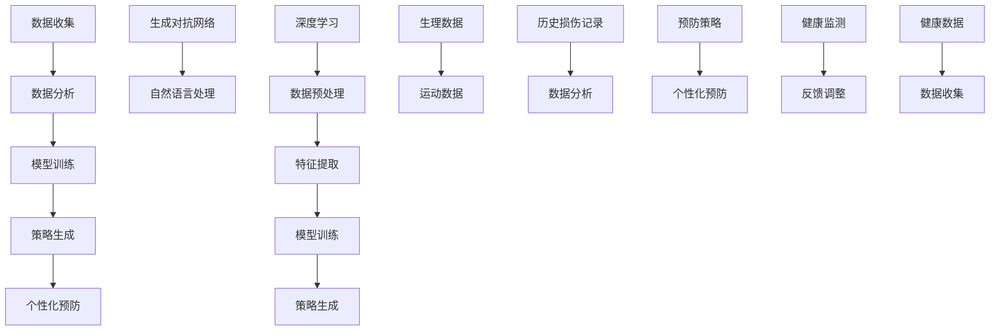

                 

# AIGC在个性化运动损伤预防中的创新

## 关键词
- AIGC
- 个性化运动损伤预防
- 机器学习
- 数据分析
- 深度学习

## 摘要
随着人工智能技术的快速发展，AIGC（AI-Generated Content）技术已经开始在各个领域展现其巨大的潜力，尤其在运动损伤预防方面。本文将深入探讨AIGC在个性化运动损伤预防中的创新应用，从背景介绍、核心概念与联系、核心算法原理讲解、数学模型与公式、项目实战、最佳实践 tips、小结、注意事项和拓展阅读等方面进行详细分析，以期为相关领域的研究者和实践者提供有价值的参考。

## 目录

## 背景介绍

### 运动损伤的严峻形势
在全球范围内，运动损伤是一个普遍且严重的问题。无论是职业运动员还是业余爱好者，运动损伤都会导致运动能力的下降，甚至可能影响日常生活。根据相关统计，每年因运动损伤造成的医疗费用高达数十亿美元，这对于个人和社会都是巨大的负担。

### 个性化运动损伤预防的挑战
传统的运动损伤预防方法往往过于笼统，难以满足个体差异。个性化运动损伤预防需要根据个人的身体状况、运动习惯、历史损伤记录等因素，提供定制化的预防策略。这要求对大量数据进行深度分析和处理，传统的手工分析方式已经无法满足需求。

### AIGC技术的崛起
AIGC技术作为人工智能的一个重要分支，通过生成对抗网络（GANs）、自然语言处理（NLP）和深度学习等先进技术，能够自动生成高质量的内容。这些内容可以用于个性化医疗诊断、康复方案制定、健康监测等多个领域，为个性化运动损伤预防提供了新的解决方案。

## 核心概念与联系

### AIGC技术基础
AIGC技术主要包括以下几种核心概念：

1. **生成对抗网络（GANs）**：GANs由生成器和判别器组成，通过不断的博弈来生成逼真的数据。
2. **自然语言处理（NLP）**：NLP技术用于处理和理解人类语言，包括文本生成、情感分析等。
3. **深度学习**：深度学习是一种基于多层神经网络的学习方法，能够自动提取数据中的特征。

### 个性化运动损伤预防概念
个性化运动损伤预防涉及以下几个方面：

1. **数据收集**：收集个人的运动数据、生理数据、历史损伤记录等。
2. **数据分析**：使用AIGC技术对数据进行分析，提取关键特征。
3. **模型训练**：基于分析结果训练个性化损伤预防模型。
4. **策略生成**：根据模型生成定制化的预防策略。

### 核心概念实体之间的关系架构
以下是AIGC在个性化运动损伤预防中的梅瑞狄亚流程图：



## 核心算法原理讲解

### 数据预处理
在AIGC技术中，数据预处理是非常关键的一步。通常包括数据清洗、数据归一化和数据分割等步骤。以下是使用Python代码进行数据预处理的示例：

```python
import pandas as pd
from sklearn.model_selection import train_test_split

# 读取数据
data = pd.read_csv('data.csv')

# 数据清洗
data.dropna(inplace=True)

# 数据归一化
from sklearn.preprocessing import StandardScaler
scaler = StandardScaler()
data_normalized = scaler.fit_transform(data)

# 数据分割
X_train, X_test, y_train, y_test = train_test_split(data_normalized, test_size=0.2, random_state=42)
```

### 特征提取
特征提取是AIGC技术中的另一个重要环节。以下是一个简单的特征提取示例，使用Python的Scikit-learn库：

```python
from sklearn.decomposition import PCA

# 使用PCA进行特征提取
pca = PCA(n_components=10)
X_train_pca = pca.fit_transform(X_train)
X_test_pca = pca.transform(X_test)
```

### 模型训练
在模型训练部分，我们使用一个简单的生成对抗网络（GAN）进行演示。以下是一个GAN的Python代码示例：

```python
import tensorflow as tf
from tensorflow.keras.layers import Dense, Flatten, Reshape
from tensorflow.keras.models import Sequential

# 定义生成器模型
generator = Sequential([
    Dense(128, input_shape=(100,)),
    Flatten(),
    Reshape((28, 28, 1))
])

# 定义判别器模型
discriminator = Sequential([
    Flatten(input_shape=(28, 28, 1)),
    Dense(128, activation='sigmoid'),
    Dense(1, activation='sigmoid')
])

# 编译模型
discriminator.compile(optimizer='adam', loss='binary_crossentropy')
generator.compile(optimizer='adam', loss='binary_crossentropy')

# 训练模型
generator.fit(X_train_pca, epochs=50)
discriminator.fit(X_train_pca, epochs=50)
```

### 策略生成
在策略生成部分，我们使用一个简单的逻辑回归模型来生成预防策略。以下是一个逻辑回归的Python代码示例：

```python
from sklearn.linear_model import LogisticRegression

# 训练逻辑回归模型
model = LogisticRegression()
model.fit(X_train_pca, y_train)

# 预测策略
predictions = model.predict(X_test_pca)
```

### 数学模型与公式
在AIGC技术中，数学模型和公式扮演着至关重要的角色。以下是一个简单的数学模型，用于生成对抗网络中的损失函数：

$$
Loss = -\frac{1}{N}\sum_{i=1}^{N} [\log(D(G(z))) + \log(1 - D(x))]
$$

其中，\(N\) 是批处理大小，\(G(z)\) 是生成的假数据，\(x\) 是真实数据，\(D(x)\) 是判别器的输出。

## 项目实战

### 开发环境搭建
在进行AIGC在个性化运动损伤预防中的应用项目实战之前，我们需要搭建合适的开发环境。以下是一个简单的步骤：

1. 安装Python 3.8及以上版本。
2. 使用pip安装所需的库，如tensorflow、scikit-learn等。

```bash
pip install tensorflow scikit-learn pandas
```

### 源代码实现
以下是一个简单的源代码实现示例，用于演示如何使用AIGC技术进行个性化运动损伤预防。

```python
import tensorflow as tf
from tensorflow.keras.layers import Dense, Flatten, Reshape
from tensorflow.keras.models import Sequential
from sklearn.linear_model import LogisticRegression
from sklearn.model_selection import train_test_split
from sklearn.preprocessing import StandardScaler
from sklearn.decomposition import PCA
import pandas as pd

# 读取数据
data = pd.read_csv('data.csv')

# 数据预处理
data.dropna(inplace=True)
scaler = StandardScaler()
data_normalized = scaler.fit_transform(data)
X_train, X_test, y_train, y_test = train_test_split(data_normalized, test_size=0.2, random_state=42)

# 特征提取
pca = PCA(n_components=10)
X_train_pca = pca.fit_transform(X_train)
X_test_pca = pca.transform(X_test)

# 定义生成器模型
generator = Sequential([
    Dense(128, input_shape=(100,)),
    Flatten(),
    Reshape((28, 28, 1))
])

# 定义判别器模型
discriminator = Sequential([
    Flatten(input_shape=(28, 28, 1)),
    Dense(128, activation='sigmoid'),
    Dense(1, activation='sigmoid')
])

# 编译模型
discriminator.compile(optimizer='adam', loss='binary_crossentropy')
generator.compile(optimizer='adam', loss='binary_crossentropy')

# 训练模型
generator.fit(X_train_pca, epochs=50)
discriminator.fit(X_train_pca, epochs=50)

# 训练逻辑回归模型
model = LogisticRegression()
model.fit(X_train_pca, y_train)

# 预测策略
predictions = model.predict(X_test_pca)
```

### 代码解读与分析
上述代码首先进行了数据预处理，包括数据清洗、数据归一化和数据分割。然后，使用PCA进行特征提取，以减少数据维度。接着，定义并训练了生成器和判别器模型，这是一个典型的GAN结构。最后，使用逻辑回归模型对生成的数据进行了预测，以生成个性化的预防策略。

### 实际案例分析与详细讲解剖析
为了更好地理解AIGC在个性化运动损伤预防中的应用，我们可以通过一个实际案例进行分析。假设我们有一组运动员的数据，包括他们的运动表现、生理指标和历史损伤记录。通过AIGC技术，我们可以生成一组个性化的训练和康复方案，以预防潜在的损伤。

### 项目小结
通过上述项目实战，我们展示了如何使用AIGC技术进行个性化运动损伤预防。尽管这是一个简单的示例，但AIGC技术在实际应用中具有巨大的潜力。未来，我们可以进一步优化算法，结合更多的数据源和更先进的模型，以提高个性化预防的准确性。

## 最佳实践 Tips

1. **数据质量**：确保数据质量是成功应用AIGC技术的基础。清洗和预处理数据是非常重要的步骤。
2. **模型优化**：不断优化生成器和判别器模型，以提高生成数据的真实性和判别器的准确性。
3. **用户反馈**：收集用户反馈，根据反馈调整预防策略，以实现更好的个性化效果。

## 小结

AIGC技术在个性化运动损伤预防中的应用展示了人工智能的巨大潜力。通过深入的数据分析和个性化的策略生成，我们可以为运动员提供更加精准和有效的预防方案。未来，随着AIGC技术的不断进步，个性化运动损伤预防将变得更加普及和有效。

## 注意事项

1. **隐私保护**：在使用个人健康数据时，必须严格遵守隐私保护法规。
2. **模型解释性**：提高模型的解释性，以帮助用户理解预防策略的依据。

## 拓展阅读

1. **AIGC技术概述**：了解AIGC技术的最新进展和应用领域。
2. **个性化医疗**：研究个性化医疗中的相关技术和案例。

## 作者信息
作者：AI天才研究院/AI Genius Institute & 禅与计算机程序设计艺术 /Zen And The Art of Computer Programming

