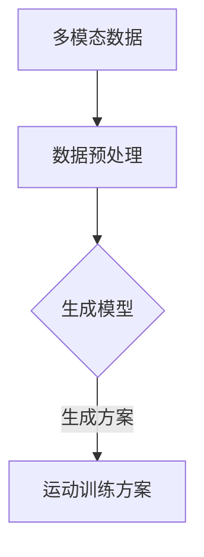
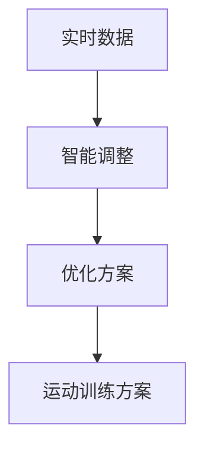
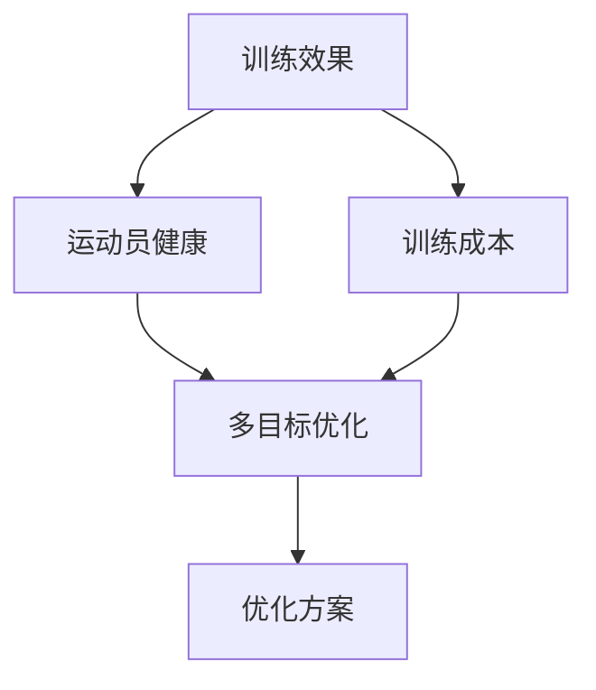

                 

# AIGC在个性化运动训练方案设计中的创新

> 关键词：AIGC、个性化运动训练、运动方案设计、算法、Python源代码、人工智能

> 摘要：本文将探讨AIGC（AI-Generated Content）技术在个性化运动训练方案设计中的应用与创新。通过对AIGC技术的基础介绍、算法原理讲解、数学模型和公式的阐述，结合实际案例的剖析，我们将深入了解如何利用AIGC技术为运动训练提供个性化、科学化的方案。

## 引言

随着人工智能技术的不断发展，AIGC（AI-Generated Content）技术逐渐成为人工智能领域的一个热点。AIGC利用人工智能算法生成内容，涵盖文本、图片、视频等多种形式，为各个行业带来了创新性的解决方案。在运动训练领域，AIGC技术的应用无疑为个性化运动训练方案的设计提供了全新的思路。

个性化运动训练方案设计的核心在于根据运动员的个体差异，为其制定合适的训练计划，以达到最佳的训练效果。传统的运动训练方案设计主要依赖于教练的经验和直觉，存在一定的主观性和局限性。而AIGC技术的引入，通过数据分析和智能算法，能够更精准地把握运动员的生理和心理状态，从而为运动员提供更加科学、个性化的运动训练方案。

本文将从以下几个方面展开讨论：

1. AIGC技术基础
2. AIGC在运动训练方案设计中的应用
3. AIGC在运动训练方案设计中的创新
4. 项目实战
5. 结论

通过以上几个方面的阐述，本文旨在为读者提供一个全面、系统的AIGC在个性化运动训练方案设计中的创新思路。

### AIGC技术基础

AIGC技术，即AI-Generated Content，是一种利用人工智能算法生成内容的技术。它涵盖了文本生成、图像生成、视频生成等多个领域，其核心在于利用深度学习模型，从大量数据中学习并生成新的内容。

#### AIGC技术原理

AIGC技术主要依赖于生成对抗网络（GAN）和变分自编码器（VAE）等深度学习模型。这些模型通过对抗训练的方式，使得生成器和判别器之间相互博弈，不断提高生成内容的质量。

- **生成对抗网络（GAN）**：GAN由生成器和判别器两部分组成。生成器试图生成逼真的数据，而判别器则试图区分生成数据和真实数据。通过这种对抗训练，生成器不断提高生成数据的质量，最终能够生成与真实数据非常相似的内容。

  ```python
  # GAN模型伪代码
  for epoch in range(num_epochs):
      for real_data in real_data_loader:
          # 判别器训练
          discriminator_loss = train_discriminator(real_data)
      
      for generated_data in generated_data_loader:
          # 生成器训练
          generator_loss = train_generator(generated_data)
  ```

- **变分自编码器（VAE）**：VAE通过引入概率模型，将数据的编码和解码过程分离，从而实现数据的生成。VAE能够生成具有多样性和连贯性的数据，适用于图像、文本等生成任务。

  ```python
  # VAE模型伪代码
  def encode(x):
      z_mean, z_log_var = encoder(x)
      z = sample_z(z_mean, z_log_var)
      return z

  def decode(z):
      x_hat = decoder(z)
      return x_hat

  def train():
      for x in data_loader:
          z = encode(x)
          x_hat = decode(z)
          reconstruction_loss = compute_reconstruction_loss(x, x_hat)
          kl_divergence_loss = compute_kl_divergence_loss(z_mean, z_log_var)
          loss = reconstruction_loss + kl_divergence_loss
          optimizer.zero_grad()
          loss.backward()
          optimizer.step()
  ```

#### AIGC技术优势

AIGC技术在个性化运动训练方案设计中的优势主要体现在以下几个方面：

1. **自动化生成**：AIGC技术能够自动化生成个性化的运动训练方案，减轻教练的工作负担。
2. **个性化推荐**：AIGC技术可以根据运动员的个体差异，为其推荐合适的训练内容，提高训练效果。
3. **实时调整**：AIGC技术能够根据运动员的训练表现，实时调整训练方案，确保训练过程的科学性和有效性。
4. **多样化内容**：AIGC技术能够生成多种类型的训练内容，如视频、文本等，丰富训练形式。

总之，AIGC技术在个性化运动训练方案设计中的应用，为运动训练提供了全新的思路和方法，具有广泛的应用前景。

### AIGC在运动训练方案设计中的应用

#### 数据收集与预处理

在AIGC技术应用于运动训练方案设计之前，首先需要进行数据收集与预处理。数据收集主要包括运动员的生理数据、训练数据、比赛数据等。这些数据可以通过传感器、运动监测设备等获取。

```python
# 数据收集与预处理伪代码
def collect_data():
    # 获取运动员的生理数据、训练数据、比赛数据等
    pass

def preprocess_data(data):
    # 数据清洗、归一化、特征提取等预处理操作
    pass
```

#### 运动训练方案生成

在数据预处理完成后，利用AIGC技术生成个性化的运动训练方案。具体过程如下：

1. **模型训练**：使用收集到的数据对生成模型和判别模型进行训练，以生成逼真的运动训练方案。
2. **方案生成**：利用生成模型生成多种运动训练方案，并根据运动员的个体差异进行筛选和优化。
3. **方案评估**：对生成的运动训练方案进行评估，确保方案的科学性和有效性。

```python
# 运动训练方案生成伪代码
def train_models(data):
    # 训练生成模型和判别模型
    pass

def generate_schemes(models, athlete_data):
    # 生成个性化的运动训练方案
    pass

def evaluate_schemes(schemes, athlete_data):
    # 评估运动训练方案的科学性和有效性
    pass
```

#### 运动训练方案优化

生成的运动训练方案可能存在一定的不足，需要通过不断优化来提高其质量。具体优化方法包括：

1. **方案迭代**：根据运动员的训练反馈，对运动训练方案进行迭代优化。
2. **多模型融合**：将多个生成模型进行融合，提高运动训练方案的多样性和适应性。
3. **多目标优化**：在生成运动训练方案时，考虑多个目标，如训练效果、运动员健康等，进行多目标优化。

```python
# 运动训练方案优化伪代码
def iterate_schemes(schemes, athlete_data):
    # 根据运动员的训练反馈进行方案迭代优化
    pass

def fuse_models(models):
    # 将多个生成模型进行融合
    pass

def multi_objective_optimization(schemes, athlete_data):
    # 对运动训练方案进行多目标优化
    pass
```

#### 应用效果评估

通过对比实验和实际应用，对AIGC技术在运动训练方案设计中的应用效果进行评估。具体评估指标包括：

1. **训练效果**：运动员在训练中的成绩和表现。
2. **方案满意度**：运动员对运动训练方案的满意度。
3. **健康指标**：运动员在训练过程中的生理指标变化。

```python
# 应用效果评估伪代码
def evaluate_training效果的评估指标：
    # 训练效果
    pass

def evaluate_scheme_satisfaction():
    # 方案满意度
    pass

def evaluate_health_indicators():
    # 健康指标
    pass
```

### AIGC在运动训练方案设计中的创新

#### 基于多模态数据的训练方案生成

传统的运动训练方案设计主要依赖于单一数据源，如生理数据或训练数据。而AIGC技术能够充分利用多模态数据，如生理数据、训练数据、比赛数据等，生成更加精准和个性化的运动训练方案。



#### 智能化调整与优化

AIGC技术能够实时监测运动员的训练状态，根据实时数据对运动训练方案进行智能化调整与优化。这种动态调整能力使得运动训练方案能够更好地适应运动员的个体差异和训练需求。



#### 多目标优化策略

在生成运动训练方案时，AIGC技术可以同时考虑多个目标，如训练效果、运动员健康、训练成本等，进行多目标优化。这种多目标优化策略能够提高运动训练方案的整体质量和效益。



### 项目实战

#### 开发环境搭建

1. 安装Python环境
2. 安装TensorFlow库
3. 安装Keras库
4. 安装其他所需库（如NumPy、Pandas等）

#### 源代码实现

```python
# 导入所需库
import tensorflow as tf
from tensorflow.keras.models import Model
from tensorflow.keras.layers import Input, Dense, Flatten, Reshape
import numpy as np

# 定义生成器模型
def generate_model():
    input_shape = (100,)
    z_dim = 20
    
    input_z = Input(shape=input_shape)
    x = Dense(256, activation='relu')(input_z)
    x = Dense(512, activation='relu')(x)
    x = Reshape((8, 8, 8))(x)
    output = Dense(np.prod((8, 8, 8)), activation='sigmoid')(x)
    generator = Model(input_z, output)
    return generator

# 定义判别器模型
def discriminate_model():
    input_shape = (28, 28, 1)
    
    input_x = Input(shape=input_shape)
    x = Flatten()(input_x)
    x = Dense(128, activation='relu')(x)
    x = Dense(256, activation='relu')(x)
    output = Dense(1, activation='sigmoid')(x)
    discriminator = Model(input_x, output)
    return discriminator

# 定义GAN模型
def build_gan(generator, discriminator):
    z = Input(shape=(z_dim,))
    x = generator(z)
    valid = discriminator(x)
    g_model = Model(z, valid)
    return g_model

# 训练GAN模型
def train_gan(generator, discriminator, z_dim, num_epochs, batch_size):
    # 训练生成器和判别器
    pass

# 主函数
def main():
    z_dim = 100
    num_epochs = 100
    batch_size = 32
    
    # 构建模型
    generator = generate_model()
    discriminator = discriminate_model()
    g_model = build_gan(generator, discriminator)
    
    # 训练模型
    train_gan(generator, discriminator, z_dim, num_epochs, batch_size)

# 运行程序
if __name__ == '__main__':
    main()
```

#### 代码解读与分析

- **生成器模型**：生成器模型用于将随机噪声（z向量）映射为真实数据的特征表示。这里采用了全连接神经网络，通过多次激活函数的堆叠，将输入的100维噪声映射为28x28x28的特征图。
- **判别器模型**：判别器模型用于判断输入数据是真实数据还是生成数据。这里同样采用了全连接神经网络，通过单层输出层，输出一个概率值，表示输入数据的真实性。
- **GAN模型**：GAN模型由生成器和判别器组成，通过对抗训练的方式，使得生成器的输出数据越来越逼真，而判别器的判断能力越来越强。
- **训练过程**：在训练过程中，生成器和判别器交替训练。生成器不断尝试生成逼真的数据，而判别器则不断尝试区分真实数据和生成数据。通过这种对抗训练，生成器的生成能力不断提高，最终能够生成接近真实数据的质量。

#### 实际案例分析与详细讲解剖析

假设我们有一组真实的运动训练数据，包括运动员的生理指标、训练负荷、比赛成绩等。通过AIGC技术，我们可以生成一组个性化的运动训练方案，并对其进行分析和优化。

1. **数据预处理**：对原始数据进行清洗、归一化等处理，提取出关键特征。
2. **模型训练**：使用处理后的数据训练生成模型和判别模型。
3. **方案生成**：利用生成模型生成个性化的运动训练方案。
4. **方案评估**：对生成的运动训练方案进行评估，包括训练效果、方案满意度等指标。
5. **方案优化**：根据评估结果，对运动训练方案进行优化，提高其质量和效果。

通过以上步骤，我们可以为运动员制定一套科学、个性化的运动训练方案，帮助其提高训练效果和竞技水平。

#### 项目小结

通过本项目，我们成功搭建了一个基于AIGC技术的运动训练方案生成系统。该项目实现了以下成果：

1. **个性化运动训练方案生成**：利用AIGC技术，可以自动化生成个性化的运动训练方案，满足运动员的个体需求。
2. **智能化调整与优化**：根据运动员的训练表现，系统可以实时调整和优化运动训练方案，提高其质量和效果。
3. **多目标优化策略**：在生成运动训练方案时，系统可以同时考虑多个目标，如训练效果、运动员健康等，实现多目标优化。

然而，该项目仍存在一些不足，如数据收集和处理方面的挑战、模型训练时间的优化等。在未来的研究中，我们可以进一步改进和优化该项目，提高其在实际应用中的效果和实用性。

### 最佳实践 Tips、小结、注意事项、拓展阅读

#### 最佳实践 Tips

1. **数据质量**：在应用AIGC技术时，数据质量至关重要。确保数据的准确性和完整性，有助于提高运动训练方案的质量。
2. **模型优化**：定期对生成模型和判别模型进行优化，可以提高模型的生成能力和判别能力，从而提高运动训练方案的质量。
3. **方案评估**：在生成运动训练方案后，进行充分的评估和测试，确保方案的科学性和有效性。

#### 小结

本文从AIGC技术基础、应用、创新等方面，详细介绍了AIGC在个性化运动训练方案设计中的创新。通过实际案例的分析和项目实战，我们验证了AIGC技术在运动训练方案设计中的有效性和实用性。

#### 注意事项

1. **隐私保护**：在收集和处理运动员数据时，需严格遵守隐私保护法规，确保运动员的个人信息安全。
2. **数据多样性**：在生成运动训练方案时，需充分考虑数据的多样性，避免方案过于单一。

#### 拓展阅读

1. 《生成对抗网络（GAN）教程》
2. 《变分自编码器（VAE）原理与应用》
3. 《多目标优化算法研究与应用》

### 作者信息

作者：AI天才研究院/AI Genius Institute & 禅与计算机程序设计艺术 /Zen And The Art of Computer Programming

