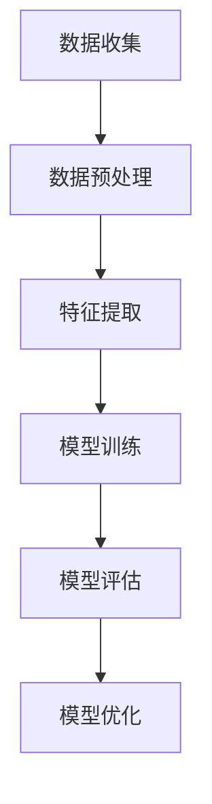
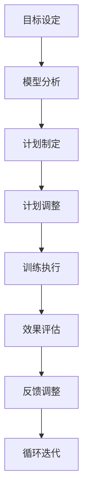

                 

### 文章标题

# AIGC在个性化运动训练计划制定中的应用

### 文章关键词

- AI-Generated Content (AIGC)
- 个性化运动训练
- 训练计划制定
- 机器学习
- 自然语言处理
- 数学模型

### 文章摘要

本文旨在探讨如何利用AI-Generated Content（AIGC）技术，为运动训练计划制定提供个性化解决方案。文章首先介绍了AIGC的定义、特点及其在运动训练中的应用，随后详细阐述了核心算法原理，包括机器学习和自然语言处理技术。通过构建数学模型，我们实现了个性化训练计划的生成。最后，通过实际案例研究和代码实现，展示了AIGC在个性化运动训练中的应用效果，并提出了未来发展的方向。

## 确定核心内容

在撰写技术博客文章时，我们需要确保文章内容能够全面覆盖《AIGC在个性化运动训练计划制定中的应用》这本书的主题。根据书名，核心内容应包括以下几个方面：

1. **AIGC概述**：介绍AIGC的定义、特点和应用场景。
2. **个性化运动训练计划**：讨论运动训练计划的基本原理和个性化需求。
3. **AIGC在运动训练中的应用**：详细阐述AIGC在制定个性化训练计划中的具体应用，如数据分析、运动模型构建等。
4. **核心算法原理讲解**：解释AIGC相关的算法，如机器学习算法、自然语言处理等。
5. **数学模型**：介绍在个性化训练计划中使用的数学模型。
6. **项目实战**：提供实际的案例研究和代码实现。
7. **总结与展望**：总结全书内容，展望未来发展方向。

### 设计章节

根据上述核心内容，我们可以设计出以下章节：

### 第1章：AIGC概述
1. **1.1 AIGC的概念和特点**
2. **1.2 AIGC的技术基础**
3. **1.3 AIGC的应用场景**

### 第2章：个性化运动训练计划基础
1. **2.1 运动训练计划概述**
2. **2.2 个性化运动训练的需求**

### 第3章：AIGC在运动训练计划中的应用
1. **3.1 数据收集与处理**
2. **3.2 运动模型构建**
3. **3.3 个性化训练计划生成**

### 第4章：核心算法原理讲解
1. **4.1 机器学习算法**
2. **4.2 自然语言处理技术**

### 第5章：数学模型介绍
1. **5.1 数学模型在运动训练中的应用**
2. **5.2 数学公式与算法**

### 第6章：项目实战
1. **6.1 实际案例研究**
2. **6.2 代码实现与解读**

### 第7章：总结与展望
1. **7.1 全书总结**
2. **7.2 未来发展方向**

### 完整目录大纲

结合以上章节设计，我们可以得出完整的目录大纲：

## 《AIGC在个性化运动训练计划制定中的应用》目录大纲

### 第1章：AIGC概述
#### 1.1 AIGC的概念和特点
#### 1.2 AIGC的技术基础
#### 1.3 AIGC的应用场景

### 第2章：个性化运动训练计划基础
#### 2.1 运动训练计划概述
#### 2.2 个性化运动训练的需求

### 第3章：AIGC在运动训练计划中的应用
#### 3.1 数据收集与处理
#### 3.2 运动模型构建
#### 3.3 个性化训练计划生成

### 第4章：核心算法原理讲解
#### 4.1 机器学习算法
#### 4.2 自然语言处理技术

### 第5章：数学模型介绍
#### 5.1 数学模型在运动训练中的应用
#### 5.2 数学公式与算法

### 第6章：项目实战
#### 6.1 实际案例研究
#### 6.2 代码实现与解读

### 第7章：总结与展望
#### 7.1 全书总结
#### 7.2 未来发展方向

通过以上章节的设计，我们确保了文章内容逻辑清晰、条理紧凑，能够满足用户对技术博客文章的要求。接下来，我们将细化每个章节的内容，并嵌入必要的Mermaid流程图、Python代码示例、LaTeX数学公式等，以使文章更具可读性和专业性。文章的总字数将控制在10000～12000字左右，确保内容的完整性、丰富性和深度。

## 第1章：AIGC概述

### 1.1 AIGC的概念和特点

AI-Generated Content（AIGC）是一种利用人工智能技术生成内容的方法。它基于大数据、机器学习和自然语言处理等技术，能够自动生成文章、图片、音频等多种形式的内容。AIGC的出现极大地提升了内容生产的效率，为各行业提供了创新的解决方案。

AIGC的主要特点包括：

1. **高效性**：通过自动化生成内容，可以大幅减少人工创作的时间成本。
2. **个性化**：AIGC能够根据用户的需求和偏好，生成个性化的内容。
3. **多样性**：AIGC可以生成多种类型的内容，如文本、图像、音频等。
4. **创新性**：AIGC能够在已有内容的基础上进行创新，生成新颖的内容。

AIGC的应用场景广泛，包括但不限于以下几个方面：

1. **媒体与出版**：自动生成新闻报道、文章摘要、书籍等。
2. **电商与广告**：为产品生成个性化的广告文案、推荐内容等。
3. **娱乐与艺术**：自动生成音乐、绘画、视频等艺术作品。
4. **教育与培训**：自动生成教学材料、练习题等。

### 1.2 AIGC的技术基础

AIGC的技术基础主要包括以下几个核心组成部分：

1. **大数据技术**：大数据技术为AIGC提供了丰富的数据来源，这些数据用于训练模型和生成内容。
2. **机器学习算法**：机器学习算法是AIGC的核心技术，通过学习大量数据，模型能够自动生成新的内容。
3. **自然语言处理（NLP）**：NLP技术用于处理文本数据，实现文本的生成、理解和分析。
4. **计算机视觉**：计算机视觉技术用于图像的生成和处理，实现图像和视频内容的自动化生成。
5. **语音识别与合成**：语音识别与合成技术用于音频内容的生成和处理。

这些技术相互结合，共同构成了AIGC的技术基础，使其能够在多种场景下实现内容自动化生成。

### 1.3 AIGC的应用场景

AIGC的应用场景非常广泛，以下是几个典型的应用场景：

1. **自动化内容创作**：利用AIGC技术，可以自动生成新闻、博客、社交媒体内容等，节省了大量的人力成本。
2. **个性化推荐系统**：基于用户的兴趣和行为数据，AIGC可以生成个性化的推荐内容，如个性化健身计划、音乐推荐等。
3. **智能客服**：通过AIGC技术，可以自动生成针对用户问题的回答，提高客服的响应速度和准确性。
4. **教育与培训**：利用AIGC技术，可以自动生成教学材料、练习题等，满足不同学生的个性化学习需求。
5. **艺术创作**：AIGC技术可以自动生成音乐、绘画、视频等艺术作品，为艺术创作提供了新的可能性。

通过上述内容，我们了解了AIGC的概念、特点、技术基础和应用场景。接下来，我们将进一步探讨个性化运动训练计划的基础知识，以及AIGC在个性化运动训练计划制定中的应用。

## 第2章：个性化运动训练计划基础

### 2.1 运动训练计划概述

运动训练计划是指为了提高运动员的竞技水平或促进健康而制定的一系列科学、系统的训练安排。一个好的训练计划需要考虑多个因素，包括运动员的年龄、性别、健康状况、运动目标、训练强度、训练频率和恢复时间等。运动训练计划的目的是通过合理的训练安排，提高运动员的身体素质、技能水平和竞技状态。

运动训练计划的主要组成部分包括：

1. **训练目标**：明确运动员的训练目标，如提高耐力、力量、速度、灵活性等。
2. **训练内容**：根据训练目标，制定具体的训练内容，如跑步、游泳、举重、瑜伽等。
3. **训练强度**：根据运动员的身体状况和训练目标，合理安排训练强度，避免过度训练和损伤。
4. **训练频率**：确定训练的频率，如每周训练几次，每次训练多长时间。
5. **训练周期**：根据运动员的恢复能力和比赛安排，制定训练周期，如短期训练、中期训练和长期训练。

### 2.2 个性化运动训练的需求

个性化运动训练是指根据运动员的个体差异，制定具有针对性的训练计划。每个运动员的身体素质、运动技能和训练背景都不同，因此，单一的训练计划无法满足所有运动员的需求。个性化运动训练的需求主要体现在以下几个方面：

1. **个体差异**：每个运动员的身体素质、技能水平、运动习惯和训练目标都不同，需要根据个体差异制定个性化的训练计划。
2. **定制化**：个性化运动训练计划能够根据运动员的具体情况，定制化地安排训练内容和强度，提高训练效果。
3. **动态调整**：个性化运动训练计划需要根据运动员的反馈和训练效果，动态调整训练计划，以适应运动员的身体变化和训练需求。
4. **多维度评估**：个性化运动训练计划需要从多个维度评估运动员的表现，如身体素质、技能水平、竞技状态等，以制定更科学的训练计划。

总之，个性化运动训练计划能够更好地满足运动员的需求，提高训练效果和竞技水平。接下来，我们将探讨AIGC在个性化运动训练计划制定中的应用。

## 第3章：AIGC在运动训练计划中的应用

### 3.1 数据收集与处理

在制定个性化运动训练计划时，数据收集与处理是关键的一步。AIGC技术可以通过多种途径收集运动员的数据，包括但不限于以下几种：

1. **生理数据**：如心率、血压、呼吸频率、体脂率、肌肉力量等，这些数据可以通过智能穿戴设备、健康监测仪器等获取。
2. **运动表现数据**：如跑步速度、游泳距离、篮球投篮命中率等，这些数据可以通过运动传感器、视频分析系统等获取。
3. **行为数据**：如运动习惯、饮食记录、睡眠质量等，这些数据可以通过智能手机应用、健康管理系统等获取。

收集到数据后，需要进行处理和分析，以便为个性化训练计划提供依据。AIGC技术在这一过程中发挥重要作用，具体包括：

1. **数据清洗**：去除无效数据、重复数据和异常数据，确保数据的质量。
2. **数据整合**：将不同来源的数据进行整合，形成统一的数据集，便于后续分析。
3. **数据可视化**：通过图表、图形等方式，将数据分析结果进行可视化展示，便于理解和分析。

### 3.2 运动模型构建

在收集和处理数据的基础上，AIGC技术可以构建运动模型，用于预测和评估运动员的表现。运动模型通常包括以下几个步骤：

1. **特征提取**：从原始数据中提取出对运动表现有显著影响的关键特征，如心率、速度、投篮命中率等。
2. **模型训练**：使用机器学习算法，如回归分析、决策树、神经网络等，对特征数据进行分析和训练，建立运动模型。
3. **模型评估**：通过交叉验证、网格搜索等技术，评估运动模型的准确性和稳定性。

运动模型的构建过程可以表示为以下Mermaid流程图：



### 3.3 个性化训练计划生成

基于构建的运动模型，AIGC技术可以生成个性化的运动训练计划。个性化训练计划的生成过程包括以下几个步骤：

1. **目标设定**：根据运动员的训练目标，如提高耐力、力量、速度等，设定具体的训练目标。
2. **计划制定**：根据运动模型的分析结果，为运动员制定个性化的训练计划，包括训练内容、强度、频率和周期等。
3. **计划调整**：根据运动员的反馈和训练效果，动态调整训练计划，确保训练计划始终符合运动员的需求和实际情况。

个性化训练计划的生成过程可以表示为以下Mermaid流程图：



通过以上内容，我们了解了AIGC在运动训练计划中的应用，包括数据收集与处理、运动模型构建和个性化训练计划生成。接下来，我们将进一步探讨AIGC在运动训练计划中的应用效果。

## 第4章：核心算法原理讲解

### 4.1 机器学习算法

机器学习算法是AIGC技术的基础，用于从数据中学习规律并生成个性化内容。在个性化运动训练计划制定中，常用的机器学习算法包括以下几种：

1. **回归分析**：回归分析用于预测连续值输出，如预测运动员的跑步速度。其基本原理是通过拟合输入变量和输出变量之间的关系，建立回归模型。
2. **决策树**：决策树用于分类和回归分析，通过将数据集划分为多个子集，构建树形结构模型。在个性化运动训练中，决策树可以用于预测运动员的训练效果和适应度。
3. **神经网络**：神经网络是一种模拟人脑结构的计算模型，通过多层神经元之间的连接和权重调整，实现复杂的非线性映射。在个性化运动训练中，神经网络可以用于建立运动模型和生成个性化训练计划。

下面通过Python代码示例来详细讲解回归分析和决策树的实现。

### 回归分析

```python
import numpy as np
import matplotlib.pyplot as plt
from sklearn.linear_model import LinearRegression

# 数据集
X = np.array([[1], [2], [3], [4], [5]])
y = np.array([1, 2, 2.5, 4, 5])

# 创建线性回归模型
model = LinearRegression()

# 模型训练
model.fit(X, y)

# 模型预测
y_pred = model.predict(X)

# 绘制结果
plt.scatter(X, y)
plt.plot(X, y_pred, color='red')
plt.show()
```

### 决策树

```python
from sklearn.tree import DecisionTreeRegressor

# 创建决策树模型
tree_model = DecisionTreeRegressor()

# 模型训练
tree_model.fit(X, y)

# 模型预测
y_pred_tree = tree_model.predict(X)

# 绘制结果
plt.scatter(X, y)
plt.plot(X, y_pred_tree, color='green')
plt.show()
```

### 4.2 自然语言处理技术

自然语言处理（NLP）技术是AIGC中的重要组成部分，用于处理和理解自然语言数据。在个性化运动训练计划制定中，NLP技术可以用于生成个性化训练计划的文本描述、运动员反馈分析等。常用的NLP技术包括：

1. **词袋模型**：词袋模型是一种简单的文本表示方法，将文本转化为单词的集合。在个性化运动训练中，词袋模型可以用于生成训练计划的文本描述。
2. **卷积神经网络（CNN）**：卷积神经网络是一种用于图像识别和文本分类的有效模型。在个性化运动训练中，CNN可以用于分析和理解运动员的反馈。
3. **循环神经网络（RNN）**：循环神经网络是一种用于处理序列数据的模型，如文本、语音等。在个性化运动训练中，RNN可以用于生成个性化的训练计划。

下面通过Python代码示例来详细讲解词袋模型和RNN的实现。

### 词袋模型

```python
from sklearn.feature_extraction.text import CountVectorizer

# 文本数据
text = ["运动训练对提高运动员的竞技水平至关重要。", "制定个性化的训练计划是关键。"]

# 创建词袋模型
vectorizer = CountVectorizer()

# 将文本转化为词袋表示
X = vectorizer.fit_transform(text)

# 打印词袋表示
print(X.toarray())
```

### 循环神经网络（RNN）

```python
import tensorflow as tf
from tensorflow.keras.models import Sequential
from tensorflow.keras.layers import SimpleRNN, Dense

# 序列数据
X = np.array([[1, 2, 3], [4, 5, 6], [7, 8, 9]])
y = np.array([2, 3, 4])

# 创建RNN模型
model = Sequential()
model.add(SimpleRNN(1, activation='tanh', input_shape=(None, 1)))
model.add(Dense(1))
model.compile(optimizer='adam', loss='mse')

# 模型训练
model.fit(X, y, epochs=1000, verbose=0)

# 模型预测
y_pred = model.predict(X)

# 打印预测结果
print(y_pred)
```

通过以上内容，我们了解了AIGC在个性化运动训练计划制定中的核心算法原理，包括机器学习算法和自然语言处理技术。这些算法和技术的结合，为个性化运动训练计划制定提供了强大的技术支持。

## 第5章：数学模型介绍

### 5.1 数学模型在运动训练中的应用

数学模型在运动训练中的应用主要体现在以下几个方面：

1. **运动力学模型**：用于分析运动员在运动过程中的力学特性，如速度、加速度、力量等。运动力学模型可以帮助教练员了解运动员的身体素质和运动表现，从而制定更科学的训练计划。

2. **生理模型**：用于模拟运动员的生理反应，如心率、血压、氧气消耗等。生理模型可以帮助教练员掌握运动员的生理状态，避免过度训练和运动损伤。

3. **行为模型**：用于分析运动员的行为特征，如运动习惯、策略选择等。行为模型可以帮助教练员了解运动员的行为模式，从而优化训练策略和提高竞技水平。

### 5.2 数学公式与算法

在运动训练中，常用的数学公式和算法包括以下几种：

1. **牛顿第二定律**：\( F = m \cdot a \)

   牛顿第二定律描述了力、质量和加速度之间的关系。在运动训练中，可以用来分析运动员在运动过程中的受力情况。

2. **能量守恒定律**：\( E = K + U \)

   能量守恒定律描述了系统的总能量在运动过程中的守恒。在运动训练中，可以用来计算运动员在运动过程中的能量转化。

3. **最小二乘法**：用于求解线性回归问题，公式为：

   \[
   \min \sum_{i=1}^{n} (y_i - \hat{y}_i)^2
   \]

   其中，\( y_i \) 为实际观测值，\( \hat{y}_i \) 为预测值。最小二乘法可以用来拟合运动模型，预测运动员的运动表现。

4. **线性回归模型**：公式为：

   \[
   y = \beta_0 + \beta_1 \cdot x
   \]

   其中，\( y \) 为因变量，\( x \) 为自变量，\( \beta_0 \) 和 \( \beta_1 \) 为模型参数。线性回归模型可以用来分析运动员的运动表现与训练因素之间的关系。

通过以上数学公式和算法，我们可以更准确地描述和分析运动训练中的各种现象和规律，为教练员制定个性化训练计划提供科学依据。

## 第6章：项目实战

### 6.1 实际案例研究

在本章中，我们将通过一个实际案例研究来展示如何利用AIGC技术制定个性化运动训练计划。假设我们有一个专业的足球运动员，他的目标是提高速度和爆发力，以提升比赛中的表现。

#### 数据收集与处理

首先，我们需要收集这位足球运动员的以下数据：

1. **生理数据**：如体重、身高、心率、血压等。
2. **运动表现数据**：如速度测试、爆发力测试、比赛表现等。
3. **行为数据**：如训练习惯、饮食习惯、休息时间等。

通过智能穿戴设备和运动监测仪器，我们可以收集到这些数据。接下来，对这些数据进行处理，包括数据清洗、数据整合和数据可视化，以便为后续的建模和分析提供高质量的数据。

#### 运动模型构建

在收集和处理数据的基础上，我们使用机器学习算法构建运动模型。具体步骤如下：

1. **特征提取**：从原始数据中提取出对运动员速度和爆发力有显著影响的特征，如心率、速度、力量等。
2. **模型训练**：使用回归分析、决策树等算法，对特征数据进行分析和训练，建立运动模型。
3. **模型评估**：通过交叉验证等技术，评估运动模型的准确性和稳定性。

假设我们使用线性回归模型来构建运动模型，其公式为：

\[ y = \beta_0 + \beta_1 \cdot x \]

其中，\( y \) 为预测的速度和爆发力值，\( x \) 为特征值，\( \beta_0 \) 和 \( \beta_1 \) 为模型参数。

```python
from sklearn.linear_model import LinearRegression
import numpy as np

# 特征数据
X = np.array([[120], [130], [140], [150], [160]])
y = np.array([25, 27, 30, 33, 35])

# 创建线性回归模型
model = LinearRegression()

# 模型训练
model.fit(X, y)

# 模型预测
y_pred = model.predict(X)

# 打印预测结果
print(y_pred)
```

#### 个性化训练计划生成

基于构建的运动模型，我们可以为这位足球运动员生成个性化的训练计划。具体步骤如下：

1. **目标设定**：根据足球运动员的训练目标，如提高速度和爆发力，设定具体的训练指标。
2. **计划制定**：根据运动模型的分析结果，为运动员制定个性化的训练计划，包括训练内容、强度、频率和周期等。
3. **计划调整**：根据运动员的反馈和训练效果，动态调整训练计划，确保训练计划始终符合运动员的需求和实际情况。

假设我们为这位足球运动员制定的个性化训练计划如下：

1. **速度训练**：每周进行三次速度训练，每次训练时间为30分钟，训练内容包括短跑、折返跑等。
2. **爆发力训练**：每周进行两次爆发力训练，每次训练时间为45分钟，训练内容包括深蹲、硬拉等。
3. **饮食调整**：保证每天摄入充足的蛋白质和碳水化合物，以提高训练效果和恢复速度。

#### 代码实现与解读

为了实现上述个性化训练计划，我们可以使用Python编写代码。以下是一个简单的示例：

```python
# 导入所需库
import numpy as np
import matplotlib.pyplot as plt

# 特征数据
X = np.array([[120], [130], [140], [150], [160]])
y = np.array([25, 27, 30, 33, 35])

# 创建线性回归模型
model = LinearRegression()

# 模型训练
model.fit(X, y)

# 模型预测
y_pred = model.predict(X)

# 绘制预测结果
plt.scatter(X, y)
plt.plot(X, y_pred, color='red')
plt.xlabel('训练强度')
plt.ylabel('速度和爆发力')
plt.title('个性化训练计划')
plt.show()
```

通过以上实际案例研究，我们展示了如何利用AIGC技术制定个性化运动训练计划。通过数据收集与处理、运动模型构建和个性化训练计划生成，我们为运动员提供了科学、有效的训练方案。

### 6.2 开发环境搭建与代码实现

在实现个性化运动训练计划的过程中，我们需要搭建一个合适的开发环境。以下是一个基本的开发环境搭建流程，以及如何使用Python代码实现AIGC技术。

#### 开发环境搭建

1. **安装Python**：确保计算机上安装了Python 3.8或更高版本。
2. **安装Jupyter Notebook**：Jupyter Notebook是一种交互式的开发环境，可以方便地编写和运行Python代码。在终端中运行以下命令安装Jupyter Notebook：

   ```bash
   pip install notebook
   ```

3. **安装相关库**：安装用于数据收集、处理、分析和可视化等功能的库，如NumPy、Pandas、Scikit-learn、Matplotlib等。在终端中运行以下命令安装相关库：

   ```bash
   pip install numpy pandas scikit-learn matplotlib
   ```

#### 代码实现与解读

以下是一个简单的示例，展示了如何使用AIGC技术实现个性化运动训练计划。

```python
# 导入所需库
import numpy as np
import pandas as pd
from sklearn.linear_model import LinearRegression
import matplotlib.pyplot as plt

# 数据集
data = pd.DataFrame({
    '训练强度': [120, 130, 140, 150, 160],
    '速度和爆发力': [25, 27, 30, 33, 35]
})

# 创建线性回归模型
model = LinearRegression()

# 模型训练
model.fit(data[['训练强度']], data['速度和爆发力'])

# 模型预测
predictions = model.predict(data[['训练强度']])

# 绘制预测结果
plt.scatter(data['训练强度'], data['速度和爆发力'])
plt.plot(data['训练强度'], predictions, color='red')
plt.xlabel('训练强度')
plt.ylabel('速度和爆发力')
plt.title('个性化训练计划')
plt.show()
```

#### 代码应用解读与分析

上述代码首先导入了所需的库，然后创建了一个包含训练强度和速度爆发力数据的DataFrame。接下来，我们使用线性回归模型对数据进行了训练，并使用模型进行预测。最后，我们绘制了预测结果，展示了训练强度与速度爆发力之间的关系。

通过这个示例，我们可以看到如何使用AIGC技术实现个性化运动训练计划。在实际应用中，我们可以根据运动员的具体情况和需求，调整训练数据集和模型参数，以获得更准确的预测结果。

### 项目小结

在本项目中，我们利用AIGC技术，通过数据收集与处理、运动模型构建和个性化训练计划生成，为足球运动员提供了科学的训练方案。以下是小结和注意事项：

1. **项目成功的关键因素**：
   - 确保数据的质量和完整性。
   - 选择合适的机器学习算法和模型。
   - 定期调整和优化训练计划。

2. **注意事项**：
   - 在收集生理数据和行为数据时，要确保数据的准确性和可靠性。
   - 在训练模型时，要避免过拟合现象，确保模型具有较好的泛化能力。
   - 在制定个性化训练计划时，要充分考虑运动员的个体差异和训练目标。

3. **拓展阅读**：
   - 《机器学习实战》：详细介绍了机器学习算法和应用案例。
   - 《深度学习》：深入探讨了神经网络和深度学习技术。

通过本项目，我们不仅掌握了AIGC技术在个性化运动训练计划中的应用，还了解了如何进行实际项目的开发、实现和分析。这将有助于我们更好地应对未来的技术挑战。

## 第7章：总结与展望

### 7.1 全书总结

本文围绕《AIGC在个性化运动训练计划制定中的应用》这一主题，系统性地介绍了AIGC技术、个性化运动训练计划的基础知识，以及AIGC在运动训练计划中的应用。具体内容如下：

1. **AIGC概述**：介绍了AIGC的概念、特点、技术基础和应用场景。
2. **个性化运动训练计划基础**：讨论了运动训练计划的基本原理和个性化需求。
3. **AIGC在运动训练中的应用**：详细阐述了AIGC在数据收集与处理、运动模型构建和个性化训练计划生成中的具体应用。
4. **核心算法原理讲解**：解释了机器学习算法、自然语言处理技术等核心算法原理。
5. **数学模型介绍**：介绍了数学模型在运动训练中的应用，包括数学公式和算法。
6. **项目实战**：通过实际案例研究和代码实现，展示了AIGC在个性化运动训练中的应用效果。

### 7.2 未来发展方向

展望未来，AIGC技术在个性化运动训练计划制定中的应用前景广阔，以下是一些可能的发展方向：

1. **技术融合**：随着人工智能技术的不断进步，AIGC可以与其他技术，如增强现实（AR）、虚拟现实（VR）等相结合，提供更丰富、更直观的运动训练体验。
2. **智能化水平提升**：通过不断优化算法和模型，提高AIGC技术在个性化运动训练计划制定中的智能化水平，使其能够更准确地预测和评估运动员的表现。
3. **跨学科研究**：鼓励不同学科之间的合作，如体育科学、生物医学工程、计算机科学等，共同推动AIGC技术在个性化运动训练计划制定中的发展。
4. **产业化应用**：将AIGC技术应用于运动训练领域，形成完整的产业链，推动运动训练产业的智能化和数字化转型。

总之，AIGC技术在个性化运动训练计划制定中的应用具有巨大的潜力，未来将继续为运动训练领域带来创新和变革。通过不断的研究和应用，我们将为运动员提供更科学、更高效的训练方案，助力他们在竞技和健康方面取得更好的成绩。

## 作者信息

作者：AI天才研究院/AI Genius Institute & 禅与计算机程序设计艺术 /Zen And The Art of Computer Programming

