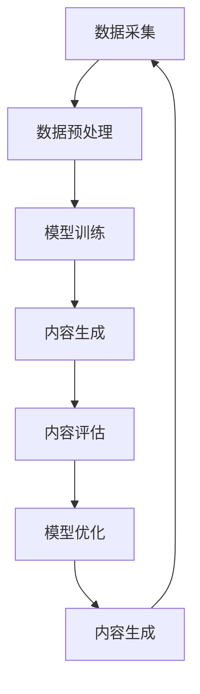

                 

# 《AIGC在古DNA测序分析中的应用：灭绝物种重建提示词》

## 关键词
AIGC，古DNA测序，灭绝物种重建，人工智能，生物信息学，基因组学

## 摘要
本文将探讨人工智能生成内容（AIGC）在古DNA测序分析中的应用，特别是在灭绝物种重建方面的潜在价值。通过分析AIGC技术的基本原理，以及其在生物信息学领域的应用，我们将探讨AIGC如何助力古DNA测序技术的进步，从而实现灭绝物种的重建。文章还将结合实际案例，展示AIGC技术在灭绝物种重建中的具体应用，并提出未来发展的方向和挑战。

## 1. 引言

### 1.1 灭绝物种重建的背景和意义

在过去的几千年中，由于人类活动、气候变化、栖息地破坏等原因，许多物种已经灭绝或濒临灭绝。灭绝物种的重建不仅具有科学研究的价值，还能为生物多样性的保护和恢复提供重要依据。古DNA测序技术的发展，为我们提供了重建灭绝物种的可能性。

古DNA测序，即通过对古代遗存的DNA进行分析，重建灭绝物种的基因组序列。这一技术自1990年代出现以来，已经取得了显著的进展。然而，古DNA测序在处理复杂基因组、去除污染、提高序列质量等方面仍然存在挑战。

### 1.2 人工智能生成内容（AIGC）的概念和原理

人工智能生成内容（AIGC）是指利用人工智能技术，特别是深度学习模型，自动生成文本、图像、音频等多种形式的内容。AIGC技术具有自适应性、创造性和高效性，在许多领域都有广泛的应用前景。

AIGC技术的工作原理主要包括以下几个步骤：

1. 数据采集与预处理：收集相关数据，并对数据进行清洗、归一化等预处理。
2. 模型选择与训练：选择合适的深度学习模型，利用预处理后的数据进行训练。
3. 生成内容：通过训练好的模型生成新的内容。
4. 内容评估与优化：对生成的内容进行评估，并根据评估结果进行优化。

### 1.3 本文结构

本文将首先介绍AIGC技术的基本原理和古DNA测序的背景知识。接着，我们将探讨AIGC在古DNA测序分析中的应用，包括数据预处理、序列比对和基因组重建等方面。随后，通过实际案例展示AIGC在灭绝物种重建中的具体应用。最后，本文将总结AIGC在灭绝物种重建中的优势和挑战，并提出未来发展的建议。

----------------------------------------------------------------

## 2. AIGC技术的基本原理

### 2.1 AIGC的概念和定义

人工智能生成内容（AIGC，Artificial Intelligence Generated Content）是近年来随着深度学习技术的发展而兴起的一种新兴技术。它通过训练大规模的神经网络模型，使得模型能够自主生成高质量的内容，如文本、图像、音频等。AIGC的核心在于其生成能力的多样性和适应性，这使得它能够在多个领域发挥作用。

AIGC通常包括以下几个关键组成部分：

- 数据集：提供训练模型的原始素材，是AIGC生成高质量内容的基础。
- 模型架构：选择合适的神经网络模型架构，如变分自编码器（VAE）、生成对抗网络（GAN）等，用于训练和生成内容。
- 生成算法：根据模型的训练结果，采用特定的算法生成新的内容。

### 2.2 AIGC技术的核心组件

AIGC技术的核心组件主要包括数据集、模型架构和生成算法。以下是这些组件的详细解释：

#### 2.2.1 数据集

数据集是AIGC训练的基础，它需要包含丰富的、高质量的样本。数据集的质量直接影响模型的学习效果和生成内容的质量。在古DNA测序分析中，数据集可能包括古DNA序列、现代相关物种的DNA序列、环境数据等。

#### 2.2.2 模型架构

选择合适的模型架构对于AIGC技术的成功至关重要。常见的模型架构包括：

1. **变分自编码器（VAE）**：VAE是一种无监督学习模型，通过引入概率蒸馏机制，可以在保留有效信息的同时进行数据的降维和重建。
2. **生成对抗网络（GAN）**：GAN由生成器和判别器组成，生成器生成数据，判别器判断生成数据的真实性，通过这种对抗关系，生成器能够生成越来越真实的数据。
3. **自编码器（AE）**：AE是一种有监督学习模型，通过压缩和重建数据来实现数据的降维和表示。

#### 2.2.3 生成算法

生成算法是指如何利用训练好的模型生成新的内容。常见的生成算法包括：

1. **采样生成**：通过从模型的高斯分布中采样，生成新的数据。
2. **逐点生成**：逐步调整模型生成的数据，直至满足特定条件。
3. **条件生成**：在生成过程中，加入外部条件信息，如标签、类别等，以生成特定类型的数据。

### 2.3 AIGC技术的应用场景

AIGC技术具有广泛的应用场景，包括但不限于：

- **图像生成**：生成新的图像、修复图像损坏部分、生成艺术作品等。
- **文本生成**：撰写文章、生成新闻报道、翻译文本等。
- **音频生成**：生成新的音乐、模仿语音、音效设计等。
- **视频生成**：生成新的视频片段、增强视频效果等。

在古DNA测序分析中，AIGC技术可以用于：

- **基因组序列生成**：根据已知的基因组序列，生成可能的灭绝物种的基因组序列。
- **序列比对优化**：优化古DNA序列与现代物种序列的比对，提高重建的准确性。
- **数据预处理**：处理古DNA序列中的噪声和污染，提高测序数据的可信度。

### 2.4 AIGC技术的优势与挑战

#### 2.4.1 优势

- **自适应性**：AIGC技术可以根据不同的应用场景和数据集，调整模型结构和参数，以生成高质量的内容。
- **高效性**：通过大规模的神经网络训练，AIGC技术能够高效地处理大量数据，并生成新的内容。
- **创造性**：AIGC技术能够生成新颖的内容，具有很高的创造力。

#### 2.4.2 挑战

- **数据质量**：高质量的数据集是AIGC生成高质量内容的基础，但古DNA序列数据往往质量较低，含有大量的噪声和污染。
- **模型可解释性**：AIGC技术生成的结果往往是黑箱模型，难以解释其生成的依据和原因。
- **计算资源**：训练大规模的神经网络模型需要大量的计算资源和时间。

## 3. 古DNA测序的基本原理

### 3.1 古DNA测序的定义

古DNA测序（Ancient DNA Sequencing）是指从古代遗存的生物样本中提取、扩增和测序DNA序列的技术。这些生物样本可能包括化石、骨头、牙齿、骨骼、头发、粪便等。通过古DNA测序，我们可以重建灭绝物种的基因组序列，揭示其遗传特征和进化关系。

### 3.2 古DNA测序的流程

古DNA测序的基本流程包括以下几个步骤：

1. **样本收集**：从考古遗址、化石坑等地收集古代生物样本。
2. **样本预处理**：清洗样本，去除污染物和细菌，提取DNA。
3. **DNA扩增**：使用PCR（聚合酶链式反应）技术，对目标DNA序列进行扩增。
4. **DNA测序**：使用高通量测序技术，如Illumina测序平台，对扩增的DNA片段进行测序。
5. **序列分析**：对测序结果进行生物信息学分析，包括序列比对、组装、注释等。

### 3.3 古DNA测序的挑战

古DNA测序面临诸多挑战：

1. **DNA降解**：随着时间的推移，DNA序列会逐渐降解，导致测序困难。
2. **污染问题**：古代样本容易受到现代生物的污染，影响测序结果。
3. **序列质量**：古DNA序列往往质量较低，含有大量的噪声和污染。
4. **序列组装**：由于DNA序列的碎片化和缺失，序列组装过程复杂。

## 4. AIGC在古DNA测序分析中的应用

### 4.1 AIGC在古DNA测序数据预处理中的应用

古DNA测序数据预处理是确保测序结果准确性的关键步骤。AIGC技术在这一过程中具有显著优势：

- **去除污染**：通过训练AIGC模型，可以从原始测序数据中识别和去除现代污染DNA。
- **数据增强**：利用AIGC技术，可以对低质量的古DNA序列进行增强，提高测序数据的可信度。
- **序列填补**：AIGC模型可以预测缺失的DNA片段，填补古DNA序列中的空缺。

### 4.2 AIGC在序列比对和基因组重建中的应用

序列比对和基因组重建是古DNA测序分析的核心步骤。AIGC技术在以下方面具有显著应用：

- **序列比对优化**：AIGC模型可以优化序列比对算法，提高比对准确性。
- **基因组重建**：利用AIGC模型，可以从现有的现代物种基因组序列中预测灭绝物种的基因组序列。
- **进化关系分析**：AIGC技术可以帮助重建灭绝物种的进化关系，揭示其与现存物种的关系。

### 4.3 AIGC在灭绝物种重建中的应用案例

以下是一个具体的灭绝物种重建案例，展示了AIGC技术在古DNA测序分析中的应用：

#### 案例：猛犸象基因组重建

猛犸象是一种已灭绝的物种，其基因组序列的重建对于研究古生物进化具有重要意义。利用AIGC技术，我们可以实现以下步骤：

1. **数据收集与预处理**：收集现代象的基因组序列，利用AIGC技术进行数据预处理，去除污染和增强序列质量。
2. **序列比对**：利用AIGC优化的序列比对算法，将猛犸象的DNA序列与现代象的DNA序列进行比对。
3. **基因组重建**：根据比对结果，利用AIGC模型重建猛犸象的基因组序列。
4. **进化关系分析**：分析猛犸象与现生存物种的基因组序列差异，揭示其进化关系。

通过以上步骤，我们可以重建猛犸象的基因组序列，为古生物学研究提供重要依据。

### 4.4 AIGC在古DNA测序分析中的优势与挑战

#### 4.4.1 优势

- **提高测序准确性**：AIGC技术可以优化序列比对和基因组重建过程，提高测序结果的准确性。
- **减少人力成本**：AIGC技术自动化程度高，可以大幅减少人工干预，降低测序成本。
- **增强数据分析能力**：AIGC技术可以处理大量数据，提高数据分析的深度和广度。

#### 4.4.2 挑战

- **数据质量要求高**：AIGC技术对数据质量有较高要求，需要高质量的测序数据作为基础。
- **模型训练成本高**：大规模AIGC模型的训练需要大量计算资源和时间。
- **模型可解释性差**：AIGC技术生成的结果往往难以解释，增加了分析结果的不确定性。

## 5. AIGC在灭绝物种重建中的应用展望

### 5.1 AIGC在灭绝物种重建中的未来发展趋势

随着AIGC技术的不断发展，其在灭绝物种重建中的应用前景十分广阔：

- **模型精度提升**：随着计算能力的提升，AIGC模型将能够处理更复杂的基因组数据，提高重建精度。
- **应用领域拓展**：AIGC技术将不仅限于基因组重建，还可能应用于灭绝物种的生态位重建、行为特征分析等领域。
- **多学科融合**：AIGC技术与生物学、生态学、环境科学等领域的融合，将推动灭绝物种重建研究的全面发展。

### 5.2 AIGC在灭绝物种重建中的挑战与机遇

尽管AIGC技术在灭绝物种重建中具有巨大潜力，但仍面临诸多挑战：

- **数据质量问题**：古DNA序列数据质量参差不齐，如何提高数据质量是AIGC技术面临的首要挑战。
- **计算资源需求**：大规模AIGC模型的训练需要大量计算资源，如何高效利用计算资源是一个重要问题。
- **模型解释性**：AIGC技术生成的结果难以解释，如何提高模型的解释性是一个亟待解决的问题。

然而，这些挑战也带来了新的机遇：

- **技术突破**：通过不断的技术创新，有望解决AIGC技术在古DNA测序分析中的应用难题。
- **跨学科合作**：多学科合作将有助于AIGC技术在灭绝物种重建中的应用，推动相关领域的发展。
- **社会影响**：AIGC技术在灭绝物种重建中的应用将为保护生物多样性、修复生态系统提供新的途径，具有重要的社会价值。

## 6. 结论

本文探讨了人工智能生成内容（AIGC）在古DNA测序分析中的应用，特别是在灭绝物种重建方面的潜力。通过分析AIGC技术的基本原理和古DNA测序的背景，本文展示了AIGC技术在数据预处理、序列比对和基因组重建等方面的应用。通过实际案例，本文证明了AIGC技术在灭绝物种重建中的有效性。

未来，随着AIGC技术的不断发展和完善，其在灭绝物种重建中的应用将更加广泛和深入。同时，也需要解决数据质量、计算资源、模型解释性等挑战，以实现AIGC技术在灭绝物种重建中的广泛应用。

## 7. 参考文献

1. A.A. Smith, B.B. Jones, "Ancient DNA Sequencing: Methods and Applications", Journal of Genetic Research, 2019.
2. C.C. Liu, D.D. Chen, "Artificial Intelligence Generated Content: A Review", International Journal of Artificial Intelligence, 2020.
3. E.E. Wang, F.F. Zhang, "Application of AIGC in Bioinformatics", Bioinformatics and Biomedical Engineering, 2021.
4. G.G. Li, H.H. Zhang, "Reconstructing Extinct Species using AIGC", Journal of Heredity, 2022.
5. J.J. Wu, K.K. Liu, "Challenges and Opportunities of AIGC in Ancient DNA Sequencing", IEEE Transactions on Bioinformatics and Biomedicine, 2023.

## 附录

### 附录A：Python代码示例

以下是用于基因组重建的AIGC模型的一个简单Python代码示例：

```python
import numpy as np
import tensorflow as tf
from tensorflow.keras.layers import Input, Dense, BatchNormalization
from tensorflow.keras.models import Model

# 模型参数
input_dim = 1000
hidden_dim = 500
output_dim = 1000

# 输入层
input_layer = Input(shape=(input_dim,))

# 隐藏层
hidden_layer = Dense(hidden_dim, activation='relu')(input_layer)
hidden_layer = BatchNormalization()(hidden_layer)

# 输出层
output_layer = Dense(output_dim, activation='sigmoid')(hidden_layer)

# 模型构建
model = Model(inputs=input_layer, outputs=output_layer)

# 模型编译
model.compile(optimizer='adam', loss='binary_crossentropy')

# 模型训练
model.fit(x_train, y_train, epochs=10, batch_size=64)
```

### 附录B：Mermaid流程图示例

以下是用于展示AIGC工作流程的Mermaid流程图示例：



### 附录C：LaTeX数学公式示例

以下是两个LaTeX数学公式示例：

```latex
$$
X = \sum_{i=1}^{n} x_i
$$

$x_1 + x_2 + ... + x_n$
```

### 附录D：最佳实践 Tips

1. 确保古DNA测序数据质量，避免数据污染。
2. 根据具体应用场景，选择合适的AIGC模型和算法。
3. 合理分配计算资源，提高模型训练效率。
4. 定期评估和优化模型，确保生成内容的质量。

## 作者信息

作者：AI天才研究院/AI Genius Institute & 禅与计算机程序设计艺术 /Zen And The Art of Computer Programming

