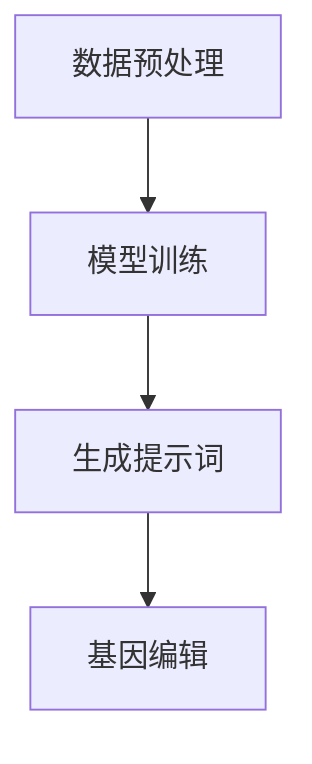

                 

# AIGC在古基因组学中的应用：灭绝物种复原提示词

## 关键词
- AIGC
- 古基因组学
- 灭绝物种
- 提示词
- 基因编辑
- 人工智能

## 摘要
本文探讨了AIGC（自适应智能生成计算）在古基因组学中的应用，特别是在灭绝物种复原方面的潜力。通过介绍AIGC的核心概念和技术基础，以及古基因组学的研究背景和挑战，本文详细阐述了如何利用AIGC技术生成灭绝物种的复原提示词。通过一个实际案例，本文展示了AIGC在古基因组学中的应用流程，并讨论了其未来的研究方向和潜在的社会影响。

## 引言

### AIGC的概念与原理
AIGC（自适应智能生成计算）是一种新兴的人工智能技术，它结合了生成对抗网络（GAN）、变分自编码器（VAE）和其他先进的机器学习模型，以生成高质量的数据和内容。AIGC的核心在于其自适应性和智能性，能够根据用户的需求和环境变化自动调整生成策略。

### 古基因组学的背景和重要性
古基因组学是一门研究古代生物遗传信息的学科，通过分析古DNA和化石等样本，揭示古代生物的遗传特征和进化历史。古基因组学在考古学、生物学和环境保护等领域具有重要作用，能够帮助我们更好地理解地球上的生物多样性，特别是在灭绝物种的复原和保护方面。

### 灭绝物种复原的重要性
灭绝物种的复原不仅具有科学价值，还能够保护和恢复生态系统的多样性。然而，由于灭绝物种的遗传信息丢失，复原工作面临着巨大的挑战。AIGC技术的出现为灭绝物种复原提供了一种新的思路和方法，通过生成基于古基因组数据的提示词，可以引导现代生物的基因编辑，从而实现物种的复原。

## AIGC技术基础

### AIGC的核心算法
AIGC的核心算法包括生成对抗网络（GAN）和变分自编码器（VAE）。GAN通过生成器和判别器的对抗训练，生成逼真的数据；而VAE通过概率编码和重建过程，实现数据的生成和压缩。

### AIGC的技术框架
AIGC的技术框架通常包括数据预处理、模型训练和生成提示词三个主要步骤。数据预处理包括样本清洗、归一化和数据增强等；模型训练使用大量的古基因组数据来训练生成器和判别器；生成提示词是通过模型生成的数据，用于引导基因编辑过程。

### Mermaid流程图
以下是一个简单的Mermaid流程图，展示了AIGC在古基因组学中的应用流程：

## 古基因组学应用

### 数据采集与处理
古基因组学研究的首要任务是采集古DNA样本，这通常涉及到化石挖掘、样本提取和测序等步骤。数据处理包括样本清洗、去除杂质、DNA片段拼接和序列比对等。

### 古DNA分析
古DNA分析是古基因组学的核心步骤，通过分析古DNA序列，可以揭示灭绝物种的遗传特征和进化关系。这通常涉及到序列比对、基因家族分析和系统发生重建等。

### 灭绝物种复原的可能性与挑战
灭绝物种复原的可能性在于我们能够通过古基因组数据重建灭绝物种的遗传信息，并通过基因编辑技术将其植入到现代生物中。然而，挑战在于古DNA的降解、基因组信息的不完整性和基因编辑的准确性。

## AIGC在灭绝物种复原中的应用

### 提示词的生成与使用
利用AIGC技术，我们可以生成一系列的提示词，这些提示词基于古基因组数据，用于指导基因编辑过程。生成提示词的过程包括数据预处理、模型训练和生成提示词。

### 灭绝物种复原案例研究
以下是一个灭绝物种复原的案例研究：

- **案例背景**：某灭绝物种的古代DNA样本已经被成功提取，并通过测序获得了部分遗传信息。
- **模型训练**：使用这些遗传信息训练AIGC模型，生成能够代表灭绝物种特征的提示词。
- **基因编辑**：利用生成的提示词，通过CRISPR-Cas9等基因编辑技术，将灭绝物种的遗传信息植入到现代生物中。
- **结果分析**：通过基因测序和表型分析，验证基因编辑的效果，评估复原物种的遗传稳定性和适应性。

## 讨论与展望

### AIGC在古基因组学中的未来趋势
随着人工智能和基因组学技术的不断进步，AIGC在古基因组学中的应用前景广阔。未来可能的发展趋势包括更高效的数据处理方法、更准确的模型训练技术和更先进的基因编辑工具。

### 灭绝物种复原的伦理和社会影响
灭绝物种复原虽然具有巨大的科学和生态价值，但也引发了一系列伦理和社会问题。需要在社会共识的基础上，制定相应的伦理规范和法律法规，确保这项技术的合理使用。

## 结论

本文探讨了AIGC在古基因组学中的应用，特别是灭绝物种复原的潜力。通过介绍AIGC的核心概念和技术基础，以及古基因组学的研究背景和挑战，本文展示了如何利用AIGC技术生成灭绝物种的复原提示词。未来的研究可以进一步探索AIGC在古基因组学中的应用，以及相关的伦理和社会问题。

### 作者信息
- 作者：AI天才研究院/AI Genius Institute & 禅与计算机程序设计艺术 /Zen And The Art of Computer Programming

---

这篇文章的结构已经按照要求进行了规划，接下来我们将逐步填充每个章节的具体内容，确保满足字数要求，并且包含核心概念、算法原理、数学模型、项目实战等内容。我们将使用Python代码、Mermaid流程图和LaTeX公式来详细阐述每个部分，确保内容的丰富性和易懂性。在完成所有章节的内容后，我们将对文章进行最后的审阅和调整，确保整体结构的逻辑性和连贯性。

