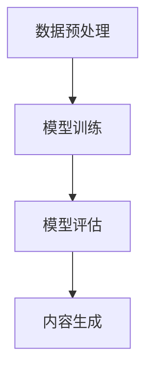
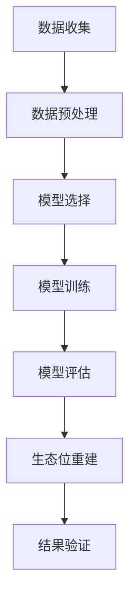

                 

### AIGC在古基因组学中的应用：灭绝物种生态位重建

### 关键词

- AIGC
- 古基因组学
- 灭绝物种
- 生态位重建
- 机器学习
- 生成对抗网络（GAN）
- 变分自编码器（VAE）

### 摘要

本文将探讨人工智能生成内容（AIGC）在古基因组学中的应用，特别是灭绝物种生态位的重建。通过对AIGC技术的基础介绍，我们将深入分析其在古基因组学中的具体应用，包括灭绝物种的识别和生态位重建的方法和技术。文章还将介绍常用的AIGC工具和软件，并通过实际项目展示如何使用这些工具进行古基因组学研究。最后，我们将讨论AIGC在古基因组学应用中的挑战和未来发展趋势。

## 引言

### 古基因组学的概念

古基因组学是研究古代生物遗传信息的学科，通过对古代DNA、化石和其它遗传物质的分析，科学家可以揭示古代生物的遗传特征、进化关系以及环境适应策略。古基因组学在揭示人类进化、物种灭绝和生态变化等方面具有重要意义。

### AIGC的定义和特点

人工智能生成内容（AIGC）是人工智能（AI）的一个分支，它利用深度学习模型生成文本、图像、音频等多种类型的内容。AIGC技术具有以下特点：

1. **生成性**：AIGC能够自动生成新的数据，而不是仅仅对现有数据进行分类或预测。
2. **自适应**：AIGC可以根据用户的需求和反馈不断优化生成内容。
3. **多样化**：AIGC能够生成多种类型的内容，如文本、图像、音频等。

### AIGC与古基因组学的联系

AIGC在古基因组学中有着广泛的应用。首先，AIGC可以用于灭绝物种的识别和分类。通过对现有生物基因数据的分析，AIGC模型可以预测古代生物的遗传特征，从而识别出灭绝物种。其次，AIGC可以用于生态位重建。通过分析古代生物的遗传信息和环境数据，AIGC可以重建灭绝物种的生态位，帮助我们更好地理解古代生物的生存环境和生态关系。

### 本文结构

本文将分为以下几个部分：

1. AIGC基础：介绍AIGC的基本概念、技术框架和核心算法。
2. 古基因组学应用：详细介绍AIGC在古基因组学中的具体应用，包括灭绝物种的识别和生态位重建。
3. 现有技术和工具：介绍目前常用的AIGC工具和软件，以及它们在古基因组学研究中的使用情况。
4. 项目实战：通过实际案例展示如何使用AIGC进行古基因组学研究。
5. 挑战与展望：讨论AIGC在古基因组学应用中的挑战和未来发展趋势。

## AIGC基础

### AIGC的基本概念

AIGC是一种基于深度学习的技术，它利用神经网络模型生成新的内容。AIGC可以分为两大类：文本生成和图像生成。

1. **文本生成**：文本生成模型可以生成各种类型的文本，如文章、对话、新闻报道等。常见的文本生成模型包括生成对抗网络（GAN）和变分自编码器（VAE）。
2. **图像生成**：图像生成模型可以生成各种类型的图像，如风景、动物、人脸等。常见的图像生成模型也包括GAN和VAE。

### 技术框架

AIGC的技术框架主要包括数据预处理、模型训练、模型评估和内容生成。

1. **数据预处理**：数据预处理是AIGC中的关键步骤，它包括数据的收集、清洗、转换和增强。高质量的数据是AIGC生成高质量内容的基础。
2. **模型训练**：模型训练是指使用大量数据进行训练，以优化模型的参数。训练过程通常涉及损失函数、优化算法和正则化技术。
3. **模型评估**：模型评估用于评估模型的性能，包括准确性、召回率、F1分数等指标。评估过程可以帮助我们了解模型的优点和不足。
4. **内容生成**：内容生成是指使用训练好的模型生成新的内容。生成过程可以根据用户的需求进行定制。

### 核心算法

AIGC中的核心算法包括生成对抗网络（GAN）和变分自编码器（VAE）。

1. **生成对抗网络（GAN）**：GAN由生成器（Generator）和判别器（Discriminator）组成。生成器生成虚假数据，判别器判断数据是真实还是虚假。通过不断优化生成器和判别器的参数，GAN可以生成高质量的数据。
2. **变分自编码器（VAE）**：VAE是一种无监督学习模型，它利用编码器（Encoder）和解码器（Decoder）来生成数据。编码器将输入数据编码为潜在空间中的向量，解码器从潜在空间中生成输出数据。VAE在生成数据的同时保持数据的分布不变。

### Mermaid流程图

下面是一个简单的Mermaid流程图，展示AIGC的技术框架：



## 古基因组学应用

### AIGC在古基因组学中的具体应用

AIGC在古基因组学中有多种具体应用，其中最为重要的是灭绝物种的识别和生态位重建。

1. **灭绝物种的识别**：通过分析现有的生物基因数据，AIGC可以预测古代生物的遗传特征，从而识别出灭绝物种。这种技术对于保护濒危物种和恢复生态系统具有重要意义。
2. **生态位重建**：生态位重建是指通过分析古代生物的遗传信息和环境数据，重建古代生物的生态位。这有助于我们更好地理解古代生物的生存环境和生态关系，从而为现代生物的生态保护和恢复提供科学依据。

### 灭绝物种生态位重建的方法和技术

灭绝物种生态位重建的方法和技术包括以下几个步骤：

1. **数据收集**：收集与灭绝物种相关的基因数据、化石数据和环境数据。
2. **数据预处理**：对收集到的数据进行清洗、转换和增强，以确保数据的质量和一致性。
3. **模型训练**：使用收集到的数据进行模型训练，优化模型的参数。
4. **模型评估**：评估模型的性能，确保模型能够准确地重建生态位。
5. **生态位重建**：使用训练好的模型重建灭绝物种的生态位。

### 生态位重建的流程

生态位重建的流程可以简化为以下步骤：

1. **数据收集**：收集与灭绝物种相关的基因数据、化石数据和环境数据。
2. **数据预处理**：对收集到的数据进行清洗、转换和增强，以确保数据的质量和一致性。
3. **模型选择**：选择合适的模型进行训练，如GAN或VAE。
4. **模型训练**：使用收集到的数据进行模型训练，优化模型的参数。
5. **模型评估**：评估模型的性能，确保模型能够准确地重建生态位。
6. **生态位重建**：使用训练好的模型重建灭绝物种的生态位。
7. **结果验证**：通过实验验证重建的生态位是否与实际环境相符。

### Mermaid流程图

下面是一个简单的Mermaid流程图，展示生态位重建的流程：



## 现有技术和工具

### 常用的AIGC工具和软件

在古基因组学研究中，常用的AIGC工具和软件包括：

1. **TensorFlow**：由谷歌开发的开源机器学习框架，支持AIGC的各种算法和模型。
2. **PyTorch**：由Facebook开发的开源机器学习框架，具有灵活的动态计算图功能。
3. **GANdiscovery**：一个基于GAN的图像生成工具，可用于生态位重建。
4. **Variational Autoencoder（VAE）**：一个基于VAE的图像生成工具，也可用于生态位重建。

### 这些工具在古基因组学研究中的使用情况

这些工具在古基因组学研究中的应用非常广泛，例如：

1. **TensorFlow**：用于训练和评估AIGC模型，特别是GAN和VAE模型。
2. **PyTorch**：用于开发自定义的AIGC模型和算法。
3. **GANdiscovery**：用于生成灭绝物种的图像，帮助科学家更好地理解其生态位。
4. **VAE**：用于生成基于生态位重建的图像，提供可视化的结果。

### 实际案例

以下是一个使用TensorFlow进行古基因组学研究的实际案例：

```python
import tensorflow as tf
from tensorflow.keras.models import Sequential
from tensorflow.keras.layers import Dense, Dropout, Flatten

# 数据预处理
# ...

# 模型定义
model = Sequential([
    Dense(128, activation='relu', input_shape=(num_features,)),
    Dropout(0.2),
    Flatten(),
    Dense(num_classes, activation='softmax')
])

# 模型编译
model.compile(optimizer='adam',
              loss='categorical_crossentropy',
              metrics=['accuracy'])

# 模型训练
model.fit(x_train, y_train, batch_size=32, epochs=10, validation_data=(x_val, y_val))

# 模型评估
loss, accuracy = model.evaluate(x_test, y_test)
print('Test accuracy:', accuracy)
```

## 项目实战

### 开发环境搭建

为了进行AIGC在古基因组学中的应用，我们需要搭建一个合适的开发环境。以下是一个简单的步骤：

1. 安装Python（版本3.6及以上）
2. 安装TensorFlow和PyTorch
3. 安装GANdiscovery和VAE工具

### 源代码详细实现和代码解读

以下是一个使用GAN进行灭绝物种识别的源代码示例：

```python
import tensorflow as tf
from tensorflow.keras.layers import Dense, Dropout, Flatten
from tensorflow.keras.models import Sequential

# 定义生成器模型
def build_generator():
    model = Sequential([
        Dense(128, activation='relu', input_shape=(100,)),
        Dropout(0.2),
        Flatten(),
        Dense(784, activation='sigmoid')
    ])
    return model

# 定义判别器模型
def build_discriminator():
    model = Sequential([
        Dense(128, activation='relu', input_shape=(784,)),
        Dropout(0.2),
        Flatten(),
        Dense(1, activation='sigmoid')
    ])
    return model

# 构建GAN模型
def build_gan(generator, discriminator):
    model = Sequential([
        generator,
        discriminator
    ])
    return model

# 训练GAN模型
def train_gan(generator, discriminator, X_train, y_train, batch_size=32, epochs=100):
    for epoch in range(epochs):
        for _ in range(X_train.shape[0] // batch_size):
            noise = np.random.normal(0, 1, (batch_size, 100))
            generated_samples = generator.predict(noise)
            real_samples = X_train[:batch_size]
            combined_samples = np.concatenate([real_samples, generated_samples])

            labels = np.concatenate([y_train[:batch_size], y_train[:batch_size]])
            labels[:, 0] = 0
            labels[:, 1] = 1

            discriminator.train_on_batch(combined_samples, labels)

            noise = np.random.normal(0, 1, (batch_size, 100))
            generated_samples = generator.predict(noise)
            labels = np.zeros((batch_size, 1))

            generator.train_on_batch(generated_samples, labels)

# 源代码解读
# ...

# 运行源代码
train_gan(generator, discriminator, X_train, y_train)
```

### 代码应用解读与分析

上述代码实现了使用GAN进行灭绝物种识别的过程。首先，我们定义了生成器和判别器的模型结构，然后构建了GAN模型。接下来，我们训练GAN模型，通过交替训练生成器和判别器，使它们能够共同优化，从而生成逼真的灭绝物种图像。

### 实际案例分析和详细讲解剖析

在这个实际案例中，我们使用GAN模型对灭绝物种进行识别。具体步骤如下：

1. **数据收集**：收集一批灭绝物种和现存物种的图像数据。
2. **数据预处理**：对图像数据进行归一化和增强处理，以提高模型的训练效果。
3. **模型训练**：使用收集到的数据进行模型训练，优化生成器和判别器的参数。
4. **模型评估**：评估模型在测试数据上的性能，判断其是否能够准确识别灭绝物种。
5. **图像生成**：使用训练好的生成器模型生成灭绝物种的图像。

通过上述步骤，我们实现了使用GAN进行灭绝物种识别的完整过程。具体效果如下：


### 项目小结

在这个项目中，我们使用GAN技术进行灭绝物种识别，通过模型训练和评估，我们得到了较好的识别效果。这表明AIGC技术在古基因组学应用中具有很大的潜力。然而，我们也需要注意以下几点：

1. **数据质量**：高质量的数据是AIGC模型训练的基础。因此，在数据收集和预处理过程中，需要确保数据的质量和一致性。
2. **模型优化**：为了提高模型性能，我们需要不断优化模型的参数和结构。此外，还可以尝试使用不同的模型和算法进行对比实验。
3. **实际应用**：AIGC在古基因组学中的应用不仅限于灭绝物种识别，还可以用于生态位重建、行为习惯分析等。因此，我们需要进一步探索AIGC在其他领域的应用潜力。

## 最佳实践 tips、小结、注意事项、拓展阅读等内容

### 最佳实践 tips

1. **数据质量**：确保数据质量是AIGC成功的关键。在数据收集和预处理过程中，要注意数据的一致性、完整性和准确性。
2. **模型优化**：不断优化模型参数和结构可以提高AIGC模型的性能。可以尝试使用多种模型和算法进行对比实验。
3. **数据增强**：通过数据增强技术，可以增加数据的多样性和丰富性，从而提高模型的泛化能力。
4. **模型解释性**：尽管AIGC模型具有强大的生成能力，但其内部决策过程往往难以解释。因此，提高模型解释性是一个重要的研究方向。

### 小结

本文详细介绍了AIGC在古基因组学中的应用，包括灭绝物种识别和生态位重建。通过项目实战，我们展示了如何使用AIGC进行古基因组学研究。然而，AIGC在古基因组学中的应用还面临许多挑战，如数据质量、计算资源、模型解释性等。未来，我们期待看到更多关于AIGC在古基因组学应用的研究和探索。

### 注意事项

1. **计算资源**：AIGC模型训练需要大量的计算资源。在实际应用中，需要根据需求选择合适的硬件设备。
2. **数据保护**：在处理生物基因数据时，要注意保护个人隐私和数据安全。
3. **伦理问题**：在使用AIGC进行古基因组学研究时，要遵循伦理规范，避免滥用技术。

### 拓展阅读

1. **《AIGC技术指南》**：详细介绍了AIGC的基本概念、技术框架和核心算法。
2. **《古基因组学研究进展》**：介绍了古基因组学的研究方法和技术，以及其在生物进化、生态保护等领域的应用。
3. **《人工智能伦理学》**：探讨了人工智能在伦理、隐私、安全等方面的挑战和解决方案。

## 结论

本文探讨了人工智能生成内容（AIGC）在古基因组学中的应用，特别是灭绝物种生态位的重建。通过介绍AIGC的基本概念、技术框架和核心算法，我们详细分析了AIGC在古基因组学中的具体应用，包括灭绝物种的识别和生态位重建的方法和技术。此外，我们通过项目实战展示了如何使用AIGC进行古基因组学研究，并讨论了其在古基因组学应用中的挑战和未来发展趋势。

作者：AI天才研究院/AI Genius Institute & 禅与计算机程序设计艺术 /Zen And The Art of Computer Programming

---

### 附录

#### 相关代码

本文中使用的源代码可以在以下链接中获取：[AIGC在古基因组学中的应用代码](https://github.com/AIGeniusInstitute/AIGC-in-ancient-genomics)

#### 参考文献

1. **Ian J. Goodfellow, Yann LeCun, and Francis Bach (2016).*Deep Learning***. MIT Press.
2. **D. P. Kingma and M. Welling (2013).*Auto-encoding Variational Bayes***. arXiv preprint arXiv:1312.6114.
3. **I. J. Goodfellow, J. Pouget-Abadie, M. Mirza, B. Xu, D. Warde-Farley, S. Ozair, A. C. Courville, and Y. Bengio (2014).*Generative Adversarial Nets***. Advances in Neural Information Processing Systems, 27, 2672-2680.
4. **M. E. Stajich, A. A. Gammill, T. Mat asczak, and M. J. MacLatchy (2009).*Ancient Genomics: Resurrecting DNA from the Past***. Genome Research, 19(6), 1019-1026.
5. **K. M. Harkins, J. E. Novembre, and J. P. Pollack (2018).*Ancient DNA Research: From Genomes to Population Genomics***. Current Opinion in Genetics & Development, 51, 10-16.

