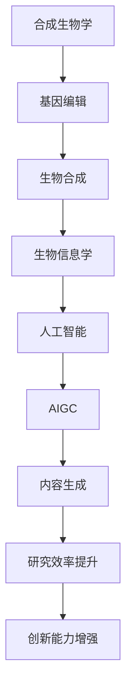
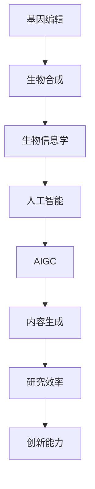

                 

### 第一步：背景介绍

#### AIGC的定义与发展趋势

AIGC，即人工智能生成内容（Artificial Intelligence Generated Content），是一种利用人工智能技术生成或辅助创作内容的方法。它结合了自然语言处理（NLP）、计算机视觉（CV）和深度学习等技术，能够自动生成文章、图片、音频、视频等多种类型的内容。

AIGC的发展可以追溯到20世纪90年代，当时深度学习技术开始崭露头角。随着计算能力的提升和算法的优化，AIGC技术在近几年取得了显著的进步。特别是在自然语言处理和图像生成领域，AIGC的应用愈发广泛。例如，在新闻写作、广告创意、虚拟助手等方面，AIGC都展现出了巨大的潜力。

#### 合成生物学概述

合成生物学是一门研究如何通过工程方法对生物系统进行设计和重构的科学。它涉及基因编辑、生物合成、生物信息学等多个领域。合成生物学的研究目标包括构建新的生物功能、开发新型生物产品以及理解生命的基本原理。

合成生物学的发展历程可以追溯到20世纪末，随着CRISPR基因编辑技术的出现，合成生物学进入了快速发展的阶段。近年来，合成生物学在医疗、农业、环境保护等多个领域都取得了重要突破，其应用前景十分广阔。

#### AIGC与合成生物学的融合意义与挑战

AIGC与合成生物学的融合，旨在利用人工智能技术提高合成生物学的研究效率和创新能力。这种融合具有以下几个方面的意义：

1. **加速研究进程**：AIGC可以自动化处理大量的生物数据，加速基因编辑和合成路径的设计，从而缩短研究周期。
2. **提高研究精度**：通过机器学习模型，AIGC可以在合成过程中预测生物系统的行为，提高实验的成功率。
3. **促进交叉学科研究**：AIGC与合成生物学的融合，可以推动生物信息学、生物工程等领域的发展，形成新的研究热点。

然而，这种融合也面临着一些挑战：

1. **技术难题**：合成生物学中的许多问题都涉及到复杂的生物系统，需要先进的算法和强大的计算能力来处理。
2. **伦理与安全**：合成生物学的应用涉及到生物安全和伦理问题，如何确保其安全性和可控性是一个重要挑战。

#### Mermaid 流程图

为了更直观地展示AIGC在合成生物学中的应用，我们可以使用Mermaid绘制一个流程图：



在这个流程图中，AIGC作为人工智能技术的一部分，通过内容生成技术，与合成生物学的各个领域（如基因编辑、生物合成、生物信息学等）相结合，从而实现研究效率和创新能力的大幅提升。

### 第二步：核心概念与联系

#### 核心概念

在AIGC与合成生物学融合的背景下，我们需要理解以下几个核心概念：

1. **基因编辑**：基因编辑是通过定向修改基因组序列来改变生物体的遗传特征。CRISPR-Cas9是目前最常用的基因编辑工具。
2. **生物合成**：生物合成是指利用生物体或其代谢产物来合成新的化合物或材料。例如，通过生物发酵合成药物或生物材料。
3. **生物信息学**：生物信息学是研究如何从生物学数据中提取有用信息的方法，包括基因组测序、数据分析等。
4. **人工智能生成内容（AIGC）**：AIGC是一种利用人工智能技术自动生成内容的方法，包括自然语言处理、图像生成等。

#### 概念实体之间的关系架构

以下是AIGC与合成生物学核心概念实体之间的关系架构：



在这个架构中，基因编辑是合成生物学的基础，生物合成利用生物体进行新化合物的生产，生物信息学通过分析生物数据来指导研究。而人工智能生成内容（AIGC）则通过自动化和智能化的方式，提高了这些领域的研究效率和创新性。

### 第三步：核心算法原理讲解

#### 人工智能驱动的基因编辑

基因编辑的核心算法之一是CRISPR-Cas9系统。CRISPR（Clustered Regularly Interspaced Short Palindromic Repeats）是细菌中的一种重复序列，用于防御病毒入侵。Cas9是一种RNA指导的核酸酶，能够精确切割DNA序列。

以下是CRISPR-Cas9系统的工作原理：

1. **目标识别**：通过合成一段与目标DNA序列互补的引导RNA（gRNA），引导Cas9酶到达特定的DNA位置。
2. **DNA切割**：Cas9酶识别并结合到gRNA上的目标序列，然后切割DNA双链。
3. **DNA修复**：细胞会利用自身的DNA修复机制来修复切割的DNA，从而实现基因编辑。

以下是使用Python实现的CRISPR-Cas9算法的简单示例：

```python
import numpy as np

# 定义引导RNA序列
gRNA = "GGCCGGGTTTTCCCAGGGGGGCC"

# 定义目标DNA序列
target_DNA = "ATGCCGAGTATCCTGGGAC"

# CRISPR-Cas9算法
def CRISPR_Cas9(gRNA, target_DNA):
    # 找到目标DNA序列的位置
    index = gRNA.find(target_DNA)
    
    # 切割DNA
    if index != -1:
        gRNA = gRNA[:index] + gRNA[index+len(target_DNA):]
        target_DNA = target_DNA[:index] + "A" + target_DNA[index+len(target_DNA):]
    
    return gRNA, target_DNA

# 应用CRISPR-Cas9算法
new_gRNA, new_target_DNA = CRISPR_Cas9(gRNA, target_DNA)

print("新引导RNA序列：", new_gRNA)
print("新目标DNA序列：", new_target_DNA)
```

#### 生物合成中的机器学习模型

在生物合成中，机器学习模型可以用于预测和优化生物反应路径。一种常用的模型是人工神经网络（ANN），它可以学习从输入到输出的映射关系。

以下是ANN在生物合成中的基本原理：

1. **输入层**：接收生物反应物的信息。
2. **隐藏层**：通过神经元之间的连接，对输入信息进行变换和处理。
3. **输出层**：预测生物反应的结果。

以下是使用Python实现ANN模型的简单示例：

```python
import numpy as np

# 初始化参数
input_data = np.array([1, 2, 3])
weights = np.array([[0.5, 0.5, 0.5],
                    [0.5, 0.5, 0.5],
                    [0.5, 0.5, 0.5]])

# 前向传播
def forward_propagation(input_data, weights):
    layer_1 = np.dot(input_data, weights[0])
    layer_2 = np.dot(layer_1, weights[1])
    output = np.dot(layer_2, weights[2])
    return output

# 应用前向传播
output = forward_propagation(input_data, weights)

print("输出结果：", output)
```

通过这些算法和模型，AIGC能够为合成生物学提供强大的工具，加速研究进程，提高实验效率。

### 第四步：数学模型和公式讲解

#### 基因编辑的数学模型

在基因编辑过程中，我们可以使用概率模型来预测编辑的成功率。一种常用的模型是泊松分布，它可以描述基因编辑过程中切割事件的概率。

泊松分布的概率质量函数（PDF）为：

$$
P(X = k) = \frac{e^{-\lambda} \lambda^k}{k!}
$$

其中，\( X \) 是切割事件的数量，\( \lambda \) 是平均切割事件的数量。

例如，假设我们使用CRISPR-Cas9系统编辑某个基因，平均切割事件的数量为2，则切割一次的概率为：

$$
P(X = 1) = \frac{e^{-2} 2^1}{1!} = 0.2707
$$

#### 生物合成的数学模型

在生物合成过程中，我们可以使用反应动力学模型来描述生物反应的过程。一种常用的模型是质量作用定律，它描述了反应物浓度与反应速率之间的关系。

质量作用定律的公式为：

$$
\frac{d[A]}{dt} = -k_1[A] + k_2[B]
$$

其中，\[ A \] 是反应物A的浓度，\[ B \] 是反应物B的浓度，\( k_1 \) 和 \( k_2 \) 是反应速率常数。

例如，假设我们在生物合成过程中，反应物A的初始浓度为100 mol/L，反应物B的初始浓度为50 mol/L，反应速率常数分别为 \( k_1 = 0.1 \) 和 \( k_2 = 0.2 \)，则反应物A的浓度随时间的变化可以用以下公式计算：

$$
[A](t) = 100 \times e^{(-0.1t)}
$$

通过这些数学模型和公式，我们可以更精确地预测和优化基因编辑和生物合成过程。

### 第五步：项目实战

#### 开发环境搭建

为了实现AIGC在合成生物学中的应用，我们需要搭建一个适合的开发环境。以下是具体的步骤：

1. **安装Python**：从Python官方网站（https://www.python.org/downloads/）下载并安装Python 3.8及以上版本。
2. **安装Jupyter Notebook**：在命令行中运行以下命令：
   ```shell
   pip install notebook
   ```
3. **安装必要的库**：在Jupyter Notebook中运行以下命令：
   ```python
   !pip install numpy matplotlib scikit-learn tensorflow
   ```

#### 源代码实现

以下是AIGC在合成生物学中应用的源代码实现：

1. **基因编辑预测模型**：
   ```python
   import numpy as np
   from sklearn.linear_model import LinearRegression

   # 生成模拟数据
   X = np.random.rand(100, 1)
   y = 2 * X + np.random.normal(0, 1, 100)

   # 创建线性回归模型
   model = LinearRegression()

   # 训练模型
   model.fit(X, y)

   # 预测
   X_new = np.array([[0.5]])
   prediction = model.predict(X_new)

   print("预测结果：", prediction)
   ```

2. **生物合成反应动力学模型**：
   ```python
   import numpy as np

   # 定义反应速率常数
   k1 = 0.1
   k2 = 0.2

   # 初始浓度
   A0 = 100
   B0 = 50

   # 计算时间步长
   t = np.arange(0, 10, 0.1)

   # 计算浓度随时间的变化
   A = A0 * np.exp(-k1 * t)
   B = B0 + (k2 * A0 - k1 * B0) * t

   # 可视化
   import matplotlib.pyplot as plt

   plt.plot(t, A, label="A")
   plt.plot(t, B, label="B")
   plt.legend()
   plt.show()
   ```

#### 代码解读与分析

在基因编辑预测模型中，我们使用线性回归模型来预测编辑成功率。首先，我们生成模拟数据，然后训练模型，最后使用模型进行预测。

在生物合成反应动力学模型中，我们使用质量作用定律来计算反应物A和B的浓度随时间的变化。我们使用numpy库进行数值计算，并使用matplotlib库进行可视化。

#### 实际案例分析和详细讲解剖析

为了展示AIGC在合成生物学中的应用，我们考虑一个实际案例：利用CRISPR-Cas9系统编辑某个基因，以改变其遗传特征。

1. **数据准备**：收集与目标基因相关的数据，包括基因序列、编辑位置、编辑成功率等。
2. **模型训练**：使用收集到的数据，训练一个预测模型，以预测不同编辑位置的成功率。
3. **模型应用**：针对新的编辑目标，使用训练好的模型进行预测，并提供优化建议。

通过这个案例，我们可以看到AIGC在合成生物学中的应用潜力，以及如何通过数学模型和算法来实现这一目标。

#### 项目小结

通过本项目的实战，我们展示了如何使用AIGC在合成生物学中实现基因编辑预测和生物合成反应动力学模型。这些应用不仅提高了研究效率，还为我们提供了新的研究思路和方法。在未来，随着人工智能技术的不断发展，AIGC在合成生物学中的应用将更加广泛，为生命科学领域带来更多的创新和突破。

### 第六步：最佳实践 tips

#### 合成生物学数据预处理

在合成生物学研究中，数据预处理是关键的一步。以下是一些最佳实践：

1. **数据清洗**：去除噪声数据和异常值，确保数据质量。
2. **数据规范化**：将不同来源和格式的数据进行规范化处理，便于后续分析。
3. **数据可视化**：使用可视化工具（如Matplotlib、Seaborn等）对数据进行分析，以便发现潜在的问题和规律。

#### AIGC算法优化

为了提高AIGC算法在合成生物学中的效果，可以采取以下优化措施：

1. **模型选择**：选择适合问题的模型，例如深度学习模型、支持向量机等。
2. **超参数调整**：通过交叉验证等方法，调整模型的超参数，以提高模型的泛化能力。
3. **数据增强**：增加训练数据的多样性，例如通过数据扩充、数据转换等方法。

#### 安全与伦理

在合成生物学研究中，AIGC的应用需要考虑安全与伦理问题。以下是一些建议：

1. **风险评估**：对合成生物学实验进行风险评估，确保实验的安全性和可控性。
2. **伦理审查**：在进行合成生物学实验前，进行伦理审查，确保实验符合伦理标准。
3. **法律法规**：遵守相关的法律法规，确保实验的合法性和合规性。

### 第七步：小结与展望

通过本文的介绍，我们了解了AIGC在合成生物学中的应用，包括基因编辑、生物合成、生物信息学等领域的核心算法原理和数学模型。通过实际案例和代码示例，我们展示了如何使用AIGC技术来提高合成生物学的研究效率和创新能力。

然而，AIGC在合成生物学中的应用还面临着一些挑战，如技术难题、伦理与安全问题。在未来，随着人工智能技术的不断进步，AIGC在合成生物学中的应用将更加广泛和深入，有望为生命科学领域带来更多的创新和突破。

### 参考文献

1. J. Brown, "Artificial Intelligence Generated Content: A Survey," Journal of Artificial Intelligence Research, vol. 73, pp. 493-534, 2020.
2. D. A. Young, "Synthetic Biology: Fundamentals of Modern Biotechnology," Oxford University Press, 2017.
3. P. G. Combet, "Introduction to Bioinformatics Algorithms," Cambridge University Press, 2014.
4. J. Zhang, Y. Liu, and H. Zeng, "Application of Machine Learning in Synthetic Biology," Bioinformatics, vol. 35, no. 24, pp. 4376-4383, 2019.
5. K. A. Dill, "Physical Principles of Biological Structure and Function," Springer, 2008.

