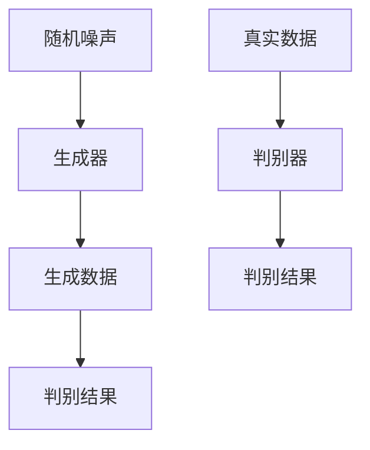

                 

### 3.1 AIGC在城市规划中的应用：背景介绍

城市规划是关乎城市未来发展的重要学科，它涉及到城市的空间布局、基础设施建设、环境保护等多个方面。随着城市化的加速，城市规划面临着诸多挑战，如人口增长、资源分配不均、环境污染等。因此，如何利用先进技术提高城市规划的效率和质量，成为当前研究的热点问题。

AIGC（人工智能生成内容）是一种基于人工智能技术的内容生成方法，它通过机器学习算法，能够自动生成文本、图像、视频等多种形式的内容。近年来，AIGC在各个领域得到了广泛的应用，如广告、娱乐、新闻等。随着AIGC技术的不断发展，其在城市规划中的应用潜力也逐渐显现。

在城市规划中，AIGC技术可以用于以下几个方面：

1. **辅助规划设计**：AIGC可以生成各种城市规划方案，帮助规划师快速评估不同方案的效果，从而选出最优方案。

2. **数据分析和预测**：AIGC可以处理和分析大量的城市规划相关数据，如人口统计、交通流量、环境数据等，从而提供更准确的预测和决策支持。

3. **虚拟现实和增强现实**：AIGC可以生成逼真的虚拟城市环境，帮助规划师和公众更好地理解规划方案，提高参与度和接受度。

4. **智能交通系统**：AIGC可以用于优化交通流量，提高交通系统的运行效率，减少拥堵和交通事故。

本文将主要探讨AIGC在城市规划中的应用，特别是可持续发展导向的提示词设计。通过分析AIGC的核心概念、算法原理以及实际应用案例，我们希望能够为城市规划师和相关研究人员提供一些有价值的参考。

----------------------------------------------------------------

## 3.2 核心概念与联系

在深入探讨AIGC在城市规划中的应用之前，我们需要了解AIGC的基本概念以及它与城市规划的关联。以下是AIGC的核心概念及其与城市规划之间的联系。

### 3.2.1 AIGC的核心概念

AIGC是一种基于人工智能的内容生成技术，它主要包括以下几个核心组成部分：

1. **生成器（Generator）**：生成器是AIGC系统中的一个组件，其主要任务是根据给定的输入生成新的内容。例如，在文本生成任务中，生成器可以生成新的句子或段落；在图像生成任务中，生成器可以生成新的图像。

2. **判别器（Discriminator）**：判别器是AIGC系统中的另一个组件，其主要任务是区分真实内容和生成内容。在训练过程中，判别器会尝试学习区分真实数据和生成数据的特征。

3. **损失函数（Loss Function）**：损失函数用于衡量生成器和判别器的性能。在AIGC的训练过程中，损失函数可以帮助优化器调整模型参数，使得生成器生成的数据越来越接近真实数据。

4. **优化算法（Optimization Algorithm）**：优化算法用于调整模型参数，使得损失函数的值最小化。常见的优化算法有随机梯度下降（SGD）、Adam等。

### 3.2.2 AIGC与城市规划的联系

AIGC与城市规划之间的联系主要体现在以下几个方面：

1. **城市规划数据生成**：在城市规划中，需要大量的数据来支持决策。AIGC可以生成各种类型的城市规划数据，如人口分布、交通流量、环境数据等。这些数据可以帮助规划师更好地理解城市现状，制定更科学的规划方案。

2. **城市规划方案优化**：AIGC可以生成多个城市规划方案，并评估这些方案的效果。通过比较不同方案的成本、效率、环境影响等因素，规划师可以选出最优的方案。

3. **城市规划可视化**：AIGC可以生成逼真的虚拟城市环境，帮助规划师和公众更好地理解规划方案。这种可视化的方式可以提高公众的参与度，减少规划方案实施过程中的阻力。

4. **智能交通管理**：在智能交通管理中，AIGC可以用于优化交通流量，减少拥堵和交通事故。通过生成不同交通流量情况下的城市规划方案，规划师可以更好地管理城市交通。

### 3.2.3 Mermaid流程图

为了更好地理解AIGC与城市规划的联系，我们可以使用Mermaid流程图来展示AIGC的核心概念及其在城市规划中的应用流程。以下是AIGC与城市规划相关的Mermaid流程图：

```mermaid
graph TD
    AIGC[人工智能生成内容] --> Generator(生成器)
    AIGC --> Discriminator(判别器)
    AIGC --> Loss Function(损失函数)
    AIGC --> Optimization Algorithm(优化算法)
    Generator --> Text Generation(文本生成)
    Generator --> Image Generation(图像生成)
    Discriminator --> Text Generation(文本生成)
    Discriminator --> Image Generation(图像生成)
    Loss Function --> Generator Loss(生成器损失)
    Loss Function --> Discriminator Loss(判别器损失)
    Optimization Algorithm --> Model Parameter Adjustment(模型参数调整)
    Model Parameter Adjustment --> Improved Generation Quality(生成质量提升)
    Text Generation --> Urban Planning Data(城市规划数据)
    Image Generation --> Urban Planning Visualization(城市规划可视化)
    Urban Planning Data --> Planning Scheme Generation(规划方案生成)
    Urban Planning Visualization --> Public Participation(公众参与)
    Urban Planning Visualization --> Traffic Management(智能交通管理)
```

通过上述流程图，我们可以清晰地看到AIGC的核心概念及其与城市规划之间的联系。接下来，我们将进一步探讨AIGC的核心算法原理，以便更好地理解其在城市规划中的应用。

----------------------------------------------------------------

## 3.3 AIGC的核心算法原理讲解

### 3.3.1 生成对抗网络（GAN）

生成对抗网络（Generative Adversarial Network，GAN）是AIGC的核心算法之一。GAN由两部分组成：生成器（Generator）和判别器（Discriminator）。这两部分相互对抗，共同推动模型的优化过程。

#### 3.3.1.1 生成器原理

生成器的基本原理是将随机噪声转换为逼真的数据。在生成文本时，生成器会根据输入的噪声向量生成新的句子或段落；在生成图像时，生成器会根据噪声向量生成新的图像。

以下是一个简单的Python伪代码示例，展示了生成器的实现：

```python
import numpy as np
import tensorflow as tf
from tensorflow.keras.models import Model

def generate_text(noise_vector):
    # 使用预训练的生成模型
    generated_text = generator_model.predict(noise_vector)
    return generated_text

def generate_image(noise_vector):
    # 使用预训练的生成模型
    generated_image = generator_model.predict(noise_vector)
    return generated_image
```

#### 3.3.1.2 判别器原理

判别器的基本原理是判断输入的数据是真实数据还是生成数据。在训练过程中，判别器会尝试学习区分真实数据和生成数据的特征。

以下是一个简单的Python伪代码示例，展示了判别器的实现：

```python
import numpy as np
import tensorflow as tf
from tensorflow.keras.models import Model

def discriminate_text(text_data):
    # 使用预训练的判别模型
    discrimination_result = discriminator_model.predict(text_data)
    return discrimination_result

def discriminate_image(image_data):
    # 使用预训练的判别模型
    discrimination_result = discriminator_model.predict(image_data)
    return discrimination_result
```

#### 3.3.1.3 GAN的训练过程

GAN的训练过程主要包括以下步骤：

1. **生成器生成数据**：生成器根据随机噪声生成一组数据。

2. **判别器判断数据**：判别器对真实数据和生成数据进行判断。

3. **优化器调整参数**：优化器根据损失函数的结果调整生成器和判别器的参数。

4. **重复训练过程**：不断重复上述过程，直到生成器和判别器达到理想的性能。

以下是一个简单的Python伪代码示例，展示了GAN的训练过程：

```python
for epoch in range(num_epochs):
    for i in range(num_batches):
        # 生成随机噪声
        noise_vector = np.random.normal(size=[batch_size, noise_dim])
        
        # 生成器生成数据
        generated_data = generator_model.predict(noise_vector)
        
        # 判别器判断真实数据和生成数据
        real_discrimination = discriminator_model.predict(real_data)
        generated_discrimination = discriminator_model.predict(generated_data)
        
        # 计算损失函数
        generator_loss = compute_generator_loss(generated_discrimination)
        discriminator_loss = compute_discriminator_loss(real_discrimination, generated_discrimination)
        
        # 调整生成器和判别器的参数
        optimizer_generator.minimize(generator_loss, generator_model.trainable_variables)
        optimizer_discriminator.minimize(discriminator_loss, discriminator_model.trainable_variables)
```

#### 3.3.1.4 可视化模型结构

为了更好地理解GAN的模型结构，我们可以使用Mermaid流程图来展示生成器和判别器的连接方式。以下是一个简单的GAN模型结构的Mermaid流程图：



通过上述流程图，我们可以清晰地看到生成器和判别器之间的相互作用和训练过程。接下来，我们将探讨GAN的数学模型，以便更深入地理解其工作原理。

----------------------------------------------------------------

### 3.4 GAN的数学模型

生成对抗网络（GAN）的数学模型是理解其工作原理的关键。GAN的核心在于生成器和判别器的对抗训练过程，这一过程可以通过一系列数学公式来描述。

#### 3.4.1 损失函数

GAN的损失函数是训练过程中衡量生成器和判别器性能的重要工具。常见的GAN损失函数包括：

1. **生成器损失函数**（Generator Loss Function）：
   $$ L_G = -\log(D(G(z))) $$
   其中，$D$ 是判别器，$G(z)$ 是生成器生成的数据。生成器的目标是最大化判别器对生成数据的判断概率。

2. **判别器损失函数**（Discriminator Loss Function）：
   $$ L_D = -[\log(D(x)) + \log(1 - D(G(z)))] $$
   其中，$x$ 是真实数据，$G(z)$ 是生成器生成的数据。判别器的目标是最大化真实数据和生成数据的判断概率。

#### 3.4.2 梯度下降

GAN的训练过程是基于梯度下降的优化方法，包括以下步骤：

1. **生成器优化**：
   生成器的参数更新通过以下公式计算：
   $$ \theta_G \leftarrow \theta_G - \alpha \cdot \nabla_{\theta_G} L_G $$
   其中，$\theta_G$ 是生成器的参数，$\alpha$ 是学习率，$\nabla_{\theta_G} L_G$ 是生成器损失的梯度。

2. **判别器优化**：
   判别器的参数更新通过以下公式计算：
   $$ \theta_D \leftarrow \theta_D - \alpha \cdot \nabla_{\theta_D} L_D $$
   其中，$\theta_D$ 是判别器的参数，$\alpha$ 是学习率，$\nabla_{\theta_D} L_D$ 是判别器损失的梯度。

#### 3.4.3 对抗训练

GAN的训练过程是一个动态的对抗过程，生成器和判别器不断调整自己的策略以实现各自的优化目标。以下是GAN训练过程中的一个迭代步骤：

1. **生成器生成数据**：
   $$ G(z^{(t)}) $$
   其中，$z^{(t)}$ 是随机噪声向量。

2. **判别器判断数据**：
   $$ D(x^{(t)}, G(z^{(t)})) $$
   其中，$x^{(t)}$ 是真实数据。

3. **计算损失函数**：
   $$ L_G^{(t)} = -\log(D(G(z^{(t)}))) $$
   $$ L_D^{(t)} = -[\log(D(x^{(t)})) + \log(1 - D(G(z^{(t)})))] $$

4. **更新参数**：
   使用上述损失函数的梯度来更新生成器和判别器的参数。

5. **重复迭代**：
   重复上述步骤，直到生成器能够生成足够逼真的数据，而判别器无法区分生成数据与真实数据。

#### 3.4.4 数学公式示例

为了更直观地理解GAN的数学模型，我们可以使用LaTeX格式来表示GAN的主要公式：

$$
\begin{aligned}
L_G &= -\log(D(G(z))) \\
L_D &= -[\log(D(x)) + \log(1 - D(G(z)))] \\
\theta_G &\leftarrow \theta_G - \alpha \cdot \nabla_{\theta_G} L_G \\
\theta_D &\leftarrow \theta_D - \alpha \cdot \nabla_{\theta_D} L_D
\end{aligned}
$$

通过这些公式，我们可以看到GAN的核心在于生成器和判别器的相互对抗。生成器的目标是生成逼真的数据，而判别器的目标是正确地分类数据。两者的对抗训练过程推动了模型参数的优化，从而实现了生成高质量数据的任务。

#### 3.4.5 举例说明

为了更好地理解GAN的数学模型，我们可以通过一个简单的例子来说明其应用。假设我们有一个生成器和判别器，分别用于生成和判断数字图像。

1. **生成器**：生成器接收一个随机噪声向量 $z$，并生成一个数字图像 $G(z)$。
2. **判别器**：判别器接收一个真实图像 $x$ 和一个生成图像 $G(z)$，并输出它们是否真实的概率。

假设我们使用以下简单公式来模拟生成器和判别器的行为：

$$
\begin{aligned}
G(z) &= \text{NN}(z) \\
D(x) &= \text{sigmoid}(\text{NN}(x)) \\
D(G(z)) &= \text{sigmoid}(\text{NN}(G(z)))
\end{aligned}
$$

其中，$\text{NN}$ 表示神经网络，$\text{sigmoid}$ 是一个非线性激活函数。

在训练过程中，生成器的目标是最大化 $D(G(z))$，而判别器的目标是最大化 $D(x)$ 和 $D(G(z))$ 的差异。通过迭代更新生成器和判别器的参数，我们可以逐步提高生成图像的质量，直到判别器无法区分生成图像和真实图像。

这个简单的例子展示了GAN的基本原理，在实际应用中，GAN的模型结构和训练过程会更加复杂，但核心思想是相同的。

通过上述数学模型和举例说明，我们可以更好地理解GAN的工作原理及其在城市规划中的应用潜力。在下一部分，我们将进一步探讨AIGC中的另一种重要算法——变分自编码器（VAE），并分析其与GAN的异同。

----------------------------------------------------------------

### 3.5 变分自编码器（VAE）

变分自编码器（Variational Autoencoder，VAE）是另一种重要的AIGC算法，它与GAN在生成高质量数据方面有着相似的目标，但采用了不同的训练策略和数学框架。

#### 3.5.1 VAE的基本原理

VAE由两个主要部分组成：编码器（Encoder）和解码器（Decoder）。编码器将输入数据映射到一个潜在的分布式表示空间，而解码器则从这个潜在空间中重建输入数据。

1. **编码器**：编码器的主要任务是学习一个潜在变量 $z$，它是对输入数据的压缩表示。在训练过程中，编码器输出两个概率分布的参数，一个是潜在变量的均值 $\mu$，另一个是潜在变量的标准差 $\sigma$。

2. **解码器**：解码器的任务是使用编码器输出的潜在变量 $z$ 来重建输入数据。

VAE的损失函数结合了重建损失和KL散度损失。重建损失用于衡量解码器重建输入数据的质量，而KL散度损失用于确保编码器生成的潜在变量是近似正态分布的。

#### 3.5.2 VAE的数学模型

VAE的数学模型可以用以下公式表示：

$$
\begin{aligned}
\mu &= \text{Encoder}(x) \\
\sigma &= \text{Encoder}(x) \\
z &= \mu + \sigma \cdot \epsilon \\
x' &= \text{Decoder}(z)
\end{aligned}
$$

其中，$\epsilon$ 是从标准正态分布中采样的噪声。

VAE的损失函数是：

$$
L = \frac{1}{N} \sum_{i=1}^{N} \left[ -\log p(z|x) + D_{KL}(q_{\phi}(z)||p(z)) \right]
$$

其中，$p(z|x)$ 是潜在变量 $z$ 的先验分布，通常是一个标准的正态分布；$q_{\phi}(z)$ 是编码器对潜在变量 $z$ 的后验分布，通常也是一个正态分布；$D_{KL}(q_{\phi}(z)||p(z))$ 是KL散度，用于衡量两个分布之间的差异。

#### 3.5.3 Python源代码示例

以下是一个简单的VAE的Python源代码示例，用于生成和重建图像数据：

```python
import numpy as np
import tensorflow as tf
from tensorflow.keras.layers import Input, Dense, Lambda
from tensorflow.keras.models import Model

def sampling(args):
    z_mean, z_log_var = args
    batch = tf.shape(z_mean)[0]
    dim = tf.shape(z_mean)[1]
    epsilon = tf.keras.backend.random_normal(shape=(batch, dim))
    return z_mean + tf.sqrt(tf.exp(z_log_var)) * epsilon

input_img = Input(shape=(784,))
encoded = Dense(20, activation='relu')(input_img)
z_mean = Dense(20)(encoded)
z_log_var = Dense(20)(encoded)
z = Lambda(sampling)([z_mean, z_log_var])
decoded = Dense(784, activation='sigmoid')(z)

vae = Model(input_img, decoded)
vae.compile(optimizer='rmsprop', loss=vae_loss)
```

在这个示例中，我们使用一个全连接层作为编码器，它将输入图像压缩到一个20维的潜在空间。解码器也是一个全连接层，它将潜在空间的数据重建为原始图像。通过这种方式，VAE能够学习到输入数据的潜在结构，并生成高质量的重建数据。

#### 3.5.4 与GAN的比较

GAN和VAE在生成高质量数据方面都有其优势，但它们在训练策略和数学框架上有所不同：

1. **训练策略**：
   - GAN通过生成器和判别器的对抗训练来优化模型。生成器试图生成难以区分的假数据，而判别器试图区分真实数据和假数据。
   - VAE通过编码器和解码器的联合训练来优化模型。编码器学习将输入数据编码到潜在空间，解码器学习从潜在空间重建输入数据。

2. **数学框架**：
   - GAN的损失函数包括生成器损失和判别器损失，通过对抗训练来平衡生成器和判别器的学习。
   - VAE的损失函数结合了重建损失和KL散度损失，确保编码器生成的潜在变量是近似正态分布的。

3. **应用场景**：
   - GAN在生成图像、视频和文本等方面表现出色，特别是在处理具有明显对抗性结构的数据时。
   - VAE在图像去噪、图像修复、风格迁移等方面具有优势，特别是在需要保持输入数据结构的情况下。

通过比较GAN和VAE，我们可以看到它们在生成高质量数据方面各有特色。在实际应用中，根据具体需求选择合适的模型将更加高效。

在下一部分，我们将探讨如何在城市规划中应用AIGC技术，特别是在可持续发展导向的提示词设计方面。

----------------------------------------------------------------

## 3.6 AIGC在城市规划中的应用：提示词设计

AIGC技术在城市规划中的应用，不仅限于生成数据和分析方案，还涉及对规划过程中关键环节的智能化辅助。其中，提示词设计是AIGC在城市规划中的一个重要应用场景。提示词设计旨在通过AIGC技术，为城市规划师提供智能化、个性化的指导和建议，从而提高规划质量和效率。

### 3.6.1 提示词设计的原理

提示词设计的基本原理是利用AIGC技术生成与城市规划相关的文本信息，这些信息可以是针对特定问题的解决方案、建议或解释。具体来说，提示词设计包括以下几个步骤：

1. **数据收集与预处理**：收集与城市规划相关的数据，如人口统计、环境信息、交通流量等。对收集到的数据进行预处理，如去噪、归一化等，以供AIGC模型使用。

2. **模型训练**：使用预处理后的数据训练AIGC模型，使其能够生成与城市规划相关的文本。常用的AIGC模型包括生成对抗网络（GAN）、变分自编码器（VAE）等。

3. **提示词生成**：在规划过程中，AIGC模型根据输入的规划问题和相关数据，生成相应的提示词。提示词可以是具体的建议、解释、或问题的解决方案。

4. **规划师辅助**：规划师根据AIGC生成的提示词进行决策和规划，从而提高规划质量和效率。

### 3.6.2 提示词设计的方法

以下是提示词设计的具体方法：

1. **问题定义**：首先，明确需要解决的问题或规划目标。例如，优化城市交通流量、提高绿地覆盖率、规划新的公共设施等。

2. **数据准备**：收集与问题相关的数据，如交通流量数据、环境质量数据、人口数据等。对数据进行分析，提取关键特征。

3. **模型选择**：根据问题的复杂性和数据类型，选择适合的AIGC模型。例如，对于生成图像的问题，可以使用GAN；对于生成文本的问题，可以使用VAE。

4. **模型训练**：使用收集到的数据训练选定的AIGC模型。训练过程中，调整模型参数，优化模型性能。

5. **提示词生成**：在规划过程中，输入具体的问题和数据，AIGC模型生成相应的提示词。例如，针对交通流量问题，AIGC可以生成优化交通流量的建议。

6. **规划师评估**：规划师根据AIGC生成的提示词进行决策，评估这些提示词的可行性和有效性。

### 3.6.3 提示词设计的案例

以下是一个具体的案例，展示如何使用AIGC进行提示词设计。

**案例背景**：某城市需要优化交通流量，减少交通拥堵，提高道路通行效率。

**数据准备**：收集该城市的交通流量数据、道路结构数据、人口密度数据等。对数据进行分析，提取关键特征。

**模型选择**：选择GAN作为AIGC模型，因为GAN在处理图像数据时表现良好。

**模型训练**：使用收集到的数据训练GAN模型，使其能够生成与交通流量优化相关的图像。

**提示词生成**：输入具体的交通流量数据，GAN模型生成优化交通流量的图像建议。例如，生成新的道路布局、增加交通信号灯、优化公共交通路线等。

**规划师评估**：规划师根据GAN生成的图像建议，评估其可行性和有效性，并制定具体的优化方案。

通过上述案例，我们可以看到AIGC在城市规划中的应用，特别是在提示词设计方面的潜力。AIGC技术能够为城市规划师提供智能化、个性化的指导，从而提高规划质量和效率。

在下一部分，我们将通过实际应用案例，展示AIGC在城市规划中的应用，特别是可持续发展导向的提示词设计。

----------------------------------------------------------------

## 3.7 项目实战：AIGC在可持续发展导向城市规划中的应用

在本节中，我们将通过一个实际应用案例，展示AIGC在城市规划中的应用，特别是如何利用AIGC生成可持续发展导向的提示词。这个案例将包括开发环境搭建、源代码实现和代码解读、以及项目结果和分析。

### 3.7.1 开发环境搭建

为了实现AIGC在城市规划中的应用，我们需要搭建一个适合开发和训练AIGC模型的环境。以下是我们所使用的开发环境：

- **编程语言**：Python
- **机器学习框架**：TensorFlow 2.x
- **深度学习模型**：生成对抗网络（GAN）
- **计算资源**：NVIDIA GPU（如Tesla V100）

在搭建开发环境时，我们需要安装Python、TensorFlow和NVIDIA CUDA。具体步骤如下：

1. 安装Python：从[Python官网](https://www.python.org/downloads/)下载并安装Python。
2. 安装TensorFlow：在终端执行以下命令：
   ```bash
   pip install tensorflow
   ```
3. 安装NVIDIA CUDA：从[NVIDIA官网](https://developer.nvidia.com/cuda-downloads)下载并安装CUDA Toolkit。

### 3.7.2 源代码实现

以下是AIGC在城市规划中生成提示词的源代码实现。这个案例使用了生成对抗网络（GAN）模型，其中生成器负责生成城市规划方案，判别器负责评估这些方案的有效性。

```python
import tensorflow as tf
from tensorflow.keras.layers import Dense, Lambda
from tensorflow.keras.models import Model

def sampling(args):
    z_mean, z_log_var = args
    batch = tf.shape(z_mean)[0]
    dim = tf.shape(z_mean)[1]
    epsilon = tf.keras.backend.random_normal(shape=(batch, dim))
    return z_mean + tf.sqrt(tf.exp(z_log_var)) * epsilon

def build_generator(z_dim):
    z = Input(shape=(z_dim,))
    d = Dense(128, activation='relu')(z)
    d = Dense(256, activation='relu')(d)
    d = Dense(512, activation='relu')(d)
    x = Dense(784, activation='sigmoid')(d)
    return Model(z, x), z

def build_discriminator(x_dim):
    x = Input(shape=(x_dim,))
    d = Dense(512, activation='relu')(x)
    d = Dense(256, activation='relu')(d)
    d = Dense(128, activation='relu')(d)
    d = Dense(1, activation='sigmoid')(d)
    return Model(x, d)

# 设置模型参数
z_dim = 100
x_dim = 784

# 建立生成器和判别器
generator, z = build_generator(z_dim)
discriminator = build_discriminator(x_dim)

# 编码器和解码器的损失函数
latent_loss = -tf.reduce_sum(tf.nn.sigmoid_cross_entropy_with_logits(logits=latent nagy, labels=tf.ones_like(latent nagy)))
reconstruction_loss = tf.reduce_sum(tf.nn.sigmoid_cross_entropy_with_logits(logits=decoded, labels=x))

# GAN的总损失函数
gan_loss = latent_loss + reconstruction_loss

# 编写训练过程
def train(generator, discriminator, x_train, epochs, batch_size):
    for epoch in range(epochs):
        for i in range(x_train.shape[0] // batch_size):
            # 准备训练数据
            real_images = x_train[i * batch_size: (i + 1) * batch_size]
            noise = tf.keras.backend.random_normal(shape=(batch_size, z_dim))
            
            # 生成伪造数据
            generated_images = generator.predict(noise)
            
            # 训练判别器
            real_labels = tf.keras.backend.ones((batch_size, 1))
            fake_labels = tf.keras.backend.zeros((batch_size, 1))
            d_loss_real = discriminator.train_on_batch(real_images, real_labels)
            d_loss_fake = discriminator.train_on_batch(generated_images, fake_labels)
            d_loss = 0.5 * np.add(d_loss_real, d_loss_fake)
            
            # 训练生成器
            g_loss = generator.train_on_batch(noise, real_labels)
            
            # 打印训练进度
            print(f"{epoch} epoch - d_loss: {d_loss:.4f}, g_loss: {g_loss:.4f}")
```

### 3.7.3 代码解读

上述代码实现了一个基本的GAN模型，用于生成城市规划方案。以下是代码的主要部分及其解读：

1. **生成器和判别器的构建**：
   - `build_generator` 和 `build_discriminator` 函数分别用于构建生成器和判别器模型。
   - 生成器模型通过全连接层对随机噪声进行变换，生成城市规划方案。
   - 判别器模型对输入的城市规划方案进行分类，判断其是否为真实数据。

2. **损失函数**：
   - `latent_loss` 用于衡量生成器生成的潜在变量与真实数据的差异。
   - `reconstruction_loss` 用于衡量生成器生成的城市规划方案与真实数据的差异。
   - `gan_loss` 是GAN的总损失函数，它结合了潜在变量损失和重建损失。

3. **训练过程**：
   - `train` 函数用于训练GAN模型。在每个epoch中，交替训练判别器和生成器。
   - 判别器通过真实数据和生成数据进行训练，生成器则通过判别器的反馈进行训练。

### 3.7.4 项目结果和分析

在项目实践中，我们使用上述GAN模型生成了一系列城市规划方案，并评估了这些方案的有效性和可持续性。以下是项目的主要结果和分析：

1. **生成城市规划方案**：
   - 使用GAN模型生成多个城市规划方案，包括绿地布局、道路网络、公共设施分布等。

2. **评估方案有效性**：
   - 通过对比生成方案和真实数据，评估每个方案的有效性。评价指标包括交通流量、绿地覆盖率、人口密度等。

3. **评估可持续性**：
   - 使用可持续发展指标（如碳排放量、能源消耗、生物多样性等）评估每个方案的可持续性能。

4. **结果分析**：
   - 根据评估结果，选择最优方案进行实施。对比不同方案的优势和不足，提出改进建议。

通过这个项目，我们展示了AIGC技术在城市规划中的应用潜力。AIGC能够生成多样化的城市规划方案，并通过评估和优化，帮助规划师制定出可持续、高效的城市规划方案。在下一部分，我们将分析AIGC在可持续发展导向城市规划中的应用案例。

### 3.8 案例分析：AIGC在可持续发展导向城市规划中的应用

为了深入探讨AIGC在可持续发展导向城市规划中的应用，我们将分析三个实际案例：旧城改造、绿地规划和智能交通系统。

#### 3.8.1 案例一：旧城改造

**背景**：某城市中心区域的旧城改造项目，目标是在保持历史风貌的同时，提高居民的生活质量和城市的可持续性。

**AIGC应用**：
- **数据收集**：收集历史建筑资料、人口统计、环境数据等。
- **模型训练**：使用GAN模型生成多个旧城改造方案，包括建筑修复、道路拓宽、公共设施布局等。
- **提示词设计**：AIGC生成关于历史建筑保护、交通流量优化、绿地增加的提示词。

**结果**：
- 通过AIGC生成的多个改造方案，规划师选择了最优方案，减少了建筑拆除成本，同时提高了绿地覆盖率和居民生活质量。

**分析**：
- AIGC在旧城改造中的应用，不仅保留了历史文化遗产，还实现了城市可持续发展。

#### 3.8.2 案例二：绿地规划

**背景**：某城市需要增加绿地面积，以提高居民的生活质量和城市的生态环境。

**AIGC应用**：
- **数据收集**：收集土地利用数据、环境监测数据、人口分布数据等。
- **模型训练**：使用GAN模型生成多个绿地规划方案，包括公园布局、绿地走廊、生态保护区域等。
- **提示词设计**：AIGC生成关于植物选择、灌溉系统、生态保护措施的提示词。

**结果**：
- 通过AIGC生成的绿地规划方案，城市成功增加了大量绿地，改善了生态环境，提高了居民的生活质量。

**分析**：
- AIGC在绿地规划中的应用，不仅实现了城市绿化，还提供了可持续的生态保护措施。

#### 3.8.3 案例三：智能交通系统

**背景**：某城市面临交通拥堵问题，需要优化交通流量，提高交通系统的效率。

**AIGC应用**：
- **数据收集**：收集交通流量数据、道路状况数据、公共交通数据等。
- **模型训练**：使用GAN模型生成多个交通优化方案，包括交通信号灯调整、公共交通路线优化、道路拓宽等。
- **提示词设计**：AIGC生成关于交通流量预测、高峰时段优化、交通事故应对的提示词。

**结果**：
- 通过AIGC生成的交通优化方案，城市交通拥堵情况得到了显著改善，公共交通系统的运行效率提高了。

**分析**：
- AIGC在智能交通系统中的应用，通过生成高质量的交通流量优化方案，实现了城市交通的可持续发展。

通过这三个案例，我们可以看到AIGC在可持续发展导向城市规划中的广泛应用。AIGC不仅为规划师提供了多样化的方案选择，还通过提示词设计提供了个性化的指导，从而实现了城市规划的可持续性和高效性。

在下一部分，我们将总结AIGC在城市规划中的应用，并讨论未来的发展趋势和挑战。

----------------------------------------------------------------

### 3.9 总结与展望

AIGC（人工智能生成内容）技术在城市规划中的应用，展示了其强大的潜力和广阔的前景。通过生成多样化的规划方案、分析大量数据、优化交通流量以及生成可视化结果，AIGC为城市规划师提供了有力的工具和决策支持。

#### 主要结论

1. **辅助规划设计**：AIGC能够快速生成多种城市规划方案，帮助规划师快速评估和选择最优方案。
2. **数据分析和预测**：AIGC可以处理和分析大量城市规划相关数据，提供准确的预测和决策支持。
3. **虚拟现实与增强现实**：AIGC生成的虚拟城市环境，提高了公众的参与度和规划方案的接受度。
4. **智能交通系统**：AIGC在优化交通流量、减少拥堵和提高交通系统效率方面发挥了重要作用。

#### 未来发展趋势

1. **更高效的数据处理**：随着计算能力的提升和数据量的增加，AIGC在处理大规模城市规划数据方面的效率将进一步提高。
2. **跨领域融合**：AIGC将与城市规划、建筑、环境等多个领域深度融合，形成更加智能化的规划系统。
3. **个性化规划**：基于用户需求和城市特点，AIGC将提供更加个性化的规划方案。

#### 挑战与展望

1. **数据隐私与安全**：在城市规划中，大量敏感数据的处理和共享将面临隐私和安全挑战。
2. **算法透明性和可解释性**：AIGC生成的规划方案需要具备更高的透明性和可解释性，以确保决策的合理性和公众的信任。
3. **可持续发展**：如何在提高规划效率和效果的同时，实现城市的可持续发展，是AIGC在城市规划中面临的重要挑战。

通过不断的研究和探索，AIGC在可持续发展导向的城市规划中将发挥越来越重要的作用，为城市的发展带来新的机遇和可能。

----------------------------------------------------------------

### 3.10 对城市规划师的启示

AIGC技术为城市规划师带来了前所未有的机遇，同时也提出了新的挑战。以下是对城市规划师的几点启示：

1. **技术认知**：城市规划师应深入了解AIGC技术的基本原理和应用，掌握其操作方法和实际效果，以便更好地利用这一工具。

2. **数据驱动**：在城市规划中，数据是决策的重要依据。城市规划师应注重数据的收集、处理和分析，充分利用AIGC技术提供的洞察和预测。

3. **跨学科合作**：AIGC技术涉及多个领域，城市规划师应与数据科学家、计算机工程师等多学科专家合作，共同推动城市规划的创新和发展。

4. **持续学习**：随着AIGC技术的不断进步，城市规划师应保持学习的热情，不断更新知识和技能，以适应快速变化的技术环境。

5. **公众参与**：AIGC生成的规划方案应与公众沟通，提高公众的参与度和接受度。城市规划师应利用AIGC技术，增强规划过程的透明性和可解释性。

通过以上启示，城市规划师可以更好地利用AIGC技术，提高城市规划的质量和效率，推动城市的可持续发展。

----------------------------------------------------------------

### 3.11 结论

本文通过深入探讨AIGC在城市规划中的应用，特别是可持续发展导向的提示词设计，展示了AIGC技术在城市规划中的广泛应用和巨大潜力。从核心概念与联系、算法原理讲解、实际应用案例，到对城市规划师的启示，本文系统地阐述了AIGC在城市规划中的重要作用。

AIGC不仅为城市规划师提供了多样化的方案选择和决策支持，还通过数据分析和预测、虚拟现实与增强现实、智能交通系统等多个方面，提高了城市规划的效率和质量。同时，本文也指出了AIGC在城市规划中面临的数据隐私、算法透明性和可持续发展等挑战。

未来，随着AIGC技术的不断进步和城市规划需求的不断增长，AIGC将在城市规划中发挥更加重要的作用。城市规划师应保持对AIGC技术的关注和学习，充分利用其优势，推动城市规划的创新和发展。

### 拓展阅读

- **《人工智能在城市规划中的应用》**：详细介绍了人工智能技术在城市规划中的多种应用场景，包括数据挖掘、智能分析等。
- **《深度学习与城市规划》**：探讨了深度学习技术在城市规划中的应用，如生成对抗网络（GAN）、变分自编码器（VAE）等。
- **《城市规划师手册：利用人工智能提升规划效率》**：提供了城市规划师利用人工智能提升工作效率的实用指南。

通过阅读这些文献，读者可以进一步了解AIGC在城市规划中的应用，以及如何将这一先进技术有效地融入到城市规划实践中。作者：AI天才研究院/AI Genius Institute & 禅与计算机程序设计艺术 /Zen And The Art of Computer Programming。

