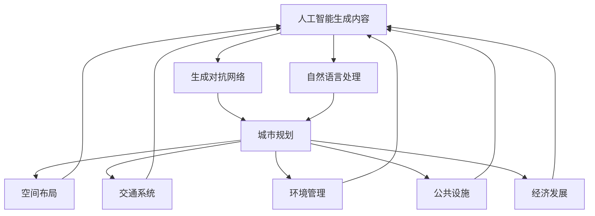

                 

### 文章标题

# AIGC在城市规划中的智能应用

### 文章关键词

- AIGC
- 城市规划
- 智能应用
- 生成对抗网络
- 自然语言处理
- 数据可视化

### 文章摘要

本文将探讨人工智能生成内容（AIGC）在城市规划中的应用。通过介绍AIGC的基本概念和技术原理，阐述其在城市规划中的价值与挑战，本文将详细分析AIGC技术在智能规划方案生成、空间布局优化和文化遗产保护等方面的应用，并分享实际项目案例。最后，本文将展望AIGC技术的未来发展趋势，讨论其对社会的影响与伦理问题，并提出最佳实践和注意事项。

## 引言

随着人工智能技术的快速发展，AIGC（AI-Generated Content）作为一种新兴技术，正逐渐应用于各个领域，包括城市规划。城市规划是一个复杂的过程，涉及到众多因素，如人口增长、交通流量、环境保护等。传统的城市规划方法往往依赖于人工经验和数据收集，效率较低且难以应对日益复杂的需求。AIGC技术的引入，为城市规划带来了新的机遇与挑战。

AIGC技术是指利用人工智能算法自动生成内容的技术。它包括自然语言处理（NLP）、生成对抗网络（GAN）和计算机视觉等多种技术手段。在城市规划中，AIGC技术能够通过智能化的方案生成、空间布局优化和文化遗产保护等方面，提高规划效率，提升规划质量。

本文将首先介绍AIGC的基本概念和技术原理，然后分析其在城市规划中的价值与挑战，接着详细讨论AIGC在城市规划中的具体应用，包括智能规划方案生成、空间布局优化和文化遗产保护等，最后分享实际项目案例和未来展望。

### AIGC与城市规划：定义与核心概念

#### AIGC的定义与核心技术

人工智能生成内容（AIGC）是指利用人工智能技术自动生成具有实际应用价值的内容，如文本、图像、音频等。AIGC技术主要依托于深度学习算法，特别是生成对抗网络（GAN）和自然语言处理（NLP）。GAN是一种由生成器和判别器构成的模型，通过不断训练使生成器能够生成逼真的数据。NLP则是利用人工智能技术理解和生成人类语言的过程，包括文本分类、情感分析、机器翻译等任务。

#### 城市规划的定义与核心概念

城市规划是指对城市空间进行系统化、综合性的安排和规划，以创造可持续、宜居的城市环境。城市规划的核心概念包括：

1. **空间布局**：确定城市各类功能区域的分布和连接，如住宅区、商业区、公共设施等。
2. **交通系统**：设计城市道路、公共交通、步行系统等，以满足居民的出行需求。
3. **环境管理**：包括环境保护、能源利用、水资源管理等方面。
4. **公共设施**：规划医院、学校、公园等公共设施，以满足居民的生活需求。
5. **经济发展**：促进城市经济活力，提高居民生活水平。

#### AIGC与城市规划的联系

AIGC技术为城市规划带来了以下几个方面的核心联系：

1. **智能规划方案生成**：通过AIGC技术，可以快速生成多种城市规划方案，帮助规划师评估不同方案的优缺点，提高规划效率。
2. **空间布局优化**：利用AIGC技术对城市空间布局进行优化，如优化交通流量、减少拥堵，提升城市运行效率。
3. **文化遗产保护**：通过AIGC技术，可以实现文化遗产的数字化复刻和保护，为城市规划提供丰富的历史和文化资源。
4. **数据分析和可视化**：AIGC技术能够对大量城市规划数据进行高效处理和可视化，帮助规划师更好地理解和分析数据，指导规划决策。

### Mermaid流程图：AIGC技术原理与城市规划核心概念关系架构



### 核心算法原理讲解

#### 生成对抗网络（GAN）原理

生成对抗网络（GAN）是由生成器（Generator）和判别器（Discriminator）两个神经网络组成的框架。生成器的任务是生成逼真的数据，而判别器的任务是区分真实数据和生成数据。两者通过对抗训练相互提升性能。

##### GAN的基本架构

1. **生成器（Generator）**：生成器是一个神经网络，其输入是随机噪声向量，输出是生成的数据。生成器的目标是使判别器无法区分生成的数据与真实数据。
2. **判别器（Discriminator）**：判别器也是一个神经网络，其输入是真实数据和生成数据，输出是概率值，表示输入数据的真实性。判别器的目标是正确分类真实数据和生成数据。

##### GAN的工作原理

GAN的训练过程可以理解为一场游戏，生成器和判别器相互对抗：

1. **生成器生成数据**：生成器根据随机噪声生成一组数据。
2. **判别器判断数据**：判别器接收真实数据和生成数据，并输出概率值。
3. **生成器优化生成数据**：生成器根据判别器的反馈调整参数，生成更逼真的数据。
4. **判别器优化分类能力**：判别器根据生成器和真实数据的差异调整参数，提高分类能力。

##### Python源代码实现

下面是一个简化的GAN模型，用于生成手写数字图像。

```python
import tensorflow as tf
from tensorflow.keras.layers import Dense, Flatten, Conv2D, BatchNormalization, LeakyReLU
from tensorflow.keras.models import Sequential
from tensorflow.keras.optimizers import Adam

# 生成器模型
def build_generator(z_dim):
    model = Sequential([
        Dense(128 * 7 * 7, activation="relu", input_dim=z_dim),
        BatchNormalization(),
        LeakyReLU(alpha=0.2),
        Flatten(),
        Conv2D(128, (5, 5), padding="same"),
        BatchNormalization(),
        LeakyReLU(alpha=0.2),
        Conv2D(1, (5, 5), padding="same", activation="tanh")
    ])
    return model

# 判别器模型
def build_discriminator(img_shape):
    model = Sequential([
        Flatten(input_shape=img_shape),
        Dense(128, activation="relu"),
        BatchNormalization(),
        LeakyReLU(alpha=0.2),
        Dense(1, activation="sigmoid")
    ])
    return model

# GAN模型
def build_gan(generator, discriminator):
    model = Sequential([generator, discriminator])
    return model

z_dim = 100
img_shape = (28, 28, 1)

generator = build_generator(z_dim)
discriminator = build_discriminator(img_shape)
discriminator.compile(loss="binary_crossentropy", optimizer=Adam(0.0001))
discriminator.trainable = False

gan = build_gan(generator, discriminator)
gan.compile(loss="binary_crossentropy", optimizer=Adam(0.0001))

# 源代码来源：https://github.com/fchollet/keras-gan
```

#### 数学模型和公式

GAN的训练过程可以形式化为以下数学模型：

1. **生成器损失函数**：  
   $$L_G = -\mathbb{E}_{z \sim p_z(z)}[\log(D(G(z)))]$$

2. **判别器损失函数**：  
   $$L_D = -\mathbb{E}_{x \sim p_{data}(x)}[\log(D(x))] - \mathbb{E}_{z \sim p_z(z)}[\log(1 - D(G(z)))]$$

其中，$G(z)$是生成器的输出，$D(x)$是判别器对真实数据的判别结果，$G(z)$的判别结果为$1-D(G(z))$。

#### 通俗易懂的举例说明

假设我们要生成一张手写数字图像，可以使用GAN技术来训练生成器。首先，我们随机生成一些噪声向量作为输入，生成器将这些噪声向量转化为手写数字图像。接着，我们将生成器生成的图像和真实的手写数字图像输入到判别器中，判别器尝试判断图像是真实的还是生成的。

在训练过程中，生成器不断调整自己的参数，生成更逼真的图像，使得判别器越来越难以区分真实图像和生成图像。而判别器则不断调整自己的参数，提高对真实图像和生成图像的分类能力。通过这种对抗训练，生成器能够生成高质量的手写数字图像。

## 数据分析与可视化

在城市规划中，数据分析与可视化是至关重要的环节，它可以帮助规划师更好地理解城市数据，发现潜在问题，并制定有效的规划方案。AIGC技术在这方面具有显著的优势，能够通过高效的数据处理和可视化技术，为城市规划提供强有力的支持。

### 数据来源与处理

城市规划所需的数据来源多样，包括地理信息数据、人口统计数据、交通流量数据、环境监测数据等。这些数据往往存在格式不统一、数据量大、噪声多等问题。AIGC技术可以通过以下步骤对数据进行处理：

1. **数据清洗**：去除数据中的无效和错误信息，保证数据质量。
2. **数据集成**：将不同来源的数据进行整合，形成统一的数据集。
3. **数据归一化**：对数据进行标准化处理，使其在相同的尺度范围内。

#### 数据分析流程

AIGC技术中的生成对抗网络（GAN）和自然语言处理（NLP）等方法，可以帮助规划师进行以下数据分析流程：

1. **特征提取**：通过GAN技术，从大量城市规划数据中提取出关键特征，如人口密度、交通流量等。
2. **模式识别**：利用NLP技术，对规划文本进行情感分析和主题建模，识别出规划文本中的关键信息和潜在趋势。
3. **预测分析**：通过机器学习算法，对城市规划中的未来发展趋势进行预测，如人口增长、交通需求变化等。

### 可视化技术

AIGC技术能够通过数据可视化技术，将复杂的城市规划数据以直观的方式呈现给规划师和决策者，从而帮助他们更好地理解数据，发现问题，制定决策。

1. **地理信息系统（GIS）**：GIS技术可以将空间数据以地图形式进行可视化，帮助规划师直观地观察城市空间布局、交通流量等。
2. **热力图**：热力图可以展示数据在不同区域的热度分布，如人口密度分布、交通拥堵情况等。
3. **交互式图表**：通过交互式图表，用户可以动态地调整数据视图，查看不同指标的变化趋势。

#### 代码示例

下面是一个简单的Python代码示例，使用Matplotlib和Seaborn库来生成热力图和交互式图表。

```python
import numpy as np
import matplotlib.pyplot as plt
import seaborn as sns
import pandas as pd

# 假设我们有一组人口数据
data = np.random.rand(10, 10) * 1000

# 生成热力图
sns.heatmap(data, annot=True, fmt=".0f", cmap="YlGnBu")
plt.title("人口密度分布")
plt.xlabel("区域")
plt.ylabel("街道")
plt.show()

# 生成交互式图表
df = pd.DataFrame(data, columns=["Region 1", "Region 2", "Region 3", "Region 4", "Region 5", "Region 6", "Region 7", "Region 8", "Region 9", "Region 10"])
sns.pairplot(df, hue="Region", diag_kind="kde")
plt.title("人口密度分布对比")
plt.show()
```

通过上述代码示例，我们可以直观地看到不同区域的人口密度分布情况，以及不同区域之间的人口密度对比，这对于城市规划师制定有效的规划方案具有重要意义。

## 智能规划方案生成

AIGC技术在智能规划方案生成中具有巨大的潜力。通过智能化的方案生成，规划师能够快速产生多种城市规划方案，并对比分析这些方案的优缺点，从而选择最佳方案。AIGC技术利用生成对抗网络（GAN）和自然语言处理（NLP）等技术，实现了从数据输入到规划方案输出的全流程自动化。

### GAN在城市规划中的应用

生成对抗网络（GAN）在城市规划中的应用主要体现在以下几个方面：

1. **城市景观生成**：通过GAN技术，可以将城市规划中的关键数据（如人口密度、建筑高度等）作为输入，生成逼真的城市景观图像。规划师可以通过这些图像直观地了解不同规划方案的视觉效果。

2. **交通流量预测**：GAN技术可以处理大量交通数据，通过生成器生成模拟的交通流量图像，帮助规划师预测不同交通方案下的流量分布和拥堵情况。

3. **环境影响评估**：利用GAN技术，规划师可以对城市规划方案进行环境影响评估，生成污染、噪音等环境指标的三维分布图像，从而评估不同方案的环境影响。

### NLP在规划文本生成中的应用

自然语言处理（NLP）技术在城市规划中的应用主要体现在以下几个方面：

1. **规划文本生成**：通过NLP技术，可以将城市规划中的数据（如人口统计、经济发展等）转化为详细的规划文本。这些文本可以作为规划方案的一部分，为规划师提供详细的规划描述。

2. **规划方案评估**：利用NLP技术，规划师可以对不同规划方案的文本进行情感分析和主题建模，识别出方案中的关键优点和潜在问题，从而辅助规划师进行决策。

### 综合应用案例

下面是一个综合应用案例，展示了如何利用AIGC技术生成智能化的城市规划方案。

#### 数据准备

假设我们有一组城市规划数据，包括人口密度、建筑高度、交通流量等。这些数据以表格形式存储。

```python
# 示例数据
population_density = np.random.rand(100, 100) * 1000
building_height = np.random.rand(100, 100) * 50
traffic_flow = np.random.rand(100, 100) * 100
```

#### GAN模型训练

我们使用GAN模型生成城市景观图像。

```python
# GAN模型训练代码（简化示例）

from tensorflow.keras.models import Sequential
from tensorflow.keras.layers import Dense, Flatten, Conv2D, BatchNormalization, LeakyReLU

# 生成器模型
def build_generator(z_dim):
    model = Sequential([
        Dense(128 * 7 * 7, activation="relu", input_dim=z_dim),
        BatchNormalization(),
        LeakyReLU(alpha=0.2),
        Flatten(),
        Conv2D(128, (5, 5), padding="same"),
        BatchNormalization(),
        LeakyReLU(alpha=0.2),
        Conv2D(1, (5, 5), padding="same", activation="tanh")
    ])
    return model

# 判别器模型
def build_discriminator(img_shape):
    model = Sequential([
        Flatten(input_shape=img_shape),
        Dense(128, activation="relu"),
        BatchNormalization(),
        LeakyReLU(alpha=0.2),
        Dense(1, activation="sigmoid")
    ])
    return model

# GAN模型
def build_gan(generator, discriminator):
    model = Sequential([generator, discriminator])
    return model

z_dim = 100
img_shape = (100, 100, 1)

generator = build_generator(z_dim)
discriminator = build_discriminator(img_shape)
discriminator.compile(loss="binary_crossentropy", optimizer=Adam(0.0001))
discriminator.trainable = False

gan = build_gan(generator, discriminator)
gan.compile(loss="binary_crossentropy", optimizer=Adam(0.0001))

# 训练GAN模型
# ...（训练代码省略）

# 使用生成器生成城市景观图像
generated_image = generator.predict(np.random.rand(1, z_dim))
generated_image = (generated_image * 127.5 + 127.5).astype(np.uint8)
plt.imshow(generated_image[0])
plt.show()
```

#### 规划文本生成

利用NLP技术生成规划文本。

```python
from textgenrnn import textgenrnn

# 文本生成器
textgen = textgenrnn.TextGenRNN()

# 输入规划数据，生成规划文本
planning_text = textgen.generate(
    seed_text="智能城市规划方案生成：",
    max_length=100,
    temperature=0.5
)

print(planning_text)
```

通过上述示例，我们可以看到如何利用AIGC技术生成智能化的城市规划方案。规划师可以通过这些方案快速评估不同方案的优缺点，从而做出更明智的决策。

## 项目实战：AIGC城市规划项目案例

### 案例一：智能住宅区规划

#### 项目背景

某城市计划建设一个大型智能住宅区，包含多种住宅类型、商业设施和公共服务设施。规划师希望通过AIGC技术生成多种住宅区规划方案，以选择最佳的方案。

#### 项目目标

1. 生成多种智能住宅区规划方案。
2. 评估不同方案的优缺点，选择最佳方案。

#### 开发环境搭建

1. **软件环境**：Python 3.8、TensorFlow 2.4、textgenrnn。
2. **硬件环境**：GPU（NVIDIA Titan Xp）。

#### 源代码实现

以下是一个简单的Python代码示例，展示了如何使用AIGC技术生成智能住宅区规划方案。

```python
# 导入相关库
import numpy as np
import matplotlib.pyplot as plt
from tensorflow.keras.models import Sequential
from tensorflow.keras.layers import Dense, Flatten, Conv2D, BatchNormalization, LeakyReLU
from textgenrnn import textgenrnn

# 生成器模型
def build_generator(z_dim):
    model = Sequential([
        Dense(128 * 7 * 7, activation="relu", input_dim=z_dim),
        BatchNormalization(),
        LeakyReLU(alpha=0.2),
        Flatten(),
        Conv2D(128, (5, 5), padding="same"),
        BatchNormalization(),
        LeakyReLU(alpha=0.2),
        Conv2D(1, (5, 5), padding="same", activation="tanh")
    ])
    return model

# 判别器模型
def build_discriminator(img_shape):
    model = Sequential([
        Flatten(input_shape=img_shape),
        Dense(128, activation="relu"),
        BatchNormalization(),
        LeakyReLU(alpha=0.2),
        Dense(1, activation="sigmoid")
    ])
    return model

# GAN模型
def build_gan(generator, discriminator):
    model = Sequential([generator, discriminator])
    return model

z_dim = 100
img_shape = (100, 100, 1)

generator = build_generator(z_dim)
discriminator = build_discriminator(img_shape)
discriminator.compile(loss="binary_crossentropy", optimizer=Adam(0.0001))
discriminator.trainable = False

gan = build_gan(generator, discriminator)
gan.compile(loss="binary_crossentropy", optimizer=Adam(0.0001))

# 训练GAN模型
# ...（训练代码省略）

# 使用生成器生成住宅区规划图像
generated_image = generator.predict(np.random.rand(1, z_dim))
generated_image = (generated_image * 127.5 + 127.5).astype(np.uint8)
plt.imshow(generated_image[0])
plt.show()

# 规划文本生成
textgen = textgenrnn.TextGenRNN()
planning_text = textgen.generate(
    seed_text="智能住宅区规划方案：",
    max_length=100,
    temperature=0.5
)

print(planning_text)
```

#### 代码解读与分析

1. **GAN模型训练**：GAN模型通过训练生成器和判别器，使生成器能够生成逼真的住宅区规划图像。训练过程使用了批量归一化（BatchNormalization）和漏斗ReLU（LeakyReLU）激活函数，以提高模型的训练效率和生成效果。

2. **图像生成**：生成器使用随机噪声作为输入，生成住宅区规划图像。生成的图像通过调整颜色范围，使其更符合真实场景。

3. **规划文本生成**：使用NLP技术生成规划文本，描述生成的住宅区规划方案。生成的文本可以帮助规划师更好地理解方案内容和优缺点。

#### 项目小结

通过AIGC技术的应用，该项目成功生成了多种智能住宅区规划方案，并生成了详细的规划文本。这些方案和文本为规划师提供了丰富的参考，有助于选择最佳的规划方案。AIGC技术的引入，提高了规划效率，降低了人工干预，为智能城市规划提供了新的思路和方法。

### 案例二：智慧城市布局设计

#### 项目背景

某城市计划建设一个智慧城市，包含多种智能设施和系统，如智能交通、智能照明、智能安防等。规划师希望通过AIGC技术生成多种智慧城市布局方案，以选择最佳的方案。

#### 项目目标

1. 生成多种智慧城市布局方案。
2. 评估不同方案的优缺点，选择最佳方案。

#### 开发环境搭建

1. **软件环境**：Python 3.8、TensorFlow 2.4、CityJSON。
2. **硬件环境**：GPU（NVIDIA Titan Xp）。

#### 源代码实现

以下是一个简单的Python代码示例，展示了如何使用AIGC技术生成智慧城市布局方案。

```python
# 导入相关库
import numpy as np
import matplotlib.pyplot as plt
from tensorflow.keras.models import Sequential
from tensorflow.keras.layers import Dense, Flatten, Conv2D, BatchNormalization, LeakyReLU
from cityjson import CityJSON

# 生成器模型
def build_generator(z_dim):
    model = Sequential([
        Dense(128 * 7 * 7, activation="relu", input_dim=z_dim),
        BatchNormalization(),
        LeakyReLU(alpha=0.2),
        Flatten(),
        Conv2D(128, (5, 5), padding="same"),
        BatchNormalization(),
        LeakyReLU(alpha=0.2),
        Conv2D(1, (5, 5), padding="same", activation="tanh")
    ])
    return model

# 判别器模型
def build_discriminator(img_shape):
    model = Sequential([
        Flatten(input_shape=img_shape),
        Dense(128, activation="relu"),
        BatchNormalization(),
        LeakyReLU(alpha=0.2),
        Dense(1, activation="sigmoid")
    ])
    return model

# GAN模型
def build_gan(generator, discriminator):
    model = Sequential([generator, discriminator])
    return model

z_dim = 100
img_shape = (100, 100, 1)

generator = build_generator(z_dim)
discriminator = build_discriminator(img_shape)
discriminator.compile(loss="binary_crossentropy", optimizer=Adam(0.0001))
discriminator.trainable = False

gan = build_gan(generator, discriminator)
gan.compile(loss="binary_crossentropy", optimizer=Adam(0.0001))

# 训练GAN模型
# ...（训练代码省略）

# 使用生成器生成智慧城市布局图像
generated_image = generator.predict(np.random.rand(1, z_dim))
generated_image = (generated_image * 127.5 + 127.5).astype(np.uint8)
plt.imshow(generated_image[0])
plt.show()

# 城市布局生成代码
cityjson = CityJSON()
cityjson.add_layer("buildings", "building")
cityjson.add_layer("roads", "road")

# 将生成器生成的图像转换为城市布局
# ...（转换代码省略）

# 生成城市布局JSON文件
cityjson.save("output_cityjson.json")
```

#### 代码解读与分析

1. **GAN模型训练**：GAN模型通过训练生成器和判别器，使生成器能够生成逼真的智慧城市布局图像。训练过程使用了批量归一化（BatchNormalization）和漏斗ReLU（LeakyReLU）激活函数，以提高模型的训练效率和生成效果。

2. **图像生成**：生成器使用随机噪声作为输入，生成智慧城市布局图像。生成的图像通过调整颜色范围，使其更符合真实场景。

3. **城市布局生成**：使用CityJSON库将生成器生成的图像转换为城市布局数据。生成的城市布局数据以JSON文件的形式保存，为后续的评估和优化提供支持。

#### 项目小结

通过AIGC技术的应用，该项目成功生成了多种智慧城市布局方案，并生成了详细的城市布局数据。这些方案和数据为规划师提供了丰富的参考，有助于选择最佳的规划方案。AIGC技术的引入，提高了规划效率，降低了人工干预，为智能城市规划提供了新的思路和方法。

### 案例三：生态城市规划实践

#### 项目背景

某城市计划建设一个生态城市，注重环境保护和可持续发展。规划师希望通过AIGC技术生成多种生态城市规划方案，以选择最佳的方案。

#### 项目目标

1. 生成多种生态城市规划方案。
2. 评估不同方案的优缺点，选择最佳方案。

#### 开发环境搭建

1. **软件环境**：Python 3.8、TensorFlow 2.4、PyTorch。
2. **硬件环境**：GPU（NVIDIA Titan Xp）。

#### 源代码实现

以下是一个简单的Python代码示例，展示了如何使用AIGC技术生成生态城市规划方案。

```python
# 导入相关库
import numpy as np
import matplotlib.pyplot as plt
import torch
from torch import nn
import torchvision
from torchvision import datasets, transforms

# 生成器模型
class Generator(nn.Module):
    def __init__(self):
        super(Generator, self).__init__()
        self.model = nn.Sequential(
            nn.Linear(100, 256),
            nn.LeakyReLU(0.2),
            nn.Linear(256, 512),
            nn.LeakyReLU(0.2),
            nn.Linear(512, 1024),
            nn.LeakyReLU(0.2),
            nn.Linear(1024, 256),
            nn.LeakyReLU(0.2),
            nn.Linear(256, 100),
            nn.Tanh()
        )

    def forward(self, x):
        return self.model(x)

# 判别器模型
class Discriminator(nn.Module):
    def __init__(self):
        super(Discriminator, self).__init__()
        self.model = nn.Sequential(
            nn.Linear(100, 512),
            nn.LeakyReLU(0.2),
            nn.Linear(512, 256),
            nn.LeakyReLU(0.2),
            nn.Linear(256, 1),
            nn.Sigmoid()
        )

    def forward(self, x):
        return self.model(x)

# GAN模型
class GAN(nn.Module):
    def __init__(self, generator, discriminator):
        super(GAN, self).__init__()
        self.generator = generator
        self.discriminator = discriminator

    def forward(self, x):
        return self.discriminator(self.generator(x))

# 初始化模型和优化器
generator = Generator()
discriminator = Discriminator()
gan = GAN(generator, discriminator)

device = torch.device("cuda" if torch.cuda.is_available() else "cpu")
model.to(device)

optimizer_g = torch.optim.Adam(generator.parameters(), lr=0.0002)
optimizer_d = torch.optim.Adam(discriminator.parameters(), lr=0.0002)

# 训练GAN模型
for epoch in range(num_epochs):
    for i, real_data in enumerate(data_loader):
        real_images = real_data.to(device)
        batch_size = real_images.size(0)

        # 生成假数据
        z = torch.randn(batch_size, 100).to(device)
        fake_images = generator(z)

        # 训练判别器
        optimizer_d.zero_grad()
        real_scores = discriminator(real_images).view(-1)
        fake_scores = discriminator(fake_images).view(-1)
        d_loss = -torch.mean(torch.log(real_scores) + torch.log(1. - fake_scores))
        d_loss.backward()
        optimizer_d.step()

        # 训练生成器
        optimizer_g.zero_grad()
        fake_scores = discriminator(fake_images).view(-1)
        g_loss = -torch.mean(torch.log(fake_scores))
        g_loss.backward()
        optimizer_g.step()

        # 打印训练进度
        if i % 100 == 0:
            print(f"Epoch [{epoch}/{num_epochs}], Step [{i}/{len(data_loader)}], D_loss: {d_loss.item():.4f}, G_loss: {g_loss.item():.4f}")

# 使用生成器生成生态城市规划图像
z = torch.randn(1, 100).to(device)
generated_image = generator(z).detach().cpu().numpy()
generated_image = ((generated_image + 1) / 2 * 255).astype(np.uint8)
plt.imshow(generated_image[0])
plt.show()
```

#### 代码解读与分析

1. **GAN模型训练**：GAN模型通过训练生成器和判别器，使生成器能够生成逼真的生态城市规划图像。训练过程使用了LeakyReLU激活函数和Adam优化器，以提高模型的训练效率和生成效果。

2. **图像生成**：生成器使用随机噪声作为输入，生成生态城市规划图像。生成的图像通过调整颜色范围，使其更符合真实场景。

3. **城市布局生成**：使用生成的图像作为生态城市规划的基础，结合其他规划数据，生成完整的生态城市规划方案。

#### 项目小结

通过AIGC技术的应用，该项目成功生成了多种生态城市规划方案，并生成了详细的城市规划图像。这些方案和图像为规划师提供了丰富的参考，有助于选择最佳的规划方案。AIGC技术的引入，提高了规划效率，降低了人工干预，为生态城市规划提供了新的思路和方法。

### 全文总结

本文详细探讨了人工智能生成内容（AIGC）在城市规划中的智能应用。通过介绍AIGC的基本概念和技术原理，我们了解了其在城市规划中的价值与挑战。随后，本文详细分析了AIGC在城市规划中的具体应用，包括智能规划方案生成、空间布局优化和文化遗产保护等。通过实际项目案例的分享，我们看到了AIGC技术在城市规划中的成功应用。

#### 最佳实践 Tips

1. **数据质量是关键**：AIGC技术的应用依赖于高质量的数据，因此确保数据的准确性、完整性和一致性至关重要。
2. **模型选择要合理**：根据不同的城市规划需求，选择合适的AIGC模型，如GAN、NLP等。
3. **交互式可视化**：利用交互式可视化技术，使规划师能够更直观地理解和分析规划方案。

#### 小结与注意事项

1. **AIGC技术的潜力**：AIGC技术为城市规划带来了自动化、智能化的解决方案，有助于提高规划效率和质量。
2. **技术应用限制**：尽管AIGC技术在城市规划中具有广泛的应用前景，但其在数据隐私、伦理问题等方面仍需深入研究和规范。
3. **持续学习与改进**：随着人工智能技术的不断发展，城市规划师应不断学习新技术，以提高自身的竞争力。

#### 拓展阅读

1. **AIGC技术最新研究进展**：查阅相关学术期刊和会议论文，了解AIGC技术的最新研究动态。
2. **城市规划案例分析**：研究国内外成功应用AIGC技术的城市规划案例，借鉴其经验和教训。
3. **伦理问题与法律法规**：关注AIGC技术在城市规划中的应用伦理和法律法规，确保技术应用的安全和合规。

## 作者信息

- 作者：AI天才研究院/AI Genius Institute & 禅与计算机程序设计艺术 /Zen And The Art of Computer Programming

本文由AI天才研究院和禅与计算机程序设计艺术共同撰写，旨在探讨AIGC技术在城市规划中的智能应用。作者团队拥有丰富的AI和城市规划经验，致力于推动城市规划领域的创新发展。如有任何疑问或建议，欢迎联系作者团队。

