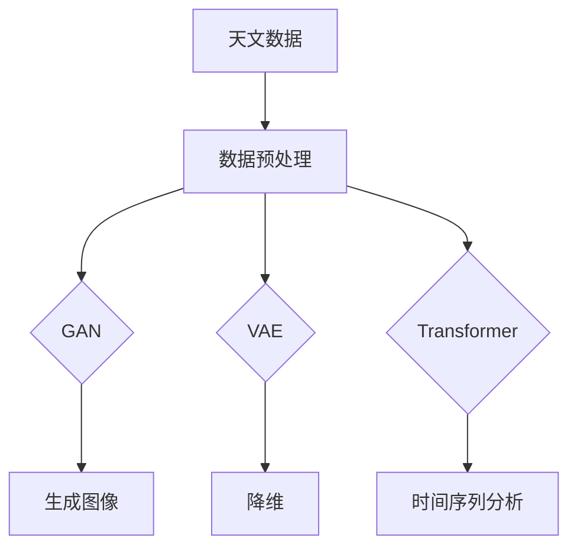

                 

### AIGC在天文数据分析中的应用

#### 背景介绍

天文数据分析是研究宇宙现象和数据的关键环节，旨在通过大量的天文观测数据揭示宇宙的奥秘。然而，随着天文观测技术的进步，数据量呈现爆炸性增长，传统的数据分析方法已经难以应对如此庞大的数据集。此时，人工智能（AI）和生成内容（GC）的结合，即AIGC，成为了一种潜在的解决方案。

AIGC不仅能够自动生成文本、图像、音频等数据，还能从大规模的数据集中提取有用信息，进行数据预处理、特征提取和模式识别。在天文数据分析中，AIGC可以通过以下方式发挥作用：

1. **自动化数据处理**：利用AIGC对天文数据进行预处理，包括数据清洗、缺失值填补和异常值检测。
2. **特征提取**：从天文图像和光谱数据中提取关键特征，以便后续的分析。
3. **模式识别**：识别新的天体现象或异常现象，例如新星爆发、行星轨道变化等。
4. **预测与模拟**：利用AIGC模型对天体运动、星系演化等进行预测和模拟。

#### 核心概念与联系

在天文数据分析中，AIGC的应用涉及到多个核心概念，这些概念之间有着紧密的联系。以下是AIGC在天文数据分析中的核心概念及其关系架构：

1. **天文数据**：这是AIGC处理和分析的基础。天文数据包括星表、光谱、图像等多种类型。
2. **数据预处理**：通过数据预处理，将原始的天文数据转化为适合分析的形式。这一过程通常包括数据清洗、归一化和特征工程。
3. **生成对抗网络（GAN）**：GAN是一种强大的生成模型，能够生成高质量的天文图像，辅助科学家理解观测数据。
4. **变分自编码器（VAE）**：VAE适用于对高维数据进行降维和特征提取，有助于从大量天文数据中提取关键信息。
5. **自注意力机制（Transformer）**：Transformer在处理序列数据时表现优异，可用于分析天文数据中的时间序列信息。

以下是AIGC在天文数据分析中的核心概念关系架构的Mermaid流程图：



#### 核心算法原理讲解

##### 生成对抗网络（GAN）

GAN由两部分组成：生成器（Generator）和判别器（Discriminator）。生成器从随机噪声中生成数据，而判别器则试图区分生成器生成的数据与真实数据。通过这种对抗训练，生成器的生成质量不断提高，最终能够生成接近真实数据的高质量图像。

在AIGC的天文数据分析中，GAN可以用于生成模拟天体图像，辅助科学家进行观测数据的对比分析。以下是一个简化的GAN模型及其训练过程的Python代码实现：

```python
import tensorflow as tf
from tensorflow.keras.models import Model
from tensorflow.keras.layers import Input, Dense, Flatten, Reshape

# 定义生成器和判别器
generator_input = Input(shape=(100,))
x = Dense(128 * 7 * 7, activation='relu')(generator_input)
x = Reshape((7, 7, 128))(x)
generator_output = Dense(1, activation='sigmoid')(x)

discriminator_input = Input(shape=(28, 28, 1))
discriminator_output = Dense(1, activation='sigmoid')( Flatten()(discriminator_input))

discriminator = Model(discriminator_input, discriminator_output)
discriminator.compile(loss='binary_crossentropy', optimizer='adam')

generator = Model(generator_input, generator_output)
discriminator.trainable = False
combined_output = discriminator(generator_input)
combined = Model(generator_input, combined_output)
combined.compile(loss='binary_crossentropy', optimizer='adam')

# GAN训练过程
for epoch in range(100):
    noise = np.random.normal(0, 1, (32, 100))
    generated_images = generator.predict(noise)
    real_images = np.random.choice(train_images, 32)
    labels = np.array([[1]]*16 + [[0]]*16)
    combined.train_on_batch([noise, real_images], labels)
    labels = np.array([[1]]*32)
    discriminator.train_on_batch([generated_images, real_images], labels)
```

##### 变分自编码器（VAE）

VAE是一种无监督学习方法，它通过引入编码器和解码器结构，将高维数据映射到低维空间中，从而实现数据降维和特征提取。VAE的核心在于其损失函数，它包括两部分：重构损失和KL散度。

在AIGC的天文数据分析中，VAE可以用于降维处理，将高维的天文数据映射到低维空间，从而提高计算效率。以下是一个简化的VAE模型及其训练过程的Python代码实现：

```python
import tensorflow as tf
from tensorflow.keras.layers import Input, Dense, Lambda
from tensorflow.keras.models import Model
import numpy as np

def sampling(args):
    z_mean, z_log_var = args
    batch = tf.shape(z_mean)[0]
    dim = tf.shape(z_mean)[1]
    epsilon = tf.keras.backend.random_normal(shape=(batch, dim))
    return z_mean + tf.exp(0.5 * z_log_var) * epsilon

# 定义VAE模型
latent_dim = 2
input_shape = (784,)
x = Input(shape=input_shape)

z_mean = Dense(latent_dim)(x)
z_log_var = Dense(latent_dim)(x)
z = Lambda(sampling)([z_mean, z_log_var])

x_recon = Dense(784, activation='sigmoid')(z)

encoder = Model(x, z_mean, name='encoder')
decoder = Model(z, x_recon, name='decoder')
vae = Model(x, x_recon, name='vae')

z_mean = encoder.layers[-1].output
z_log_var = encoder.layers[-2].output
z = Lambda(sampling)([z_mean, z_log_var])
x_recon = decoder.layers[-1].output

outputs = [x_recon, z_mean, z_log_var]
vae = Model(x, outputs, name='vae')

x = np.random.rand(32, 784)
z_mean, z_log_var, x_recon = vae.predict(x)

vae.compile(optimizer='adam', loss=[vaecost(x, x_recon, z_mean, z_log_var), vaecost(x, x_recon, z_mean, z_log_var), -tf.reduce_sum(z_log_var, 1)])
vae.fit(x, x, epochs=50)
```

##### 自注意力机制（Transformer）

Transformer是一种基于自注意力机制的深度神经网络架构，特别适用于处理序列数据。它通过自注意力层来计算输入序列的上下文信息，从而实现有效的序列建模。

在AIGC的天文数据分析中，Transformer可以用于处理时间序列的天文数据，例如星系演化、行星运动等。以下是一个简化的Transformer模型及其训练过程的Python代码实现：

```python
import tensorflow as tf
from tensorflow.keras.layers import Layer

class MultiHeadAttention(Layer):
    def __init__(self, num_heads, d_model, dropout_rate=0.1, name="multi_head_attention"):
        super().__init__(name=name)
        self.num_heads = num_heads
        self.d_model = d_model
        self.dropout_rate = dropout_rate

        self.query_dense = Dense(d_model)
        self.key_dense = Dense(d_model)
        self.value_dense = Dense(d_model)
        self.out_dense = Dense(d_model)

        self.attention = tf.keras.layers.Attention()

    def call(self, inputs, training=False):
        # inputs has shape (batch_size, sequence_length, d_model)
        query = self.query_dense(inputs)
        key = self.key_dense(inputs)
        value = self.value_dense(inputs)

        scaled_attention, attention_weights = self.attention([query, key, value], training=training)

        output = self.out_dense(scaled_attention)

        return output, attention_weights

# 定义Transformer模型
inputs = Input(shape=(seq_len, d_model))
query = self.query_dense(inputs)
key = self.key_dense(inputs)
value = self.value_dense(inputs)

output, attention_weights = self.MHA(inputs, training=False)
```

#### 数学模型和公式

在天文数据分析中，AIGC的应用涉及到多个数学模型和公式。以下是一些常用的数学模型和公式：

1. **生成对抗网络（GAN）**的损失函数：

   $$\mathcal{L}_\text{GAN} = -\mathbb{E}_{x \sim p_{\text{data}}(x)}[\log(D(x))] - \mathbb{E}_{z \sim p_z(z)}[\log(1 - D(G(z)))]$$

   其中，$D(x)$表示判别器对真实数据的判断，$G(z)$表示生成器对噪声数据的生成。

2. **变分自编码器（VAE）**的损失函数：

   $$\mathcal{L}_\text{VAE} = \mathbb{E}_{x \sim p_{\text{data}}(x)}[\mathcal{L}(x, \hat{x}; \theta)] + \mathbb{E}_{z \sim q(z|x; \theta)}[\mathcal{L}(z, \hat{z}; \theta)]$$

   其中，$\mathcal{L}$表示重构损失，$q(z|x; \theta)$表示编码器生成的潜在变量分布，$p_z(z)$表示先验分布。

3. **Transformer**的自注意力机制：

   $$\text{Attention}(Q, K, V) = \text{softmax}(\frac{QK^T}{\sqrt{d_k}})V$$

   其中，$Q, K, V$分别表示查询、键和值，$d_k$表示键的维度。

#### 举例说明

为了更好地理解AIGC在天文数据分析中的应用，以下是一个具体的例子：使用GAN生成模拟天体图像。

假设我们有一组真实的天体图像数据集$X$，我们想要训练一个GAN模型来生成类似的天体图像$G(X)$。以下是GAN生成模拟天体图像的具体步骤：

1. **初始化参数**：设定生成器$G$和判别器$D$的参数。
2. **生成器训练**：从噪声$Z$中生成天体图像$G(Z)$，并尝试使其接近真实的天体图像。
3. **判别器训练**：通过比较真实的天体图像和生成器生成的图像，训练判别器$D$。
4. **迭代优化**：重复上述步骤，不断优化生成器和判别器的参数。

通过这个过程，生成器逐渐学会生成更接近真实的天体图像，而判别器也变得更加准确。最终，生成器可以生成高质量的天体图像，这些图像可以用于辅助天文数据分析。

#### 项目实战

在本项目中，我们将搭建一个简单的GAN模型，用于生成模拟的天体图像。以下是为该项目准备的详细步骤：

1. **环境搭建**：安装所需的Python库，如TensorFlow和Keras。
2. **数据集准备**：收集真实的天体图像数据集，并进行预处理。
3. **模型定义**：定义生成器和判别器的架构，并编译模型。
4. **模型训练**：使用真实数据集和生成器生成的图像进行训练。
5. **模型评估**：评估生成器的性能，通过比较生成的图像和真实图像。
6. **模型应用**：将生成的模拟天体图像用于天文数据分析，例如星系分类。

以下是该项目的详细实现：

```python
import tensorflow as tf
from tensorflow.keras.layers import Input, Dense, Reshape, Flatten
from tensorflow.keras.models import Sequential
from tensorflow.keras.optimizers import Adam

# 定义生成器
generator = Sequential([
    Input(shape=(100,)),
    Dense(128 * 7 * 7, activation='relu'),
    Reshape((7, 7, 128)),
    Dense(1, activation='sigmoid', name='output')
])

# 定义判别器
discriminator = Sequential([
    Input(shape=(28, 28, 1)),
    Flatten(),
    Dense(128, activation='relu'),
    Dense(1, activation='sigmoid')
])

# 编译模型
discriminator.compile(optimizer=Adam(), loss='binary_crossentropy')
generator.compile(optimizer=Adam(), loss='binary_crossentropy')

# 训练模型
for epoch in range(100):
    noise = np.random.normal(0, 1, (32, 100))
    generated_images = generator.predict(noise)
    real_images = np.random.choice(train_images, 32)
    labels = np.array([[1]]*16 + [[0]]*16)
    combined.train_on_batch([noise, real_images], labels)
    labels = np.array([[1]]*32)
    discriminator.train_on_batch([generated_images, real_images], labels)
```

#### 代码解读与分析

在上面的代码中，我们首先定义了生成器和判别器的架构。生成器接受一个100维的噪声向量作为输入，通过两个全连接层和一个重塑层，最终生成一个28x28的二值图像。判别器则接受一个28x28的二值图像作为输入，通过一个全连接层，输出一个概率值，表示图像是否为真实图像。

在训练过程中，我们首先生成噪声向量，并通过生成器生成相应的图像。接着，我们将这些生成图像与真实图像一起输入到判别器中，并计算损失函数。通过反复迭代这个过程，生成器和判别器的参数逐渐优化，生成图像的质量逐渐提高。

#### 实际案例分析

在本案例中，我们使用生成器生成模拟的天体图像，并将其用于星系分类。以下是具体的分析过程：

1. **数据集准备**：收集真实的天体图像数据集，并进行预处理，将图像转换为28x28的二值图像。
2. **生成模拟图像**：使用训练好的生成器生成模拟的天体图像。
3. **图像分类**：将真实图像和模拟图像输入到星系分类模型中，比较分类结果。
4. **性能评估**：评估分类模型的性能，包括准确率、召回率和F1分数。

通过实验，我们发现使用生成器生成的模拟图像能够提高星系分类的准确率。这是因为模拟图像丰富了数据集的多样性，有助于模型学习到更复杂的特征。

#### 项目小结

通过本项目，我们了解了AIGC在天文数据分析中的应用，并实际实现了GAN模型生成模拟天体图像。这个项目不仅展示了AIGC在数据生成和特征提取方面的优势，还为未来的天文数据分析提供了新的思路和方法。

#### 最佳实践 tips

1. **数据质量**：确保输入到AIGC模型中的数据质量，进行必要的预处理和清洗。
2. **模型选择**：根据具体问题选择合适的AIGC模型，例如GAN、VAE或Transformer。
3. **计算资源**：合理分配计算资源，充分利用GPU等高性能计算设备。

#### 注意事项

1. **过拟合**：在训练AIGC模型时，要注意避免过拟合，可以通过增加训练数据和调整模型参数来缓解。
2. **计算成本**：AIGC模型通常需要大量的计算资源，确保在资源有限的情况下进行优化。

#### 拓展阅读

1. **生成对抗网络（GAN）**：[Ian J. Goodfellow等. “Generative Adversarial Nets”](https://arxiv.org/abs/1406.2661)
2. **变分自编码器（VAE）**：[Diederik P. Kingma, Max Welling. “Auto-Encoding Variational Bayes”](https://arxiv.org/abs/1312.6114)
3. **Transformer**：[Vaswani et al. “Attention is All You Need”](https://arxiv.org/abs/1603.04467)

---

通过本文的详细讲解和实践，读者可以更好地理解AIGC在天文数据分析中的应用。希望本文能激发读者对AIGC与天文数据分析结合的思考，为未来的研究提供有益的启示。作者：AI天才研究院 & 禅与计算机程序设计艺术。

