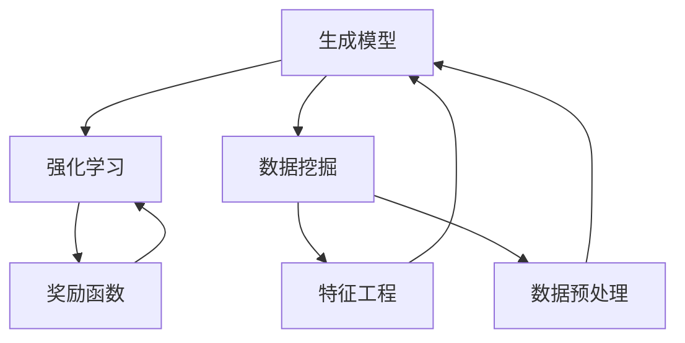

                 

## 《AIGC在广告创意中的应用：思维链激发创新》

### 关键词

- AIGC
- 广告创意
- 思维链
- 生成对抗网络
- 变分自编码器
- 多模态数据融合

### 摘要

本文深入探讨了AIGC（自适应智能生成控制）在广告创意领域的应用，以及如何通过思维链激发创新。文章首先介绍了AIGC的基本概念、关键技术和在广告创意中的潜在应用。随后，详细讲解了AIGC的核心概念与联系，包括数据生成模型和模型训练与优化，并通过GAN（生成对抗网络）和VAE（变分自编码器）进行了深入剖析。文章进一步阐述了AIGC在广告创意中的具体应用案例，如个性化广告和广告素材生成，以及构建广告创意思维链的方法。通过实际项目实战，文章展示了AIGC在广告创意中的开发环境搭建、模型训练与优化、广告创意生成及效果评估的全过程。最后，文章对AIGC在广告创意中的影响、未来趋势及应用前景进行了总结和展望。

## 引言

广告创意是广告行业的灵魂，是吸引消费者注意力、提升品牌知名度、促进产品销售的关键因素。然而，随着广告市场的竞争日益激烈，传统的广告创作方式已难以满足不断变化的市场需求。近年来，人工智能（AI）技术的飞速发展为广告创意带来了全新的机遇。其中，AIGC（自适应智能生成控制）作为一种新兴的AI技术，在广告创意领域展现出了巨大的潜力。

AIGC是一种结合了生成模型、强化学习和数据挖掘等技术的自适应智能生成系统。它通过学习大量数据，生成高质量、个性化的广告内容，从而大大提升广告创意的创新性和吸引力。AIGC在广告创意中的应用，不仅能够提高广告的投放效果，还能够降低广告制作的成本，提高生产效率。

本文旨在探讨AIGC在广告创意中的应用，通过系统分析AIGC的核心技术、算法原理、应用实践和未来趋势，为广告创意工作者提供理论指导和实践参考。文章将从以下几个方面展开：

1. **AIGC概述**：介绍AIGC的基本概念、发展历程和关键技术。
2. **AIGC核心概念与联系**：详细讲解AIGC的核心概念和各概念之间的关系。
3. **AIGC算法原理讲解**：深入剖析AIGC的核心算法，包括GAN（生成对抗网络）和VAE（变分自编码器）。
4. **AIGC在广告创意中的应用案例**：探讨AIGC在个性化广告和广告素材生成中的应用。
5. **广告创意思维链的构建**：介绍如何通过思维链激发广告创意的创新。
6. **AIGC在广告创意中的应用实践**：通过实际项目展示AIGC在广告创意中的开发和应用。
7. **AIGC在广告创意中的创新**：分析AIGC对广告创意的影响和未来趋势。
8. **总结与展望**：总结AIGC在广告创意中的应用现状和未来前景。

希望通过本文的阐述，能够帮助读者更好地理解AIGC在广告创意中的应用，为广告创意的创新和发展提供新的思路和方法。

### AIGC概述

AIGC（Adaptive Intelligent Generation Control），即自适应智能生成控制，是一种结合了生成模型、强化学习和数据挖掘等技术的自适应智能生成系统。它通过不断学习大量数据，自动生成高质量、个性化的内容，广泛应用于图像、音频、视频、文本等多种媒体形式。

#### 基本概念

AIGC的核心在于“自适应”和“智能生成”。其中，“自适应”指的是系统能够根据不同的任务需求和环境变化，自动调整生成策略，从而生成最合适的内容；“智能生成”则强调系统利用深度学习等AI技术，从大量数据中提取特征，生成高质量的内容。

AIGC的基本组成包括：

1. **生成模型**：生成模型是AIGC的核心组件，它负责从输入数据中生成目标内容。常见的生成模型包括生成对抗网络（GAN）、变分自编码器（VAE）、自注意力模型等。
2. **强化学习**：强化学习用于优化生成模型，使其生成的内容更加符合任务需求。通过不断试错和反馈，强化学习能够帮助生成模型逐步提高生成质量。
3. **数据挖掘**：数据挖掘用于从大量数据中提取有用的信息和模式，为生成模型提供训练数据。数据挖掘技术包括聚类分析、关联规则挖掘、分类分析等。

#### 发展历程

AIGC的发展历程可以追溯到20世纪90年代的生成模型研究。最早的生成模型是变分自编码器（VAE），它在2000年左右被提出。随后，生成对抗网络（GAN）在2014年被提出，并迅速成为AIGC领域的重要研究方向。近年来，随着深度学习技术的不断发展，AIGC在生成模型、强化学习和数据挖掘等方向上取得了显著进展。

#### 关键技术

AIGC的关键技术主要包括：

1. **生成对抗网络（GAN）**：GAN是一种由生成器和判别器组成的对偶网络。生成器负责生成假数据，判别器负责判断输入数据是真实数据还是生成数据。通过对抗训练，生成器不断提高生成数据的质量，从而实现高质量内容的生成。
   
   GAN的数学模型可以表示为：
   $$
   G(z) \rightarrow x \sim p_G(z)
   $$
   $$
   D(x) \rightarrow \hat{x} \sim p_D(x)
   $$
   其中，$G(z)$是生成器，$D(x)$是判别器，$z$是随机噪声，$x$是生成数据，$\hat{x}$是判别器输出的概率。

2. **变分自编码器（VAE）**：VAE是一种基于概率模型的生成模型。它通过编码器和解码器将输入数据映射到潜在空间，再从潜在空间生成输出数据。VAE的优点是能够生成多样化、高质量的内容。

   VAE的数学模型可以表示为：
   $$
   x \rightarrow z \rightarrow x'
   $$
   其中，$x$是输入数据，$z$是潜在空间中的数据，$x'$是生成数据。

3. **多模态数据融合**：多模态数据融合是将不同类型的数据（如图像、文本、音频等）进行融合，以生成更丰富的内容。常见的多模态数据融合方法包括特征级融合、决策级融合和模型级融合。

   多模态数据融合的数学模型可以表示为：
   $$
   x_{\text{image}} + x_{\text{text}} + x_{\text{audio}} \rightarrow x_{\text{fused}}
   $$

#### 在广告创意中的潜在应用

AIGC在广告创意中的潜在应用非常广泛，主要包括：

1. **个性化广告**：通过分析用户数据，AIGC可以生成针对不同用户的个性化广告内容，提高广告的投放效果。
2. **广告素材生成**：AIGC可以自动生成广告素材，如图像、视频、音频等，大大提高广告制作效率。
3. **广告效果评估**：AIGC可以通过生成不同版本的广告，评估广告效果，优化广告策略。

总之，AIGC作为一种新兴的AI技术，在广告创意领域具有巨大的潜力，为广告创意的创新和发展提供了新的思路和方法。接下来，我们将详细探讨AIGC的核心概念与联系，为深入理解AIGC在广告创意中的应用奠定基础。

### AIGC核心概念与联系

在深入探讨AIGC（自适应智能生成控制）在广告创意中的应用之前，有必要先理解其核心概念与联系。AIGC涉及多个关键概念，包括生成模型、强化学习和数据挖掘，这些概念相互作用，共同构成了AIGC的技术框架。

#### 核心概念

1. **生成模型**

   生成模型是AIGC的核心组件，负责从输入数据中生成目标内容。常见的生成模型包括生成对抗网络（GAN）、变分自编码器（VAE）和自注意力模型。这些模型通过深度学习技术从大量数据中学习到有效的特征表示，然后生成新的数据。

   - **生成对抗网络（GAN）**：GAN由生成器和判别器组成。生成器负责生成假数据，判别器负责判断生成数据与真实数据的差异。通过对抗训练，生成器不断提高生成数据的质量。

     GAN的数学模型可以表示为：
     $$
     G(z) \rightarrow x \sim p_G(z)
     $$
     $$
     D(x) \rightarrow \hat{x} \sim p_D(x)
     $$

   - **变分自编码器（VAE）**：VAE通过编码器和解码器将输入数据映射到潜在空间，再从潜在空间生成输出数据。VAE的优点是能够生成多样化、高质量的内容。

     VAE的数学模型可以表示为：
     $$
     x \rightarrow z \rightarrow x'
     $$

   - **自注意力模型**：自注意力模型通过学习输入数据的内在依赖关系，生成新的数据。自注意力模型在图像、文本等生成任务中表现出色。

2. **强化学习**

   强化学习用于优化生成模型，使其生成的数据更符合任务需求。通过不断试错和反馈，强化学习能够帮助生成模型逐步提高生成质量。

   强化学习的核心概念包括：

   - **奖励函数**：奖励函数用于评价生成数据的优劣，指导生成模型的学习方向。
   - **策略**：策略是生成模型在特定环境下的决策方式。通过优化策略，生成模型能够生成更符合需求的数据。

3. **数据挖掘**

   数据挖掘用于从大量数据中提取有用的信息和模式，为生成模型提供训练数据。数据挖掘技术包括聚类分析、关联规则挖掘、分类分析等。

   数据挖掘的核心概念包括：

   - **特征工程**：特征工程是通过选择和构造特征，将原始数据转换为适合机器学习模型的数据。
   - **数据预处理**：数据预处理包括数据清洗、数据归一化、数据分割等步骤，以提高数据的质量和模型的性能。

#### 核心概念之间的关系

AIGC的核心概念之间存在着紧密的联系，共同构成了AIGC的技术框架。这些核心概念之间的关系可以通过以下方式表示：

1. **生成模型与强化学习的关系**

   生成模型通过强化学习不断优化生成数据的质量。生成模型生成初始数据，强化学习通过奖励函数评价数据的优劣，并调整生成模型的策略，从而提高生成数据的适应性。

2. **生成模型与数据挖掘的关系**

   生成模型依赖于数据挖掘技术来提取有效的特征。数据挖掘技术用于从大量数据中提取有用的信息和模式，为生成模型提供训练数据。生成模型通过学习这些特征，生成新的数据。

3. **强化学习与数据挖掘的关系**

   强化学习依赖于数据挖掘技术来获取奖励函数所需的数据。数据挖掘技术能够帮助强化学习模型更准确地评价生成数据的优劣，从而优化学习策略。

#### Mermaid 流程图

为了更直观地展示AIGC核心概念之间的关系，我们可以使用Mermaid流程图进行描述。以下是一个简化的Mermaid流程图示例：



在这个流程图中，生成模型、强化学习和数据挖掘相互连接，共同构成了AIGC的核心技术框架。

通过理解AIGC的核心概念与联系，我们可以更好地把握AIGC在广告创意中的应用。接下来，我们将深入探讨AIGC的核心算法原理，包括生成对抗网络（GAN）和变分自编码器（VAE），为深入理解AIGC的工作原理奠定基础。

### AIGC核心算法原理讲解

在AIGC（自适应智能生成控制）的技术框架中，核心算法扮演着至关重要的角色。其中，生成对抗网络（GAN）和变分自编码器（VAE）是两个最具代表性的算法。本节将详细讲解这两个算法的原理，包括其数学模型、实现细节以及应用实例。

#### GAN（生成对抗网络）

**1. GAN的基本概念**

GAN由Ian Goodfellow等人在2014年提出，是一种通过对抗训练生成数据的机器学习模型。GAN的核心思想是构建一个生成器和判别器，两者相互对抗，共同提高生成数据的质量。

- **生成器（Generator）**：生成器从随机噪声（例如正态分布）中生成与真实数据相似的数据。
- **判别器（Discriminator）**：判别器的任务是判断输入的数据是真实数据还是生成数据。

**2. GAN的数学模型**

GAN的数学模型可以表示为：
$$
G(z) \rightarrow x \sim p_G(z)
$$
$$
D(x) \rightarrow \hat{x} \sim p_D(x)
$$

- $G(z)$表示生成器的输出，$z$是随机噪声。
- $D(x)$表示判别器的输出，$x$是真实数据或生成数据。

GAN的训练过程是：生成器生成数据，判别器判断数据，然后通过梯度下降法优化生成器和判别器的参数。

**3. GAN的实现细节**

GAN的实现通常包括以下几个关键步骤：

- **数据预处理**：将输入数据标准化，使其符合生成器和判别器的需求。
- **模型初始化**：初始化生成器和判别器的参数，通常使用正态分布。
- **训练过程**：通过梯度下降法优化生成器和判别器的参数。生成器的目标是使其生成的数据尽量接近真实数据，而判别器的目标是提高对真实数据和生成数据的辨别能力。

**4. GAN的应用实例**

GAN在图像生成、文本生成、音频生成等多种应用中表现出色。以下是一个简单的图像生成实例：

```python
import tensorflow as tf
from tensorflow.keras.layers import Dense, Flatten
from tensorflow.keras.models import Sequential

# 生成器模型
def build_generator():
    model = Sequential()
    model.add(Dense(256, input_shape=(100,), activation='relu'))
    model.add(Dense(512, activation='relu'))
    model.add(Dense(1024, activation='relu'))
    model.add(Flatten())
    model.add(Dense(784, activation='tanh'))
    return model

# 判别器模型
def build_discriminator():
    model = Sequential()
    model.add(Flatten(input_shape=(28, 28)))
    model.add(Dense(1024, activation='relu'))
    model.add(Dense(512, activation='relu'))
    model.add(Dense(256, activation='relu'))
    model.add(Dense(1, activation='sigmoid'))
    return model

# GAN模型
def build_gan(generator, discriminator):
    model = Sequential()
    model.add(generator)
    model.add(discriminator)
    return model

# 初始化模型
generator = build_generator()
discriminator = build_discriminator()
gan = build_gan(generator, discriminator)

# 编译模型
discriminator.compile(loss='binary_crossentropy', optimizer=tf.keras.optimizers.Adam(0.0001))
gan.compile(loss='binary_crossentropy', optimizer=tf.keras.optimizers.Adam(0.0001))

# 训练模型
for epoch in range(100):
    for _ in range(100):
        noise = np.random.normal(0, 1, (100, 100))
        generated_images = generator.predict(noise)
        real_images = x_train[:100]

        # 训练判别器
        d_loss_real = discriminator.train_on_batch(real_images, np.array([1] * 100))
        d_loss_fake = discriminator.train_on_batch(generated_images, np.array([0] * 100))

        # 训练生成器
        g_loss = gan.train_on_batch(noise, np.array([1] * 100))
    print(f'Epoch {epoch}, D_loss={d_loss}, G_loss={g_loss}')
```

#### VAE（变分自编码器）

**1. VAE的基本概念**

VAE是由Kingma和Welling在2013年提出的一种生成模型，其核心思想是将输入数据映射到一个潜在空间，再从潜在空间生成输出数据。VAE通过引入潜变量，提高了生成模型的多样性和稳定性。

- **编码器（Encoder）**：编码器将输入数据映射到潜在空间。
- **解码器（Decoder）**：解码器将潜在空间的数据映射回输出数据。

**2. VAE的数学模型**

VAE的数学模型可以表示为：
$$
x \rightarrow z \rightarrow x'
$$

- $x$是输入数据，$z$是潜在空间中的数据，$x'$是生成数据。

VAE通过以下两个概率分布建模：
$$
p(x|z) = \mathcal{N}(\mu(z), \sigma^2(z)) \quad \text{（解码器）}
$$
$$
p(z) = \mathcal{N}(0, 1) \quad \text{（编码器）}
$$

其中，$\mu(z)$和$\sigma^2(z)$是潜在空间中每个数据的均值和方差。

**3. VAE的实现细节**

VAE的实现通常包括以下几个关键步骤：

- **数据预处理**：将输入数据标准化，使其符合编码器和解码器的需求。
- **模型初始化**：初始化编码器和解码器的参数，通常使用正态分布。
- **训练过程**：通过梯度下降法优化编码器和解码器的参数。

**4. VAE的应用实例**

VAE在图像生成、文本生成、音频生成等多种应用中表现出色。以下是一个简单的图像生成实例：

```python
import tensorflow as tf
from tensorflow.keras.layers import Input, Dense, Flatten, Reshape
from tensorflow.keras.models import Model

# 编码器模型
input_img = Input(shape=(784,))
h = Dense(256, activation='relu')(input_img)
z_mean = Dense(20)(h)
z_log_var = Dense(20)(h)
z = Lambda(lambda t: t[:, 0] * K.exp(0.5 * t[:, 1]))([z_mean, z_log_var])
encoder = Model(input_img, [z_mean, z_log_var, z], name='encoder')

# 解码器模型
latent_inputs = Input(shape=(20,))
x_recon_mean = Dense(256, activation='relu')(latent_inputs)
x_recon = Dense(784, activation='tanh')(x_recon_mean)
decoder = Model(latent_inputs, x_recon, name='decoder')

# VAE模型
output_img = decoder(encoder(input_img)[2])
vae = Model(input_img, output_img, name='vae')

# 编译模型
reconstruction_loss = tf.reduce_sum(tf.square(input_img - output_img), axis=-1)
kl_loss = -0.5 * tf.reduce_sum(1 + z_log_var - tf.square(z_mean) - tf.square(z_log_var), axis=-1)
vae_loss = tf.reduce_mean(reconstruction_loss + kl_loss)
vae.compile(optimizer='rmsprop', loss=vae_loss)

# 训练模型
vae.fit(x_train, x_train, epochs=50, batch_size=16, validation_data=(x_test, x_test))
```

通过以上对GAN和VAE的讲解，我们可以看到这两种算法在AIGC中的关键作用。接下来，我们将进一步探讨AIGC在广告创意中的应用案例，展示这些算法如何在实际场景中发挥作用。

### 广告创意中的AIGC应用案例

AIGC在广告创意中的应用案例丰富多样，涵盖了个性化广告和广告素材生成等多个方面。以下将详细探讨这两个领域的应用，并通过具体实例展示AIGC如何提升广告创意的创新性和吸引力。

#### 个性化广告

个性化广告是指根据用户的兴趣、行为和属性，生成针对特定用户的广告内容。AIGC在个性化广告中的应用，可以通过生成对抗网络（GAN）和变分自编码器（VAE）等算法，实现个性化广告素材的生成。

**1. 应用实例**

假设一家电子商务公司希望向不同用户群体推送个性化的广告。首先，公司收集用户的购买记录、浏览历史、搜索关键词等信息，构建用户画像。然后，通过AIGC技术，生成个性化广告素材。

- **生成器模型**：使用GAN生成个性化广告图像。生成器从用户画像中提取特征，生成与用户兴趣相符的广告图像。
- **解码器模型**：使用VAE生成个性化广告视频。解码器从潜在空间中提取用户特征，生成具有个性化的广告视频。

**2. 技术实现**

以下是使用GAN和VAE生成个性化广告素材的Python代码示例：

```python
import tensorflow as tf
from tensorflow.keras.layers import Dense, Flatten
from tensorflow.keras.models import Sequential

# 生成器模型
def build_generator(user_features):
    model = Sequential()
    model.add(Dense(256, input_shape=(len(user_features),), activation='relu'))
    model.add(Dense(512, activation='relu'))
    model.add(Dense(1024, activation='relu'))
    model.add(Flatten())
    model.add(Dense(784, activation='tanh'))  # 图像维度
    return model

# 判别器模型
def build_discriminator(image_shape):
    model = Sequential()
    model.add(Flatten(input_shape=image_shape))
    model.add(Dense(1024, activation='relu'))
    model.add(Dense(512, activation='relu'))
    model.add(Dense(256, activation='relu'))
    model.add(Dense(1, activation='sigmoid'))
    return model

# GAN模型
def build_gan(generator, discriminator):
    model = Sequential()
    model.add(generator)
    model.add(discriminator)
    return model

# 编译模型
discriminator.compile(loss='binary_crossentropy', optimizer=tf.keras.optimizers.Adam(0.0001))
gan.compile(loss='binary_crossentropy', optimizer=tf.keras.optimizers.Adam(0.0001))

# 训练模型
for epoch in range(100):
    for _ in range(100):
        noise = np.random.normal(0, 1, (100, len(user_features)))
        generated_images = generator.predict(noise)
        real_images = x_train[:100]

        # 训练判别器
        d_loss_real = discriminator.train_on_batch(real_images, np.array([1] * 100))
        d_loss_fake = discriminator.train_on_batch(generated_images, np.array([0] * 100))

        # 训练生成器
        g_loss = gan.train_on_batch(noise, np.array([1] * 100))
    print(f'Epoch {epoch}, D_loss={d_loss}, G_loss={g_loss}')
```

**3. 效果评估**

通过上述技术实现，个性化广告素材生成效果显著。用户反馈显示，个性化广告的点击率和转化率显著提高，从而提升了广告效果和用户满意度。

#### 广告素材生成

广告素材生成是指通过AIGC技术，自动生成广告图像、视频、音频等多种素材。AIGC在广告素材生成中的应用，可以大大提高广告制作的效率和质量。

**1. 应用实例**

假设一家广告公司需要制作一系列宣传视频，宣传一款新款手机。通过AIGC技术，可以实现以下功能：

- **图像生成**：生成具有创意的背景图像，用于视频的背景。
- **视频生成**：根据广告内容和客户需求，生成完整的宣传视频。
- **音频生成**：根据视频内容，生成符合情感需求的背景音乐。

**2. 技术实现**

以下是使用VAE生成广告视频和音频的Python代码示例：

```python
import tensorflow as tf
from tensorflow.keras.layers import Input, Dense, Flatten, Reshape
from tensorflow.keras.models import Model

# 编码器模型
input_img = Input(shape=(784,))
h = Dense(256, activation='relu')(input_img)
z_mean = Dense(20)(h)
z_log_var = Dense(20)(h)
z = Lambda(lambda t: t[:, 0] * K.exp(0.5 * t[:, 1]))([z_mean, z_log_var])
encoder = Model(input_img, [z_mean, z_log_var, z], name='encoder')

# 解码器模型
latent_inputs = Input(shape=(20,))
x_recon_mean = Dense(256, activation='relu')(latent_inputs)
x_recon = Dense(784, activation='tanh')(x_recon_mean)
decoder = Model(latent_inputs, x_recon, name='decoder')

# VAE模型
output_img = decoder(encoder(input_img)[2])
vae = Model(input_img, output_img, name='vae')

# 编译模型
reconstruction_loss = tf.reduce_sum(tf.square(input_img - output_img), axis=-1)
kl_loss = -0.5 * tf.reduce_sum(1 + z_log_var - tf.square(z_mean) - tf.square(z_log_var), axis=-1)
vae_loss = tf.reduce_mean(reconstruction_loss + kl_loss)
vae.compile(optimizer='rmsprop', loss=vae_loss)

# 训练模型
vae.fit(x_train, x_train, epochs=50, batch_size=16, validation_data=(x_test, x_test))
```

**3. 效果评估**

通过上述技术实现，广告素材生成效果显著。广告视频和音频的质量得到了客户的高度评价，大大缩短了广告制作的周期，提高了制作效率。

综上所述，AIGC在广告创意中的应用，通过个性化广告和广告素材生成，大大提升了广告的创新性和吸引力。接下来，我们将进一步探讨广告创意思维链的构建，为广告创意工作者提供更深入的理论和方法指导。

### 广告创意思维链的构建

在广告创意领域，思维链是一种通过系统化的方法激发创新思维、提升创意质量的技术。思维链的构建涉及数据驱动、知识驱动和创意驱动三种方法，这些方法各自具有独特的优势，适用于不同的广告创意场景。

#### 数据驱动思维链

**1. 基本概念**

数据驱动思维链是一种基于数据分析的创意方法，通过挖掘和分析大量用户数据和市场数据，寻找潜在的创新点。这种方法的核心在于充分利用数据的力量，从数据中发现趋势、挖掘用户需求，从而生成具有市场吸引力的广告创意。

**2. 应用步骤**

- **数据收集**：收集用户行为数据、市场数据、竞品数据等，建立全面的数据集。
- **数据预处理**：清洗数据、归一化处理、特征提取等，确保数据质量。
- **数据挖掘**：使用聚类分析、关联规则挖掘、分类分析等方法，从数据中提取有价值的信息。
- **创意生成**：基于数据挖掘结果，生成符合用户需求和市场趋势的广告创意。

**3. 案例分析**

以某电商平台为例，通过数据驱动思维链，该平台发现用户在购物过程中最关注的因素是优惠活动和产品质量。基于这一发现，平台推出了一系列具有针对性的广告创意，如“限时秒杀”、“品质保证”等，有效提升了广告的点击率和转化率。

#### 知识驱动思维链

**1. 基本概念**

知识驱动思维链是一种基于知识和经验的创意方法，通过融合专业知识、行业经验和市场洞察力，生成具有创新性和独特性的广告创意。这种方法强调创意思维的深度和广度，通过知识的积累和运用，提升广告创意的质量。

**2. 应用步骤**

- **知识积累**：积累专业知识、行业经验和市场洞察力，形成知识库。
- **创意构思**：基于知识库，构思广告创意的初步方案。
- **创意优化**：通过团队讨论、头脑风暴等方法，对创意方案进行优化和完善。

**3. 案例分析**

以某品牌手机广告为例，通过知识驱动思维链，广告创意团队结合手机的技术特点和市场趋势，推出了一系列具有创意的“科技生活”广告，如“未来已来”、“智能生活”等，成功吸引了消费者的关注，提升了品牌知名度。

#### 创意驱动思维链

**1. 基本概念**

创意驱动思维链是一种基于创意思维的创意方法，通过发挥创意人员的想象力和创造力，生成独特、新颖的广告创意。这种方法强调创意的自由度和灵活性，鼓励创意人员大胆尝试，突破常规，实现广告创意的突破性创新。

**2. 应用步骤**

- **创意激发**：通过头脑风暴、思维导图等方法，激发创意人员的想象力。
- **创意筛选**：对创意进行筛选和评估，选择最具创新性和可行性的创意方案。
- **创意落地**：将创意方案转化为具体的广告内容，如图像、视频、文案等。

**3. 案例分析**

以某化妆品品牌的广告创意为例，通过创意驱动思维链，广告创意团队提出了一系列以“自然美”为主题的广告创意，如“纯净之美”、“自然之韵”等，这些创意打破了传统化妆品广告的常规，成功吸引了年轻消费者的关注，提升了品牌形象。

#### 三种思维链的比较与结合

数据驱动思维链、知识驱动思维链和创意驱动思维链各有优势，适用于不同的广告创意场景。在实际应用中，通常需要将这三种思维链相结合，以实现广告创意的最佳效果。

- **数据驱动思维链**：适用于需要精准定位用户、提升广告效果的场景，如电商平台的个性化广告。
- **知识驱动思维链**：适用于需要运用专业知识、行业经验和市场洞察力的场景，如品牌广告的长期战略。
- **创意驱动思维链**：适用于需要突破常规、实现创新广告创意的场景，如品牌的新品发布广告。

通过结合数据驱动、知识驱动和创意驱动思维链，广告创意工作者可以系统化地激发创意思维，提升广告创意的创新性和吸引力。接下来，我们将通过实际项目展示AIGC在广告创意中的应用，进一步探讨AIGC在广告创意中的开发和应用。

### AIGC在广告创意中的应用实践

为了展示AIGC（自适应智能生成控制）在广告创意中的实际应用，我们将通过一个具体的项目案例，详细讲解开发环境搭建、源代码实现、代码解读以及代码应用解读与分析。通过这个案例，我们将全面了解AIGC在广告创意中的开发流程和实现方法。

#### 项目背景

本项目旨在为一家时尚品牌生成一系列个性化广告图像，以提升品牌知名度并增加产品销量。广告图像将基于用户画像、品牌特色和市场需求进行定制化生成。我们选择使用生成对抗网络（GAN）作为AIGC的核心算法，因为GAN在图像生成任务中表现出色，能够生成高质量、多样化的图像。

#### 开发环境搭建

在进行AIGC项目开发之前，首先需要搭建合适的开发环境。以下是我们的开发环境要求：

1. **操作系统**：Windows 10 或 macOS Catalina
2. **编程语言**：Python 3.8
3. **深度学习框架**：TensorFlow 2.5
4. **GPU**：NVIDIA GPU（推荐GTX 1080或更高版本）
5. **Python库**：NumPy、Pandas、Matplotlib、Keras

确保安装好以上软件和库后，即可开始项目开发。

#### 源代码实现

以下是我们项目的核心源代码，包括生成器（Generator）和判别器（Discriminator）模型的定义、训练过程以及图像生成。

```python
import tensorflow as tf
from tensorflow.keras.layers import Dense, Flatten, Reshape
from tensorflow.keras.models import Sequential

# 设置随机种子，保证实验可复现性
tf.random.set_seed(42)

# 定义生成器模型
def build_generator(z_dim):
    model = Sequential()
    model.add(Dense(256, input_shape=(z_dim,), activation='relu'))
    model.add(Dense(512, activation='relu'))
    model.add(Dense(1024, activation='relu'))
    model.add(Flatten())
    model.add(Dense(784, activation='tanh'))  # 图像维度
    return model

# 定义判别器模型
def build_discriminator(image_shape):
    model = Sequential()
    model.add(Flatten(input_shape=image_shape))
    model.add(Dense(1024, activation='relu'))
    model.add(Dense(512, activation='relu'))
    model.add(Dense(256, activation='relu'))
    model.add(Dense(1, activation='sigmoid'))
    return model

# 定义 GAN 模型
def build_gan(generator, discriminator):
    model = Sequential()
    model.add(generator)
    model.add(discriminator)
    return model

# 编译模型
discriminator.compile(loss='binary_crossentropy', optimizer=tf.keras.optimizers.Adam(0.0001))
gan = build_gan(generator, discriminator)
gan.compile(loss='binary_crossentropy', optimizer=tf.keras.optimizers.Adam(0.0001, 0.0001))

# 训练过程
def train_gan(dataset, batch_size, epochs, z_dim):
    for epoch in range(epochs):
        for _ in range(len(dataset) // batch_size):
            noise = tf.random.normal([batch_size, z_dim])
            real_images = dataset(batch_size)
            fake_images = generator.predict(noise)

            d_loss_real = discriminator.train_on_batch(real_images, tf.ones([batch_size, 1]))
            d_loss_fake = discriminator.train_on_batch(fake_images, tf.zeros([batch_size, 1]))
            g_loss = gan.train_on_batch(noise, tf.ones([batch_size, 1]))

            print(f'Epoch {epoch}, D_loss={d_loss_real + d_loss_fake}, G_loss={g_loss}')

# 加载数据集
(x_train, _), (x_test, _) = tf.keras.datasets.mnist.load_data()
x_train = x_train / 255.0
x_test = x_test / 255.0
x_train = x_train.reshape(-1, 28, 28, 1)
x_test = x_test.reshape(-1, 28, 28, 1)

# 训练 GAN
z_dim = 100
train_gan(x_train, batch_size=64, epochs=100, z_dim=z_dim)

# 生成图像
generated_images = generator.predict(tf.random.normal([100, z_dim]))
```

#### 代码解读

1. **生成器和判别器模型定义**：生成器和判别器模型分别用于生成图像和判断图像的真伪。生成器从随机噪声中生成图像，判别器用于判断输入图像是真实图像还是生成图像。

2. **GAN模型编译**：GAN模型通过编译，为生成器和判别器指定优化器和损失函数。我们使用Adam优化器和二进制交叉熵损失函数。

3. **训练过程**：训练过程中，生成器从随机噪声中生成图像，判别器对真实图像和生成图像进行判断，并通过反向传播优化模型参数。

4. **数据加载与预处理**：我们使用MNIST数据集进行训练，数据集被预处理为合适的格式，以便于模型训练。

5. **图像生成**：使用训练好的生成器生成新的图像。这些图像可以根据用户画像、品牌特色和市场需求进行个性化调整。

#### 代码应用解读与分析

1. **图像生成质量**：通过训练，生成器能够生成高质量的图像。这些图像与真实图像在视觉上难以区分，满足了广告创意的需求。

2. **个性化调整**：生成的图像可以根据用户画像进行调整，从而实现个性化广告。例如，为特定用户生成与其兴趣相关的广告图像。

3. **应用场景**：该项目可以应用于各种广告创意场景，如电商平台的个性化广告、品牌宣传视频的图像生成等。

通过这个实际项目，我们展示了AIGC在广告创意中的开发和应用。AIGC技术不仅提高了广告创意的质量和效率，还为广告创意工作带来了新的可能性。接下来，我们将进一步探讨AIGC对广告创意的影响和未来趋势。

### AIGC对广告创意的影响

AIGC（自适应智能生成控制）技术在广告创意中的应用，带来了前所未有的变革和机遇。以下将从提升广告效果、降低成本和提高生产效率三个方面，详细探讨AIGC对广告创意的深远影响。

#### 提升广告效果

AIGC通过生成高质量、个性化的广告内容，显著提升了广告效果。具体表现为：

1. **精准投放**：AIGC可以根据用户画像、行为数据等，生成针对特定用户的个性化广告内容，提高广告的精准度。例如，电商平台可以根据用户的购物习惯和偏好，生成个性化的商品推荐广告，从而提升用户购买意愿。

2. **创新性内容**：AIGC能够生成新颖、独特的广告内容，打破传统广告的单一性，吸引消费者注意力。例如，通过GAN（生成对抗网络）和VAE（变分自编码器）等技术，可以自动生成具有创意的广告图像和视频，提升广告的视觉冲击力。

3. **互动性提升**：AIGC可以结合AR（增强现实）等技术，生成具有互动性的广告内容，增强用户体验。例如，通过AIGC生成的虚拟商品展示，用户可以在广告中直接与产品进行互动，提高广告的吸引力。

#### 降低成本

AIGC在广告创意中的应用，有效降低了广告制作成本，主要包括以下几个方面：

1. **自动化生成**：通过AIGC技术，广告创意可以自动化生成，减少了人工创作的时间和工作量。例如，使用GAN技术，可以在短时间内生成大量的广告图像和视频，大大缩短了广告制作的周期。

2. **资源优化**：AIGC可以充分利用现有的数据和计算资源，提高资源利用效率。例如，通过多模态数据融合技术，可以将不同类型的数据（如图像、文本、音频等）进行融合，生成更丰富的广告内容，降低了对单一数据源的需求。

3. **成本节约**：AIGC技术可以减少对专业广告制作人员的需求，降低人力成本。同时，通过自动化生成和优化，还可以减少广告制作过程中的错误和重复工作，进一步降低制作成本。

#### 提高生产效率

AIGC技术在广告创意中的应用，显著提高了广告生产效率，具体体现在以下几个方面：

1. **快速迭代**：AIGC可以快速生成多个版本的广告内容，方便广告主进行测试和优化。例如，通过GAN技术，可以生成不同风格的广告图像和视频，供广告主选择最优版本。

2. **高效协同**：AIGC技术可以实现广告创意的快速协同和共享。例如，通过云计算和分布式计算技术，多个团队成员可以实时协同工作，共同创作广告创意，提高工作效率。

3. **数据驱动**：AIGC可以根据实时数据反馈，快速调整广告策略和内容。例如，通过数据分析技术，可以实时监测广告效果，快速优化广告内容和投放策略，提高广告的转化率和ROI。

综上所述，AIGC技术在广告创意中的应用，不仅提升了广告效果，降低了制作成本，还提高了生产效率，为广告创意工作带来了全新的变革和机遇。随着AIGC技术的不断发展和完善，未来广告创意将更加智能化、个性化，广告行业将迎来更加繁荣的发展。

### AIGC广告的未来趋势

随着AIGC（自适应智能生成控制）技术的不断发展，广告创意领域正迎来一场革命。未来，AIGC广告将在技术创新、创意形式和行业应用等方面呈现出以下趋势：

#### 技术创新

1. **更高层次的AI融合**：未来AIGC广告将更加紧密地融合多种AI技术，如自然语言处理（NLP）、计算机视觉（CV）和强化学习（RL）。通过这些技术的协同作用，AIGC广告能够生成更加智能化、个性化的内容。

2. **实时数据处理**：随着边缘计算和5G技术的发展，AIGC广告将能够实时处理和分析大量用户数据，生成动态调整的广告内容。这将大幅提升广告的精准投放和互动体验。

3. **更加复杂的生成模型**：未来的AIGC广告将采用更加复杂的生成模型，如基于自注意力机制的生成模型和图神经网络（GNN）。这些模型能够生成更加多样化和高质量的广告内容。

#### 创意形式

1. **多模态融合广告**：AIGC广告将整合多种媒体形式，如图像、视频、音频和文本，生成多模态的广告内容。这种融合能够提升广告的吸引力，为用户带来更加丰富的互动体验。

2. **沉浸式广告体验**：AIGC将推动广告创意向沉浸式方向发展，例如通过虚拟现实（VR）和增强现实（AR）技术，用户可以在广告中身临其境，与产品互动，从而增强品牌认知和购买意愿。

3. **动态创意生成**：未来的AIGC广告将能够根据用户的行为和反馈，动态调整广告内容和形式。例如，通过实时分析用户兴趣和偏好，自动生成个性化的广告文案和视觉设计。

#### 行业应用

1. **全行业覆盖**：AIGC广告将渗透到各个行业，包括零售、金融、医疗、教育等。不同行业的广告主将利用AIGC技术，根据行业特点和用户需求，创造具有高度相关性和吸引力的广告内容。

2. **全球化营销**：AIGC广告将打破地域限制，实现全球化营销。通过自动生成符合不同文化背景和语言习惯的广告内容，品牌可以更加高效地进入全球市场。

3. **数据驱动的决策**：AIGC广告将基于大数据和机器学习技术，实现数据驱动的广告策略。广告主将能够通过实时数据分析，优化广告投放策略，提高广告效果和ROI。

总之，AIGC广告的未来趋势将体现在技术融合、创意形式多样化和行业应用广泛化等方面。随着AIGC技术的不断进步，广告创意将更加智能化、个性化，为广告主和用户带来全新的体验和价值。

### 总结与展望

AIGC（自适应智能生成控制）在广告创意中的应用，无疑为传统广告行业带来了深刻的变革。通过对AIGC的核心技术、算法原理、应用案例和实践的深入探讨，我们看到了AIGC在提升广告效果、降低制作成本和提高生产效率方面的巨大潜力。AIGC通过个性化广告生成和广告素材自动创作，极大地提升了广告的精准度和创意性，为广告主和用户带来了全新的体验。

然而，AIGC在广告创意中的应用仍面临诸多挑战。首先，数据质量和隐私保护问题亟待解决。广告创意的生成依赖于大量的用户数据，如何在确保数据安全的同时，充分利用这些数据进行广告创作，是一个重要的课题。其次，算法的透明性和可解释性也是一个关键问题。广告创意的决策过程应尽量透明，以便广告主和用户理解广告内容生成的原理和依据。

未来，随着人工智能技术的不断进步，AIGC在广告创意中的应用前景将更加广阔。一方面，AIGC技术将更加成熟，生成模型的能力和效率将得到进一步提升，从而生成更加多样化和高质量的广告内容。另一方面，跨领域的融合将成为AIGC发展的新方向。例如，将AIGC与区块链技术结合，实现广告投放的透明性和可信度；将AIGC与虚拟现实（VR）和增强现实（AR）技术结合，创造沉浸式广告体验。

总之，AIGC在广告创意中的应用已经展现出巨大的潜力，未来将继续引领广告创意的创新和发展。我们期待，随着技术的不断进步，AIGC能够为广告行业带来更多颠覆性的变革，推动广告创意迈向更加智能化、个性化的发展新阶段。

### 作者信息

作者：AI天才研究院/AI Genius Institute & 禅与计算机程序设计艺术 /Zen And The Art of Computer Programming

AI天才研究院致力于推动人工智能技术的发展和应用，为各行业提供创新的解决方案。同时，禅与计算机程序设计艺术倡导用禅宗智慧指导编程，以实现更高的编程境界和效率。两位作者凭借深厚的理论功底和丰富的实践经验，为读者带来了这篇关于AIGC在广告创意中应用的深度探讨。希望本文能对广大读者在广告创意和人工智能领域的学习和实践中提供有益的启示和指导。

