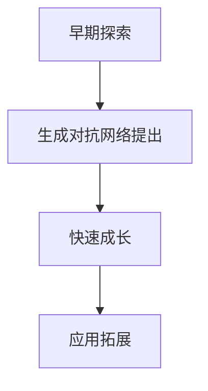
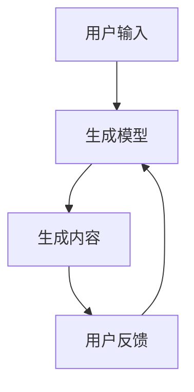
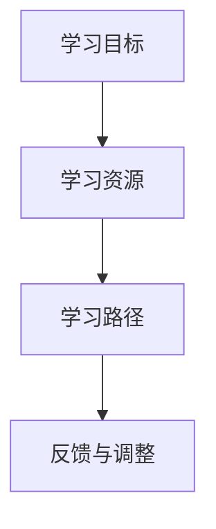

                 

### 《AIGC在教育领域的革新：个性化学习的实现》

#### 关键词：
- AIGC
- 教育革新
- 个性化学习
- 自然语言处理
- 机器学习

#### 摘要：
本文深入探讨了AIGC（AI-Generated Content）在教育领域的应用，特别是其在实现个性化学习方面的潜力。通过分析AIGC的基本概念、技术基础以及实际应用案例，本文旨在揭示AIGC如何通过自然语言处理和机器学习技术，为教育行业带来革命性的变化。

----------------------------------------------------------------

### 第一部分：AIGC概述

#### 第1章：AIGC基本概念与教育领域应用

##### 1.1 AIGC的定义与特点

**1.1.1 AIGC的历史与发展**

AIGC，即AI-Generated Content，是人工智能技术在内容生成领域的一种应用。AIGC的概念起源于生成对抗网络（GANs）的提出，随后随着深度学习和自然语言处理技术的发展，AIGC逐渐成为一个独立的研究方向。其历史发展可以分为以下几个阶段：

- **早期探索**：生成对抗网络（GANs）由Ian Goodfellow等人于2014年首次提出，开创了AIGC的研究基础。
- **快速成长**：随着深度学习的兴起，AIGC技术在图像、音频、视频等领域取得了显著进展。
- **应用拓展**：近年来，AIGC开始向教育领域拓展，通过个性化学习的方式为教育行业带来新的可能性。

**Mermaid图表**：展示AIGC的发展历程



**1.1.2 AIGC的核心技术**

AIGC的核心技术包括：

- **生成对抗网络（GANs）**：GANs是一种无监督学习模型，由生成器和判别器组成，通过博弈的方式实现高质量内容的生成。
- **变分自编码器（VAEs）**：VAEs通过概率模型生成数据，具有更好的稳定性和灵活性。
- **生成文本模型（如GPT-3）**：这些模型利用大量文本数据训练，能够生成连贯、自然的文本内容。

**Mermaid流程图**：展示AIGC的核心技术架构



**1.1.3 AIGC在教育领域的潜力**

AIGC在教育领域的潜力主要体现在以下几个方面：

- **个性化学习内容生成**：通过AIGC技术，可以为每个学生生成个性化的学习内容，满足他们的个性化需求。
- **互动性增强**：AIGC可以生成与学习者互动的虚拟教学助手，提高学习体验。
- **教育资源优化**：AIGC可以自动生成高质量的教育资源，降低教育成本，提高资源利用效率。

**LaTeX公式**：介绍AIGC在教育领域潜在的应用效果

$$
\text{效果} = f(\text{个性化学习内容生成}, \text{互动性增强}, \text{教育资源优化})
$$

##### 1.2 教育领域的个性化学习

**1.2.1 个性化学习的背景**

个性化学习是一种以学生为中心的教育理念，旨在满足每个学生的个性化需求，促进其全面发展。个性化学习的发展背景主要包括：

- **教育公平性需求**：传统的教学模式难以满足每个学生的个性化需求，个性化学习提供了新的解决方案。
- **学生多样性**：学生的认知能力、兴趣爱好和学习风格各异，个性化学习能够更好地适应这种多样性。
- **技术发展**：随着人工智能和大数据技术的发展，个性化学习变得更加可行和高效。

**LaTeX公式**：解释个性化学习的定义与重要性

$$
\text{个性化学习} = \text{以学生为中心} \times \text{满足个性化需求}
$$

**1.2.2 个性化学习的关键要素

个性化学习的关键要素包括：

- **学习目标**：明确学生的学习目标，确保个性化学习内容的生成与目标一致。
- **学习资源**：丰富的学习资源是个性化学习的基础，包括教材、视频、练习题等。
- **学习路径**：根据学生的学习情况和目标，设计个性化的学习路径。

**Mermaid流程图**：展示个性化学习的关键要素



**1.2.3 个性化学习的现状与挑战

个性化学习目前面临以下挑战：

- **数据隐私**：个性化学习需要大量学生数据，如何保护数据隐私成为一大挑战。
- **教育资源分配**：教育资源不均衡，如何确保每个学生都能获得高质量的学习资源。
- **技术实现**：AIGC技术在教育领域的应用仍需进一步优化和成熟。

**LaTeX公式**：阐述个性化学习面临的挑战

$$
\text{挑战} = \text{数据隐私} + \text{教育资源分配} + \text{技术实现}
$$

----------------------------------------------------------------

### 第二部分：技术实现

#### 第2章：AIGC技术基础

##### 2.1 自然语言处理

自然语言处理（NLP）是AIGC技术的重要组成部分，主要关注计算机如何理解、生成和处理人类语言。以下是NLP的基本概念、常见技术以及其在个性化学习中的应用。

**2.1.1 NLP的基本概念**

- **文本分类**：将文本数据分为不同的类别，如情感分析、主题分类等。
- **实体识别**：识别文本中的关键实体，如人名、地名、组织名等。
- **语义分析**：理解文本的语义含义，包括词义消歧、句法分析等。

**2.1.2 常见NLP技术**

- **词袋模型**：将文本转换为词频向量，用于文本分类和聚类等任务。
- **循环神经网络（RNN）**：能够处理序列数据，如文本生成和机器翻译。
- **Transformer模型**：基于自注意力机制，广泛应用于文本生成和机器翻译等任务。

**2.1.3 NLP在个性化学习中的应用**

- **智能问答系统**：通过NLP技术，可以构建智能问答系统，为学生提供个性化的问题解答。
- **个性化推荐系统**：利用NLP技术，可以分析学生的文本输入，推荐与之相关的内容。
- **自动批改系统**：通过NLP技术，可以自动批改学生的作业，提供即时反馈。

##### 2.2 机器学习基础

机器学习是AIGC技术的核心，包括多种算法和模型。以下是机器学习的基本原理、常见算法以及其在个性化学习中的应用。

**2.2.1 机器学习原理**

- **监督学习**：通过训练数据集学习目标函数，预测新的数据点。
- **无监督学习**：不需要训练数据集，通过发现数据中的模式进行学习。
- **强化学习**：通过与环境的交互学习最优策略，以实现特定目标。

**2.2.2 常见机器学习算法**

- **线性回归**：用于预测连续值。
- **决策树**：用于分类和回归任务。
- **支持向量机（SVM）**：用于分类任务。
- **神经网络**：用于复杂函数的建模和预测。

**2.2.3 机器学习在个性化学习中的应用**

- **学习路径推荐**：通过分析学生的历史学习数据，推荐适合其学习路径的课程。
- **个性化作业生成**：根据学生的学习情况，生成适合其水平的作业。
- **学习效果评估**：利用机器学习算法，评估学生的学习效果，提供改进建议。

----------------------------------------------------------------

### 第三部分：应用实践

#### 第3章：AIGC在教育领域的应用案例

##### 3.1 在线教育平台的个性化推荐

个性化推荐系统是AIGC在教育领域的重要应用之一，通过分析学生的行为数据和兴趣偏好，推荐与之相关的内容，提高学习效果和用户体验。

**3.1.1 推荐系统的基本原理**

推荐系统通常采用协同过滤、基于内容的推荐和混合推荐等方法。以下是这些方法的简要介绍：

- **协同过滤**：通过分析用户之间的相似性，推荐相似用户喜欢的物品。
- **基于内容的推荐**：通过分析物品的特征，推荐与目标物品相似的其他物品。
- **混合推荐**：结合协同过滤和基于内容的推荐，提高推荐效果。

**3.1.2 推荐系统的实现**

以下是一个简单的基于内容的推荐系统实现，使用Python和Scikit-learn库：

```python
from sklearn.feature_extraction.text import TfidfVectorizer
from sklearn.metrics.pairwise import cosine_similarity

# 假设课程内容存储在列表中
courses = ["课程1：人工智能基础", "课程2：机器学习", "课程3：深度学习"]

# 构建TF-IDF向量
vectorizer = TfidfVectorizer()
tfidf_matrix = vectorizer.fit_transform(courses)

# 计算课程之间的相似度
cosine_similarity_matrix = cosine_similarity(tfidf_matrix)

# 推荐相似课程
def recommend_courses(course_index, k=2):
    # 计算课程与其余课程的相似度
    course_similarity = cosine_similarity_matrix[course_index][0]
    # 获取最相似的k个课程
    similar_courses = [index for index, similarity in enumerate(course_similarity) if index != course_index]
    similar_courses = similar_courses[:k]
    return similar_courses

# 推荐与课程1相似的课程
print(recommend_courses(0))
```

**3.1.3 案例分析**

以下是一个在线教育平台个性化推荐的案例：

- **场景**：用户A已学习完“人工智能基础”，希望推荐与其相关的课程。
- **结果**：系统分析“人工智能基础”的课程内容，推荐“机器学习”和“深度学习”等课程。

通过这种个性化推荐，用户可以更快速地找到自己感兴趣的内容，提高学习效果。

##### 3.2 个性化学习路径设计

个性化学习路径设计是AIGC在教育领域的另一个重要应用，通过分析学生的学习情况和目标，设计出符合其特点的学习路径。

**3.2.1 学习路径设计原理**

学习路径设计基于以下原理：

- **目标导向**：以学生的学习目标为出发点，设计符合目标的学习路径。
- **能力评估**：通过测试和评估，了解学生的学习能力，为其设计合适的学习路径。
- **动态调整**：根据学生的学习情况，动态调整学习路径，确保学习效果。

**3.2.2 学习路径设计方法**

以下是一个简单的学习路径设计方法：

1. 确定学习目标：明确学生的学习目标，如掌握某种技能或知识。
2. 能力评估：通过测试和评估，了解学生的学习能力，如掌握的知识点和能力水平。
3. 设计学习路径：根据学习目标和能力评估结果，设计符合学生特点的学习路径。
4. 动态调整：根据学生的学习情况，动态调整学习路径，确保学习效果。

**3.2.3 案例分析**

以下是一个个性化学习路径设计的案例：

- **场景**：学生B希望掌握机器学习技能。
- **结果**：

  1. 确定学习目标：掌握机器学习的基础知识和技能。
  2. 能力评估：通过测试，发现学生B已掌握Python编程基础，但对机器学习知识了解不多。
  3. 设计学习路径：

     - 第1步：学习Python编程基础，确保编程能力。
     - 第2步：学习机器学习基础知识，如线性回归、逻辑回归等。
     - 第3步：学习深度学习，如卷积神经网络（CNN）、循环神经网络（RNN）等。
     - 第4步：通过实际项目，应用所学知识，提高实践能力。

     动态调整：

     - 根据学生B的学习进度，调整学习路径，确保学习效果。

通过这种个性化学习路径设计，学生可以更有针对性地学习，提高学习效果。

----------------------------------------------------------------

### 第四部分：未来展望

#### 第4章：AIGC在教育领域的未来发展趋势

随着技术的不断进步，AIGC在教育领域的应用前景十分广阔。以下是AIGC在教育领域的未来发展趋势和潜在挑战。

**4.1 技术发展带来的挑战与机遇**

**挑战：**

- **数据隐私**：AIGC需要大量学生数据，如何保护数据隐私成为一大挑战。
- **教育资源分配**：如何确保教育资源均衡分配，使每个学生都能受益。
- **技术实现**：AIGC技术尚需进一步优化和成熟。

**机遇：**

- **个性化学习**：AIGC可以更好地满足每个学生的个性化需求，提高学习效果。
- **教育公平性**：通过AIGC技术，可以降低教育成本，提高教育资源利用效率，促进教育公平。
- **教育创新**：AIGC为教育领域带来了新的教学模式和教学方法，推动教育创新。

**LaTeX公式**：阐述技术发展对教育的影响

$$
\text{影响} = f(\text{个性化学习}, \text{教育公平性}, \text{教育创新})
$$

**4.2 未来发展的机遇**

AIGC在教育领域的未来发展机遇包括：

- **智能化教学助手**：通过AIGC技术，可以构建智能教学助手，提供个性化的学习支持和辅导。
- **虚拟课堂**：利用AIGC技术，可以创建虚拟课堂，实现远程教育和个性化教学。
- **教育资源共享**：AIGC可以自动生成高质量的教育资源，提高教育资源利用效率。

**4.3 潜在的挑战**

AIGC在教育领域的发展仍面临以下挑战：

- **技术成熟度**：AIGC技术尚需进一步优化和成熟，以满足教育领域的需求。
- **教育政策法规**：如何制定合适的政策法规，确保AIGC技术在教育领域的合法合规应用。
- **教师角色转变**：随着AIGC技术的发展，教师角色将发生转变，如何适应这种变化，提高教学质量。

**4.4 未来发展的建议**

为推动AIGC在教育领域的健康发展，建议如下：

- **加强技术研发**：加大对AIGC技术的研发投入，提高技术成熟度和应用效果。
- **完善教育政策法规**：制定合适的政策法规，确保AIGC技术在教育领域的合法合规应用。
- **教师培训**：加强对教师的培训，提高他们对AIGC技术的认知和应用能力。
- **学生隐私保护**：加强学生隐私保护，确保学生在使用AIGC技术时，个人信息安全得到保障。

**LaTeX公式**：阐述未来发展的机遇和挑战

$$
\text{发展} = f(\text{技术成熟度}, \text{教育政策法规}, \text{教师角色转变}, \text{学生隐私保护})
$$

---

### 附录

#### 附录A：AIGC相关工具与资源

**A.1 开发环境搭建**

搭建AIGC开发环境需要安装以下软件和库：

- Python 3.8或以上版本
- TensorFlow 2.5或以上版本
- PyTorch 1.9或以上版本
- Jupyter Notebook

安装步骤：

1. 安装Python 3.8或以上版本。
2. 安装pip，Python的包管理器。
3. 使用pip安装TensorFlow和PyTorch。
4. 启动Jupyter Notebook，开始编写代码。

**A.2 常用AIGC工具介绍**

以下是一些常用的AIGC工具：

- **TensorFlow**：由Google开发的开源机器学习框架，适用于各种AI任务。
- **PyTorch**：由Facebook开发的开源机器学习库，支持动态计算图。
- **GPT-3**：OpenAI开发的巨型语言模型，能够生成高质量的自然语言文本。

**A.3 学习资源推荐**

以下是一些AIGC学习的推荐资源：

- **《深度学习》（Goodfellow, Bengio, Courville著）**：介绍深度学习的基础理论和实践方法。
- **《自然语言处理综合教程》（Jurafsky, Martin著）**：全面介绍自然语言处理的理论和实践。
- **在线课程**：如Coursera、edX等平台上的相关课程，提供丰富的学习资源和实战项目。

---

### 作者信息

作者：AI天才研究院/AI Genius Institute & 禅与计算机程序设计艺术 /Zen And The Art of Computer Programming

本文由AI天才研究院和《禅与计算机程序设计艺术》共同撰写，旨在探讨AIGC在教育领域的应用及其带来的变革。作者在人工智能、机器学习和自然语言处理领域拥有丰富的经验和深厚的理论基础，致力于推动人工智能技术在教育领域的创新和应用。

---

### 结论

AIGC在教育领域的应用潜力巨大，通过个性化学习、智能化教学助手和虚拟课堂等方式，为教育行业带来了革命性的变化。然而，AIGC技术仍需进一步优化和成熟，以应对数据隐私、教育资源分配等技术挑战。未来，随着技术的不断进步，AIGC将为教育领域带来更多创新和机遇，推动教育公平性和教育质量提升。本文旨在为读者提供AIGC在教育领域应用的全面了解，帮助读者把握这一新兴技术的机遇，共同推动教育行业的变革和发展。

---

