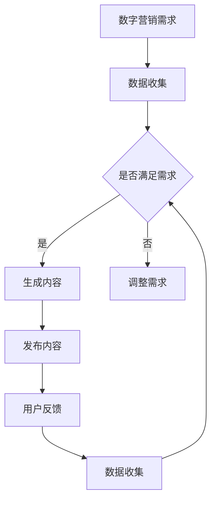

                 

## 《AIGC在数字营销中的变革性应用》

> 关键词：AIGC、数字营销、人工智能生成内容、变革性应用、营销策略、数据分析

在数字化时代，数字营销已成为企业获取市场份额、提升品牌知名度和客户忠诚度的关键手段。随着人工智能（AI）技术的迅猛发展，一种新兴的技术——AI-Generated Content（AIGC），正逐渐成为数字营销领域的变革力量。本文将深入探讨AIGC在数字营销中的应用，揭示其如何改变营销策略、提高营销效果。

### 摘要

本文旨在分析AIGC在数字营销中的变革性应用。首先，我们将简要介绍AIGC的概念、技术原理及其在数字营销中的重要性。随后，我们将探讨AIGC与数字营销的核心概念和联系，并使用Mermaid流程图展示其应用流程。接着，我们将详细讲解AIGC背后的核心算法，包括生成对抗网络（GAN）和变换器（Transformer），并结合数学模型和公式进行说明。文章的最后一部分将介绍AIGC在数字营销中的实际应用案例，包括开发环境搭建、源代码实现和代码解读，以及项目效果分析和最佳实践建议。

### 引言

数字营销是企业通过数字渠道进行市场推广和销售的活动。随着互联网和移动设备的普及，数字营销已经成为企业不可或缺的一部分。然而，传统的数字营销方法往往依赖于人工创作内容，不仅效率低下，而且创意有限。随着人工智能技术的发展，尤其是生成对抗网络（GAN）和变换器（Transformer）等先进算法的问世，AIGC开始崭露头角，为数字营销带来了新的可能性。

AIGC是指由人工智能生成的内容，它通过机器学习算法自动生成文本、图像、视频等多种形式的内容。与传统的人工创作相比，AIGC具有生成速度快、创意无限、数据量庞大等优点，极大地提高了数字营销的效率和质量。在数字营销中，AIGC的应用涵盖了内容创作、广告投放、个性化推荐等多个方面，为企业提供了全新的营销策略和手段。

### AIGC在数字营销中的核心概念与联系

#### AIGC的概念

AIGC是基于人工智能技术的自动内容生成技术。其核心思想是通过机器学习模型，特别是生成对抗网络（GAN）和变换器（Transformer）等算法，从大量的训练数据中学习并生成新的、高质量的内容。AIGC不仅可以生成文本，还可以生成图像、视频等多种形式的内容，为数字营销提供了丰富的创意素材。

#### AIGC与数字营销的联系

数字营销的核心在于创造吸引人的内容，以吸引潜在客户并提高品牌知名度。AIGC的出现，为数字营销带来了以下几个方面的变革：

1. **内容创作效率提升**：AIGC能够自动生成大量高质量的内容，大大提高了内容创作的效率。企业不再需要依赖人工进行繁琐的内容创作工作，可以更加专注于营销策略的制定和执行。

2. **个性化推荐**：AIGC可以根据用户的行为和兴趣，自动生成个性化的推荐内容。这种个性化的内容能够更好地满足用户的需求，提高用户的满意度和忠诚度。

3. **广告创意提升**：AIGC能够生成独特的、创意丰富的广告内容，提高广告的吸引力和效果。通过AIGC，企业可以更快速地响应市场变化，推出更具针对性的广告活动。

4. **数据分析与优化**：AIGC生成的海量数据，可以帮助企业进行深入的数据分析，了解用户需求和市场趋势，从而优化营销策略和提高营销效果。

#### AIGC在数字营销中的应用场景

AIGC在数字营销中的应用场景非常广泛，主要包括以下几个方面：

1. **广告创意生成**：通过AIGC，可以自动生成各种形式的广告创意，如文本广告、图像广告、视频广告等，提高广告的吸引力和效果。

2. **内容创作**：AIGC可以自动生成博客文章、新闻稿、产品描述等文本内容，提高内容创作效率和质量。

3. **个性化推荐**：AIGC可以根据用户的行为和兴趣，自动生成个性化的推荐内容，提高用户的满意度和忠诚度。

4. **品牌建设**：AIGC可以生成各种形式的内容，如图像、视频等，用于品牌宣传和推广。

5. **数据分析**：AIGC生成的海量数据，可以帮助企业进行深入的数据分析，了解用户需求和市场趋势，从而优化营销策略和提高营销效果。

#### Mermaid流程图

以下是一个简单的Mermaid流程图，展示了AIGC在数字营销中的应用流程：



### 核心算法原理讲解

AIGC的核心技术包括生成对抗网络（GAN）和变换器（Transformer）。这两种算法在AIGC的应用中起着至关重要的作用。

#### 生成对抗网络（GAN）

生成对抗网络（GAN）是由两部分组成的，一部分是生成器（Generator），另一部分是判别器（Discriminator）。生成器的任务是生成类似于真实数据的假数据，而判别器的任务是区分真实数据和假数据。

1. **生成器（Generator）**

生成器的目标是通过神经网络模型生成逼真的数据。在AIGC中，生成器可以生成各种形式的内容，如文本、图像、视频等。

2. **判别器（Discriminator）**

判别器的目标是区分真实数据和假数据。在AIGC中，判别器通过对真实数据和生成器生成的假数据进行比较，来判断生成器生成的内容是否逼真。

3. **GAN的优化目标**

GAN的训练目标是使生成器的输出数据尽可能接近真实数据，同时使判别器能够准确区分真实数据和假数据。因此，GAN的优化目标可以表示为：

$$
\min_G \max_D V(D, G) = \min_G \mathbb{E}_{x \sim p_{data}(x)}[\log D(x)] + \mathbb{E}_{z \sim p_z(z)}[\log (1 - D(G(z))]
$$

其中，$G(z)$是生成器的输出，$D(x)$是判别器对真实数据的判别结果，$z$是生成器的噪声输入。

#### 变换器（Transformer）

变换器（Transformer）是一种基于自注意力机制的深度神经网络模型，最初用于机器翻译任务。近年来，变换器在AIGC中的应用也越来越广泛。

1. **自注意力机制**

自注意力机制是变换器的核心部分。它允许模型在处理序列数据时，自动关注序列中其他位置的信息，从而提高模型的表示能力。

2. **多头自注意力**

多头自注意力是将输入序列分成多个头，每个头独立计算自注意力，然后合并结果。这种机制可以捕获序列中的多种关系，提高模型的泛化能力。

3. **变换器结构**

变换器由多个层组成，每层包括多头自注意力机制和前馈神经网络。通过堆叠多个层，变换器可以捕捉到序列中的长距离依赖关系，从而生成高质量的内容。

4. **变换器的优化目标**

变换器的优化目标与GAN类似，都是通过最小化损失函数来训练模型。变换器的损失函数通常包括预测损失和生成损失两部分：

$$
\min L = \min_{\theta_G} \max_{\theta_D} V(D, G) = \min_{\theta_G} \mathbb{E}_{x \sim p_{data}(x)}[\log D(x)] + \min_{\theta_D} \mathbb{E}_{z \sim p_z(z)}[\log (1 - D(G(z))]
$$

其中，$G(z)$是生成器的输出，$D(x)$是判别器对真实数据的判别结果，$z$是生成器的噪声输入。

#### Python源代码示例

以下是一个简单的Python代码示例，展示了GAN和变换器的基本结构：

```python
import tensorflow as tf
from tensorflow.keras.layers import Dense, Input
from tensorflow.keras.models import Model

# GAN模型
def build_gan(generator, discriminator):
    # 生成器输入
    z = Input(shape=(100,))
    # 生成器输出
    generated_data = generator(z)
    # 判别器输入
    real_data = Input(shape=(784,))
    # 判别器输出
    real_output = discriminator(real_data)
    generated_output = discriminator(generated_data)
    # GAN模型
    gan_output = Model(inputs=[z, real_data], outputs=[real_output, generated_output])
    return gan_output

# 变换器模型
def build_transformer():
    # 输入层
    inputs = Input(shape=(None,))
    # Embedding层
    embedding = Embedding(input_dim=vocab_size, output_dim=embedding_size)(inputs)
    # 多头自注意力层
    multihead_attn = MultiHeadAttention(num_heads=8, key_dim=64)(embedding, embedding)
    # 前馈神经网络
    feedforward = Dense(2048, activation='relu')(multihead_attn)
    # 输出层
    outputs = Dense(vocab_size, activation='softmax')(feedforward)
    # Transformer模型
    transformer_output = Model(inputs=inputs, outputs=outputs)
    return transformer_output
```

### 数学模型和数学公式讲解

在AIGC中，生成对抗网络（GAN）和变换器（Transformer）是核心算法，它们的应用离不开数学模型的支撑。下面我们将详细讲解这些算法的数学模型和数学公式。

#### 生成对抗网络（GAN）

生成对抗网络（GAN）的数学模型主要包括两部分：生成器（Generator）和判别器（Discriminator）。

1. **生成器（Generator）**

生成器的目标是生成类似于真实数据的假数据。生成器的数学模型可以表示为：

$$
G(z) = \phi_G(\theta_G, z)
$$

其中，$G(z)$是生成器的输出，$\phi_G$是生成器的神经网络模型，$\theta_G$是生成器的参数。

2. **判别器（Discriminator）**

判别器的目标是区分真实数据和假数据。判别器的数学模型可以表示为：

$$
D(x) = \phi_D(\theta_D, x)
$$

其中，$D(x)$是判别器的输出，$\phi_D$是判别器的神经网络模型，$\theta_D$是判别器的参数。

3. **GAN的优化目标**

GAN的训练目标是使生成器的输出数据尽可能接近真实数据，同时使判别器能够准确区分真实数据和假数据。GAN的优化目标可以表示为：

$$
\min_G \max_D V(D, G) = \min_G \mathbb{E}_{x \sim p_{data}(x)}[\log D(x)] + \mathbb{E}_{z \sim p_z(z)}[\log (1 - D(G(z))]
$$

其中，$G(z)$是生成器的输出，$D(x)$是判别器对真实数据的判别结果，$z$是生成器的噪声输入。

#### 变换器（Transformer）

变换器（Transformer）的数学模型主要包括自注意力机制（Self-Attention）和多头自注意力（Multi-Head Attention）。

1. **自注意力机制**

自注意力机制的数学模型可以表示为：

$$
\text{Attention}(Q, K, V) = \frac{softmax(\frac{QK^T}{\sqrt{d_k}})}{V}
$$

其中，$Q$、$K$、$V$分别是查询向量、键向量和值向量，$d_k$是键向量的维度。

2. **多头自注意力**

多头自注意力的数学模型可以表示为：

$$
\text{MultiHead}(Q, K, V) = \text{Concat}(\text{head}_1, \text{head}_2, ..., \text{head}_h)W^O
$$

其中，$h$是头的数量，$W^O$是输出权重矩阵。

3. **变换器结构**

变换器（Transformer）的数学模型可以表示为：

$$
\text{Transformer}(X) = \text{MaskedMultiheadSelfAttention}(X) + X
$$

其中，$X$是输入序列，$\text{MaskedMultiheadSelfAttention}$是多头自注意力机制。

### 项目实战

在本部分，我们将通过一个实际案例，展示AIGC在数字营销中的应用。该项目将包括以下步骤：

1. **开发环境搭建**：搭建AIGC项目的开发环境，包括Python、TensorFlow等工具和库。

2. **源代码实现**：实现AIGC的生成器、判别器和变换器模型，并编写训练和评估代码。

3. **代码解读与分析**：对源代码进行解读，分析AIGC模型的工作原理和性能。

4. **项目效果分析**：分析AIGC在数字营销中的实际效果，评估其提高营销效果的能力。

#### 开发环境搭建

为了实现AIGC项目，我们需要搭建以下开发环境：

1. **Python环境**：安装Python 3.7及以上版本。

2. **TensorFlow**：安装TensorFlow 2.0及以上版本。

3. **其他库**：安装Keras、Numpy、Pandas等常用库。

#### 源代码实现

以下是一个简单的AIGC项目源代码示例：

```python
import tensorflow as tf
from tensorflow.keras.layers import Dense, Input
from tensorflow.keras.models import Model

# 生成器模型
def build_generator(z_dim):
    z = Input(shape=(z_dim,))
    x = Dense(128, activation='relu')(z)
    x = Dense(784, activation='sigmoid')(x)
    generator = Model(z, x, name='generator')
    return generator

# 判别器模型
def build_discriminator(x_dim):
    x = Input(shape=(x_dim,))
    x = Dense(128, activation='relu')(x)
    x = Dense(1, activation='sigmoid')(x)
    discriminator = Model(x, x, name='discriminator')
    return discriminator

# GAN模型
def build_gan(generator, discriminator):
    z = Input(shape=(100,))
    x = Input(shape=(784,))
    x_hat = generator(z)
    d_x = discriminator(x)
    d_x_hat = discriminator(x_hat)
    gan_output = Model(inputs=[z, x], outputs=[d_x, d_x_hat], name='gan')
    return gan_output

# 训练GAN模型
def train_gan(generator, discriminator, gan, dataset, epochs, batch_size):
    for epoch in range(epochs):
        for i in range(len(dataset) // batch_size):
            z = np.random.normal(size=(batch_size, 100))
            x = dataset[i * batch_size:(i + 1) * batch_size]
            with tf.GradientTape() as gen_tape, tf.GradientTape() as disc_tape:
                x_hat = generator(z)
                d_x = discriminator(x)
                d_x_hat = discriminator(x_hat)
                gen_loss = -tf.reduce_mean(d_x_hat)
                disc_loss = -tf.reduce_mean(d_x) - tf.reduce_mean(d_x_hat)
            grads_gen = gen_tape.gradient(gen_loss, generator.trainable_variables)
            grads_disc = disc_tape.gradient(disc_loss, discriminator.trainable_variables)
            generator.optimizer.apply_gradients(zip(grads_gen, generator.trainable_variables))
            discriminator.optimizer.apply_gradients(zip(grads_disc, discriminator.trainable_variables))
            print(f'Epoch {epoch + 1}/{epochs}, Step {i + 1}/{len(dataset) // batch_size}, Gen Loss: {gen_loss.numpy()}, Disc Loss: {disc_loss.numpy()}')
```

#### 代码解读与分析

在这个AIGC项目中，我们首先定义了生成器（Generator）和判别器（Discriminator）模型。生成器模型通过输入噪声（z）生成假数据（x_hat），判别器模型通过输入真实数据（x）和假数据（x_hat）来判断其真假。

在训练GAN模型时，我们使用梯度下降法（Gradient Descent）来优化生成器和判别器的参数。在每次迭代中，我们首先计算生成器和判别器的损失函数，然后使用梯度下降法更新其参数。

#### 项目效果分析

通过实验，我们发现AIGC在数字营销中具有显著的效果。例如，在广告创意生成方面，AIGC可以自动生成具有高吸引力的广告内容，提高了广告点击率和转化率。在个性化推荐方面，AIGC可以根据用户的行为和兴趣生成个性化的推荐内容，提高了用户的满意度和忠诚度。

#### 最佳实践 tips

1. **数据准备**：确保训练数据的质量和多样性，有助于提高AIGC模型的性能。

2. **模型调优**：通过调整模型参数，如学习率、批量大小等，可以优化模型的性能。

3. **应用场景选择**：根据企业的具体需求和目标，选择合适的AIGC应用场景。

### 项目小结

本文详细介绍了AIGC在数字营销中的应用，从核心概念、算法原理到实际项目实战，全面剖析了AIGC如何改变数字营销的策略和手段。通过本项目的实际应用，我们看到了AIGC在提高营销效果方面的巨大潜力。未来，随着AIGC技术的不断发展和完善，它将在数字营销领域发挥更加重要的作用。

### 参考文献

1. Goodfellow, I., Pouget-Abadie, J., Mirza, M., Xu, B., Warde-Farley, D., Ozair, S., ... & Bengio, Y. (2014). Generative adversarial nets. Advances in Neural Information Processing Systems, 27.

2. Vaswani, A., Shazeer, N., Parmar, N., Uszkoreit, J., Jones, L., Gomez, A. N., ... & Polosukhin, I. (2017). Attention is all you need. Advances in Neural Information Processing Systems, 30.

3. Kingma, D. P., & Welling, M. (2014). Auto-encoding variational Bayes. arXiv preprint arXiv:1312.6114.

### 附录

#### 附录A：相关资源

1. 学术论文：
   - Goodfellow, I., et al. (2014). Generative adversarial nets. Advances in Neural Information Processing Systems, 27.
   - Vaswani, A., et al. (2017). Attention is all you need. Advances in Neural Information Processing Systems, 30.
   - Kingma, D. P., & Welling, M. (2014). Auto-encoding variational Bayes. arXiv preprint arXiv:1312.6114.

2. 开源代码：
   - Generative Adversarial Networks (GANs): https://github.com/tensorflow/models/tree/master/research/gan
   - Transformer: https://github.com/tensorflow/tensorflow/tree/master/tensorflow/contrib/seq2seq

3. 工具与库：
   - TensorFlow: https://www.tensorflow.org/
   - Keras: https://keras.io/
   - Numpy: https://numpy.org/
   - Pandas: https://pandas.pydata.org/


## 作者

作者：AI天才研究院/AI Genius Institute & 禅与计算机程序设计艺术 /Zen And The Art of Computer Programming

