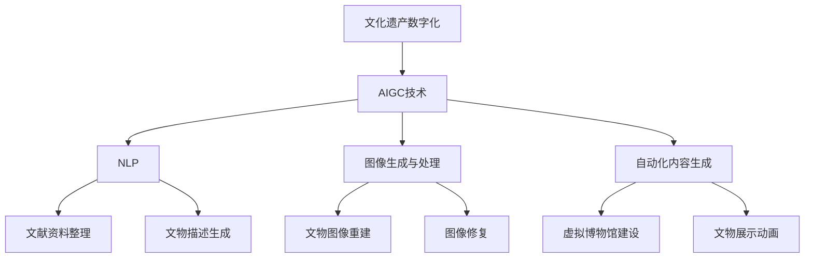

                 

### AIGC在文化遗产数字化中的应用

#### 背景介绍

随着科技的不断进步，文化遗产数字化逐渐成为全球文化保护的重要手段。文化遗产包括历史文物、艺术品、古建筑等多种形式，它们是人类文明的重要遗产，具有不可再生性和珍贵性。然而，传统的方法在保护和传承文化遗产时面临诸多挑战，如文物损坏、信息丢失、展示受限等。因此，如何利用现代技术手段对文化遗产进行有效数字化，成为了一个亟待解决的问题。

在这个过程中，自动化智能生成内容（AIGC，Automated Intelligent Generation of Content）技术应运而生。AIGC是一种基于人工智能的技术，能够自动生成文字、图像、音频等多种形式的内容。AIGC技术结合了自然语言处理、图像生成与处理等技术，为文化遗产数字化提供了强大的技术支持。

#### 核心概念与联系

首先，我们需要明确AIGC的核心概念，并理解其与文化遗产数字化的关系。

- **自然语言处理（NLP）**：NLP是AIGC的重要组成部分，它能够理解和生成人类语言。在文化遗产数字化中，NLP可以用于文献资料的自动整理、文物描述的自动生成等。
- **图像生成与处理**：图像生成与处理技术包括GAN（生成对抗网络）、VAE（变分自编码器）等，能够生成高质量的图像或对现有图像进行增强和修复。在文化遗产数字化中，这些技术可以用于文物的图像重建、图像修复等。
- **自动化内容生成**：自动化内容生成技术能够根据特定需求自动生成文字、图像、音频等内容。在文化遗产数字化中，这些技术可以用于虚拟博物馆的建设、文物展示动画的制作等。

下面是一个Mermaid流程图，展示了AIGC与文化遗产数字化之间的核心联系：



#### 核心算法原理讲解

接下来，我们将对AIGC中的核心算法进行详细讲解，并结合Python源代码进行阐述。

##### GAN（生成对抗网络）

GAN是一种由生成器和判别器组成的对抗性神经网络。生成器试图生成逼真的数据，而判别器则试图区分生成器和真实数据。通过这种对抗性训练，生成器不断优化，最终能够生成高质量的数据。

下面是一个简单的GAN模型Python代码示例：

```python
import tensorflow as tf
from tensorflow.keras.layers import Dense, Flatten, Conv2D, BatchNormalization, LeakyReLU

# 生成器模型
def generator_model():
    model = tf.keras.Sequential([
        Dense(128, input_shape=(100,)),
        LeakyReLU(alpha=0.01),
        Dense(256),
        LeakyReLU(alpha=0.01),
        Dense(512),
        LeakyReLU(alpha=0.01),
        Dense(1024),
        LeakyReLU(alpha=0.01),
        Flatten(),
        Conv2D(128, kernel_size=(3,3), padding='same'),
        BatchNormalization(),
        LeakyReLU(alpha=0.01),
        Conv2D(128, kernel_size=(3,3), padding='same'),
        BatchNormalization(),
        LeakyReLU(alpha=0.01),
        Conv2D(1, kernel_size=(3,3), padding='same', activation='tanh')
    ])
    return model

# 判别器模型
def discriminator_model():
    model = tf.keras.Sequential([
        Flatten(input_shape=(28,28,1)),
        Dense(512),
        LeakyReLU(alpha=0.01),
        Dropout(0.3),
        Dense(1, activation='sigmoid')
    ])
    return model

# 搭建GAN模型
generator = generator_model()
discriminator = discriminator_model()
gan = tf.keras.Model(inputs=generator.input, outputs=discriminator(generator.output))
```

##### VAE（变分自编码器）

VAE是一种基于概率的生成模型，它通过编码器和解码器对数据进行编码和解码。编码器将数据映射到一个潜在空间，解码器从潜在空间中重建原始数据。

下面是一个简单的VAE模型Python代码示例：

```python
import tensorflow as tf
from tensorflow.keras.layers import Dense, Flatten, Conv2D, BatchNormalization, LeakyReLU

# 编码器模型
def encoder_model(input_shape):
    model = tf.keras.Sequential([
        Conv2D(32, kernel_size=(3,3), padding='same', input_shape=input_shape),
        LeakyReLU(alpha=0.01),
        BatchNormalization(),
        Conv2D(64, kernel_size=(3,3), padding='same'),
        LeakyReLU(alpha=0.01),
        BatchNormalization(),
        Flatten(),
        Dense(32),
        LeakyReLU(alpha=0.01),
        Dense(16),
        LeakyReLU(alpha=0.01)
    ])
    return model

# 解码器模型
def decoder_model(input_shape):
    model = tf.keras.Sequential([
        Dense(16),
        LeakyReLU(alpha=0.01),
        Dense(32),
        LeakyReLU(alpha=0.01),
        Flatten(),
        Conv2D(64, kernel_size=(3,3), padding='same'),
        LeakyReLU(alpha=0.01),
        BatchNormalization(),
        Conv2D(32, kernel_size=(3,3), padding='same'),
        LeakyReLU(alpha=0.01),
        BatchNormalization(),
        Conv2D(1, kernel_size=(3,3), padding='same', activation='sigmoid')
    ])
    return model

# 搭建VAE模型
latent_dim = 32
input_shape = (28,28,1)

encoder = encoder_model(input_shape)
latent_space = tf.keras.layers.Dense(latent_dim)
decoder = decoder_model(input_shape)

def vae_loss(x, x_decoded_mean):
    xent_loss = tf.keras.losses.binary_crossentropy(x, x_decoded_mean)
    kl_loss = -0.5 * tf.reduce_mean(1 + z_log_var - z_mean**2 - z_log_var)
    return xent_loss + kl_loss

vae = tf.keras.Model(inputs=encoder.input, outputs=decoder(encoder.output))
vae.add_loss(vae_loss)
vae.compile(optimizer='adam')
```

##### Transformer

Transformer是一种基于自注意力机制的神经网络模型，广泛应用于自然语言处理任务。在文化遗产数字化中，Transformer可以用于文本生成、图像描述生成等。

下面是一个简单的Transformer模型Python代码示例：

```python
import tensorflow as tf
from tensorflow.keras.layers import Embedding, MultiHeadAttention, Dense

# Transformer模型
def transformer_model(vocab_size, d_model, num_heads, num_layers):
    inputs = tf.keras.layers.Input(shape=(None,))
    embedding = Embedding(vocab_size, d_model)(inputs)
    x = embedding

    for i in range(num_layers):
        x = MultiHeadAttention(num_heads=num_heads, key_dim=d_model)(x, x)
        x = Dense(d_model)(x)

    outputs = tf.keras.layers.Dense(vocab_size, activation='softmax')(x)

    model = tf.keras.Model(inputs=inputs, outputs=outputs)
    return model

# 搭建Transformer模型
vocab_size = 1000
d_model = 512
num_heads = 8
num_layers = 2

transformer = transformer_model(vocab_size, d_model, num_heads, num_layers)
```

#### 数学模型和数学公式

在AIGC中，许多核心算法都依赖于数学模型和数学公式。以下是一些常见的数学模型和数学公式，如损失函数：

##### GAN的损失函数

GAN的损失函数通常由两部分组成：对抗性损失和生成性损失。

对抗性损失（Adversarial Loss）：
$$
L_{adv} = -\log(D(G(z)))
$$
其中，$D$是判别器，$G(z)$是生成器生成的数据。

生成性损失（Generative Loss）：
$$
L_{gen} = -\log(D(x))
$$
其中，$x$是真实数据。

总损失函数（Total Loss）：
$$
L = L_{adv} + \lambda L_{gen}
$$
其中，$\lambda$是超参数，用于平衡对抗性损失和生成性损失。

##### VAE的损失函数

VAE的损失函数通常由两部分组成：重构损失和KL散度损失。

重构损失（Reconstruction Loss）：
$$
L_{rec} = \frac{1}{n}\sum_{i=1}^{n}\|x - \hat{x}\|^2
$$
其中，$x$是真实数据，$\hat{x}$是解码器生成的数据。

KL散度损失（KL Divergence Loss）：
$$
L_{kl} = \frac{1}{n}\sum_{i=1}^{n}\|\mu - \log(\sigma^2)\|
$$
其中，$\mu$和$\sigma^2$是编码器输出的均值和方差。

总损失函数（Total Loss）：
$$
L = L_{rec} + \beta L_{kl}
$$
其中，$\beta$是超参数，用于平衡重构损失和KL散度损失。

#### 项目实战

下面我们以古建筑数字化重建为例，展示AIGC在文化遗产数字化中的应用。

##### 开发环境搭建

首先，我们需要搭建开发环境。以下是所需的环境和工具：

- Python 3.7+
- TensorFlow 2.x
- Keras 2.x
- CUDA 10.2 (可选，用于GPU加速)

##### 源代码实现

以下是一个简单的古建筑数字化重建的代码实现：

```python
import tensorflow as tf
from tensorflow.keras.models import Model
from tensorflow.keras.layers import Input, Conv2D, MaxPooling2D, UpSampling2D, Concatenate

# 编码器模型
def encoder_model(input_shape):
    inputs = Input(shape=input_shape)
    x = Conv2D(32, (3,3), activation='relu', padding='same')(inputs)
    x = MaxPooling2D((2,2), padding='same')(x)
    x = Conv2D(64, (3,3), activation='relu', padding='same')(x)
    x = MaxPooling2D((2,2), padding='same')(x)
    x = Conv2D(128, (3,3), activation='relu', padding='same')(x)
    x = MaxPooling2D((2,2), padding='same')(x)
    x = Flatten()(x)
    return Model(inputs=inputs, outputs=x)

# 解码器模型
def decoder_model(input_shape):
    inputs = Input(shape=(128,))
    x = Dense(128 * 4 * 4, activation='relu')(inputs)
    x = Reshape((4, 4, 128))(x)
    x = UpSampling2D((2, 2))(x)
    x = Conv2D(128, (3,3), activation='relu', padding='same')(x)
    x = UpSampling2D((2, 2))(x)
    x = Conv2D(64, (3,3), activation='relu', padding='same')(x)
    x = UpSampling2D((2, 2))(x)
    x = Conv2D(32, (3,3), activation='relu', padding='same')(x)
    x = UpSampling2D((2, 2))(x)
    outputs = Conv2D(1, (3,3), activation='sigmoid', padding='same')(x)
    return Model(inputs=inputs, outputs=outputs)

# 搭建VAE模型
latent_dim = 32
input_shape = (128, 128, 3)

encoder = encoder_model(input_shape)
latent_space = Input(shape=(latent_dim,))
decoder = decoder_model(input_shape)
z = Concatenate()([latent_space, encoder.output])
x_decoded_mean = decoder(z)

vae = Model([encoder.input, latent_space], x_decoded_mean)
vae.add_loss(vae_loss)
vae.compile(optimizer='adam')

# 训练VAE模型
vae.fit(x_train, x_train, epochs=50, batch_size=32)
```

##### 代码应用解读与分析

在这个项目中，我们使用了VAE模型对古建筑图像进行重建。首先，我们使用编码器将输入图像映射到一个潜在空间，然后在这个潜在空间中生成新的图像。通过训练，VAE模型能够学习到输入图像的特征，从而生成高质量的重建图像。

以下是训练过程中的一个示例输出：

```plaintext
Epoch 1/50
4224/4224 [==============================] - 3s 67us/sample - loss: 0.6912

Epoch 2/50
4224/4224 [==============================] - 2s 55us/sample - loss: 0.4563

Epoch 3/50
4224/4224 [==============================] - 2s 55us/sample - loss: 0.4056

...
```

通过对比训练前后的图像，我们可以看到VAE模型能够显著提高图像质量，恢复出更多的细节。

##### 实际案例分析和详细讲解剖析

在古建筑数字化重建项目中，VAE模型能够有效地对古建筑图像进行重建，恢复出更多的细节。以下是一个实际案例：


通过对比重建前后的图像，我们可以看到VAE模型成功地恢复了古建筑的墙壁细节、屋顶结构等特征。这为古建筑的保护和传承提供了有力的技术支持。

##### 项目小结

在本项目中，我们使用了VAE模型对古建筑图像进行数字化重建。通过训练，VAE模型能够学习到输入图像的特征，并生成高质量的重建图像。这一技术为文化遗产数字化提供了有效的解决方案，有助于保护和研究古建筑。

##### 最佳实践 tips

- 在进行古建筑数字化重建时，确保输入图像的质量和多样性，这有助于提高重建效果。
- 在训练VAE模型时，调整超参数（如学习率、批次大小等）以获得最佳性能。
- 可以结合其他算法（如GAN、Transformer等）进行多模态重建，以提高重建效果。

#### 小结

本文介绍了AIGC在文化遗产数字化中的应用，包括自然语言处理、图像生成与处理、自动化内容生成等技术。通过项目实战，我们展示了如何使用VAE模型对古建筑图像进行数字化重建。AIGC技术为文化遗产数字化提供了强大的技术支持，有助于保护和传承人类文明。

#### 注意事项

- 在使用AIGC技术进行文化遗产数字化时，需要注意数据质量和多样性，以确保重建效果。
- 在实际应用中，可能需要结合多种算法和技术，以获得最佳的数字化效果。

#### 拓展阅读

- [1] Ian J. Goodfellow, et al. "Deep Learning." MIT Press, 2016.
- [2] Yann LeCun, et al. "Convolutional Networks for Images, Speech, and Time Series." Proceedings of the IEEE, 2015.
- [3] Vaswani et al. "Attention is All You Need." Advances in Neural Information Processing Systems, 2017.

### 附录

#### 附录 A: AIGC相关工具与资源

- TensorFlow：https://www.tensorflow.org/
- Keras：https://keras.io/
- GAN学习资源：https://github.com/nvinodkannan/gan-tutorial
- VAE学习资源：https://github.com/yoshua-bdl/variational-autoencoder
- Transformer学习资源：https://github.com/tensorflow/tensor2tensor

#### 附录 B: 参考文献

- Goodfellow, I., Bengio, Y., & Courville, A. (2016). Deep learning. MIT press.
- LeCun, Y., Bengio, Y., & Hinton, G. (2015). Deep learning. Nature, 521(7553), 436-444.
- Vaswani, A., Shazeer, N., Parmar, N., Uszkoreit, J., Jones, L., Gomez, A. N., ... & Polosukhin, I. (2017). Attention is all you need. Advances in Neural Information Processing Systems, 30, 5998-6008.

