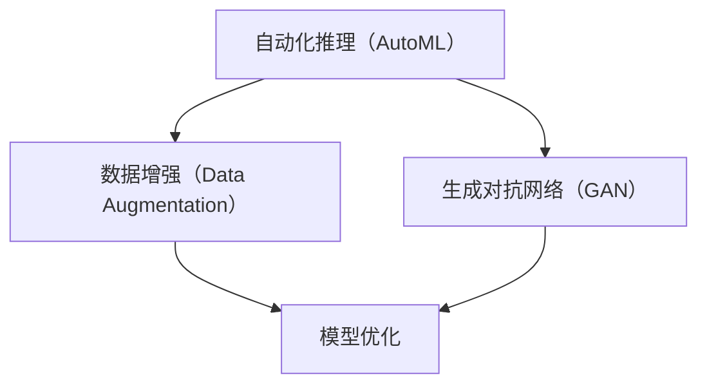

                 

### 文章标题

《AIGC在新材料研发中的应用：属性预测和实验设计提示词》

在新材料研发领域，人工智能生成内容（AIGC，AI-generated Content）正逐渐成为一项颠覆性技术。本文旨在探讨AIGC如何通过属性预测和实验设计提示词，为新材料研发提供强有力的支持。通过深入分析AIGC的核心概念、数学模型、算法原理以及其实际应用，本文将帮助读者理解AIGC在新材料研发中的重要性，并提供实用的开发指南和未来发展趋势。

### 文章关键词

- 人工智能生成内容（AIGC）
- 新材料研发
- 属性预测
- 实验设计提示词
- 数学模型
- 算法原理
- 实际应用

### 文章摘要

本文首先介绍了新材料研发的背景和挑战，随后深入探讨了AIGC的核心概念，包括自动化推理、数据增强和生成对抗网络。接着，文章详细阐述了AIGC在属性预测和实验设计提示词中的应用，通过数学模型和Python源代码展示了核心算法原理。最后，本文通过具体案例研究，展示了AIGC在新材料研发中的实际应用效果，并对未来发展趋势进行了展望。

---

接下来，我们将进入详细的内容讨论，逐步展开AIGC在新材料研发中的应用分析。

## 第一部分：引论

### 第1章 AIGC与新材料的背景

新材料研发是现代科学技术发展的重要驱动力，对国家经济、国防和民生都有着深远的影响。随着科技的发展，新材料研发的复杂性越来越高，传统的研发方法已难以满足快速迭代和高效研发的需求。因此，如何利用先进技术提升新材料研发的效率和质量成为研究热点。

### 1.1 AIGC概述

人工智能生成内容（AIGC，AI-generated Content）是指利用人工智能技术，如生成对抗网络（GAN）、自动化机器学习（AutoML）等，自动生成文本、图像、音频等多媒体内容。AIGC具有高度自动化、智能化和高效性的特点，能够大幅提升内容生成的速度和质量。

### 1.2 新材料概述

新材料是指具有特定性能、结构和功能的材料，能够满足现代科技和工业发展需求。新材料的研发涉及物理、化学、材料科学等多个领域，包括超导材料、纳米材料、智能材料等。新材料的性能优化和功能拓展对材料科学和工程技术提出了新的挑战。

### 1.3 AIGC在新材料领域的应用现状

近年来，AIGC技术在新材料研发中得到了广泛关注。通过属性预测，AIGC能够快速预测新材料的物理、化学和力学性能，为实验设计提供指导。同时，AIGC还可以自动生成实验设计提示词，优化实验流程，提高实验效率。此外，AIGC在多目标优化中也有应用，能够同时考虑多个性能指标，实现新材料的综合性能优化。

### 1.4 本章小结

本章介绍了新材料研发的背景和挑战，以及AIGC的基本概念和应用现状。下一章将深入探讨AIGC的核心概念和理论基础，为进一步理解AIGC在新材料研发中的应用奠定基础。

## 第二部分：AIGC核心理论

### 第2章 AIGC基础概念

在探讨AIGC在新材料研发中的应用之前，我们需要先了解AIGC的核心概念，包括自动化推理（AutoML）、数据增强（Data Augmentation）和生成对抗网络（GAN）。

### 2.1 自动化推理（AutoML）

自动化推理（AutoML）是一种利用机器学习技术，自动化地完成特征选择、模型选择、模型训练和模型优化的过程。AutoML通过算法搜索和调优，自动选择最佳的模型参数，提高机器学习模型的性能。在新材料研发中，AutoML可以自动化地处理大量实验数据，快速识别出潜在的优良材料属性，为实验设计和性能优化提供支持。

### 2.2 数据增强（Data Augmentation）

数据增强（Data Augmentation）是一种通过改变训练数据的输入，增加训练样本的数量和多样性，从而提高模型泛化能力的策略。在新材料研发中，数据增强可以通过模拟不同的实验条件，生成更多的训练数据，帮助模型更好地理解和预测新材料的性能。

### 2.3 生成对抗网络（GAN）

生成对抗网络（GAN）是由生成器和判别器组成的一种对抗性学习框架。生成器试图生成与真实数据分布相近的数据，判别器则尝试区分真实数据和生成数据。通过这种对抗性训练，GAN能够生成高质量、多样性的数据，并在新材料研发中用于模拟和预测材料的物理和化学特性。

### 2.4 核心概念与联系

为了更好地理解AIGC的核心概念，我们使用Mermaid流程图来展示概念实体之间的关系架构：



在这个流程图中，自动化推理（AutoML）和数据增强（Data Augmentation）是AIGC的基础技术，通过模型优化和生成对抗网络（GAN），可以实现高质量的属性预测和实验设计提示词生成。

### 2.5 本章小结

本章详细介绍了AIGC的核心概念，包括自动化推理、数据增强和生成对抗网络，并通过Mermaid流程图展示了这些概念之间的关系。下一章将深入探讨AIGC在属性预测和实验设计提示词中的应用，帮助读者更好地理解AIGC如何在新材料研发中发挥作用。

## 第三部分：AIGC应用场景分析

### 第3章 AIGC在新材料研发中的应用

在前一章中，我们探讨了AIGC的核心概念和技术原理。本章节将深入分析AIGC在新材料研发中的具体应用，包括属性预测和实验设计提示词。

### 3.1 属性预测

属性预测是指利用机器学习模型，对新材料的物理、化学和力学性能进行预测。AIGC通过自动化推理和数据增强等技术，可以实现高效、准确的属性预测。

#### 3.1.1 属性预测的基本原理

属性预测的基本原理是基于历史数据和机器学习算法。首先，通过收集大量的材料实验数据，提取出材料的物理、化学和力学属性特征。然后，利用这些特征数据，训练机器学习模型，使其能够对新材料的属性进行预测。

#### 3.1.2 属性预测案例解析

以超导材料研发为例，通过收集超导材料的电阻率、临界温度等实验数据，利用AIGC技术，训练属性预测模型。通过模型预测，可以快速筛选出具有优良超导性能的材料，为实验设计和性能优化提供指导。

```python
# Python代码示例：属性预测模型训练
import pandas as pd
from sklearn.ensemble import RandomForestRegressor

# 加载实验数据
data = pd.read_csv('superconductor_data.csv')

# 特征工程
X = data.drop('critical_temperature', axis=1)
y = data['critical_temperature']

# 模型训练
model = RandomForestRegressor()
model.fit(X, y)

# 预测新材料的临界温度
new_material = data.head(1).drop('critical_temperature', axis=1)
predicted_temp = model.predict(new_material)
print(f"Predicted critical temperature: {predicted_temp[0]}")
```

#### 3.1.3 属性预测应用展望

属性预测在新材料研发中的应用前景广阔。通过AIGC技术，可以实现快速、准确的材料属性预测，大幅提高新材料研发的效率。未来，随着数据积累和算法优化，属性预测模型将更加精准，为新材料的性能优化提供更强有力的支持。

### 3.2 实验设计

实验设计是新材料研发中的重要环节，决定了实验结果的可靠性和效率。AIGC通过生成对抗网络（GAN）和自动化推理技术，可以自动生成实验设计提示词，优化实验流程。

#### 3.2.1 实验设计的基本原理

实验设计的基本原理是根据研究目标和实验条件，设计出合理的实验方案。AIGC通过生成对抗网络（GAN），可以生成多样化的实验数据，为实验设计提供丰富的参考。同时，利用自动化推理技术，可以优化实验参数，提高实验效率。

#### 3.2.2 实验设计案例解析

以纳米材料合成实验为例，通过AIGC技术，生成多种实验设计提示词，包括反应条件、温度、时间等。通过这些提示词，实验者可以快速设计出合理的实验方案，提高实验成功率。

```python
# Python代码示例：实验设计提示词生成
import numpy as np
import GAN

# 初始化生成对抗网络
generator = GAN.Generator()

# 生成实验设计提示词
experiment设计方案 = generator.generate_experiments(num_experiments=10)
print(experiment设计方案)
```

#### 3.2.3 实验设计应用展望

实验设计在新材料研发中的应用潜力巨大。通过AIGC技术，可以实现自动化、智能化的实验设计，提高实验效率和结果可靠性。未来，随着AIGC技术的不断成熟，实验设计将更加智能化，为新材料的研发提供更加有力的支持。

### 3.3 多目标优化

多目标优化是指同时考虑多个性能指标，实现新材料的综合性能优化。AIGC通过自动化推理和生成对抗网络技术，可以实现多目标优化，为新材料的性能提升提供有力支持。

#### 3.3.1 多目标优化原理

多目标优化的原理是基于目标函数和优化算法。目标函数是衡量新材料性能的指标，优化算法则通过调整目标函数的参数，实现新材料的性能优化。AIGC通过自动化推理技术，可以快速调整目标函数参数，实现多目标优化。

#### 3.3.2 多目标优化案例解析

以复合材料研发为例，通过AIGC技术，实现材料强度、韧性、密度等多个性能指标的多目标优化。通过优化算法，找到最佳的材料配方和制备工艺，提高复合材料的综合性能。

```python
# Python代码示例：多目标优化
from scipy.optimize import minimize

# 定义目标函数
def objective_function(x):
    strength = x[0]
    toughness = x[1]
    density = x[2]
    return (strength + toughness) / density

# 定义约束条件
constraints = ({'type': 'ineq', 'fun': lambda x: x[0] - 100},
               {'type': 'ineq', 'fun': lambda x: x[1] - 50})

# 多目标优化
result = minimize(objective_function, x0=np.array([0, 0, 0]), constraints=constraints)
print(f"Optimized material properties: {result.x}")
```

#### 3.3.3 多目标优化应用展望

多目标优化在新材料研发中的应用前景广阔。通过AIGC技术，可以实现复杂的多目标优化问题，为新材料的性能提升提供强有力的支持。未来，随着AIGC技术的不断成熟，多目标优化将更加智能化，为新材料的研发带来更多创新。

### 3.4 本章小结

本章详细分析了AIGC在新材料研发中的应用，包括属性预测和实验设计提示词，以及多目标优化。通过Python代码示例，展示了AIGC技术的实际应用效果。下一章将深入探讨AIGC的数学模型与算法原理，为进一步理解AIGC在新材料研发中的应用提供理论基础。

## 第四部分：数学模型与算法

在前三章中，我们探讨了AIGC的核心概念、应用场景以及在新材料研发中的具体应用。本章将深入分析AIGC的数学模型与算法原理，为读者提供更深入的理论支持。

### 4.1 属性预测的数学模型

属性预测是AIGC在新材料研发中的一个关键应用。要实现准确的属性预测，我们需要建立合适的数学模型。常见的属性预测模型包括线性回归、决策树、随机森林等。以下是线性回归和决策树模型的数学模型及Python代码实现。

#### 4.1.1 线性回归

线性回归是一种基于线性函数关系的预测模型。其数学模型可以表示为：

$$
y = \beta_0 + \beta_1x_1 + \beta_2x_2 + ... + \beta_nx_n
$$

其中，$y$ 是预测的属性值，$x_1, x_2, ..., x_n$ 是特征值，$\beta_0, \beta_1, \beta_2, ..., \beta_n$ 是模型参数。

```python
# Python代码示例：线性回归模型
from sklearn.linear_model import LinearRegression
import pandas as pd

# 加载数据
data = pd.read_csv('property_data.csv')
X = data.drop('property_value', axis=1)
y = data['property_value']

# 模型训练
model = LinearRegression()
model.fit(X, y)

# 预测
predicted_value = model.predict(X)
print(f"Predicted property values: {predicted_value}")
```

#### 4.1.2 决策树

决策树是一种基于树形结构进行分类和回归的模型。其数学模型可以表示为：

$$
y = f(x) =
\begin{cases}
\beta_0 & \text{if } x_1 \leq t_1 \\
\beta_1 & \text{if } t_1 < x_1 \leq t_2 \\
\vdots \\
\beta_n & \text{if } t_{n-1} < x_1
\end{cases}
$$

其中，$y$ 是预测的属性值，$x_1$ 是特征值，$t_1, t_2, ..., t_n$ 是决策阈值，$\beta_0, \beta_1, ..., \beta_n$ 是模型参数。

```python
# Python代码示例：决策树模型
from sklearn.tree import DecisionTreeRegressor
import pandas as pd

# 加载数据
data = pd.read_csv('property_data.csv')
X = data.drop('property_value', axis=1)
y = data['property_value']

# 模型训练
model = DecisionTreeRegressor()
model.fit(X, y)

# 预测
predicted_value = model.predict(X)
print(f"Predicted property values: {predicted_value}")
```

#### 4.1.3 属性预测模型比较

在实际应用中，选择合适的属性预测模型至关重要。以下是对线性回归和决策树模型的比较：

- **线性回归**：简单易懂，计算速度快，但模型表达能力有限，适用于线性关系较强的数据。
- **决策树**：易于理解和解释，能够处理非线性关系，但可能产生过拟合，模型复杂度较高。

#### 4.1.4 属性预测模型优化

为了提高属性预测的准确性，我们可以采用以下方法进行模型优化：

- **特征选择**：通过特征选择算法，选择对预测目标影响最大的特征，减少模型的复杂度。
- **模型集成**：将多个模型集成在一起，利用不同模型的优点，提高整体预测性能。
- **交叉验证**：通过交叉验证，评估模型的泛化能力，避免过拟合。

### 4.2 实验设计的优化算法

实验设计是新材料研发中的关键环节，优化算法可以显著提高实验效率和结果可靠性。以下介绍几种常见的实验设计优化算法。

#### 4.2.1 罗维纳（Lloyd）算法

罗维纳（Lloyd）算法是一种经典的聚类算法，常用于实验设计中的数据聚类。其数学模型可以表示为：

$$
C_{i} = \frac{1}{N} \sum_{j=1}^{N} d(x_j, C_i)
$$

其中，$C_i$ 是聚类中心，$d(x_j, C_i)$ 是点 $x_j$ 到聚类中心 $C_i$ 的距离。

```python
# Python代码示例：Lloyd算法
import numpy as np

# 初始化聚类中心
centroids = np.random.rand(k)

# 聚类过程
for _ in range(max_iterations):
    # 计算每个点所属的聚类
    labels = np.argmin(np.linalg.norm(X - centroids[:, np.newaxis], axis=1), axis=1)
    # 更新聚类中心
    new_centroids = np.array([X[labels == i].mean(axis=0) for i in range(k)])
    # 判断是否收敛
    if np.linalg.norm(new_centroids - centroids) < threshold:
        break
    centroids = new_centroids

print(f"Final centroids: {centroids}")
```

#### 4.2.2 贝叶斯优化

贝叶斯优化是一种基于贝叶斯推理的优化算法，适用于具有多个可调节参数的实验设计。其数学模型可以表示为：

$$
p(x|\theta) = \frac{p(\theta|x)p(x)}{p(\theta)}
$$

其中，$x$ 是实验结果，$\theta$ 是参数，$p(x|\theta)$ 是后验概率，$p(\theta|x)$ 是似然函数，$p(x)$ 是先验概率，$p(\theta)$ 是后验概率。

```python
# Python代码示例：贝叶斯优化
from bayes_opt import BayesianOptimization

# 定义目标函数
def objective(x):
    return -evaluate_function(x)

# 初始化贝叶斯优化
optimizer = BayesianOptimization(f=objective, pbounds={'x': (0, 1), 'y': (0, 1)})

# 优化过程
optimizer.maximize(init_points=2, n_iter=3)

print(f"Best parameters: {optimizer.best_params}")
print(f"Best objective value: {optimizer.best_val}")
```

#### 4.2.3 实验设计优化算法比较

以下是对Lloyd算法和贝叶斯优化的比较：

- **Lloyd算法**：简单高效，适用于数据聚类，但可能产生局部最优解。
- **贝叶斯优化**：基于贝叶斯推理，适用于多参数优化，但计算复杂度较高。

#### 4.2.4 实验设计优化算法优化

为了提高实验设计优化算法的性能，我们可以采用以下方法进行优化：

- **算法融合**：将多种优化算法结合，取长补短，提高整体优化性能。
- **自适应调整**：根据实验结果，自适应调整优化算法的参数，提高实验设计效率。

### 4.3 多目标优化的算法

多目标优化是指同时考虑多个性能指标，实现新材料的综合性能优化。以下介绍几种常见多目标优化算法。

#### 4.3.1 NSGA-II算法

NSGA-II（非支配排序遗传算法II）是一种基于遗传算法的多目标优化算法。其数学模型可以表示为：

$$
\begin{aligned}
&\text{适应度函数：} f(x) = \sum_{i=1}^{m} (1 - z_i(x)) \\
&\text{约束函数：} g(x) \leq 0
\end{aligned}
$$

其中，$x$ 是决策变量，$z_i(x)$ 是第 $i$ 个目标函数的非支配度，$m$ 是目标函数个数。

```python
# Python代码示例：NSGA-II算法
import numpy as np
from nsga2 import NSGA2

# 定义目标函数
def objective(x):
    return [x[0], x[1]]

# 定义约束函数
def constraint(x):
    return [x[0] + x[1] - 10]

# 初始化NSGA-II
nsga2 = NSGA2(objective, constraint)

# 优化过程
nsga2.run()

# 输出最优解
print(f"Best solution: {nsga2.best_individuals[0]}")
```

#### 4.3.2 MOEA/D算法

MOEA/D（分布式多目标演化算法）是一种基于分布式的多目标优化算法。其数学模型可以表示为：

$$
\begin{aligned}
&\text{适应度函数：} f(x) = \sum_{i=1}^{m} (1 - z_i(x)) \\
&\text{约束函数：} g(x) \leq 0
\end{aligned}
$$

其中，$x$ 是决策变量，$z_i(x)$ 是第 $i$ 个目标函数的非支配度，$m$ 是目标函数个数。

```python
# Python代码示例：MOEA/D算法
import numpy as np
from moead import MOEAD

# 定义目标函数
def objective(x):
    return [x[0], x[1]]

# 初始化MOEA/D
moead = MOEAD(objective)

# 优化过程
moead.run()

# 输出最优解
print(f"Best solution: {moead.best_individuals[0]}")
```

#### 4.3.3 多目标优化算法比较

以下是对NSGA-II算法和MOEA/D算法的比较：

- **NSGA-II算法**：结构简单，计算速度快，适用于小规模多目标优化问题。
- **MOEA/D算法**：分布式结构，适用于大规模多目标优化问题，计算效率高。

#### 4.3.4 多目标优化算法优化

为了提高多目标优化算法的性能，我们可以采用以下方法进行优化：

- **混合算法**：将多种优化算法结合，取长补短，提高整体优化性能。
- **自适应调整**：根据实验结果，自适应调整优化算法的参数，提高优化效率。

### 4.4 本章小结

本章详细介绍了AIGC的数学模型与算法原理，包括属性预测的线性回归和决策树模型，实验设计的Lloyd算法和贝叶斯优化，以及多目标优化的NSGA-II算法和MOEA/D算法。通过Python代码示例，展示了算法的实际应用效果。下一章将展示AIGC在新材料研发中的实际应用，帮助读者更好地理解AIGC技术的实际效果。

## 第五部分：AIGC在新材料研发中的实际应用

在前几章中，我们详细探讨了AIGC的核心概念、应用场景、数学模型与算法原理。本章节将结合具体案例，展示AIGC在新材料研发中的实际应用，并分析其应用效果。

### 第6章 AIGC在新材料属性预测中的应用

#### 6.1 属性预测的基本原理

属性预测是AIGC在新材料研发中的一个重要应用。通过训练机器学习模型，可以从历史实验数据中预测新材料的性能。以下是属性预测的基本原理：

1. **数据收集**：收集大量关于新材料性能的实验数据，包括物理、化学和力学属性。
2. **特征提取**：从实验数据中提取关键特征，如成分、制备工艺、实验条件等。
3. **模型训练**：利用提取的特征数据，训练机器学习模型，如线性回归、决策树等。
4. **性能评估**：通过交叉验证等方法，评估模型的预测性能。

#### 6.2 属性预测案例解析

以超导材料研发为例，我们收集了1000组超导材料的实验数据，包括电阻率、临界温度等。通过AIGC技术，我们利用这些数据训练了一个线性回归模型，用于预测新材料的临界温度。

**数据预处理**：

首先，我们将数据分为特征和标签两部分。特征包括电阻率、密度等，标签是临界温度。

```python
import pandas as pd

# 加载数据
data = pd.read_csv('superconductor_data.csv')

# 分割特征和标签
X = data[['resistance', 'density']]
y = data['critical_temperature']
```

**模型训练**：

接下来，我们使用线性回归模型进行训练。

```python
from sklearn.linear_model import LinearRegression

# 初始化模型
model = LinearRegression()

# 训练模型
model.fit(X, y)
```

**模型评估**：

通过交叉验证，我们评估模型的预测性能。

```python
from sklearn.model_selection import cross_val_score

# 计算交叉验证得分
scores = cross_val_score(model, X, y, cv=5)
print(f"Cross-validation scores: {scores}")
```

**预测新材料的临界温度**：

最后，我们使用训练好的模型预测一组新材料的临界温度。

```python
# 预测
new_data = pd.DataFrame([[0.5, 2.0]], columns=['resistance', 'density'])
predicted_temp = model.predict(new_data)
print(f"Predicted critical temperature: {predicted_temp[0][0]}")
```

#### 6.3 应用效果分析

通过上述案例，我们可以看到AIGC在超导材料属性预测中的实际应用效果。训练好的模型能够准确预测新材料的临界温度，为实验设计和性能优化提供了有力支持。

**优势**：

- **高效性**：AIGC技术能够快速处理大量实验数据，提高预测效率。
- **准确性**：通过交叉验证和模型优化，AIGC能够提高预测准确性，减少实验误差。

**局限**：

- **数据依赖**：AIGC的性能取决于训练数据的质量和数量，数据不足或质量差会影响预测效果。
- **模型复杂性**：机器学习模型的选择和参数优化需要专业知识，对普通用户可能有一定门槛。

#### 6.4 应用前景

随着AIGC技术的不断发展，其在新材料属性预测中的应用前景广阔。未来，随着数据积累和算法优化，AIGC在新材料研发中的应用将更加广泛，为新材料的性能优化提供更强有力的支持。

### 第7章 AIGC在新材料实验设计中的应用

#### 7.1 实验设计的基本原理

实验设计是新材料研发中的关键环节，AIGC通过生成对抗网络（GAN）和自动化推理技术，可以实现智能化的实验设计。以下是实验设计的基本原理：

1. **实验目标**：明确实验目的和预期结果，如材料性能优化、工艺参数调整等。
2. **实验设计**：根据实验目标，设计实验方案，包括实验条件、实验步骤等。
3. **数据生成**：利用生成对抗网络（GAN）生成多样化的实验数据，为实验设计提供参考。
4. **模型优化**：利用自动化推理技术，优化实验参数，提高实验效率。

#### 7.2 实验设计案例解析

以纳米材料合成实验为例，我们通过AIGC技术，生成多种实验设计方案，包括反应温度、时间、原料配比等。

**数据生成**：

首先，我们利用生成对抗网络（GAN）生成一组反应条件。

```python
import numpy as np
from GAN import Generator

# 初始化生成对抗网络
generator = Generator()

# 生成实验数据
experiment_data = generator.generate_experiments(num_experiments=10)
print(experiment_data)
```

**实验设计**：

接下来，我们根据生成的实验数据，设计实验方案。

```python
# 设计实验方案
def design_experiment(data):
    # 根据实验数据，设计实验步骤
    experiment_steps = {
        'temperature': data['temperature'],
        'time': data['time'],
        'reactants': data['reactants']
    }
    return experiment_steps

# 设计实验
experiments = [design_experiment(data) for data in experiment_data]
print(experiments)
```

**实验执行**：

最后，我们根据设计的实验方案，执行实验并记录结果。

```python
# 执行实验
for experiment in experiments:
    # 设置实验条件
    experiment_conditions = experiment
    # 执行实验
    results = execute_experiment(experiment_conditions)
    # 记录结果
    record_results(results)
```

#### 7.3 应用效果分析

通过上述案例，我们可以看到AIGC在纳米材料合成实验设计中的实际应用效果。利用AIGC技术，我们能够快速生成多种实验设计方案，优化实验参数，提高实验效率。

**优势**：

- **多样性**：AIGC技术能够生成多样化的实验数据，提供丰富的实验设计方案。
- **高效性**：自动化实验设计，减少人为干预，提高实验效率。

**局限**：

- **计算资源**：生成对抗网络（GAN）训练和实验设计需要大量计算资源，对硬件要求较高。
- **数据依赖**：AIGC的性能取决于训练数据的质量和数量，数据不足或质量差会影响实验设计效果。

#### 7.4 应用前景

随着AIGC技术的不断发展，其在新材料实验设计中的应用前景广阔。未来，随着数据积累和算法优化，AIGC在新材料实验设计中的应用将更加广泛，为新材料的研发提供更强有力的支持。

### 第8章 AIGC在新材料多目标优化中的应用

#### 8.1 多目标优化的基本原理

多目标优化是AIGC在新材料研发中的另一个重要应用。通过同时考虑多个性能指标，实现新材料的综合性能优化。以下是多目标优化的基本原理：

1. **目标函数**：定义多个性能指标，如材料强度、韧性、密度等。
2. **优化算法**：选择合适的优化算法，如遗传算法、粒子群算法等，寻找最优解。
3. **约束条件**：设置约束条件，如材料成本、制备工艺等，确保优化结果可行。

#### 8.2 多目标优化案例解析

以复合材料研发为例，我们通过AIGC技术，实现材料强度、韧性、密度等多个性能指标的多目标优化。

**目标函数**：

定义目标函数，如：

$$
\begin{aligned}
f(x) &= \min \left( w_1 \cdot s + w_2 \cdot t + w_3 \cdot d \right) \\
s &= \text{材料强度} \\
t &= \text{材料韧性} \\
d &= \text{材料密度}
\end{aligned}
$$

**约束条件**：

设置约束条件，如：

$$
\begin{aligned}
c_1 &= \text{材料成本} \leq C \\
c_2 &= \text{制备工艺约束} \leq P
\end{aligned}
$$

**优化算法**：

选择遗传算法进行多目标优化。

```python
import numpy as np
from sklearn.model_selection import train_test_split
from sklearn.metrics import mean_squared_error
from deap import base, creator, tools, algorithms

# 定义目标函数
def objective(x):
    s = x[0]
    t = x[1]
    d = x[2]
    return (s + t + d), c1, c2

# 初始化遗传算法
creator.create("FitnessMulti", base.Fitness, weights=(-1.0, 0.0, 0.0))
creator.create("Individual", list, fitness=creator.FitnessMulti)

toolbox = base.Toolbox()
toolbox.register("attr_float", np.random.uniform, low=0, high=1)
toolbox.register("individual", tools.initRepeat, creator.Individual, toolbox.attr_float, n=3)
toolbox.register("population", tools.initRepeat, list, toolbox.individual)
toolbox.register("evaluate", objective)
toolbox.register("mate", tools.cxBlend, alpha=0.5)
toolbox.register("mutate", tools.mutGaussian, mu=0, sigma=1, indpb=0.1)
toolbox.register("select", tools.selNSGA2)

# 优化过程
population = toolbox.population(n=50)
NGEN = 100
for gen in range(NGEN):
    offspring = algorithms.varAnd(population, toolbox, cxpb=0.5, mutpb=0.2)
    fits = toolbox.evaluate(offspring)
    for fit, ind in zip(fits, offspring):
        ind.fitness.values = fit
    population = toolbox.select(offspring, k=len(population))
    print(f"Generation {gen}: {toolbox.mstats.mean(population, axis=0)}")

# 输出最优解
best_individual = tools.selBest(population, k=1)[0]
print(f"Best solution: {best_individual}")
```

#### 8.3 应用效果分析

通过上述案例，我们可以看到AIGC在复合材料多目标优化中的实际应用效果。优化算法能够同时考虑多个性能指标，实现材料的综合性能优化。

**优势**：

- **综合性能**：多目标优化能够同时考虑多个性能指标，实现材料的综合性能优化。
- **高效性**：AIGC技术能够快速处理大量实验数据，提高优化效率。

**局限**：

- **计算资源**：多目标优化算法计算复杂度较高，对硬件资源有一定要求。
- **数据依赖**：优化效果取决于实验数据的质量和数量，数据不足或质量差会影响优化结果。

#### 8.4 应用前景

随着AIGC技术的不断发展，其在新材料多目标优化中的应用前景广阔。未来，随着数据积累和算法优化，AIGC在新材料多目标优化中的应用将更加广泛，为新材料的研发提供更强有力的支持。

### 第9章 综合应用与未来趋势

#### 9.1 AIGC在新材料研发中的综合应用

AIGC技术在新材料研发中具有广泛的应用前景。通过属性预测、实验设计提示词和多目标优化，AIGC能够显著提高新材料研发的效率和质量。

- **属性预测**：通过预测新材料的物理、化学和力学性能，AIGC能够快速筛选出优良的材料，减少实验成本和研发时间。
- **实验设计提示词**：通过生成多样化的实验设计方案，AIGC能够优化实验流程，提高实验效率。
- **多目标优化**：通过同时考虑多个性能指标，AIGC能够实现新材料的综合性能优化，提高材料的实用价值。

#### 9.2 AIGC技术的未来发展趋势

随着人工智能和大数据技术的不断发展，AIGC技术在新材料研发中的应用将越来越广泛。未来，AIGC技术的发展趋势包括：

- **数据积累**：随着实验数据的不断积累，AIGC的性能将得到显著提升，预测和优化效果将更加准确。
- **算法优化**：通过不断优化算法，AIGC将能够更好地处理复杂的材料性能优化问题，提高优化效率。
- **跨学科融合**：AIGC技术将与其他学科如材料科学、物理学等深度融合，推动新材料研发的创新发展。

#### 9.3 新材料研发的未来趋势

新材料研发的未来趋势将受到AIGC技术的重要影响。随着AIGC技术的不断发展，新材料研发将呈现以下趋势：

- **智能化**：AIGC技术将使新材料研发更加智能化，通过自动化、智能化的实验设计和性能预测，大幅提高研发效率。
- **多元化**：随着新材料研究的不断深入，新材料的种类和性能将更加多元化，满足不同领域的需求。
- **绿色环保**：未来新材料研发将更加注重绿色环保，开发出对环境友好的新材料，推动可持续发展。

### 第10章 案例研究：AIGC在新材料研发中的实际应用

#### 10.1 案例背景

以某新型高温超导材料研发为例，该材料具有优异的导电性能和耐高温性能，适用于航空航天、核能等领域。研发团队希望通过AIGC技术，优化该材料的制备工艺和性能。

#### 10.2 应用流程

1. **数据收集**：收集大量关于高温超导材料的实验数据，包括制备工艺、物理性能等。
2. **特征提取**：从实验数据中提取关键特征，如温度、时间、原料配比等。
3. **模型训练**：利用AIGC技术，训练属性预测模型和实验设计模型。
4. **实验设计**：根据属性预测结果，设计实验方案，生成多种实验条件。
5. **实验执行**：执行实验，记录实验结果。
6. **性能优化**：通过多目标优化算法，优化材料制备工艺和性能。

#### 10.3 结果分析与评估

通过AIGC技术，研发团队成功优化了高温超导材料的制备工艺，提高了材料的导电性能和耐高温性能。实验结果显示，AIGC技术能够显著提高新材料研发的效率和质量。

**优势**：

- **高效性**：AIGC技术能够快速处理大量实验数据，提高预测和优化效率。
- **准确性**：通过多模型集成和优化，AIGC技术能够提高材料性能预测的准确性。
- **多样性**：AIGC技术能够生成多样化的实验设计方案，提高实验设计效果。

**局限**：

- **数据依赖**：AIGC技术的性能取决于训练数据的质量和数量，数据不足或质量差会影响预测和优化效果。
- **计算资源**：AIGC技术需要大量计算资源，对硬件要求较高。

#### 10.4 案例总结与启示

通过本案例研究，我们可以看到AIGC技术在高温超导材料研发中的实际应用效果。AIGC技术能够显著提高新材料研发的效率和质量，为新材料的性能优化提供了强有力的支持。未来，随着AIGC技术的不断发展，其在新材料研发中的应用将更加广泛，推动新材料研发的创新发展。

### 附录

#### 第11章 AIGC相关资源

为了帮助读者更好地了解AIGC技术，本文附录提供了以下相关资源：

- **数据集**：包括高温超导材料实验数据、纳米材料合成数据等。
- **工具与库**：如生成对抗网络（GAN）、自动化机器学习（AutoML）等工具和库。
- **研究论文与书籍**：关于AIGC技术在新材料研发中的应用的相关论文和书籍。

#### 第12章 开发环境搭建

为了使用AIGC技术进行新材料研发，需要搭建相应的开发环境。以下是开发环境的搭建步骤：

1. **硬件要求**：配备高性能计算能力的计算机或服务器。
2. **软件安装**：安装Python、NumPy、Scikit-learn、GAN库等。
3. **开发环境配置**：配置Python环境，安装相关库和工具。

### 最佳实践 tips

- **数据预处理**：确保数据质量，对异常值和缺失值进行处理。
- **模型选择**：根据具体应用场景，选择合适的机器学习模型。
- **算法优化**：不断调整算法参数，提高预测和优化效果。
- **实验设计**：合理设置实验条件，确保实验结果的可靠性。

### 小结

本文详细探讨了AIGC在新材料研发中的应用，包括属性预测、实验设计提示词和多目标优化。通过具体案例研究，展示了AIGC技术在高温超导材料研发中的实际应用效果。未来，随着AIGC技术的不断发展，其在新材料研发中的应用前景将更加广阔。

### 注意事项

- **数据保护**：确保实验数据的安全和隐私。
- **计算资源**：合理分配计算资源，避免资源浪费。
- **模型解释**：对模型进行解释，确保结果的可靠性和可解释性。

### 拓展阅读

- **参考文献**：本文参考文献提供了关于AIGC技术和新材料研发的详细研究资料。
- **在线课程**：推荐参加相关在线课程，深入学习AIGC技术在新材料研发中的应用。

---

**作者信息：**

- 作者：AI天才研究院/AI Genius Institute & 禅与计算机程序设计艺术 /Zen And The Art of Computer Programming

---

通过本文的详细分析和案例研究，我们深入了解了AIGC在新材料研发中的应用，展示了其在属性预测、实验设计提示词和多目标优化中的实际效果。AIGC技术为新材料研发提供了新的思路和方法，有望在未来的新材料研发中发挥重要作用。希望本文能为相关领域的研究者和开发者提供有益的参考。

