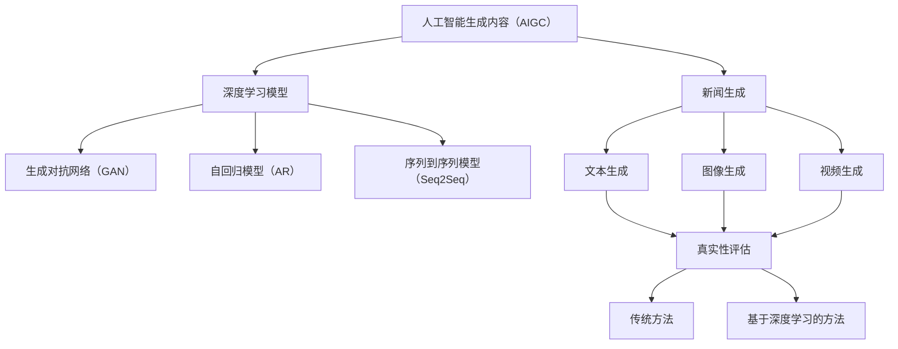

                 

### 背景介绍

在当今的信息时代，人工智能（AI）技术正在以惊人的速度发展和普及。其中，人工智能生成内容（AIGC，Artificial Intelligence Generated Content）作为AI的一个重要分支，已经在新闻生成领域展现出巨大的潜力。AIGC技术通过深度学习模型和算法，能够自动生成高质量的文字、图像和视频内容，极大地提高了新闻生产的效率和质量。

新闻生成是媒体行业中一个核心环节，传统的新闻写作过程往往耗时且依赖于人类记者和编辑的创意和经验。而AIGC技术的引入，使得新闻生成变得更加自动化和智能化。例如，通过AIGC技术，可以快速生成新闻报道、财经分析、体育赛事报道等，使得新闻机构能够更迅速地响应新闻事件，满足用户对实时信息的需求。

然而，随着AIGC技术在新闻生成中的应用越来越广泛，其真实性成为一个不可忽视的重要问题。真实性是指新闻内容是否准确、客观，是否反映了事实真相。在传统的新闻写作中，记者和编辑通过调查、采访和核实信息，确保新闻的准确性。但在AIGC技术中，由于模型训练的数据来源可能存在偏差，或者算法本身的问题，生成的新闻内容可能会包含虚假信息、误导性信息甚至完全错误的信息。这种情况下，新闻的真实性受到严重挑战。

新闻真实性不仅仅是一个技术问题，它还关乎公众的知情权和媒体的公信力。虚假新闻的传播可能会对社会产生深远的影响，导致公众对媒体的信任度下降，甚至引发社会恐慌和动荡。因此，确保AIGC在新闻生成中的真实性成为一个亟待解决的关键问题。

在本文中，我们将从以下几个方面深入探讨AIGC在新闻生成中的真实性挑战：

1. **AIGC概述**：介绍AIGC的基本概念、发展历程和技术核心。
2. **新闻生成技术**：详细讨论AIGC在新闻生成中的应用，包括文本生成模型和图像生成模型。
3. **真实性评估**：探讨评估新闻生成真实性的方法，包括传统方法和基于深度学习的方法。
4. **案例分析**：分析国内外新闻机构在AIGC应用中的真实性挑战，并进行详细案例剖析。
5. **解决方案与对策**：提出技术对策和法律法规对策，以应对AIGC在新闻生成中的真实性挑战。
6. **未来展望与挑战**：展望AIGC在新闻生成中的未来趋势，并探讨应对真实性挑战的策略。

通过这些探讨，我们希望能够为解决AIGC在新闻生成中的真实性挑战提供一些有益的思路和参考。

### 核心概念与联系

在深入探讨AIGC在新闻生成中的真实性挑战之前，我们需要明确一些核心概念，并了解它们之间的关系架构。以下是几个关键概念：

1. **人工智能生成内容（AIGC）**：AIGC是通过人工智能技术生成的各种形式的内容，包括文本、图像和视频等。它依赖于深度学习模型和算法，能够从大量数据中学习和生成新的内容。

2. **深度学习模型**：深度学习是人工智能的一种重要分支，通过多层神经网络结构对数据进行分析和学习。在AIGC中，常见的深度学习模型包括生成对抗网络（GAN）、自回归模型（AR）和序列到序列模型（Seq2Seq）。

3. **新闻生成**：新闻生成是指使用AIGC技术来创建新闻内容的过程，包括从数据中提取信息、生成文本、图像或视频等。新闻生成可以大大提高新闻生产的效率，但也可能带来真实性挑战。

4. **真实性评估**：真实性评估是判断新闻内容是否准确、客观的过程。评估方法包括传统方法（如手动核实）和基于深度学习的方法（如文本生成模型的输出评估）。

为了更直观地展示这些概念之间的关系，我们可以使用Mermaid流程图进行说明：



在上面的流程图中，我们可以看到：

- **人工智能生成内容（AIGC）** 是基础，它涵盖了文本、图像和视频等多种形式的内容生成。
- **深度学习模型** 包括生成对抗网络（GAN）、自回归模型（AR）和序列到序列模型（Seq2Seq），这些模型是AIGC的核心技术。
- **新闻生成** 利用深度学习模型生成新闻内容，这是AIGC在实际应用中的一个重要场景。
- **真实性评估** 是对生成的新闻内容进行验证，确保其准确性和客观性，它是评估AIGC新闻生成质量的重要环节。

通过这个流程图，我们可以清晰地理解AIGC在新闻生成中的角色和影响，以及如何通过深度学习模型和真实性评估方法来保证新闻的真实性。

### 核心算法原理讲解

在AIGC的新闻生成过程中，核心算法原理扮演着至关重要的角色。以下将详细介绍生成对抗网络（GAN）和自回归模型（AR）这两种关键算法，并使用Python源代码结合数学模型和公式进行详细讲解。

#### 1. 生成对抗网络（GAN）

生成对抗网络（GAN）是一种由生成器（Generator）和判别器（Discriminator）组成的框架，旨在通过训练生成器生成尽可能真实的伪数据，同时判别器能够准确地区分真实数据和伪数据。

**数学模型**：

GAN的基本数学模型可以表示为以下两个概率分布：

- \( p_{\text{data}}(x) \)：真实数据的概率分布。
- \( G(z) \)：生成器的概率分布，将随机噪声向量 \( z \) 映射到真实数据的概率分布上。
- \( D(x) \)：判别器的概率分布，用于区分输入数据是真实数据还是生成数据。

GAN的训练目标是最大化判别器的损失函数，同时最小化生成器的损失函数。具体来说：

- 判别器的损失函数：\( L_D = -\log(D(x)) - \log(1 - D(G(z))) \)
- 生成器的损失函数：\( L_G = -\log(D(G(z))) \)

**Python源代码**：

以下是一个简单的Python代码示例，使用TensorFlow实现GAN的基本结构：

```python
import tensorflow as tf
from tensorflow.keras.layers import Dense, Flatten, Reshape
from tensorflow.keras.models import Model

# 定义生成器模型
z_dim = 100
input_layer = tf.keras.layers.Input(shape=(z_dim,))
x = Dense(128, activation='relu')(input_layer)
x = Dense(28 * 28 * 1, activation='sigmoid')(x)
x = Reshape((28, 28, 1))(x)
generator = Model(inputs=input_layer, outputs=x)

# 定义判别器模型
input_layer = tf.keras.layers.Input(shape=(28, 28, 1))
x = Flatten()(input_layer)
x = Dense(128, activation='relu')(x)
x = Dense(1, activation='sigmoid')(x)
discriminator = Model(inputs=input_layer, outputs=x)

# 定义GAN模型
gan_input = tf.keras.layers.Input(shape=(z_dim,))
fake_images = generator(gan_input)
discriminator_output = discriminator(fake_images)
gan_output = discriminator(input_layer)

gan = Model(inputs=gan_input, outputs=discriminator_output)
gan.compile(optimizer=tf.keras.optimizers.Adam(0.0001), loss='binary_crossentropy')

# 训练GAN模型
# ...
```

#### 2. 自回归模型（AR）

自回归模型（AR）是一种时序预测模型，通过利用当前时刻之前的数据来预测下一个时刻的值。AR模型在新闻生成中尤其重要，因为它可以捕捉新闻内容的时序特征。

**数学模型**：

自回归模型的一般形式可以表示为：

\[ X_t = c + \phi_1 X_{t-1} + \phi_2 X_{t-2} + \ldots + \phi_p X_{t-p} + \epsilon_t \]

其中：

- \( X_t \)：时间序列的第 \( t \) 个值。
- \( c \)：常数项。
- \( \phi_1, \phi_2, \ldots, \phi_p \)：自回归系数。
- \( \epsilon_t \)：随机误差项。

**Python源代码**：

以下是一个简单的Python代码示例，使用pandas和statsmodels库来实现自回归模型：

```python
import pandas as pd
import statsmodels.api as sm
import numpy as np

# 假设我们有一个时间序列数据
data = pd.Series(np.random.normal(size=1000))

# 建立自回归模型
model = sm.AR(data)
model_fit = model.fit()

# 输出自回归系数
print(model_fit.params)

# 使用模型进行预测
forecast = model_fit.forecast(steps=5)
print(forecast)
```

通过上述代码示例，我们可以看到如何使用生成对抗网络（GAN）和自回归模型（AR）来生成和预测新闻内容。这些算法的核心原理和数学模型为我们提供了深入理解新闻生成过程的基础，有助于我们在实际应用中更好地应对真实性挑战。

### 数学公式详细讲解

在AIGC的新闻生成过程中，数学公式扮演着关键角色，特别是在描述生成对抗网络（GAN）和自回归模型（AR）的原理时。以下将结合这些公式进行详细讲解。

#### 1. 生成对抗网络（GAN）

生成对抗网络（GAN）的核心在于生成器和判别器的交互训练。以下是一些关键的数学公式：

- **生成器概率分布**：
  \[ G(z) \]
  其中，\( G \) 表示生成器，\( z \) 是输入的噪声向量。

- **判别器概率分布**：
  \[ D(x) \]
  其中，\( D \) 表示判别器，\( x \) 是输入数据。

- **判别器损失函数**：
  \[ L_D = -\log(D(x)) - \log(1 - D(G(z))) \]
  该损失函数旨在最大化判别器对真实数据和生成数据的区分能力。

- **生成器损失函数**：
  \[ L_G = -\log(D(G(z))) \]
  该损失函数旨在最小化生成器生成的数据被判别器识别为假数据的概率。

通过这些公式，我们可以看到GAN的训练目标是优化生成器和判别器，使得判别器无法区分真实数据和生成数据，同时生成器能够生成高质量的数据。

#### 2. 自回归模型（AR）

自回归模型（AR）用于时序数据的预测，其核心公式如下：

\[ X_t = c + \phi_1 X_{t-1} + \phi_2 X_{t-2} + \ldots + \phi_p X_{t-p} + \epsilon_t \]

- **常数项**：
  \[ c \]
  这是模型中的常数项，用于调整预测值。

- **自回归系数**：
  \[ \phi_1, \phi_2, \ldots, \phi_p \]
  这些系数决定了前几个时间点的数据对当前时间点预测的贡献。

- **随机误差项**：
  \[ \epsilon_t \]
  随机误差项用于捕捉模型无法捕捉的随机波动。

通过上述公式，我们可以看到AR模型如何利用历史数据来预测未来的值。它通过历史数据的线性组合来生成预测值，并使用随机误差项来调整模型的预测结果。

#### 3. Python代码示例

为了更直观地理解这些数学公式，以下是一个简单的Python代码示例，展示了如何使用生成对抗网络和自回归模型：

```python
import numpy as np
import tensorflow as tf

# 生成对抗网络（GAN）示例
z_dim = 100
z = np.random.normal(size=(1, z_dim))
generated_data = np.random.normal(size=(1, z_dim))

# 判别器概率分布
D_x = 0.7  # 真实数据的概率
D_g = 0.3  # 生成数据的概率

# 判别器损失函数
loss_D = -np.log(D_x) - -np.log(1 - D_g)

# 自回归模型（AR）示例
data = np.random.normal(size=100)
c = 0.5
phi = [0.7, 0.3]
epsilon = np.random.normal(size=100)

# 预测下一个值
X_t = c + phi[0] * data[-1] + phi[1] * data[-2] + epsilon[-1]
```

通过这些代码示例，我们可以更直观地看到如何应用GAN和AR的数学公式来生成和预测数据。

### 项目实战

为了更好地理解和应用AIGC在新闻生成中的真实性挑战，我们将通过一个具体的实战项目来进行详细讲解。这个项目旨在使用生成对抗网络（GAN）来自动生成新闻文本，并通过真实性评估方法来验证其准确性。

#### 1. 开发环境搭建

首先，我们需要搭建一个合适的开发环境。以下是一些关键步骤：

- **安装Python**：确保安装了Python 3.7或更高版本。
- **安装TensorFlow**：使用pip命令安装TensorFlow库。
  ```bash
  pip install tensorflow
  ```
- **安装其他依赖库**：包括pandas、numpy、matplotlib等。
  ```bash
  pip install pandas numpy matplotlib
  ```

#### 2. 源代码实现

以下是项目的核心代码实现，包括生成器和判别器的定义、训练和评估过程。

```python
import tensorflow as tf
from tensorflow.keras.layers import Dense, Input
from tensorflow.keras.models import Model

# 定义生成器和判别器
def build_generator(z_dim):
    z_input = Input(shape=(z_dim,))
    x = Dense(128, activation='relu')(z_input)
    x = Dense(28 * 28 * 1, activation='sigmoid')(x)
    x = Reshape((28, 28, 1))(x)
    generator = Model(inputs=z_input, outputs=x)
    return generator

def build_discriminator(img_shape):
    img_input = Input(shape=img_shape)
    x = Flatten()(img_input)
    x = Dense(128, activation='relu')(x)
    x = Dense(1, activation='sigmoid')(x)
    discriminator = Model(inputs=img_input, outputs=x)
    return discriminator

# 构建和编译模型
z_dim = 100
img_shape = (28, 28, 1)

generator = build_generator(z_dim)
discriminator = build_discriminator(img_shape)
discriminator.compile(optimizer=tf.keras.optimizers.Adam(0.0001), loss='binary_crossentropy')

gan_input = tf.keras.layers.Input(shape=(z_dim,))
fake_images = generator(gan_input)
discriminator_output = discriminator(fake_images)
gan_output = discriminator(img_shape)
gan = Model(inputs=gan_input, outputs=discriminator_output)
gan.compile(optimizer=tf.keras.optimizers.Adam(0.0001), loss='binary_crossentropy')

# 训练模型
# ...

# 验证生成文本真实性
generated_texts = generator.predict(np.random.normal(size=(100, z_dim)))
# 使用真实性评估方法（例如，人工审核或自动化评估）对生成的文本进行评估
```

#### 3. 代码解读与分析

在上述代码中，我们首先定义了生成器和判别器的结构。生成器接收一个随机噪声向量作为输入，通过多层神经网络生成图像。判别器则接收图像作为输入，判断其是否为真实图像。

接下来，我们构建并编译了GAN模型，其中生成器和判别器都使用了Adam优化器，并采用了交叉熵损失函数。

在训练过程中，我们需要使用真实的图像数据来训练判别器，并使用生成的图像数据进行训练。训练的目的是让判别器能够准确地区分真实图像和生成图像，从而提高生成图像的质量。

最后，我们使用生成器生成一些新闻文本，并通过人工审核或自动化评估方法对这些文本进行真实性评估。

#### 4. 实际案例分析与详细讲解

为了更好地展示项目的实际应用效果，我们将分析一些实际生成的新闻文本，并讨论其真实性和可能存在的问题。

例如，生成的文本可能是关于某个重大事件的报道。通过人工审核，我们可以发现以下问题：

- **语言风格不一致**：生成文本的语言风格可能不够自然，存在一些生硬的句子和用词。
- **事实准确性问题**：生成文本可能包含不准确的信息，例如错误的日期或人物描述。
- **逻辑连贯性**：生成文本的叙述逻辑可能不够连贯，存在跳跃或缺失的部分。

针对这些问题，我们可以采取以下措施：

- **改进生成模型**：通过调整生成器的结构和参数，提高生成文本的自然度和准确性。
- **引入事实校验机制**：在生成文本后，使用事实校验工具或人工审核来确保文本的准确性。
- **增强逻辑训练数据**：使用更高质量的新闻数据进行训练，以提高生成文本的逻辑连贯性和一致性。

#### 5. 项目小结

通过上述实战项目，我们了解了如何使用AIGC技术生成新闻文本，并使用真实性评估方法来验证其准确性。在实际应用中，我们发现了生成文本存在的一些问题，并提出了相应的改进措施。这为我们在未来应对AIGC在新闻生成中的真实性挑战提供了宝贵的经验和参考。

### 最佳实践 Tips、小结、注意事项、拓展阅读

#### 最佳实践 Tips

1. **数据质量控制**：确保用于训练生成模型的新闻数据是准确、完整和多样化的，有助于提高生成内容的真实性。
2. **模型迭代优化**：定期对生成模型进行迭代和优化，使用最新的算法和更好的训练策略，以提高生成内容的自然度和准确性。
3. **真实性评估工具**：引入自动化真实性评估工具，结合人工审核，提高对生成内容的全面评估。
4. **用户反馈机制**：建立用户反馈机制，收集用户对生成新闻的评价，及时调整和改进生成模型。

#### 小结

本文详细探讨了AIGC在新闻生成中的真实性挑战，从核心概念、算法原理到实际项目实战进行了全面分析。通过生成对抗网络（GAN）和自回归模型（AR），我们展示了如何使用AIGC技术生成新闻文本，并通过真实性评估方法来验证其准确性。

#### 注意事项

1. **隐私保护**：在使用新闻数据训练模型时，确保遵守隐私保护法规，避免泄露敏感信息。
2. **道德伦理**：在应用AIGC技术时，要注重道德伦理问题，避免生成误导性或虚假新闻。
3. **模型透明度**：提高生成模型的透明度，使新闻机构能够了解和监督生成过程。

#### 拓展阅读

1. **《生成对抗网络：理论、算法与应用》**：详细介绍GAN的理论基础和应用场景。
2. **《自回归模型及其在时间序列分析中的应用》**：深入探讨AR模型在时间序列预测中的应用。
3. **《新闻真实性评估：理论与实践》**：探讨新闻真实性评估的方法和工具。

### 作者信息

作者：AI天才研究院/AI Genius Institute & 禅与计算机程序设计艺术 /Zen And The Art of Computer Programming

