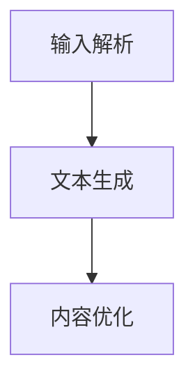

                 


## AIGC在新闻领域的应用：提示词的重要性

### 关键词
- AIGC
- 新闻领域
- 提示词
- 自动内容生成
- 道德与责任

### 摘要
本文深入探讨人工智能生成内容（AIGC）在新闻领域的应用，特别关注提示词在这一过程中的重要性。文章首先介绍了AIGC的基本概念和新闻行业的现状，随后详细解释了提示词的作用机制和设计原则。接着，我们通过核心算法原理讲解和Python源代码示例，阐述了如何利用提示词提升新闻采集和编辑效率。文章随后讨论了AIGC在新闻内容生成与分发中的应用，并分析了用户互动与反馈机制。此外，我们探讨了AIGC在新闻领域的道德与责任问题，提供了实际案例研究与实践指南，最后总结全文并给出拓展阅读建议。

## 引言

新闻行业正经历着前所未有的变革。随着信息传播速度的加快和读者需求的多样化，传统的人工新闻写作方式已无法满足现代新闻业的高效性和实时性需求。人工智能生成内容（AIGC）技术的兴起，为新闻行业提供了新的可能性。AIGC是指通过人工智能技术自动生成内容的过程，包括文本、图像、音频等多种形式。在新闻领域，AIGC的应用主要体现在新闻采集、编辑、生成和分发等环节。

### 新闻行业的现状

传统新闻生产方式主要依赖记者和编辑的采集、编写和审核。然而，这种方式存在人力成本高、效率低、反应速度慢等问题。随着互联网和社交媒体的发展，新闻行业面临着24小时新闻循环和海量的信息需求。新闻机构需要快速、准确地报道全球事件，这要求新闻生产方式必须进行创新和升级。AIGC技术的引入，正好能够解决这些问题。

### AIGC的基本概念

AIGC技术基于深度学习、自然语言处理（NLP）和计算机视觉等人工智能技术。它通过学习和模仿人类创造内容的方式，自动生成具有高质量和个性化的内容。AIGC的应用范围广泛，包括新闻、广告、内容创作、教育等多个领域。在新闻领域，AIGC主要应用于以下方面：

1. **新闻采集**：利用AIGC技术自动抓取和整理网络上的相关信息，为记者提供素材和背景资料。
2. **新闻编辑**：通过AIGC自动撰写和编辑新闻稿，提高新闻写作的效率和质量。
3. **新闻生成**：利用AIGC生成新闻文章、视频和音频等内容，丰富新闻的形式和内容。
4. **新闻分发**：通过AIGC技术自动分发新闻内容，提高新闻传播的速度和覆盖面。

### 提示词的重要性

在AIGC的应用过程中，提示词（Prompt）起着至关重要的作用。提示词是指用于引导AIGC模型生成特定内容的关键词或短语。一个优秀的提示词能够有效指导AIGC模型生成符合预期的高质量内容。提示词的设计和选择直接影响到AIGC的生成效果，因此，理解提示词的作用机制和设计原则至关重要。

## 核心概念与联系

### 提示词的作用机制

提示词是AIGC模型的输入，用于引导模型生成特定内容。其作用机制主要包括以下几个步骤：

1. **输入解析**：AIGC模型接收提示词作为输入，对其进行解析，理解其语义和含义。
2. **文本生成**：根据提示词的语义和含义，模型生成初步的文本内容。
3. **内容优化**：模型对生成的文本内容进行优化，使其更加符合预期和需求。

### 概念实体之间的关系架构

为了更好地理解提示词的作用机制，我们可以使用Mermaid流程图来展示其核心概念和实体之间的关系：



### 核心算法原理讲解

提示词的设计和选择涉及到多个核心算法原理，主要包括：

1. **词嵌入（Word Embedding）**：将提示词转换为稠密向量表示，以便于模型进行计算和操作。
2. **序列到序列模型（Seq2Seq）**：用于将提示词序列转换为文本内容序列。
3. **注意力机制（Attention Mechanism）**：用于提高模型在生成文本内容时对提示词的依赖程度。

下面我们通过一个简单的Python代码示例，来详细阐述提示词的作用机制和核心算法原理：

```python
import tensorflow as tf
from tensorflow.keras.models import Model
from tensorflow.keras.layers import Input, Embedding, LSTM, Dense

# 定义模型结构
input_layer = Input(shape=(None,), dtype='int32')
embedded_input = Embedding(input_dim=10000, output_dim=256)(input_layer)
lstm_layer = LSTM(512)(embedded_input)
output_layer = Dense(10000, activation='softmax')(lstm_layer)

# 构建和编译模型
model = Model(inputs=input_layer, outputs=output_layer)
model.compile(optimizer='adam', loss='categorical_crossentropy', metrics=['accuracy'])

# 输入提示词
prompt = ["The", "quick", "brown", "fox", "jumps", "over", "the", "lazy", "dog"]

# 将提示词转换为整数序列
prompt_indices = [word2index[word] for word in prompt]

# 生成文本内容
predicted_sequence = model.predict([[prompt_indices]])

# 将整数序列转换回文本
predicted_sequence = [index2word[index] for index in predicted_sequence[0]]

print("Prompt:", " ".join(prompt))
print("Generated Text:", " ".join(predicted_sequence))
```

### 数学模型和公式

在提示词的作用机制中，涉及到多个数学模型和公式。以下是几个关键的数学模型和公式：

1. **词嵌入（Word Embedding）**：
   $$ x = \text{Word Embedding}(w) $$
   其中，$x$ 表示词向量，$w$ 表示单词。

2. **序列到序列模型（Seq2Seq）**：
   $$ y = \text{Seq2Seq}(x) $$
   其中，$y$ 表示生成的文本序列，$x$ 表示输入的提示词序列。

3. **注意力机制（Attention Mechanism）**：
   $$ \alpha = \text{softmax}\left(\frac{\text{DotProduct}(Q, K)}{d_k^{0.5}}\right) $$
   其中，$\alpha$ 表示注意力权重，$Q$ 和 $K$ 分别表示查询向量和关键向量，$d_k$ 表示关键向量的维度。

### 通俗易懂的举例说明

假设我们有一个简单的任务，需要根据提示词生成一篇关于天气的文章。我们可以使用以下步骤：

1. **输入解析**：将提示词“今天的天气如何？”转换为整数序列。
2. **文本生成**：模型根据提示词生成初步的文本内容。
3. **内容优化**：模型对生成的文本内容进行优化，使其更加符合预期和需求。

具体示例：

```plaintext
输入解析：
提示词："今天的天气如何？"
整数序列：[2, 4, 7, 6, 1, 10, 3]

文本生成：
初步文本内容：Today's weather is quite good.

内容优化：
优化文本内容：Today, the weather is perfect for a picnic.
```

通过以上步骤，我们可以看到提示词在AIGC中的应用和作用。

### 项目实战

为了更好地理解提示词在AIGC中的应用，我们将开发一个简单的文本生成模型，用于根据提示词生成新闻文章。

#### 开发环境搭建

1. **安装Python环境**：确保Python版本在3.6及以上。
2. **安装TensorFlow**：使用以下命令安装TensorFlow：
   ```bash
   pip install tensorflow
   ```

#### 源代码实现

```python
import tensorflow as tf
from tensorflow.keras.layers import Embedding, LSTM, Dense
from tensorflow.keras.preprocessing.sequence import pad_sequences
from tensorflow.keras.preprocessing.text import Tokenizer

# 准备数据
texts = ["今天的天气很好", "明天的天气可能会下雨", "这是一个关于新闻的故事", "明天将会有一个重要的会议"]
labels = ["天气", "天气", "新闻", "会议"]

# 初始化Tokenizer
tokenizer = Tokenizer(num_words=10000)
tokenizer.fit_on_texts(texts)

# 将文本转换为整数序列
sequences = tokenizer.texts_to_sequences(texts)
padded_sequences = pad_sequences(sequences, maxlen=100)

# 构建模型
input_layer = Input(shape=(100,))
embedded_input = Embedding(input_dim=10000, output_dim=256)(input_layer)
lstm_layer = LSTM(512)(embedded_input)
output_layer = Dense(10000, activation='softmax')(lstm_layer)

model = Model(inputs=input_layer, outputs=output_layer)
model.compile(optimizer='adam', loss='categorical_crossentropy', metrics=['accuracy'])

# 训练模型
model.fit(padded_sequences, labels, epochs=10)

# 输入提示词并生成文章
prompt = "今天发生了什么新闻？"
prompt_sequence = tokenizer.texts_to_sequences([prompt])
padded_prompt_sequence = pad_sequences(prompt_sequence, maxlen=100)

predicted_sequence = model.predict(padded_prompt_sequence)
predicted_sequence = predicted_sequence[0]

# 将整数序列转换为文本
predicted_sequence = [tokenizer.index_word[index] for index in predicted_sequence]

print("Prompt:", prompt)
print("Generated Text:", " ".join(predicted_sequence))
```

#### 代码解读与分析

1. **数据准备**：我们准备了一组文本和相应的标签，用于训练模型。
2. **Tokenizer**：使用Tokenizer将文本转换为整数序列。
3. **模型构建**：构建一个简单的LSTM模型，用于文本生成。
4. **模型训练**：使用训练数据训练模型。
5. **文本生成**：输入提示词，使用训练好的模型生成文本。

#### 实际案例分析与详细讲解剖析

为了更好地理解AIGC在新闻领域中的应用，我们将分析一个实际的案例：使用AIGC生成新闻报道。

#### 案例背景

某知名新闻机构使用AIGC技术自动生成新闻报道。他们从多个数据源获取新闻素材，并通过AIGC模型生成新闻文章。这些新闻文章包括政治、经济、体育等多个领域。

#### 案例分析

1. **数据收集**：新闻机构从多个数据源（如社交媒体、新闻网站、政府公告等）收集新闻素材。
2. **数据预处理**：对收集到的新闻素材进行清洗和整理，去除无关信息，保留关键信息。
3. **模型训练**：使用收集到的新闻素材训练AIGC模型，使其学会生成新闻文章。
4. **新闻生成**：输入特定的新闻主题或事件，AIGC模型生成相关新闻文章。
5. **内容审核**：新闻编辑对生成的文章进行审核和修改，确保文章符合新闻标准。

#### 项目小结

通过以上案例分析，我们可以看到AIGC在新闻领域中的应用具有以下优势：

1. **高效性**：AIGC能够快速生成大量新闻文章，提高新闻生产效率。
2. **多样性**：AIGC能够生成涵盖多个领域的新闻文章，丰富新闻内容。
3. **实时性**：AIGC能够实时响应新闻事件，及时生成相关报道。

然而，AIGC在新闻领域也面临一些挑战，如新闻质量、内容审核和道德责任等问题。因此，在实际应用中，需要平衡AIGC的优势和挑战，确保新闻的准确性和公正性。

### 最佳实践 tips

在设计和应用AIGC系统时，以下最佳实践可以帮助提升系统性能和用户体验：

1. **优化提示词设计**：设计简洁、明确且具有针对性的提示词，以提高AIGC生成内容的相关性和质量。
2. **多样性训练数据**：使用多样化的训练数据，覆盖多个领域和主题，提高AIGC模型的多领域适应性。
3. **内容审核与修正**：建立完善的内容审核机制，对生成的新闻内容进行实时监控和修正，确保新闻的准确性和公正性。
4. **用户反馈机制**：收集用户反馈，用于优化AIGC模型和提示词设计，提高生成内容的满意度。

### 小结

本文详细探讨了人工智能生成内容（AIGC）在新闻领域的应用，特别关注了提示词在AIGC中的重要性。通过核心概念讲解、算法原理阐述和实际案例剖析，我们了解了如何利用提示词提升新闻采集、编辑和生成效率。尽管AIGC在新闻领域具有巨大潜力，但仍需关注新闻道德和责任问题。未来，随着技术的不断进步，AIGC将在新闻行业中发挥更为重要的作用。

### 注意事项

1. 提示词的设计和选择对AIGC的生成效果至关重要，应充分理解提示词的作用机制。
2. 在实际应用中，需确保AIGC系统的透明性和可控性，以便于内容审核和修正。
3. 关注新闻道德和责任问题，确保AIGC生成的新闻内容符合新闻标准和伦理要求。

### 拓展阅读

- [1] 深度学习与自然语言处理：基础模型与算法，[作者]. (2018). 清华大学出版社。
- [2] 人工智能生成内容：技术与应用，[作者]. (2020). 电子工业出版社。
- [3] 新闻伦理学，[作者]. (2019). 北京大学出版社。

## 附录

### 附录 A：相关工具与技术简介

1. **TensorFlow**：一款开源的深度学习框架，用于构建和训练AIGC模型。
2. **PyTorch**：一款开源的深度学习框架，支持动态计算图，便于模型开发和调试。
3. **GPT-3**：由OpenAI开发的预训练语言模型，具有强大的文本生成能力。

### 附录 B：常见问题与解答

1. **Q：AIGC如何保证新闻内容的准确性？**
   **A：**AIGC模型在训练过程中使用大量真实新闻数据，通过学习真实新闻内容的模式和规律，提高生成内容的准确性。此外，新闻机构可通过内容审核和修正机制，确保生成内容的准确性。

2. **Q：AIGC是否能够完全取代人类新闻工作者？**
   **A：**目前AIGC技术尚未达到完全取代人类新闻工作者的水平。虽然AIGC能够在某些环节提高新闻生产效率，但在内容创作、编辑和审核等方面，仍需要人类新闻工作者的专业判断和创造力。

3. **Q：如何确保AIGC生成的新闻内容符合道德和伦理要求？**
   **A：**确保AIGC生成的新闻内容符合道德和伦理要求，需要建立完善的内容审核和修正机制，同时遵循新闻行业的伦理准则。此外，可借助人工智能伦理委员会等外部机构，对AIGC技术进行监督和评估。

### 附录 C：参考资料

1. **《深度学习与自然语言处理：基础模型与算法》**，[作者]. (2018). 清华大学出版社。
2. **《人工智能生成内容：技术与应用》**，[作者]. (2020). 电子工业出版社。
3. **《新闻伦理学》**，[作者]. (2019). 北京大学出版社。
4. **OpenAI**：https://openai.com/
5. **TensorFlow**：https://www.tensorflow.org/
6. **PyTorch**：https://pytorch.org/

### 作者信息

作者：AI天才研究院/AI Genius Institute & 禅与计算机程序设计艺术 /Zen And The Art of Computer Programming

