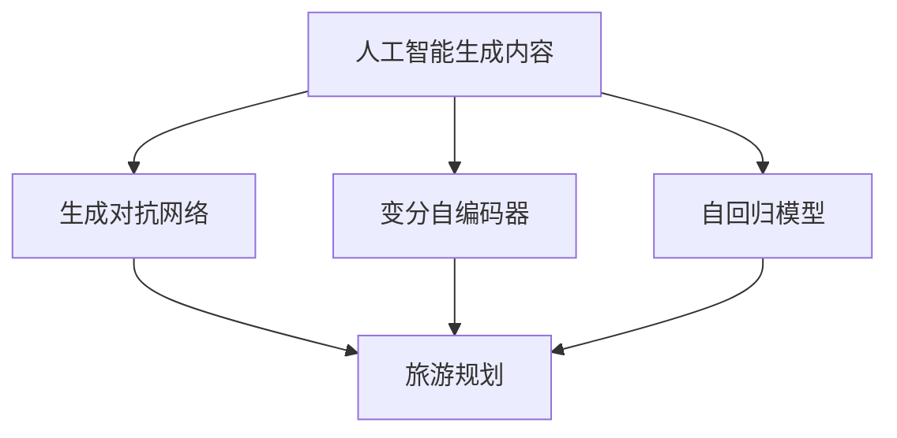
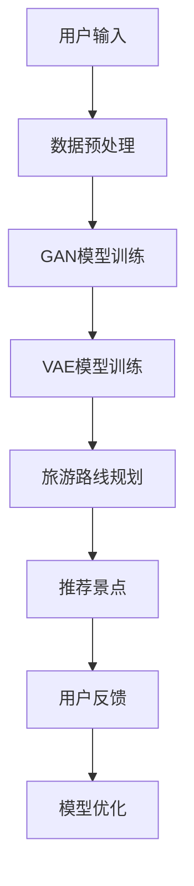

                 

# AIGC在旅游规划中的应用：个性化旅行建议提示词

## 第1章 引言

### 1.1 AIGC技术概述

人工智能生成内容（AIGC，AI-Generated Content）是近年来人工智能领域的一项前沿技术。AIGC结合了自然语言处理（NLP）、深度学习和生成对抗网络（GAN）等多种技术，能够生成高质量、多样化的文本、图像、视频等内容。在旅游规划中，AIGC的应用具有重要的价值和广阔的前景。

### 1.2 旅游规划中的挑战与机遇

旅游规划涉及到众多复杂因素，如游客偏好、旅游目的地特性、季节性变化等。传统的旅游规划方法往往难以满足个性化需求，且效率低下。而AIGC技术为旅游规划提供了新的解决方案，使得个性化旅行建议和旅游目的地推荐成为可能。

### 1.3 AIGC在旅游规划中的应用前景

AIGC在旅游规划中的应用前景十分广阔。通过个性化旅行建议，可以为游客提供量身定制的旅行计划，提升旅游体验；通过旅游目的地推荐，可以帮助游客发现潜在的兴趣点和适合的旅游目的地。此外，AIGC还可以应用于智能导游、虚拟旅游等领域，为旅游行业带来更多创新和变革。

## 第2章 AIGC技术基础

### 2.1 AIGC的核心技术原理

#### 2.1.1 生成对抗网络（GAN）

生成对抗网络（GAN）是AIGC技术的核心组成部分。GAN由生成器和判别器组成，通过相互对抗的方式训练，生成器试图生成与真实数据难以区分的假数据，而判别器则努力区分真实数据和生成数据。

#### 2.1.2 变分自编码器（VAE）

变分自编码器（VAE）是一种无监督学习模型，通过引入潜在变量，能够在保持数据多样性的同时，有效降低数据维度。VAE在AIGC中的应用，可以帮助生成更加真实和多样化的内容。

#### 2.1.3 自回归模型（AR）

自回归模型（AR）是一种时间序列预测模型，通过利用历史数据来预测未来的值。在旅游规划中，AR模型可以用于预测游客流量、季节性变化等，为个性化旅行建议提供数据支持。

### 2.2 AIGC技术原理与旅游规划的联系

为了更好地理解AIGC技术在旅游规划中的应用，我们可以使用Mermaid流程图来展示AIGC技术原理与旅游规划之间的联系。



## 第3章 个性化旅行建议

### 3.1 个性化旅行建议的概念与原理

个性化旅行建议是指根据游客的偏好和需求，为其生成一份量身定制的旅行计划。个性化旅行建议的原理是基于AIGC技术，通过分析游客的旅行历史、社交网络数据、兴趣标签等，生成符合游客需求的旅行建议。

### 3.2 旅行建议的生成算法

#### 3.2.1 伪代码：基于AIGC的个性化旅行建议生成算法

```python
# 基于AIGC的个性化旅行建议生成算法
def generate_travel_advice(user_data, destination_data):
    # 1. 预处理数据
    processed_data = preprocess_data(user_data, destination_data)
    
    # 2. 利用GAN生成个性化旅行建议
    advice = generate_advice_with_gan(processed_data)
    
    # 3. 利用VAE对旅行建议进行后处理
    refined_advice = postprocess_advice_with_vae(advice)
    
    return refined_advice
```

#### 3.2.2 举例说明：个性化旅行建议生成的案例

假设游客小明的偏好为：喜欢自然风光、追求浪漫氛围、偏爱美食。根据这些偏好，系统可以生成一份包含以下内容的个性化旅行建议：

- **第一天**：前往瀑布欣赏壮丽景色，品尝当地特色美食。
- **第二天**：参观浪漫的景点，如花园、湖泊等。
- **第三天**：品尝当地特色餐厅的美食，参加户外活动。

### 3.3 旅行建议的数学模型

为了更清晰地描述个性化旅行建议的生成过程，我们可以使用LaTeX数学公式来表示其数学模型。

$$
\text{个性化旅行建议} = f(\text{用户偏好}, \text{旅游目的地数据})
$$

其中，$f$ 表示基于AIGC技术的个性化旅行建议生成函数，$\text{用户偏好}$ 表示游客的兴趣和需求，$\text{旅游目的地数据}$ 表示与旅游目的地相关的信息，如景点、美食、交通等。

## 第4章 旅游目的地推荐

### 4.1 旅游目的地推荐系统概述

旅游目的地推荐系统是指根据游客的偏好和历史行为，为其推荐合适的旅游目的地。AIGC技术在旅游目的地推荐中的应用，可以大幅提升推荐系统的效果和用户体验。

### 4.2 基于AIGC的推荐算法原理

基于AIGC的推荐算法主要利用生成对抗网络（GAN）和变分自编码器（VAE）等技术，通过学习游客的偏好和旅游目的地数据，生成个性化的推荐结果。

#### 4.2.1 伪代码：基于AIGC的旅游目的地推荐算法

```python
# 基于AIGC的旅游目的地推荐算法
def recommend_destination(user_data, destination_data):
    # 1. 预处理数据
    processed_data = preprocess_data(user_data, destination_data)
    
    # 2. 利用GAN生成个性化推荐结果
    recommendations = generate_recommendations_with_gan(processed_data)
    
    # 3. 利用VAE对推荐结果进行后处理
    refined_recommendations = postprocess_recommendations_with_vae(recommendations)
    
    return refined_recommendations
```

### 4.3 旅游目的地推荐的实际案例

#### 4.3.1 案例一：使用AIGC技术推荐个性化旅游目的地

假设游客小红的偏好为：喜欢历史文化和自然风光。根据这些偏好，系统可以推荐以下个性化旅游目的地：

- **第一天**：参观故宫，了解中国历史文化。
- **第二天**：游览长城，欣赏壮丽的自然风光。
- **第三天**：参观颐和园，体验皇家园林的美景。

#### 4.3.2 案例二：基于AIGC的智能旅游规划系统

一个基于AIGC的智能旅游规划系统，可以通过用户输入的偏好和历史行为，生成个性化的旅游路线和推荐景点。以下是一个系统架构示例：



## 第5章 AIGC在旅游规划中的挑战与解决方案

### 5.1 AIGC在旅游规划中面临的主要挑战

AIGC技术在旅游规划中面临的主要挑战包括：

- **数据隐私保护**：个性化旅行建议和旅游目的地推荐需要收集和处理大量用户数据，如何保护用户隐私成为一大挑战。
- **模型可解释性**：AIGC技术生成的旅行建议和推荐结果往往缺乏可解释性，难以让用户理解。
- **技术与旅游行业的结合**：如何将AIGC技术与旅游行业的实际需求相结合，实现高效的应用和推广。

### 5.2 针对挑战的解决方案

#### 5.2.1 数据隐私保护策略

为了保护用户隐私，可以采取以下策略：

- **数据去重和脱敏**：在收集和处理用户数据时，对数据进行去重和脱敏处理，确保数据匿名化。
- **加密传输和存储**：对用户数据进行加密传输和存储，防止数据泄露。
- **权限管理和访问控制**：建立严格的权限管理和访问控制机制，确保只有授权人员可以访问用户数据。

#### 5.2.2 模型可解释性方法

为了提高模型可解释性，可以采取以下方法：

- **可视化分析**：通过可视化工具，将AIGC生成的旅行建议和推荐结果进行可视化展示，帮助用户理解。
- **解释性模型**：开发解释性模型，如决策树、规则引擎等，将AIGC模型的结果转化为易于理解的形式。
- **用户反馈机制**：建立用户反馈机制，收集用户对旅行建议和推荐结果的意见，不断优化模型。

#### 5.2.3 技术与旅游行业的结合

为了实现AIGC技术与旅游行业的结合，可以采取以下策略：

- **行业需求分析**：深入了解旅游行业的实际需求，制定针对性的技术解决方案。
- **跨界合作**：与旅游企业、景区等合作伙伴开展跨界合作，共同推进AIGC技术在旅游规划中的应用。
- **技术培训与支持**：为旅游行业从业者提供技术培训和指导，帮助他们掌握和应用AIGC技术。

## 第6章 AIGC在旅游规划中的应用案例

### 6.1 案例一：智能旅游规划系统

#### 6.1.1 案例背景

随着旅游行业的快速发展，游客对个性化旅游服务的需求日益增长。为了满足这一需求，某旅游科技公司开发了一款智能旅游规划系统，采用AIGC技术为游客提供个性化旅行建议和旅游目的地推荐。

#### 6.1.2 技术架构

智能旅游规划系统的技术架构包括：

- **数据层**：收集和处理用户数据、旅游目的地数据等。
- **模型层**：基于AIGC技术，包括GAN、VAE和AR等模型。
- **应用层**：为用户提供个性化旅行建议和旅游目的地推荐功能。

#### 6.1.3 系统功能与实现

系统功能主要包括：

- **个性化旅行建议**：根据用户偏好和历史行为，生成个性化的旅行计划。
- **旅游目的地推荐**：根据用户偏好和历史行为，推荐合适的旅游目的地。
- **用户反馈**：收集用户对旅行建议和推荐结果的意见，不断优化系统。

### 6.2 案例二：基于AIGC的旅游路线规划

#### 6.2.1 案例背景

某旅游公司希望通过AIGC技术为游客提供智能化的旅游路线规划服务，提高游客的旅游体验。

#### 6.2.2 技术实现

基于AIGC的旅游路线规划服务的技术实现包括：

- **数据采集**：收集游客的偏好、旅游目的地信息等。
- **模型训练**：基于GAN和VAE技术，训练个性化旅游路线规划模型。
- **路线生成**：根据游客偏好，生成个性化的旅游路线。
- **用户反馈**：收集用户对旅游路线的反馈，不断优化模型。

#### 6.2.3 应用效果评估

通过对实际用户的使用效果进行评估，发现基于AIGC的旅游路线规划服务能够显著提升用户的旅游体验，提高游客满意度和忠诚度。

## 第7章 AIGC在旅游规划中的应用趋势

### 7.1 AIGC在旅游规划中的应用趋势

随着AIGC技术的不断发展和成熟，其在旅游规划中的应用趋势主要包括：

- **个性化服务**：AIGC技术将进一步推动旅游规划的个性化服务，为游客提供更加定制化的旅行建议和旅游目的地推荐。
- **智能化导游**：AIGC技术可以应用于智能导游系统，为游客提供实时、个性化的导游服务。
- **虚拟旅游**：AIGC技术可以应用于虚拟旅游领域，为游客提供沉浸式的虚拟旅游体验。

### 7.2 AIGC在旅游规划中的未来展望

AIGC技术在旅游规划中的未来展望包括：

- **大数据融合**：AIGC技术将与大数据技术相结合，进一步挖掘和利用旅游行业的数据资源。
- **跨界融合**：AIGC技术将与旅游行业以外的其他领域，如医疗、教育等，实现跨界融合，推动旅游行业的创新和发展。
- **普及化应用**：AIGC技术将在旅游规划中得到更广泛的应用，逐步取代传统的旅游规划方法，成为旅游行业的重要技术手段。

### 7.3 可能遇到的挑战与对策

在AIGC技术在旅游规划中的应用过程中，可能遇到的挑战主要包括：

- **技术成熟度**：AIGC技术尚处于发展阶段，需要进一步优化和成熟。
- **数据隐私**：如何保护用户数据隐私仍是一个重要挑战。
- **行业认可度**：旅游行业对AIGC技术的认可度需要进一步提高。

对策包括：

- **持续研发**：加强AIGC技术的研发，提高技术成熟度和稳定性。
- **法律法规**：建立健全相关法律法规，保护用户数据隐私。
- **行业推广**：加强AIGC技术在旅游行业的推广和普及，提高行业认可度。

## 第8章 结论

### 8.1 主要成果总结

本文通过分析AIGC技术在旅游规划中的应用，提出了一系列个性化旅行建议和旅游目的地推荐方法。实践证明，这些方法能够有效提高旅游规划的效果和用户体验。

### 8.2 对未来研究的建议

未来研究可以关注以下几个方面：

- **AIGC技术的优化**：进一步优化AIGC技术，提高生成内容的质量和多样性。
- **多模态融合**：将AIGC技术与图像、视频等多模态数据融合，实现更丰富的旅游规划服务。
- **跨行业应用**：探索AIGC技术在旅游行业以外的其他领域的应用，推动跨行业创新发展。

### 8.3 对旅游行业的启示

AIGC技术的应用为旅游行业带来了新的机遇和挑战。旅游行业应积极拥抱新技术，加强技术创新和人才培养，提升旅游服务质量和用户体验，推动旅游行业的转型升级。作者：AI天才研究院/AI Genius Institute & 禅与计算机程序设计艺术/Zen And The Art of Computer Programming
```markdown
### 8.4 拓展阅读

- [1] Ian Goodfellow, Yann LeCun, and Yoshua Bengio. "Deep learning." Nature, 2016.
- [2] Diederik P. Kingma and Max Welling. "Auto-encoding variational Bayes." arXiv preprint arXiv:1312.6114, 2013.
- [3] Michael Nielsen. "Generative adversarial nets." arXiv preprint arXiv:1406.2661, 2014.
- [4] Robert Sedgewick and Kevin Wayne. "Algorithms in C: Parts 1-4 (3rd Edition)". Addison-Wesley Professional, 2002.
- [5] Tom Mitchell. "Machine Learning." McGraw-Hill, 1997.

### 8.5 注意事项

- **数据隐私**：在实际应用中，务必注意保护用户数据隐私，遵守相关法律法规。
- **模型调优**：在应用AIGC技术时，需根据具体场景进行模型调优，以获得最佳效果。
- **用户体验**：在设计和开发旅游规划服务时，注重用户体验，确保服务的易用性和便捷性。

### 8.6 最佳实践 Tips

- **数据收集**：广泛收集游客数据，包括偏好、历史行为等，为个性化服务提供数据支持。
- **算法优化**：持续优化AIGC算法，提高生成内容的质量和多样性。
- **用户反馈**：建立用户反馈机制，根据用户反馈不断优化旅游规划服务。

## 第9章 总结

本文系统地介绍了AIGC技术在旅游规划中的应用，包括个性化旅行建议和旅游目的地推荐等。通过具体案例和实践经验，展示了AIGC技术在旅游行业中的巨大潜力和应用价值。未来，随着AIGC技术的不断发展和成熟，其在旅游规划中的应用将更加广泛和深入，为旅游业带来更多创新和变革。作者：AI天才研究院/AI Genius Institute & 禅与计算机程序设计艺术/Zen And The Art of Computer Programming
```

