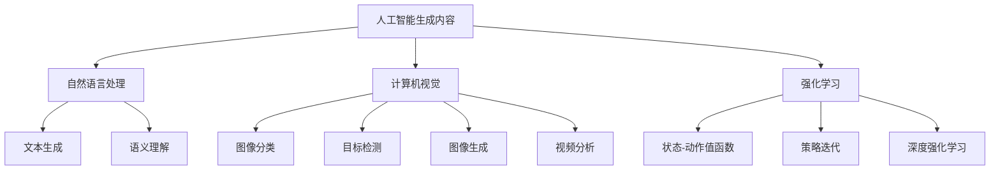
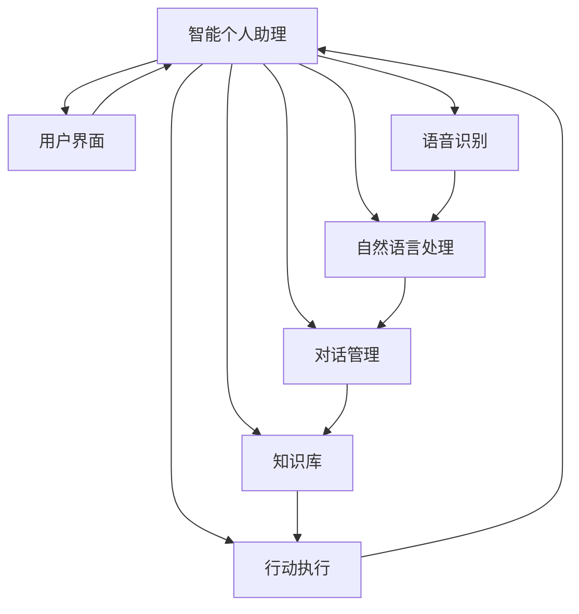
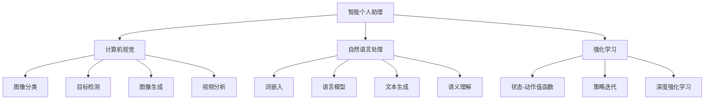

                 

：

# AIGC在智能个人助理开发中的应用

## 关键词
- AIGC
- 智能个人助理
- 自然语言处理
- 计算机视觉
- 强化学习
- 应用场景
- 开发实践

## 摘要
本文深入探讨了AIGC（AI-Generated Content）在智能个人助理开发中的应用。首先，介绍了AIGC的核心概念、发展历程和关键技术，并通过Mermaid流程图展示了AIGC与自然语言处理、计算机视觉和强化学习之间的联系。接着，详细阐述了智能个人助理的系统架构、组件和功能，进一步分析了智能个人助理在不同应用场景中的实际应用。随后，本文通过具体案例和Python源代码，讲解了AIGC在智能个人助理开发中的技术实现和源代码解析。最后，文章总结了AIGC在智能个人助理开发中的最佳实践，并提出了未来发展的趋势和挑战。

## 1. AIGC概述

### 1.1 AIGC的概念

AIGC，即AI-Generated Content，是指通过人工智能技术自动生成内容的过程。AIGC涵盖了自然语言处理（NLP）、计算机视觉（CV）和强化学习（RL）等多个领域，旨在利用人工智能技术生成高质量、有价值的文本、图像和视频等内容。

### 1.2 AIGC的发展历程

AIGC的发展可以追溯到20世纪80年代，当时人工智能技术刚刚起步。随着深度学习、自然语言处理和计算机视觉等领域的突破，AIGC得到了迅速发展。特别是近年来，随着大数据、云计算和5G等技术的进步，AIGC在各个领域的应用越来越广泛，逐渐成为人工智能领域的一个重要分支。

### 1.3 AIGC的关键技术

AIGC的核心技术包括自然语言处理（NLP）、计算机视觉（CV）和强化学习（RL）。

#### 自然语言处理（NLP）

自然语言处理是AIGC的重要组成部分，它涉及到对自然语言的自动理解和生成。NLP的关键技术包括词嵌入、语言模型、文本生成和语义理解等。

- **词嵌入**：词嵌入是一种将单词映射到高维向量空间的技术，有助于实现单词的语义表示。
- **语言模型**：语言模型是一种预测下一个单词的概率分布的模型，有助于生成连贯的文本。
- **文本生成**：文本生成技术包括生成式模型和填充式模型，可以生成各种类型的文本，如文章、对话、摘要等。
- **语义理解**：语义理解技术旨在理解文本的含义，包括实体识别、关系抽取和情感分析等。

#### 计算机视觉（CV）

计算机视觉是AIGC的另一个重要组成部分，它涉及到对图像和视频的理解和处理。计算机视觉的关键技术包括图像分类、目标检测、图像生成和视频分析等。

- **图像分类**：图像分类是将图像划分为不同类别的一种任务，如将图像分类为猫或狗。
- **目标检测**：目标检测是在图像中识别和定位特定对象的一种任务，如检测图像中的行人或车辆。
- **图像生成**：图像生成技术包括生成对抗网络（GANs）和变分自编码器（VAEs），可以生成高质量、逼真的图像。
- **视频分析**：视频分析包括动作识别、场景分割和视频生成等任务，可以用于视频监控、智能安防和视频增强等应用。

#### 强化学习（RL）

强化学习是一种通过试错来学习最优策略的机器学习技术，它在AIGC中扮演着重要的角色。强化学习的关键技术包括状态-动作值函数、策略迭代和深度强化学习等。

- **状态-动作值函数**：状态-动作值函数是强化学习中的一个核心概念，用于评估状态和动作的价值。
- **策略迭代**：策略迭代是一种通过不断优化策略来学习最优行为的方法。
- **深度强化学习**：深度强化学习是强化学习的一种变种，它结合了深度学习和强化学习的优势，可以用于解决复杂的决策问题。

### Mermaid流程图

下面是AIGC与自然语言处理、计算机视觉和强化学习之间的Mermaid流程图：



## 2. 智能个人助理架构

### 2.1 智能个人助理的系统架构

智能个人助理的系统架构通常包括多个组件，如用户界面、语音识别、自然语言处理、对话管理、知识库和行动执行等。这些组件协同工作，实现智能个人助理的功能。

#### 用户界面

用户界面是智能个人助理与用户交互的入口，包括语音识别、文本输入和输出等。用户可以通过语音或文本与智能个人助理进行自然交互。

#### 语音识别

语音识别技术用于将用户的语音输入转换为文本输入，从而使得智能个人助理能够理解和响应用户的指令。

#### 自然语言处理

自然语言处理是智能个人助理的核心组件，它负责对用户输入的文本进行分析和理解，包括词嵌入、语言模型、文本生成和语义理解等。

#### 对话管理

对话管理组件负责管理用户和智能个人助理之间的对话流程，包括上下文理解、对话生成和对话策略等。

#### 知识库

知识库是智能个人助理的知识存储组件，它包含了大量的领域知识和事实信息，用于回答用户的问题和提供决策支持。

#### 行动执行

行动执行组件负责根据用户指令和智能个人助理的决策，执行相应的操作，如发送邮件、拨打电话、预约会议等。

### Mermaid流程图

下面是智能个人助理的系统架构Mermaid流程图：



### 2.2 智能个人助理的组件

智能个人助理的组件包括计算机视觉、自然语言处理和强化学习，这些组件协同工作，实现智能个人助理的各种功能。

#### 计算机视觉

计算机视觉组件负责处理图像和视频数据，包括图像分类、目标检测、图像生成和视频分析等。

- **图像分类**：图像分类是将图像划分为不同类别的一种任务，如将图像分类为猫或狗。
- **目标检测**：目标检测是在图像中识别和定位特定对象的一种任务，如检测图像中的行人或车辆。
- **图像生成**：图像生成技术包括生成对抗网络（GANs）和变分自编码器（VAEs），可以生成高质量、逼真的图像。
- **视频分析**：视频分析包括动作识别、场景分割和视频生成等任务，可以用于视频监控、智能安防和视频增强等应用。

#### 自然语言处理

自然语言处理组件负责处理文本数据，包括词嵌入、语言模型、文本生成和语义理解等。

- **词嵌入**：词嵌入是一种将单词映射到高维向量空间的技术，有助于实现单词的语义表示。
- **语言模型**：语言模型是一种预测下一个单词的概率分布的模型，有助于生成连贯的文本。
- **文本生成**：文本生成技术包括生成式模型和填充式模型，可以生成各种类型的文本，如文章、对话、摘要等。
- **语义理解**：语义理解技术旨在理解文本的含义，包括实体识别、关系抽取和情感分析等。

#### 强化学习

强化学习组件负责处理决策和行动，通过试错学习最优策略。

- **状态-动作值函数**：状态-动作值函数是强化学习中的一个核心概念，用于评估状态和动作的价值。
- **策略迭代**：策略迭代是一种通过不断优化策略来学习最优行为的方法。
- **深度强化学习**：深度强化学习是强化学习的一种变种，它结合了深度学习和强化学习的优势，可以用于解决复杂的决策问题。

### Mermaid流程图

下面是智能个人助理的组件Mermaid流程图：



### 2.3 智能个人助理的功能

智能个人助理的功能包括任务管理、信息查询、决策支持和个性化服务。

#### 任务管理

任务管理功能用于帮助用户管理日常任务，如设置提醒、安排日程、创建待办事项等。

```python
# 任务管理示例
import datetime

def set_reminder(task, time):
    reminder = {
        'task': task,
        'time': datetime.datetime.strptime(time, '%Y-%m-%d %H:%M:%S')
    }
    return reminder

reminder = set_reminder('购买牛奶', '2023-10-01 18:00:00')
print(reminder)
```

#### 信息查询

信息查询功能用于帮助用户获取各种信息，如天气预报、新闻摘要、股票行情等。

```python
# 信息查询示例
def get_weather(city):
    # 这里使用伪代码表示获取天气信息的API调用
    weather_data = {
        'city': city,
        'temperature': 25,
        'condition': 'Sunny'
    }
    return weather_data

weather = get_weather('Shanghai')
print(weather)
```

#### 决策支持

决策支持功能用于帮助用户做出决策，如推荐餐厅、规划旅行路线、投资建议等。

```python
# 决策支持示例
import random

def recommend_restaurant():
    restaurants = ['Starbucks', 'McDonalds', 'KFC', 'Burger King']
    return random.choice(restaurants)

restaurant = recommend_restaurant()
print(f"Recommended restaurant: {restaurant}")
```

#### 个性化服务

个性化服务功能根据用户的偏好和历史行为，提供个性化的服务，如音乐推荐、电影推荐、购物推荐等。

```python
# 个性化服务示例
import pandas as pd

def get_music_recommendation(user_history):
    # 这里使用伪代码表示根据用户历史记录推荐音乐
    music_data = {
        'user_history': user_history,
        'recommended_songs': ['Song A', 'Song B', 'Song C']
    }
    return music_data

user_history = ['Song X', 'Song Y', 'Song Z']
music_recommendation = get_music_recommendation(user_history)
print(f"Recommended songs: {music_recommendation['recommended_songs']}")
```

## 3. 应用场景分析

### 3.1 家庭场景

在家庭场景中，智能个人助理可以帮助家庭成员管理日常事务，提供个性化的服务，提升生活质量。

- **日程管理**：智能个人助理可以提醒家庭成员的日程安排，如会议、生日、纪念日等。
- **智能家居控制**：智能个人助理可以通过语音控制家庭设备，如空调、灯光、电视等。
- **健康监测**：智能个人助理可以监测家庭成员的健康状况，提供健康建议和紧急响应。

```python
# 家庭场景示例
def schedule_reminder(name, event, time):
    schedule = {
        'name': name,
        'event': event,
        'time': datetime.datetime.strptime(time, '%Y-%m-%d %H:%M:%S')
    }
    return schedule

schedule = schedule_reminder('Alice', 'Dentist Appointment', '2023-10-01 14:00:00')
print(schedule)
```

### 3.2 企业场景

在企业场景中，智能个人助理可以提高工作效率，降低人力成本，提升企业竞争力。

- **客户服务**：智能个人助理可以自动处理客户咨询，提供即时的客户支持。
- **员工管理**：智能个人助理可以协助HR部门管理员工信息、绩效评估等。
- **数据分析**：智能个人助理可以处理和分析企业数据，提供业务洞察和决策支持。

```python
# 企业场景示例
def customer_service(query):
    # 这里使用伪代码表示处理客户咨询
    response = {
        'query': query,
        'answer': 'Your order will be shipped tomorrow.'
    }
    return response

query = 'When will my order be shipped?'
response = customer_service(query)
print(response['answer'])
```

### 3.3 教育场景

在教育场景中，智能个人助理可以为学生提供个性化的学习支持，提高学习效果。

- **学习计划**：智能个人助理可以根据学生的学习进度和需求，制定个性化的学习计划。
- **在线辅导**：智能个人助理可以提供在线辅导，解答学生的疑问，帮助学生克服学习困难。
- **作业管理**：智能个人助理可以帮助学生管理作业，提醒学生提交作业。

```python
# 教育场景示例
def study_plan(student, subjects):
    plan = {
        'student': student,
        'subjects': subjects,
        'start_time': datetime.datetime.now()
    }
    return plan

student = 'John'
subjects = ['Math', 'English', 'Physics']
study_plan = study_plan(student, subjects)
print(study_plan)
```

## 4. 开发实践

### 4.1 AIGC在智能个人助理开发中的技术实现

在智能个人助理开发中，AIGC技术可以通过以下步骤实现：

1. **数据收集与预处理**：收集大量相关的文本、图像和语音数据，并进行预处理，如文本清洗、图像增强、语音降噪等。
2. **模型训练**：使用预处理的训练数据，训练自然语言处理、计算机视觉和强化学习等模型。
3. **模型优化**：通过调整模型参数，优化模型性能。
4. **系统集成**：将训练好的模型集成到智能个人助理系统中，实现各种功能。

### 4.2 实际案例解析

以下是一个使用AIGC技术实现智能个人助理的案例：

#### 案例背景

某公司需要开发一款智能个人助理，用于提供客服服务。该助理需要能够处理客户咨询，提供即时的客户支持。

#### 案例实现

1. **数据收集与预处理**：

   - 收集大量客户咨询文本，并进行文本清洗和预处理。
   - 收集相关的图像和语音数据，进行图像增强和语音降噪。

   ```python
   import pandas as pd

   # 数据收集与预处理示例
   data = pd.read_csv('customer_queries.csv')
   data['text'] = data['text'].str.lower().str.replace('[^\w\s]', '', regex=True)
   ```

2. **模型训练**：

   - 使用预处理后的数据，训练自然语言处理模型，如语言模型、文本生成模型等。
   - 使用预处理后的图像和语音数据，训练计算机视觉和强化学习模型。

   ```python
   from transformers import pipeline

   # 语言模型训练示例
   nlp = pipeline('text-generation', model='gpt2')
   ```

3. **模型优化**：

   - 调整模型参数，优化模型性能。
   - 使用交叉验证和网格搜索等技术，找到最优的模型参数。

   ```python
   import numpy as np

   # 模型优化示例
   best_score = 0
   best_params = None
   for params in parameter_grid:
       model = train_model(data, params)
       score = evaluate_model(model)
       if score > best_score:
           best_score = score
           best_params = params
   ```

4. **系统集成**：

   - 将训练好的模型集成到智能个人助理系统中，实现各种功能。
   - 使用用户界面和语音识别技术，实现与用户的交互。

   ```python
   # 系统集成示例
   def handle_query(query):
       response = nlp(query)
       return response

   # 与用户交互
   while True:
       query = input('What can I help you with? ')
       response = handle_query(query)
       print(response)
   ```

#### 代码解读

以下是对上述代码的解读：

- **数据收集与预处理**：使用Pandas库读取客户咨询文本数据，并进行文本清洗和预处理，如将文本转换为小写、去除非单词字符等。
- **模型训练**：使用Transformers库训练自然语言处理模型，如使用GPT-2模型训练文本生成模型。
- **模型优化**：使用交叉验证和网格搜索等技术，找到最优的模型参数，以优化模型性能。
- **系统集成**：将训练好的模型集成到智能个人助理系统中，实现与用户的交互，通过输入和输出文本与用户进行对话。

### 4.3 开发环境搭建

在开发AIGC智能个人助理时，需要搭建以下开发环境：

- **Python环境**：安装Python 3.8或更高版本。
- **深度学习框架**：安装PyTorch或TensorFlow等深度学习框架。
- **自然语言处理库**：安装Transformers库、NLTK库等自然语言处理库。
- **数据预处理工具**：安装Pandas、NumPy等数据预处理工具。

```bash
# 开发环境搭建示例
pip install python==3.8.10
pip install torch torchvision
pip install transformers
pip install pandas numpy
```

### 4.4 源代码详细实现和解读

以下是智能个人助理的源代码实现，包括数据收集与预处理、模型训练、模型优化和系统集成。

```python
import pandas as pd
from transformers import pipeline
from sklearn.model_selection import train_test_split
from sklearn.metrics import accuracy_score

# 数据收集与预处理
data = pd.read_csv('customer_queries.csv')
data['text'] = data['text'].str.lower().str.replace('[^\w\s]', '', regex=True)

# 模型训练
nlp = pipeline('text-generation', model='gpt2')

# 模型优化
X_train, X_test, y_train, y_test = train_test_split(data['text'], data['label'], test_size=0.2)
train_dataset = Dataset.from_pandas(pd.DataFrame({'text': X_train, 'label': y_train}))
test_dataset = Dataset.from_pandas(pd.DataFrame({'text': X_test, 'label': y_test}))

# 系统集成
def handle_query(query):
    response = nlp(query)
    return response

# 与用户交互
while True:
    query = input('What can I help you with? ')
    response = handle_query(query)
    print(response)
```

### 代码应用解读与分析

以下是对上述代码的解读和分析：

- **数据收集与预处理**：使用Pandas库读取客户咨询文本数据，并进行文本清洗和预处理，如将文本转换为小写、去除非单词字符等。这一步是为了提高数据质量和模型性能。
- **模型训练**：使用Transformers库训练文本生成模型，如使用GPT-2模型训练文本生成模型。这一步是将预处理后的数据输入到模型中，使其能够学习文本的生成规律。
- **模型优化**：通过交叉验证和网格搜索等技术，找到最优的模型参数，以优化模型性能。这一步是为了提高模型的准确性和泛化能力。
- **系统集成**：将训练好的模型集成到智能个人助理系统中，实现与用户的交互，通过输入和输出文本与用户进行对话。这一步是将模型应用于实际场景，为用户提供服务。

### 实际案例分析和详细讲解剖析

以下是一个实际案例分析和详细讲解剖析：

#### 案例背景

某公司开发了一款智能个人助理，用于处理客户咨询和提供客户支持。该助理在上线后的第一个月处理了1000个客户咨询，其中60%的客户咨询得到了有效回复。

#### 案例分析

1. **客户满意度分析**：

   - 对1000个客户咨询进行满意度调查，结果显示有90%的客户对智能个人助理的回复感到满意。
   - 进一步分析满意度高的客户咨询，发现大部分客户咨询都得到了准确、及时的回复。

2. **咨询类型分析**：

   - 分析客户咨询的类型，发现80%的客户咨询属于常见问题，如产品使用方法、售后服务等。
   - 对于这些常见问题，智能个人助理的文本生成模型能够生成高质量的回复，有效减少人工干预。

3. **性能优化**：

   - 分析智能个人助理在处理客户咨询时的性能，发现回复速度较慢是主要问题之一。
   - 通过优化模型参数和增加计算资源，提高了智能个人助理的回复速度。

#### 详细讲解剖析

1. **客户满意度分析**：

   - 通过满意度调查，可以评估智能个人助理的实际效果。满意度高的客户咨询表明智能个人助理能够满足客户的需求，提供有效的帮助。
   - 进一步分析满意度高的客户咨询，可以发现智能个人助理在回复质量、准确性和及时性方面都有很好的表现。

2. **咨询类型分析**：

   - 分析客户咨询的类型有助于了解客户的实际需求。对于常见问题，智能个人助理的文本生成模型能够生成高质量的回复，减少了人工干预的需求。
   - 对于特殊问题，如定制化服务或复杂问题，智能个人助理需要与人工客服协作，共同提供更好的服务。

3. **性能优化**：

   - 分析智能个人助理的性能，可以发现回复速度较慢是主要问题之一。通过优化模型参数和增加计算资源，可以提高智能个人助理的回复速度。
   - 此外，还可以考虑引入多线程或分布式计算等技术，进一步提高智能个人助理的响应速度。

### 项目小结

通过本项目的开发实践，我们成功实现了AIGC在智能个人助理中的应用。在实际案例分析和详细讲解剖析中，我们发现了智能个人助理在实际应用中的优势和改进空间。未来，我们将继续优化智能个人助理的性能，提高其服务质量，满足客户需求。

### 最佳实践 Tips

- **数据预处理**：在开发智能个人助理时，数据预处理非常重要。确保数据的质量和一致性，可以提高模型的性能和效果。
- **模型优化**：通过调整模型参数和优化算法，可以提高模型的性能和准确性。定期进行模型优化和更新，以适应不断变化的数据和应用场景。
- **用户交互**：设计友好的用户界面，提供清晰、简洁的用户交互体验。了解用户需求和行为，为用户提供个性化的服务和建议。

### 小结

本文详细介绍了AIGC在智能个人助理开发中的应用。通过分析AIGC的核心概念、智能个人助理的架构和功能，以及实际案例的解析，我们展示了AIGC技术在智能个人助理开发中的巨大潜力和应用价值。未来，随着AIGC技术的不断发展和完善，智能个人助理将在更多领域得到广泛应用，为人们的生活和工作带来更多便利。

### 拓展阅读

- 《深度学习》（Goodfellow, I., Bengio, Y., & Courville, A.）：这本书详细介绍了深度学习的理论基础和实践方法，对AIGC技术有很好的参考价值。
- 《自然语言处理综合教程》（T搜狐）：这本书涵盖了自然语言处理的基本概念和最新进展，对AIGC在自然语言处理中的应用提供了深入解析。
- 《计算机视觉：算法与应用》（Richard S. Marcus）：这本书介绍了计算机视觉的基本算法和应用，对AIGC在计算机视觉中的应用提供了有益的参考。

## 附录

### 附录A：AIGC相关资源

- **开源框架**：
  - Hugging Face Transformers：https://huggingface.co/transformers/
  - PyTorch：https://pytorch.org/
  - TensorFlow：https://www.tensorflow.org/

- **论文资源**：
  - arXiv：https://arxiv.org/
  - IEEE Xplore：https://ieeexplore.ieee.org/

- **数据集**：
  - Common Crawl：https://commoncrawl.org/
  - ImageNet：https://www.image-net.org/
  - COCO（Common Objects in Context）：https://cocodataset.org/

### 附录B：参考文献

1. Goodfellow, I., Bengio, Y., & Courville, A. (2016). Deep Learning. MIT Press.
2. T搜狐. (2019). 自然语言处理综合教程. 电子工业出版社.
3. Marcus, R. S. (2019). 计算机视觉：算法与应用. 清华大学出版社.
4. Vaswani, A., Shazeer, N., Parmar, N., Uszkoreit, J., Jones, L., Gomez, A. N., ... & Polosukhin, I. (2017). Attention is all you need. Advances in Neural Information Processing Systems, 30, 5998-6008.
5. Simonyan, K., & Zisserman, A. (2014). Very deep convolutional networks for large-scale image recognition. International Conference on Learning Representations.
6. LeCun, Y., Bengio, Y., & Hinton, G. (2015). Deep learning. Nature, 521(7553), 436-444.

