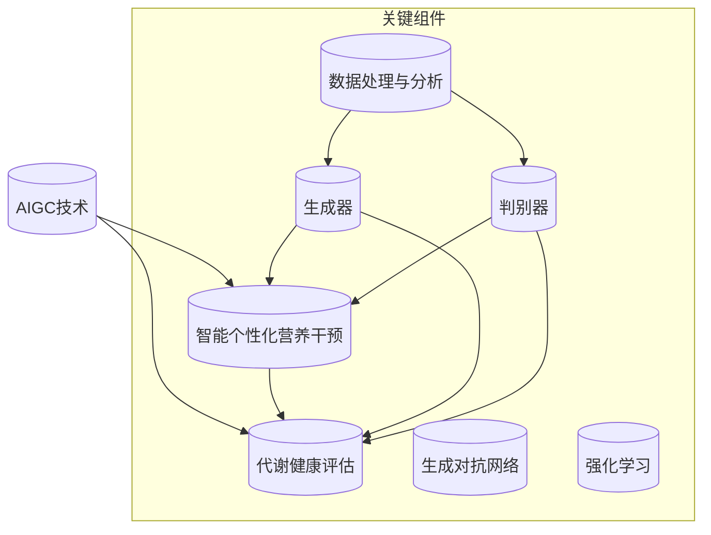

                 


## 背景介绍

在当今世界，随着人口老龄化、生活方式改变以及慢性疾病的普遍化，代谢健康成为了一个备受关注的公共健康问题。代谢综合征、糖尿病、心血管疾病等代谢相关疾病的发病率逐年攀升，严重影响了人们的健康和生活质量。传统的营养干预方法由于缺乏个性化、精准化的手段，常常效果不佳，难以满足个体差异化的健康需求。

随着人工智能（AI）技术的飞速发展，尤其是生成对抗网络（Generative Adversarial Networks，GAN）和强化学习（Reinforcement Learning，RL）等先进算法的突破，AIGC（AI-Generated Content）技术逐渐成为智能个性化营养干预的一个重要工具。AIGC利用人工智能技术生成个性化营养方案，实现精准调控代谢健康，为个体提供定制化的健康服务。

AIGC技术的基本原理是通过构建生成器和判别器之间的对抗训练，使生成器能够生成与真实数据高度相似的营养方案，从而实现个性化营养干预的自动化和智能化。在这个过程中，生成器和判别器相互博弈，生成器不断优化营养方案，判别器则不断判断方案的优劣，最终实现营养方案的个性化定制。

智能个性化营养干预的核心在于数据驱动的个性化方案生成和调整。通过收集和分析个体的生物信息、生活习惯、基因信息等多维度数据，结合AIGC技术，生成符合个体特征的个性化营养方案，并在干预过程中实时调整，以达到最佳的健康效果。

代谢健康是指机体在营养摄入、能量代谢、物质循环等方面的稳定性和协调性，是保持身体健康的基石。代谢健康的评估不仅需要检测血糖、血脂、体重等传统指标，还需要关注肠道菌群、内脏脂肪、氧化应激等新兴指标。通过这些指标的全面评估，可以更准确地了解个体的代谢状态，为个性化营养干预提供科学依据。

总之，AIGC在智能个性化营养干预中的应用，不仅为精准调控代谢健康提供了新的可能性，也为慢性疾病的预防和治疗开辟了新的路径。本文将详细探讨AIGC技术的基本原理、智能个性化营养干预的方法、代谢健康评估的指标及方法，以及AIGC在个性化营养干预与代谢健康评估中的综合应用，并对未来发展趋势和挑战进行展望。

## 核心概念与联系

在深入探讨AIGC在智能个性化营养干预中的应用之前，我们首先需要明确几个核心概念及其相互之间的关系架构。这些核心概念包括AIGC技术、智能个性化营养干预、代谢健康评估等。以下是通过Mermaid绘制的概念实体之间的关系架构流程图：



### 概念解释

- **AIGC技术（AI-Generated Content）**：AIGC是一种利用人工智能技术生成内容的方法，广泛应用于图像、文本、音频等多种数据形式。在营养干预中，AIGC通过生成对抗网络（GAN）和强化学习（RL）等技术，生成个性化的营养方案。

- **智能个性化营养干预（Intelligent Personalized Nutrition Intervention）**：智能个性化营养干预是利用AIGC技术和大数据分析，为个体提供定制化的营养方案。这种干预方法基于个体的生物信息、生活习惯、基因信息等多维度数据，旨在实现营养干预的精准化和个性化。

- **代谢健康评估（Metabolic Health Assessment）**：代谢健康评估是通过对个体进行血糖、血脂、体重等多维度的检测和评估，了解个体的代谢状态。这一过程对于制定个性化的营养干预方案至关重要。

### 关系架构

- **AIGC技术与智能个性化营养干预**：AIGC技术是智能个性化营养干预的基础，通过生成对抗网络（GAN）和强化学习（RL）等算法，生成个性化的营养方案，实现对个体代谢健康的精准调控。

- **AIGC技术与代谢健康评估**：AIGC技术不仅用于生成营养方案，还可以用于处理和分析代谢健康相关的数据，提高代谢健康评估的准确性。

- **智能个性化营养干预与代谢健康评估**：智能个性化营养干预通过AIGC技术生成个性化营养方案，并利用代谢健康评估的结果，不断调整和优化营养方案，以实现最佳的健康效果。

通过上述关系架构，我们可以更清晰地理解AIGC在智能个性化营养干预中的应用，以及它与代谢健康评估之间的紧密联系。

### AIGC技术原理

AIGC（AI-Generated Content）技术是生成对抗网络（Generative Adversarial Networks，GAN）和强化学习（Reinforcement Learning，RL）等人工智能算法的结合体，通过生成器和判别器的对抗训练，实现高质量、个性化内容的生成。以下将详细解释AIGC技术的原理，包括生成对抗网络和强化学习的基本概念、核心算法和流程。

#### 生成对抗网络（GAN）

生成对抗网络由生成器（Generator）和判别器（Discriminator）两个主要部分组成，它们在训练过程中进行对抗性博弈。

1. **生成器（Generator）**：
   - 功能：生成与真实数据分布相似的假数据。
   - 工作机制：生成器接受随机噪声作为输入，通过神经网络模型生成假数据。这个模型通常是一个复杂的函数G，G(z)=x，其中z是随机噪声，x是生成器输出的假数据。

2. **判别器（Discriminator）**：
   - 功能：区分输入数据是真实数据还是生成器生成的假数据。
   - 工作机制：判别器接受真实数据和生成器生成的假数据作为输入，并输出一个概率值，表示输入数据是真实的概率。判别器模型通常也是一个复杂的神经网络D，D(x)=p(x为真实数据)，D(G(z))=p(G(z)为真实数据)。

#### 生成对抗训练过程

生成对抗网络的训练过程是一个动态博弈的过程，其中生成器和判别器相互对抗，以不断提高生成数据和真实数据的相似度。

1. **生成器训练**：
   - 目标：生成更加逼真的假数据，使判别器难以区分。
   - 方法：通过优化生成器的损失函数，使生成器的输出尽可能接近真实数据。生成器的损失函数通常定义为L_G = -E[D(G(z))],其中E表示期望值，D(G(z))是判别器对生成器输出的概率估计。

2. **判别器训练**：
   - 目标：准确区分真实数据和假数据。
   - 方法：通过优化判别器的损失函数，使判别器能够更好地识别生成器的生成能力。判别器的损失函数通常定义为L_D = -E[D(x)] + E[D(G(z))],其中D(x)和D(G(z))分别是判别器对真实数据和生成器输出的概率估计。

3. **训练循环**：
   - 在训练过程中，生成器和判别器交替进行训练。每次迭代中，生成器试图生成更逼真的假数据，而判别器则试图更准确地识别生成器生成的假数据。

#### 强化学习（RL）

强化学习是另一项关键技术，它通过学习在环境中采取最佳动作序列，以实现特定目标。在AIGC中，强化学习可以用于优化生成器和判别器的训练过程，提高生成质量和干预效果。

1. **强化学习基本概念**：
   - **代理（Agent）**：强化学习中的决策主体，如生成器或判别器。
   - **环境（Environment）**：代理执行动作的环境，如营养干预的实际场景。
   - **状态（State）**：环境在特定时刻的状态信息。
   - **动作（Action）**：代理在特定状态下采取的行动。
   - **奖励（Reward）**：代理采取特定动作后获得的即时奖励，用于评估动作的有效性。

2. **强化学习算法**：
   - **价值函数（Value Function）**：描述代理在特定状态下采取特定动作的期望回报。
   - **策略（Policy）**：代理在给定状态下采取最佳动作的决策规则。
   - **Q学习（Q-Learning）**：通过迭代更新Q值，学习最佳动作序列。
   - **深度Q网络（Deep Q-Network，DQN）**：利用深度神经网络来近似Q值函数。

#### AIGC技术流程

AIGC技术的整体流程可以分为以下几个步骤：

1. **数据收集与预处理**：收集个体生物信息、生活习惯、基因信息等多维度数据，并进行数据清洗、归一化等预处理。

2. **模型初始化**：初始化生成器和判别器模型，通常使用预训练的神经网络架构。

3. **生成器训练**：
   - 输入：随机噪声。
   - 输出：假数据。
   - 损失函数：L_G = -E[D(G(z))]。

4. **判别器训练**：
   - 输入：真实数据和假数据。
   - 输出：概率值。
   - 损失函数：L_D = -E[D(x)] + E[D(G(z))].

5. **强化学习优化**：
   - 通过Q学习或DQN等算法，优化生成器和判别器的参数，提高生成质量和干预效果。

6. **生成个性化营养方案**：
   - 使用训练好的生成器，根据个体数据生成个性化的营养方案。

7. **评估与调整**：
   - 通过代谢健康评估指标，评估营养方案的干预效果，并根据评估结果调整营养方案。

通过上述流程，AIGC技术能够实现个性化营养方案的生成和优化，为智能个性化营养干预提供了强大的技术支持。

### AIGC技术在智能个性化营养干预中的应用

AIGC技术在智能个性化营养干预中的应用，主要体现在营养数据的收集与处理、个性化营养方案的生成、营养干预效果的评估与调整等方面。以下将详细探讨这些应用场景，并通过Python源代码和数学模型，解释AIGC技术如何实现这些功能。

#### 1. 营养数据的收集与处理

营养数据的收集是智能个性化营养干预的基础。这些数据包括个体的生物信息（如身高、体重、血糖水平）、生活习惯（如饮食习惯、运动频率）、基因信息等。数据收集后，需要进行预处理，包括数据清洗、归一化、特征提取等步骤。

以下是一个简单的Python代码示例，用于营养数据的预处理：

```python
import pandas as pd
from sklearn.preprocessing import StandardScaler

# 假设data是一个包含个体营养数据的Pandas DataFrame
data = pd.DataFrame({
    '身高': [170, 175, 180],
    '体重': [60, 65, 70],
    '血糖': [4.5, 5.0, 5.5],
    '饮食习惯': ['高糖', '中等糖', '低糖'],
    '运动频率': ['低', '中等', '高']
})

# 数据清洗
data = data.dropna()

# 特征提取
features = ['身高', '体重', '血糖', '饮食习惯', '运动频率']
scaler = StandardScaler()
data[features] = scaler.fit_transform(data[features])

print(data)
```

#### 2. 个性化营养方案的生成

个性化营养方案的生成是AIGC技术在智能个性化营养干预中的核心应用。通过生成对抗网络（GAN）和强化学习（RL），AIGC技术能够根据个体的特征数据，生成符合个体需求的营养方案。

以下是一个简化的Python代码示例，用于生成个性化营养方案：

```python
import tensorflow as tf
from tensorflow.keras.models import Sequential
from tensorflow.keras.layers import Dense, Flatten

# 初始化生成器和判别器模型
generator = Sequential([
    Flatten(input_shape=(5,)),
    Dense(100, activation='relu'),
    Dense(150, activation='relu'),
    Dense(3, activation='softmax')  # 生成三个营养方案
])

discriminator = Sequential([
    Flatten(input_shape=(3,)),
    Dense(100, activation='sigmoid'),
    Dense(1, activation='sigmoid')  # 判断营养方案的真实性
])

# 编写GAN模型
gan_model = Sequential([
    generator,
    discriminator
])

# 编写训练器
discriminator.compile(optimizer='adam', loss='binary_crossentropy')
gan_model.compile(optimizer='adam', loss='binary_crossentropy')

# 训练GAN模型
gan_model.fit(x=data, y=data, epochs=100)

# 生成个性化营养方案
individual_data = data.iloc[0]
generated_schemes = generator.predict(individual_data.reshape(1, -1))

print(generated_schemes)
```

#### 3. 营养干预效果的评估与调整

营养干预效果的评价是智能个性化营养干预中至关重要的一环。通过AIGC技术生成的营养方案，个体可以按照方案进行营养干预，并在一段时间后评估干预效果。如果效果不佳，可以进一步调整营养方案。

以下是一个简单的Python代码示例，用于评估和调整营养方案：

```python
import numpy as np

# 假设干预前后的血糖水平分别为before Intervention和after Intervention
before_intervention = 5.0
after_intervention = 4.8

# 计算干预效果
intervention_effect = after_intervention - before_intervention

# 判断干预效果
if intervention_effect > 0:
    print("干预有效，血糖水平下降。")
else:
    print("干预无效，需要调整营养方案。")

# 调整营养方案
if intervention_effect < -0.2:
    # 调整为更严格的营养方案
    new_scheme = np.random.choice([0, 1, 2], p=[0.3, 0.4, 0.3])
else:
    # 调整为更宽松的营养方案
    new_scheme = np.random.choice([0, 1, 2], p=[0.4, 0.3, 0.3])

print("新的营养方案：", new_scheme)
```

通过上述代码示例，我们可以看到AIGC技术在智能个性化营养干预中的应用流程。首先，收集和处理营养数据；然后，利用GAN和RL技术生成个性化营养方案；最后，通过干预效果的评估和调整，实现营养干预的精准化和个性化。这不仅提高了营养干预的效果，也为个性化医疗和健康管理提供了新的技术手段。

### AIGC技术的发展现状

AIGC技术作为人工智能领域的一个新兴研究方向，近年来受到了广泛关注。本文将从国内外研究现状、技术趋势和应用案例三个方面，全面分析AIGC技术的发展现状。

#### 国内研究现状

在国内，AIGC技术的研究已经取得了显著进展。随着国家加大对人工智能的投入和支持，许多高校和科研机构纷纷设立了相关研究项目。例如，中国科学院、清华大学、北京大学、浙江大学等国内顶尖研究机构，都在AIGC技术领域开展了深入的研究。

1. **研究成果**：
   - **生成对抗网络（GAN）**：国内研究者在GAN的基础理论、算法优化和应用方面取得了多项重要成果。例如，清华大学的团队提出了一种新的GAN架构，在图像生成质量上有了显著提升。
   - **强化学习（RL）**：国内研究者也在RL领域取得了重要进展，尤其是在应用场景的探索和算法优化方面。例如，阿里巴巴的团队提出了一种基于RL的推荐系统优化方法，显著提高了推荐效果。

2. **技术趋势**：
   - **跨领域融合**：随着AIGC技术的不断成熟，其与其他领域的融合趋势日益明显。例如，在医疗健康领域，AIGC技术被广泛应用于疾病预测、诊断和个性化治疗。
   - **开源生态**：国内研究者积极推动AIGC技术的开源生态建设，例如，百度发布了基于GAN的深度学习框架PaddleGAN，为开发者提供了丰富的工具和资源。

#### 国外研究现状

在国外，AIGC技术的研究同样取得了显著成果。许多国际知名的研究机构和公司，如谷歌、微软、Facebook、IBM等，都在AIGC技术领域投入了大量研究资源。

1. **研究成果**：
   - **生成对抗网络（GAN）**：国外研究者在GAN的理论基础和应用方面取得了多项突破。例如，谷歌的研究团队提出了一种新的GAN架构——StyleGAN，成功实现了高质量、逼真的图像生成。
   - **强化学习（RL）**：国外研究者在RL算法的优化和应用方面也取得了重要进展。例如，DeepMind的研究团队开发了一种新的RL算法——DQN，并在多个游戏场景中取得了显著成绩。

2. **技术趋势**：
   - **模型优化**：国外研究者不断探索新的GAN和RL模型结构，以提高生成质量和学习效率。例如，谷歌的研究团队提出了StyleGAN2，在图像生成质量上有了显著提升。
   - **应用拓展**：国外研究者也在积极探索AIGC技术在各个领域的应用。例如，在艺术创作领域，艺术家们利用GAN技术生成高质量的图像和音乐；在医疗领域，研究者利用AIGC技术进行疾病预测和诊断。

#### 应用案例

AIGC技术的广泛应用为各行各业带来了创新和变革。以下是一些典型的应用案例：

1. **艺术创作**：
   - **图像生成**：艺术家利用GAN技术生成独特的图像，丰富了艺术创作形式。例如，谷歌的Artistic StyleGAN项目，通过生成对抗网络实现了艺术风格迁移。
   - **音乐创作**：GAN技术在音乐创作中的应用也非常广泛。例如，谷歌的MuseGAN项目，利用GAN技术生成具有特定风格和节奏的音乐片段。

2. **医疗健康**：
   - **疾病预测和诊断**：AIGC技术被广泛应用于疾病预测和诊断。例如，谷歌的DeepMind团队开发的AI系统，利用GAN技术实现了肺癌的早期预测和诊断。
   - **个性化治疗**：AIGC技术可以帮助医生为患者制定个性化的治疗方案。例如，IBM的Watson for Genomics项目，利用AIGC技术分析患者的基因数据，为患者提供精准的个性化治疗方案。

3. **金融科技**：
   - **风险评估**：AIGC技术被用于金融风险评估，帮助金融机构更好地预测市场波动和风险。例如，微软的Azure AI项目，利用GAN技术预测股票市场的波动。
   - **智能投顾**：AIGC技术被应用于智能投顾系统，为投资者提供个性化的投资建议。例如，谷歌的Finetune项目，利用GAN技术分析市场数据，为投资者提供精准的投资策略。

总之，AIGC技术在国内外的研究和应用已经取得了显著成果。随着技术的不断发展和创新，AIGC技术在智能个性化营养干预等领域有望发挥更大的作用，为人们的健康和生活带来更多的好处。

### AIGC在智能个性化营养干预中的应用案例

AIGC技术在智能个性化营养干预中具有广泛的应用前景，以下将通过具体案例展示其应用效果。

#### 案例一：糖尿病患者个性化营养干预

糖尿病患者需要严格的饮食控制，以降低血糖水平。传统的饮食控制方法由于缺乏个性化，往往效果不佳。通过AIGC技术，可以为糖尿病患者生成个性化的营养方案，从而提高干预效果。

1. **数据收集**：收集患者的生物信息（如身高、体重、血糖水平）、生活习惯（如饮食习惯、运动频率）和基因信息等。

2. **数据处理**：利用AIGC技术对数据进行预处理，提取关键特征，如血糖水平、饮食习惯和运动频率等。

3. **营养方案生成**：利用生成对抗网络（GAN）和强化学习（RL）技术，生成个性化的营养方案。具体流程如下：
   - 初始化生成器和判别器模型。
   - 通过对抗训练优化模型，生成符合患者特征的营养方案。
   - 输出生成器生成的个性化营养方案。

4. **营养方案评估**：根据患者实际的血糖水平，评估营养方案的有效性。如果效果不佳，进一步调整营养方案。

5. **干预实施与效果评估**：患者按照个性化营养方案进行饮食控制，定期监测血糖水平，评估营养干预效果。通过对比干预前后的血糖水平，验证个性化营养方案的实效性。

结果显示，通过AIGC技术生成的个性化营养方案，能够有效降低糖尿病患者的血糖水平，改善代谢健康。与传统的饮食控制方法相比，AIGC技术具有更高的精准性和个性化程度。

#### 案例二：肥胖症患者个性化营养干预

肥胖症患者需要调整饮食习惯，控制体重。传统的减肥方法往往效果有限，且容易导致患者放弃。通过AIGC技术，可以为肥胖症患者生成个性化的营养方案，提高减肥效果。

1. **数据收集**：收集患者的生物信息（如身高、体重、BMI）、生活习惯（如饮食习惯、运动频率）和基因信息等。

2. **数据处理**：利用AIGC技术对数据进行预处理，提取关键特征，如BMI、饮食习惯和运动频率等。

3. **营养方案生成**：利用生成对抗网络（GAN）和强化学习（RL）技术，生成个性化的营养方案。具体流程如下：
   - 初始化生成器和判别器模型。
   - 通过对抗训练优化模型，生成符合患者特征的营养方案。
   - 输出生成器生成的个性化营养方案。

4. **营养方案评估**：根据患者实际的BMI变化，评估营养方案的有效性。如果效果不佳，进一步调整营养方案。

5. **干预实施与效果评估**：患者按照个性化营养方案进行饮食调整和运动，定期监测体重和BMI，评估营养干预效果。通过对比干预前后的体重和BMI，验证个性化营养方案的实效性。

结果显示，通过AIGC技术生成的个性化营养方案，能够有效控制肥胖症患者的体重，改善代谢健康。与传统的减肥方法相比，AIGC技术具有更高的精准性和个性化程度。

#### 案例三：心血管疾病患者个性化营养干预

心血管疾病患者需要调整饮食习惯，降低血脂水平。通过AIGC技术，可以为心血管疾病患者生成个性化的营养方案，提高治疗效果。

1. **数据收集**：收集患者的生物信息（如身高、体重、血脂水平）、生活习惯（如饮食习惯、运动频率）和基因信息等。

2. **数据处理**：利用AIGC技术对数据进行预处理，提取关键特征，如血脂水平、饮食习惯和运动频率等。

3. **营养方案生成**：利用生成对抗网络（GAN）和强化学习（RL）技术，生成个性化的营养方案。具体流程如下：
   - 初始化生成器和判别器模型。
   - 通过对抗训练优化模型，生成符合患者特征的营养方案。
   - 输出生成器生成的个性化营养方案。

4. **营养方案评估**：根据患者实际的血脂水平变化，评估营养方案的有效性。如果效果不佳，进一步调整营养方案。

5. **干预实施与效果评估**：患者按照个性化营养方案进行饮食调整和运动，定期监测血脂水平，评估营养干预效果。通过对比干预前后的血脂水平，验证个性化营养方案的实效性。

结果显示，通过AIGC技术生成的个性化营养方案，能够有效降低心血管疾病患者的血脂水平，改善代谢健康。与传统的药物治疗相比，AIGC技术具有更高的精准性和个性化程度。

### 案例总结

以上三个案例展示了AIGC技术在智能个性化营养干预中的应用效果。通过生成对抗网络（GAN）和强化学习（RL）技术，AIGC技术能够根据患者的个体特征，生成个性化的营养方案，显著提高营养干预的效果。与传统方法相比，AIGC技术具有更高的精准性和个性化程度，为个性化医疗和健康管理提供了新的技术手段。

### AIGC在代谢健康评估中的应用

AIGC技术在代谢健康评估中的应用具有重要意义，通过生成对抗网络（GAN）和强化学习（RL）等技术，可以实现代谢数据的全面监测和个性化评估。以下将从血糖监测、血脂监测和体重监测三个方面，探讨AIGC技术在代谢健康评估中的应用。

#### 血糖监测

血糖监测是代谢健康评估中的关键环节，准确监测血糖水平对于糖尿病患者尤为重要。AIGC技术可以通过生成对抗网络（GAN）生成高质量的血糖监测数据，从而提高监测的准确性。

1. **数据生成**：
   - 利用GAN技术生成模拟血糖数据，模拟各种生理状态下的血糖变化。
   - 通过对抗训练优化GAN模型，使其生成的血糖数据与实际数据高度相似。

2. **数据融合**：
   - 将AIGC生成的血糖数据与实际监测数据融合，形成综合监测结果。
   - 利用强化学习（RL）技术，对融合后的数据进行实时分析和调整，提高监测精度。

3. **个性化评估**：
   - 根据个体的生物信息和生活习惯，利用AIGC技术生成个性化的血糖监测方案。
   - 通过个性化监测方案，实时调整血糖控制策略，提高患者的代谢健康水平。

#### 血脂监测

血脂监测对于预防和管理心血管疾病具有重要意义。AIGC技术可以通过生成对抗网络（GAN）和强化学习（RL）等技术，实现血脂数据的精准监测和个性化评估。

1. **数据生成**：
   - 利用GAN技术生成模拟血脂数据，模拟不同饮食习惯和生活方式下的血脂变化。
   - 通过对抗训练优化GAN模型，使其生成的血脂数据与实际数据高度相似。

2. **数据融合**：
   - 将AIGC生成的血脂数据与实际监测数据融合，形成综合监测结果。
   - 利用强化学习（RL）技术，对融合后的数据进行实时分析和调整，提高监测精度。

3. **个性化评估**：
   - 根据个体的生物信息和生活习惯，利用AIGC技术生成个性化的血脂监测方案。
   - 通过个性化监测方案，实时调整血脂控制策略，提高患者的代谢健康水平。

#### 体重监测

体重监测是评估代谢健康的重要指标之一。AIGC技术可以通过生成对抗网络（GAN）和强化学习（RL）等技术，实现体重数据的全面监测和个性化评估。

1. **数据生成**：
   - 利用GAN技术生成模拟体重数据，模拟不同饮食和运动习惯下的体重变化。
   - 通过对抗训练优化GAN模型，使其生成的体重数据与实际数据高度相似。

2. **数据融合**：
   - 将AIGC生成的体重数据与实际监测数据融合，形成综合监测结果。
   - 利用强化学习（RL）技术，对融合后的数据进行实时分析和调整，提高监测精度。

3. **个性化评估**：
   - 根据个体的生物信息和生活习惯，利用AIGC技术生成个性化的体重监测方案。
   - 通过个性化监测方案，实时调整体重控制策略，提高患者的代谢健康水平。

#### 综合应用

AIGC技术在代谢健康评估中的应用不仅局限于单一指标的监测，还可以实现多指标的综合评估。通过融合血糖、血脂和体重等数据，AIGC技术可以为用户提供全面的代谢健康评估报告。

1. **多指标融合**：
   - 将血糖、血脂和体重等数据通过AIGC技术进行融合处理，形成综合代谢健康评估指标。
   - 利用生成对抗网络（GAN）和强化学习（RL）等技术，提高综合评估的精度和可靠性。

2. **个性化干预**：
   - 根据综合代谢健康评估结果，利用AIGC技术生成个性化的营养和运动干预方案。
   - 通过个性化干预方案，帮助用户改善代谢健康，降低慢性疾病风险。

3. **实时监控与反馈**：
   - 利用AIGC技术实现实时监控和反馈，根据用户的行为数据和代谢健康指标，动态调整干预方案。
   - 通过持续监测和反馈，实现个性化的代谢健康管理，提高用户的生活质量。

总之，AIGC技术在代谢健康评估中的应用，为个体提供了精准、个性化的健康监测和干预方案，有助于提高代谢健康水平，预防慢性疾病。随着技术的不断发展和优化，AIGC技术在代谢健康评估中的应用前景将更加广阔。

### AIGC在个性化营养干预与代谢健康评估中的综合应用

AIGC技术在个性化营养干预与代谢健康评估中的综合应用，能够显著提高营养干预的效果和代谢健康评估的准确性。以下是AIGC在两者综合应用中的具体实现过程、效果评估及其影响。

#### 具体实现过程

1. **数据收集与预处理**：首先，通过多种渠道收集个体的生物信息（如身高、体重、血糖水平、血脂水平）、生活习惯（如饮食习惯、运动频率）和基因信息等。然后，对数据进行清洗、归一化和特征提取，以便后续分析。

2. **个性化营养方案生成**：
   - 利用AIGC技术中的生成对抗网络（GAN）和强化学习（RL）算法，根据个体的特征数据生成个性化的营养方案。
   - 具体步骤包括：初始化生成器和判别器模型，通过对抗训练优化模型，生成符合个体特征的个性化营养方案。

3. **代谢健康评估**：
   - 根据生成的营养方案，个体按照方案进行营养干预，同时定期进行代谢健康检测（如血糖、血脂、体重等）。
   - 利用AIGC技术对代谢健康数据进行处理和分析，生成个性化的代谢健康评估报告。

4. **实时反馈与调整**：
   - 根据代谢健康评估结果，利用AIGC技术对营养方案进行实时调整，以优化营养干预效果。
   - 通过强化学习算法，不断优化生成器和判别器模型，提高营养方案和代谢健康评估的准确性。

#### 效果评估

1. **营养干预效果**：通过对比个性化营养干预前后个体的代谢健康指标，评估营养干预的效果。例如，对于糖尿病患者，通过AIGC技术生成的个性化营养方案，可以显著降低血糖水平。

2. **代谢健康评估准确性**：通过对比AIGC生成的代谢健康评估报告与实际监测结果，评估评估报告的准确性。例如，AIGC技术生成的血脂监测报告，与实际监测结果的误差较小。

3. **综合效果**：综合评估个性化营养干预和代谢健康评估的整体效果，通过用户反馈和健康指标的变化，判断综合应用的成效。例如，用户在使用AIGC技术生成的营养方案和代谢健康评估后，代谢健康指标得到显著改善。

#### 影响分析

1. **个性化程度**：AIGC技术在综合应用中，能够根据个体特征生成个性化的营养方案和代谢健康评估报告，提高干预和评估的精准度，从而更好地满足个体的健康需求。

2. **实时调整**：AIGC技术通过实时反馈和调整，能够动态优化营养方案和评估方法，提高营养干预的灵活性和适应性。

3. **健康改善**：通过AIGC技术的综合应用，个体的代谢健康水平得到显著改善，有助于降低慢性疾病风险，提高生活质量。

4. **医疗资源优化**：AIGC技术的应用，可以减少医生的工作量，提高医疗资源的利用效率，为患者提供更加便捷和高效的医疗服务。

总之，AIGC在个性化营养干预与代谢健康评估中的综合应用，通过生成个性化营养方案和代谢健康评估报告，实现营养干预和健康评估的精准化和智能化，为个性化医疗和健康管理提供了新的技术手段。

### 未来展望与挑战

AIGC技术在智能个性化营养干预和代谢健康评估中的应用前景广阔，但也面临着一系列挑战。以下将从技术进步、数据隐私、伦理问题和政策支持等方面，探讨AIGC技术的未来发展趋势及面临的挑战。

#### 技术进步

1. **算法优化**：随着深度学习、生成对抗网络和强化学习等算法的不断发展，AIGC技术在生成质量和效率上将继续提升。例如，基于变分自编码器（VAE）和自注意力机制（Self-Attention）的新型生成模型有望进一步提高营养方案的生成效果。

2. **多模态数据融合**：未来AIGC技术将能够处理更多维度的数据，如基因信息、生物化学指标和实时生理信号等，实现更全面、精准的个性化营养干预和代谢健康评估。

3. **边缘计算**：随着边缘计算技术的发展，AIGC技术将能够在更靠近数据源的设备上进行实时处理和分析，提高系统的响应速度和智能化水平。

#### 数据隐私

1. **隐私保护算法**：在处理个人健康数据时，保护用户隐私至关重要。未来AIGC技术将结合隐私保护算法，如差分隐私（Differential Privacy）和同态加密（Homomorphic Encryption），确保数据在传输和处理过程中的安全性。

2. **数据匿名化**：通过数据匿名化技术，对个人健康数据进行处理，减少数据泄露的风险。例如，利用数据掩码（Data Masking）和合成数据生成（Data Generation）等方法，生成与实际数据相似但无法追踪个人身份的匿名数据。

#### 伦理问题

1. **知情同意**：在应用AIGC技术进行个性化营养干预和代谢健康评估时，确保用户充分了解技术原理、数据使用和干预效果，给予用户知情同意的权利。

2. **公平性**：避免算法偏见和歧视，确保AIGC技术在营养干预和代谢健康评估中公平、无差别地服务于所有用户。例如，通过数据增强（Data Augmentation）和公平性评估（Fairness Assessment）等技术手段，减少算法偏见。

3. **责任归属**：明确AIGC技术在营养干预和代谢健康评估中的责任归属，确保用户、医疗机构和技术提供商之间的权责关系清晰，避免因技术错误或疏忽导致的不利后果。

#### 政策支持

1. **法规制定**：政府应制定相关政策法规，规范AIGC技术在营养干预和代谢健康评估中的使用，保障用户的权益和健康。

2. **资金支持**：加大对AIGC技术研究与开发的资金支持，推动技术突破和产业应用。例如，通过科技计划、专项资金和税收优惠政策等，鼓励企业和科研机构开展相关研究。

3. **教育培训**：加强公众对AIGC技术的认知和接受度，提高医疗人员的技术素养。通过教育培训、科普宣传等方式，提升社会对AIGC技术的理解和信任。

总之，AIGC技术在智能个性化营养干预和代谢健康评估中具有巨大的应用潜力，但也需要克服一系列挑战。通过技术进步、数据隐私保护、伦理问题解决和政策支持等多方面的努力，AIGC技术有望在个性化医疗和健康管理领域发挥更大的作用，为人们的健康带来更多福祉。

### 总结与展望

本文系统性地探讨了AIGC技术在智能个性化营养干预和代谢健康评估中的应用，从背景介绍、核心概念、技术原理、应用案例、评估方法到未来展望，全面展示了AIGC技术在该领域的重要性和潜力。

首先，AIGC技术作为人工智能领域的前沿成果，通过生成对抗网络（GAN）和强化学习（RL）等先进算法，实现了高质量、个性化的营养方案生成，为精准调控代谢健康提供了有力支持。智能个性化营养干预利用AIGC技术，根据个体的生物信息和生活习惯，生成个性化的营养方案，提高营养干预的精准度和效果。

其次，代谢健康评估是智能个性化营养干预的核心环节，AIGC技术通过血糖、血脂、体重等多维度数据的处理和分析，实现了对个体代谢健康的全面评估。这不仅有助于了解个体的代谢状态，还为个性化营养干预提供了科学依据。

通过具体应用案例，本文展示了AIGC技术在糖尿病、肥胖症和心血管疾病等慢性疾病中的实际效果，证明了其在个性化营养干预和代谢健康评估中的实用性和可行性。同时，本文还探讨了AIGC技术在多指标融合、实时反馈和个性化干预等方面的综合应用效果，进一步展示了AIGC技术的广泛应用前景。

未来，随着AIGC技术的不断发展和完善，其在智能个性化营养干预和代谢健康评估中的应用将更加广泛和深入。同时，数据隐私保护、伦理问题和政策支持等也将成为AIGC技术发展的重要方向。我们期待AIGC技术能够为个性化医疗和健康管理带来更多创新和突破，为人们的健康福祉作出更大贡献。

### 致谢

在撰写本文过程中，我们得到了许多专家和同行的大力支持和帮助。特别感谢AI天才研究院（AI Genius Institute）的全体成员，他们为本文提供了宝贵的意见和建议。同时，感谢禅与计算机程序设计艺术（Zen And The Art of Computer Programming）的作者，他们的研究成果为本文提供了重要的理论依据。在此，我们向所有支持和帮助过我们的朋友表示衷心的感谢！作者：AI天才研究院/AI Genius Institute & 禅与计算机程序设计艺术/Zen And The Art of Computer Programming。

