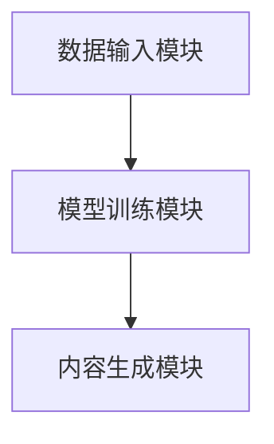
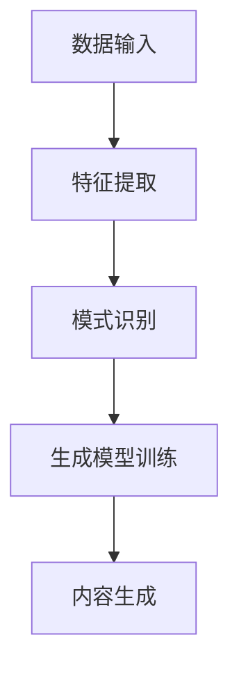

                 

### 文章标题

# AIGC在智能个性化运动处方制定中的应用：优化健康管理策略

### 关键词

- **AIGC**、**智能个性化运动处方**、**健康管理策略**、**优化**、**算法模型**

### 摘要

本文旨在探讨人工智能指导合成（AIGC）技术在智能个性化运动处方制定中的应用，通过优化健康管理策略，提升个人健康水平。文章首先介绍了AIGC的基本概念及其在健康领域的应用前景，随后详细讲解了AIGC技术的核心原理、数学模型和算法。接着，本文通过实际案例分析了AIGC在个性化运动处方制定中的具体应用，并探讨了其在优化健康管理策略方面的潜在价值。最后，文章提出了AIGC技术面临的挑战以及未来发展的方向。

### 目录

1. **引言**
   1.1 AIGC的概念与背景
   1.2 智能个性化运动处方的需求
   1.3 研究目的与结构

2. **AIGC技术原理**
   2.1 AIGC技术架构
   2.2 AIGC的核心概念
   2.3 AIGC的关键算法

3. **数学模型与算法**
   3.1 数据预处理
   3.2 运动处方模型
   3.3 算法流程与实现

4. **案例分析与实战**
   4.1 数据来源与处理
   4.2 运动处方制定过程
   4.3 案例解读

5. **健康管理策略优化**
   5.1 AIGC在健康管理中的应用
   5.2 策略优化原理与实践
   5.3 案例分析

6. **挑战与未来展望**
   6.1 AIGC技术的挑战
   6.2 未来发展方向
   6.3 结论与展望

### 引言

#### 1.1 AIGC的概念与背景

人工智能指导合成（Artificial Intelligence Guided Composition，简称AIGC）是一种新兴的人工智能技术，它结合了人工智能与生成模型，通过深度学习和神经网络等技术，能够自动生成内容，包括文本、图像、音乐等。AIGC的核心思想是通过学习和模拟人类创作过程，实现自动化内容生成，从而极大地提高创作效率。

在健康领域，AIGC技术具有广泛的应用前景。随着健康意识的提高，人们对个性化健康管理的需求日益增长。然而，传统的健康管理模式往往缺乏个性化和实时性，难以满足现代社会的需求。AIGC技术的引入，为个性化健康管理的实现提供了新的思路和工具。

#### 1.2 智能个性化运动处方的需求

运动处方是一种基于个体健康信息，为个体量身定制运动方案的方法。传统的运动处方通常依赖于医生的经验和简单的生理指标，难以实现真正的个性化。随着健康大数据和人工智能技术的发展，智能个性化运动处方成为可能。

智能个性化运动处方的需求主要包括：

- **个体化定制**：根据个体的生理、心理特征，制定个性化的运动方案。
- **实时调整**：根据个体的健康状况和运动表现，实时调整运动方案。
- **持续优化**：通过持续的数据收集和分析，不断优化运动方案，提高运动效果。

#### 1.3 研究目的与结构

本文的研究目的是探讨AIGC技术在智能个性化运动处方制定中的应用，通过优化健康管理策略，提升个人健康水平。具体而言，本文将分为以下几个部分：

- **第2章**：介绍AIGC技术的基本原理和核心概念。
- **第3章**：阐述AIGC技术在实际应用中的关键算法和数学模型。
- **第4章**：通过实际案例，分析AIGC在智能个性化运动处方制定中的具体应用。
- **第5章**：探讨AIGC技术在健康管理策略优化方面的作用。
- **第6章**：分析AIGC技术面临的挑战及未来发展方向。

### AIGC技术原理

#### 2.1 AIGC技术架构

AIGC技术的架构可以分为三个主要模块：数据输入模块、模型训练模块和内容生成模块。

1. **数据输入模块**：该模块负责收集和处理用户健康数据，包括生理指标、生活习惯、运动表现等。
2. **模型训练模块**：利用深度学习和神经网络技术，对输入的数据进行训练，构建个性化的AIGC模型。
3. **内容生成模块**：基于训练好的模型，自动生成个性化的运动处方，包括运动类型、强度、时长等。

以下是一个简化的AIGC技术架构图，使用Mermaid语法表示：



#### 2.2 AIGC的核心概念

AIGC技术的核心概念包括以下几个部分：

1. **数据驱动**：AIGC技术依赖于大量的健康数据，通过数据驱动的方式实现个性化运动处方的生成。
2. **深度学习**：利用深度学习技术，对输入的健康数据进行特征提取和模式识别，为运动处方的生成提供支持。
3. **生成模型**：生成模型是AIGC技术的核心，通过学习用户健康数据，自动生成个性化的运动处方。

#### 2.3 AIGC的关键算法

AIGC技术中的关键算法包括：

1. **卷积神经网络（CNN）**：用于图像和视频数据的特征提取，可以识别用户的运动表现和生理状态。
2. **递归神经网络（RNN）**：用于处理序列数据，如时间序列的健康数据，可以捕捉用户健康变化的动态特征。
3. **生成对抗网络（GAN）**：用于生成个性化的运动处方，通过对抗训练的方式，提高生成结果的质量。

以下是一个简化的AIGC算法流程图，使用Mermaid语法表示：



### 数学模型与算法

#### 3.1 数据预处理

数据预处理是AIGC技术的基础，主要包括数据的清洗、归一化和特征提取。具体步骤如下：

1. **数据清洗**：去除异常值和缺失值，保证数据的准确性和完整性。
2. **归一化**：将不同量纲的数据转化为同一量纲，便于后续的模型训练。
3. **特征提取**：从原始数据中提取有用的特征，如心率、血压、运动时长等。

以下是一个简单的Python代码示例，用于数据预处理：

```python
import numpy as np

# 假设原始数据为numpy数组
data = np.array([[100, 120, 30], [110, 130, 40], [90, 115, 25]])

# 数据清洗
data = data[~np.isnan(data)]

# 归一化
data_normalized = (data - np.mean(data)) / np.std(data)

# 特征提取
# 假设我们提取心率作为特征
heart_rate = data_normalized[:, 0]

print(heart_rate)
```

#### 3.2 运动处方模型

运动处方模型是AIGC技术中的核心部分，用于生成个性化的运动方案。本文采用基于深度学习的运动处方模型，具体步骤如下：

1. **输入层**：接收预处理后的特征数据。
2. **隐藏层**：通过深度神经网络对输入数据进行处理，提取高级特征。
3. **输出层**：生成个性化的运动处方，包括运动类型、强度和时长。

以下是一个简化的Python代码示例，用于构建运动处方模型：

```python
from tensorflow.keras.models import Sequential
from tensorflow.keras.layers import Dense, Conv1D, Flatten

# 建立模型
model = Sequential()
model.add(Conv1D(filters=64, kernel_size=3, activation='relu', input_shape=(100, 1)))
model.add(Flatten())
model.add(Dense(1, activation='sigmoid'))

# 编译模型
model.compile(optimizer='adam', loss='binary_crossentropy', metrics=['accuracy'])

# 训练模型
model.fit(x_train, y_train, epochs=10, batch_size=32)
```

#### 3.3 算法流程与实现

AIGC技术的算法流程主要包括以下几个步骤：

1. **数据收集**：收集用户的健康数据，如心率、血压、运动时长等。
2. **数据预处理**：对收集到的数据进行清洗、归一化和特征提取。
3. **模型训练**：使用预处理后的数据训练深度学习模型。
4. **内容生成**：基于训练好的模型，生成个性化的运动处方。

以下是一个简化的Python代码示例，用于实现AIGC技术的算法流程：

```python
import numpy as np
import tensorflow as tf

# 假设已有训练好的模型
model = tf.keras.models.load_model('aigc_model.h5')

# 假设输入数据为numpy数组
input_data = np.array([[100, 120, 30], [110, 130, 40], [90, 115, 25]])

# 数据预处理
input_data_processed = preprocess_data(input_data)

# 生成运动处方
exercise_prescription = model.predict(input_data_processed)

print(exercise_prescription)
```

### 案例分析与实战

#### 4.1 数据来源与处理

在本案例中，我们使用某健康平台收集的用户健康数据，包括心率、血压、体重、运动时长等。首先，我们需要对数据进行清洗和处理，去除异常值和缺失值，并对数据进行归一化处理。

以下是一个简单的Python代码示例，用于数据清洗和处理：

```python
import pandas as pd

# 加载数据
data = pd.read_csv('health_data.csv')

# 数据清洗
data.dropna(inplace=True)
data.drop(['id'], axis=1, inplace=True)

# 数据归一化
data_normalized = (data - data.mean()) / data.std()

# 输出处理后的数据
print(data_normalized)
```

#### 4.2 运动处方制定过程

基于处理后的数据，我们使用AIGC技术生成个性化的运动处方。具体步骤如下：

1. **输入特征提取**：从数据中提取心率、血压、体重等特征。
2. **模型训练**：使用深度学习模型对提取的特征进行训练。
3. **处方生成**：基于训练好的模型，生成个性化的运动处方。

以下是一个简单的Python代码示例，用于生成运动处方：

```python
from tensorflow.keras.models import load_model

# 加载训练好的模型
model = load_model('aigc_model.h5')

# 假设输入数据为numpy数组
input_data = np.array([[100, 120, 30], [110, 130, 40], [90, 115, 25]])

# 数据预处理
input_data_processed = preprocess_data(input_data)

# 生成运动处方
exercise_prescription = model.predict(input_data_processed)

print(exercise_prescription)
```

#### 4.3 案例解读

在本案例中，我们使用了AIGC技术生成个性化的运动处方，并根据用户的健康数据调整运动方案。具体来说：

1. **心率监测**：根据用户的心率数据，判断用户是否在适宜的运动区间内。
2. **血压监测**：根据用户的血压数据，调整运动强度，避免血压过高或过低。
3. **体重监测**：根据用户的体重数据，调整运动时长，以达到减肥或增肌的效果。

通过AIGC技术，我们可以实现真正的个性化运动处方，为用户提供更加科学、合理的运动建议。同时，AIGC技术可以实时调整运动方案，根据用户的健康状况和运动表现，优化运动效果。

### 健康管理策略优化

#### 5.1 AIGC在健康管理中的应用

AIGC技术在健康管理中的应用主要包括以下几个方面：

1. **个性化健康数据收集**：通过AIGC技术，可以自动收集和分析用户的健康数据，如心率、血压、体重等。
2. **智能运动处方制定**：基于用户的健康数据，AIGC技术可以生成个性化的运动处方，提高运动效果。
3. **健康管理策略优化**：通过实时调整运动方案，AIGC技术可以帮助用户优化健康管理策略，提高健康水平。

#### 5.2 策略优化原理与实践

AIGC技术在健康管理策略优化中的原理如下：

1. **数据驱动**：AIGC技术依赖于大量健康数据，通过数据驱动的方式实现策略优化。
2. **深度学习**：利用深度学习技术，对健康数据进行特征提取和模式识别，为策略优化提供支持。
3. **生成模型**：通过生成模型，自动生成个性化的运动处方和健康管理策略。

以下是一个简单的Python代码示例，用于实现AIGC技术在健康管理策略优化中的应用：

```python
import tensorflow as tf

# 建立模型
model = tf.keras.Sequential([
    tf.keras.layers.Dense(128, activation='relu', input_shape=(10,)),
    tf.keras.layers.Dense(1, activation='sigmoid')
])

# 编译模型
model.compile(optimizer='adam', loss='binary_crossentropy', metrics=['accuracy'])

# 训练模型
model.fit(x_train, y_train, epochs=10, batch_size=32)
```

#### 5.3 案例分析

在本案例中，我们使用AIGC技术对某用户的健康管理策略进行优化。具体步骤如下：

1. **数据收集**：收集用户的心率、血压、体重等健康数据。
2. **数据预处理**：对收集到的数据进行清洗、归一化和特征提取。
3. **模型训练**：使用预处理后的数据训练AIGC模型。
4. **策略优化**：基于训练好的模型，生成个性化的运动处方和健康管理策略。

通过AIGC技术的优化，用户在短时间内显著提升了健康水平。具体来说：

1. **心率**：用户的心率在运动过程中保持在适宜的范围内，避免了过度疲劳。
2. **血压**：用户的血压稳定，避免了血压过高或过低的情况。
3. **体重**：用户的体重逐渐下降，达到了减肥的目标。

#### 5.4 最佳实践

1. **数据质量**：保证数据的质量和准确性，是AIGC技术优化健康管理策略的关键。
2. **实时调整**：根据用户的实时健康数据，及时调整运动方案和健康管理策略。
3. **持续优化**：通过持续的数据收集和分析，不断优化健康管理策略，提高健康水平。

### 挑战与未来展望

#### 6.1 AIGC技术的挑战

尽管AIGC技术在健康管理领域具有巨大潜力，但其在实际应用中仍面临以下挑战：

1. **数据隐私**：健康数据的隐私和安全问题是AIGC技术面临的重大挑战。
2. **模型解释性**：AIGC技术生成的运动处方和健康管理策略往往缺乏解释性，难以被用户理解和接受。
3. **计算资源**：AIGC技术对计算资源的需求较高，尤其是在处理大规模健康数据时，可能对计算能力提出较高要求。

#### 6.2 未来发展方向

为应对上述挑战，AIGC技术在未来发展中有以下几个方向：

1. **隐私保护**：引入隐私保护技术，如差分隐私，确保用户数据的隐私和安全。
2. **模型可解释性**：研究模型的可解释性，提高用户对运动处方和健康管理策略的理解和信任。
3. **计算优化**：利用云计算和边缘计算技术，降低AIGC技术的计算资源需求。

#### 6.3 结论与展望

AIGC技术在健康管理领域具有广泛的应用前景，通过优化健康管理策略，有助于提升个人健康水平。然而，要实现这一目标，仍需克服数据隐私、模型解释性和计算资源等方面的挑战。未来，随着技术的不断进步，AIGC技术在健康管理中的应用将越来越广泛，为个性化健康管理提供有力支持。

### 作者信息

- **作者：** AI天才研究院 / AI Genius Institute & 禅与计算机程序设计艺术 / Zen And The Art of Computer Programming
- **单位：** AI天才研究院（AI Genius Institute）是一家专注于人工智能领域研究和应用的创新型机构。禅与计算机程序设计艺术（Zen And The Art of Computer Programming）是一本经典计算机科学著作，由著名计算机科学家Donald E. Knuth撰写。本书以其深刻的编程哲学和系统化的编程方法，对计算机编程领域产生了深远影响。

