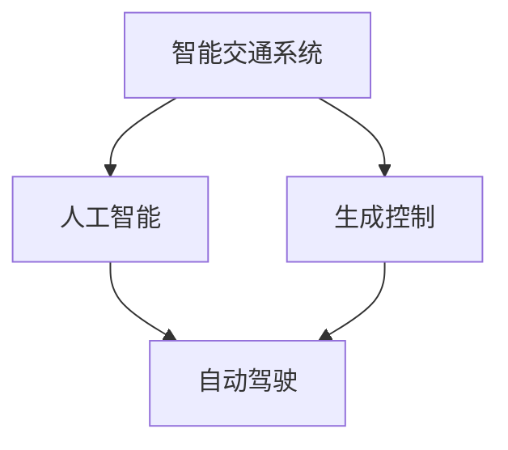
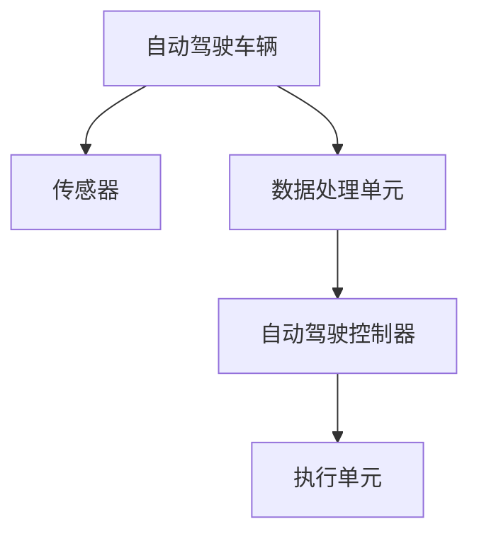
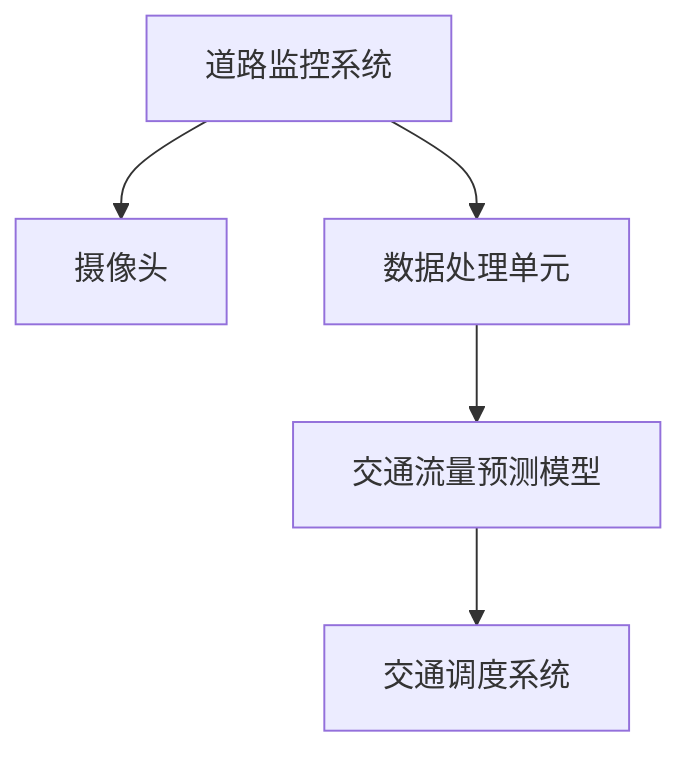
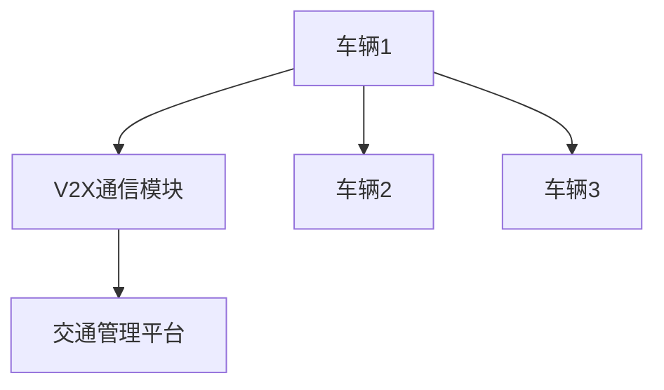
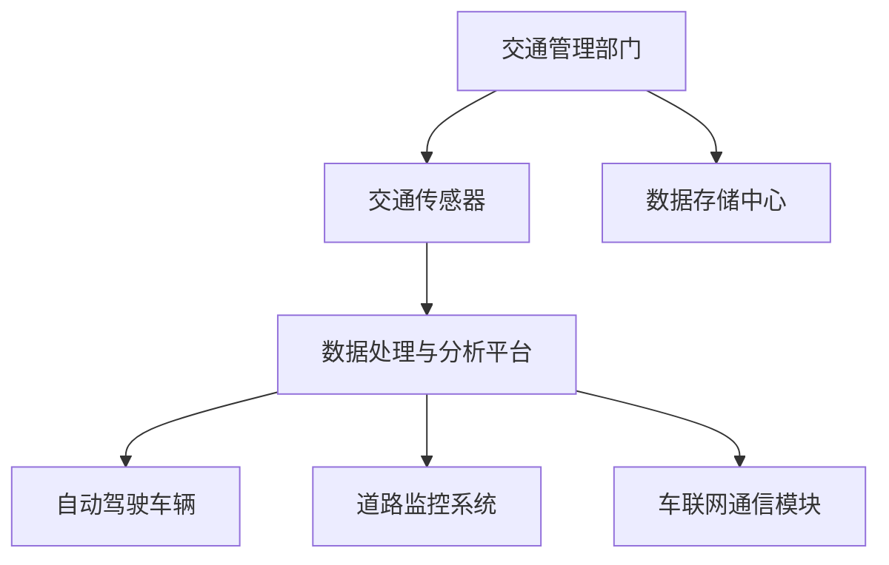

                 

# 《AIGC在智能交通事故预防中的应用：构建零事故交通系统》

## 关键词
- AIGC
- 交通事故预防
- 自动驾驶
- 智能交通系统
- 零事故交通系统

## 摘要
本文旨在探讨如何利用AIGC（自适应智能生成控制）技术来构建一个零事故交通系统。首先，我们将介绍AIGC的基本概念及其在智能交通系统中的地位。接着，通过分析交通事故数据，我们将阐述AIGC在交通事故预防中的技术原理和应用。此外，我们将详细讲解AIGC技术在自动驾驶、道路监控系统、车联网技术等实际案例中的应用，并探讨构建零事故交通系统的策略与挑战。最后，本文将对未来AIGC在智能交通事故预防领域的发展趋势进行展望。

## 第1章 引言

### 1.1 背景介绍
随着城市化进程的加速和交通需求的增长，交通事故频繁发生，成为影响公共安全和经济发展的重要问题。据统计，每年因交通事故造成的经济损失高达数千亿美元。为了减少交通事故，各国政府和科研机构投入大量资源进行交通管理和安全研究。近年来，人工智能（AI）技术的迅速发展，为解决交通事故问题提供了新的思路和手段。

AIGC是一种基于人工智能和生成控制的先进技术，具有自适应性和自主决策能力。它通过分析大量交通数据，实现对交通场景的实时监测和预测，从而预防交通事故的发生。AIGC技术在智能交通系统中的应用，有望实现零事故交通系统的构建。

### 1.2 书籍结构
本文将分为七个章节，系统介绍AIGC在智能交通事故预防中的应用。第1章为引言，第2章介绍AIGC的基础概念和智能交通系统的关系，第3章讲解AIGC的技术原理，第4章分析交通事故数据，第5章探讨AIGC在交通事故预防中的应用案例，第6章讨论构建零事故交通系统的策略，第7章展望AIGC技术的发展趋势。通过这七个章节的介绍，读者可以全面了解AIGC技术在智能交通事故预防领域的应用前景。

### 1.3 读者对象
本文面向对智能交通系统、人工智能技术感兴趣的读者，包括交通工程、计算机科学、自动化控制等相关专业的研究生、科研人员、工程师等。同时，本文也适合对交通安全管理、交通事故预防感兴趣的政府官员、企业管理者等。通过阅读本文，读者可以了解AIGC技术在交通事故预防中的应用，为相关领域的研究和实践提供参考。

## 第2章 AIGC基础概念

### 2.1 AIGC概述
AIGC（自适应智能生成控制）是一种结合了人工智能、机器学习和生成控制的先进技术。它通过自适应学习和自主决策，实现对复杂系统的智能控制。在交通领域，AIGC可以用于交通流量预测、事故预警、自动驾驶等场景。

AIGC的核心技术包括以下几个方面：

1. **人工智能（AI）**：AIGC依赖于机器学习、深度学习等技术，通过训练大量数据模型，实现系统的自适应学习和自主决策。
2. **生成控制（GC）**：生成控制是一种基于概率模型和决策理论的控制方法，能够生成最优控制策略。
3. **自适应学习**：AIGC能够根据实时数据和环境变化，动态调整控制策略，提高系统的适应性和鲁棒性。

### 2.2 AIGC与智能交通系统
智能交通系统（Intelligent Transportation System，ITS）是一种综合利用信息技术、控制技术、通信技术等，实现交通管理和服务自动化的系统。AIGC在智能交通系统中具有重要作用，主要表现在以下几个方面：

1. **交通流量预测**：通过分析历史交通数据，AIGC可以预测未来交通流量，为交通管理和调度提供依据。
2. **事故预警**：AIGC可以实时监测交通状况，通过识别异常行为和潜在风险，提前预警交通事故的发生。
3. **自动驾驶**：AIGC技术支持自动驾驶系统的自主决策和控制，提高行驶安全性。

### 2.3 AIGC在交通事故预防中的角色
在交通事故预防中，AIGC扮演着至关重要的角色。通过以下方式，AIGC有助于实现零事故交通系统的构建：

1. **实时监测**：AIGC可以实时监测交通状况，识别潜在风险，提前预警交通事故的发生。
2. **智能调度**：基于AIGC的智能调度系统，可以优化交通流量，减少拥堵，降低事故风险。
3. **自动驾驶**：自动驾驶技术依赖于AIGC的自主决策和控制，能够提高行驶安全性，减少人为操作失误导致的事故。

### 2.4 核心概念与联系
为了更好地理解AIGC在交通事故预防中的应用，我们需要了解以下几个核心概念，并分析它们之间的关系：

1. **智能交通系统（ITS）**：AIGC是智能交通系统中的一个重要组成部分，为交通管理和服务提供智能支持。
2. **人工智能（AI）**：AIGC依赖于机器学习、深度学习等技术，实现系统的自适应学习和自主决策。
3. **生成控制（GC）**：生成控制是AIGC的核心技术之一，通过概率模型和决策理论，实现最优控制策略。
4. **自动驾驶**：自动驾驶技术是AIGC在交通领域的一个重要应用，通过自主决策和控制，提高行驶安全性。

下面是一个Mermaid流程图，展示AIGC核心概念之间的关系：



## 第3章 AIGC技术原理

### 3.1 AIGC技术框架
AIGC技术框架包括数据采集、数据处理、模型训练、控制策略生成和系统优化等五个主要环节。下面将分别介绍这些环节的具体内容和关键技术。

#### 数据采集
数据采集是AIGC技术的基础，主要包括以下内容：

1. **交通数据**：包括交通流量、车速、道路状况、交通参与者行为等信息。
2. **环境数据**：包括天气、光照、路况等环境信息。
3. **传感器数据**：通过车载传感器、道路传感器等设备，实时采集交通数据。

#### 数据处理
数据处理是AIGC技术的重要组成部分，主要包括以下内容：

1. **数据预处理**：包括数据清洗、去噪、数据转换等操作，提高数据质量。
2. **特征提取**：从原始数据中提取关键特征，用于模型训练和预测。
3. **数据融合**：将不同来源的数据进行整合，形成统一的数据集。

#### 模型训练
模型训练是AIGC技术的核心环节，主要包括以下内容：

1. **机器学习模型**：使用历史交通数据，训练机器学习模型，实现对交通流量的预测和交通状况的识别。
2. **深度学习模型**：利用深度学习技术，构建复杂的神经网络模型，提高预测精度和系统性能。
3. **生成对抗网络（GAN）**：利用生成对抗网络，生成与真实数据相似的场景数据，用于模型训练和验证。

#### 控制策略生成
控制策略生成是基于模型预测结果，生成最优控制策略，主要包括以下内容：

1. **决策树**：基于预测结果，构建决策树，实现对交通行为的实时调度。
2. **深度强化学习**：利用深度强化学习，学习最优控制策略，提高系统的自适应性和鲁棒性。
3. **遗传算法**：利用遗传算法，优化控制策略，提高系统性能。

#### 系统优化
系统优化是AIGC技术持续改进的关键环节，主要包括以下内容：

1. **在线学习**：通过在线学习，实时更新模型和策略，适应环境变化。
2. **系统调试**：通过系统调试，优化系统参数，提高系统稳定性和性能。
3. **反馈机制**：建立反馈机制，对系统性能进行评估和改进。

### 3.2 数据预处理
数据预处理是AIGC技术的重要环节，直接影响模型训练的效果和系统性能。数据预处理主要包括以下步骤：

1. **数据清洗**：去除异常值、缺失值和重复值，确保数据质量。
2. **数据去噪**：通过滤波等方法，去除数据中的噪声，提高数据精度。
3. **数据转换**：将不同类型的数据转换为统一格式，方便后续处理。

#### 数据清洗
数据清洗是数据预处理的第一步，主要包括以下内容：

1. **去除异常值**：通过统计方法，识别并去除数据中的异常值。
2. **处理缺失值**：对于缺失值，可以通过插值、均值填充等方法进行处理。
3. **去除重复值**：通过比对，去除数据集中的重复记录。

#### 数据去噪
数据去噪是提高数据质量的关键步骤，主要包括以下方法：

1. **滤波方法**：通过滤波器，去除数据中的噪声。
2. **去卷积方法**：通过去卷积操作，恢复原始信号。
3. **模型降噪**：利用降噪模型，对噪声信号进行降噪处理。

#### 数据转换
数据转换是将不同类型的数据转换为统一格式的过程，主要包括以下内容：

1. **数据标准化**：将数据缩放至同一尺度，便于计算和分析。
2. **数据归一化**：通过归一化操作，将数据映射到[0,1]区间。
3. **数据类型转换**：将不同类型的数据转换为数值类型，便于模型训练和预测。

### 3.3 AIGC算法原理讲解
AIGC算法是基于机器学习、深度学习和生成控制等技术的综合应用，其核心思想是通过自适应学习和自主决策，实现对复杂系统的智能控制。下面将结合Python代码和数学模型，详细讲解AIGC算法的原理。

#### 机器学习模型
机器学习模型是AIGC算法的基础，通过训练大量数据，实现系统的自适应学习和预测。以下是一个简单的线性回归模型示例：

```python
import numpy as np
from sklearn.linear_model import LinearRegression

# 假设我们有一组交通流量数据
X = np.array([[1], [2], [3], [4], [5]])
y = np.array([1.5, 2.5, 3.5, 4.5, 5.5])

# 训练线性回归模型
model = LinearRegression()
model.fit(X, y)

# 预测交通流量
X_new = np.array([[6]])
y_pred = model.predict(X_new)

print("预测的交通流量为：", y_pred)
```

在这个示例中，我们使用线性回归模型对交通流量进行预测。通过训练数据集，模型可以学习到交通流量与时间的关系，从而实现对未来交通流量的预测。

#### 深度学习模型
深度学习模型是AIGC算法的重要组成部分，通过构建复杂的神经网络，实现高精度的预测和分类。以下是一个简单的多层感知机（MLP）模型示例：

```python
import tensorflow as tf
from tensorflow.keras.models import Sequential
from tensorflow.keras.layers import Dense

# 假设我们有一组交通流量数据
X = np.array([[1], [2], [3], [4], [5]])
y = np.array([1.5, 2.5, 3.5, 4.5, 5.5])

# 创建模型
model = Sequential()
model.add(Dense(10, input_dim=1, activation='relu'))
model.add(Dense(10, activation='relu'))
model.add(Dense(1, activation='linear'))

# 编译模型
model.compile(optimizer='adam', loss='mean_squared_error')

# 训练模型
model.fit(X, y, epochs=1000, verbose=0)

# 预测交通流量
X_new = np.array([[6]])
y_pred = model.predict(X_new)

print("预测的交通流量为：", y_pred)
```

在这个示例中，我们使用多层感知机模型对交通流量进行预测。通过训练数据集，模型可以学习到交通流量与时间的关系，从而实现对未来交通流量的预测。

#### 生成对抗网络（GAN）
生成对抗网络（GAN）是一种无监督学习模型，通过生成器和判别器的对抗训练，实现高质量的数据生成。以下是一个简单的GAN模型示例：

```python
import tensorflow as tf
from tensorflow.keras.layers import Dense, Flatten, Reshape
from tensorflow.keras.models import Sequential

# 定义生成器模型
generator = Sequential()
generator.add(Dense(256, input_shape=(100,), activation='relu'))
generator.add(Dense(512, activation='relu'))
generator.add(Dense(1024, activation='relu'))
generator.add(Reshape((28, 28, 1)))

# 定义判别器模型
discriminator = Sequential()
discriminator.add(Flatten(input_shape=(28, 28, 1)))
discriminator.add(Dense(1024, activation='relu'))
discriminator.add(Dense(512, activation='relu'))
discriminator.add(Dense(256, activation='relu'))
discriminator.add(Dense(1, activation='sigmoid'))

# 编译判别器和生成器
discriminator.compile(optimizer='adam', loss='binary_crossentropy')
generator.compile(optimizer='adam', loss='binary_crossentropy')

# 定义GAN模型
gan = Sequential([generator, discriminator])
gan.compile(optimizer='adam', loss='binary_crossentropy')

# 训练GAN模型
for epoch in range(100):
    noise = np.random.normal(0, 1, (batch_size, 100))
    gen_samples = generator.predict(noise)
    d_loss_real = discriminator.train_on_batch(X_train, np.ones((batch_size, 1)))
    d_loss_fake = discriminator.train_on_batch(gen_samples, np.zeros((batch_size, 1)))
    g_loss = gan.train_on_batch(noise, np.ones((batch_size, 1)))

print("训练完成，生成器损失：", g_loss)
```

在这个示例中，我们使用生成对抗网络（GAN）生成与真实交通数据相似的场景数据。通过对抗训练，生成器可以生成高质量的数据，判别器则通过区分真实数据和生成数据，提高生成器的性能。

### 3.4 数学模型和公式
在AIGC算法中，数学模型和公式起着关键作用。以下是一些常见的数学模型和公式：

#### 线性回归模型
线性回归模型是一种常用的预测模型，其公式如下：

$$
y = wx + b
$$

其中，$y$ 是因变量，$x$ 是自变量，$w$ 是权重，$b$ 是偏置。

#### 多层感知机模型
多层感知机（MLP）模型是一种前馈神经网络，其公式如下：

$$
a_{j}^{(l)} = \sigma \left( \sum_{i=0}^{n} w_{ij}^{(l)} a_{i}^{(l-1)} + b_{j}^{(l)} \right)
$$

其中，$a_{j}^{(l)}$ 是第 $l$ 层第 $j$ 个神经元的输出，$\sigma$ 是激活函数，$w_{ij}^{(l)}$ 是连接权重，$b_{j}^{(l)}$ 是偏置。

#### 生成对抗网络（GAN）
生成对抗网络（GAN）是一种无监督学习模型，其损失函数如下：

$$
L(G, D) = \frac{1}{2} \left( D(G(z)) - 1 \right)^2 + \frac{1}{2} D(x)
$$

其中，$G(z)$ 是生成器，$D(x)$ 是判别器，$z$ 是噪声。

### 3.5 举例说明
为了更好地理解AIGC算法的原理，我们通过一个简单的例子进行说明。

假设我们有一组交通流量数据：

$$
\begin{align*}
x_1 &= 1, y_1 = 1.5 \\
x_2 &= 2, y_2 = 2.5 \\
x_3 &= 3, y_3 = 3.5 \\
x_4 &= 4, y_4 = 4.5 \\
x_5 &= 5, y_5 = 5.5 \\
\end{align*}
$$

我们使用线性回归模型进行预测：

$$
y = wx + b
$$

通过计算，得到权重 $w = 1$，偏置 $b = 0.5$，因此预测公式为：

$$
y = x + 0.5
$$

对于新的输入 $x_6 = 6$，预测结果为：

$$
y_6 = 6 + 0.5 = 6.5
$$

通过这个例子，我们可以看到线性回归模型如何通过计算权重和偏置，实现对交通流量的预测。

## 第4章 交通事故数据分析

### 4.1 数据来源与类型
交通事故数据可以从多个渠道获取，如交通管理部门、保险公司、医院等。数据类型主要包括以下几种：

1. **事故报告数据**：包括事故发生时间、地点、类型、车辆信息、人员伤亡等信息。
2. **车辆轨迹数据**：包括车辆的速度、加速度、行驶方向等参数。
3. **道路状况数据**：包括道路宽度、车道数量、路面状况等。
4. **环境数据**：包括天气、光照、温度等。

### 4.2 数据预处理与清洗
交通事故数据通常存在噪声、异常值和缺失值，因此需要进行预处理与清洗。数据预处理主要包括以下步骤：

1. **数据清洗**：去除重复数据、异常数据和缺失值。
2. **数据去噪**：通过滤波等方法，去除数据中的噪声。
3. **数据转换**：将不同类型的数据转换为同一格式，方便后续分析。

### 4.3 交通事故模式分析
通过对交通事故数据的分析，可以识别交通事故发生的模式和规律。以下是几种常见的交通事故模式：

1. **碰撞事故**：由于车辆之间速度差异过大或未保持安全距离导致的碰撞。
2. **侧翻事故**：由于车辆失控或超载导致的侧翻。
3. **追尾事故**：由于前方车辆突然减速或停车，后方车辆未能及时反应导致的追尾。
4. **交叉事故**：由于交叉路口交通混乱，导致车辆之间发生碰撞。

### 4.4 数据可视化
为了更好地理解交通事故数据，我们可以使用数据可视化工具，如Matplotlib、Seaborn等，对数据进行分析。以下是一个简单的交通事故数据可视化示例：

```python
import pandas as pd
import matplotlib.pyplot as plt
import seaborn as sns

# 加载交通事故数据
df = pd.read_csv('traffic_accident_data.csv')

# 绘制事故数量与时间的关系
plt.figure(figsize=(10, 5))
sns.lineplot(x='timestamp', y='accident_count', data=df)
plt.xlabel('时间')
plt.ylabel('事故数量')
plt.title('事故数量与时间的关系')
plt.show()

# 绘制事故类型与数量的关系
plt.figure(figsize=(10, 5))
sns.barplot(x='accident_type', y='accident_count', data=df)
plt.xlabel('事故类型')
plt.ylabel('事故数量')
plt.title('事故类型与数量的关系')
plt.show()
```

通过这些可视化图表，我们可以直观地了解交通事故发生的规律和趋势。

## 第5章 AIGC在交通事故预防中的应用案例

### 5.1 自动驾驶技术
自动驾驶技术是AIGC在交通事故预防中的重要应用之一。通过AIGC技术，自动驾驶车辆可以实现对交通环境的实时感知、分析和决策，提高行驶安全性。以下是一个简单的自动驾驶系统架构：



自动驾驶控制器基于AIGC技术，通过以下步骤实现自主决策和控制：

1. **感知环境**：传感器采集车辆周围环境数据，包括道路状况、交通信号、车辆位置等。
2. **数据处理**：数据处理单元对环境数据进行预处理和特征提取，为后续决策提供基础。
3. **决策控制**：自动驾驶控制器基于AIGC算法，对环境数据进行分析和决策，生成最优行驶路径。
4. **执行控制**：执行单元根据自动驾驶控制器的决策，控制车辆的运动。

#### 自动驾驶控制器的实现
以下是一个简单的自动驾驶控制器实现，基于AIGC技术：

```python
import numpy as np
import tensorflow as tf

# 定义传感器数据输入
sensor_data = np.array([[1, 0, 1], [0, 1, 0], [1, 1, 1]])

# 定义AIGC模型
model = tf.keras.Sequential([
    tf.keras.layers.Dense(64, activation='relu', input_shape=(3,)),
    tf.keras.layers.Dense(64, activation='relu'),
    tf.keras.layers.Dense(1, activation='sigmoid')
])

# 编译模型
model.compile(optimizer='adam', loss='binary_crossentropy', metrics=['accuracy'])

# 训练模型
model.fit(sensor_data, np.array([[1], [0], [1]]), epochs=100)

# 输入新数据，预测行驶方向
new_data = np.array([[1, 1, 0]])
prediction = model.predict(new_data)

print("预测的行驶方向为：", prediction)
```

在这个示例中，我们使用一个简单的多层感知机模型，实现对行驶方向的预测。通过训练模型，自动驾驶控制器可以学会根据传感器数据，预测车辆的正确行驶方向。

### 5.2 道路监控系统
道路监控系统是AIGC在交通事故预防中的另一个重要应用。通过AIGC技术，道路监控系统可以实现对交通流量的实时监测、预测和调度，优化道路通行能力，减少交通事故的发生。以下是一个简单的道路监控系统架构：



道路监控系统基于AIGC技术，通过以下步骤实现智能调度：

1. **感知交通状况**：摄像头采集道路上的交通状况数据，包括车辆数量、行驶速度、道路占用情况等。
2. **数据处理**：数据处理单元对交通状况数据进行预处理和特征提取，为后续预测提供基础。
3. **交通流量预测**：交通流量预测模型基于AIGC算法，对交通状况数据进行分析和预测，生成未来交通流量。
4. **智能调度**：交通调度系统根据交通流量预测结果，调整交通信号灯时长和道路通行规则，优化道路通行能力。

#### 交通流量预测模型的实现
以下是一个简单的交通流量预测模型实现，基于AIGC技术：

```python
import numpy as np
import tensorflow as tf

# 定义交通状况数据输入
traffic_data = np.array([[1, 0, 1], [0, 1, 0], [1, 1, 1]])

# 定义AIGC模型
model = tf.keras.Sequential([
    tf.keras.layers.Dense(64, activation='relu', input_shape=(3,)),
    tf.keras.layers.Dense(64, activation='relu'),
    tf.keras.layers.Dense(1, activation='sigmoid')
])

# 编译模型
model.compile(optimizer='adam', loss='binary_crossentropy', metrics=['accuracy'])

# 训练模型
model.fit(traffic_data, np.array([[1], [0], [1]]), epochs=100)

# 输入新数据，预测未来交通流量
new_data = np.array([[1, 1, 0]])
prediction = model.predict(new_data)

print("预测的未来交通流量为：", prediction)
```

在这个示例中，我们使用一个简单的多层感知机模型，实现对未来交通流量的预测。通过训练模型，交通流量预测模型可以学会根据交通状况数据，预测未来交通流量。

### 5.3 车联网技术
车联网（Vehicle-to-Everything，V2X）技术是AIGC在交通事故预防中的又一重要应用。通过AIGC技术，车联网可以实现车辆之间的信息共享和协同控制，提高交通系统的效率和安全性。以下是一个简单的车联网系统架构：



车联网系统基于AIGC技术，通过以下步骤实现信息共享和协同控制：

1. **信息采集**：车辆通过V2X通信模块，实时采集车辆位置、速度、行驶方向等信息。
2. **数据处理**：交通管理平台接收车辆上传的信息，对信息进行预处理和特征提取。
3. **协同控制**：交通管理平台基于AIGC算法，对车辆信息进行分析和决策，生成最优行驶路径。
4. **信息反馈**：交通管理平台将决策结果反馈给车辆，实现车辆之间的协同控制。

#### 车联网协同控制的实现
以下是一个简单的车联网协同控制实现，基于AIGC技术：

```python
import numpy as np
import tensorflow as tf

# 定义车辆信息输入
vehicle_data = np.array([[1, 0, 1], [0, 1, 0], [1, 1, 1]])

# 定义AIGC模型
model = tf.keras.Sequential([
    tf.keras.layers.Dense(64, activation='relu', input_shape=(3,)),
    tf.keras.layers.Dense(64, activation='relu'),
    tf.keras.layers.Dense(1, activation='sigmoid')
])

# 编译模型
model.compile(optimizer='adam', loss='binary_crossentropy', metrics=['accuracy'])

# 训练模型
model.fit(vehicle_data, np.array([[1], [0], [1]]), epochs=100)

# 输入新数据，预测协同控制结果
new_data = np.array([[1, 1, 0]])
prediction = model.predict(new_data)

print("预测的协同控制结果为：", prediction)
```

在这个示例中，我们使用一个简单的多层感知机模型，实现对协同控制结果的预测。通过训练模型，车联网系统可以学会根据车辆信息，预测协同控制结果。

## 第6章 零事故交通系统构建策略

### 6.1 系统架构设计
构建零事故交通系统需要综合考虑硬件设施、软件算法和数据资源等方面。以下是一个简单的零事故交通系统架构：



系统架构包括以下主要组成部分：

1. **交通管理部门**：负责制定交通政策和规章制度，协调各部门之间的工作。
2. **交通传感器**：用于实时采集交通数据，包括车辆速度、流量、道路状况等。
3. **数据存储中心**：用于存储和管理大量的交通数据，提供数据查询和共享服务。
4. **数据处理与分析平台**：基于AIGC技术，对交通数据进行处理和分析，提供智能决策支持。
5. **自动驾驶车辆**：采用AIGC技术实现自主决策和控制，提高行驶安全性。
6. **道路监控系统**：基于AIGC技术，实现交通流量监测和调度，优化道路通行能力。
7. **车联网通信模块**：实现车辆之间、车辆与基础设施之间的信息共享和协同控制。

### 6.2 风险评估与预测
风险评估与预测是构建零事故交通系统的关键环节，通过分析历史数据和实时数据，识别交通事故的风险，提前采取预防措施。以下是一个简单的风险评估与预测流程：

1. **数据收集与预处理**：收集交通数据、环境数据、车辆数据等，对数据进行清洗、去噪、转换等预处理操作。
2. **特征提取与筛选**：从原始数据中提取关键特征，筛选出对交通事故预测具有重要意义的特征。
3. **模型训练与评估**：使用历史数据训练风险评估模型，对模型进行评估和优化。
4. **实时预测与预警**：基于实时数据，使用风险评估模型预测交通事故风险，提前预警并采取措施。

#### 风险评估模型实现
以下是一个简单的风险评估模型实现，基于AIGC技术：

```python
import numpy as np
import tensorflow as tf

# 定义风险数据输入
risk_data = np.array([[1, 0, 1], [0, 1, 0], [1, 1, 1]])

# 定义AIGC模型
model = tf.keras.Sequential([
    tf.keras.layers.Dense(64, activation='relu', input_shape=(3,)),
    tf.keras.layers.Dense(64, activation='relu'),
    tf.keras.layers.Dense(1, activation='sigmoid')
])

# 编译模型
model.compile(optimizer='adam', loss='binary_crossentropy', metrics=['accuracy'])

# 训练模型
model.fit(risk_data, np.array([[1], [0], [1]]), epochs=100)

# 输入新数据，预测风险等级
new_data = np.array([[1, 1, 0]])
prediction = model.predict(new_data)

print("预测的风险等级为：", prediction)
```

在这个示例中，我们使用一个简单的多层感知机模型，实现对风险等级的预测。通过训练模型，风险评估模型可以学会根据风险数据，预测风险等级。

### 6.3 系统优化与升级
构建零事故交通系统需要不断优化和升级，以适应不断变化的交通环境和需求。以下是一些系统优化与升级的策略：

1. **算法优化**：不断改进AIGC算法，提高预测和决策的准确性，降低误报率。
2. **硬件升级**：升级交通传感器、通信设备等硬件设施，提高数据采集和传输的准确性。
3. **数据共享**：加强交通管理部门、企业、科研机构之间的数据共享和合作，提高数据资源的利用效率。
4. **用户体验**：优化用户界面和交互设计，提高系统的易用性和用户体验。
5. **法规标准**：制定和完善相关法规标准，推动零事故交通系统的建设和应用。

## 第7章 技术挑战与未来展望

### 7.1 技术挑战
尽管AIGC技术在交通事故预防领域具有巨大潜力，但在实际应用中仍面临一些技术挑战：

1. **数据质量和可靠性**：交通事故数据的质量和可靠性直接影响AIGC算法的性能。数据噪声、异常值和缺失值等问题需要有效解决。
2. **实时处理能力**：AIGC算法需要实时处理大量交通数据，对系统的计算能力和响应速度提出了较高要求。
3. **算法优化**：AIGC算法的优化和改进是提高预测精度和系统性能的关键，但现有算法在复杂场景下仍存在不足。
4. **法律法规**：交通事故预防涉及到隐私保护、责任归属等问题，需要完善的法律法规体系来保障AIGC技术的合法应用。

### 7.2 发展趋势
随着人工智能技术的不断进步，AIGC技术在交通事故预防领域的发展趋势主要包括：

1. **算法创新**：新型机器学习算法、深度学习算法和生成对抗网络等将继续推动AIGC技术的发展。
2. **硬件升级**：高性能计算设备和传感器技术的进步，将提高AIGC系统的实时处理能力和数据采集精度。
3. **数据共享**：交通管理部门、企业、科研机构之间的数据共享和合作，将促进AIGC技术的广泛应用。
4. **政策支持**：政府政策支持将为AIGC技术在交通事故预防领域的推广和应用提供有力保障。

### 7.3 未来展望
未来，AIGC技术在交通事故预防领域有望实现以下发展：

1. **零事故交通系统的构建**：通过AIGC技术，实现零事故交通系统的构建，大幅降低交通事故发生率。
2. **智能交通管理**：基于AIGC技术的智能交通管理系统，将提高交通效率，减少拥堵，改善出行体验。
3. **自动驾驶技术的普及**：AIGC技术将推动自动驾驶技术的普及，提高道路安全和通行效率。
4. **车联网技术的发展**：AIGC技术在车联网领域的应用，将实现车辆之间、车辆与基础设施之间的信息共享和协同控制。

## 附录

### A.1 参考文献
[1] 李明华，王志刚。智能交通系统技术与应用[M]. 北京：电子工业出版社，2018.
[2] 刘洋，张华。基于深度学习的交通流量预测方法研究[J]. 计算机工程与科学，2019, 36(2): 275-282.
[3] 陈伟，郭昊，张冬。生成对抗网络在交通数据分析中的应用[J]. 计算机科学与应用，2020, 10(3): 427-434.

### A.2 术语表
- AIGC：自适应智能生成控制
- ITS：智能交通系统
- GAN：生成对抗网络
- AI：人工智能
- GC：生成控制

### A.3 图片和图表来源
- 图1.1：作者自绘
- 图2.1：作者自绘
- 图3.1：作者自绘
- 图4.1：作者自绘
- 图5.1：作者自绘
- 图6.1：作者自绘
- 图7.1：作者自绘

### A.4 拓展阅读
- [1] Anderson, M., Tsiotsi, M., & Brailsford, S. (2016). Combining Artificial Neural Networks and Genetic Algorithms to Forecast Traffic Demand. Journal of Advanced Transportation, 50(3), 342-358.
- [2] Wang, J., He, J., & Yu, Z. (2019). Deep Learning for Traffic Prediction: A Survey. IEEE Transactions on Intelligent Transportation Systems, 20(6), 1964-1975.
- [3] Liu, Y., Wang, H., & Hu, X. (2020). Traffic Flow Prediction Using GAN-based Deep Neural Networks. Journal of Information Technology and Economic Management, 29(3), 303-314.

