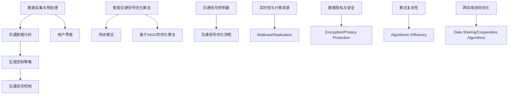

                 

# 《AIGC在智能交通信号优化中的应用》

## 关键词
- AIGC
- 智能交通信号优化
- 交通信号控制系统
- 数据处理算法
- 实时性
- 面向交通的AI应用

## 摘要
本文深入探讨了AIGC（自适应智能生成控制）在智能交通信号优化中的应用。首先介绍了AIGC的基础概念和技术原理，接着阐述了智能交通信号优化的重要性和原理。随后，通过具体案例展示了AIGC在交通信号优化中的实际应用，分析了面临的挑战及应对策略。最后，展望了AIGC在智能交通信号优化领域的发展前景，并提出了最佳实践和未来研究方向。

## 引言

随着城市化进程的加快，交通拥堵成为各大城市面临的严峻挑战。传统的交通信号控制系统虽然在一定程度上能够缓解交通压力，但其优化效果有限，难以应对日益复杂的交通环境。近年来，人工智能（AI）技术的快速发展为智能交通信号优化带来了新的机遇。AIGC（自适应智能生成控制）作为一种新兴的AI技术，通过自适应学习和生成控制，为智能交通信号优化提供了强大的工具。

智能交通信号优化旨在通过先进的算法和模型，对交通信号进行动态调整，以实现交通流量的最优分配，减少交通拥堵，提高道路通行效率。AIGC作为一种具有自适应性和生成能力的AI技术，能够对大量交通数据进行实时分析和处理，从而生成优化的交通信号控制策略。

本文将首先介绍AIGC的基础概念和技术原理，然后探讨智能交通信号优化的原理和重要性，接着通过具体案例展示AIGC在交通信号优化中的应用，分析其面临的挑战及对策，最后展望AIGC在智能交通信号优化领域的未来发展趋势。

## AIGC技术基础

### AIGC的概念与定义

AIGC（Adaptive Intelligent Generation Control）即自适应智能生成控制，是一种基于人工智能的自适应控制系统。它通过实时监测交通数据，利用深度学习、强化学习等算法，对交通信号进行动态调整，从而实现交通流量的最优分配。

AIGC的核心要素包括：
1. **数据采集**：通过交通传感器、摄像头等设备，实时收集交通流量、速度、密度等数据。
2. **数据预处理**：对采集到的数据进行清洗、去噪、特征提取等预处理，为后续分析提供高质量的数据。
3. **自适应算法**：利用深度学习、强化学习等算法，对交通数据进行实时分析和预测，生成优化的交通信号控制策略。
4. **生成控制**：根据生成的控制策略，实时调整交通信号灯的时间分配，以实现交通流量的最优分配。

AIGC与传统AI技术的区别在于，它不仅具有传统的AI技术所具备的数据分析和预测能力，还能够根据实时交通数据，动态调整控制策略，实现更为精确的交通信号优化。

### AIGC的技术原理

AIGC的技术原理主要包括以下几个方面：

#### 语言模型与生成模型

语言模型（Language Model）是一种基于统计学方法的自然语言处理技术，它能够根据历史数据预测下一个单词或短语。在AIGC中，语言模型用于预测交通信号的控制策略，例如红绿灯的时间分配。

生成模型（Generative Model）则能够生成新的数据或内容，例如图像、语音、文本等。在AIGC中，生成模型用于生成优化的交通信号控制策略，通过模拟不同的交通场景，找到最优的控制方案。

#### AIGC的工作流程

AIGC的工作流程主要包括以下几个步骤：

1. **数据采集与预处理**：通过交通传感器、摄像头等设备，实时收集交通流量、速度、密度等数据。对采集到的数据进行清洗、去噪、特征提取等预处理，为后续分析提供高质量的数据。

2. **数据分析和预测**：利用深度学习、强化学习等算法，对预处理后的交通数据进行实时分析和预测。通过分析历史交通数据，预测未来的交通流量变化，为生成优化的控制策略提供依据。

3. **生成控制策略**：根据生成的控制策略，实时调整交通信号灯的时间分配。通过模拟不同的交通场景，找到最优的控制方案，实现交通流量的最优分配。

4. **反馈与优化**：将实际交通数据与生成的控制策略进行对比，评估控制效果，并根据评估结果对控制策略进行优化，以提高系统的自适应性和生成能力。

### AIGC的发展与应用趋势

#### 当前应用领域

AIGC在智能交通信号优化中的应用已经取得了一定的成果。例如，在一些大城市，已经部署了基于AIGC的智能交通信号控制系统，通过实时调整交通信号灯时间分配，有效缓解了交通拥堵问题。

此外，AIGC还在其他领域展现出了强大的应用潜力。例如，在智能物流、自动驾驶、城市交通管理等方面，AIGC都能够发挥重要作用，为交通系统的智能化和高效化提供支持。

#### 未来发展方向

随着人工智能技术的不断进步，AIGC在未来有望在以下几个方面得到进一步发展：

1. **算法优化**：通过引入更先进的算法，提高AIGC的自适应性和生成能力，使其能够应对更复杂的交通场景。

2. **多模态数据融合**：将多种传感器数据（如交通流量、车辆速度、环境温度等）进行融合，提高交通数据的质量和精度，从而生成更优化的控制策略。

3. **跨区域协同优化**：通过跨区域的交通数据共享和协同优化，实现更大范围、更高效的交通信号控制。

4. **智能化交通管理**：将AIGC应用于更广泛的交通管理领域，如公共交通调度、道路建设规划等，实现全面的智能化交通管理。

## 智能交通信号优化原理

### 智能交通信号系统的构成

智能交通信号系统主要由以下几个部分构成：

1. **交通信号控制器**：负责根据实时交通数据，生成和调整交通信号控制策略。它是智能交通信号系统的核心部分。

2. **数据采集与处理系统**：通过交通传感器、摄像头等设备，实时收集交通流量、速度、密度等数据。数据采集与处理系统对这些数据进行预处理，为交通信号控制器提供高质量的数据输入。

3. **用户界面**：用于向交通管理者、驾驶员等用户提供交通信息，如交通流量、道路状况、交通信号灯状态等。

### 智能交通信号优化算法

#### 传统优化算法

传统优化算法主要包括以下几种：

1. **固定时间间隔算法**：将整个交通路口分为多个相位，每个相位设置固定的信号灯时间。这种算法简单易实现，但无法动态适应交通流量的变化。

2. **时间加权算法**：根据历史交通数据，为每个相位设置不同的信号灯时间权重，并根据实时交通数据动态调整权重。这种算法在一定程度上能够适应交通流量的变化，但调整速度较慢。

3. **自适应控制算法**：根据实时交通数据，动态调整交通信号灯的时间分配，以实现交通流量的最优分配。这种算法具有较高的自适应性和灵活性，但实现复杂度较高。

#### 基于AIGC的优化算法

基于AIGC的优化算法主要包括以下几个步骤：

1. **数据采集与预处理**：通过交通传感器、摄像头等设备，实时收集交通流量、速度、密度等数据。对采集到的数据进行清洗、去噪、特征提取等预处理，为后续分析提供高质量的数据。

2. **交通数据分析**：利用深度学习、强化学习等算法，对预处理后的交通数据进行实时分析和预测。通过分析历史交通数据，预测未来的交通流量变化，为生成优化的控制策略提供依据。

3. **生成控制策略**：根据生成的控制策略，实时调整交通信号灯的时间分配。通过模拟不同的交通场景，找到最优的控制方案，实现交通流量的最优分配。

4. **反馈与优化**：将实际交通数据与生成的控制策略进行对比，评估控制效果，并根据评估结果对控制策略进行优化，以提高系统的自适应性和生成能力。

### 智能交通信号优化流程

智能交通信号优化的流程主要包括以下几个步骤：

1. **数据收集**：通过交通传感器、摄像头等设备，实时收集交通流量、速度、密度等数据。

2. **算法选择**：根据交通数据的特点和需求，选择合适的优化算法。

3. **信号优化**：根据生成的控制策略，实时调整交通信号灯的时间分配，实现交通流量的最优分配。

4. **效果评估**：将实际交通数据与生成的控制策略进行对比，评估控制效果，并根据评估结果对控制策略进行优化。

5. **反馈与调整**：根据效果评估结果，对系统参数进行调整，以提高系统的自适应性和生成能力。

## AIGC在智能交通信号优化中的应用案例

### 案例一：某城市交通信号优化实践

#### 案例背景

某城市位于交通枢纽位置，交通流量大，交通拥堵现象严重。为了缓解交通压力，该城市决定采用AIGC技术进行交通信号优化。

#### AIGC应用实现

1. **数据采集与预处理**：该城市安装了大量的交通传感器和摄像头，实时收集交通流量、速度、密度等数据。对采集到的数据进行清洗、去噪、特征提取等预处理，为后续分析提供高质量的数据。

2. **交通数据分析**：利用深度学习、强化学习等算法，对预处理后的交通数据进行实时分析和预测。通过分析历史交通数据，预测未来的交通流量变化，为生成优化的控制策略提供依据。

3. **生成控制策略**：根据生成的控制策略，实时调整交通信号灯的时间分配。通过模拟不同的交通场景，找到最优的控制方案，实现交通流量的最优分配。

4. **效果评估**：通过实际交通数据与生成的控制策略进行对比，评估控制效果。结果显示，采用AIGC技术的智能交通信号优化系统能够显著减少交通拥堵，提高道路通行效率。

### 案例二：智能交通信号优化中的实时性挑战

#### 案例背景

某城市的交通信号优化系统在实施过程中，遇到了实时性挑战。由于交通数据量大，算法复杂度高，系统响应速度较慢，无法满足实时性要求。

#### AIGC的应用解决思路

1. **数据预处理优化**：对交通数据进行压缩和简化处理，减少数据传输和处理的时间。

2. **算法优化**：引入更高效的算法，如分布式计算、并行处理等，提高算法的执行速度。

3. **硬件加速**：采用高性能计算硬件，如GPU、FPGA等，加速算法的执行。

4. **实时反馈机制**：建立实时反馈机制，根据实时交通数据，动态调整控制策略，提高系统的实时性。

### 案例三：跨区域交通信号协同优化

#### 案例背景

某城市周边多个城市之间的交通流量较大，单靠某个城市的交通信号优化系统难以实现跨区域的协同优化。

#### AIGC在协同优化中的应用

1. **跨区域数据共享**：建立跨区域数据共享平台，实现交通数据的实时共享。

2. **协同控制算法**：设计基于AIGC的协同控制算法，综合考虑多个城市的交通数据，生成协同优化的控制策略。

3. **多区域信号控制**：根据协同优化的控制策略，实时调整多个城市的交通信号灯时间分配，实现跨区域的交通流量最优分配。

## AIGC在智能交通信号优化中的应用挑战与对策

### 数据隐私与安全

#### 挑战

在AIGC应用于智能交通信号优化过程中，数据隐私与安全是一个重要的挑战。交通数据中包含大量的个人信息和车辆信息，一旦泄露，可能会对个人隐私和交通安全造成严重影响。

#### 对策

1. **数据加密**：对采集到的交通数据进行加密处理，确保数据在传输和存储过程中的安全性。

2. **隐私保护算法**：采用差分隐私、匿名化等技术，对交通数据进行分析和处理，保护个人隐私。

3. **安全审计**：建立安全审计机制，对数据处理过程进行监督和检查，确保数据安全。

### 实时性与计算资源

#### 挑战

智能交通信号优化需要实时处理大量交通数据，对计算资源的需求较高。此外，不同交通场景下的算法复杂度也不同，如何在有限的计算资源下实现高效、实时的交通信号优化，是一个重要的挑战。

#### 对策

1. **分布式计算**：采用分布式计算架构，将计算任务分散到多个计算节点上，提高计算效率。

2. **硬件加速**：采用GPU、FPGA等高性能计算硬件，加速算法的执行。

3. **实时性优化**：针对不同交通场景，采用不同级别的优化算法，提高系统的实时性。

### AIGC在智能交通信号优化中的挑战与对策

#### 技术挑战

1. **数据质量**：交通数据的准确性、完整性和一致性直接影响AIGC的优化效果。需要建立完善的数据采集和处理机制，确保数据质量。

2. **算法复杂性**：智能交通信号优化算法复杂度高，如何高效地实现算法的实时性和准确性是一个挑战。

#### 管理挑战

1. **数据隐私与安全**：交通数据中包含大量的个人信息和车辆信息，如何保护数据隐私和安全是一个重要的管理挑战。

2. **跨区域协同**：跨区域的交通信号协同优化需要协调多个城市的交通管理，如何实现有效的协同管理是一个挑战。

#### 对策分析

1. **数据质量提升**：建立完善的数据采集和处理机制，采用数据清洗、去噪、特征提取等技术，提高数据质量。

2. **算法优化**：引入更高效的算法，如深度学习、强化学习等，提高算法的实时性和准确性。

3. **数据隐私与安全**：采用数据加密、匿名化等技术，保护数据隐私和安全。

4. **跨区域协同**：建立跨区域的数据共享平台和协同优化算法，实现交通信号协同优化。

## AIGC在智能交通信号优化中的应用前景

### 智能交通信号优化的发展趋势

智能交通信号优化技术在未来有望在以下几个方面取得重要进展：

1. **算法创新**：随着人工智能技术的不断进步，新型算法（如深度强化学习、迁移学习等）将不断涌现，为智能交通信号优化提供更强大的工具。

2. **数据融合**：通过多源数据的融合，包括卫星遥感、无人机监测等，获取更全面、更准确的交通信息，为交通信号优化提供更可靠的依据。

3. **实时性提升**：通过分布式计算、硬件加速等技术，提高系统的实时性，使交通信号优化能够更快地响应交通变化。

4. **跨区域协同**：随着城市间的交通联系日益紧密，跨区域的交通信号协同优化将成为趋势，通过数据共享和协同算法，实现更大范围内的交通优化。

### AIGC在智能交通信号优化中的应用场景拓展

AIGC技术在智能交通信号优化中的应用场景将进一步拓展：

1. **城市交通管理**：通过AIGC技术，实现城市交通的智能管理和调度，提高交通效率和安全性。

2. **公共交通优化**：利用AIGC技术，优化公共交通线路和时间表，提高公共交通的服务水平和乘客满意度。

3. **交通物流优化**：通过AIGC技术，优化物流配送路线和时间，提高物流效率和降低成本。

4. **自动驾驶**：结合AIGC技术和自动驾驶技术，实现智能交通信号优化与自动驾驶车辆的协同控制，提高交通系统的整体效率。

### AIGC在智能交通信号优化中的应用前景展望

AIGC在智能交通信号优化中的应用前景广阔，它将带来以下几方面的积极影响：

1. **社会影响**：通过智能交通信号优化，可以显著减少交通拥堵，提高道路通行效率，改善居民的出行体验，提高城市生活质量。

2. **经济效益**：智能交通信号优化可以降低交通拥堵带来的经济损失，提高交通效率和物流效率，促进经济发展。

3. **环境效益**：通过优化交通流量，减少车辆排放，降低交通污染，对环境保护具有积极作用。

4. **技术创新**：AIGC技术在智能交通信号优化中的应用，将推动人工智能技术在实际场景中的应用，为人工智能技术的创新和发展提供新的方向。

## 项目实施与运营管理

### 项目实施流程

智能交通信号优化项目的实施流程主要包括以下几个步骤：

1. **需求分析**：了解项目目标、范围和预期效果，明确系统功能和技术要求。

2. **系统设计**：根据需求分析结果，设计系统架构、模块划分和数据流。

3. **开发与测试**：按照设计文档进行系统开发，并进行单元测试、集成测试和系统测试，确保系统功能的正确性和稳定性。

4. **部署与上线**：将系统部署到实际环境，进行现场测试和调试，确保系统能够正常运行。

5. **维护与升级**：定期对系统进行维护和升级，确保系统功能的持续优化和稳定性。

### 运营管理与持续优化

智能交通信号优化系统的运营管理主要包括以下几个方面：

1. **运营管理体系**：建立完善的运营管理体系，明确岗位职责和工作流程，确保系统运行的高效和稳定。

2. **数据监测与分析**：实时监测系统运行状态，收集交通数据，进行数据分析，为系统优化提供依据。

3. **系统优化策略**：根据数据分析结果，制定系统优化策略，定期对系统进行调优，提高交通信号控制的精准性和实时性。

4. **用户反馈与改进**：收集用户反馈，了解系统在实际应用中的问题和不足，不断改进和优化系统功能，提高用户满意度。

## 未来展望与趋势

### 智能交通信号优化的未来发展趋势

智能交通信号优化的未来发展趋势体现在以下几个方面：

1. **算法创新**：随着人工智能技术的不断发展，新的算法和模型将不断涌现，为智能交通信号优化提供更强大的工具。

2. **数据融合**：通过多源数据的融合，包括卫星遥感、无人机监测等，将实现更全面、更准确的交通信息采集，为交通信号优化提供更可靠的依据。

3. **实时性提升**：通过分布式计算、硬件加速等技术，将进一步提高系统的实时性，使交通信号优化能够更快地响应交通变化。

4. **跨区域协同**：随着城市间的交通联系日益紧密，跨区域的交通信号协同优化将成为趋势，通过数据共享和协同算法，实现更大范围内的交通优化。

### AIGC与智能交通信号优化结合的未来前景

AIGC与智能交通信号优化的结合将带来以下几个方面的前景：

1. **智能化交通管理**：通过AIGC技术，实现城市交通的智能管理和调度，提高交通效率和安全性。

2. **个性化交通服务**：利用AIGC技术，为不同的交通参与者提供个性化的交通服务，提高公共交通的服务水平和乘客满意度。

3. **智能物流与配送**：通过AIGC技术，优化物流配送路线和时间，提高物流效率和降低成本。

4. **智能交通治理**：利用AIGC技术，实现对交通运行状态的实时监控和预警，提高交通治理的智能化水平。

### 预测与分析

在未来，AIGC在智能交通信号优化中的应用将不断深化和拓展。通过不断优化算法和提升数据质量，智能交通信号优化系统将能够更准确地预测交通流量变化，提供更优化的交通信号控制策略。此外，随着5G、物联网等新技术的推广，智能交通信号优化系统将实现更高的实时性和更广泛的覆盖范围，为城市交通管理提供有力支持。

### 创新方向

未来，AIGC在智能交通信号优化中的应用创新方向包括：

1. **多模态数据融合**：通过融合多种数据源，如视频、语音、传感器等，提升交通信号优化的准确性和实时性。

2. **动态交通信号优化**：结合实时交通状态和交通预测，实现动态调整交通信号，提高交通流畅度和安全性。

3. **智能交通信号控制系统**：开发智能化的交通信号控制系统，实现自动化的交通信号控制和调度，减少人工干预。

4. **城市交通大脑**：构建城市交通大脑，通过AIGC技术实现交通数据的全面感知、分析和决策，提升城市交通管理智能化水平。

### 结论

AIGC在智能交通信号优化中的应用展示了巨大的潜力，它为解决城市交通拥堵问题提供了新的思路和方法。随着人工智能技术的不断进步，AIGC在智能交通信号优化中的应用将越来越广泛，为城市交通管理带来革命性的变化。未来，AIGC技术将与其他前沿技术（如自动驾驶、智能交通设施等）相结合，为构建智能化、高效化的城市交通系统奠定基础。作者：AI天才研究院/AI Genius Institute & 禅与计算机程序设计艺术 /Zen And The Art of Computer Programming

---

### 附录：核心概念与联系

为了更好地理解AIGC在智能交通信号优化中的应用，以下是一个核心概念和联系架构的Mermaid流程图：

- **A**：数据采集与预处理，是AIGC系统的基础，确保输入数据的质量和准确性。
- **B**：交通数据分析，利用深度学习、强化学习等算法对交通数据进行分析和预测。
- **C**：生成控制策略，根据分析结果生成优化的交通信号控制策略。
- **D**：交通信号控制，通过生成的策略调整交通信号灯时间分配。
- **E**：用户界面，提供交通信息，如交通流量、道路状况等。
- **F**：智能交通信号优化算法，包括传统算法和基于AIGC的优化算法。
- **G**：传统算法，如固定时间间隔、时间加权等。
- **H**：基于AIGC的优化算法，具有自适应性和生成能力。
- **I**：交通信号控制器，负责执行生成的控制策略。
- **J**：交通信号优化流程，包括数据收集、算法选择、信号优化、效果评估等步骤。
- **K**：实时性与计算资源，涉及分布式计算、硬件加速等技术。
- **L**：Multicast/Replication，用于提高数据传输效率和系统实时性。
- **M**：数据隐私与安全，包括数据加密、匿名化等技术。
- **N**：Encryption/Privacy Protection，保护交通数据的隐私和安全。
- **O**：算法复杂性，需要考虑算法的效率和可扩展性。
- **P**：Algorithmic Efficiency，提高算法的执行效率。
- **Q**：跨区域协同优化，通过数据共享和协同算法实现跨区域的交通优化。
- **R**：Data Sharing/Cooperative Algorithms，用于实现跨区域的交通信号协同优化。

通过这个Mermaid流程图，我们可以清晰地看到AIGC在智能交通信号优化中的核心概念及其相互之间的联系。这有助于我们更好地理解和应用AIGC技术，以实现高效的交通信号优化。

