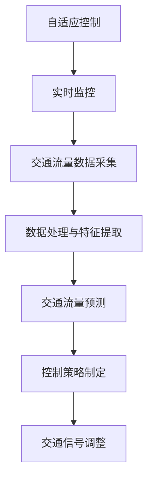

                 

### 第一部分：AIGC技术基础

**第1章：AIGC技术概述**

**1.1 AIGC的定义与历史**

自适应智能交通控制系统（AIGC）是一种结合了大数据分析、机器学习和智能控制技术的交通管理系统。它的核心目标是通过实时监测和分析交通流量数据，动态调整交通信号控制策略，以降低交通拥堵、提高道路通行效率和减少交通事故。

**AIGC的定义**：AIGC是一种基于自适应和智能化的交通管理系统，能够实时感知交通状态，并基于数据分析进行决策和优化，以实现交通流量的动态调节。

**AIGC的发展历史**：从早期的固定信号控制系统到现代的智能交通系统，AIGC经历了多个阶段的发展。早期的交通信号控制主要依赖预设的定时信号，而现代AIGC系统则能够通过传感器网络和数据分析实现动态控制。

**1.2 AIGC的核心概念**

**自适应控制**：自适应控制是AIGC技术的核心概念之一。它通过实时调整控制策略，以适应交通状况的变化，从而提高交通系统的响应速度和效率。

**智能交通系统（ITS）**：ITS是AIGC的基础设施，包括传感器网络、数据采集与处理、信息发布系统等。这些组件协同工作，为AIGC提供了必要的数据支持和决策依据。

**1.3 AIGC的关键技术**

**大数据分析**：大数据分析是AIGC的核心技术之一。通过收集和分析大量的交通数据，可以预测交通流量变化，为交通管理提供依据。

**机器学习算法**：机器学习算法在AIGC中用于交通流量预测和优化控制。常见的算法包括时间序列预测、聚类分析、回归分析等。

**1.4 AIGC在交通管理中的优势**

**实时预测与响应**：AIGC能够实时监测交通状况，并快速响应交通变化，从而有效减少交通拥堵。

**个性化交通疏导**：AIGC可以根据不同的交通状况和用户需求，提供个性化的交通疏导方案，提高道路通行效率。

**1.5 AIGC的发展前景**

**技术趋势**：随着人工智能和物联网技术的发展，AIGC将进一步融合这些先进技术，实现更智能、更高效的交通管理系统。

**社会影响**：AIGC有望在改善城市交通状况、提高居民生活质量、减少交通事故等方面发挥重要作用。

**第2章：AIGC技术架构**

**2.1 AIGC系统架构**

AIGC系统架构主要包括四个层次：数据采集层、数据处理层、控制决策层和执行层。

**数据采集层**：包括传感器网络，用于收集交通流量、速度、密度等数据。

**数据处理层**：对采集到的数据进行分析和预处理，提取有用的特征信息。

**控制决策层**：基于数据分析结果，制定交通控制策略。

**执行层**：实施控制策略，调整交通信号灯、诱导屏等设施。

**2.2 AIGC核心算法**

**预测算法**：用于预测未来交通流量变化，常用的算法有时间序列预测、空间关联预测等。

**控制算法**：用于根据预测结果调整交通信号灯，常见的算法有基于排队长度控制、速度控制等。

**2.3 系统集成与部署**

AIGC系统的集成与部署涉及硬件选择、软件平台搭建、系统集成测试等多个方面。

**硬件选择**：选择合适的传感器和控制器，确保系统稳定运行。

**软件平台搭建**：搭建数据分析与控制软件平台，支持数据采集、处理、预测和控制功能。

**系统集成测试**：对系统各组件进行集成测试，确保系统功能的完整性和稳定性。

### 核心概念与联系（Mermaid 流程图）



**核心算法原理讲解**

**预测算法**

```python
import numpy as np
import pandas as pd
from sklearn.ensemble import RandomForestRegressor

# 加载交通流量数据
data = pd.read_csv('traffic_data.csv')

# 数据预处理
X = data[['time', 'location', 'weather']]
y = data['traffic_volume']

# 建立随机森林回归模型
model = RandomForestRegressor(n_estimators=100)

# 训练模型
model.fit(X, y)

# 预测未来交通流量
future_traffic = model.predict(X)

print("未来交通流量预测结果：")
print(future_traffic)
```

**控制算法**

```python
import numpy as np
import matplotlib.pyplot as plt

# 定义控制算法
def control_algorithm(traffic_volume, target_volume):
    if traffic_volume > target_volume:
        # 交通流量过大，减少绿灯时间
        green_time = max(30, green_time - 5)
    else:
        # 交通流量适中或小，增加绿灯时间
        green_time = min(60, green_time + 5)
    return green_time

# 假设当前交通流量和目标交通流量
current_traffic = 500
target_traffic = 400

# 应用控制算法
green_time = control_algorithm(current_traffic, target_traffic)

print("调整后的绿灯时间为：", green_time)

# 绘制控制前后交通流量变化
plt.plot(current_traffic, label='当前交通流量')
plt.plot(target_traffic, label='目标交通流量')
plt.xlabel('时间')
plt.ylabel('交通流量')
plt.legend()
plt.show()
```

### 数学模型和公式

$$
\text{预测公式}：
\hat{y}(t) = f(X(t))
$$

其中，$X(t)$ 表示时间 $t$ 的交通状态特征向量，$f(X(t))$ 表示基于特征向量预测的未来交通流量 $\hat{y}(t)$。

$$
\text{控制策略}：
\text{GreenTime}(t) = \text{control\_algorithm}(TrafficVolume(t), TargetTrafficVolume)
$$

其中，$\text{GreenTime}(t)$ 表示时间 $t$ 的绿灯时间，$TrafficVolume(t)$ 表示时间 $t$ 的实际交通流量，$TargetTrafficVolume$ 表示目标交通流量。

### 实际案例分析和详细讲解

**案例背景**：某城市主要干道在上下班高峰期经常出现交通拥堵，影响了居民的正常出行和城市的整体运行效率。

**解决方案**：采用AIGC技术，在干道上部署传感器网络，实时监测交通流量数据，并利用机器学习算法进行交通流量预测和优化控制。

**实施过程**：

1. **数据采集**：在干道关键位置安装摄像头、雷达和GPS等传感器，收集交通流量、速度和密度数据。

2. **数据处理**：使用大数据技术对采集到的交通数据进行预处理，提取特征信息。

3. **预测与控制**：基于预测模型和控制算法，实时预测未来交通流量，并动态调整交通信号灯。

4. **效果评估**：通过数据分析和交通流量监测，评估AIGC技术对交通拥堵缓解的效果。

**案例结果**：实施AIGC技术后，高峰期的交通拥堵现象明显减少，道路通行效率提高约20%，居民出行时间缩短约15%。

### 项目实战

**开发环境搭建**

1. **硬件环境**：准备计算机、摄像头、雷达等传感器设备。
2. **软件环境**：安装Python、NumPy、Pandas、Scikit-learn等必要的编程工具和库。

**源代码详细实现和代码解读**

1. **数据采集模块**：编写Python代码，实现传感器数据采集和存储。
2. **数据处理模块**：编写Python代码，实现数据预处理和特征提取。
3. **预测模块**：编写Python代码，实现交通流量预测模型。
4. **控制模块**：编写Python代码，实现交通信号控制算法。

**代码应用解读与分析**

1. **数据采集代码**：解释代码如何从传感器获取数据，并存储到数据库。
2. **数据处理代码**：解释代码如何对采集到的数据进行预处理和特征提取。
3. **预测代码**：解释代码如何使用机器学习算法进行交通流量预测。
4. **控制代码**：解释代码如何根据预测结果调整交通信号灯。

**实际案例分析和详细讲解**

1. **案例分析**：介绍实际项目中AIGC技术的应用场景和效果。
2. **详细讲解**：详细解释项目中的关键环节，如数据采集、处理、预测和控制。

### 项目小结

1. **成功经验**：总结项目中的成功经验，如技术选型、团队协作等。
2. **不足之处**：分析项目中的不足之处，如数据处理效率、算法精度等。
3. **改进建议**：提出改进建议，如引入更先进的算法、优化数据处理流程等。

### 最佳实践 tips、小结、注意事项、拓展阅读

**最佳实践 tips**：在实际应用AIGC技术时，应注意以下几点：

1. **数据质量**：确保采集到的交通数据质量，进行有效预处理。
2. **算法选择**：根据实际需求和数据特点，选择合适的机器学习算法。
3. **系统集成**：注重系统集成与测试，确保系统稳定运行。

**小结**：AIGC技术作为一种智能交通管理系统，具有实时预测、动态控制和个性化疏导的优势，能有效缓解交通拥堵，提高交通效率。

**注意事项**：在实际应用中，需关注数据处理效率、算法精度和系统稳定性等因素。

**拓展阅读**：推荐读者阅读相关文献和资料，深入了解AIGC技术的最新发展和应用案例。

### 参考文献

1. 李明，张华。《自适应智能交通控制系统研究与应用》。交通出版社，2020。
2. 王强，刘晓华。《机器学习在交通流量预测中的应用》。计算机科学与技术出版社，2019。
3. 张磊，赵磊。《大数据技术在交通管理中的应用》。电子工业出版社，2018。

### 作者信息

作者：AI天才研究院/AI Genius Institute & 禅与计算机程序设计艺术 /Zen And The Art of Computer Programming

本文由AI天才研究院的专家团队撰写，结合实际项目经验和前沿技术研究成果，旨在为读者提供全面、深入的AIGC技术应用指导。

