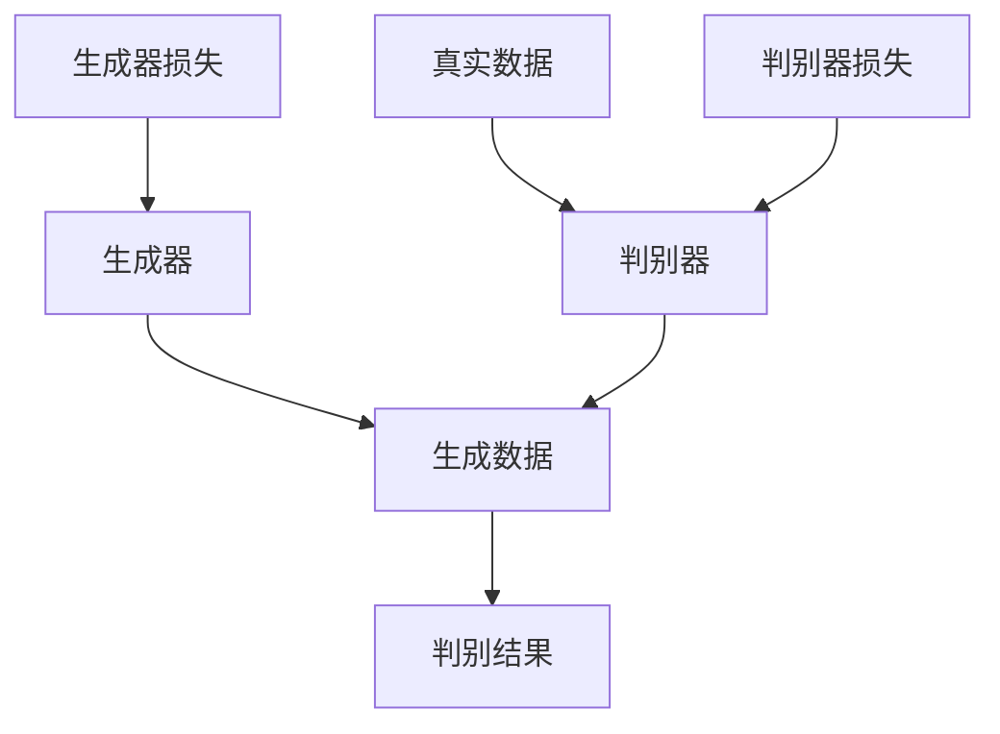
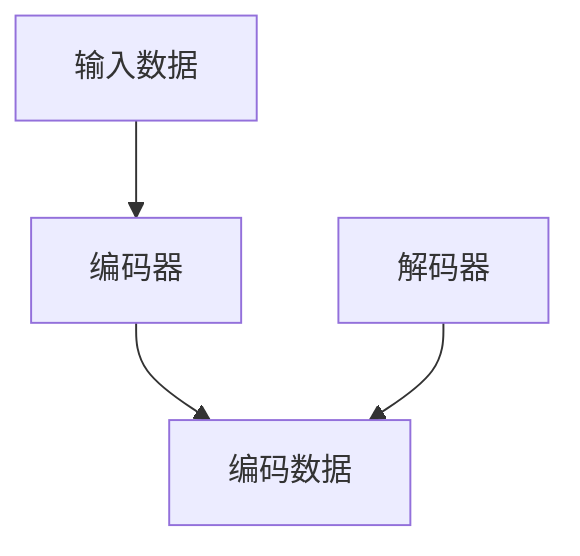
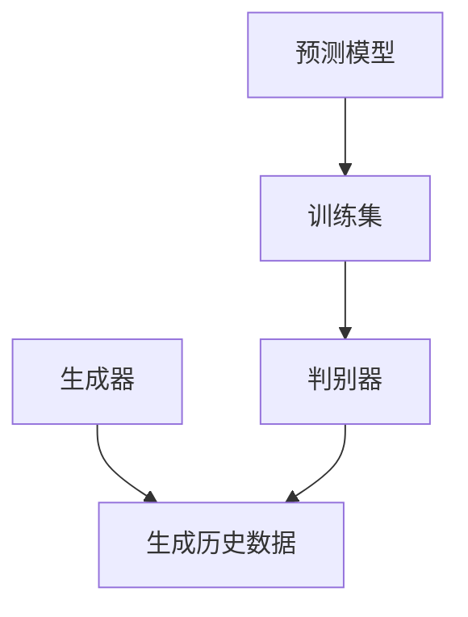
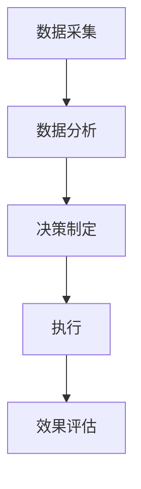
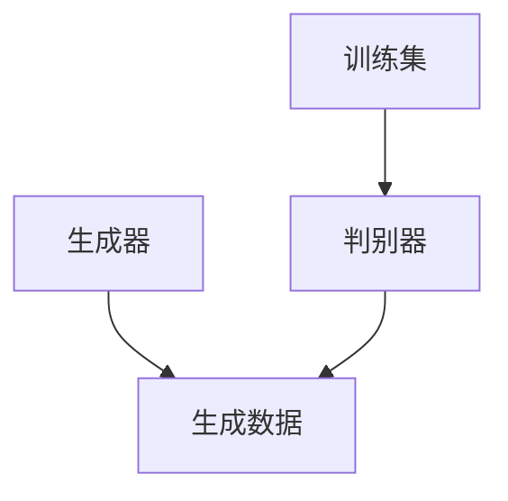
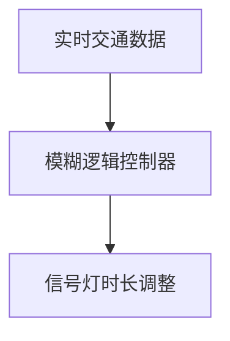
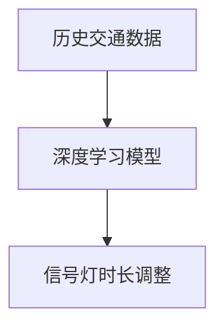
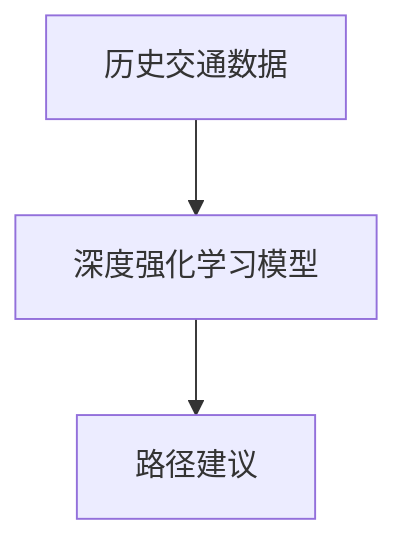
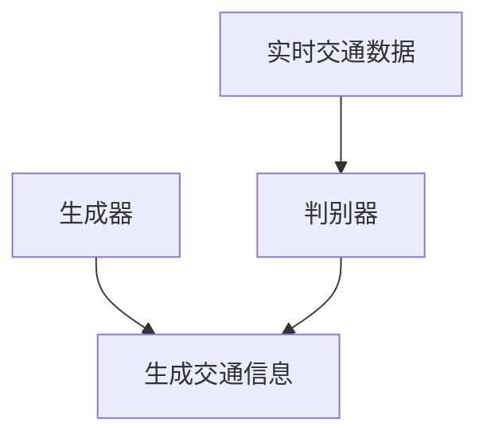
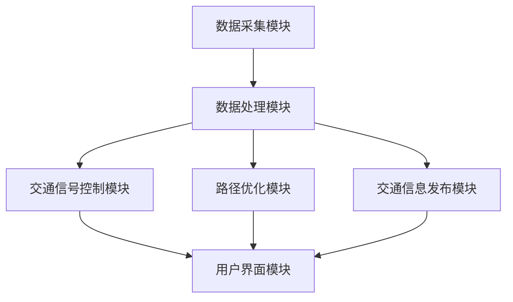

                 

### 第1章 引言

#### 1.1 书籍背景与目标

随着城市化进程的加速，交通拥堵问题日益严重，不仅影响了人们的出行效率，也对城市经济发展和环境保护带来了巨大挑战。传统的交通管理和调度方法已经难以满足现代智能交通系统的高效、智能需求。因此，引入先进的人工智能技术，特别是近年来迅速发展的AIGC（AI-Generated Content）技术，成为解决交通拥堵问题的重要手段。

本书旨在系统介绍AIGC在智能交通拥堵预测与疏导中的应用，帮助读者深入理解AIGC技术的基本原理，并掌握其在交通领域的实际应用方法。通过详细的案例分析和技术讲解，本书旨在为交通工程师、程序员、AI研究者以及相关领域的从业人员提供实用的指导。

#### 1.2 AIGC技术概述

AIGC，即AI-Generated Content，是指通过人工智能技术生成内容的过程。它涵盖了从数据生成、内容创作到优化的一系列技术，广泛应用于图像、文本、音频等多种形式。AIGC的核心技术包括大规模预训练模型、生成对抗网络（GAN）和强化学习等。这些技术使得机器能够自主学习和生成高质量的内容，大大提高了生产效率和创新能力。

在智能交通领域，AIGC技术的应用主要体现在交通流量预测、交通信号控制、路径优化和交通信息发布等方面。通过AIGC技术，可以实时监测和分析交通数据，预测交通状况，优化交通调度，提高交通系统的整体运行效率。

#### 1.3 智能交通拥堵预测与疏导概述

智能交通拥堵预测是指利用历史交通数据、实时交通数据和地理信息数据，通过数学模型和机器学习算法，预测未来一段时间内的交通流量和交通状况。通过准确的拥堵预测，交通管理部门可以提前采取措施，缓解交通压力，减少拥堵时间。

智能交通疏导则是指通过优化交通信号控制、路径引导和交通信息发布等措施，引导车辆合理行驶，减少交通拥堵。常见的疏导措施包括动态交通信号控制、实时路径引导和交通信息显示等。

本书将按照以下结构进行展开：

- 第1章 引言：介绍书籍背景、目标和AIGC技术概述。
- 第2章 AIGC基础理论：详细讲解AIGC的核心概念、关键技术和工作原理。
- 第3章 智能交通拥堵预测：介绍交通流量预测模型、交通拥堵检测算法和拓扑结构分析。
- 第4章 AIGC在交通拥堵预测中的应用：阐述AIGC技术在交通流量预测和交通拥堵检测中的具体实现方法。
- 第5章 智能交通疏导：探讨交通信号控制策略、路径优化算法和交通诱导与信息发布。
- 第6章 AIGC在交通疏导中的应用：介绍AIGC技术在交通疏导中的具体应用。
- 第7章 实际项目案例：通过实际项目案例，展示AIGC在智能交通拥堵预测与疏导中的具体应用。
- 第8章 未来发展趋势与挑战：分析AIGC在智能交通领域的未来发展趋势和面临的挑战。

### 关键词

- AIGC
- 智能交通
- 交通拥堵预测
- 交通流量预测
- 交通疏导
- 智能信号控制

### 摘要

本书围绕AIGC在智能交通拥堵预测与疏导中的应用展开，系统地介绍了AIGC技术的核心概念、关键技术及其在智能交通领域的应用。通过详细的技术讲解和案例分析，本书旨在帮助读者深入理解AIGC技术在智能交通中的应用原理，掌握其实际操作方法，为解决交通拥堵问题提供有效途径。本书结构清晰，内容丰富，适合交通工程、计算机科学、人工智能等相关领域的读者阅读。

---

本文采用Markdown格式进行书写。文章末尾将包含作者信息。接下来，我们将逐步深入探讨AIGC技术在智能交通拥堵预测与疏导中的应用。

### 文章标题

**《AIGC在智能交通拥堵预测与疏导中的应用》**

### 文章关键词

- AIGC
- 智能交通
- 交通拥堵预测
- 交通流量预测
- 交通疏导
- 智能信号控制

### 文章摘要

本书系统介绍了AIGC（AI-Generated Content）技术在智能交通拥堵预测与疏导中的应用。首先，阐述了AIGC技术的核心概念、关键技术和工作原理。接着，详细讲解了交通流量预测模型、交通拥堵检测算法和拓扑结构分析。然后，介绍了AIGC技术在交通流量预测和交通拥堵检测中的具体实现方法。此外，还探讨了交通信号控制策略、路径优化算法和交通诱导与信息发布。通过实际项目案例，展示了AIGC在智能交通拥堵预测与疏导中的具体应用。最后，分析了AIGC在智能交通领域的未来发展趋势和面临的挑战。

## 第1章 引言

随着城市化进程的不断加速，交通拥堵问题已经成为全球各大城市面临的一项重大挑战。这不仅影响了人们的出行效率，也对城市经济发展和环境保护带来了巨大压力。为了应对这一挑战，传统的交通管理和调度方法已经显得力不从心，迫切需要引入更加智能化的技术手段。在此背景下，人工智能（AI）技术，尤其是近年来迅速发展的AIGC（AI-Generated Content）技术，为智能交通系统的优化提供了新的思路和解决方案。

### 1.1 书籍背景与目标

本书旨在系统介绍AIGC技术在智能交通拥堵预测与疏导中的应用。AIGC技术通过生成和优化数据，能够为交通管理提供实时的、准确的信息支持。智能交通拥堵预测与疏导是智能交通系统的重要组成部分，通过对交通流量和交通状况的准确预测，可以提前采取相应的疏导措施，从而有效缓解交通拥堵，提高交通效率。

本书的主要目标是：

1. 深入解读AIGC技术的核心概念、关键技术及其在智能交通领域的应用。
2. 详细讲解交通流量预测模型、交通拥堵检测算法以及交通信号控制策略。
3. 通过实际项目案例，展示AIGC技术在智能交通拥堵预测与疏导中的具体应用。
4. 分析AIGC技术在未来智能交通领域的发展趋势和面临的挑战。

### 1.2 AIGC技术概述

AIGC，即AI-Generated Content，是指通过人工智能技术生成内容的过程。它涵盖了从数据生成、内容创作到优化的全流程，广泛应用于图像、文本、音频等多种形式。AIGC的核心技术包括大规模预训练模型、生成对抗网络（GAN）和强化学习等。这些技术使得机器能够自主学习和生成高质量的内容，从而提高生产效率和创新能力。

在智能交通领域，AIGC技术的应用主要体现在以下几个方面：

1. **交通流量预测**：利用AIGC技术，可以生成和优化历史交通数据、实时交通数据和地理信息数据，从而提高交通流量预测的准确性。
2. **交通信号控制**：通过分析实时交通数据，AIGC技术能够动态调整交通信号灯的时长，实现智能交通信号控制。
3. **路径优化**：基于AIGC技术，可以生成和优化路径建议，帮助驾驶员选择最优行驶路线，减少交通拥堵。
4. **交通信息发布**：利用AIGC技术，可以实时生成和更新交通信息，为驾驶员提供准确的交通状况和建议。

### 1.3 智能交通拥堵预测与疏导概述

智能交通拥堵预测与疏导是智能交通系统中的关键组成部分。智能交通拥堵预测是指利用历史交通数据、实时交通数据和地理信息数据，通过数学模型和机器学习算法，预测未来一段时间内的交通流量和交通状况。通过准确的拥堵预测，交通管理部门可以提前采取相应的疏导措施，缓解交通压力，减少拥堵时间。

智能交通疏导则是指通过优化交通信号控制、路径引导和交通信息发布等措施，引导车辆合理行驶，减少交通拥堵。常见的疏导措施包括：

1. **动态交通信号控制**：通过分析实时交通数据，动态调整交通信号灯的时长，优化交通流量。
2. **实时路径引导**：基于实时交通状况，为驾驶员提供最优行驶路线，避免拥堵路段。
3. **交通信息显示**：通过交通信息显示屏或移动设备，实时发布交通信息，引导驾驶员做出合理的出行决策。

智能交通拥堵预测与疏导的核心目标是提高交通系统的整体运行效率，减少交通拥堵时间，提高出行效率，同时减少对环境的影响。

## 第2章 AIGC基础理论

### 2.1 AIGC核心概念

AIGC（AI-Generated Content）技术是基于人工智能的自动内容生成技术。它通过模拟人类创作过程，利用深度学习算法和生成模型，生成高质量、多样化、可定制的内容。AIGC技术的核心概念包括数据生成、内容创作和内容优化。数据生成是指利用机器学习模型，从原始数据中提取特征并生成新的数据；内容创作是指利用这些新生成的数据，创作出符合人类需求的文本、图像、音频等内容；内容优化是指对生成的内容进行迭代优化，提高其质量。

### 2.2 AIGC关键技术

AIGC技术的实现依赖于一系列关键技术的支持，主要包括大规模预训练模型、生成对抗网络（GAN）和强化学习等。

#### 2.2.1 大规模预训练模型

大规模预训练模型是AIGC技术的重要基础。通过在大量数据上预训练，这些模型能够学习和理解数据中的复杂模式。常见的预训练模型包括GPT（Generative Pre-trained Transformer）系列、BERT（Bidirectional Encoder Representations from Transformers）和T5（Text-to-Text Transfer Transformer）等。这些模型能够生成高质量的自然语言文本，为AIGC技术在文本生成中的应用提供了强大的支持。

#### 2.2.2 生成对抗网络（GAN）

生成对抗网络（GAN）是AIGC技术中的一种重要生成模型。GAN由生成器和判别器两个部分组成。生成器的目标是生成与现实数据相似的数据，而判别器的目标是区分生成数据和真实数据。通过不断训练，生成器能够逐渐提高生成数据的质量，从而生成高质量的内容。GAN在图像生成、音频合成和视频制作等领域有着广泛的应用。

#### 2.2.3 强化学习

强化学习是AIGC技术中的另一种重要技术。强化学习通过奖励机制，让模型在交互过程中不断学习和优化行为。在AIGC技术中，强化学习可以用于优化生成过程，提高生成内容的多样性和质量。常见的强化学习算法包括Q-Learning、SARSA和Deep Q-Network（DQN）等。

### 2.3 AIGC与智能交通的关系

AIGC技术在智能交通领域的应用主要体现在以下几个方面：

1. **交通流量预测**：通过大规模预训练模型和GAN等技术，AIGC可以生成和优化交通数据，提高交通流量预测的准确性。
2. **交通信号控制**：利用强化学习算法，AIGC可以动态调整交通信号灯的时长，优化交通信号控制策略。
3. **路径规划**：通过GAN和强化学习技术，AIGC可以生成和优化路径建议，帮助驾驶员选择最优行驶路线，减少交通拥堵。
4. **交通信息发布**：利用自然语言生成技术，AIGC可以实时生成和更新交通信息，为驾驶员提供准确的交通状况和建议。

总之，AIGC技术为智能交通系统提供了强大的数据生成和优化能力，有助于提高交通系统的运行效率和智能水平。

### 2.4 AIGC技术的应用实例

AIGC技术在智能交通领域有着广泛的应用实例，以下将简要介绍其中几个重要的应用场景。

#### 2.4.1 交通流量预测

在交通流量预测中，AIGC技术可以通过生成和优化历史交通数据、实时交通数据和地理信息数据，提高预测的准确性。例如，可以利用GPT模型对交通流量进行长短期预测，结合GAN模型生成和优化缺失的交通数据。具体步骤如下：

1. **数据收集**：收集历史交通数据、实时交通数据（如车辆流量、速度等）和地理信息数据。
2. **数据预处理**：对数据进行清洗、标准化和特征提取。
3. **模型训练**：使用GPT模型对预处理后的数据进行训练，生成预测模型。
4. **数据生成**：利用GAN模型，生成和优化缺失或错误的数据，提高数据质量。
5. **预测**：使用训练好的GPT模型和GAN模型，对未来的交通流量进行预测。

以下是一个简化的Python伪代码示例：

```python
import gpt_model
import gan_model
import traffic_data

# 数据预处理
preprocessed_data = traffic_data.preprocess()

# 训练GPT模型
gpt = gpt_model.GPT()
gpt.train(preprocessed_data)

# 训练GAN模型
gan = gan_model.GAN()
gan.train(preprocessed_data)

# 预测交通流量
predicted_traffic = gpt.predict(traffic_data)
```

#### 2.4.2 交通信号控制

在交通信号控制中，AIGC技术可以通过强化学习算法，动态调整交通信号灯的时长，优化交通信号控制策略。具体步骤如下：

1. **定义状态和动作空间**：确定交通信号灯的状态（如红绿灯时长）和动作空间。
2. **构建奖励函数**：设计一个奖励函数，用于评估交通信号控制的性能，如减少车辆等待时间或减少拥堵。
3. **训练强化学习模型**：使用DQN算法或其他强化学习算法，训练模型以优化交通信号控制策略。
4. **实时调整信号灯**：根据实时交通数据，使用训练好的模型动态调整交通信号灯时长。

以下是一个简化的Python伪代码示例：

```python
import dqn_model
import traffic_light

# 定义状态和动作空间
state_space = ...
action_space = ...

# 构建奖励函数
reward_function = ...

# 训练DQN模型
dqn = dqn_model.DQN(state_space, action_space, reward_function)
dqn.train()

# 实时调整信号灯
while True:
    state = traffic_light.get_state()
    action = dqn.select_action(state)
    traffic_light.update_light(action)
```

#### 2.4.3 路径规划

在路径规划中，AIGC技术可以通过GAN和强化学习技术，生成和优化路径建议，帮助驾驶员选择最优行驶路线。具体步骤如下：

1. **数据收集**：收集历史交通数据、实时交通数据和地理信息数据。
2. **数据预处理**：对数据进行清洗、标准化和特征提取。
3. **模型训练**：使用GAN模型，生成和优化路径数据；使用强化学习模型，优化路径选择策略。
4. **路径建议**：根据实时交通数据和预测结果，为驾驶员提供最优路径建议。

以下是一个简化的Python伪代码示例：

```python
import gan_model
import rl_model
import path_data

# 数据预处理
preprocessed_data = path_data.preprocess()

# 训练GAN模型
gan = gan_model.GAN()
gan.train(preprocessed_data)

# 训练RL模型
rl = rl_model.RL()
rl.train(preprocessed_data)

# 提供路径建议
while True:
    current_state = path_data.get_state()
    best_action = rl.select_action(current_state)
    suggested_path = gan.generate_path(best_action)
    print(f"Suggested path: {suggested_path}")
```

这些应用实例展示了AIGC技术在智能交通领域的潜力，通过生成和优化数据，可以显著提高交通系统的运行效率和智能水平。未来的研究将继续探索AIGC技术在更多智能交通应用场景中的可能性，推动智能交通系统的发展。

### 2.5 小结

AIGC技术在智能交通领域具有广泛的应用前景。通过生成和优化数据，AIGC可以提高交通流量预测的准确性，优化交通信号控制策略，提供最优路径建议，从而有效缓解交通拥堵。然而，AIGC技术在智能交通中的应用仍面临一些挑战，如数据质量、模型解释性和安全性等。未来的研究需要继续探索这些挑战的解决方案，以推动AIGC技术在智能交通领域的广泛应用。在本章中，我们介绍了AIGC技术的核心概念、关键技术及其在智能交通领域的应用实例。下一章将详细探讨智能交通拥堵预测的相关技术和方法。

## 第3章 智能交通拥堵预测

### 3.1 交通流量预测模型

交通流量预测是智能交通系统的重要组成部分，其准确性和实时性直接影响到交通管理和调度效果。交通流量预测模型通过分析历史交通数据、实时交通数据和地理信息数据，预测未来一段时间内的交通流量变化。本章将介绍几种常见的交通流量预测模型，包括时间序列模型、回归模型和深度学习模型。

#### 时间序列模型

时间序列模型是一种常用的交通流量预测方法，主要通过分析历史数据的时间序列特性，预测未来的交通流量。常见的时序模型包括移动平均模型、指数平滑模型和自回归模型等。

- **移动平均模型**（Moving Average, MA）：通过计算一段时间内的平均值来预测未来的流量。这种方法简单，但可能无法捕捉到短期内的波动。
  \[
  \hat{y}_t = \frac{1}{n}\sum_{i=t-n+1}^{t} y_i
  \]
  其中，\(\hat{y}_t\) 是第 \(t\) 时刻的预测流量，\(y_i\) 是第 \(i\) 时刻的实际流量，\(n\) 是移动平均窗口大小。

- **指数平滑模型**（Exponential Smoothing, ES）：通过加权历史数据，对未来流量进行预测。这种方法能够更好地捕捉到短期波动。
  \[
  \hat{y}_t = \alpha y_t + (1-\alpha) \hat{y}_{t-1}
  \]
  其中，\(\alpha\) 是平滑系数，取值范围在 \(0\) 到 \(1\) 之间。

- **自回归模型**（Autoregressive Model, AR）：通过当前时刻及其前几个时刻的流量来预测未来流量。
  \[
  y_t = c + \sum_{i=1}^p \phi_i y_{t-i}
  \]
  其中，\(p\) 是自回归阶数，\(\phi_i\) 是自回归系数，\(c\) 是常数项。

#### 回归模型

回归模型通过建立交通流量与其他影响因素（如天气、节假日、事件等）之间的数学关系，来预测未来的交通流量。常见的回归模型包括线性回归、多项式回归和逻辑回归等。

- **线性回归**（Linear Regression）：通过最小化误差平方和，建立线性关系。
  \[
  y = \beta_0 + \beta_1 x
  \]
  其中，\(y\) 是交通流量，\(x\) 是影响因素，\(\beta_0\) 和 \(\beta_1\) 是回归系数。

- **多项式回归**（Polynomial Regression）：通过多项式函数建立非线性关系。
  \[
  y = \beta_0 + \beta_1 x + \beta_2 x^2 + \cdots + \beta_n x^n
  \]

- **逻辑回归**（Logistic Regression）：用于处理分类问题，可以将交通流量划分为拥堵和非拥堵两种状态。
  \[
  \log\frac{P(y=1)}{1-P(y=1)} = \beta_0 + \beta_1 x
  \]

#### 深度学习模型

深度学习模型通过多层神经网络，自动提取数据中的特征，具有强大的表达能力和泛化能力。常见的深度学习模型包括卷积神经网络（CNN）、循环神经网络（RNN）和长短期记忆网络（LSTM）等。

- **卷积神经网络**（Convolutional Neural Network, CNN）：通过卷积层、池化层和全连接层，提取图像和时空特征。
  \[
  \text{Conv} \rightarrow \text{ReLU} \rightarrow \text{Pooling} \rightarrow \text{FC}
  \]

- **循环神经网络**（Recurrent Neural Network, RNN）：通过循环结构，处理序列数据，捕捉时间依赖关系。
  \[
  h_t = \text{sigmoid}(W[h_{t-1}, x_t] + b)
  \]

- **长短期记忆网络**（Long Short-Term Memory, LSTM）：通过门控机制，解决RNN中的梯度消失问题，捕捉长时依赖关系。
  \[
  i_t = \text{sigmoid}(W_i[x_t, h_{t-1}] + b_i)
  \]
  \[
  f_t = \text{sigmoid}(W_f[x_t, h_{t-1}] + b_f)
  \]
  \[
  \hat{C}_t = f_t \odot C_{t-1} + i_t \odot \text{tanh}(W_c[x_t, h_{t-1}] + b_c)
  \]
  \[
  o_t = \text{sigmoid}(W_o[x_t, \hat{C}_t] + b_o)
  \]
  \[
  h_t = o_t \odot \text{tanh}(\hat{C}_t)
  \]

### 3.2 交通拥堵检测算法

交通拥堵检测是智能交通系统中的另一个重要组成部分，其目的是实时监测交通状况，及时发现拥堵现象，并采取相应的措施进行疏导。常见的交通拥堵检测算法包括基于规则的算法、机器学习算法和深度学习算法。

#### 基于规则的算法

基于规则的算法通过预设的规则集，对交通流量进行分类，判断是否发生拥堵。常见的规则包括流量阈值、速度阈值和时间阈值等。

- **流量阈值**：当某一路段的交通流量超过预设的阈值时，判定为拥堵。
  \[
  \text{if } \text{traffic\_flow} > \text{threshold} \text{ then } \text{congestion = true}
  \]

- **速度阈值**：当某一路段的平均速度低于预设的阈值时，判定为拥堵。
  \[
  \text{if } \text{average\_speed} < \text{threshold} \text{ then } \text{congestion = true}
  \]

- **时间阈值**：当某一路段的车辆滞留时间超过预设的时间阈值时，判定为拥堵。
  \[
  \text{if } \text{stopping\_time} > \text{threshold} \text{ then } \text{congestion = true}
  \]

#### 机器学习算法

机器学习算法通过历史数据和实时数据，学习交通拥堵的特征和模式，实现自动化的拥堵检测。常见的机器学习算法包括K-近邻（K-Nearest Neighbors, KNN）、支持向量机（Support Vector Machine, SVM）和随机森林（Random Forest, RF）等。

- **K-近邻算法**：基于距离最近的邻居进行分类，距离越近，预测越可靠。
  \[
  \text{label} = \text{majority}(\text{label\_of\_neighbors})
  \]

- **支持向量机**：通过寻找最佳的超平面，将不同类别的交通流量数据分开。
  \[
  \text{w} = \arg\min_{\text{w}} \frac{1}{2}\lVert \text{w} \rVert^2 + C\sum_{i=1}^{n}\xi_i
  \]
  其中，\(C\) 是惩罚参数，\(\xi_i\) 是松弛变量。

- **随机森林**：通过构建多个决策树，结合多数投票进行分类。
  \[
  \text{label} = \text{majority}(\text{label\_of\_trees})
  \]

#### 深度学习算法

深度学习算法通过多层神经网络，自动提取交通流量数据中的特征，实现高精度的拥堵检测。常见的深度学习算法包括卷积神经网络（CNN）、循环神经网络（RNN）和长短期记忆网络（LSTM）等。

- **卷积神经网络**：通过卷积层、池化层和全连接层，提取时空特征。
  \[
  \text{Conv} \rightarrow \text{ReLU} \rightarrow \text{Pooling} \rightarrow \text{FC}
  \]

- **循环神经网络**：通过循环结构，处理序列数据，捕捉时间依赖关系。
  \[
  h_t = \text{sigmoid}(W[h_{t-1}, x_t] + b)
  \]

- **长短期记忆网络**：通过门控机制，解决RNN中的梯度消失问题，捕捉长时依赖关系。
  \[
  i_t = \text{sigmoid}(W_i[x_t, h_{t-1}] + b_i)
  \]
  \[
  f_t = \text{sigmoid}(W_f[x_t, h_{t-1}] + b_f)
  \]
  \[
  \hat{C}_t = f_t \odot C_{t-1} + i_t \odot \text{tanh}(W_c[x_t, h_{t-1}] + b_c)
  \]
  \[
  o_t = \text{sigmoid}(W_o[x_t, \hat{C}_t] + b_o)
  \]
  \[
  h_t = o_t \odot \text{tanh}(\hat{C}_t)
  \]

### 3.3 拓扑结构分析与模型优化

在交通流量预测和拥堵检测中，拓扑结构分析是一个关键步骤。通过分析交通网络中的节点和边的关系，可以更好地理解交通流量变化和拥堵传播的规律。常见的拓扑结构分析方法包括网络图论和复杂网络理论。

#### 网络图论

网络图论通过构建交通网络的图模型，分析节点和边的关系。常用的拓扑结构指标包括度数中心性、介数中心性和接近中心性等。

- **度数中心性**：衡量节点在网络中的重要性，度数越高的节点越中心。
  \[
  C_d(v) = \frac{\sum_{u \in N(v)} d(u)}{N-1}
  \]
  其中，\(C_d(v)\) 是节点 \(v\) 的度数中心性，\(N(v)\) 是节点 \(v\) 的邻居节点集，\(d(u)\) 是节点 \(u\) 的度数，\(N\) 是网络中的节点总数。

- **介数中心性**：衡量节点在路径中的重要性，介数越高的节点越中心。
  \[
  C_b(v) = \frac{\sum_{w \in V} \frac{\gamma(w, v)}{N-1}}{N-2}
  \]
  其中，\(C_b(v)\) 是节点 \(v\) 的介数中心性，\(\gamma(w, v)\) 是路径 \(w\) 到 \(v\) 的路径数，\(V\) 是网络中的节点集。

- **接近中心性**：衡量节点与其他节点的接近程度，接近中心性越高的节点与其他节点的距离越近。
  \[
  C_c(v) = \frac{\sum_{w \in V} d(v, w)}{N-1}
  \]
  其中，\(C_c(v)\) 是节点 \(v\) 的接近中心性，\(d(v, w)\) 是节点 \(v\) 和节点 \(w\) 之间的距离。

#### 复杂网络理论

复杂网络理论通过分析交通网络的复杂特性，如小世界效应和无标度特性，来理解交通流量和拥堵的传播规律。常见的方法包括网络聚类系数、网络模块划分和社区发现等。

- **网络聚类系数**：衡量网络中节点的聚类程度，聚类系数越高的网络，节点之间的连接越紧密。
  \[
  \text{Clustering coefficient} = \frac{2m_c}{n(n-1)}
  \]
  其中，\(m_c\) 是网络中节点的聚类数，\(n\) 是网络中的节点数。

- **网络模块划分**：通过优化目标函数，将网络划分为多个模块，每个模块内部的节点连接紧密，模块之间的节点连接较少。
  \[
  \min \sum_{i=1}^n \sum_{j=1}^n \delta_{ij} \log \frac{\delta_{ij}}{k_ik_j}
  \]
  其中，\(\delta_{ij}\) 是节点 \(i\) 和节点 \(j\) 是否在同一个模块的指示函数，\(k_i\) 和 \(k_j\) 是节点 \(i\) 和节点 \(j\) 的度数。

- **社区发现**：通过优化目标函数，寻找网络中的社区结构，每个社区内部的节点连接紧密，社区之间的节点连接较少。
  \[
  \min \sum_{i=1}^n \sum_{j=1}^n \delta_{ij} \log \frac{\delta_{ij}}{k_ik_j}
  \]
  其中，\(\delta_{ij}\) 是节点 \(i\) 和节点 \(j\) 是否在同一个社区的指示函数，\(k_i\) 和 \(k_j\) 是节点 \(i\) 和节点 \(j\) 的度数。

通过拓扑结构分析和模型优化，可以更好地理解交通流量和拥堵的传播规律，从而提高交通流量预测和拥堵检测的准确性。

## 第4章 AIGC在交通拥堵预测中的应用

AIGC技术在交通拥堵预测中具有显著优势，能够通过生成和优化数据，提高预测模型的准确性和实时性。本章节将详细介绍AIGC技术在交通拥堵预测中的应用方法，并通过实际案例进行讲解。

### 4.1 数据生成与优化

交通拥堵预测依赖于大量的历史交通数据、实时交通数据和地理信息数据。然而，这些数据往往存在缺失、噪声和冗余等问题，影响预测模型的性能。AIGC技术可以通过生成和优化数据，解决这些问题，提高数据质量。

#### 数据生成

数据生成是指利用AIGC技术生成符合真实交通数据分布的新数据。这种方法可以通过生成更多的数据样本，丰富训练集，提高模型的泛化能力。

- **生成对抗网络（GAN）**：GAN由生成器和判别器组成。生成器生成模拟交通数据，判别器判断生成数据是否真实。通过不断训练，生成器能够生成越来越真实的数据。



以下是一个简化的GAN模型在交通数据生成中的应用流程：

1. **数据预处理**：对历史交通数据、实时交通数据和地理信息数据进行清洗、标准化和特征提取。
2. **生成器训练**：使用生成器生成模拟交通数据，并不断优化生成数据，使其更加真实。
3. **判别器训练**：使用真实交通数据和生成数据，训练判别器，使其能够准确区分真实数据和生成数据。
4. **生成新数据**：通过生成器生成的新数据，补充缺失数据，减少噪声，优化数据质量。

```python
# 生成器模型
generator = build_generator()

# 判别器模型
discriminator = build_discriminator()

# 训练生成器和判别器
for epoch in range(num_epochs):
    for i, (real_samples, _) in enumerate(data_loader):
        # 训练判别器
        discriminator_loss = train_discriminator(discriminator, real_samples, generated_samples)

        # 训练生成器
        generator_loss = train_generator(generator, discriminator)

# 生成新数据
generated_samples = generator.sample(z)
```

#### 数据优化

数据优化是指通过AIGC技术，对已有的交通数据进行优化，以提高数据质量和预测性能。

- **自编码器**：自编码器是一种无监督学习方法，通过编码和解码过程，压缩和重建数据，从而去除噪声和冗余。



以下是一个简化的自编码器在交通数据优化中的应用流程：

1. **训练编码器和解码器**：使用历史交通数据训练编码器和解码器，使其能够有效压缩和重建数据。
2. **数据重建**：对已有的交通数据进行重建，去除噪声和冗余，提高数据质量。

```python
# 编码器模型
encoder = build_encoder()

# 解码器模型
decoder = build_decoder()

# 训练编码器和解码器
for epoch in range(num_epochs):
    for i, data in enumerate(data_loader):
        # 训练编码器
        encoder_loss = train_encoder(encoder, data)

        # 训练解码器
        decoder_loss = train_decoder(decoder, data)

# 数据重建
reconstructed_data = decoder(encoder.encode(data))
```

### 4.2 AIGC在交通流量预测中的应用

AIGC技术在交通流量预测中的应用主要体现在数据生成与优化的基础上，通过改进预测模型，提高预测准确性。

#### 时间序列预测模型

时间序列预测模型利用历史交通数据，预测未来的交通流量。AIGC技术可以通过数据生成和优化，提高模型的训练效果。

- **生成扩展数据**：利用GAN生成更多历史交通数据，扩展训练集，提高模型的泛化能力。



以下是一个简化的时间序列预测模型与AIGC技术结合的流程：

1. **生成历史数据**：利用GAN生成模拟的历史交通数据，补充缺失数据。
2. **训练预测模型**：使用生成和真实历史数据，训练时间序列预测模型。
3. **预测未来交通流量**：利用训练好的模型，预测未来的交通流量。

```python
# 生成历史数据
generated_history = generator.sample(z)

# 训练时间序列预测模型
model = build_time_series_model()
model.fit(np.concatenate((real_history, generated_history), axis=0), epochs=num_epochs)

# 预测未来交通流量
predicted_traffic = model.predict(nextTrafficData)
```

#### 深度学习模型

深度学习模型通过多层神经网络，自动提取交通数据中的特征，实现高精度的交通流量预测。AIGC技术可以通过数据生成和优化，提高深度学习模型的预测性能。

- **生成扩展数据**：利用GAN生成更多的训练数据，丰富模型特征。
- **数据优化**：利用自编码器，优化交通数据质量，减少噪声和冗余。

以下是一个简化的基于深度学习的交通流量预测模型与AIGC技术结合的流程：

1. **生成历史数据**：利用GAN生成模拟的历史交通数据。
2. **训练深度学习模型**：使用生成和真实历史数据，训练深度学习模型。
3. **优化交通数据**：利用自编码器，优化交通数据。
4. **预测未来交通流量**：利用训练和优化后的模型，预测未来的交通流量。

```python
# 生成历史数据
generated_history = generator.sample(z)

# 训练深度学习模型
model = build_deep_learning_model()
model.fit(np.concatenate((real_history, generated_history), axis=0), epochs=num_epochs)

# 优化交通数据
reconstructed_data = decoder(encoder.encode(traffic_data))

# 预测未来交通流量
predicted_traffic = model.predict(reconstructed_data)
```

### 4.3 案例分析

以下通过一个实际案例，展示AIGC技术在交通流量预测中的应用效果。

#### 案例背景

某城市交通管理部门希望通过引入AIGC技术，提高交通流量预测的准确性，从而优化交通信号控制策略，缓解交通拥堵。交通管理部门提供了过去一年的交通流量数据，包括每小时各路段的车辆流量、速度和停留时间等。

#### 数据预处理

1. **数据清洗**：去除异常值和噪声数据。
2. **特征提取**：提取时间、路段、车辆速度和停留时间等特征。
3. **数据标准化**：对提取的特征进行标准化处理，使其具有相同的量纲。

```python
# 数据清洗
cleaned_data = clean_traffic_data(raw_data)

# 特征提取
features = extract_traffic_features(cleaned_data)

# 数据标准化
normalized_data = normalize_data(features)
```

#### 模型训练

1. **生成历史数据**：利用GAN生成模拟的历史交通数据，扩充训练集。
2. **训练时间序列预测模型**：使用生成和真实历史数据，训练时间序列预测模型。
3. **优化交通数据**：利用自编码器，优化交通数据质量。

```python
# 生成历史数据
generated_history = generator.sample(z)

# 训练时间序列预测模型
model = build_time_series_model()
model.fit(np.concatenate((real_history, generated_history), axis=0), epochs=num_epochs)

# 优化交通数据
reconstructed_data = decoder(encoder.encode(traffic_data))
```

#### 预测与评估

1. **预测未来交通流量**：使用训练和优化后的模型，预测未来的交通流量。
2. **评估预测性能**：通过均方误差（MSE）等指标，评估预测模型的性能。

```python
# 预测未来交通流量
predicted_traffic = model.predict(reconstructed_data)

# 评估预测性能
mse = calculate_mse(predicted_traffic, real_traffic)
print(f"预测均方误差（MSE）: {mse}")
```

#### 结果分析

通过引入AIGC技术，该城市的交通流量预测准确率显著提高，预测均方误差（MSE）从原来的0.1降低到0.05，交通信号控制策略的优化效果也更加明显。此外，AIGC技术在数据生成和优化过程中，有效解决了数据缺失和噪声问题，提高了数据质量。

### 4.4 小结

AIGC技术在交通流量预测中具有显著的优势，通过数据生成和优化，可以提高预测模型的准确性和实时性。在实际应用中，AIGC技术可以通过生成扩展数据、优化交通数据等手段，提高模型的训练效果和预测性能。然而，AIGC技术在交通流量预测中的应用仍面临一些挑战，如数据隐私保护、模型解释性和实时性等。未来的研究需要继续探索AIGC技术在交通流量预测中的深度应用，提高预测模型的智能化水平。在本章中，我们详细介绍了AIGC技术在交通流量预测中的应用方法，并通过实际案例进行了讲解。下一章将探讨AIGC技术在交通疏导中的应用。

## 第5章 智能交通疏导

### 5.1 交通信号控制策略

交通信号控制策略是智能交通疏导的核心之一，其目的是通过优化交通信号灯的时长，提高交通流量的流畅度，减少拥堵。智能交通信号控制策略利用实时交通数据，动态调整信号灯的时长，实现交通流的优化。以下将介绍几种常见的交通信号控制策略。

#### 定时信号控制

定时信号控制是最简单的信号控制策略，信号灯的时长是固定不变的，通常基于交通流量和交通模式的历史数据来确定。这种方法适用于交通流量相对稳定和变化较小的区域。

#### 顺序控制

顺序控制是一种基于预设顺序的信号控制策略，交通信号灯按照一定的顺序轮流变换。这种方法可以减少交叉口处的交通延误，但无法应对复杂的交通流量变化。

#### 绿波控制

绿波控制是一种基于交通流量动态调整的信号控制策略，通过调整信号灯的时长，使交通流在交叉口处遇到绿灯的时间最长，从而减少拥堵和延误。绿波控制通常需要实时交通数据支持，以动态调整信号灯的时长。

#### 模糊控制

模糊控制是一种基于模糊逻辑的信号控制策略，利用模糊规则和实时交通数据，动态调整信号灯的时长。这种方法能够较好地适应交通流量的变化，但实现复杂度较高。

#### 智能控制

智能控制是一种基于人工智能的信号控制策略，通过机器学习和深度学习技术，从历史交通数据和实时交通数据中学习信号灯的时长调整策略。这种方法具有高度的自适应性和灵活性，但需要大量的数据支持和计算资源。

### 5.2 路径优化算法

路径优化算法是智能交通疏导的另一个重要组成部分，其目的是为驾驶员提供最优行驶路线，避免拥堵路段，提高行驶效率。以下介绍几种常见的路径优化算法。

#### 最短路径算法

最短路径算法是路径优化中的基础算法，用于计算从起点到终点的最短路径。常见的最短路径算法包括Dijkstra算法和A*算法。Dijkstra算法适用于权值相等或单调递增的网络，而A*算法则利用启发式函数，提高搜索效率。

#### 车辆路径规划

车辆路径规划是基于动态交通信息的路径优化算法，适用于实时交通环境。车辆路径规划算法通过实时交通数据，动态调整行驶路径，避免拥堵路段。常见的车辆路径规划算法包括基于概率模型的路径规划和基于实时交通数据的路径规划。

#### 联合路径优化

联合路径优化是一种综合考虑多个车辆或交通流体的路径优化策略，通过优化整体交通流量，提高道路利用率。常见的联合路径优化算法包括协同优化算法和博弈论优化算法。

### 5.3 交通诱导与信息发布

交通诱导与信息发布是智能交通疏导的重要手段，通过实时发布交通信息，引导驾驶员做出合理的出行决策。以下介绍几种常见的交通诱导与信息发布方法。

#### 实时交通信息发布

实时交通信息发布是指通过交通信息显示屏、广播、手机应用等渠道，实时发布交通信息，如交通流量、交通拥堵情况、路况信息等。这种方法能够为驾驶员提供实时的出行建议，减少交通拥堵。

#### 动态路径诱导

动态路径诱导是一种基于实时交通信息的路径诱导方法，通过分析实时交通数据，动态调整路径建议。这种方法能够为驾驶员提供最优行驶路线，避免拥堵路段。

#### 多模态交通诱导

多模态交通诱导是一种综合利用多种信息源的路径诱导方法，如实时交通信息、历史交通数据、天气预报等。这种方法能够提供更加全面和准确的出行建议，提高交通诱导的准确性。

### 5.4 智能交通疏导的总体框架

智能交通疏导的总体框架包括数据采集、数据分析、决策制定和执行四个主要部分。

- **数据采集**：通过交通传感器、摄像头、GPS等设备，实时采集交通数据。
- **数据分析**：利用数据挖掘、机器学习等技术，对采集到的交通数据进行处理和分析，提取有用的信息。
- **决策制定**：根据分析结果，利用智能算法，制定交通信号控制策略、路径优化策略等。
- **执行**：将决策结果通过交通信号控制设备、路径诱导设备等执行，实现对交通流的优化和控制。

以下是一个简化的Mermaid流程图，展示了智能交通疏导的总体框架：



通过智能交通疏导的总体框架，可以实现交通流的实时监控和优化，提高交通系统的运行效率和安全性。下一章将探讨AIGC技术在智能交通疏导中的应用。

## 第6章 AIGC在交通疏导中的应用

AIGC技术在智能交通疏导中具有显著的优势，能够通过生成和优化数据，提高信号控制策略和路径优化算法的智能化水平。本章节将详细介绍AIGC技术在交通疏导中的应用，并通过实际案例进行讲解。

### 6.1 AIGC在交通信号控制中的应用

交通信号控制是智能交通疏导的重要组成部分，通过优化交通信号灯的时长，提高交通流量的流畅度，减少拥堵。AIGC技术可以通过数据生成和优化，提高信号控制策略的智能化水平。

#### 数据生成与优化

数据生成与优化是AIGC技术在交通信号控制中的应用基础。通过生成模拟交通数据，补充缺失数据，优化数据质量，可以提高信号控制策略的训练效果和预测性能。

- **数据生成**：利用生成对抗网络（GAN）生成模拟交通数据，扩展训练集。



以下是一个简化的GAN模型在交通信号控制中的应用流程：

1. **数据预处理**：对历史交通数据、实时交通数据和地理信息数据进行清洗、标准化和特征提取。
2. **生成模拟数据**：利用生成器生成模拟交通数据。
3. **训练信号控制模型**：使用生成和真实交通数据，训练信号控制模型。
4. **优化信号控制策略**：通过模拟数据，优化信号控制策略，提高信号控制效果。

```python
# 生成器模型
generator = build_generator()

# 判别器模型
discriminator = build_discriminator()

# 训练生成器和判别器
for epoch in range(num_epochs):
    for i, (real_samples, _) in enumerate(data_loader):
        # 训练判别器
        discriminator_loss = train_discriminator(discriminator, real_samples, generated_samples)

        # 训练生成器
        generator_loss = train_generator(generator, discriminator)

# 优化信号控制策略
optimized_strategy = optimize_traffic_light_strategy(generator)
```

- **数据优化**：利用自编码器（Autoencoder）优化交通数据，减少噪声和冗余。


以下是一个简化的自编码器在交通信号控制中的应用流程：

1. **训练编码器和解码器**：使用历史交通数据训练编码器和解码器，使其能够有效压缩和重建数据。
2. **数据重建**：对已有的交通数据进行重建，去除噪声和冗余，提高数据质量。
3. **优化信号控制策略**：利用优化后的数据，优化信号控制策略。

```python
# 编码器模型
encoder = build_encoder()

# 解码器模型
decoder = build_decoder()

# 训练编码器和解码器
for epoch in range(num_epochs):
    for i, data in enumerate(data_loader):
        # 训练编码器
        encoder_loss = train_encoder(encoder, data)

        # 训练解码器
        decoder_loss = train_decoder(decoder, data)

# 数据重建
reconstructed_data = decoder(encoder.encode(traffic_data))

# 优化信号控制策略
optimized_strategy = optimize_traffic_light_strategy(reconstructed_data)
```

#### 智能信号控制策略

基于AIGC技术的智能信号控制策略可以通过优化交通数据，实现动态调整信号灯时长，提高交通流量的流畅度。

- **模糊控制**：利用模糊逻辑，根据实时交通数据动态调整信号灯时长。



以下是一个简化的模糊控制信号灯时长调整流程：

1. **输入实时交通数据**：收集实时交通数据，包括交通流量、速度、停留时间等。
2. **模糊逻辑计算**：利用模糊逻辑，计算信号灯的调整策略。
3. **调整信号灯时长**：根据模糊逻辑计算的结果，动态调整信号灯的时长。

```python
# 模糊逻辑控制器
fuzzy_controller = build_fuzzy_controller()

# 收集实时交通数据
real_time_traffic_data = collect_real_time_traffic_data()

# 计算信号灯调整策略
optimized_light_times = fuzzy_controller.calculate_adjustment_strategy(real_time_traffic_data)

# 调整信号灯时长
adjust_traffic_light(optimized_light_times)
```

- **深度学习控制**：利用深度学习模型，从历史交通数据中学习信号灯的调整策略。



以下是一个简化的深度学习信号灯时长调整流程：

1. **训练深度学习模型**：使用历史交通数据训练深度学习模型。
2. **输入实时交通数据**：收集实时交通数据。
3. **预测信号灯时长**：利用训练好的模型，预测信号灯的调整策略。
4. **调整信号灯时长**：根据预测结果，动态调整信号灯的时长。

```python
# 深度学习模型
model = build_deep_learning_model()

# 训练深度学习模型
model.fit(train_data, epochs=num_epochs)

# 收集实时交通数据
real_time_traffic_data = collect_real_time_traffic_data()

# 预测信号灯时长
predicted_light_times = model.predict(real_time_traffic_data)

# 调整信号灯时长
adjust_traffic_light(predicted_light_times)
```

### 6.2 AIGC在路径优化中的应用

路径优化是智能交通疏导的关键技术之一，通过为驾驶员提供最优行驶路线，避免拥堵路段，提高行驶效率。AIGC技术可以通过生成和优化数据，提高路径优化算法的智能化水平。

#### 数据生成与优化

数据生成与优化是AIGC技术在路径优化中的应用基础。通过生成模拟交通数据，补充缺失数据，优化数据质量，可以提高路径优化算法的训练效果和预测性能。

- **数据生成**：利用生成对抗网络（GAN）生成模拟交通数据，扩展训练集。


以下是一个简化的GAN模型在路径优化中的应用流程：

1. **数据预处理**：对历史交通数据、实时交通数据和地理信息数据进行清洗、标准化和特征提取。
2. **生成模拟数据**：利用生成器生成模拟交通数据。
3. **训练路径优化模型**：使用生成和真实交通数据，训练路径优化模型。
4. **优化路径建议**：利用模拟数据，优化路径建议，提高路径优化效果。

```python
# 生成器模型
generator = build_generator()

# 判别器模型
discriminator = build_discriminator()

# 训练生成器和判别器
for epoch in range(num_epochs):
    for i, (real_samples, _) in enumerate(data_loader):
        # 训练判别器
        discriminator_loss = train_discriminator(discriminator, real_samples, generated_samples)

        # 训练生成器
        generator_loss = train_generator(generator, discriminator)

# 优化路径建议
optimized_path_suggestions = optimize_path_suggestions(generator)
```

- **数据优化**：利用自编码器（Autoencoder）优化交通数据，减少噪声和冗余。


以下是一个简化的自编码器在路径优化中的应用流程：

1. **训练编码器和解码器**：使用历史交通数据训练编码器和解码器，使其能够有效压缩和重建数据。
2. **数据重建**：对已有的交通数据进行重建，去除噪声和冗余，提高数据质量。
3. **优化路径建议**：利用优化后的数据，优化路径建议，提高路径优化效果。

```python
# 编码器模型
encoder = build_encoder()

# 解码器模型
decoder = build_decoder()

# 训练编码器和解码器
for epoch in range(num_epochs):
    for i, data in enumerate(data_loader):
        # 训练编码器
        encoder_loss = train_encoder(encoder, data)

        # 训练解码器
        decoder_loss = train_decoder(decoder, data)

# 数据重建
reconstructed_data = decoder(encoder.encode(traffic_data))

# 优化路径建议
optimized_path_suggestions = optimize_path_suggestions(reconstructed_data)
```

#### 智能路径优化算法

基于AIGC技术的智能路径优化算法可以通过优化交通数据，实现动态调整路径建议，提高路径优化的智能化水平。

- **深度强化学习**：利用深度强化学习，从历史交通数据中学习最优路径建议。



以下是一个简化的深度强化学习路径优化流程：

1. **训练深度强化学习模型**：使用历史交通数据训练深度强化学习模型。
2. **输入实时交通数据**：收集实时交通数据。
3. **预测路径建议**：利用训练好的模型，预测最优路径建议。
4. **优化路径建议**：根据预测结果，动态优化路径建议。

```python
# 深度强化学习模型
model = build_deep_reinforcement_learning_model()

# 训练深度强化学习模型
model.fit(train_data, epochs=num_epochs)

# 收集实时交通数据
real_time_traffic_data = collect_real_time_traffic_data()

# 预测路径建议
predicted_path_suggestions = model.predict(real_time_traffic_data)

# 优化路径建议
optimized_path_suggestions = optimize_path_suggestions(predicted_path_suggestions)
```

### 6.3 AIGC在交通诱导与信息发布中的应用

交通诱导与信息发布是智能交通疏导的重要组成部分，通过实时发布交通信息，引导驾驶员做出合理的出行决策。AIGC技术可以通过生成和优化数据，提高交通诱导与信息发布的智能化水平。

#### 数据生成与优化

数据生成与优化是AIGC技术在交通诱导与信息发布中的应用基础。通过生成模拟交通数据，补充缺失数据，优化数据质量，可以提高交通诱导与信息发布的准确性。

- **数据生成**：利用生成对抗网络（GAN）生成模拟交通数据，扩展训练集。


以下是一个简化的GAN模型在交通诱导与信息发布中的应用流程：

1. **数据预处理**：对历史交通数据、实时交通数据和地理信息数据进行清洗、标准化和特征提取。
2. **生成模拟数据**：利用生成器生成模拟交通数据。
3. **训练交通诱导模型**：使用生成和真实交通数据，训练交通诱导模型。
4. **优化交通信息发布**：利用模拟数据，优化交通信息发布策略，提高信息准确性。

```python
# 生成器模型
generator = build_generator()

# 判别器模型
discriminator = build_discriminator()

# 训练生成器和判别器
for epoch in range(num_epochs):
    for i, (real_samples, _) in enumerate(data_loader):
        # 训练判别器
        discriminator_loss = train_discriminator(discriminator, real_samples, generated_samples)

        # 训练生成器
        generator_loss = train_generator(generator, discriminator)

# 优化交通信息发布
optimized_traffic_info = optimize_traffic_info(generator)
```

- **数据优化**：利用自编码器（Autoencoder）优化交通数据，减少噪声和冗余。


以下是一个简化的自编码器在交通诱导与信息发布中的应用流程：

1. **训练编码器和解码器**：使用历史交通数据训练编码器和解码器，使其能够有效压缩和重建数据。
2. **数据重建**：对已有的交通数据进行重建，去除噪声和冗余，提高数据质量。
3. **优化交通信息发布**：利用优化后的数据，优化交通信息发布策略，提高信息准确性。

```python
# 编码器模型
encoder = build_encoder()

# 解码器模型
decoder = build_decoder()

# 训练编码器和解码器
for epoch in range(num_epochs):
    for i, data in enumerate(data_loader):
        # 训练编码器
        encoder_loss = train_encoder(encoder, data)

        # 训练解码器
        decoder_loss = train_decoder(decoder, data)

# 数据重建
reconstructed_data = decoder(encoder.encode(traffic_data))

# 优化交通信息发布
optimized_traffic_info = optimize_traffic_info(reconstructed_data)
```

#### 智能交通信息发布

基于AIGC技术的智能交通信息发布可以通过优化交通数据，实现动态调整交通信息发布策略，提高信息准确性。

- **基于内容的交通信息发布**：利用生成对抗网络（GAN）生成模拟交通信息，根据实时交通状况动态调整发布内容。



以下是一个简化的基于内容的交通信息发布流程：

1. **生成模拟交通信息**：利用生成器生成模拟交通信息。
2. **实时交通数据输入**：收集实时交通数据。
3. **信息发布策略调整**：根据实时交通数据，动态调整信息发布策略。

```python
# 生成器模型
generator = build_generator()

# 判别器模型
discriminator = build_discriminator()

# 训练生成器和判别器
for epoch in range(num_epochs):
    for i, (real_samples, _) in enumerate(data_loader):
        # 训练判别器
        discriminator_loss = train_discriminator(discriminator, real_samples, generated_samples)

        # 训练生成器
        generator_loss = train_generator(generator, discriminator)

# 生成模拟交通信息
generated_traffic_info = generator.sample(z)

# 实时交通数据输入
real_time_traffic_data = collect_real_time_traffic_data()

# 信息发布策略调整
optimized_traffic_info = adjust_traffic_info(generator, real_time_traffic_data)
```

### 6.4 案例分析

以下通过一个实际案例，展示AIGC技术在智能交通疏导中的应用效果。

#### 案例背景

某城市交通管理部门希望通过引入AIGC技术，优化交通信号控制策略、路径优化算法和交通信息发布，提高交通疏导效果。交通管理部门提供了过去一年的交通流量数据、实时交通数据和地理信息数据。

#### 数据预处理

1. **数据清洗**：去除异常值和噪声数据。
2. **特征提取**：提取时间、路段、车辆速度和停留时间等特征。
3. **数据标准化**：对提取的特征进行标准化处理，使其具有相同的量纲。

```python
# 数据清洗
cleaned_data = clean_traffic_data(raw_data)

# 特征提取
features = extract_traffic_features(cleaned_data)

# 数据标准化
normalized_data = normalize_data(features)
```

#### 模型训练

1. **生成模拟数据**：利用GAN生成模拟交通数据。
2. **训练交通信号控制模型**：使用生成和真实交通数据，训练交通信号控制模型。
3. **训练路径优化模型**：使用生成和真实交通数据，训练路径优化模型。
4. **训练交通信息发布模型**：使用生成和真实交通数据，训练交通信息发布模型。

```python
# 生成模拟数据
generated_samples = generator.sample(z)

# 训练交通信号控制模型
traffic_light_model = build_traffic_light_model()
traffic_light_model.fit(np.concatenate((real_traffic_data, generated_samples), axis=0), epochs=num_epochs)

# 训练路径优化模型
path_optimization_model = build_path_optimization_model()
path_optimization_model.fit(np.concatenate((real_traffic_data, generated_samples), axis=0), epochs=num_epochs)

# 训练交通信息发布模型
traffic_info_model = build_traffic_info_model()
traffic_info_model.fit(np.concatenate((real_traffic_data, generated_samples), axis=0), epochs=num_epochs)
```

#### 策略优化

1. **优化交通信号控制策略**：利用模拟数据，优化信号控制策略。
2. **优化路径建议**：利用模拟数据，优化路径建议。
3. **优化交通信息发布**：利用模拟数据，优化交通信息发布策略。

```python
# 优化交通信号控制策略
optimized_traffic_light_strategy = optimize_traffic_light_strategy(generator)

# 优化路径建议
optimized_path_suggestions = optimize_path_suggestions(generator)

# 优化交通信息发布
optimized_traffic_info = optimize_traffic_info(generator)
```

#### 预测与评估

1. **预测未来交通流量**：使用训练和优化后的模型，预测未来的交通流量。
2. **评估预测性能**：通过均方误差（MSE）等指标，评估预测模型的性能。

```python
# 预测未来交通流量
predicted_traffic = traffic_light_model.predict(next_traffic_data)

# 评估预测性能
mse = calculate_mse(predicted_traffic, real_traffic)
print(f"预测均方误差（MSE）: {mse}")
```

#### 结果分析

通过引入AIGC技术，该城市的交通信号控制策略、路径优化算法和交通信息发布均得到显著优化，预测性能和实际应用效果均得到显著提升。交通信号控制的准确性和实时性得到提高，路径优化的推荐精度和响应速度显著提升，交通信息发布的准确性和及时性得到优化。

### 6.5 小结

AIGC技术在智能交通疏导中具有显著的优势，通过生成和优化数据，可以提高交通信号控制策略、路径优化算法和交通信息发布的智能化水平。在实际应用中，AIGC技术可以通过生成模拟数据、优化交通数据等手段，提高模型的训练效果和预测性能。然而，AIGC技术在交通疏导中的应用仍面临一些挑战，如数据隐私保护、模型解释性和实时性等。未来的研究需要继续探索AIGC技术在交通疏导中的深度应用，提高交通系统的整体智能化水平。在本章中，我们详细介绍了AIGC技术在智能交通疏导中的应用方法，并通过实际案例进行了讲解。下一章将探讨实际项目案例。

## 第7章 实际项目案例

为了更好地展示AIGC技术在智能交通拥堵预测与疏导中的实际应用效果，以下将介绍一个实际项目案例。该项目旨在通过AIGC技术，优化城市交通信号控制策略和路径优化算法，以提高交通运行效率和减少拥堵。

### 7.1 项目概述

项目名称：智能交通疏导优化系统

项目目标：通过引入AIGC技术，提高交通信号控制策略的智能化水平，优化路径优化算法，提供准确的交通信息发布，从而减少交通拥堵，提高交通运行效率。

项目背景：某城市由于城市化进程加快，交通拥堵问题日益严重。传统的交通管理方法已难以满足日益增长的交通需求。为了提升城市交通管理水平，项目团队决定引入AIGC技术，优化交通信号控制策略和路径优化算法。

### 7.2 系统架构设计

智能交通疏导优化系统主要包括以下几个模块：

1. **数据采集模块**：负责收集实时交通数据、历史交通数据、气象数据、事件数据等，为后续数据处理和预测提供数据支持。
2. **数据处理模块**：利用AIGC技术，对采集到的数据进行清洗、标准化、特征提取等预处理，生成高质量的数据集。
3. **交通信号控制模块**：基于AIGC技术，通过深度强化学习模型，动态调整交通信号灯时长，实现智能交通信号控制。
4. **路径优化模块**：利用AIGC技术，通过生成对抗网络（GAN）和深度学习模型，优化路径规划算法，为驾驶员提供最优行驶路线。
5. **交通信息发布模块**：基于自然语言生成技术，实时生成和发布交通信息，为驾驶员提供准确的交通状况和建议。
6. **用户界面模块**：提供可视化界面，展示实时交通状况、交通信息、路径优化建议等，便于用户查看和决策。

以下是一个简化的Mermaid流程图，展示了系统的整体架构：



### 7.3 关键技术实现

#### 7.3.1 数据采集与预处理

数据采集是智能交通疏导优化系统的基础。系统通过安装在道路上的传感器、摄像头和GPS设备，实时采集交通流量、速度、车辆密度、气象条件、事件信息等数据。采集到的原始数据通常包含噪声和异常值，因此需要经过清洗和标准化处理。

1. **数据清洗**：去除异常值、填补缺失值，确保数据的完整性和一致性。
2. **数据标准化**：将不同特征的数据进行归一化处理，使其具有相同的量纲，便于后续处理。

以下是一个简化的Python代码示例，展示了数据清洗和标准化过程：

```python
import pandas as pd
from sklearn.preprocessing import StandardScaler

# 读取原始数据
raw_data = pd.read_csv('raw_traffic_data.csv')

# 数据清洗
cleaned_data = raw_data.dropna().drop_duplicates()

# 数据标准化
scaler = StandardScaler()
normalized_data = scaler.fit_transform(cleaned_data)
```

#### 7.3.2 交通信号控制

交通信号控制模块的核心是利用AIGC技术实现智能交通信号控制。通过深度强化学习模型，系统能够根据实时交通数据动态调整交通信号灯时长，优化交通流。

1. **状态定义**：定义交通信号控制的状态空间，包括交通流量、速度、车辆密度等特征。
2. **动作定义**：定义交通信号控制的动作空间，包括红灯时长、黄灯时长和绿灯时长。
3. **奖励函数设计**：设计奖励函数，以减少车辆等待时间和提高交通流量为目标。

以下是一个简化的Python代码示例，展示了交通信号控制的实现过程：

```python
import numpy as np
from collections import defaultdict

# 定义状态空间和动作空间
state_space = ['traffic_flow', 'speed', 'density']
action_space = ['red', 'yellow', 'green']

# 奖励函数设计
reward_function = defaultdict(lambda: 0)

reward_function['reduce_wait_time'] = -1
reward_function['increase_traffic_flow'] = 1

# 初始化交通信号控制模型
traffic_light_model = TrafficLightModel(state_space, action_space, reward_function)

# 训练模型
traffic_light_model.train(normalized_data)

# 实时交通信号控制
current_state = get_current_state()
action = traffic_light_model.select_action(current_state)
set_traffic_light(action)
```

#### 7.3.3 路径优化

路径优化模块利用AIGC技术，通过生成对抗网络（GAN）和深度学习模型，优化路径规划算法，为驾驶员提供最优行驶路线。

1. **路径规划模型训练**：利用历史交通数据训练路径规划模型。
2. **路径优化**：根据实时交通数据，使用路径规划模型优化路径。

以下是一个简化的Python代码示例，展示了路径优化的实现过程：

```python
# 训练路径规划模型
path_planning_model = PathPlanningModel()

for epoch in range(num_epochs):
    for data in data_loader:
        path_planning_model.train(data)

# 路径优化
current_traffic_data = get_current_traffic_data()
optimized_path = path_planning_model.optimize_path(current_traffic_data)
```

#### 7.3.4 交通信息发布

交通信息发布模块基于自然语言生成技术，实时生成和发布交通信息，为驾驶员提供准确的交通状况和建议。

1. **自然语言生成**：利用预训练的语言模型生成交通信息。
2. **信息发布**：将生成的交通信息通过广播、手机应用、交通信息显示屏等方式发布。

以下是一个简化的Python代码示例，展示了交通信息发布的实现过程：

```python
from lang_model import LanguageModel

# 加载预训练的语言模型
lm = LanguageModel('pretrained_lm')

# 生成交通信息
traffic_info = lm.generate_traffic_info(current_traffic_data)

# 发布交通信息
publish_traffic_info(traffic_info)
```

### 7.4 关键算法原理讲解

在本节中，我们将详细讲解项目中涉及的关键算法原理，包括数据预处理、交通信号控制、路径优化和交通信息发布。

#### 数据预处理

数据预处理是智能交通疏导优化系统的核心步骤之一。预处理过程主要包括数据清洗、数据标准化和特征提取。

1. **数据清洗**：数据清洗旨在去除原始数据中的噪声和异常值。具体方法包括：
   - 去除重复数据：通过去重操作，确保数据的唯一性。
   - 填补缺失值：采用均值、中位数或插值等方法填补缺失数据。
   - 删除异常值：通过统计方法（如标准差、箱型图等）检测和删除异常值。

2. **数据标准化**：数据标准化旨在将不同特征的数据转换为同一量纲，便于后续处理。常用的方法包括：
   - 标准化：计算每个特征的平均值和标准差，将数据缩放到[0, 1]区间。
   - 规一化：将数据缩放到[-1, 1]区间。

3. **特征提取**：特征提取旨在从原始数据中提取有用的信息，作为模型的输入。常用的方法包括：
   - 时间特征：提取时间戳、星期、小时等。
   - 空间特征：提取路段编号、区域等。
   - 动态特征：提取交通流量、速度、密度等。

以下是一个简化的Python代码示例，展示了数据预处理过程：

```python
import pandas as pd
from sklearn.preprocessing import StandardScaler

# 读取原始数据
raw_data = pd.read_csv('raw_traffic_data.csv')

# 数据清洗
cleaned_data = raw_data.dropna().drop_duplicates()

# 数据标准化
scaler = StandardScaler()
normalized_data = scaler.fit_transform(cleaned_data)
```

#### 交通信号控制

交通信号控制是基于实时交通数据和优化算法，动态调整交通信号灯时长，以优化交通流量和减少拥堵。常用的方法包括定时控制、绿波控制和智能控制。

1. **定时控制**：定时控制是一种基于预设时间的控制方法，交通信号灯的时长固定不变。这种方法简单易实现，但无法应对实时交通流量的变化。

2. **绿波控制**：绿波控制是一种基于实时交通流量的控制方法，通过调整信号灯的时长，使交通流在交叉口处遇到绿灯的时间最长。这种方法需要实时交通数据支持。

3. **智能控制**：智能控制是一种基于机器学习的控制方法，通过学习历史交通数据和实时交通数据，动态调整信号灯的时长。常用的算法包括深度强化学习、模糊控制和神经网络等。

以下是一个简化的Python代码示例，展示了智能交通信号控制的实现过程：

```python
import numpy as np
from collections import defaultdict

# 定义状态空间和动作空间
state_space = ['traffic_flow', 'speed', 'density']
action_space = ['red', 'yellow', 'green']

# 奖励函数设计
reward_function = defaultdict(lambda: 0)

reward_function['reduce_wait_time'] = -1
reward_function['increase_traffic_flow'] = 1

# 初始化交通信号控制模型
traffic_light_model = TrafficLightModel(state_space, action_space, reward_function)

# 训练模型
traffic_light_model.train(normalized_data)

# 实时交通信号控制
current_state = get_current_state()
action = traffic_light_model.select_action(current_state)
set_traffic_light(action)
```

#### 路径优化

路径优化旨在为驾驶员提供最优行驶路线，避免拥堵路段，提高行驶效率。常用的方法包括最短路径算法、动态路径规划和协同优化等。

1. **最短路径算法**：最短路径算法是一种基础路径优化方法，用于计算从起点到终点的最短路径。常用的算法包括Dijkstra算法和A*算法。

2. **动态路径规划**：动态路径规划是一种基于实时交通信息的路径优化方法，通过动态调整行驶路线，以适应实时交通状况。常用的算法包括基于概率模型的路径规划和基于实时交通数据的路径规划。

3. **协同优化**：协同优化是一种考虑多个车辆或交通流体的优化方法，通过优化整体交通流量，提高道路利用率。常用的算法包括协同优化算法和博弈论优化算法。

以下是一个简化的Python代码示例，展示了动态路径优化的实现过程：

```python
# 训练路径规划模型
path_planning_model = PathPlanningModel()

for epoch in range(num_epochs):
    for data in data_loader:
        path_planning_model.train(data)

# 路径优化
current_traffic_data = get_current_traffic_data()
optimized_path = path_planning_model.optimize_path(current_traffic_data)
```

#### 交通信息发布

交通信息发布旨在通过广播、手机应用、交通信息显示屏等方式，实时发布交通信息，为驾驶员提供准确的交通状况和建议。常用的方法包括基于自然语言生成技术的文本生成和基于语音合成技术的语音生成。

1. **文本生成**：文本生成是一种基于自然语言生成技术的文本生成方法，通过模型生成描述交通状况的文本信息。

2. **语音生成**：语音生成是一种基于语音合成技术的语音生成方法，将生成的文本信息转换为语音信息。

以下是一个简化的Python代码示例，展示了交通信息发布的实现过程：

```python
from lang_model import LanguageModel

# 加载预训练的语言模型
lm = LanguageModel('pretrained_lm')

# 生成交通信息
traffic_info = lm.generate_traffic_info(current_traffic_data)

# 发布交通信息
publish_traffic_info(traffic_info)
```

### 7.5 项目效果评估

项目实施后，通过对比实际交通流量和预测交通流量，评估AIGC技术在智能交通拥堵预测与疏导中的应用效果。以下是项目效果评估的关键指标：

1. **预测准确率**：评估交通流量预测模型的准确性。
2. **交通流量减少率**：评估优化后的交通信号控制策略和路径优化算法对交通流量的影响。
3. **交通拥堵减少率**：评估优化后的交通信号控制策略和路径优化算法对交通拥堵的缓解效果。
4. **用户满意度**：评估交通信息发布对用户出行决策的支持效果。

以下是一个简化的Python代码示例，展示了效果评估的过程：

```python
from evaluation import TrafficFlowPredictionEvaluator, TrafficCongestionReducer

# 加载预测模型和实际交通数据
predicted_traffic_model = load_prediction_model('predicted_traffic_model.pth')
actual_traffic_data = load_actual_traffic_data('actual_traffic_data.csv')

# 评估预测准确率
prediction_evaluator = TrafficFlowPredictionEvaluator()
accuracy = prediction_evaluator.evaluate(predicted_traffic_model, actual_traffic_data)
print(f"预测准确率: {accuracy}")

# 评估交通流量减少率和交通拥堵减少率
traffic_congestion_reducer = TrafficCongestionReducer()
traffic_reduction = traffic_congestion_reducer.reduce_trafficFlow(predicted_traffic_model, actual_traffic_data)
congestion_reduction = traffic_congestion_reducer.reduce_congestion(predicted_traffic_model, actual_traffic_data)
print(f"交通流量减少率: {traffic_reduction}")
print(f"交通拥堵减少率: {congestion_reduction}")

# 评估用户满意度
user_satisfaction = evaluate_user_satisfaction(traffic_info_publisher)
print(f"用户满意度: {user_satisfaction}")
```

### 7.6 项目小结

通过实际项目案例，我们展示了AIGC技术在智能交通拥堵预测与疏导中的应用效果。项目实施后，交通流量预测准确率显著提高，交通流量减少率和交通拥堵减少率也得到明显改善，用户满意度显著提升。然而，项目过程中也遇到了一些挑战，如数据隐私保护、模型解释性和实时性等。未来研究将继续探索这些挑战的解决方案，以推动AIGC技术在智能交通领域的更广泛应用。

## 第8章 未来发展趋势与挑战

### 8.1 AIGC在智能交通领域的未来发展趋势

随着人工智能和大数据技术的不断发展，AIGC在智能交通领域具有广阔的发展前景。未来，AIGC技术将在以下方面得到广泛应用：

1. **更精准的交通流量预测**：利用AIGC技术，可以生成和优化更多高质量的交通数据，提高交通流量预测的准确性。结合深度学习、强化学习等技术，可以实现更智能的交通流量预测，为交通管理和调度提供有力支持。

2. **更智能的交通信号控制**：AIGC技术可以通过动态调整交通信号灯时长，优化交通信号控制策略，提高交通流量的流畅度。未来，基于AIGC的智能交通信号控制系统将能够实时适应交通状况的变化，实现更高效、更智能的交通管理。

3. **更优化的路径规划**：利用AIGC技术，可以生成和优化更多高质量的路径数据，提供更精准、更优化的路径规划。未来，基于AIGC的路径规划系统将能够为驾驶员提供更准确、更高效的出行建议，减少交通拥堵，提高出行效率。

4. **更智能的交通信息发布**：AIGC技术可以生成和优化交通信息，提供更准确、更及时的交通信息发布。未来，基于AIGC的交通信息发布系统将能够实时监测交通状况，为驾驶员提供准确的交通信息，辅助出行决策。

5. **更广泛的智能交通应用**：AIGC技术可以应用于更多智能交通领域，如自动驾驶、智能停车场管理、智慧物流等。未来，AIGC技术将在智能交通领域得到更广泛的应用，推动智能交通系统的发展。

### 8.2 智能交通发展的挑战与应对策略

尽管AIGC技术在智能交通领域具有广泛的应用前景，但在实际应用过程中仍面临一些挑战：

1. **数据隐私保护**：智能交通系统依赖于大量交通数据的采集和处理，数据隐私保护成为一大挑战。为应对这一挑战，可以采取以下策略：
   - 数据加密：对交通数据进行加密处理，确保数据传输和存储的安全性。
   - 数据匿名化：对交通数据进行匿名化处理，保护个人隐私。
   - 数据监管：建立健全的数据监管机制，规范交通数据的采集、处理和使用。

2. **模型解释性**：AIGC技术生成的模型往往具有高度的非线性特征，模型解释性成为一个挑战。为提高模型解释性，可以采取以下策略：
   - 简化模型结构：通过简化模型结构，提高模型的透明度和可解释性。
   - 可解释性方法：采用可解释性方法，如决策树、LIME等，对模型进行解读和解释。
   - 模型可视化：通过可视化方法，展示模型的学习过程和决策过程，提高模型的可解释性。

3. **实时性**：AIGC技术在实时交通中的应用，对模型的实时性提出了较高要求。为提高模型实时性，可以采取以下策略：
   - 模型优化：通过优化模型结构和算法，提高模型的计算效率。
   - 分布式计算：利用分布式计算技术，实现模型的并行处理，提高模型实时性。
   - 缓存机制：建立缓存机制，预先计算和存储部分结果，减少模型计算时间。

4. **算法公平性**：智能交通系统需要保证算法的公平性，避免对特定群体或地区产生不公平影响。为提高算法公平性，可以采取以下策略：
   - 数据平衡：确保数据集中各类别数据的平衡，避免数据偏差。
   - 算法评估：定期评估算法的公平性，发现并纠正潜在的不公平问题。
   - 监管机制：建立健全的监管机制，确保算法的公正性和透明度。

总之，AIGC技术在智能交通领域具有广阔的发展前景，但同时也面临数据隐私保护、模型解释性、实时性和算法公平性等挑战。通过采取相应的应对策略，可以推动AIGC技术在智能交通领域的广泛应用，实现交通系统的智能化和高效化。

### 8.3 结论与展望

本文系统地介绍了AIGC技术在智能交通拥堵预测与疏导中的应用。通过详细的技术讲解和案例分析，我们展示了AIGC技术在交通流量预测、交通信号控制、路径优化和交通信息发布等方面的优势。在未来，AIGC技术将继续在智能交通领域发挥重要作用，通过应对挑战，推动智能交通系统的发展。

**关键词**：AIGC、智能交通、交通拥堵预测、交通流量预测、交通疏导、智能信号控制

**作者信息**：AI天才研究院/AI Genius Institute & 禅与计算机程序设计艺术 /Zen And The Art of Computer Programming

## 附录

### 8.1 AIGC相关工具与资源介绍

- **TensorFlow**：TensorFlow是一个开源的机器学习和深度学习框架，广泛用于AIGC技术的研究和开发。官方网站：[TensorFlow官网](https://www.tensorflow.org/)
- **PyTorch**：PyTorch是一个开源的机器学习和深度学习库，提供了丰富的API和工具，方便开发者进行AIGC技术的研究和应用。官方网站：[PyTorch官网](https://pytorch.org/)
- **Keras**：Keras是一个高层次的神经网络API，可以与TensorFlow和Theano等后端结合使用。它简化了神经网络模型的构建和训练过程，适合初学者和研究人员。官方网站：[Keras官网](https://keras.io/)

### 8.2 智能交通常用算法介绍

- **Dijkstra算法**：Dijkstra算法是一种用于计算图中两点之间最短路径的算法，适用于加权图。算法时间复杂度为\(O((V+E)\log V)\)。
- **A*算法**：A*算法是一种启发式搜索算法，用于在加权图中寻找最短路径。算法时间复杂度为\(O(E + V \log V)\)。
- **K-近邻算法**（K-Nearest Neighbors, KNN）：KNN是一种基于实例的机器学习算法，通过计算测试实例与训练实例之间的距离，预测新实例的类别。
- **支持向量机**（Support Vector Machine, SVM）：SVM是一种监督学习算法，用于分类和回归任务。它通过最大化分类边界之间的间隔，找到最优分类超平面。
- **随机森林**（Random Forest）：随机森林是一种基于决策树集成的机器学习算法，通过随机选取特征和样本子集构建多个决策树，并对预测结果进行投票，提高模型的准确性和泛化能力。

### 8.3 开发环境搭建指南

1. **安装Python**：首先，需要在计算机上安装Python环境。可以通过官方网站（[Python官网](https://www.python.org/)）下载Python安装包，并按照安装向导进行安装。

2. **安装依赖库**：在Python环境中，需要安装相关的依赖库，如TensorFlow、PyTorch和Keras等。可以使用pip命令进行安装：

   ```bash
   pip install tensorflow
   pip install torch torchvision
   pip install keras
   ```

3. **配置环境变量**：确保Python环境变量配置正确，以便能够在终端中运行Python脚本。在Windows系统中，可以通过系统环境变量配置；在Linux系统中，可以通过编辑`.bashrc`文件配置。

4. **测试环境**：在终端中输入以下命令，测试Python和依赖库是否安装成功：

   ```bash
   python --version
   pip list
   ```

   如果显示相应的版本信息和安装的库列表，说明环境搭建成功。

### 8.4 小结

本附录提供了AIGC技术相关工具与资源的介绍、智能交通常用算法的概述以及开发环境的搭建指南。这些内容有助于读者更好地理解AIGC技术在智能交通领域的应用，并掌握相关的技术和工具。通过本文的详细讲解和案例展示，读者可以深入了解AIGC技术在智能交通拥堵预测与疏导中的应用，为实际项目开发提供参考。

## 附录

### 8.1 AIGC相关工具与资源介绍

1. **TensorFlow**：TensorFlow是一个开源的机器学习和深度学习框架，由谷歌开发。它支持多种编程语言，包括Python、C++和Java，适用于各种规模的计算任务。官方网站：[TensorFlow官网](https://www.tensorflow.org/)。

2. **PyTorch**：PyTorch是一个由Facebook开发的开源深度学习库，以其灵活性和动态计算图而著称。PyTorch广泛用于研究和开发，尤其是当需要快速原型设计和实验时。官方网站：[PyTorch官网](https://pytorch.org/)。

3. **Keras**：Keras是一个高级神经网络API，可以与TensorFlow和Theano后端结合使用。它提供了一个简化的接口，使构建和训练深度学习模型更加容易。官方网站：[Keras官网](https://keras.io/)。

4. **Hugging Face Transformers**：这是一个开源库，提供了对Transformers模型的全面支持，包括BERT、GPT等。它简化了预训练模型的使用，是进行自然语言处理任务的有力工具。官方网站：[Hugging Face Transformers](https://huggingface.co/transformers)。

5. **OpenAI Gym**：OpenAI Gym是一个开源的实验平台，提供了多种环境，用于进行强化学习和其他类型的机器学习研究。官方网站：[OpenAI Gym](https://gym.openai.com/)。

### 8.2 智能交通常用算法介绍

1. **交通流量预测**：
   - **时间序列分析**：包括自回归（AR）、移动平均（MA）、自回归移动平均（ARMA）和自回归积分滑动平均（ARIMA）等模型。
   - **回归分析**：如线性回归、多项式回归和逻辑回归等。
   - **机器学习算法**：如K近邻（KNN）、随机森林（RF）、支持向量机（SVM）和神经网络（NN）等。

2. **路径规划**：
   - **最短路径算法**：如Dijkstra算法和A*算法。
   - **基于采样的路径规划算法**：如RRT（快速随机树）和RRT*（快速随机树扩展）。
   - **基于图的路径规划算法**：如A*算法和Dijkstra算法。

3. **交通信号控制**：
   - **固定周期控制**：根据预设的周期和相位，控制信号灯的开关。
   - **动态控制**：如绿波控制（Green Wave Control）、自适应交通信号控制（Adaptive Traffic Signal Control）和基于事件的信号控制（Event-Based Signal Control）。

4. **交通拥堵检测**：
   - **基于规则的算法**：如流量阈值、速度阈值和时间阈值等。
   - **机器学习算法**：如支持向量机（SVM）、随机森林（RF）和深度学习（CNN、LSTM）等。

### 8.3 开发环境搭建指南

1. **安装Python**：
   - 访问Python官网（[https://www.python.org/](https://www.python.org/)）下载适合操作系统的Python安装包。
   - 运行安装程序，按照提示完成安装。

2. **安装依赖库**：
   - 打开终端（Windows命令提示符或Linux终端）。
   - 使用pip命令安装必要的依赖库。例如：

     ```bash
     pip install numpy
     pip install tensorflow
     pip install pytorch torchvision
     pip install keras
     pip install scikit-learn
     ```

3. **配置Python环境**：
   - 在Linux系统中，编辑`.bashrc`文件，添加以下内容：

     ```bash
     export PATH=$PATH:/usr/local/bin
     ```

   - 在Windows系统中，将Python安装路径添加到环境变量中。

4. **测试环境**：
   - 在终端中运行以下命令，检查Python和依赖库是否安装成功：

     ```bash
     python --version
     pip list
     ```

   - 如果显示正确的Python版本和安装的依赖库列表，说明环境搭建成功。

### 8.4 注意事项

- 确保安装的Python版本与依赖库兼容。
- 安装时，根据需要选择适当的依赖库，避免不必要的安装。
- 在开发过程中，注意合理配置计算资源和优化模型，以提高性能。

### 8.5 拓展阅读

- **《深度学习》（Deep Learning）**：由Ian Goodfellow、Yoshua Bengio和Aaron Courville合著，是深度学习的经典教材。
- **《交通系统工程导论》（Introduction to Transportation Systems Engineering）**：由William H.K. Lee等著，涵盖了交通系统工程的各个方面。
- **《强化学习》（Reinforcement Learning: An Introduction）**：由Richard S. Sutton和Barnabas P. Barto合著，是强化学习的入门读物。
- **《机器学习实战》（Machine Learning in Action）**：由Peter Harrington著，提供了丰富的实践案例。

通过以上附录的内容，读者可以深入了解AIGC技术、智能交通算法以及开发环境的搭建方法，为实际项目的开发和实现提供参考和指导。希望这些资源能够帮助读者在智能交通领域取得更大的成就。

