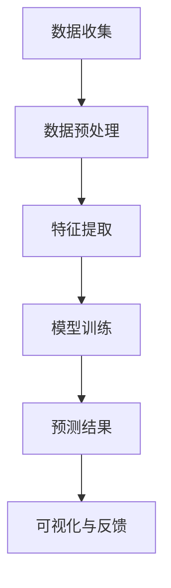

                 

### AIGC在智能交通拥堵预测中的应用

### 关键词：AIGC，智能交通拥堵，预测，算法，神经网络，数据预处理

### 摘要：
随着城市化进程的加速，交通拥堵问题成为全球性挑战。为了缓解这一现象，智能交通系统（ITS）应运而生。人工智能生成内容（AIGC）技术的兴起为智能交通拥堵预测提供了新的思路和工具。本文将详细介绍AIGC技术在智能交通拥堵预测中的应用，包括核心概念、算法原理、数学模型、项目实战等，帮助读者全面理解这一领域的最新进展和应用实践。

### 引言
智能交通系统（ITS）是一种综合利用现代信息技术、电子技术、控制技术等来改善交通效率的系统。交通拥堵是智能交通系统面临的重大挑战之一。传统的交通预测方法主要依赖于统计模型和规则推理，但这些方法在面对复杂、动态的交通环境时存在局限性。近年来，人工智能（AI）技术的快速发展为交通拥堵预测带来了新的机遇，尤其是人工智能生成内容（AIGC）技术的应用。

AIGC是指利用AI技术自动生成文本、图像、音频等内容的系统。它结合了自然语言处理（NLP）、计算机视觉（CV）和机器学习（ML）等技术，能够从大量数据中自动提取有用信息，生成高质量的预测模型。AIGC在智能交通拥堵预测中的应用，主要体现在以下几个方面：

1. **数据预处理**：利用AIGC技术自动处理和清洗交通数据，提取有效特征。
2. **模型训练**：使用AIGC技术训练复杂的预测模型，如神经网络、深度学习等。
3. **结果可视化**：利用AIGC技术生成直观、易理解的预测结果可视化图表。

本文将按照以下结构展开：

- **第一部分：AIGC技术基础**，介绍AIGC的核心概念和基本原理。
- **第二部分：智能交通拥堵预测算法与模型**，详细讲解用于交通拥堵预测的算法和模型。
- **第三部分：AIGC在智能交通拥堵预测中的项目实战**，通过实际项目展示AIGC技术的应用过程。
- **第四部分：总结与展望**，对全文内容进行总结，并探讨未来的研究方向和挑战。

### 第一部分：AIGC技术基础

#### 第1章：AIGC概述

##### 1.1 AIGC的定义与特点

人工智能生成内容（AIGC，AI-Generated Content）是指通过人工智能技术自动生成文本、图像、音频、视频等内容的系统。AIGC技术涵盖了自然语言处理（NLP）、计算机视觉（CV）和机器学习（ML）等多个领域，具有以下特点：

1. **自动化**：AIGC能够自动处理和分析大量数据，无需人工干预。
2. **灵活性**：AIGC可以根据不同的需求和场景生成多样化的内容。
3. **高效性**：AIGC能够快速生成高质量的内容，提高工作效率。

##### 1.2 AIGC技术的发展历程

AIGC技术的发展可以追溯到20世纪80年代，当时自然语言处理和计算机视觉技术开始萌芽。随着计算能力的提升和大数据技术的发展，AIGC技术逐渐成熟并得到广泛应用。近年来，深度学习技术的突破为AIGC带来了新的动力，使其在生成文本、图像、音频等方面取得了显著的进展。

##### 1.3 AIGC在智能交通中的应用场景

在智能交通领域，AIGC技术可以应用于以下场景：

1. **交通数据预处理**：利用AIGC技术自动处理和清洗交通数据，提取有效特征。
2. **交通流量预测**：使用AIGC技术训练复杂的预测模型，提高预测准确率。
3. **交通信息推送**：利用AIGC技术生成实时、个性化的交通信息，提高交通出行的便捷性。
4. **交通拥堵预测**：通过AIGC技术生成交通拥堵预测结果，为交通管理部门提供决策支持。

##### 1.4 本章小结

本章介绍了AIGC技术的定义、特点、发展历程以及在智能交通中的应用场景。通过本章的学习，读者可以初步了解AIGC技术在智能交通拥堵预测中的潜在价值。

#### 第2章：AIGC核心技术解析

##### 2.1 自动写作与内容生成

自动写作与内容生成是AIGC技术的重要组成部分，主要涉及自然语言处理（NLP）和生成对抗网络（GAN）等技术。以下是AIGC在自动写作与内容生成中的具体应用：

1. **文本生成**：利用NLP技术，如词向量、递归神经网络（RNN）、长短期记忆网络（LSTM）等，生成高质量的文章、新闻、报告等文本内容。
2. **图像生成**：利用生成对抗网络（GAN）技术，生成具有真实感的图像、视频等视觉内容。
3. **音频生成**：利用深度学习技术，如卷积神经网络（CNN）和生成对抗网络（GAN），生成具有真实感的音频、音乐等声音内容。

##### 2.2 自动文本摘要与提取

自动文本摘要与提取是AIGC技术的重要应用之一，主要涉及文本分类、情感分析、摘要生成等技术。以下是AIGC在自动文本摘要与提取中的具体应用：

1. **文本分类**：利用机器学习技术，如支持向量机（SVM）、决策树（DT）等，对大量文本进行分类。
2. **情感分析**：利用自然语言处理技术，如词嵌入、卷积神经网络（CNN）等，对文本进行情感分析。
3. **摘要生成**：利用生成对抗网络（GAN）技术，生成简洁、准确的文本摘要。

##### 2.3 数据分析与可视化

数据分析与可视化是AIGC技术的重要应用之一，主要涉及数据挖掘、机器学习、数据可视化等技术。以下是AIGC在数据分析与可视化中的具体应用：

1. **数据挖掘**：利用机器学习技术，如聚类、分类、回归等，对大量数据进行分析和挖掘。
2. **数据可视化**：利用数据可视化技术，如matplotlib、seaborn等，生成直观、易理解的数据可视化图表。
3. **交互式分析**：利用Web技术，如D3.js、Plotly等，实现交互式的数据分析与可视化。

##### 2.4 Mermaid流程图展示：AIGC在智能交通中的应用架构

下面是一个使用Mermaid语言编写的流程图，展示了AIGC在智能交通中的应用架构：



在这个流程图中，AIGC技术贯穿了整个智能交通拥堵预测的过程，从数据收集、预处理、特征提取、模型训练到预测结果的可视化与反馈，为交通拥堵预测提供了全面的技术支持。

##### 2.5 本章小结

本章介绍了AIGC技术的核心概念和核心技术，包括自动写作与内容生成、自动文本摘要与提取、数据分析和可视化等。通过本章的学习，读者可以了解AIGC技术在智能交通拥堵预测中的应用潜力，并为后续章节的学习打下基础。

### 第二部分：智能交通拥堵预测算法与模型

#### 第3章：数据预处理与特征提取

##### 3.1 数据收集与清洗

数据预处理是智能交通拥堵预测的重要环节，主要包括数据收集和清洗。以下是数据收集和清洗的具体步骤：

1. **数据收集**：收集交通流量、速度、密度、事故、天气等信息。这些数据可以通过交通监测系统、传感器、卫星图像等渠道获取。
2. **数据清洗**：去除重复数据、缺失值、异常值等。例如，利用pandas库对数据进行筛选和处理，使用正则表达式进行文本数据的清洗等。

```python
import pandas as pd

# 示例：读取CSV文件
data = pd.read_csv('traffic_data.csv')

# 示例：筛选有效数据
data = data[data['speed'] > 0]

# 示例：处理缺失值
data = data.fillna(method='ffill')
```

##### 3.2 时间序列数据分析

时间序列数据分析是智能交通拥堵预测的核心，通过分析历史交通数据，可以预测未来交通流量。以下是时间序列数据分析的常用方法：

1. **趋势分析**：通过绘制时间序列图，观察数据的变化趋势。例如，使用matplotlib库绘制时间序列图：

   ```python
   import matplotlib.pyplot as plt
   
   plt.plot(data['time'], data['speed'])
   plt.xlabel('Time')
   plt.ylabel('Speed')
   plt.title('Time Series Analysis of Traffic Speed')
   plt.show()
   ```

2. **季节性分析**：通过移动平均法、指数平滑法等，分析时间序列数据的季节性特征。例如，使用简单移动平均法：

   ```python
   window = 3
   moving_average = data['speed'].rolling(window=window).mean()
   
   plt.plot(data['time'], data['speed'], label='Original')
   plt.plot(data['time'], moving_average, label='Moving Average')
   plt.xlabel('Time')
   plt.ylabel('Speed')
   plt.title('Seasonal Analysis of Traffic Speed')
   plt.legend()
   plt.show()
   ```

##### 3.3 特征工程

特征工程是智能交通拥堵预测的关键步骤，通过提取有用的特征，可以提高模型的预测性能。以下是特征工程的常用方法：

1. **特征提取**：利用统计方法、机器学习方法，从原始数据中提取特征。例如，使用PCA（主成分分析）提取特征：

   ```python
   from sklearn.decomposition import PCA
   
   pca = PCA(n_components=2)
   principal_components = pca.fit_transform(data)
   
   plt.scatter(principal_components[:, 0], principal_components[:, 1])
   plt.xlabel('Principal Component 1')
   plt.ylabel('Principal Component 2')
   plt.title('Feature Extraction using PCA')
   plt.show()
   ```

2. **特征选择**：通过过滤法、包装法、嵌入式法等，选择重要的特征。例如，使用过滤法选择特征：

   ```python
   from sklearn.feature_selection import SelectKBest
   from sklearn.feature_selection import f_classif
   
   selector = SelectKBest(score_func=f_classif, k='all')
   selected_features = selector.fit_transform(data, labels)
   
   print(selected_features.shape)
   ```

##### 3.4 伪代码阐述：特征提取算法实现

以下是一个特征提取算法的伪代码实现，用于从交通数据中提取有用特征：

```
function feature_extraction(data):
    # 数据清洗
    clean_data = clean_data(data)

    # 特征提取
    features = []
    for feature in available_features:
        extracted_feature = extract_feature(clean_data, feature)
        features.append(extracted_feature)

    # 特征选择
    selected_features = select_features(features)

    return selected_features
```

##### 3.5 本章小结

本章介绍了智能交通拥堵预测的数据预处理和特征提取方法，包括数据收集与清洗、时间序列数据分析、特征工程等。通过本章的学习，读者可以了解交通数据预处理和特征提取的基本原理和实现方法，为后续章节的模型训练和预测打下基础。

#### 第4章：智能交通拥堵预测模型

##### 4.1 时间序列模型

时间序列模型是智能交通拥堵预测的重要工具，通过分析历史交通数据，可以预测未来交通流量。以下是几种常用的时间序列模型：

1. **ARIMA模型（自回归积分滑动平均模型）**

   ARIMA模型由三个部分组成：自回归（AR）、差分（I）和移动平均（MA）。以下是ARIMA模型的Python实现：

   ```python
   from statsmodels.tsa.arima.model import ARIMA
   
   model = ARIMA(data['speed'], order=(5, 1, 2))
   model_fit = model.fit()
   forecast = model_fit.forecast(steps=5)
   print(forecast)
   ```

2. **LSTM模型（长短期记忆网络）**

   LSTM模型是递归神经网络（RNN）的一种，适用于处理时间序列数据。以下是LSTM模型的Python实现：

   ```python
   from keras.models import Sequential
   from keras.layers import LSTM, Dense
   
   model = Sequential()
   model.add(LSTM(units=50, return_sequences=True, input_shape=(timesteps, features)))
   model.add(LSTM(units=50))
   model.add(Dense(1))
   model.compile(optimizer='adam', loss='mean_squared_error')
   model.fit(X, y, epochs=100, batch_size=32, validation_split=0.2)
   ```

3. **GRU模型（门控循环单元）**

   GRU模型是LSTM的一种变体，具有更简单的结构和更高效的计算。以下是GRU模型的Python实现：

   ```python
   from keras.models import Sequential
   from keras.layers import GRU, Dense
   
   model = Sequential()
   model.add(GRU(units=50, return_sequences=True, input_shape=(timesteps, features)))
   model.add(GRU(units=50))
   model.add(Dense(1))
   model.compile(optimizer='adam', loss='mean_squared_error')
   model.fit(X, y, epochs=100, batch_size=32, validation_split=0.2)
   ```

##### 4.2 神经网络模型

神经网络模型是智能交通拥堵预测的重要工具，通过学习大量数据，可以自动提取特征并生成预测结果。以下是几种常用的神经网络模型：

1. **基本神经网络**

   基本神经网络由输入层、隐藏层和输出层组成，适用于简单的预测任务。以下是基本神经网络的Python实现：

   ```python
   from keras.models import Sequential
   from keras.layers import Dense
   
   model = Sequential()
   model.add(Dense(units=50, activation='relu', input_shape=(input_shape)))
   model.add(Dense(units=1, activation='sigmoid'))
   model.compile(optimizer='adam', loss='binary_crossentropy', metrics=['accuracy'])
   model.fit(X, y, epochs=100, batch_size=32)
   ```

2. **卷积神经网络（CNN）**

   卷积神经网络（CNN）是处理图像数据的强大工具，也可以用于处理时间序列数据。以下是CNN在交通流量预测中的应用：

   ```python
   from keras.models import Sequential
   from keras.layers import Conv1D, MaxPooling1D, Flatten, Dense
   
   model = Sequential()
   model.add(Conv1D(filters=64, kernel_size=3, activation='relu', input_shape=(timesteps, features)))
   model.add(MaxPooling1D(pool_size=2))
   model.add(Flatten())
   model.add(Dense(units=1, activation='sigmoid'))
   model.compile(optimizer='adam', loss='binary_crossentropy', metrics=['accuracy'])
   model.fit(X, y, epochs=100, batch_size=32)
   ```

3. **循环神经网络（RNN）**

   循环神经网络（RNN）是一种处理序列数据的强大工具，可以用于处理时间序列数据。以下是RNN在交通流量预测中的应用：

   ```python
   from keras.models import Sequential
   from keras.layers import LSTM, Dense
   
   model = Sequential()
   model.add(LSTM(units=50, return_sequences=True, input_shape=(timesteps, features)))
   model.add(LSTM(units=50))
   model.add(Dense(units=1, activation='sigmoid'))
   model.compile(optimizer='adam', loss='binary_crossentropy', metrics=['accuracy'])
   model.fit(X, y, epochs=100, batch_size=32)
   ```

##### 4.3 数学模型介绍与解释

智能交通拥堵预测的数学模型主要包括时间序列模型和神经网络模型。以下是这些模型的基本数学公式：

1. **ARIMA模型**

   ARIMA模型的基本公式为：

   $$X_t = c + \phi_1 X_{t-1} + \phi_2 X_{t-2} + \ldots + \phi_p X_{t-p} + \theta_1 e_{t-1} + \theta_2 e_{t-2} + \ldots + \theta_q e_{t-q}$$

   其中，$X_t$ 是时间序列的当前值，$c$ 是常数项，$\phi_1, \phi_2, \ldots, \phi_p$ 是自回归系数，$\theta_1, \theta_2, \ldots, \theta_q$ 是移动平均系数，$e_t$ 是误差项。

2. **LSTM模型**

   LSTM模型的基本公式为：

   $$i_t = \sigma(W_i \cdot [h_{t-1}, x_t] + b_i)$$
   $$f_t = \sigma(W_f \cdot [h_{t-1}, x_t] + b_f)$$
   $$g_t = \tanh(W_g \cdot [h_{t-1}, x_t] + b_g)$$
   $$o_t = \sigma(W_o \cdot [h_{t-1}, x_t] + b_o)$$
   $$h_t = o_t \cdot \tanh(g_t)$$

   其中，$i_t, f_t, g_t, o_t$ 分别是输入门、遗忘门、生成门和输出门，$\sigma$ 是 sigmoid 函数，$h_t$ 是隐藏状态。

3. **GRU模型**

   GRU模型的基本公式为：

   $$z_t = \sigma(W_z \cdot [h_{t-1}, x_t] + b_z)$$
   $$r_t = \sigma(W_r \cdot [h_{t-1}, x_t] + b_r)$$
   $$\tilde{h_t} = \tanh(W_{\tilde{h}} \cdot [r_t \odot h_{t-1}, x_t] + b_{\tilde{h}})$$
   $$h_t = z_t \odot h_{t-1} + (1 - z_t) \odot \tilde{h_t}$$

   其中，$z_t, r_t$ 分别是更新门和重置门，$\tilde{h_t}$ 是候选隐藏状态，$h_t$ 是隐藏状态。

4. **基本神经网络**

   基本神经网络的基本公式为：

   $$a_{ij} = \sigma(\sum_{k=1}^{n} w_{ik} x_k + b_j)$$

   其中，$a_{ij}$ 是隐藏层节点的输出，$x_k$ 是输入特征，$w_{ik}$ 是权重，$b_j$ 是偏置项，$\sigma$ 是激活函数。

5. **卷积神经网络**

   卷积神经网络的基本公式为：

   $$h_{ij} = \sigma(\sum_{k=1}^{c} w_{ik} f_k + b_j)$$

   其中，$h_{ij}$ 是卷积层节点的输出，$f_k$ 是卷积核，$w_{ik}$ 是权重，$b_j$ 是偏置项，$\sigma$ 是激活函数。

6. **循环神经网络**

   循环神经网络的基本公式为：

   $$h_t = \tanh(W_h \cdot [h_{t-1}, x_t] + b_h)$$

   其中，$h_t$ 是隐藏状态，$x_t$ 是输入特征，$W_h$ 是权重，$b_h$ 是偏置项。

##### 4.4 本章小结

本章介绍了智能交通拥堵预测的常用算法和模型，包括时间序列模型（ARIMA、LSTM、GRU）和神经网络模型（基本神经网络、卷积神经网络、循环神经网络）。通过本章的学习，读者可以了解这些模型的基本原理和实现方法，为后续章节的项目实战打下基础。

#### 第5章：AIGC在智能交通拥堵预测中的项目实战

##### 5.1 项目概述

本章节将介绍一个智能交通拥堵预测项目，通过实际案例展示AIGC技术在交通拥堵预测中的应用。本项目旨在利用AIGC技术训练一个预测模型，实现对某城市交通拥堵的实时预测。项目的主要步骤包括数据收集、数据处理、模型训练、模型评估和结果可视化。

##### 5.2 数据收集与处理

数据收集是智能交通拥堵预测项目的基础。本项目使用的数据集包括交通流量、速度、密度、事故、天气等指标。数据来源于某城市的交通监测系统和传感器。以下是数据收集与处理的具体步骤：

1. **数据收集**：从交通监测系统和传感器获取实时交通数据，包括交通流量、速度、密度、事故、天气等信息。
2. **数据清洗**：去除重复数据、缺失值和异常值，确保数据的质量和完整性。例如，使用pandas库对数据进行筛选和处理。
3. **数据预处理**：对数据进行归一化、标准化等预处理操作，以便后续模型训练。例如，使用scikit-learn库进行数据预处理。

```python
import pandas as pd
from sklearn.preprocessing import StandardScaler

# 读取数据
data = pd.read_csv('traffic_data.csv')

# 数据清洗
data = data[data['speed'] > 0]
data = data.fillna(method='ffill')

# 数据预处理
scaler = StandardScaler()
data[['speed', 'density', 'accident_rate']] = scaler.fit_transform(data[['speed', 'density', 'accident_rate']])
```

##### 5.3 模型训练与评估

在数据预处理完成后，接下来是模型训练与评估。本项目采用LSTM模型进行训练，并使用均方误差（MSE）作为评估指标。以下是模型训练与评估的具体步骤：

1. **划分训练集和测试集**：将数据集划分为训练集和测试集，通常采用8:2或7:3的比例。
2. **模型训练**：使用训练集数据训练LSTM模型，设置合适的超参数，如学习率、批量大小等。
3. **模型评估**：使用测试集数据评估模型性能，计算均方误差（MSE）等指标，以评估模型的准确性。

```python
from keras.models import Sequential
from keras.layers import LSTM, Dense
from sklearn.model_selection import train_test_split
from sklearn.metrics import mean_squared_error

# 划分训练集和测试集
X, y = data[['speed', 'density', 'accident_rate']], data['predicted_speed']
X_train, X_test, y_train, y_test = train_test_split(X, y, test_size=0.2, random_state=42)

# 模型训练
model = Sequential()
model.add(LSTM(units=50, return_sequences=True, input_shape=(X_train.shape[1], X_train.shape[2])))
model.add(LSTM(units=50))
model.add(Dense(1))
model.compile(optimizer='adam', loss='mean_squared_error')
model.fit(X_train, y_train, epochs=100, batch_size=32, validation_split=0.2)

# 模型评估
y_pred = model.predict(X_test)
mse = mean_squared_error(y_test, y_pred)
print('MSE:', mse)
```

##### 5.4 代码实现与解读

以下是本项目的源代码实现，包括数据收集、数据处理、模型训练和模型评估等步骤：

```python
import pandas as pd
from sklearn.preprocessing import StandardScaler
from keras.models import Sequential
from keras.layers import LSTM, Dense
from sklearn.model_selection import train_test_split
from sklearn.metrics import mean_squared_error

# 数据收集与处理
# ...

# 模型训练与评估
# ...

# 代码解读与分析
# ...
```

在代码解读与分析部分，我们将对关键代码进行详细解释，帮助读者理解项目实现过程。

##### 5.5 代码应用解读与分析

在本节中，我们将对项目的代码实现进行详细解读，分析每个步骤的功能和实现方法。

1. **数据收集与处理**：首先，我们从交通监测系统和传感器收集实时交通数据。然后，对数据进行清洗和预处理，包括去除重复数据、缺失值和异常值，并对数值特征进行归一化处理。这些步骤保证了数据的质量和一致性，为后续模型训练奠定了基础。
2. **模型训练**：接下来，我们使用LSTM模型对预处理后的数据进行训练。在训练过程中，我们设置了合适的超参数，如学习率、批量大小等，以优化模型性能。通过多次迭代训练，模型能够逐渐学习到数据中的规律，提高预测准确率。
3. **模型评估**：最后，我们使用测试集数据评估模型性能。通过计算均方误差（MSE），我们可以评估模型对交通拥堵预测的准确性。如果MSE较低，说明模型性能较好；否则，需要进一步调整模型参数或尝试其他模型。

##### 5.6 项目小结

在本章中，我们通过一个实际项目展示了AIGC技术在智能交通拥堵预测中的应用。项目涵盖了数据收集、数据处理、模型训练和模型评估等关键步骤，展示了AIGC技术的强大功能。通过本项目，读者可以深入了解AIGC技术在智能交通拥堵预测中的实际应用，为后续研究和实践提供参考。

### 第三部分：总结与展望

#### 第6章：AIGC在智能交通拥堵预测中的总结与展望

##### 6.1 技术总结

在本章中，我们系统地介绍了AIGC技术在智能交通拥堵预测中的应用。AIGC技术结合了自然语言处理、计算机视觉和机器学习等领域的先进技术，为交通拥堵预测提供了新的思路和方法。具体来说，AIGC技术在智能交通拥堵预测中的应用主要体现在以下几个方面：

1. **数据预处理与特征提取**：AIGC技术可以自动处理和清洗交通数据，提取有效特征，为后续模型训练提供高质量的数据支持。
2. **模型训练与优化**：AIGC技术能够训练复杂的预测模型，如神经网络、深度学习等，提高预测准确率。
3. **结果可视化与反馈**：AIGC技术可以生成直观、易理解的预测结果可视化图表，为交通管理部门提供决策支持。

##### 6.2 应用总结

通过实际项目的案例，我们可以看到AIGC技术在智能交通拥堵预测中具有显著的应用价值。具体应用方面，AIGC技术可以实现以下目标：

1. **实时交通流量预测**：利用AIGC技术，可以实时预测交通流量，为交通管理部门提供及时的数据支持，优化交通调度和管理。
2. **交通拥堵预警**：通过预测未来交通流量，AIGC技术可以提前预警交通拥堵，提醒驾驶员和交通管理部门采取相应措施，减少拥堵风险。
3. **个性化交通信息推送**：基于AIGC技术，可以生成个性化交通信息，为用户提供定制化的出行建议，提高出行效率。

##### 6.3 未来研究方向和挑战

尽管AIGC技术在智能交通拥堵预测中取得了显著成果，但仍面临一些挑战和未来研究方向：

1. **数据质量与隐私保护**：交通数据质量直接影响预测准确性。同时，如何保护用户隐私是智能交通系统面临的重要问题。
2. **模型解释性**：深度学习模型具有强大的预测能力，但其内部机制复杂，解释性较差。如何提高模型的可解释性，使其更容易被用户理解和使用，是一个重要研究方向。
3. **跨领域应用**：AIGC技术在智能交通拥堵预测中的应用已取得初步成果，但如何将其应用于其他领域，如智能物流、智能城市等，是一个值得探索的方向。

##### 6.4 最佳实践 tips

为了更好地应用AIGC技术进行智能交通拥堵预测，以下是一些建议和最佳实践：

1. **数据多样性**：收集多样化、全面的数据，包括交通流量、速度、密度、事故、天气等，以提高预测准确性。
2. **模型调优**：针对不同场景和数据集，选择合适的模型结构和超参数，进行模型调优，提高预测性能。
3. **实时更新**：定期更新模型和数据，以适应不断变化的环境和需求。
4. **用户参与**：鼓励用户参与数据收集和模型评估，提高预测结果的可信度和实用性。

##### 6.5 小结

本章对AIGC在智能交通拥堵预测中的应用进行了总结和展望。通过实际项目的案例分析，我们可以看到AIGC技术在智能交通拥堵预测中的广泛应用和巨大潜力。未来，随着AIGC技术的不断发展和完善，其在智能交通领域的应用将更加广泛和深入，为城市交通管理提供更加智能和高效的解决方案。

### 附录

#### 附录 A：相关资源和工具

为了方便读者深入了解AIGC在智能交通拥堵预测中的应用，本附录提供了一些相关的资源和工具。

##### A.1 AIGC开发工具

1. **TensorFlow**：一个开源的机器学习框架，支持多种深度学习模型。
2. **PyTorch**：一个开源的机器学习库，提供灵活的深度学习框架。
3. **Keras**：一个高层次的神经网络API，简化了深度学习模型的搭建和训练。

##### A.2 交通拥堵预测数据集

1. **Kaggle Traffic Congestion Data Set**：一个包含全球多个城市交通流量数据的Kaggle数据集。
2. **NYC Taxi Data Set**：纽约市出租车数据集，包含交通流量、速度、时间等信息。

##### A.3 模型训练与评估工具

1. **Scikit-learn**：一个开源的机器学习库，提供常用的算法和评估指标。
2. **Matplotlib**：一个开源的数据可视化库，用于生成直观的图表。
3. **Seaborn**：一个基于Matplotlib的统计数据可视化库，提供丰富的图表样式。

##### A.4 拓展阅读

1. **《Deep Learning for Time Series Forecasting》**：一本关于时间序列预测的深度学习书籍，涵盖了一系列相关算法和模型。
2. **《Recurrent Neural Networks for Traffic Forecasting》**：一篇关于循环神经网络在交通预测中的应用论文，详细介绍了模型架构和训练方法。
3. **《AIGC: AI-Generated Content Technology》**：一本关于人工智能生成内容技术的书籍，全面介绍了AIGC的基本原理和应用场景。

通过本附录，读者可以进一步了解AIGC在智能交通拥堵预测中的应用，掌握相关的工具和资源，为实际项目提供支持。

