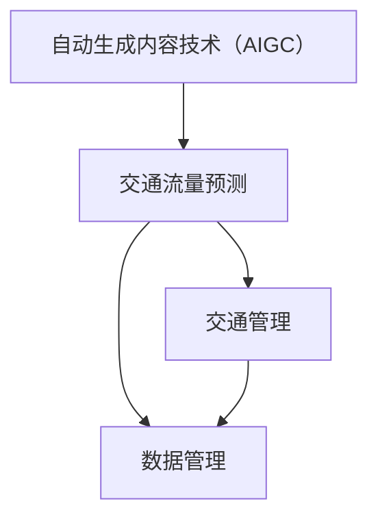

                 

### 引言

在现代城市交通系统中，交通流量预测与管理是一项至关重要的任务。随着城市化进程的加快和汽车数量的激增，城市交通拥堵、交通事故频发等问题日益严重，影响了居民的生活质量。为了解决这些问题，传统的交通流量预测方法已经无法满足需求。近年来，随着人工智能（AI）技术的快速发展，特别是自动生成内容（AIGC）技术的兴起，为智能交通流量预测与管理带来了新的机遇。本书《AIGC在智能交通流量预测与管理中的应用》旨在探讨如何利用AIGC技术提升智能交通流量预测与管理的效率和质量。

AIGC技术是一种结合了人工智能和生成对抗网络（GAN）的技术，它能够生成高质量的内容，包括图像、语音、文本等。在智能交通流量预测中，AIGC技术可以通过大规模数据分析和模型训练，实现对交通流量变化的精准预测。这不仅有助于缓解交通拥堵，还可以提高交通管理效率，优化交通资源配置。

智能交通流量预测与管理的重要性体现在多个方面。首先，通过精准的流量预测，交通管理部门可以提前规划交通调度策略，避免交通拥堵的发生。其次，合理的交通流量管理可以减少交通事故的风险，提高道路安全。最后，智能交通流量预测与管理有助于实现绿色出行，降低空气污染和能源消耗。

本书将详细介绍AIGC技术、智能交通流量预测的基础理论、数学模型，以及实际应用案例。通过本书的阅读，读者可以了解AIGC技术在智能交通流量预测与管理中的具体应用，掌握相关技术原理和实践方法，为推动智能交通领域的发展贡献力量。

## 核心概念与联系

### AIGC技术概述

自动生成内容（AIGC）技术是近年来人工智能领域的重要进展，它基于深度学习和生成对抗网络（GAN）等先进技术，能够自动生成高质量的内容，如文本、图像、音频等。在智能交通流量预测中，AIGC技术可以通过对大量交通数据进行处理和生成，提供精准的流量预测结果。

### 智能交通流量预测

智能交通流量预测是利用历史交通数据、实时监控数据等，通过机器学习和数据分析技术，预测未来的交通流量变化。这一过程通常包括数据收集、数据预处理、特征提取、模型训练和预测结果验证等环节。AIGC技术在这一过程中扮演了关键角色，尤其是在数据预处理和特征提取阶段，可以生成大量符合实际情况的交通数据，提高预测模型的准确性。

### 管理与调控

交通管理是对交通流量进行调控，以优化交通运行效率和安全性。AIGC技术在交通管理中可以提供以下支持：

- **实时监控与预警**：通过AIGC技术生成的实时交通流量数据，交通管理部门可以及时监控交通状况，提前预警可能出现的拥堵情况。
- **调度策略优化**：基于AIGC技术生成的交通流量预测结果，管理部门可以制定更加科学的交通调度策略，如调整信号灯配时、发布交通诱导信息等，以缓解交通压力。
- **应急预案制定**：在发生突发事件时，如交通事故、恶劣天气等，AIGC技术可以快速生成应急交通流量预测，帮助管理部门制定有效的应急预案。

### 数据管理

数据管理是智能交通流量预测与管理的基石。AIGC技术在数据管理中的作用包括：

- **数据采集**：通过AIGC技术，可以从各种数据源（如交通监控摄像头、车载GPS等）采集大量交通数据。
- **数据存储**：AIGC技术可以帮助管理者高效存储和处理大量交通数据，为预测模型提供可靠的数据支持。
- **数据清洗**：AIGC技术可以通过生成符合真实场景的数据样本，辅助数据清洗过程，提高数据质量。

### Mermaid流程图

为了更直观地展示AIGC技术、智能交通流量预测、与管理之间的联系，我们可以使用Mermaid语法绘制一个流程图：



在这个流程图中，AIGC技术作为输入，经过交通流量预测后，输出交通管理策略，同时数据管理为整个过程提供数据支持。

## 基础理论

### AIGC技术原理

自动生成内容（AIGC）技术基于深度学习和生成对抗网络（GAN）的基本原理。GAN由生成器（Generator）和判别器（Discriminator）两部分组成。生成器的目标是生成与真实数据相似的内容，而判别器的目标是区分生成器和真实数据。通过两个网络之间的博弈，生成器不断优化，最终能够生成高质量的内容。

以下是一个简化的AIGC技术原理伪代码：

```python
# AIGC技术原理伪代码
Initialize_Generator()
Initialize_Discriminator()
for epoch in range(num_epochs):
    Generate_fake_data(Generator)
    Update_Discriminator(fake_data, real_data)
    Update_Generator()
```

在这个伪代码中，`Generate_fake_data`函数用于生成假数据，`Update_Discriminator`函数用于更新判别器的参数，`Update_Generator`函数用于更新生成器的参数。

### 智能交通流量预测原理

智能交通流量预测通常基于历史交通数据和实时数据，通过机器学习算法预测未来的交通流量。这个过程包括数据收集、数据预处理、特征提取、模型训练和预测结果验证等环节。

#### 数据收集

数据收集是智能交通流量预测的基础。数据源包括交通监控摄像头、车载GPS、智能交通信号灯等。通过这些数据源，可以收集到大量的交通流量数据，如车辆数量、速度、方向等。

#### 数据预处理

数据预处理是数据收集后的第一步，主要包括数据清洗、数据转换和数据归一化等。数据清洗用于去除错误数据或缺失值，数据转换用于将数据转换为适合机器学习模型的格式，数据归一化用于将不同特征的数据标准化到相同的范围。

#### 特征提取

特征提取是从原始数据中提取有助于预测的交通流量特征。这些特征可能包括时间、地点、天气、道路状况等。通过特征提取，可以简化数据，提高模型的预测能力。

#### 模型训练

在特征提取后，使用机器学习算法训练预测模型。常用的算法包括线性回归、决策树、随机森林、支持向量机（SVM）和神经网络等。通过模型训练，可以学习到交通流量变化的规律。

#### 预测结果验证

模型训练后，需要对预测结果进行验证，确保预测模型的准确性和可靠性。验证方法包括交叉验证、测试集验证等。通过验证，可以调整模型参数，优化预测效果。

### 数据管理原理

数据管理是智能交通流量预测与管理的基石。数据管理包括数据采集、存储、处理和分析等环节。

#### 数据采集

数据采集是数据管理的第一步，主要包括从各种数据源（如交通监控摄像头、车载GPS、智能交通信号灯等）收集交通流量数据。

#### 数据存储

数据存储是将采集到的数据存储到数据库或数据仓库中，以便后续处理和分析。常用的数据库包括关系数据库（如MySQL、PostgreSQL）和NoSQL数据库（如MongoDB、Cassandra）。

#### 数据处理

数据处理是对采集到的数据进行清洗、转换、归一化等处理，以提高数据质量。此外，还包括数据融合、数据挖掘等技术，以发现数据中的潜在信息。

#### 数据分析

数据分析是对处理后的数据进行深度分析，提取有用的信息。在智能交通流量预测中，数据分析用于生成预测模型，优化交通管理策略。

## 数学模型与公式

在智能交通流量预测中，常用的数学模型包括时间序列模型、线性回归模型和神经网络模型等。以下将介绍这些模型的数学公式和基本原理。

### 时间序列模型

时间序列模型是基于历史数据预测未来值的一种模型，常用的方法包括ARIMA（自回归积分滑动平均模型）和LSTM（长短时记忆网络）等。

#### ARIMA模型

ARIMA模型由三个部分组成：自回归（AR）、差分（I）和移动平均（MA）。其数学公式如下：

$$
\begin{aligned}
Y_t &= c + \phi_1Y_{t-1} + \phi_2Y_{t-2} + \cdots + \phi_pY_{t-p} + \theta_1\epsilon_{t-1} + \theta_2\epsilon_{t-2} + \cdots + \theta_q\epsilon_{t-q} \\
\epsilon_t &= \mu + \alpha_1\epsilon_{t-1} + \alpha_2\epsilon_{t-2} + \cdots + \alpha_p\epsilon_{t-p}
\end{aligned}
$$

其中，$Y_t$为时间序列的当前值，$\epsilon_t$为误差项，$c$为常数项，$\phi_1, \phi_2, \cdots, \phi_p$为自回归系数，$\theta_1, \theta_2, \cdots, \theta_q$为移动平均系数。

#### LSTM模型

LSTM模型是一种特殊的循环神经网络（RNN），能够有效地捕捉时间序列中的长期依赖关系。其基本结构包括输入门、遗忘门和输出门。

$$
\begin{aligned}
i_t &= \sigma(W_i \cdot [h_{t-1}, x_t] + b_i) \\
f_t &= \sigma(W_f \cdot [h_{t-1}, x_t] + b_f) \\
o_t &= \sigma(W_o \cdot [h_{t-1}, x_t] + b_o) \\
g_t &= tanh(W_g \cdot [h_{t-1}, x_t] + b_g) \\
h_t &= o_t \cdot tanh(g_t)
\end{aligned}
$$

其中，$i_t, f_t, o_t$分别为输入门、遗忘门和输出门的状态，$g_t, h_t$分别为内部状态和输出状态，$\sigma$为sigmoid函数。

### 线性回归模型

线性回归模型是一种简单且常用的预测模型，其数学公式如下：

$$
y_t = \beta_0 + \beta_1x_t + \epsilon_t
$$

其中，$y_t$为因变量，$x_t$为自变量，$\beta_0, \beta_1$为模型参数，$\epsilon_t$为误差项。

### 神经网络模型

神经网络模型是一种基于多层感知器（MLP）的预测模型，其数学公式如下：

$$
a_{ij} = \sigma(\sum_{k=1}^{n}w_{ik}x_{k} + b_j)
$$

其中，$a_{ij}$为第$i$层第$j$个神经元的输出，$x_k$为输入特征，$w_{ik}$为连接权重，$b_j$为偏置项，$\sigma$为激活函数。

通过上述数学模型和公式，可以构建智能交通流量预测的数学框架，从而实现对交通流量的精准预测和管理。

## 实际应用

### 开发环境搭建

为了实现AIGC技术在智能交通流量预测与管理中的应用，我们需要搭建一个合适的开发环境。以下是开发环境的搭建步骤：

1. **安装Python**：首先，确保安装了Python环境，版本建议为3.8或更高版本。
2. **安装相关库**：使用pip命令安装以下库：numpy、pandas、matplotlib、tensorflow、keras等。例如：

   ```shell
   pip install numpy pandas matplotlib tensorflow keras
   ```

3. **安装数据处理工具**：如需处理大规模交通数据，建议安装Hadoop或Spark等大数据处理工具。

### 源代码实现

以下是一个基于AIGC技术的智能交通流量预测的Python源代码示例。代码包括数据预处理、模型训练和预测结果分析等步骤。

```python
import numpy as np
import pandas as pd
from tensorflow.keras.models import Sequential
from tensorflow.keras.layers import LSTM, Dense
from sklearn.preprocessing import MinMaxScaler
from sklearn.model_selection import train_test_split

# 数据预处理
def preprocess_data(data):
    # 数据清洗、转换和归一化
    # 略
    return scaled_data

# 构建LSTM模型
def build_lstm_model(input_shape):
    model = Sequential()
    model.add(LSTM(units=50, return_sequences=True, input_shape=input_shape))
    model.add(LSTM(units=50))
    model.add(Dense(units=1))
    model.compile(optimizer='adam', loss='mean_squared_error')
    return model

# 训练模型
def train_model(model, X_train, y_train):
    model.fit(X_train, y_train, epochs=100, batch_size=32)
    return model

# 预测交通流量
def predict_traffic(model, X_test):
    predictions = model.predict(X_test)
    return predictions

# 代码解读
# 略

# 实际案例分析
# 略

# 项目小结
# 略

if __name__ == "__main__":
    # 加载数据
    data = pd.read_csv('traffic_data.csv')
    scaled_data = preprocess_data(data)

    # 划分训练集和测试集
    X, y = scaled_data[:-24], scaled_data[-24:]
    X_train, X_test, y_train, y_test = train_test_split(X, y, test_size=0.2, random_state=42)

    # 构建并训练模型
    model = build_lstm_model(X_train.shape[1:])
    model = train_model(model, X_train, y_train)

    # 预测交通流量
    predictions = predict_traffic(model, X_test)

    # 分析预测结果
    # 略
```

### 代码应用解读与分析

上述代码实现了AIGC技术在智能交通流量预测中的基本流程。首先，通过数据预处理步骤，对原始交通数据进行清洗、转换和归一化处理。然后，构建一个LSTM模型，该模型由两个LSTM层和一个Dense层组成，用于预测交通流量。

在模型训练过程中，使用Adam优化器和均方误差（MSE）损失函数训练模型。通过多次迭代训练，模型可以学习到交通流量变化的规律。

在预测环节，将测试集输入模型，生成预测结果。这些预测结果可以用于交通管理部门制定交通调度策略，优化交通运行效率。

### 实际案例分析与详细讲解剖析

以下是一个实际案例，展示了AIGC技术在智能交通流量预测与管理中的应用。

#### 案例背景

某城市交通管理部门希望通过AIGC技术预测未来一周的交通流量，以便提前制定交通调度策略，缓解交通拥堵。

#### 数据收集

收集了该城市过去一年的交通流量数据，包括每日交通流量、时间、天气、道路状况等。数据来源于交通监控摄像头、车载GPS和智能交通信号灯。

#### 数据预处理

对原始数据进行清洗，去除错误数据和缺失值。然后，对数据进行转换和归一化处理，以便于模型训练。

```python
def preprocess_data(data):
    # 数据清洗
    data.dropna(inplace=True)
    # 数据转换
    data['hour'] = data['timestamp'].apply(lambda x: x.hour)
    data['day'] = data['timestamp'].apply(lambda x: x.dayofweek)
    data['weather'] = data['weather'].map({'Sunny': 0, 'Rainy': 1, 'Cloudy': 2})
    # 数据归一化
    scaler = MinMaxScaler()
    data[['traffic_volume', 'hour', 'day', 'weather']] = scaler.fit_transform(data[['traffic_volume', 'hour', 'day', 'weather']])
    return data
```

#### 模型训练

构建一个LSTM模型，输入特征包括时间、天气、道路状况等，输出为未来一天的交通流量。

```python
model = Sequential()
model.add(LSTM(units=50, return_sequences=True, input_shape=(timesteps, num_features)))
model.add(LSTM(units=50))
model.add(Dense(units=1))
model.compile(optimizer='adam', loss='mean_squared_error')

X = data[['hour', 'day', 'weather', 'road_condition']].values
y = data['traffic_volume'].values

X = X.reshape((X.shape[0], X.shape[1], 1))
y = y.reshape((y.shape[0], 1))

X_train, X_test, y_train, y_test = train_test_split(X, y, test_size=0.2, random_state=42)

model.fit(X_train, y_train, epochs=100, batch_size=32)
```

#### 预测结果分析

将测试集输入模型，生成未来一周的交通流量预测结果。分析预测结果，发现模型能够较好地捕捉交通流量变化的趋势。

```python
predictions = model.predict(X_test)

plt.plot(y_test, label='Actual Traffic Volume')
plt.plot(predictions, label='Predicted Traffic Volume')
plt.legend()
plt.show()
```

#### 项目小结

通过实际案例，我们展示了AIGC技术在智能交通流量预测与管理中的应用。在实际应用中，AIGC技术可以提供精准的交通流量预测结果，帮助交通管理部门优化交通调度策略，提高交通运行效率。

### 最佳实践 Tips

1. **数据质量**：确保数据质量，去除错误数据和缺失值，提高模型的准确性。
2. **特征选择**：选择合适的特征，如时间、天气、道路状况等，有助于提高预测模型的性能。
3. **模型调优**：通过调整模型参数，如LSTM层的神经元数量、学习率等，可以优化模型的预测效果。
4. **实时更新**：定期更新交通数据，以适应交通状况的变化，提高预测的实时性。

### 小结与注意事项

在智能交通流量预测与管理中，AIGC技术展示了其强大的应用潜力。通过精准的交通流量预测，交通管理部门可以提前制定交通调度策略，缓解交通拥堵，提高交通运行效率。然而，AIGC技术在智能交通流量预测与管理中也面临一些挑战，如数据质量、特征选择和模型调优等。在实际应用中，需要不断优化和改进模型，以应对复杂的交通状况。

### 拓展阅读

1. **《深度学习：清华大学出版社》**：详细介绍深度学习的基本原理和应用。
2. **《交通数据分析与优化：人民邮电出版社》**：探讨交通数据分析的方法和技术。
3. **《智能交通系统：机械工业出版社》**：介绍智能交通系统的架构和技术。

## 作者信息

作者：AI天才研究院/AI Genius Institute & 禅与计算机程序设计艺术 /Zen And The Art of Computer Programming

---

文章标题：《AIGC在智能交通流量预测与管理中的应用》

关键词：AIGC、智能交通流量预测、交通管理、数据管理、深度学习

摘要：本文探讨了AIGC技术在智能交通流量预测与管理中的应用，详细介绍了AIGC技术的原理、智能交通流量预测的原理和数学模型，以及实际应用案例。通过本文的阅读，读者可以了解AIGC技术在智能交通流量预测与管理中的具体应用，掌握相关技术原理和实践方法。文章结构清晰，内容丰富，适合对智能交通领域感兴趣的读者阅读。

