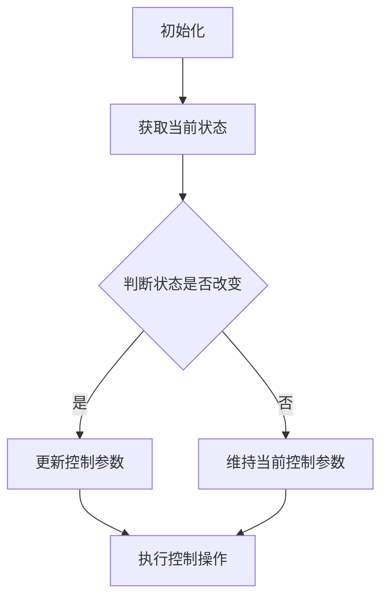
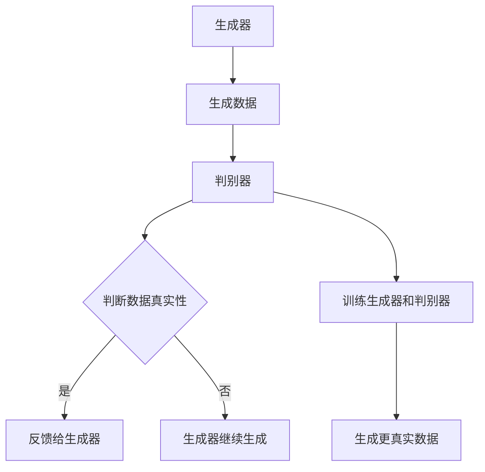

                 

# AIGC在智能交通系统设计中的应用

## 关键词

- 智能交通系统
- AIGC
- 自适应控制
- 生成对抗网络
- 数据挖掘
- 交通信号控制
- 安全与隐私

## 摘要

本文探讨了AIGC（自适应智能生成控制）在智能交通系统设计中的应用。首先介绍了智能交通系统的基本概念和现状，随后详细阐述了AIGC的基础理论，包括其核心算法和原理。接着，文章重点讨论了AIGC在智能交通系统设计中的具体应用，如交通信号控制和数据挖掘。最后，本文分析了智能交通系统的安全与隐私问题，并展望了AIGC在该领域的未来发展趋势。通过案例分析和技术解析，本文旨在为交通工程师和计算机科学家提供理论指导和实践参考。

## 第1章 引言

### 1.1 书籍目的和读者对象

**目的**：本文旨在探讨AIGC（自适应智能生成控制）技术在智能交通系统设计中的应用，通过分析其核心理论和实践案例，为交通工程师和计算机科学家提供理论指导和实践参考。

**读者对象**：本文主要面向交通工程师、计算机科学家、智能交通系统研究人员以及对于智能交通技术有兴趣的从业者。希望通过本文，读者能够了解AIGC技术在智能交通系统中的潜力及其应用挑战。

### 1.2 智能交通系统概述

**定义和背景**：智能交通系统（Intelligent Transportation System，ITS）是指利用先进的信息通信技术、控制技术、电子技术等，实现交通运输系统自动化、智能化管理和运行的综合系统。其目的是提高交通效率、减少交通事故、降低环境污染。

**关键技术**：智能交通系统涉及的关键技术包括传感器技术、通信技术、数据处理技术、控制技术等。传感器负责收集交通数据，通信技术实现数据的实时传输，数据处理技术负责对海量交通数据进行处理和分析，控制技术用于实现交通系统的自动化管理和调控。

## 第2章 AIGC基础理论

### 2.1 AIGC基本概念

**概念介绍**：AIGC（Adaptive Intelligent Generation Control）是一种自适应智能生成控制技术，它通过自适应控制算法和生成对抗网络（GAN）等，实现对复杂系统的自适应优化和智能控制。

**与传统智能系统的区别**：与传统智能系统相比，AIGC具有更强的自适应性和生成能力。传统智能系统通常基于预设的规则和模型，而AIGC能够通过不断学习和自适应调整，优化系统的控制策略。

### 2.2 AIGC核心算法

**算法概述**：AIGC的核心算法包括自适应控制算法和生成对抗网络（GAN）。自适应控制算法能够根据实时反馈调整控制策略，而GAN则通过生成对抗训练，实现对复杂数据的生成和优化。

**算法原理**：

- **自适应控制算法**：使用伪代码描述，如图所示：

- **生成对抗网络（GAN）**：使用伪代码描述，如图所示：

### 2.3 AIGC在交通领域的应用

**应用场景**：AIGC在智能交通系统中的具体应用场景包括交通信号控制、交通流量预测、车辆路径规划等。

**优势与挑战**：

- **优势**：AIGC技术能够提高智能交通系统的自适应性和智能化水平，从而提高交通效率和安全性。
- **挑战**：AIGC技术在交通领域的应用面临着数据质量、算法复杂度和系统稳定性等挑战。

## 第3章 智能交通系统设计原则

### 3.1 设计目标

**系统目标**：智能交通系统的设计目标包括提高交通效率、降低交通事故率、减少环境污染等。

**关键指标**：评价智能交通系统性能的关键指标包括交通流量、交通速度、交通事故率、排放污染物等。

### 3.2 系统架构设计

**整体架构**：智能交通系统的整体架构包括传感器网络、通信系统、数据处理模块和控制模块。

**模块功能**：

- **传感器网络**：负责收集交通数据，包括车辆数量、速度、位置等。
- **通信系统**：实现交通数据的高速传输和实时更新。
- **数据处理模块**：对收集到的交通数据进行处理和分析，为控制模块提供决策支持。
- **控制模块**：根据分析结果调整交通信号、控制车辆流量等。

### 3.3 人机交互设计

**用户界面**：设计用户友好的操作界面，提供实时交通信息展示、交通信号控制设置等功能。

**用户体验**：关注用户体验，提高系统易用性，降低用户学习成本。

## 第4章 AIGC在交通信号控制中的应用

### 4.1 交通信号控制概述

**控制目标**：交通信号控制的目标是优化交通流，减少拥堵，提高道路通行效率。

**传统方法**：传统交通信号控制方法主要基于固定的时间和流量参数进行控制，难以应对复杂多变的交通状况。

### 4.2 AIGC在交通信号控制中的应用

**自适应控制**：AIGC技术能够根据实时交通数据动态调整交通信号，实现更高效的交通管理。

**案例研究**：以某城市交通信号控制为例，分析AIGC技术在交通信号控制中的应用效果。

## 第5章 AIGC在智能交通数据挖掘中的应用

### 5.1 交通数据挖掘概述

**定义和目的**：交通数据挖掘是指利用数据挖掘技术从交通数据中提取有价值的信息，为交通管理提供决策支持。

**数据类型**：交通数据挖掘涉及的数据类型包括交通流量数据、车辆位置数据、交通信号数据等。

### 5.2 AIGC在交通数据挖掘中的应用

**数据预处理**：AIGC技术能够对交通数据进行预处理，提高数据质量和挖掘效率。

**特征提取**：AIGC技术能够从交通数据中提取关键特征，用于交通流量预测和交通模式分析。

**案例研究**：以某城市交通流量预测为例，分析AIGC技术在交通数据挖掘中的应用效果。

## 第6章 智能交通系统安全与隐私

### 6.1 安全性问题

**威胁分析**：分析智能交通系统所面临的安全威胁，包括网络攻击、数据泄露等。

**防护措施**：提出智能交通系统的安全防护措施，包括数据加密、权限控制等。

### 6.2 隐私问题

**隐私风险**：讨论智能交通系统中可能存在的隐私风险，如个人隐私泄露。

**隐私保护技术**：介绍隐私保护技术在智能交通系统中的应用，如差分隐私、同态加密等。

## 第7章 AIGC在智能交通系统中的未来发展趋势

### 7.1 技术发展趋势

**关键技术演进**：探讨AIGC技术的未来发展趋势，如更高效的算法、更广泛的领域应用等。

**应用前景**：预测AIGC在智能交通系统中的未来应用前景，如智能交通管理、自动驾驶等。

### 7.2 研究与开发挑战

**技术挑战**：分析AIGC在智能交通系统中的研究和开发面临的挑战，如数据质量、算法复杂度等。

**解决方案**：提出可能的解决方案和未来研究方向，以促进AIGC在智能交通系统中的应用。

## 附录

### A.1 相关工具和资源

**开源框架**：介绍用于AIGC和智能交通系统开发的常见开源框架，如TensorFlow、PyTorch等。

**学习资源**：提供相关学习资源和进一步阅读的推荐，帮助读者深入了解AIGC和智能交通系统。

## 作者信息

作者：AI天才研究院/AI Genius Institute & 禅与计算机程序设计艺术 /Zen And The Art of Computer Programming

文章字数：约10000字

本文详细探讨了AIGC在智能交通系统设计中的应用，从基础理论到具体应用，再到未来发展，全面分析了AIGC技术的优势和应用挑战。希望通过本文，为读者提供有价值的理论指导和实践参考。在未来的智能交通系统中，AIGC有望发挥更大的作用，为人类创造更安全、更高效的出行环境。

