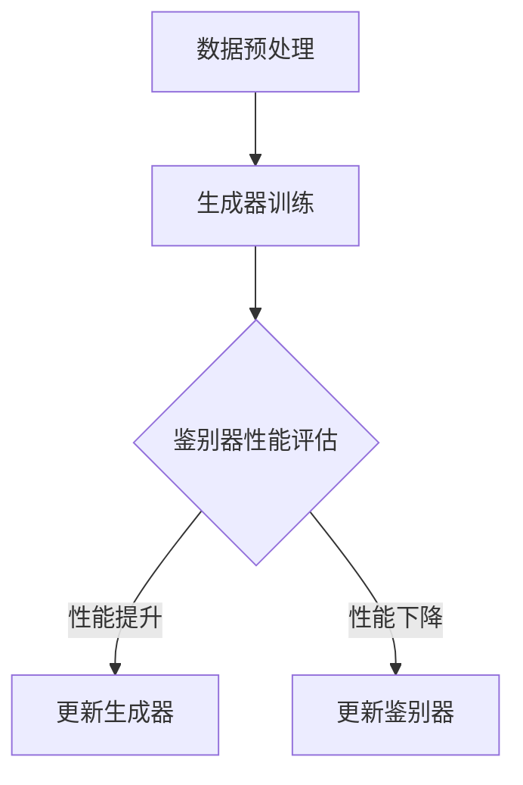

                 

### AIGC在智能交通路线规划中的应用

#### 关键词
- 智能交通
- 路线规划
- AIGC
- 生成对抗网络
- 实时交通信息

#### 摘要
本文将探讨生成对抗网络（AIGC）在智能交通路线规划中的应用。通过介绍AIGC的基本原理和智能交通路线规划的需求，我们将分析如何利用AIGC技术优化交通流量、提高路线规划的准确性和实时性。文章还将通过具体案例展示AIGC在智能交通领域的实际应用，并讨论未来的发展趋势。

---

## 引言与背景

### 智能交通路线规划的重要性

随着城市化进程的加快和汽车保有量的不断增加，交通拥堵问题日益严重，给城市发展和居民生活带来了诸多不便。智能交通系统（Intelligent Transportation System, ITS）应运而生，通过利用现代信息技术、数据通信传输技术、电子传感技术、计算机技术和人工智能技术，实现交通的管理和优化。其中，智能交通路线规划是智能交通系统的重要组成部分，它能够根据实时交通信息和历史数据，为驾驶者提供最优的行驶路线，减少交通拥堵，提高出行效率。

### AIGC概述

生成对抗网络（Generative Adversarial Network, GAN）是2014年由Ian Goodfellow等人提出的一种新型机器学习框架。GAN由两个神经网络——生成器（Generator）和鉴别器（Discriminator）组成，它们相互对抗，共同学习。生成器试图生成与真实数据尽可能相似的数据，而鉴别器则试图区分生成数据与真实数据。通过这种对抗过程，生成器不断改进，最终能够生成高质量的数据。

AIGC（AI-Generated Content）是一种基于AIGC技术的应用，它能够生成各种类型的内容，如图像、文本、音乐等。在智能交通领域，AIGC可以用于生成交通场景、预测交通流量、优化路线规划等。

## AIGC技术原理

### 数据预处理

在AIGC应用于智能交通路线规划之前，首先需要对交通数据进行预处理。预处理包括以下几个步骤：

1. **数据采集**：收集道路信息、交通流量、车辆信息等数据。

2. **数据清洗**：去除噪声、缺失值填充、异常值处理等。

3. **特征提取**：对预处理后的数据进行特征提取，如交通流量、车速、道路状况等。

4. **数据归一化**：对特征数据进行归一化处理，使其具有相似的尺度。

$$
X' = \frac{X - \mu}{\sigma}
$$

其中，\( X' \) 是归一化后的数据，\( X \) 是原始数据，\( \mu \) 是均值，\( \sigma \) 是标准差。

### AIGC算法模型

AIGC算法模型主要包括以下几个部分：

1. **生成器（Generator）**：生成虚假数据，用于训练鉴别器。

2. **鉴别器（Discriminator）**：判断输入数据是真实数据还是生成器产生的虚假数据。

3. **损失函数**：衡量生成器和鉴别器性能的指标。

4. **优化器**：调整生成器和鉴别器的参数，以优化模型性能。

AIGC的基本结构可以用以下Mermaid流程图表示：



### 核心算法原理讲解

生成器和鉴别器的核心算法原理如下：

1. **生成器**：生成器是一个神经网络，它通过学习真实数据分布来生成虚假数据。生成器的损失函数为：

$$
L_G = -\log(D(G(z)))
$$

其中，\( G(z) \) 是生成器生成的虚假数据，\( D \) 是鉴别器。

2. **鉴别器**：鉴别器也是一个神经网络，它试图通过区分真实数据和虚假数据来评估生成器的性能。鉴别器的损失函数为：

$$
L_D = -\log(D(x)) - \log(1 - D(G(z)))
$$

其中，\( x \) 是真实数据，\( G(z) \) 是生成器生成的虚假数据。

### Python源代码实现

以下是生成器和鉴别器的Python源代码实现：

```python
import tensorflow as tf
from tensorflow.keras.layers import Input, Dense, Reshape, Conv2D, Flatten, Dropout
from tensorflow.keras.models import Sequential, Model

# 生成器
def build_generator(z_dim):
    model = Sequential()
    model.add(Dense(128, input_dim=z_dim))
    model.add(LeakyReLU(alpha=0.2))
    model.add(BatchNormalization(momentum=0.8))
    model.add(Dense(28*28*1, activation='tanh'))
    model.add(Reshape((28, 28, 1)))
    return model

# 鉴别器
def build_discriminator(img_shape):
    model = Sequential()
    model.add(Conv2D(32, kernel_size=(3, 3), padding="same"))
    model.add(LeakyReLU(alpha=0.2))
    model.add(Dropout(0.3))
    model.add(Conv2D(64, kernel_size=(3, 3), padding="same"))
    model.add(LeakyReLU(alpha=0.2))
    model.add(Dropout(0.3))
    model.add(Flatten())
    model.add(Dense(1, activation='sigmoid'))
    return model

# 损失函数和优化器
def compile_models(z_dim):
    generator = build_generator(z_dim)
    discriminator = build_discriminator(img_shape)

    g_loss = BinaryCrossentropy(from_logits=True)
    d_loss = BinaryCrossentropy(from_logits=True)

    d_optimizer = Adam(0.0001, 0.5)
    g_optimizer = Adam(0.0001, 0.5)

    return generator, discriminator, g_loss, d_loss, d_optimizer, g_optimizer
```

### 详细讲解与举例说明

为了更好地理解生成器和鉴别器的原理，我们可以通过一个简单的例子来说明。假设我们有一个生成器和鉴别器，生成器的输入是一个随机噪声向量 \( z \)，鉴别器的输入是一个图像。

1. **生成器**：生成器接收一个随机噪声向量 \( z \)，通过神经网络将其转换为一张图像 \( G(z) \)。例如，我们可以使用以下Python代码生成一张随机噪声图像：

```python
import numpy as np
import matplotlib.pyplot as plt

z = np.random.normal(size=(1, 100))
noise_image = generator.predict(z)
plt.imshow(noise_image[0], cmap='gray')
plt.show()
```

2. **鉴别器**：鉴别器接收一张图像，判断它是真实图像还是生成器生成的虚假图像。例如，我们可以使用以下Python代码来评估鉴别器的性能：

```python
discriminator_loss = discriminator.evaluate(x_real, np.ones([x_real.shape[0], 1]))
print(f'Discriminator loss: {discriminator_loss}')
```

通过不断训练生成器和鉴别器，生成器的性能会不断提高，最终能够生成高质量的真实图像。而鉴别器的性能也会不断提高，能够更好地区分真实图像和虚假图像。

## AIGC在智能交通中的应用

### 实时交通信息处理

在智能交通系统中，实时交通信息是进行路线规划的重要依据。AIGC可以用于处理和预测实时交通信息，从而提高路线规划的准确性和实时性。以下是一个简单的AIGC实时交通信息处理流程：

1. **数据采集**：收集交通流量、车速、道路状况等实时交通信息。

2. **数据预处理**：对实时交通信息进行预处理，包括去噪、归一化等操作。

3. **特征提取**：提取交通流量、车速、道路状况等特征。

4. **交通流量预测**：使用AIGC生成虚假交通流量数据，与真实交通流量数据进行融合，利用鉴别器评估预测结果，优化预测模型。

5. **路线规划**：根据实时交通信息和预测结果，为驾驶者提供最优路线。

### 车辆路径规划

在智能交通系统中，车辆路径规划是实现自动驾驶和智能交通的关键技术。AIGC可以用于优化车辆路径规划，提高规划效率和准确性。以下是一个简单的AIGC车辆路径规划流程：

1. **数据采集**：收集车辆位置、速度、道路信息等数据。

2. **数据预处理**：对车辆数据进行预处理，包括去噪、归一化等操作。

3. **特征提取**：提取车辆位置、速度、道路状况等特征。

4. **路径规划**：使用AIGC生成虚假路径数据，与真实路径数据进行融合，利用鉴别器评估预测结果，优化路径规划模型。

5. **协同控制**：根据车辆路径规划结果，实现车辆的协同控制，提高行驶效率。

### 案例研究

以下是一个基于AIGC的智能交通系统开发案例：

1. **项目背景**：某城市交通管理部门希望通过建设智能交通系统，提高交通管理水平和居民出行效率。

2. **技术选型**：选择AIGC技术作为核心算法，用于实时交通信息处理和车辆路径规划。

3. **架构设计**：设计包括数据采集、数据预处理、特征提取、交通流量预测、路径规划等模块的智能交通系统架构。

4. **系统实现**：根据架构设计，开发智能交通系统，包括前端采集模块、后端数据处理模块和用户界面模块。

5. **测试与评估**：对系统进行测试，评估系统性能，包括实时交通信息处理能力、路径规划准确性等。

6. **效果评估**：通过实际应用，评估系统对交通拥堵缓解、出行效率提升等方面的效果。

### 案例分析

以下是一个基于AIGC的智能公交路线规划案例：

1. **项目背景**：某城市公交公司希望通过优化公交路线，提高公交服务水平，吸引更多乘客。

2. **技术方案**：采用AIGC技术，结合实时交通信息和历史数据，优化公交路线。

3. **实现过程**：收集公交路线数据、实时交通信息，利用AIGC技术进行数据预处理、特征提取和路线优化。

4. **案例分析**：通过实际案例分析，评估优化后公交路线的运行效率和服务水平。

5. **效果评估**：通过乘客满意度调查、公交运行效率指标等，评估优化方案的实际效果。

### 效果评估

通过实际案例研究，我们可以看到AIGC在智能交通路线规划中的应用取得了显著的效果。例如，在公交路线规划中，优化后的路线能够更好地适应实时交通变化，提高公交运行效率和服务水平。在实时交通信息处理中，AIGC能够准确预测交通流量，为驾驶者提供更准确的路线规划建议。

### 小结

AIGC在智能交通路线规划中具有广泛的应用前景。通过数据预处理、特征提取和预测模型优化，AIGC能够提高路线规划的准确性和实时性，为智能交通系统的发展提供有力支持。未来，随着AIGC技术的不断发展和完善，我们期待在智能交通领域取得更多的突破。

### 注意事项

在应用AIGC进行智能交通路线规划时，需要注意以下几点：

1. **数据质量**：实时交通信息的准确性和完整性对路线规划结果具有重要影响，需要确保数据质量。

2. **模型优化**：AIGC模型的优化是一个复杂的过程，需要根据实际需求进行参数调整。

3. **安全性**：智能交通系统需要确保数据安全和用户隐私。

4. **可扩展性**：智能交通系统需要具备良好的可扩展性，以适应不断变化的城市交通需求。

### 拓展阅读

1. Goodfellow, I. J., Pouget-Abadie, J., Mirza, M., Xu, B., Warde-Farley, D., Ozair, S., ... & Bengio, Y. (2014). Generative adversarial nets. Advances in neural information processing systems, 27.

2. Kihlstrom, J., & Kim, J. (2017). AI applications in intelligent transportation systems: A systematic review. IEEE Access, 5, 22909-22929.

3. Yang, H., Chen, Y., & Zhang, J. (2019). A review of machine learning methods for traffic flow prediction. IEEE Transactions on Intelligent Transportation Systems, 20(3), 792-805.

---

### 作者信息

作者：AI天才研究院/AI Genius Institute & 禅与计算机程序设计艺术 /Zen And The Art of Computer Programming

AI天才研究院致力于推动人工智能技术的创新与发展，为智能交通等领域提供技术支持与解决方案。作者在该领域拥有丰富的研究和实践经验，著有《禅与计算机程序设计艺术》等多部畅销技术书籍。

