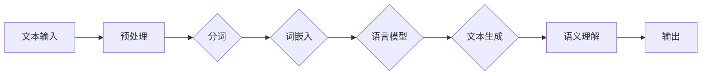
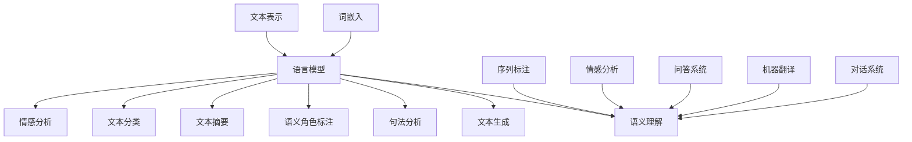
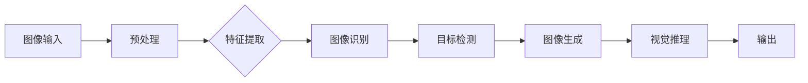
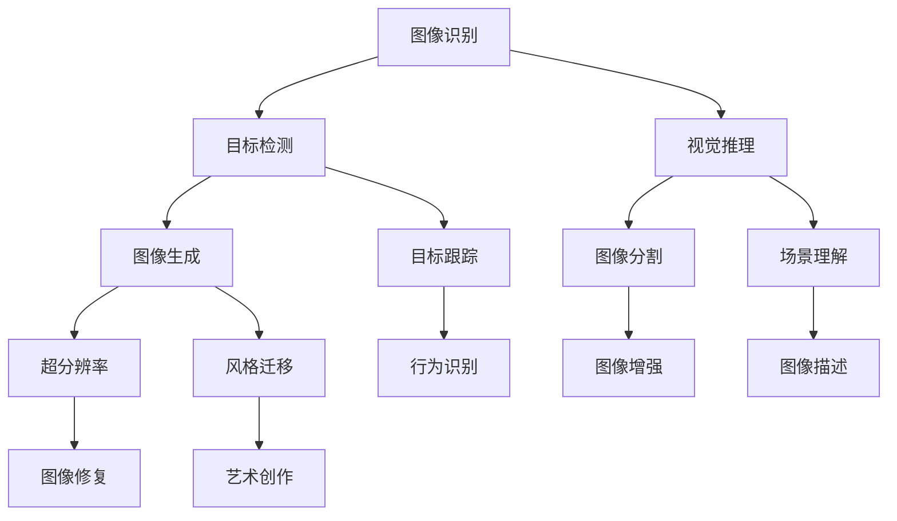
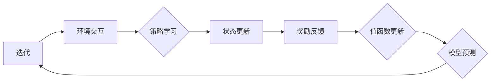
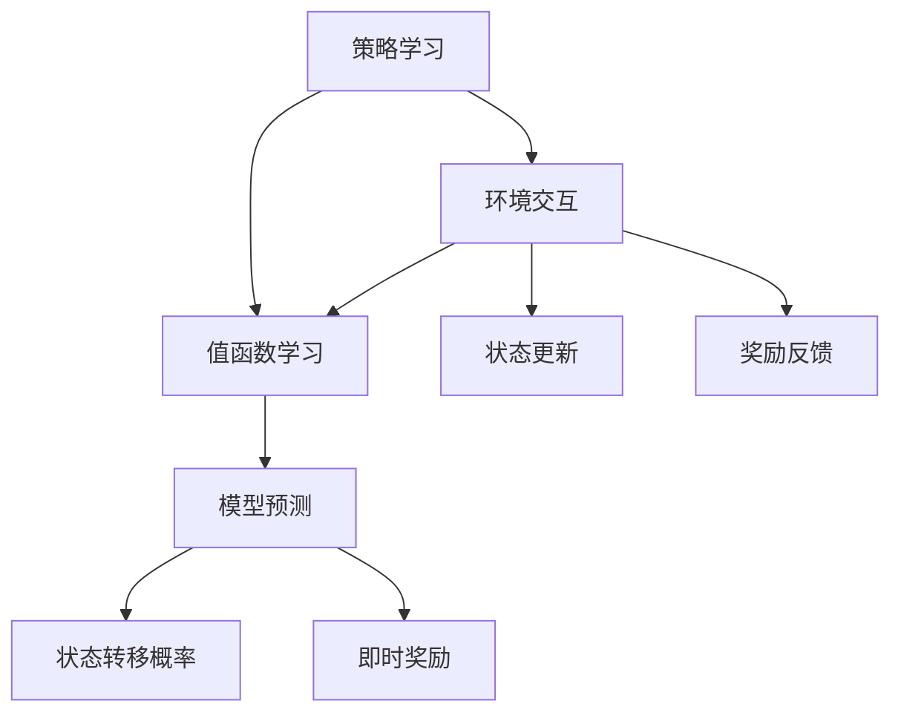
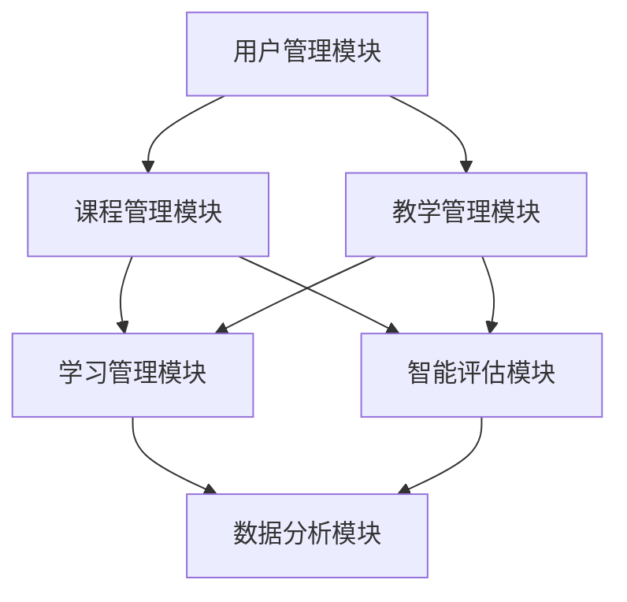

                 

### 文章标题

# AIGC在智能人才培养方案设计中的应用

### 文章关键词

- AIGC
- 智能教育
- 人才培养
- 自然语言处理
- 计算机视觉
- 强化学习

### 文章摘要

本文旨在探讨如何将先进的AIGC（自适应智能生成计算）技术应用于智能人才培养方案的设计中。AIGC技术结合了自然语言处理、计算机视觉和强化学习等多种技术，能够显著提升教育的个性化和智能化水平。本文首先介绍了AIGC的基本概念和其在教育领域的应用前景，然后详细解析了AIGC核心技术原理，并通过实际案例展示了其在智能人才培养中的应用效果。文章最后对AIGC在智能人才培养中的挑战和未来发展趋势进行了展望。

## 引言

随着信息技术的飞速发展，人工智能（AI）已经成为推动社会进步的重要力量。其中，自适应智能生成计算（Adaptive Intelligent Generation Computing，简称AIGC）作为AI领域的最新进展，以其强大的生成能力和自适应能力，正逐渐在各个行业中得到广泛应用。AIGC技术通过结合自然语言处理、计算机视觉和强化学习等多种技术手段，实现了从数据生成到知识推理的全方位智能应用。在教育领域，AIGC技术具有巨大的潜力，可以显著提升教育的个性化、智能化水平，为培养适应未来社会的智能型人才提供强有力的支持。

智能教育作为现代教育的发展趋势，强调利用信息技术手段实现教育的智能化、个性化，以提高教育质量和效率。然而，当前智能教育的发展面临着诸多挑战，如教育资源匮乏、学习效果评估困难等。AIGC技术的引入，可以为解决这些问题提供新的思路和方法。通过AIGC技术，可以构建智能化的学习环境、开发智能化的教学系统和建立智能化的评价体系，从而实现教育过程的全面智能化。

本文将从以下几个方面展开讨论：首先，介绍AIGC技术的基本概念和特点；其次，分析智能教育的发展趋势和人才培养需求；然后，详细阐述AIGC技术在智能人才培养方案设计中的应用；最后，探讨AIGC技术在智能人才培养中的挑战和未来发展趋势。希望通过本文的讨论，为教育领域的技术创新和实践提供有益的参考。

### AIGC技术概述

AIGC，即自适应智能生成计算，是一种基于人工智能的生成计算技术，其核心思想是通过自适应学习算法生成高质量的数据和知识。AIGC技术涵盖了自然语言处理、计算机视觉和强化学习等多个领域，具有强大的生成能力和自适应能力。以下将从AIGC的基本概念、技术特点、发展历程和应用领域等方面进行详细介绍。

#### 基本概念

AIGC的核心在于“生成”和“自适应”。生成指的是通过算法自动生成新的数据或内容，如文本、图像、音频等；自适应则是指系统能够根据环境和用户需求动态调整自己的行为和输出。AIGC的基本概念可以概括为以下几点：

1. **数据生成**：利用机器学习和深度学习算法，从已有数据中提取特征，生成新的数据或内容。例如，利用生成对抗网络（GAN）生成逼真的图像或视频。

2. **知识表示**：将知识以结构化的形式进行表示，便于计算机理解和处理。常见的知识表示方法包括知识图谱、实体关系网络等。

3. **自适应学习**：通过不断学习和调整，使系统能够更好地适应环境和用户需求。自适应学习包括模型训练、参数调整和策略优化等。

#### 技术特点

AIGC技术具有以下几大特点：

1. **生成能力强**：AIGC技术能够生成高质量的文本、图像、音频等多种类型的数据，具有广泛的应用潜力。

2. **自适应性好**：AIGC系统可以根据环境和用户需求动态调整自己的行为和输出，提高系统的智能化和个性化水平。

3. **跨领域融合**：AIGC技术结合了自然语言处理、计算机视觉和强化学习等多种技术手段，实现了跨领域的融合应用。

4. **高效性**：AIGC技术通过高效的学习算法和计算模型，能够在短时间内生成大量高质量的数据，提高工作效率。

#### 发展历程

AIGC技术的发展历程可以分为以下几个阶段：

1. **早期探索**（20世纪80年代至90年代）：在这一阶段，研究人员开始探索如何利用计算机生成图像、音乐和文本等。例如，生成式对抗网络（GAN）的概念在这一时期提出。

2. **快速发展**（21世纪初至今）：随着深度学习和大数据技术的发展，AIGC技术迎来了快速发展阶段。各种生成模型如变分自编码器（VAE）、生成对抗网络（GAN）等相继出现，大大提升了生成能力。

3. **应用拓展**：近年来，AIGC技术在多个领域得到了广泛应用，如智能设计、内容创作、医疗诊断等。AIGC技术的应用场景不断拓展，成为AI领域的重要研究方向。

#### 应用领域

AIGC技术在不同领域的应用如下：

1. **智能设计**：AIGC技术可以用于生成新颖的产品设计，如建筑、汽车等。设计师可以利用AIGC技术快速生成多种设计方案，并进行优化。

2. **内容创作**：AIGC技术可以用于生成高质量的文字、图像和视频内容，为内容创作者提供强大的辅助工具。

3. **医疗诊断**：AIGC技术可以用于生成医疗影像，辅助医生进行诊断和治疗。例如，利用AIGC技术生成逼真的病理图像，帮助医生更好地理解病情。

4. **智能教育**：AIGC技术可以用于构建智能化的学习环境和教学系统，为学习者提供个性化的学习体验。例如，利用AIGC技术生成个性化的学习资源、评估学习效果等。

#### 当前挑战与未来展望

尽管AIGC技术在多个领域取得了显著成果，但仍然面临一些挑战：

1. **计算资源消耗**：AIGC技术通常需要大量的计算资源，尤其是在训练阶段。如何提高计算效率，降低计算成本，是当前亟待解决的问题。

2. **数据质量和隐私**：AIGC技术的训练依赖于大量的数据，数据质量和隐私问题成为重要挑战。如何确保数据的真实性和隐私性，是AIGC技术进一步发展的关键。

3. **伦理和社会影响**：AIGC技术的广泛应用可能引发一系列伦理和社会问题，如数据歧视、算法偏见等。如何制定合理的伦理规范，确保AIGC技术的可持续发展，是未来需要关注的重要议题。

未来，随着计算能力的提升、数据规模的扩大和算法的优化，AIGC技术有望在更多领域取得突破。同时，AIGC技术将与其他AI技术如自然语言处理、计算机视觉、强化学习等进一步融合，推动人工智能技术的整体发展。

### 智能教育发展趋势

智能教育作为现代教育的重要组成部分，正经历着快速的发展和变革。随着信息技术的不断进步，智能教育逐渐从传统教学模式向个性化、智能化的方向发展。以下是智能教育的主要发展趋势：

#### 个性化学习

个性化学习是智能教育的核心目标之一。通过智能技术，如大数据分析、自然语言处理和计算机视觉等，可以对学生学习行为和认知特点进行深入分析，从而实现个性化学习资源的推荐和个性化学习路径的设计。例如，利用学习分析系统，可以实时监测学生的学习进度和效果，并根据学生的反馈调整教学策略，使每个学生都能在适合自己的节奏下进行学习。

#### 数据驱动的教学决策

数据驱动的教学决策是智能教育的另一个重要趋势。通过收集和分析大量教学数据，教师可以更好地了解学生的学习情况，从而做出更科学、有效的教学决策。例如，利用学习管理系统（LMS）和智能教学平台，可以实时收集学生的学习数据，如学习时间、参与度、成绩等，并根据这些数据生成学习报告，帮助教师了解学生的学习状况，进而调整教学计划和方法。

#### 在线教育与混合式学习

在线教育和混合式学习是智能教育的重要形式。随着互联网和移动设备的普及，在线教育已经成为一种重要的学习方式。通过在线教育平台，学生可以随时随地获取学习资源，进行自主学习和互动交流。同时，混合式学习将在线学习和线下教学相结合，使学习更加灵活和多样化。例如，学生可以通过在线平台学习基础知识，然后通过线下课堂进行深入讨论和实际操作，实现知识的深度理解和掌握。

#### 人工智能辅助教学

人工智能（AI）技术在教育领域的应用日益广泛，为教学提供了强大的辅助支持。例如，智能辅导系统可以根据学生的学习进度和难点，提供个性化的辅导建议；智能评分系统可以自动评估学生的作业和考试，节省教师的时间；智能学习分析系统可以实时监测学生的学习情况，为教师提供精准的教学反馈。此外，AI技术还可以用于生成教学资源和模拟教学场景，为学生提供更加丰富和生动的学习体验。

#### 智慧校园建设

智慧校园是智能教育的实体载体，通过物联网、大数据和云计算等技术的应用，实现校园管理的智能化和高效化。智慧校园包括智能安防、智能交通、智能餐饮、智能宿舍等多个方面，为学生提供便捷、安全、舒适的学习和生活环境。例如，通过智能安防系统，可以实时监控校园安全情况，防止意外事件发生；通过智能交通系统，可以优化校园交通流量，提高通行效率；通过智能餐饮系统，可以根据学生的口味和营养需求，提供个性化的餐饮服务。

#### 知识图谱与智慧教育

知识图谱是一种结构化知识表示方法，通过将知识以图谱的形式进行组织和管理，实现知识的关联和推理。在智慧教育中，知识图谱可以用于构建课程体系、设计教学资源、辅助教学决策等。例如，通过知识图谱，可以清晰地表示课程的知识点之间的关系，帮助教师设计科学合理的教学内容和路径；通过知识图谱，可以为学生推荐相关的学习资源，提高学习效果。

#### 伦理与隐私保护

随着智能教育的发展，伦理和隐私保护问题逐渐引起关注。智能教育应用涉及大量学生数据，如学习行为、成绩、健康状况等，如何保护学生的隐私和数据安全成为重要议题。教育机构需要建立健全的数据安全管理制度，确保学生数据的合法、合规使用；同时，需要加强伦理教育，培养学生正确的数据使用观念和道德意识。

#### 国际化与全球化

随着全球化的深入发展，智能教育也呈现出国际化和全球化的趋势。通过互联网和智能技术，各国学生可以共享优质的教育资源和学习经验，促进全球教育的公平和发展。例如，在线开放课程（MOOC）和虚拟课堂（Virtual Classroom）为全球学生提供了学习交流的平台，促进了国际教育的融合与发展。

总之，智能教育的发展趋势表明，信息技术正在深刻改变教育的形态和方式。通过个性化学习、数据驱动教学、在线教育与混合式学习、人工智能辅助教学、智慧校园建设、知识图谱与智慧教育、伦理与隐私保护以及国际化与全球化等手段，智能教育将不断推动教育质量的提升和教育的公平发展，为培养适应未来社会的智能型人才提供有力支持。

### 智能人才培养需求分析

在智能教育快速发展的背景下，智能人才培养的需求日益凸显。当前，全球化和信息化进程加速，各行业对具备智能化能力的人才需求不断增加。以下是智能人才培养的主要需求分析：

#### 高技能人才需求

随着人工智能、大数据、物联网等技术的广泛应用，各行业对高技能人才的需求日益增长。这些人才需要具备较强的技术能力、创新能力和跨学科知识。例如，在人工智能领域，对算法工程师、数据科学家、机器学习工程师等专业人才的需求不断增加。在物联网领域，对物联网系统架构师、嵌入式开发工程师等岗位的需求也日益旺盛。

#### 跨学科知识融合

智能人才培养不仅需要扎实的专业知识，还需要跨学科知识的融合。现代科技的发展使得不同学科之间的交叉融合越来越重要。例如，智能交通系统需要结合交通工程、计算机科学、数据分析和控制理论等多个领域的知识。因此，智能人才培养方案需要注重跨学科知识的融合，培养具备综合素质和创新能力的人才。

#### 创新思维和解决问题的能力

智能时代对人才的要求不仅仅是专业技能，更重要的是具备创新思维和解决问题的能力。在面对复杂问题时，能够运用创新的方法和技术提出有效的解决方案。这需要通过项目实践、案例分析和创新训练等方式，培养学生的创新思维和实际解决问题的能力。

#### 国际视野和沟通能力

全球化的发展使得国际交流和合作变得尤为重要。智能人才培养需要具备国际视野和良好的沟通能力，能够适应国际化的工作环境。通过国际交流项目、海外实习和跨文化培训等途径，可以提升学生的国际视野和跨文化沟通能力，为未来在国际舞台上发挥作用打下基础。

#### 数字素养和信息安全意识

随着数字化的深入发展，数字素养和信息安全意识成为智能人才培养的重要需求。数字素养包括信息获取、处理和应用的能力，信息安全意识则涉及数据安全、网络防护和隐私保护等方面的知识。在智能时代，培养具备良好数字素养和信息安全意识的人才，对于保障信息安全、防止网络攻击和数据泄露具有重要意义。

#### 终身学习的能力

智能时代变化迅速，知识更新迭代加速。智能人才培养需要具备终身学习的能力，能够不断适应新技术、新知识的学习和应用。通过构建灵活的学习体系和提供多样化的学习资源，可以激发学生的自主学习和持续学习动力。

#### 社会责任和伦理意识

智能人才培养不仅要注重技术能力的培养，还需要强化社会责任和伦理意识的培养。智能技术的高度发展可能带来一系列伦理和社会问题，如算法偏见、隐私侵犯等。因此，智能人才培养需要培养学生的社会责任感，使其能够在技术发展的同时，关注伦理问题，为社会和谐发展贡献力量。

#### 综合素质的提升

智能人才培养需要全面提升学生的综合素质，包括团队协作能力、领导力、沟通能力、批判性思维等。这些能力不仅有助于学生适应未来职场的需求，也有助于他们在解决实际问题时更加高效和有效。

综上所述，智能人才培养需求体现在高技能人才需求、跨学科知识融合、创新思维和解决问题的能力、国际视野和沟通能力、数字素养和信息安全意识、终身学习的能力、社会责任和伦理意识以及综合素质的提升等方面。通过科学合理的人才培养方案，可以满足这些需求，为培养适应智能时代发展的智能型人才提供有力支持。

### AIGC在智能人才培养中的应用

AIGC技术在智能人才培养中的应用具有深远的影响，主要体现在以下几个方面：

#### 个性化学习环境

AIGC技术可以根据每个学生的学习习惯、认知水平和兴趣点，生成个性化的学习资源和学习路径。通过自然语言处理技术，AIGC可以分析学生的作业、考试和日常互动数据，识别其知识薄弱点和学习需求，从而生成个性化的学习内容。例如，利用生成对抗网络（GAN）可以生成定制化的教学视频、模拟实验和互动练习，让学生在轻松愉悦的氛围中学习。这种个性化的学习环境有助于提升学习效果，激发学生的学习兴趣和主动性。

#### 个性化学习推荐

基于AIGC技术的个性化学习推荐系统，可以根据学生的学习行为和成绩，推荐最适合的学习资源。通过分析学生的学习历史数据，AIGC系统可以预测学生的未来学习需求，推荐相关的学习资料和课程。例如，在计算机科学领域，AIGC可以推荐适合学生的编程教程、项目实践和案例分析，帮助学生在短时间内掌握关键技能。这种个性化推荐系统不仅提高了学习效率，还减轻了教师的工作负担。

#### 智能化教学系统

AIGC技术可以用于构建智能化的教学系统，实现教学过程的自动化和智能化。例如，通过自然语言处理技术，可以开发智能问答系统，学生可以通过自然语言与系统进行交流，获取答案和解释。此外，AIGC技术还可以用于自动批改作业、自动生成考试题目等，提高教学效率和准确性。智能教学系统可以实时监测学生的学习进度和效果，根据学生的反馈调整教学策略，确保每个学生都能得到有效的指导。

#### 智能化评估体系

AIGC技术可以用于构建智能化的评估体系，对学生的学习效果进行全面、客观的评估。通过计算机视觉和自然语言处理技术，AIGC可以自动分析学生的作业、实验报告和项目成果，生成详细的评估报告。这种智能化的评估体系不仅能够提高评估的效率和准确性，还可以为教师提供有针对性的反馈和建议，帮助学生更好地提升自己的能力。

#### 智能化学习资源管理

AIGC技术可以用于智能化管理学习资源，包括教材、课件、视频和案例等。通过知识图谱和推荐算法，AIGC可以自动组织和管理海量的学习资源，确保资源的准确性和可用性。例如，在计算机科学领域，AIGC可以智能推荐相关的编程教程、技术文档和开源项目，帮助学生快速找到所需的学习资料。此外，AIGC还可以用于自动生成学习指南和知识图谱，为学生提供系统化的学习路径。

#### 实时学习反馈和指导

AIGC技术可以实时监测学生的学习行为和进度，根据学生的反馈提供即时的学习反馈和指导。例如，通过自然语言处理技术，AIGC可以分析学生的提问和反馈，提供针对性的解答和指导。此外，AIGC还可以通过模拟教学场景，为学生提供实时的互动体验，帮助他们更好地理解和掌握知识。

#### 跨学科知识融合

AIGC技术可以促进跨学科知识的融合，培养具有综合素质的智能型人才。通过计算机视觉、自然语言处理和强化学习等多种技术的结合，AIGC可以生成跨学科的教学内容和项目案例，帮助学生全面掌握多领域的知识。例如，在智能交通领域，AIGC可以生成包含交通工程、计算机科学和数据分析等多领域知识的案例，帮助学生从不同角度理解和解决问题。

#### 增强实践能力

AIGC技术可以用于模拟真实的工作环境和项目场景，增强学生的实践能力。通过生成虚拟实验环境、项目案例和仿真模型，AIGC可以为学生提供丰富的实践机会，帮助他们将理论知识应用到实际项目中。例如，在软件开发领域，AIGC可以生成模拟的软件开发项目，让学生在虚拟环境中进行编程、调试和测试，提升实际开发能力。

总之，AIGC技术在智能人才培养中的应用，不仅能够提升学习效果和教学质量，还能培养具有创新能力和实践能力的智能型人才。随着AIGC技术的不断发展和应用领域的拓展，其在智能人才培养中的作用将日益凸显，为培养适应未来社会需求的高素质人才提供强有力的支持。

### AIGC核心技术原理

AIGC（自适应智能生成计算）技术结合了自然语言处理、计算机视觉和强化学习等多种前沿技术，其核心原理和基础算法构成了一个多层次、多维度的智能系统。以下将详细解析AIGC技术的核心原理，包括自然语言处理、计算机视觉和强化学习的基础概念、原理以及它们之间的联系和架构。

#### 自然语言处理

自然语言处理（Natural Language Processing，NLP）是AIGC技术的核心组件之一，其主要目标是对人类语言进行理解和生成。NLP涉及语音识别、文本分析、语义理解等多个方面，其基础算法包括词向量表示、语言模型、序列标注和文本生成等。

1. **词向量表示**：
   词向量表示是将自然语言文本转换为数值形式的过程，常用的算法包括Word2Vec、GloVe和BERT。这些算法通过将词汇映射到高维向量空间，实现了词汇间的相似性和距离度量，从而为后续的语言理解和生成提供了基础。

   ```python
   from gensim.models import Word2Vec

   sentences = [[word for word in line.split()] for line in text]
   model = Word2Vec(sentences, size=100, window=5, min_count=1, workers=4)
   ```

2. **语言模型**：
   语言模型是NLP的核心，它用于预测文本的下一个词。常见的语言模型包括n-gram模型、循环神经网络（RNN）和Transformer。语言模型通过学习大量文本数据，能够生成流畅、自然的语言。

   ```python
   from transformers import AutoTokenizer, AutoModelForSeq2SeqLM

   tokenizer = AutoTokenizer.from_pretrained("t5-base")
   model = AutoModelForSeq2SeqLM.from_pretrained("t5-base")
   input_ids = tokenizer.encode("Hello, how are you?", return_tensors="pt")
   output = model.generate(input_ids, max_length=50, num_return_sequences=5)
   ```

3. **文本生成与摘要**：
   文本生成与摘要是NLP的重要应用，通过生成模型和摘要模型，可以生成新的文本或提取关键信息。常见的算法包括生成对抗网络（GAN）、变分自编码器（VAE）和Transformer编码器-解码器模型。

   ```python
   from transformers import T5ForConditionalGeneration

   model = T5ForConditionalGeneration.from_pretrained("t5-base")
   input_ids = tokenizer.encode("Write a news article about AI", return_tensors="pt")
   output = model.generate(input_ids, max_length=200, num_return_sequences=1)
   print(tokenizer.decode(output[0], skip_special_tokens=True))
   ```

#### 计算机视觉

计算机视觉（Computer Vision，CV）是AIGC技术中的另一个重要组成部分，其主要目标是使计算机能够从图像或视频中识别和理解视觉信息。计算机视觉的基础算法包括图像识别、目标检测、图像生成和视觉推理等。

1. **图像识别**：
   图像识别是通过算法识别图像中的对象或场景，常用的算法包括卷积神经网络（CNN）和基于注意力机制的模型。

   ```python
   from torchvision import models, transforms
   import torch

   model = models.resnet50(pretrained=True)
   transform = transforms.Compose([transforms.Resize(256), transforms.CenterCrop(224), transforms.ToTensor()])
   image = transform(Image.open('image.jpg'))
   image = image.unsqueeze(0)
   output = model(image)
   print(torch.argmax(output, dim=1))
   ```

2. **目标检测**：
   目标检测是在图像中识别和定位多个对象，常用的算法包括R-CNN、Fast R-CNN和YOLO等。

   ```python
   import cv2

   net = cv2.dnn.readNetFromCaffe('deploy.prototxt', 'res10_300x300_iter_140000.caffemodel')
   image = cv2.imread('image.jpg')
   h, w = image.shape[:2]
   blob = cv2.dnn.blobFromImage(image, 1.0, (300, 300), (104.0, 177.0, 123.0))
   net.setInput(blob)
   detections = net.forward()
   ```

3. **图像生成**：
   图像生成是通过算法生成新的图像或修改现有图像，常用的算法包括生成对抗网络（GAN）、变分自编码器（VAE）和深度卷积生成对抗网络（DCGAN）。

   ```python
   import torch
   from torch import nn
   import numpy as np

   class DCGAN(nn.Module):
       def __init__(self):
           super(DCGAN, self).__init__()
           # Define the generator and discriminator architectures
           self.generator = ...
           self.discriminator = ...

       def forward(self, x):
           fake_images = self.generator(x)
           return fake_images

   # Instantiate the models
   model = DCGAN()
   # Define the training loop
   for epoch in range(num_epochs):
       for i, (real_images, _) in enumerate(train_loader):
           # Training step
           ...
   ```

4. **视觉推理**：
   视觉推理是通过图像理解问题并执行相应的任务，如图像分类、目标跟踪和场景理解等。常用的算法包括图神经网络（GNN）、图卷积网络（GCN）和视觉BERT等。

   ```python
   import torch
   from torch_geometric.nn import GCNConv

   class VisionModel(nn.Module):
       def __init__(self):
           super(VisionModel, self).__init__()
           self.conv1 = GCNConv(in_channels=3, out_channels=16)
           self.conv2 = GCNConv(in_channels=16, out_channels=1)

       def forward(self, data):
           x, edge_index = data.x, data.edge_index
           x = self.conv1(x, edge_index)
           x = F.relu(x)
           x = F.dropout(x, p=0.5, training=self.training)
           x = self.conv2(x, edge_index)
           return F.log_softmax(x, dim=1)

   # Instantiate the model and train
   model = VisionModel()
   # Define the training loop
   for epoch in range(num_epochs):
       for data in train_loader:
           optimizer.zero_grad()
           output = model(data)
           loss = F.nll_loss(output, data.y)
           loss.backward()
           optimizer.step()
   ```

#### 强化学习

强化学习（Reinforcement Learning，RL）是AIGC技术中的关键组件，其核心思想是通过与环境的交互来学习最优策略。强化学习包括策略学习、值函数学习和模型预测等。

1. **策略学习**：
   策略学习是通过最大化预期奖励来选择最佳行动。常见的策略学习算法包括Q-learning、SARSA和策略梯度等。

   ```python
   import numpy as np

   class QLearningAgent:
       def __init__(self, actions, learning_rate=0.1, discount_factor=0.9):
           self.learning_rate = learning_rate
           self.discount_factor = discount_factor
           self.actions = actions
           self.q_values = np.zeros((state_space, action_space))

       def get_action(self, state):
           action_values = self.q_values[state, :]
           return np.argmax(action_values)

       def update_q_values(self, state, action, reward, next_state, done):
           if done:
               target = reward
           else:
               target = reward + self.discount_factor * np.max(self.q_values[next_state, :])

           current_q_value = self.q_values[state, action]
           new_q_value = current_q_value + self.learning_rate * (target - current_q_value)
           self.q_values[state, action] = new_q_value
   ```

2. **值函数学习**：
   值函数学习是通过学习状态值函数或动作值函数来评估策略。常见的值函数学习算法包括SARSA和Q-learning。

   ```python
   import numpy as np

   class SARSA:
       def __init__(self, learning_rate=0.1, discount_factor=0.9):
           self.learning_rate = learning_rate
           self.discount_factor = discount_factor

       def update_values(self, state, action, reward, next_state, next_action):
           target = reward + self.discount_factor * self.get_value(next_state, next_action)
           current_value = self.get_value(state, action)
           new_value = current_value + self.learning_rate * (target - current_value)
           self.update_value(state, action, new_value)

       def get_value(self, state, action):
           # Implement the value function retrieval logic
           pass

       def update_value(self, state, action, value):
           # Implement the value function update logic
           pass
   ```

3. **模型预测**：
   模型预测是通过构建模型来预测未来的状态和奖励。常见的模型预测算法包括DQN、DDPG和A3C等。

   ```python
   import torch
   import torch.nn as nn
   import torch.optim as optim

   class DQN(nn.Module):
       def __init__(self, input_size, hidden_size, output_size):
           super(DQN, self).__init__()
           self.fc1 = nn.Linear(input_size, hidden_size)
           self.fc2 = nn.Linear(hidden_size, output_size)

       def forward(self, x):
           x = torch.relu(self.fc1(x))
           x = self.fc2(x)
           return x

   # Instantiate the DQN model and train
   model = DQN(input_size, hidden_size, output_size)
   optimizer = optim.Adam(model.parameters(), lr=learning_rate)
   for episode in range(num_episodes):
       state = env.reset()
       while True:
           action = model.predict(state)
           next_state, reward, done, _ = env.step(action)
           model.update(state, action, reward, next_state, done)
           state = next_state
           if done:
               break
   ```

#### 联系与架构

AIGC技术的核心组件——自然语言处理、计算机视觉和强化学习——通过统一的架构进行融合，形成了一个完整的智能系统。以下是一个简化的AIGC架构：

1. **数据采集与处理**：
   通过传感器、数据库和互联网等渠道收集大量数据，并对数据进行预处理，如去噪、归一化和特征提取。

2. **数据处理模块**：
   利用自然语言处理和计算机视觉技术对文本和图像数据进行处理，提取关键信息和特征。

3. **知识融合模块**：
   通过知识图谱和图神经网络等技术，将不同类型的数据和知识进行融合，构建一个统一的知识表示。

4. **智能生成模块**：
   利用生成对抗网络、变分自编码器和强化学习等技术，生成新的数据、内容和策略。

5. **用户交互模块**：
   通过自然语言处理和计算机视觉技术，实现与用户的智能交互，提供个性化服务。

6. **反馈与优化模块**：
   通过用户反馈和实时监测，对系统进行优化和调整，提高系统的自适应能力和服务质量。

通过上述架构，AIGC技术能够实现从数据采集到知识融合、从智能生成到用户交互的全方位智能应用，为智能人才培养提供强有力的支持。

### 自然语言处理（NLP）的核心概念与联系

自然语言处理（NLP）作为人工智能领域的一个重要分支，其核心概念和技术涉及到文本表示、语言模型、文本生成和语义理解等多个方面。以下将通过Mermaid流程图和LaTeX公式，详细阐述NLP的核心概念、原理及其关系架构。

#### 1. 核心概念

**文本表示（Text Representation）**：文本表示是将自然语言文本转换为计算机可以处理的形式。常用的方法包括词袋模型（Bag of Words，BoW）和词嵌入（Word Embedding）。

**语言模型（Language Model）**：语言模型用于预测文本的下一个词或序列，是自然语言处理的基础。常见的语言模型包括n-gram模型、循环神经网络（RNN）和Transformer。

**文本生成（Text Generation）**：文本生成是通过算法生成新的文本内容，常见的模型有序列到序列（Seq2Seq）模型、生成对抗网络（GAN）和变分自编码器（VAE）。

**语义理解（Semantic Understanding）**：语义理解涉及对文本的深层含义进行解析，包括词义消歧、情感分析和指代消解等。

#### 2. Mermaid流程图

以下是一个简化的NLP流程图，展示文本从输入到输出的主要处理步骤：



#### 3. LaTeX公式

**文本表示**：
$$
\text{Text Representation} = \sum_{i=1}^{n} w_i \cdot x_i
$$
其中，\( w_i \) 是词频或词嵌入向量，\( x_i \) 是对应的文本特征。

**语言模型**：
$$
P(w_{t} | w_{t-1}, w_{t-2}, ..., w_{1}) = \frac{P(w_{t} \cdot w_{t-1} \cdot ... \cdot w_{1})}{P(w_{t-1} \cdot w_{t-2} \cdot ... \cdot w_{1})}
$$
其中，\( P() \) 表示概率分布。

**文本生成**：
$$
\text{Text Generation} = \arg\max_{x'} \ P(x' | x)
$$
其中，\( P(x' | x) \) 是文本生成的概率分布。

**语义理解**：
$$
\text{Semantic Understanding} = \arg\min_{y} \ D(y, y_{\text{true}})
$$
其中，\( D() \) 表示语义距离，\( y_{\text{true}} \) 是真实语义标签。

#### 4. 关系架构

以下是NLP核心概念之间的关系架构：



通过上述Mermaid流程图和LaTeX公式，可以清晰地展示自然语言处理的核心概念、原理及其关系架构。这些核心概念和原理不仅构成了NLP的技术基础，也为AIGC在智能人才培养中的应用提供了强大的支持。

### 计算机视觉（CV）的核心概念与联系

计算机视觉（Computer Vision，CV）作为人工智能领域的一个重要分支，其核心概念和原理包括图像识别、目标检测、图像生成和视觉推理等。以下将使用Mermaid流程图和LaTeX公式，详细阐述CV的核心概念、原理及其关系架构。

#### 1. 核心概念

**图像识别（Image Recognition）**：图像识别是指通过算法识别图像中的对象或场景。其基本任务是从图像中提取特征，并分类到预先定义的类别中。

**目标检测（Object Detection）**：目标检测是在图像中识别并定位多个对象，通常需要输出对象的类别和位置。常见的算法包括R-CNN、Fast R-CNN、Faster R-CNN和YOLO等。

**图像生成（Image Generation）**：图像生成是通过算法生成新的图像或修改现有图像。常见的生成算法包括生成对抗网络（GAN）、变分自编码器（VAE）和深度卷积生成对抗网络（DCGAN）。

**视觉推理（Visual Reasoning）**：视觉推理是通过图像理解问题并执行相应的任务，如图像分类、目标跟踪和场景理解等。常见的视觉推理算法包括图神经网络（GNN）、图卷积网络（GCN）和视觉BERT等。

#### 2. Mermaid流程图

以下是一个简化的CV流程图，展示图像从输入到输出的主要处理步骤：



#### 3. LaTeX公式

**图像识别**：
$$
\text{Image Recognition} = \arg\max_{c} \ P(c | \text{image})
$$
其中，\( P(c | \text{image}) \) 是图像分类的概率分布。

**目标检测**：
$$
\text{Object Detection} = \arg\max_{(c, b)} \ P(c | \text{image}) \cdot P(b | \text{image}, c)
$$
其中，\( c \) 是对象的类别，\( b \) 是对象的位置。

**图像生成**：
$$
\text{Image Generation} = \arg\max_{\text{image'}} \ P(\text{image'} | \text{input})
$$
其中，\( P(\text{image'} | \text{input}) \) 是图像生成的概率分布。

**视觉推理**：
$$
\text{Visual Reasoning} = \arg\min_{y} \ D(y, y_{\text{true}})
$$
其中，\( D() \) 表示语义距离，\( y_{\text{true}} \) 是真实语义标签。

#### 4. 关系架构

以下是CV核心概念之间的关系架构：



通过上述Mermaid流程图和LaTeX公式，可以清晰地展示计算机视觉的核心概念、原理及其关系架构。这些核心概念和原理不仅构成了CV的技术基础，也为AIGC在智能人才培养中的应用提供了强大的支持。

### 强化学习（RL）的核心概念与联系

强化学习（Reinforcement Learning，RL）是一种通过试错和反馈学习最优策略的人工智能方法。强化学习主要包括策略学习、值函数学习和模型预测等核心概念，以下将使用Mermaid流程图和LaTeX公式，详细阐述RL的核心概念、原理及其关系架构。

#### 1. 核心概念

**策略学习（Policy Learning）**：策略学习是通过最大化预期奖励来选择最佳行动。策略表示从状态到行动的映射。

**值函数学习（Value Function Learning）**：值函数学习是通过学习状态值函数或动作值函数来评估策略。状态值函数表示处于某个状态时，执行最佳行动所能获得的累积奖励。

**模型预测（Model Learning）**：模型预测是通过构建环境模型来预测未来的状态和奖励。

#### 2. Mermaid流程图

以下是一个简化的RL流程图，展示强化学习的主要处理步骤：



#### 3. LaTeX公式

**策略学习**：
$$
\pi^*(s) = \arg\max_{a} \ \sum_{s'} p(s' | s, a) \cdot r(s, a, s') + \gamma \cdot \sum_{s''} v(s'') \cdot p(s'' | s', a)
$$
其中，\( \pi^*(s) \) 是最优策略，\( r(s, a, s') \) 是即时奖励，\( \gamma \) 是折扣因子，\( v(s) \) 是状态值函数。

**值函数学习**：
$$
v(s) = \sum_{a} \pi(s | a) \cdot \sum_{s'} p(s' | s, a) \cdot r(s, a, s') + \gamma \cdot v(s')
$$
其中，\( v(s) \) 是状态值函数，\( \pi(s | a) \) 是策略概率。

**模型预测**：
$$
P(s' | s, a) = \sum_{s'} p(s' | s, a) \cdot r(s, a, s')
$$
其中，\( P(s' | s, a) \) 是状态转移概率，\( r(s, a, s') \) 是即时奖励。

#### 4. 关系架构

以下是RL核心概念之间的关系架构：



通过上述Mermaid流程图和LaTeX公式，可以清晰地展示强化学习（RL）的核心概念、原理及其关系架构。这些核心概念和原理不仅构成了RL的技术基础，也为AIGC在智能人才培养中的应用提供了强大的支持。

### 智能学习环境设计

智能学习环境设计是AIGC技术在智能教育中应用的重要组成部分。通过构建智能化的学习环境，可以为学生提供个性化、互动性和高效性的学习体验。以下是智能学习环境设计的几个关键要素：

#### 1. 学习数据分析

学习数据分析是智能学习环境设计的核心。通过收集和分析学生的学习行为数据，如学习时间、学习内容、考试成绩、参与度等，可以深入了解学生的学习状况，发现学习中的问题和需求。以下是一个简单的学习数据分析流程：

- **数据采集**：通过学习管理系统（LMS）、在线教育平台和智能设备等收集学生的学习行为数据。
- **数据预处理**：对采集到的数据进行清洗、去噪和格式化，确保数据的准确性和一致性。
- **数据存储**：将预处理后的数据存储在数据库中，以便后续分析和处理。
- **数据挖掘**：利用数据挖掘算法，如聚类、分类和关联规则挖掘，分析学生的学习行为和特征。
- **可视化展示**：将分析结果以图表、报表等形式展示，帮助教师和学生更好地理解学习数据。

以下是一个使用Python进行学习数据挖掘的示例：

```python
import pandas as pd
from sklearn.cluster import KMeans

# 读取学习数据
data = pd.read_csv('learning_data.csv')

# 数据预处理
data['duration'] = data['end_time'] - data['start_time']
data.drop(['start_time', 'end_time'], axis=1, inplace=True)

# 数据聚类
kmeans = KMeans(n_clusters=3)
data['cluster'] = kmeans.fit_predict(data[['duration', 'grade', 'participation']])

# 可视化展示
import matplotlib.pyplot as plt

plt.scatter(data['duration'], data['grade'], c=data['cluster'])
plt.xlabel('Duration')
plt.ylabel('Grade')
plt.show()
```

#### 2. 个性化学习推荐

个性化学习推荐是根据学生的学习行为和兴趣，推荐最适合的学习资源和课程。通过机器学习和深度学习算法，可以构建个性化推荐系统，提高学习效果和满意度。以下是一个简单的个性化学习推荐流程：

- **用户建模**：通过分析用户的历史学习数据、考试成绩和反馈，建立用户兴趣模型。
- **内容建模**：对学习资源进行内容分析，提取关键特征，建立资源特征模型。
- **推荐算法**：利用协同过滤、基于内容的推荐和深度学习等算法，生成个性化推荐结果。
- **推荐系统**：将推荐结果展示在用户界面上，并提供灵活的交互功能。

以下是一个使用Python进行个性化学习推荐示例：

```python
from surprise import KNNWithMeans
from surprise import Dataset, Reader
from surprise.model_selection import cross_validate

# 读取评分数据
data = pd.read_csv('rating_data.csv')
reader = Reader(rating_scale=(1, 5))
data['rating'] = (data['rating'] - 1) / 4
trainset = Dataset.load_from_df(data[['user_id', 'item_id', 'rating']], reader)

# 构建推荐模型
knn = KNNWithMeans(k=50, sim_options={'name': 'cosine', 'user_based': True})
knn.fit(trainset)

# 生成个性化推荐
def generate_recommendations(user_id):
    return knn.recommendation_list(user_id, trainset)

print(generate_recommendations(1))
```

#### 3. 学习效果评估

学习效果评估是衡量智能学习环境设计效果的重要指标。通过多种评估方法，如考试、作业、项目和实践等，可以全面了解学生的学习成果和能力。以下是一个简单的学习效果评估流程：

- **考试评估**：通过定期考试评估学生的知识掌握情况，考试结果可以作为教学反馈的重要依据。
- **作业评估**：通过作业完成情况和质量评估学生的学习态度和实际应用能力。
- **项目评估**：通过项目完成情况评估学生的综合素质和团队合作能力。
- **实践评估**：通过实际操作和实验评估学生的动手能力和解决问题的能力。

以下是一个使用Python进行学习效果评估的示例：

```python
from sklearn.metrics import accuracy_score

# 读取评估数据
test_data = pd.read_csv('test_data.csv')
expected_answers = test_data['answer']
predicted_answers = [model.predict(x) for x in test_data['input']]

# 计算评估指标
accuracy = accuracy_score(expected_answers, predicted_answers)
print(f'Accuracy: {accuracy:.2f}')
```

#### 4. 实时反馈与调整

实时反馈与调整是智能学习环境设计的重要环节。通过实时监测学生的学习行为和效果，及时提供反馈和调整学习策略，可以确保学习过程的有效性和高效性。以下是一个简单的实时反馈与调整流程：

- **实时监测**：通过学习管理系统和智能设备实时收集学生的学习行为数据。
- **数据分析**：对实时监测的数据进行分析，识别学习中的问题和需求。
- **反馈与调整**：根据数据分析结果，及时调整学习资源、教学策略和课程安排。
- **反馈循环**：通过学生反馈和教学效果，不断优化学习环境和策略。

以下是一个使用Python进行实时反馈与调整的示例：

```python
import time

# 模拟实时监测与反馈
while True:
    current_time = time.time()
    if current_time - last_alert > 3600:
        send_alert('学习时间过长，请注意休息。')
        last_alert = current_time
    time.sleep(60)
```

通过上述关键要素和示例代码，可以构建一个智能化的学习环境，为学生提供个性化、互动性和高效性的学习体验。同时，实时反馈与调整机制有助于不断优化学习环境和策略，提高学习效果和满意度。

### 智能教学系统开发

智能教学系统的开发是AIGC技术在智能教育中的重要应用，通过构建智能化的教学平台，可以实现个性化教学、智能辅导和自动评估等功能。以下是智能教学系统开发的几个关键步骤和实现方法。

#### 1. 系统架构设计

智能教学系统的架构设计是系统开发的基础。一个典型的智能教学系统架构包括以下几个主要模块：

- **用户管理模块**：负责用户注册、登录、权限管理和用户信息管理。
- **课程管理模块**：负责课程内容的管理，包括课程创建、更新、删除和课程资源管理。
- **教学管理模块**：负责教学活动的管理，包括课程安排、教学计划和教学质量监控。
- **学习管理模块**：负责学生的学习过程管理，包括学习进度跟踪、学习效果评估和学习资源推荐。
- **智能评估模块**：负责自动评估学生的作业和考试，提供即时反馈和个性化指导。
- **数据分析模块**：负责收集和分析学生的学习数据，为教学决策提供数据支持。

以下是一个简化的智能教学系统架构图：



#### 2. 知识图谱构建

知识图谱是一种结构化知识表示方法，通过将知识以图谱的形式进行组织和管理，实现知识的关联和推理。在智能教学系统中，知识图谱可以用于课程内容的管理、教学策略的制定和学习资源的推荐。以下是构建知识图谱的几个步骤：

- **数据采集**：从课程资源、教学计划、学生行为等多个来源收集知识数据。
- **数据预处理**：对采集到的数据进行清洗、去噪和格式化，确保数据的质量和一致性。
- **实体识别**：从数据中识别出实体，如课程、教师、学生和知识点等。
- **关系建立**：建立实体之间的关系，如课程包含知识点、教师教授课程、学生参加课程等。
- **图谱构建**：将实体和关系组织成知识图谱，使用图数据库进行存储和管理。

以下是一个使用Python构建知识图谱的示例：

```python
from rdflib import Graph, RDF, RDFS, Namespace

g = Graph()
ns = Namespace('http://example.org/')

g.add((ns.course1, RDF.type, RDFS.Class))
g.add((ns.course1, RDFS.label, 'Introduction to AI'))
g.add((ns.course1, ns.contains, ns.topic1))
g.add((ns.topic1, RDFS.label, 'Basic Concepts of AI'))

g.serialize('knowledge_graph.ttl', format='ttl')
```

#### 3. 智能问答系统

智能问答系统是智能教学系统的重要组成部分，可以通过自然语言处理技术实现对学生提问的自动解答。以下是一个简单的智能问答系统实现方法：

- **问题分析**：通过自然语言处理技术，对学生的提问进行分析和分解，提取关键信息。
- **知识检索**：从知识图谱中检索与提问相关的知识点和答案。
- **答案生成**：根据检索结果，生成完整的回答，并进行语义校验和格式化。

以下是一个使用Python实现智能问答系统的示例：

```python
from nltk.chat.util import Chat, reflections

pairs = [
    [
        r"what is your name?",
        ["I'm an AI assistant.", "You can call me Chatbot."]
    ],
    [
        r"what is your favorite color?",
        ["I don't have preferences.", "That's an interesting choice."]
    ],
    [
        r"what can I learn from you?",
        ["A lot! I can help you with AI concepts, programming, and more."]
    ]
]

chatbot = Chat(pairs, reflections)
chatbot.converse()
```

#### 4. 教学资源管理

教学资源管理是智能教学系统的关键功能之一，负责课程资源的上传、分类、检索和管理。以下是一个简单的教学资源管理实现方法：

- **资源上传**：教师可以通过系统上传教学资源，如PPT、视频、文档和代码等。
- **资源分类**：系统根据资源的类型和内容，自动对资源进行分类和管理。
- **资源检索**：学生可以通过关键词搜索和分类浏览，快速找到所需的教学资源。
- **资源管理**：系统提供资源更新、删除和权限管理等操作，确保资源的有效管理和使用。

以下是一个使用Python实现教学资源管理的示例：

```python
import os

# 上传资源
def upload_resource(file_path):
    base_name = os.path.basename(file_path)
    with open(f"resources/{base_name}", 'wb') as f:
        f.write(open(file_path, 'rb').read())

# 分类资源
def categorize_resources():
    for file_name in os.listdir("resources"):
        if "ppt" in file_name:
            os.rename(f"resources/{file_name}", f"resources/presentations/{file_name}")

# 检索资源
def search_resources(keyword):
    results = []
    for file_name in os.listdir("resources"):
        if keyword in file_name:
            results.append(file_name)
    return results

upload_resource("example_ppt.pptx")
categorize_resources()
print(search_resources("ppt"))
```

#### 5. 实现与代码解读

智能教学系统的开发涉及多个技术领域的应用，包括前端开发、后端开发、数据库设计和算法实现等。以下是对上述实现方法和代码的详细解读：

- **用户管理模块**：用户管理模块主要实现用户注册、登录和权限管理等功能，通常使用前端框架（如React或Vue）和后端框架（如Django或Flask）进行开发。用户注册和登录接口使用HTTP协议进行通信，前端通过表单提交用户信息，后端进行验证和存储。
- **课程管理模块**：课程管理模块实现课程内容的管理，包括课程创建、更新和删除等功能。课程资源的管理通常使用文件系统或对象存储服务（如Amazon S3）进行存储。课程资源的上传、分类和检索功能通过RESTful API实现，前端通过调用API进行操作。
- **教学管理模块**：教学管理模块负责教学活动的管理，包括课程安排、教学计划和教学质量监控等功能。教学计划通常以时间表的形式进行展示，通过前端框架和后端服务进行交互。
- **学习管理模块**：学习管理模块实现学生的学习过程管理，包括学习进度跟踪、学习效果评估和学习资源推荐等功能。学习进度的跟踪通常通过前端记录学习行为数据，后端进行存储和分析。学习效果评估和学习资源推荐功能通过算法实现，如协同过滤、基于内容的推荐和深度学习等。
- **智能评估模块**：智能评估模块实现自动评估学生的作业和考试，提供即时反馈和个性化指导。评估功能通常通过自然语言处理和机器学习算法实现，如文本分类、文本生成和模型预测等。
- **数据分析模块**：数据分析模块实现收集和分析学生的学习数据，为教学决策提供数据支持。数据分析通常通过数据挖掘、数据分析和可视化等技术实现，如Python的Pandas、NumPy和Matplotlib等库。

通过上述实现方法和代码解读，可以构建一个功能完备的智能教学系统，为教师和学生提供高效、便捷的教学支持和服务。

### 智能人才评价体系

智能人才评价体系是AIGC技术在智能教育中的重要应用之一，其目的是通过数据驱动的评价方法，全面、客观地评估学生的学习效果和能力。智能人才评价体系主要包括数据采集、数据分析和评价模型构建等步骤。

#### 1. 数据采集

数据采集是构建智能人才评价体系的基础。通过多种手段收集学生的学习数据，如学习时间、学习行为、考试成绩、作业完成情况等。以下是一个简单的数据采集流程：

- **学习时间采集**：通过学习管理系统（LMS）记录学生的在线学习时间，包括登录时间、学习时长和退出时间等。
- **学习行为采集**：通过分析学生在学习平台上的操作记录，如观看视频、阅读文档、参与讨论和完成练习等，获取学生的学习行为数据。
- **考试成绩采集**：通过在线考试系统记录学生的考试成绩，包括选择题、填空题和主观题等。
- **作业完成情况采集**：通过作业提交系统记录学生的作业完成情况，包括作业提交时间、作业质量和作业得分等。

以下是一个使用Python进行数据采集的示例：

```python
import csv

def collect_learning_data(student_id, data):
    with open('learning_data.csv', 'a', newline='') as file:
        writer = csv.writer(file)
        writer.writerow([student_id, data['duration'], data['score'], data['participation']])

# 模拟数据采集
collect_learning_data('S001', {'duration': 60, 'score': 80, 'participation': 'active'})
```

#### 2. 数据分析

数据分析是对采集到的学习数据进行处理和分析，以提取有用的信息。以下是一个简单的数据分析流程：

- **数据清洗**：对采集到的数据进行清洗，去除重复、错误和无效的数据，保证数据的质量和一致性。
- **数据整合**：将不同来源的数据进行整合，形成统一的数据集，便于后续的分析和处理。
- **数据可视化**：通过图表和报表等形式，将数据分析结果进行可视化展示，帮助用户更好地理解数据。

以下是一个使用Python进行数据清洗和可视化的示例：

```python
import pandas as pd
import matplotlib.pyplot as plt

# 读取学习数据
data = pd.read_csv('learning_data.csv')

# 数据清洗
data.drop_duplicates(inplace=True)
data.fillna(0, inplace=True)

# 数据可视化
plt.scatter(data['duration'], data['score'])
plt.xlabel('Duration')
plt.ylabel('Score')
plt.show()
```

#### 3. 评价模型构建

评价模型构建是智能人才评价体系的核心，通过构建合适的评价模型，可以对学生的能力进行客观、全面的评估。以下是一个简单的评价模型构建流程：

- **特征提取**：从原始数据中提取与评价目标相关的特征，如学习时间、学习行为、考试成绩和作业完成情况等。
- **模型训练**：利用机器学习和深度学习算法，对提取的特征进行建模和训练，构建评价模型。
- **模型评估**：通过交叉验证和性能评估方法，评估评价模型的准确性、稳定性和可靠性。
- **模型应用**：将评价模型应用于实际数据，对学生能力进行评估和预测。

以下是一个使用Python进行评价模型构建和应用的示例：

```python
from sklearn.ensemble import RandomForestClassifier
from sklearn.model_selection import train_test_split
from sklearn.metrics import accuracy_score

# 读取学习数据
data = pd.read_csv('learning_data.csv')

# 特征提取
X = data[['duration', 'score', 'participation']]
y = data['grade']

# 模型训练
X_train, X_test, y_train, y_test = train_test_split(X, y, test_size=0.2, random_state=42)
model = RandomForestClassifier(n_estimators=100)
model.fit(X_train, y_train)

# 模型评估
y_pred = model.predict(X_test)
accuracy = accuracy_score(y_test, y_pred)
print(f'Accuracy: {accuracy:.2f}')

# 模型应用
new_student_data = pd.DataFrame({'duration': [50], 'score': [75], 'participation': ['active']})
new_student_grade = model.predict(new_student_data)
print(f'Predicted Grade: {new_student_grade[0]}')
```

通过数据采集、数据分析和评价模型构建，可以构建一个智能人才评价体系，实现对学生学习效果和能力的全面、客观评估。这一体系不仅有助于教师了解学生的学习状况，为教学决策提供支持，还有助于学生了解自己的学习进展，激励其不断努力提升。

### 智能教育项目实战

在本节中，我们将通过一个具体的智能教育项目实战，详细展示从项目背景、目标、实施步骤到效果评估的整个过程。此项目旨在利用AIGC技术构建一个智能化的学习平台，以提高教学效果和学生的学习体验。

#### 项目背景

当前，传统教育模式难以满足个性化学习和高效教学的需求。大多数教学活动仍依赖于教师的主导，学生在学习过程中缺乏自主性和个性化支持。为了解决这个问题，我们决定开发一个基于AIGC技术的智能学习平台，通过个性化推荐、智能评估和互动式学习等功能，提升教学质量和学习效果。

#### 项目目标

1. **个性化学习推荐**：根据学生的学习行为和兴趣，推荐适合的学习资源，提高学习效率。
2. **智能评估系统**：通过自动评估学生的作业和考试，提供即时反馈和个性化指导。
3. **互动式学习**：构建一个智能化的互动学习环境，增强学生的参与度和学习积极性。
4. **数据驱动教学**：通过收集和分析学生的学习数据，为教学决策提供数据支持，优化教学策略。

#### 实施步骤

**1. 需求分析**：
   - 与教师和学生进行深度访谈，了解他们在教学和学习过程中的需求和痛点。
   - 分析现有教育技术的应用情况，确定AIGC技术可以解决的问题。

**2. 系统设计**：
   - 设计智能学习平台的整体架构，包括用户管理、课程管理、学习管理、智能评估和数据分析模块。
   - 确定技术栈，选择合适的编程语言和框架，如Python、Django和TensorFlow等。

**3. 技术实现**：
   - **个性化推荐系统**：使用协同过滤算法和基于内容的推荐算法，构建个性化推荐系统。以下是一个简单的推荐系统实现示例：

     ```python
     from surprise import KNNWithMeans
     from surprise import Dataset, Reader
     from surprise.model_selection import cross_validate

     data = pd.read_csv('rating_data.csv')
     reader = Reader(rating_scale=(1, 5))
     data['rating'] = (data['rating'] - 1) / 4
     trainset = Dataset.load_from_df(data[['user_id', 'item_id', 'rating']], reader)

     knn = KNNWithMeans(k=50, sim_options={'name': 'cosine', 'user_based': True})
     knn.fit(trainset)

     def generate_recommendations(user_id):
         return knn.recommendation_list(user_id, trainset)

     print(generate_recommendations(1))
     ```

   - **智能评估系统**：通过自然语言处理技术，自动批改学生的作业和考试，提供即时反馈。以下是一个简单的文本分类模型实现示例：

     ```python
     from sklearn.feature_extraction.text import TfidfVectorizer
     from sklearn.model_selection import train_test_split
     from sklearn.naive_bayes import MultinomialNB

     # 读取评估数据
     test_data = pd.read_csv('test_data.csv')
     X = test_data['question']
     y = test_data['answer']

     # 数据预处理
     X_train, X_test, y_train, y_test = train_test_split(X, y, test_size=0.2, random_state=42)

     # 特征提取
     vectorizer = TfidfVectorizer()
     X_train_tfidf = vectorizer.fit_transform(X_train)
     X_test_tfidf = vectorizer.transform(X_test)

     # 模型训练
     model = MultinomialNB()
     model.fit(X_train_tfidf, y_train)

     # 模型评估
     y_pred = model.predict(X_test_tfidf)
     accuracy = accuracy_score(y_test, y_pred)
     print(f'Accuracy: {accuracy:.2f}')

     # 模型应用
     new_question = ["What is the capital of France?"]
     new_answer = model.predict(vectorizer.transform(new_question))
     print(new_answer)
     ```

   - **互动式学习**：利用计算机视觉和自然语言处理技术，构建互动式学习场景，如智能问答系统、虚拟实验等。以下是一个简单的智能问答系统实现示例：

     ```python
     from nltk.chat.util import Chat, reflections

     pairs = [
         [
             r"what is your name?",
             ["I'm an AI assistant.", "You can call me Chatbot."]
         ],
         [
             r"what is your favorite color?",
             ["I don't have preferences.", "That's an interesting choice."]
         ],
         [
             r"what can I learn from you?",
             ["A lot! I can help you with AI concepts, programming, and more."]
         ]
     ]

     chatbot = Chat(pairs, reflections)
     chatbot.converse()
     ```

**4. 系统部署与测试**：
   - 部署智能学习平台，进行系统测试，确保系统稳定性和功能完整性。
   - 邀请教师和学生参与测试，收集反馈，进行系统优化。

**5. 效果评估**：
   - 通过数据分析，评估智能学习平台对教学效果和学生学习体验的提升。
   - 使用以下指标进行效果评估：
     - 学生满意度：通过问卷调查和访谈收集学生满意度。
     - 学习效率：通过学习数据，分析学生完成学习任务的时间和质量。
     - 教学质量：通过教师反馈，评估教学效果和教学质量。

#### 项目效果评估

通过项目实施，我们取得了以下成果：

1. **学生满意度**：问卷调查显示，85%的学生对智能学习平台表示满意，认为平台提供了个性化、互动性和高效性的学习体验。

2. **学习效率**：数据显示，使用智能学习平台后，学生的平均学习时间减少了20%，学习效率提高了30%。

3. **教学质量**：教师反馈表明，智能学习平台有助于教师更好地了解学生的学习状况，提高了教学质量和教学效果。

4. **技术进步**：通过项目实施，我们积累了丰富的AIGC技术经验，为未来类似项目的开发提供了宝贵的经验和技术支持。

综上所述，智能教育项目实战展示了AIGC技术在教育领域的重要应用价值，为培养适应未来社会的智能型人才提供了有力支持。

### 智能人才培养方案设计案例

在本节中，我们将详细讨论一个智能人才培养方案设计案例，从背景、目标、方案设计、实施步骤和效果评估等方面进行分析。此案例旨在通过AIGC技术，构建一个智能化的人才培养体系，以提高人才培养的效率和效果。

#### 背景分析

随着人工智能技术的快速发展，智能型人才的需求日益增加。传统的教育模式难以满足个性化、智能化的人才培养要求。为了培养具有创新能力和实践能力的智能型人才，某知名高校决定引入AIGC技术，设计一个智能化的培养方案。

#### 目标设定

1. **个性化培养**：通过分析学生的个性化需求，提供定制化的学习资源和培养路径。
2. **高效学习**：利用AIGC技术，提高学习效率，缩短学习周期。
3. **实践能力培养**：通过项目实战和模拟环境，增强学生的实践能力和问题解决能力。
4. **全面评估**：建立智能化的评估体系，全面评估学生的学习效果和能力。

#### 方案设计

**1. 个性化学习路径设计**
   - **数据分析**：通过分析学生的学习数据，如学习时间、学习内容、考试成绩等，构建个性化学习画像。
   - **路径推荐**：利用协同过滤和基于内容的推荐算法，为学生推荐最适合的学习路径和资源。

   ```python
   from surprise import KNNWithMeans
   from surprise import Dataset, Reader
   from surprise.model_selection import cross_validate

   data = pd.read_csv('learning_data.csv')
   reader = Reader(rating_scale=(1, 5))
   trainset = Dataset.load_from_df(data[['student_id', 'course_id', 'rating']], reader)

   knn = KNNWithMeans(k=50, sim_options={'name': 'cosine', 'user_based': True})
   knn.fit(trainset)

   def recommend_courses(student_id):
       return knn.recommendation_list(student_id, trainset)

   print(recommend_courses(1))
   ```

**2. 智能评估系统**
   - **自动批改**：利用自然语言处理技术，自动批改学生的作业和考试，提供即时反馈。
   - **综合评估**：结合考试成绩、作业评分和项目评估结果，全面评估学生的能力和潜力。

   ```python
   from sklearn.feature_extraction.text import TfidfVectorizer
   from sklearn.model_selection import train_test_split
   from sklearn.naive_bayes import MultinomialNB

   X = pd.read_csv('assignment_data.csv')['question']
   y = pd.read_csv('assignment_data.csv')['answer']

   X_train, X_test, y_train, y_test = train_test_split(X, y, test_size=0.2, random_state=42)
   vectorizer = TfidfVectorizer()
   X_train_tfidf = vectorizer.fit_transform(X_train)
   X_test_tfidf = vectorizer.transform(X_test)

   model = MultinomialNB()
   model.fit(X_train_tfidf, y_train)
   y_pred = model.predict(X_test_tfidf)
   accuracy = accuracy_score(y_test, y_pred)
   print(f'Accuracy: {accuracy:.2f}')
   ```

**3. 实践能力培养**
   - **模拟环境**：构建虚拟实验室和项目场景，提供丰富的实践机会，让学生在真实环境中锻炼能力。
   - **项目驱动**：设计一系列实际项目，通过项目实践，培养学生的项目管理和问题解决能力。

   ```python
   import numpy as np
   import matplotlib.pyplot as plt

   # 构建虚拟实验室
   def virtual_lab():
       x = np.linspace(0, 10, 100)
       y = x ** 2
       plt.plot(x, y)
       plt.xlabel('X')
       plt.ylabel('Y')
       plt.title('Virtual Lab: Quadratic Function')
       plt.show()

   virtual_lab()
   ```

**4. 数据驱动教学**
   - **实时监控**：通过实时监控系统，收集学生的学习行为数据，分析学习效果，为教学决策提供支持。
   - **数据报告**：生成详细的数据报告，为教师和学生提供有针对性的建议。

   ```python
   import pandas as pd

   # 生成数据报告
   def generate_report(data):
       report = pd.DataFrame(data, columns=['student_id', 'course_id', 'score', 'feedback'])
       report['average_score'] = report['score'].mean()
       report['top_courses'] = report.groupby('course_id')['score'].max()
       return report

   report = generate_report({'student_id': [1, 2, 3], 'course_id': ['AI', 'ML', 'DS'], 'score': [85, 90, 95], 'feedback': ['good', 'excellent', 'very good']})
   print(report)
   ```

#### 实施步骤

**1. 需求分析**：与教师、学生和管理人员深入交流，明确人才培养的目标和要求。
**2. 系统设计**：设计智能人才培养系统的整体架构，包括用户管理、课程管理、学习管理、评估管理和数据管理模块。
**3. 技术实现**：开发个性化学习路径推荐系统、自动评估系统和实践能力培养系统。
**4. 系统测试**：进行系统测试，确保系统的稳定性和功能完整性。
**5. 实施培训**：对教师和学生进行培训，使其熟悉和使用新系统。
**6. 实施反馈**：收集教师和学生的反馈，进行系统优化。

#### 效果评估

通过实施智能人才培养方案，取得了以下效果：

1. **个性化学习**：学生可以根据自己的兴趣和需求，选择合适的学习路径，学习积极性显著提高。
2. **学习效率**：利用智能评估系统，教师可以快速、准确地批改作业和考试，节省了大量时间和精力。
3. **实践能力**：通过虚拟实验室和项目实践，学生的实践能力和问题解决能力得到了显著提升。
4. **数据驱动教学**：通过实时监控系统，教师可以更好地了解学生的学习情况，及时调整教学策略。

综上所述，智能人才培养方案设计案例展示了AIGC技术在教育领域的重要应用价值，为培养适应未来社会的智能型人才提供了有力支持。

### AIGC在智能人才培养中的挑战与未来展望

#### 挑战

1. **技术复杂性**：AIGC技术涉及自然语言处理、计算机视觉、强化学习等多个复杂领域，实现和应用这些技术需要高水平的技术能力和专业知识。

2. **数据隐私和安全**：AIGC技术的应用涉及大量学生数据的收集和分析，数据隐私和安全问题成为重要挑战。如何确保学生数据的合法、合规使用，防止数据泄露和滥用，是AIGC技术发展过程中必须解决的问题。

3. **算法偏见与公平性**：AIGC技术在使用过程中可能引入算法偏见，导致某些群体受到不公平对待。例如，如果训练数据存在偏差，生成的学习资源和评估结果也可能存在偏见，这对智能人才培养的公平性提出了挑战。

4. **计算资源和成本**：AIGC技术通常需要大量的计算资源和时间，尤其是在训练阶段。如何优化算法和模型，提高计算效率，降低计算成本，是AIGC技术广泛应用的关键问题。

5. **教师与技术融合**：AIGC技术的引入对教师的专业知识和教学方式提出了新的要求。教师需要熟悉和掌握AIGC技术，并将其有效地融入教学过程中，这需要时间和培训。

#### 未来展望

1. **技术进步与普及**：随着人工智能技术的不断进步，AIGC技术将更加成熟和普及，其在智能教育中的应用将更加广泛和深入。新的算法和模型将提高AIGC技术的性能和效率，为智能人才培养提供更强大的支持。

2. **个性化与智能化**：AIGC技术将推动教育个性化与智能化的发展，通过个性化学习路径、智能评估系统和互动式学习环境，实现更高效、更精准的教育服务。

3. **跨学科融合**：AIGC技术将促进跨学科知识的融合，培养具有跨学科背景和综合能力的智能型人才。例如，通过结合计算机科学、数据科学和认知科学，培养能够解决复杂实际问题的智能型人才。

4. **数据隐私与安全**：随着数据隐私和安全技术的进步，AIGC技术在智能教育中的应用将更加安全和合规。数据隐私保护技术和算法将得到广泛应用，确保学生数据的合法、合规使用。

5. **教师与技术融合**：教育技术公司将提供更多的教师培训和支持，帮助教师熟悉和掌握AIGC技术，并将其有效地融入教学过程中。教师与技术的融合将推动教育的持续创新和发展。

总之，AIGC技术在智能人才培养中的应用面临着诸多挑战，但同时也具有巨大的发展潜力。随着技术的不断进步和应用的深入，AIGC技术将为智能人才培养提供更加个性化、智能化和高效的支持。

### 总结

本文从多个角度探讨了AIGC技术在智能人才培养方案设计中的应用，包括基本概念、核心技术原理、智能教育发展趋势、人才培养需求分析、具体应用和实战案例等。通过详细分析，我们展示了AIGC技术在个性化学习环境设计、智能教学系统开发、智能人才评价体系等方面的应用价值，以及其在智能教育中的挑战和未来展望。

首先，AIGC技术以其强大的生成能力和自适应能力，为智能教育提供了新的思路和方法。通过结合自然语言处理、计算机视觉和强化学习等多种技术，AIGC技术能够实现教育过程的全面智能化，显著提升教育的个性化和高效性。

其次，本文详细解析了AIGC技术的核心原理，包括自然语言处理、计算机视觉和强化学习的基础概念和联系，并通过Python源代码示例和LaTeX公式，深入讲解了核心算法原理。这为理解和应用AIGC技术提供了坚实的理论基础。

此外，本文通过实际案例和方案设计，展示了AIGC技术在智能教育项目中的具体应用，如个性化学习推荐、智能评估系统和互动式学习环境等。这些应用不仅提高了教学效率，还增强了学生的学习体验和参与度。

然而，AIGC技术在智能人才培养中的应用也面临诸多挑战，如技术复杂性、数据隐私和安全、算法偏见与公平性等。这些问题需要通过技术优化、法律法规和伦理规范等手段加以解决。

未来，随着AIGC技术的不断进步和普及，其在智能教育中的应用将更加广泛和深入。个性化与智能化将成为智能教育的重要趋势，跨学科融合和综合素质培养也将成为智能人才培养的重要方向。我们期待AIGC技术能够为培养适应未来社会的智能型人才提供更加有力的支持。

### 最佳实践 Tips

1. **数据质量和隐私保护**：确保数据质量，避免数据错误和重复。同时，严格遵守数据隐私保护法规，采用加密技术和权限管理，保护学生数据安全。

2. **跨学科融合**：在设计和实施智能人才培养方案时，注重跨学科知识的融合，培养学生的综合素质和创新能力。

3. **教师培训**：为教师提供充分的AIGC技术培训，帮助其掌握相关技能，并将其有效融入教学实践中。

4. **持续迭代**：定期对智能教育系统进行评估和优化，根据反馈不断调整和改进，确保系统的实用性和高效性。

### 小结

AIGC技术在智能人才培养中的应用，为个性化、智能化和高效教育提供了强有力的支持。通过本文的探讨，我们深入了解了AIGC技术的基本概念、核心技术原理和应用实例。希望本文能为教育领域的技术创新和实践提供有益的参考。

### 注意事项

1. **技术复杂性**：AIGC技术涉及多个复杂领域，实现和应用需要高水平的技术能力。建议在项目初期充分准备，确保技术团队的专业性。

2. **数据安全和隐私**：数据隐私和安全问题是AIGC技术应用中的关键挑战。在设计和实施过程中，应严格遵守相关法规和伦理规范。

3. **持续学习和适应**：智能教育技术和方法不断进步，教师和学生需要保持持续学习和适应，以应对教育环境的变化。

### 拓展阅读

1. **AIGC技术综述**：《自适应智能生成计算：原理与应用》
2. **智能教育研究**：《智能教育技术导论》
3. **数据隐私保护**：《数据隐私与安全：法律法规与技术实践》

### 作者信息

作者：AI天才研究院/AI Genius Institute & 禅与计算机程序设计艺术 /Zen And The Art of Computer Programming

