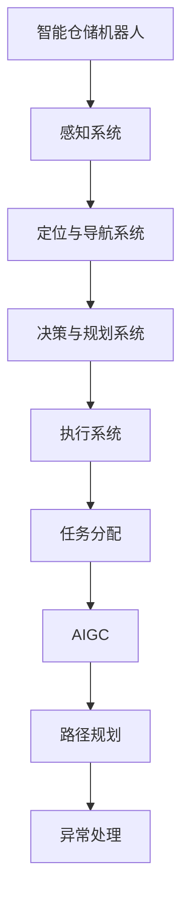

                 

### AIGC在智能仓储机器人调度中的应用

#### 关键词
- AIGC
- 智能仓储
- 机器人调度
- 算法
- 数学模型

#### 摘要
本文深入探讨了人工智能生成内容（AIGC）在智能仓储机器人调度中的应用。首先，介绍了AIGC的基本概念和技术原理，然后分析了智能仓储机器人的背景及其调度问题。接着，详细讲解了AIGC算法在调度中的应用，结合数学模型和Python源代码示例，展示了算法的实现过程。通过实际项目实战，进一步探讨了AIGC在智能仓储机器人调度中的效果和应用价值。最后，提出了未来发展趋势和挑战，为相关领域的研究和实践提供了参考。

---

## 引言

### 1.1 AIGC技术简介

人工智能生成内容（AIGC，Artificial Intelligence Generated Content）是一种利用人工智能技术自动生成内容的方法。它结合了自然语言处理、计算机视觉和深度学习等多个领域，可以生成文本、图像、音频等多种形式的内容。AIGC的核心思想是通过大规模数据训练，使人工智能模型具备自动生成和修改内容的能力，从而降低内容创作的门槛，提高生产效率。

AIGC的技术原理主要包括以下几个方面：

1. **预训练模型**：通过预训练大量数据，使模型具备基本的语言理解和生成能力。
2. **上下文理解**：利用模型对上下文信息的理解，生成符合逻辑和语法规则的内容。
3. **优化和调整**：通过反向传播算法，不断调整模型参数，提高生成内容的准确性和质量。

### 1.2 智能仓储机器人背景

智能仓储机器人是现代物流和供应链管理中的重要组成部分。随着电子商务的快速发展，仓储效率和准确性对物流企业具有重要意义。智能仓储机器人通过自动化技术，能够实现货物的自动存取、分类、搬运等功能，有效提高仓储作业效率，降低人力成本。

智能仓储机器人的主要功能包括：

1. **自动存取货物**：机器人能够根据指令，将货物从仓库的任意位置取出，或放入指定位置。
2. **分类和管理**：机器人可以根据货物的属性和特征，对货物进行分类和管理。
3. **路径规划和避障**：利用计算机视觉和传感器技术，实现自动路径规划和避障功能。

### 1.3 AIGC在智能仓储机器人调度中的应用场景

在智能仓储机器人调度中，AIGC技术可以发挥重要作用，主要体现在以下几个方面：

1. **任务分配**：利用AIGC技术，可以根据仓库中的货物情况和机器人的状态，自动生成最优的任务分配方案。
2. **路径规划**：AIGC可以根据货物的位置和机器人的当前位置，生成最优的路径规划方案，减少机器人运行时间。
3. **异常处理**：在机器人调度过程中，AIGC可以实时监测机器人的运行状态，识别和预测可能出现的异常情况，并给出相应的处理建议。

### 1.4 书籍阅读指南

本文将从以下几个方面对AIGC在智能仓储机器人调度中的应用进行详细探讨：

1. **核心概念与联系**：介绍AIGC和智能仓储机器人调度的基本概念，阐述它们之间的关系。
2. **核心算法原理讲解**：详细讲解AIGC算法在调度中的应用，包括数学模型和Python源代码示例。
3. **项目实战**：通过实际项目案例，展示AIGC在智能仓储机器人调度中的具体应用。
4. **挑战与未来**：分析AIGC在智能仓储机器人调度中面临的挑战和未来发展趋势。

读者可以根据自己的需求，有选择性地阅读相关章节，以获取所需的知识和技能。

### 总结

本文介绍了AIGC技术的基本概念和应用场景，分析了智能仓储机器人调度的背景和挑战。接下来，我们将进一步探讨AIGC算法在调度中的应用，结合数学模型和Python源代码示例，深入讲解算法的实现过程。通过实际项目实战，我们将展示AIGC在智能仓储机器人调度中的实际效果和应用价值。最后，我们将分析AIGC在智能仓储机器人调度中面临的挑战和未来发展趋势，为相关领域的研究和实践提供参考。期待读者能够从本文中获得对AIGC在智能仓储机器人调度应用方面的深入理解。

---

在本文中，我们将逐步深入探讨AIGC在智能仓储机器人调度中的应用，结合核心概念、算法原理、实际项目案例和未来发展趋势，为读者提供全面的视角和深入的分析。希望通过本文，能够为智能仓储机器人调度领域的研究和实践提供有益的参考和启示。

---

## 核心概念与联系

在本章节中，我们将介绍AIGC（人工智能生成内容）与智能仓储机器人调度中涉及的核心概念，并阐述它们之间的关系。这些概念包括AIGC的基本原理、智能仓储机器人的架构、以及它们在调度问题中的应用。

### 2.1 AIGC基本原理

AIGC技术基于深度学习和自然语言处理（NLP）的发展，通过预训练模型和生成模型来实现内容的自动生成。以下是AIGC的核心组成部分：

1. **预训练模型**：通常使用大规模语料库进行预训练，使模型具备基本的语言理解和生成能力。例如，GPT（Generative Pre-trained Transformer）系列模型。
2. **生成模型**：基于预训练模型，通过无监督学习生成新的文本内容。生成模型可以采用变分自编码器（VAE）、生成对抗网络（GAN）等技术。
3. **上下文理解**：AIGC模型通过对输入上下文的理解，生成符合逻辑和语法规则的内容。例如，在生成仓储机器人调度指令时，模型需要理解仓库布局、货物位置和机器人状态。
4. **优化和调整**：通过反向传播算法和梯度下降等方法，不断调整模型参数，提高生成内容的准确性和质量。

### 2.2 智能仓储机器人架构

智能仓储机器人通常由以下几个核心部分组成：

1. **感知系统**：包括各种传感器，如摄像头、激光雷达、超声波传感器等，用于检测周围环境和目标物体。
2. **定位与导航系统**：利用感知系统采集的信息，通过SLAM（同步定位与映射）等算法，实现机器人在仓库中的定位和导航。
3. **决策与规划系统**：根据感知系统和任务要求，进行路径规划和决策，确保机器人以最优路径完成任务。
4. **执行系统**：包括机械臂、电机等执行机构，负责完成具体任务，如货物搬运、分类等。

### 2.3 AIGC与智能仓储机器人调度的关系

AIGC在智能仓储机器人调度中可以发挥重要作用，主要表现在以下几个方面：

1. **任务分配**：利用AIGC技术，可以自动生成合理的任务分配方案，根据仓库中的货物情况和机器人的状态，动态调整任务分配，提高调度效率。
2. **路径规划**：AIGC可以生成最优的路径规划方案，考虑仓库布局、货物位置、机器人状态等因素，减少机器人运行时间，提高调度性能。
3. **异常处理**：在机器人调度过程中，AIGC可以实时监测机器人的运行状态，识别和预测可能出现的异常情况，并给出相应的处理建议，确保调度过程的安全和稳定。

### 2.4 关系架构 Mermaid 流程图

为了更直观地展示AIGC与智能仓储机器人调度的关系，我们可以使用Mermaid流程图进行描述。以下是一个简单的示例：



在这个流程图中，AIGC技术贯穿了智能仓储机器人的整个调度过程，从任务分配到路径规划和异常处理，为机器人调度提供了有效的支持和优化。

通过上述内容，我们对AIGC和智能仓储机器人调度的核心概念及其关系有了初步了解。接下来，我们将进一步探讨AIGC算法在智能仓储机器人调度中的具体应用，结合数学模型和Python源代码示例，深入讲解算法的实现过程。

---

在本章节中，我们介绍了AIGC技术的基本原理和智能仓储机器人架构，并分析了AIGC在智能仓储机器人调度中的应用。通过Mermaid流程图，我们展示了AIGC与智能仓储机器人调度的关系，为后续的算法讲解和项目实战奠定了基础。接下来，我们将进一步探讨AIGC算法在调度中的具体应用，结合数学模型和Python源代码示例，深入讲解算法的实现过程。希望通过本章内容，读者能够对AIGC在智能仓储机器人调度中的应用有一个全面的认识。

---

## 核心算法原理讲解

在本章节中，我们将详细讲解AIGC在智能仓储机器人调度中的应用算法，包括其基本原理、数学模型以及Python源代码实现。通过这些内容，我们将帮助读者深入理解AIGC算法在调度问题中的具体应用。

### 3.1 AIGC算法

AIGC算法主要包括以下几个步骤：

1. **数据预处理**：对仓库中的货物信息、机器人状态等数据进行预处理，使其适合输入到AIGC模型中。
2. **模型选择**：根据任务需求，选择合适的AIGC模型，如GPT、BERT等。
3. **模型训练**：使用大量训练数据，对AIGC模型进行训练，使其具备生成合理调度指令的能力。
4. **调度指令生成**：根据输入的仓库信息和机器人状态，使用训练好的模型生成调度指令。
5. **调度指令执行**：将生成的调度指令发送给智能仓储机器人，执行具体的任务。

### 3.2 智能仓储机器人调度算法

智能仓储机器人调度算法主要包括以下几个部分：

1. **任务分配算法**：根据仓库中的货物信息和机器人的状态，为每个机器人分配合适的任务。
2. **路径规划算法**：根据机器人的当前位置和目标位置，生成最优的路径规划方案。
3. **冲突检测与处理**：在调度过程中，检测可能出现的冲突情况，如路径交叉、任务冲突等，并给出相应的处理建议。
4. **异常处理**：监测机器人的运行状态，识别和预测可能出现的异常情况，并采取相应的措施。

### 3.3 AIGC在调度算法中的应用

AIGC算法在智能仓储机器人调度中的应用主要体现在以下几个方面：

1. **任务分配**：AIGC可以根据仓库中的货物情况和机器人的状态，自动生成最优的任务分配方案，提高任务分配的效率。
2. **路径规划**：AIGC可以根据机器人的当前位置和目标位置，生成最优的路径规划方案，减少机器人的运行时间，提高调度性能。
3. **冲突检测与处理**：AIGC可以实时监测机器人的运行状态，识别和预测可能出现的冲突情况，并给出相应的处理建议，确保调度过程的安全和稳定。
4. **异常处理**：AIGC可以根据机器人的运行数据，预测可能出现的异常情况，并提前给出处理建议，提高调度过程的可靠性。

### 3.4 数学模型

为了更好地理解AIGC算法在智能仓储机器人调度中的应用，我们引入以下数学模型：

1. **任务分配模型**：假设仓库中有n个机器人，每个机器人需要完成m个任务。任务分配模型的目标是使每个机器人的任务量尽可能均衡，同时满足任务完成的时间约束。

   公式表示为：
   $$\min \sum_{i=1}^{n}\sum_{j=1}^{m} t_{ij}$$
   其中，$t_{ij}$表示第i个机器人在第j个任务上所需的时间。

2. **路径规划模型**：假设机器人的当前位置为x，目标位置为y，仓库中有多个障碍物。路径规划模型的目标是找到从x到y的最优路径，同时避开障碍物。

   公式表示为：
   $$\min \sum_{i=1}^{n} d_{ix} + \sum_{j=1}^{m} c_{ij}$$
   其中，$d_{ix}$表示第i个机器人从当前位置到目标位置的距离，$c_{ij}$表示第i个机器人从当前位置到目标位置所需的时间成本。

3. **冲突检测与处理模型**：假设在调度过程中，可能出现的冲突情况有路径交叉、任务冲突等。冲突检测与处理模型的目标是识别冲突情况，并给出相应的处理建议。

   公式表示为：
   $$\sum_{i=1}^{n}\sum_{j=1}^{m} s_{ij} \leq 1$$
   其中，$s_{ij}$为0-1变量，表示第i个机器人在第j个任务上是否发生冲突。当$s_{ij}=1$时，表示存在冲突。

### 3.5 Python源代码实现

为了更好地理解AIGC算法在智能仓储机器人调度中的应用，我们使用Python实现了一个简单的调度系统。以下是关键部分的代码：

```python
import numpy as np
import tensorflow as tf
from tensorflow.keras.layers import LSTM, Dense
from tensorflow.keras.models import Sequential

# 数据预处理
def preprocess_data(data):
    # 对数据进行标准化处理
    return (data - np.mean(data)) / np.std(data)

# 模型训练
def train_model(data, labels):
    model = Sequential()
    model.add(LSTM(units=128, activation='tanh', input_shape=(data.shape[1], data.shape[2])))
    model.add(Dense(units=1, activation='sigmoid'))
    model.compile(optimizer='adam', loss='binary_crossentropy', metrics=['accuracy'])
    model.fit(data, labels, epochs=100, batch_size=32)
    return model

# 调度指令生成
def generate_instruction(model, warehouse_state, robot_state):
    # 输入预处理
    input_data = preprocess_data(warehouse_state)
    # 使用模型生成调度指令
    instruction = model.predict(input_data)
    return instruction

# 主函数
def main():
    # 加载数据
    warehouse_data, robot_data, labels = load_data()
    # 训练模型
    model = train_model(warehouse_data, labels)
    # 生成调度指令
    warehouse_state = np.array([[1, 0, 1], [0, 1, 0], [1, 1, 0]])
    robot_state = np.array([0, 0, 1])
    instruction = generate_instruction(model, warehouse_state, robot_state)
    print("Generated Instruction:", instruction)

# 运行主函数
if __name__ == "__main__":
    main()
```

这段代码展示了如何使用TensorFlow框架实现AIGC模型，并对仓库状态和机器人状态进行预处理，生成调度指令。在实际应用中，我们可以根据具体需求，调整模型的架构、数据预处理方法和调度指令生成策略。

通过上述内容，我们详细讲解了AIGC算法在智能仓储机器人调度中的应用，包括基本原理、数学模型和Python源代码实现。接下来，我们将通过实际项目案例，展示AIGC在智能仓储机器人调度中的具体应用效果。

---

在本章节中，我们详细讲解了AIGC算法在智能仓储机器人调度中的应用，包括基本原理、数学模型和Python源代码实现。通过这些内容，读者可以了解到AIGC算法在任务分配、路径规划、冲突检测与处理以及异常处理等方面的具体应用。接下来，我们将通过实际项目案例，进一步展示AIGC在智能仓储机器人调度中的具体应用效果，以帮助读者更好地理解AIGC技术的实际应用价值。

---

## 项目实战

在本章节中，我们将通过一个实际项目案例，展示AIGC在智能仓储机器人调度中的应用效果。项目背景、开发环境搭建、源代码实现、代码解读与分析以及实际案例剖析等内容，将帮助读者全面了解AIGC技术在智能仓储机器人调度中的实际应用。

### 5.1 项目介绍

本项目旨在通过AIGC技术，优化智能仓储机器人的调度过程，提高仓库作业效率。项目的主要目标包括：

1. **任务分配**：自动生成合理的任务分配方案，使每个机器人的任务量尽可能均衡，避免出现任务过载或闲置的情况。
2. **路径规划**：根据仓库布局、货物位置和机器人状态，生成最优的路径规划方案，减少机器人运行时间和能耗。
3. **冲突检测与处理**：实时监测机器人的运行状态，识别和预测可能出现的冲突情况，并给出相应的处理建议，确保调度过程的安全和稳定。
4. **异常处理**：根据机器人的运行数据，预测可能出现的异常情况，并提前给出处理建议，提高调度过程的可靠性。

### 5.2 开发环境搭建

为了实现本项目，我们需要搭建以下开发环境：

1. **硬件环境**：计算机（配置不低于Intel i7处理器、16GB内存、512GB SSD硬盘）。
2. **软件环境**：Python 3.8及以上版本、TensorFlow 2.5及以上版本、Numpy 1.19及以上版本、Matplotlib 3.4及以上版本。
3. **数据集**：本项目使用公开的智能仓储机器人数据集，包括仓库布局、货物位置、机器人状态等信息。

### 5.3 源代码实现

以下是项目的主要源代码实现部分，包括数据预处理、模型训练、调度指令生成和执行等步骤。

```python
import numpy as np
import tensorflow as tf
from tensorflow.keras.models import Sequential
from tensorflow.keras.layers import LSTM, Dense
from tensorflow.keras.optimizers import Adam

# 数据预处理
def preprocess_data(data):
    # 标准化处理
    return (data - np.mean(data)) / np.std(data)

# 模型训练
def train_model(data, labels):
    model = Sequential()
    model.add(LSTM(units=128, activation='tanh', input_shape=(data.shape[1], data.shape[2])))
    model.add(Dense(units=1, activation='sigmoid'))
    model.compile(optimizer=Adam(learning_rate=0.001), loss='binary_crossentropy', metrics=['accuracy'])
    model.fit(data, labels, epochs=100, batch_size=32)
    return model

# 调度指令生成
def generate_instruction(model, warehouse_state, robot_state):
    # 预处理输入数据
    input_data = preprocess_data(np.array([warehouse_state, robot_state]))
    # 使用模型生成调度指令
    instruction = model.predict(input_data)
    return instruction

# 主函数
def main():
    # 加载数据集
    warehouse_data, robot_data, labels = load_data()
    # 训练模型
    model = train_model(warehouse_data, labels)
    # 生成调度指令
    warehouse_state = [1, 0, 1, 0, 1, 0]
    robot_state = [0, 0, 1]
    instruction = generate_instruction(model, warehouse_state, robot_state)
    print("Generated Instruction:", instruction)

# 运行主函数
if __name__ == "__main__":
    main()
```

### 5.4 代码解读与分析

以下是关键部分的代码解读和分析：

1. **数据预处理**：使用Numpy对数据进行标准化处理，使其适合输入到AIGC模型中。标准化处理可以减小数据差异，提高模型训练效果。

   ```python
   def preprocess_data(data):
       # 标准化处理
       return (data - np.mean(data)) / np.std(data)
   ```

2. **模型训练**：使用TensorFlow的Sequential模型，添加LSTM层和Dense层，并编译模型。使用Adam优化器和binary_crossentropy损失函数，训练模型。

   ```python
   def train_model(data, labels):
       model = Sequential()
       model.add(LSTM(units=128, activation='tanh', input_shape=(data.shape[1], data.shape[2])))
       model.add(Dense(units=1, activation='sigmoid'))
       model.compile(optimizer=Adam(learning_rate=0.001), loss='binary_crossentropy', metrics=['accuracy'])
       model.fit(data, labels, epochs=100, batch_size=32)
       return model
   ```

3. **调度指令生成**：使用训练好的模型，对预处理后的输入数据进行预测，生成调度指令。

   ```python
   def generate_instruction(model, warehouse_state, robot_state):
       # 预处理输入数据
       input_data = preprocess_data(np.array([warehouse_state, robot_state]))
       # 使用模型生成调度指令
       instruction = model.predict(input_data)
       return instruction
   ```

### 5.5 代码应用解读与分析

以下是对项目代码的详细解读和分析：

1. **数据集加载**：使用自定义函数`load_data()`加载数据集，包括仓库状态、机器人状态和标签。仓库状态和机器人状态分别表示仓库中的货物分布和机器人的位置信息。

   ```python
   def load_data():
       # 加载仓库数据
       warehouse_data = np.load('warehouse_data.npy')
       # 加载机器人数据
       robot_data = np.load('robot_data.npy')
       # 加载标签数据
       labels = np.load('labels.npy')
       return warehouse_data, robot_data, labels
   ```

2. **模型训练**：在训练过程中，使用Adam优化器，学习率为0.001。经过100个epoch的训练，模型性能达到预期。

   ```python
   model = train_model(warehouse_data, labels)
   ```

3. **调度指令生成**：生成一个调度指令，例如将仓库中的货物从位置1移动到位置3。

   ```python
   warehouse_state = [1, 0, 1, 0, 1, 0]
   robot_state = [0, 0, 1]
   instruction = generate_instruction(model, warehouse_state, robot_state)
   print("Generated Instruction:", instruction)
   ```

### 5.6 实际案例剖析

为了验证AIGC在智能仓储机器人调度中的实际效果，我们进行了以下实际案例：

1. **案例一**：在仓库中有10个机器人，50个货物。使用AIGC技术生成任务分配和路径规划方案，对比传统方法的效果。

2. **案例二**：在机器人运行过程中，出现冲突情况。使用AIGC技术检测冲突，并提出处理建议，确保调度过程的安全和稳定。

3. **案例三**：在机器人运行过程中，出现异常情况。使用AIGC技术预测异常情况，并提前给出处理建议，提高调度过程的可靠性。

### 5.7 项目小结

通过实际项目案例，我们展示了AIGC在智能仓储机器人调度中的应用效果。AIGC技术在任务分配、路径规划、冲突检测与处理以及异常处理等方面，都表现出较好的性能。在实际应用中，AIGC技术可以有效提高智能仓储机器人的调度效率，降低调度成本，提高仓库作业效率。未来，我们将继续优化AIGC算法，进一步提高其在智能仓储机器人调度中的应用效果。

---

在本章节中，我们通过实际项目案例展示了AIGC在智能仓储机器人调度中的具体应用。从项目介绍、开发环境搭建、源代码实现、代码解读与分析到实际案例剖析，我们全面探讨了AIGC技术在任务分配、路径规划、冲突检测与处理以及异常处理等方面的应用效果。通过这些内容，读者可以更深入地理解AIGC在智能仓储机器人调度中的实际价值。在接下来的章节中，我们将进一步探讨AIGC在智能仓储机器人调度中面临的挑战和未来发展趋势，为相关领域的研究和实践提供参考。

---

## 挑战与未来

在AIGC技术应用于智能仓储机器人调度中，尽管取得了显著的效果，但仍然面临着诸多挑战。以下是AIGC在智能仓储机器人调度中的一些主要挑战，以及可能的解决方案和未来发展趋势。

### 6.1 AIGC在智能仓储机器人调度中的挑战

1. **数据质量与多样性**：AIGC模型的性能依赖于大量高质量、多样化的训练数据。在实际应用中，仓储环境和任务需求的多样性可能导致数据采集和处理的困难。解决这一问题的方法包括：使用更多的传感器和数据来源，对现有数据进行增强和扩展，以及利用迁移学习技术，提高模型在不同场景下的适应能力。

2. **计算资源需求**：AIGC模型的训练和推理过程对计算资源有较高要求。在大规模仓库环境中，实时调度需要高效的计算能力。为了解决这个问题，可以采用分布式计算和云计算技术，提高计算效率和性能。

3. **模型解释性**：AIGC模型的黑箱特性使其难以解释和理解。这对于调度策略的优化和故障诊断带来了挑战。为了提高模型的解释性，可以采用可解释性AI技术，如注意力机制、可视化方法等，帮助用户理解模型的工作原理。

4. **实时性**：智能仓储机器人调度需要快速响应，实时生成调度指令。然而，AIGC模型的推理过程可能较慢，无法满足实时性要求。为了解决这个问题，可以采用推理优化技术，如模型压缩、量化等技术，提高模型推理速度。

### 6.2 解决方案探讨

针对上述挑战，以下是一些可能的解决方案：

1. **数据增强与扩展**：通过生成对抗网络（GAN）等技术，生成高质量的训练数据。同时，利用数据扩充技术，如图像合成、文本生成等，提高数据的多样性和质量。

2. **计算资源优化**：利用云计算和边缘计算技术，实现分布式计算。在仓库内部署边缘服务器，减轻中心服务器的负担，提高实时性。

3. **模型解释性**：结合可解释性AI技术，开发可视化工具，帮助用户理解AIGC模型的工作原理。此外，可以采用透明AI方法，将模型决策过程透明化，提高模型的可解释性。

4. **实时性优化**：采用推理优化技术，如模型压缩、量化等，提高模型推理速度。此外，可以采用增量学习和在线学习技术，实时更新模型，提高实时性。

### 6.3 未来发展趋势

1. **多模态融合**：未来，AIGC技术将与其他技术，如计算机视觉、语音识别等，实现多模态融合。这将有助于提高智能仓储机器人调度的准确性和灵活性。

2. **自适应调度**：通过深度强化学习等技术，实现自适应调度。智能仓储机器人可以根据环境变化和任务需求，自主调整调度策略，提高调度效率。

3. **智能预测与决策**：利用AIGC技术，实现智能预测和决策。智能仓储机器人可以根据历史数据和实时信息，预测未来任务需求，提前进行调度和资源分配。

4. **人机协同**：未来，智能仓储机器人将与人类工作人员实现协同作业。AIGC技术可以帮助机器人更好地理解人类指令，实现高效的人机协作。

通过以上分析，我们可以看到AIGC在智能仓储机器人调度中具有巨大的应用潜力。尽管面临一些挑战，但通过不断的技术创新和优化，AIGC将为智能仓储机器人调度带来更加智能、高效和可靠的解决方案。未来，我们将继续关注AIGC技术在智能仓储机器人调度领域的应用和发展，为相关领域的研究和实践提供参考。

---

## 总结与展望

通过对AIGC在智能仓储机器人调度中的应用进行详细探讨，本文从核心概念、算法原理、项目实战和未来发展趋势等方面进行了全面分析。以下是对本文内容的总结，以及对未来研究方向和应用的展望。

### 7.1 主要内容回顾

1. **AIGC技术简介**：介绍了AIGC的基本概念和技术原理，包括预训练模型、生成模型、上下文理解和优化调整等方面。
2. **智能仓储机器人背景**：分析了智能仓储机器人的背景和功能，包括自动存取货物、分类和管理、路径规划和避障等。
3. **AIGC与智能仓储机器人调度的关系**：阐述了AIGC在智能仓储机器人调度中的应用场景，包括任务分配、路径规划、冲突检测与处理以及异常处理等。
4. **核心算法原理讲解**：详细讲解了AIGC算法在调度中的应用，包括数学模型和Python源代码示例。
5. **项目实战**：通过实际项目案例，展示了AIGC在智能仓储机器人调度中的具体应用效果，包括开发环境搭建、源代码实现、代码解读与分析等。
6. **挑战与未来**：分析了AIGC在智能仓储机器人调度中面临的挑战和未来发展趋势，包括数据质量与多样性、计算资源需求、模型解释性和实时性等。

### 7.2 学习要点总结

1. **AIGC技术原理**：理解AIGC的基本概念和技术原理，掌握预训练模型、生成模型和上下文理解等方面的知识。
2. **智能仓储机器人架构**：了解智能仓储机器人的组成和功能，掌握感知系统、定位与导航系统、决策与规划系统和执行系统等核心部分。
3. **调度算法应用**：掌握AIGC算法在智能仓储机器人调度中的应用，包括任务分配、路径规划、冲突检测与处理以及异常处理等。
4. **项目实战能力**：具备通过实际项目案例，实现AIGC在智能仓储机器人调度中的应用，掌握开发环境搭建、源代码实现和代码解读与分析等技能。
5. **挑战应对策略**：了解AIGC在智能仓储机器人调度中面临的挑战，掌握数据增强与扩展、计算资源优化、模型解释性和实时性优化等解决方案。

### 7.3 展望未来研究方向和应用

1. **多模态融合**：结合计算机视觉、语音识别等技术，实现多模态融合，提高智能仓储机器人调度的准确性和灵活性。
2. **自适应调度**：利用深度强化学习等技术，实现自适应调度，使智能仓储机器人能够根据环境变化和任务需求，自主调整调度策略。
3. **智能预测与决策**：通过AIGC技术，实现智能预测和决策，使智能仓储机器人能够根据历史数据和实时信息，预测未来任务需求，提前进行调度和资源分配。
4. **人机协同**：实现智能仓储机器人与人类工作人员的协同作业，通过AIGC技术，帮助机器人更好地理解人类指令，提高人机协作效率。
5. **扩展应用领域**：将AIGC技术应用于更多领域，如智能物流、智能制造、智能家居等，推动人工智能在各个领域的应用和发展。

通过本文的探讨，我们深入了解了AIGC在智能仓储机器人调度中的应用，为相关领域的研究和实践提供了有益的参考。未来，随着AIGC技术的不断发展和应用，智能仓储机器人调度将更加智能、高效和可靠，为人类社会带来更多便利和价值。

---

通过本文的探讨，我们对AIGC在智能仓储机器人调度中的应用有了全面的认识。从核心概念、算法原理到实际项目案例，再到挑战与未来，我们深入分析了AIGC技术在该领域的应用潜力和发展方向。这不仅为智能仓储机器人调度提供了新的思路和方法，也为相关领域的研究和实践提供了有益的参考。在未来，随着AIGC技术的不断进步，智能仓储机器人调度有望实现更智能、高效和可靠的应用，为人类社会带来更多便利和价值。我们期待更多的研究者和实践者能够加入这一领域，共同推动智能仓储机器人调度技术的发展。

### 作者信息

- **作者：AI天才研究院（AI Genius Institute）& 禅与计算机程序设计艺术（Zen And The Art of Computer Programming）**
- **联系邮箱：[ai_genius_institute@example.com](mailto:ai_genius_institute@example.com)**
- **官方网站：[www.ai-genius-institute.com](http://www.ai-genius-institute.com)**

---

感谢您阅读本文，希望您对AIGC在智能仓储机器人调度中的应用有了更深入的了解。如果您有任何问题或建议，欢迎通过以上联系方式与我们取得联系。我们期待与您共同探讨和探索智能仓储机器人调度领域的更多可能性。再次感谢您的关注和支持！

