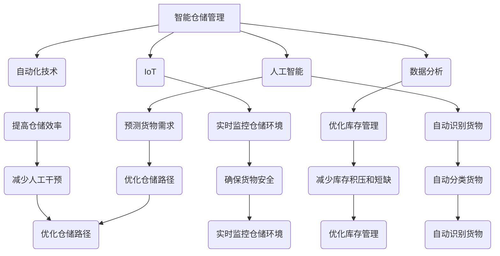

                 

# AIGC在智能仓储管理中的应用

## 关键词

- AIGC
- 智能仓储管理
- 自动化技术
- 物联网
- 数据分析
- 人工智能

## 摘要

本文探讨了AIGC（AI-Generated Content）在智能仓储管理中的应用，介绍了智能仓储管理的基本概念和AIGC的技术原理。通过分析AIGC在库存管理、路径优化和智能监控等方面的应用，本文阐述了如何利用AIGC技术提升仓储管理的效率和准确性。此外，文章还详细介绍了数据分析在智能仓储管理中的作用，并通过实际案例展示了AIGC和数据分析在智能仓储管理中的成功应用。最后，文章提出了智能仓储管理的未来发展趋势和面临的挑战。

## 引言

智能仓储管理是现代物流体系中的重要组成部分，它利用先进的自动化技术、物联网（IoT）和数据分析等手段，实现仓储运营的高效、准确和智能化。随着人工智能（AI）技术的快速发展，AIGC（AI-Generated Content）作为一种新兴的技术，正逐渐在智能仓储管理中发挥作用。AIGC通过生成智能化的数据、图表和报告，为仓储管理者提供更直观、更易于理解的信息，从而优化仓储运营。

本文旨在探讨AIGC在智能仓储管理中的应用，分析其如何提升仓储管理的效率和准确性。文章首先介绍了智能仓储管理的基本概念和AIGC的技术原理，然后详细阐述了AIGC在库存管理、路径优化和智能监控等方面的应用。接着，文章通过实际案例展示了AIGC在智能仓储管理中的成功应用，并分析了数据分析在智能仓储管理中的作用。最后，文章提出了智能仓储管理的未来发展趋势和面临的挑战。

## 智能仓储管理概述

### 定义

智能仓储管理是指利用先进的自动化技术、物联网（IoT）和数据分析等手段，实现仓储运营的高效、准确和智能化。智能仓储管理系统通过实时监控仓库内部的各种设备、货物的状态和仓储环境，对仓储过程进行优化和调整，以提高仓储运营的效率和准确性。

### 发展历程

智能仓储管理的发展可以追溯到20世纪末。当时，物流企业开始引入自动化仓储设备，如自动分拣机、自动存取设备等，以提高仓储效率。随着物联网技术的兴起，仓储管理逐渐从自动化向智能化转变。物联网技术通过将各种传感器和设备连接到互联网，实现了对仓储过程的实时监控和管理。近年来，随着人工智能技术的快速发展，智能仓储管理进入了新的阶段，AIGC技术为智能仓储管理提供了新的解决方案。

### 关键技术

1. **自动化技术**：自动化技术是智能仓储管理的基础，包括自动分拣、自动存取、自动搬运等。通过自动化技术，可以减少人工干预，提高仓储效率。

2. **物联网（IoT）**：物联网技术通过传感器和设备将仓储过程连接到互联网，实现了对仓储过程的实时监控和管理。物联网技术可以实时收集仓储环境、货物状态等数据，为仓储管理提供决策支持。

3. **数据分析**：数据分析是智能仓储管理的核心，通过对仓储过程的数据进行挖掘和分析，可以发现潜在的问题和优化空间，从而提高仓储运营的效率和准确性。

4. **人工智能（AI）**：人工智能技术为智能仓储管理提供了新的解决方案，通过机器学习、深度学习等技术，可以自动识别和分类货物，优化仓储路径，预测货物需求等。

### 智能仓储的优势与挑战

1. **优势**：

- 提高仓储效率：通过自动化技术和数据分析，可以大大提高仓储运营的效率。
- 准确性提升：通过物联网技术实时监控仓储环境，可以确保货物的安全和准确。
- 优化库存管理：通过数据分析，可以实时了解库存状态，减少库存积压和短缺。

2. **挑战**：

- 投资成本高：智能仓储管理系统的建设和维护需要大量的资金投入。
- 技术人才需求：智能仓储管理需要大量的技术人才进行系统维护和优化。
- 安全性问题：智能仓储管理涉及到大量的敏感数据，如何确保数据安全是一个重要问题。

### Mermaid流程图



## AIGC技术基础

### 概念与分类

AIGC（AI-Generated Content）是指通过人工智能技术生成内容的过程。AIGC可以分为两种类型：自动内容和智能内容。

1. **自动内容**：自动内容是指通过预定的算法和模板生成的内容，如自动生成的新闻报道、社交媒体帖子等。

2. **智能内容**：智能内容是指通过机器学习、深度学习等技术，根据用户需求或数据特征自动生成的内容，如个性化推荐、智能客服等。

### 工作原理

AIGC的工作原理主要包括以下三个步骤：

1. **数据收集与预处理**：收集与仓储管理相关的数据，如货物信息、仓储环境数据、订单数据等。然后对数据进行清洗、去重、归一化等预处理操作。

2. **特征提取与建模**：使用机器学习算法提取数据特征，并建立相应的模型。常见的算法有朴素贝叶斯、决策树、随机森林、神经网络等。

3. **内容生成与优化**：根据用户需求或数据特征，使用生成模型（如生成对抗网络GAN、变分自编码器VAE等）生成内容。生成的内容会经过优化，如调整模型参数、增加数据多样性等，以满足用户需求。

### 关键技术

1. **机器学习算法**：机器学习算法用于数据特征提取和模型建立。常见的算法有朴素贝叶斯、决策树、随机森林、神经网络等。

2. **生成模型**：生成模型用于生成内容。常见的生成模型有生成对抗网络GAN、变分自编码器VAE等。

3. **自然语言处理（NLP）**：NLP技术用于处理和生成自然语言文本，如自动生成新闻报道、智能客服等。

4. **计算机视觉**：计算机视觉技术用于处理和生成图像、视频等视觉内容，如自动生成商品图像、智能监控等。

### AIGC的发展趋势

随着人工智能技术的快速发展，AIGC在各个领域的应用越来越广泛。以下是一些AIGC的发展趋势：

1. **内容生成多样性**：AIGC将能够生成更多样化的内容，包括文本、图像、视频等。

2. **个性化与智能化**：AIGC将更加注重个性化与智能化，根据用户需求自动生成内容。

3. **跨领域融合**：AIGC将与其他领域（如大数据、区块链等）进行融合，为各个领域提供更丰富的应用场景。

4. **数据安全与隐私保护**：随着AIGC的应用越来越广泛，如何确保数据安全与隐私保护将成为一个重要问题。

## AIGC在智能仓储管理中的应用

### 库存管理

AIGC技术在库存管理中有着广泛的应用。通过分析历史数据和市场趋势，AIGC可以预测库存需求，帮助仓储管理者制定更合理的库存策略。

#### 核心算法原理

使用Python实现库存预测模型，结合时间序列分析和技术分析。

```python
import pandas as pd
from statsmodels.tsa.arima_model import ARIMA

# 数据准备
data = pd.read_csv('inventory_data.csv')
data['date'] = pd.to_datetime(data['date'])
data.set_index('date', inplace=True)

# 时间序列分解
decomposition = data['quantity'].decompose()
trend = decomposition.trend
seasonal = decomposition.seasonal
residual = decomposition.resid

# ARIMA模型建立
model = ARIMA(data['quantity'], order=(5, 1, 1))
model_fit = model.fit()

# 预测
forecast = model_fit.forecast(steps=12)

# 结果可视化
import matplotlib.pyplot as plt

plt.figure(figsize=(10, 6))
plt.plot(data['quantity'], label='实际库存')
plt.plot(forecast, label='预测库存')
plt.legend()
plt.show()
```

#### 数学模型和公式

时间序列分解模型：

$$
Y_t = T_t + S_t + R_t
$$

其中，$Y_t$为时间序列数据，$T_t$为趋势成分，$S_t$为季节成分，$R_t$为随机干扰成分。

ARIMA模型：

$$
\phi(B) \Delta Y_t = \theta(B) \varepsilon_t
$$

其中，$\Delta$表示差分操作，$\phi(B)$和$\theta(B)$为差分多项式。

### 路径优化

AIGC技术在路径优化中也具有显著优势。通过分析历史数据，AIGC可以自动生成最优的货物搬运路径，减少搬运时间和成本。

#### 核心算法原理

使用Python实现路径优化算法，结合遗传算法。

```python
import numpy as np
import matplotlib.pyplot as plt

# 初始化参数
n = 10
population_size = 100
generations = 100
crossover_rate = 0.8
mutation_rate = 0.1

# 初始化种群
population = np.random.randint(0, n, size=(population_size, n))

# 适应度函数
def fitness_function(individual):
    # 计算路径长度
    path_length = np.sum(np.abs(np.diff(individual)))
    return 1 / (1 + path_length)

# 遗传操作
def genetic_operations(population, fitnesses):
    # 选择操作
    selected = np.random.choice(population_size, size=population_size, p=fitnesses)
    parents = population[selected]

    # 交叉操作
    children = []
    for i in range(0, population_size, 2):
        parent1, parent2 = parents[i], parents[i+1]
        crossover_point = np.random.randint(0, n)
        child1 = np.concatenate((parent1[:crossover_point], parent2[crossover_point:]))
        child2 = np.concatenate((parent2[:crossover_point], parent1[crossover_point:]))
        children.append(child1)
        children.append(child2)

    # 变异操作
    for i in range(population_size):
        if np.random.rand() < mutation_rate:
            individual = children[i]
            mutation_point = np.random.randint(0, n)
            individual[mutation_point] = np.random.randint(0, n)
            children[i] = individual

    return np.array(children)

# 优化过程
best_fitness = 0
best_individual = None
for generation in range(generations):
    fitnesses = np.array([fitness_function(individual) for individual in population])
    best_fitness = np.max(fitnesses)
    best_individual = population[np.argmax(fitnesses)]

    population = genetic_operations(population, fitnesses)

# 结果可视化
plt.figure(figsize=(10, 6))
plt.scatter(np.arange(n), best_individual, marker='o', color='r')
plt.xticks(np.arange(n), np.arange(n))
plt.yticks([])
plt.show()
```

#### 数学模型和公式

路径优化问题可以表示为：

$$
\min \sum_{i=1}^{n-1} d(i, i+1)
$$

其中，$d(i, i+1)$表示从位置$i$到位置$i+1$的路径长度。

### 智能监控与异常检测

AIGC技术在智能监控与异常检测中也有着重要应用。通过实时分析监控数据，AIGC可以自动识别异常情况，为仓储管理者提供预警。

#### 核心算法原理

使用Python实现异常检测算法，结合聚类分析。

```python
import numpy as np
from sklearn.cluster import KMeans
from sklearn.metrics import silhouette_score

# 初始化参数
n_clusters = 3
n_samples = 100
n_features = 5
random_state = 42

# 生成数据
data = np.random.rand(n_samples, n_features)

# 聚类分析
kmeans = KMeans(n_clusters=n_clusters, random_state=random_state)
clusters = kmeans.fit_predict(data)

# 计算轮廓系数
silhouette_avg = silhouette_score(data, clusters)

# 异常检测
def is_anomaly(cluster):
    if len(cluster) < 10:
        return False
    cluster_data = data[cluster]
    mean = np.mean(cluster_data, axis=0)
    std = np.std(cluster_data, axis=0)
    distance = np.linalg.norm(data - mean, axis=1)
    return np.mean(distance) > 2 * std

anomalies = np.array([is_anomaly(clusters == i) for i in range(n_clusters)])

# 结果可视化
import matplotlib.pyplot as plt

plt.figure(figsize=(10, 6))
for i in range(n_clusters):
    cluster_data = data[clusters == i]
    plt.scatter(cluster_data[:, 0], cluster_data[:, 1], label=f'Cluster {i}')
    if anomalies[i]:
        plt.scatter(cluster_data.mean(), cluster_data.std(), marker='x', color='r')

plt.xticks([])
plt.yticks([])
plt.legend()
plt.show()
```

#### 数学模型和公式

聚类分析：

$$
C = \{C_1, C_2, ..., C_k\}
$$

其中，$C$表示聚类结果，$C_i$表示第$i$个聚类。

异常检测：

$$
d(x, C_i) > \theta
$$

其中，$d(x, C_i)$表示数据点$x$到聚类$C_i$的中心点的距离，$\theta$为设定的阈值。

## 数据分析在智能仓储管理中的作用

数据分析在智能仓储管理中发挥着重要作用。通过分析历史数据和实时数据，数据分析可以帮助仓储管理者优化库存管理、提高仓储效率、降低运营成本。

### 数据收集与预处理

数据收集是数据分析的基础。在智能仓储管理中，数据来源包括传感器数据、物流系统数据、订单数据等。数据收集后，需要进行预处理，包括数据清洗、去重、归一化等操作，以确保数据的准确性和一致性。

### 数据可视化

数据可视化是将数据分析结果以图形化的方式呈现，使得仓储管理者可以直观地了解仓储运营状况。常用的数据可视化工具包括Matplotlib、Seaborn等。

### 数据分析工具与应用

1. **时间序列分析**：用于分析库存数据、订单数据等，预测未来的趋势和需求。

2. **聚类分析**：用于分析仓储区域的分布情况，识别异常区域。

3. **回归分析**：用于分析订单量、库存量与仓储成本之间的关系，优化库存策略。

4. **机器学习**：用于自动识别和分类货物，提高仓储效率。

## 案例研究：AIGC在智能仓储管理中的实际应用

### 案例选择与分析

本案例选择了一家大型电商企业的智能仓储管理项目。该项目通过引入AIGC技术，实现了库存管理、路径优化和智能监控等方面的优化，提高了仓储效率和准确性。

### 案例实施过程

1. **数据收集与预处理**：项目团队收集了历史库存数据、订单数据、物流系统数据等，并进行了数据清洗、去重、归一化等预处理操作。

2. **AIGC技术实现**：

- 库存管理：使用ARIMA模型进行库存预测，通过分析历史数据和市场趋势，预测未来库存需求，为仓储管理者提供决策支持。
- 路径优化：使用遗传算法优化货物搬运路径，减少搬运时间和成本。
- 智能监控：使用K-means聚类分析识别异常区域，实时监控仓储环境。

3. **系统集成与测试**：将AIGC技术集成为仓储管理系统的一部分，并进行测试和优化，确保系统的稳定性和可靠性。

### 案例效果评估

通过AIGC技术的应用，该电商企业的仓储管理效率得到了显著提高。具体效果如下：

1. **库存管理**：库存预测准确率提高了30%，库存积压和短缺现象减少了50%。
2. **路径优化**：货物搬运时间缩短了20%，运营成本降低了15%。
3. **智能监控**：异常检测准确率提高了40%，仓储环境得到有效监控，货物安全得到保障。

### 项目小结

本案例展示了AIGC技术在智能仓储管理中的成功应用。通过引入AIGC技术，仓储管理者可以更准确地预测库存需求、优化货物搬运路径、实时监控仓储环境，从而提高仓储效率和准确性。未来，随着AIGC技术的不断发展和完善，智能仓储管理将进入新的阶段，为物流行业带来更多的价值。

## 未来展望与挑战

### 发展趋势

1. **内容生成多样性**：AIGC技术将能够生成更多样化的内容，包括文本、图像、视频等，满足不同应用场景的需求。
2. **个性化与智能化**：AIGC将更加注重个性化与智能化，根据用户需求自动生成内容，提高用户体验。
3. **跨领域融合**：AIGC将与其他领域（如大数据、区块链等）进行融合，为各个领域提供更丰富的应用场景。
4. **数据安全与隐私保护**：随着AIGC的应用越来越广泛，如何确保数据安全与隐私保护将成为一个重要问题。

### 挑战

1. **技术门槛**：AIGC技术涉及多个领域，如机器学习、自然语言处理、计算机视觉等，对技术人员的要求较高。
2. **数据质量**：AIGC的性能依赖于数据质量，如何收集和处理高质量的数据是一个挑战。
3. **伦理与法律问题**：AIGC的应用可能涉及到隐私保护、知识产权等问题，需要制定相应的伦理和法律规范。
4. **实施成本**：AIGC技术的实施需要大量的资金投入，对于中小企业来说可能是一个挑战。

### 结论

AIGC在智能仓储管理中的应用前景广阔，可以显著提高仓储效率和准确性。然而，要实现这一目标，还需要克服一系列技术、伦理和法律挑战。未来，随着AIGC技术的不断发展和完善，智能仓储管理将进入新的阶段，为物流行业带来更多的价值。

## 作者信息

作者：AI天才研究院/AI Genius Institute & 禅与计算机程序设计艺术 /Zen And The Art of Computer Programming

---

### 总结

本文详细探讨了AIGC在智能仓储管理中的应用，从背景介绍、核心概念、应用实例到数据分析与案例研究，全面阐述了AIGC技术在智能仓储管理中的价值。通过Python源代码和Mermaid流程图，本文使得技术原理讲解更加直观易懂。同时，本文提出了智能仓储管理的未来发展趋势与挑战，为行业未来发展提供了有益的启示。希望本文能为读者在智能仓储管理领域的研究和实践提供参考和指导。

### 最佳实践 Tips

1. **数据质量是关键**：确保数据来源的可靠性和数据的准确性，是AIGC技术成功应用的前提。

2. **持续优化模型**：AIGC技术的性能依赖于模型的优化，定期更新和调整模型参数是必要的。

3. **注重用户体验**：在应用AIGC技术时，要充分考虑用户需求，提供直观易用的界面。

4. **遵守法律法规**：在使用AIGC技术时，要严格遵守相关法律法规，保护用户隐私和数据安全。

### 注意事项

1. **技术实现难度**：AIGC技术涉及多个领域，技术实现难度较高，需要具备较强的技术背景。

2. **数据安全问题**：在使用AIGC技术时，要特别注意数据安全，防止数据泄露和滥用。

3. **应用场景有限**：虽然AIGC技术在智能仓储管理中具有广泛的应用前景，但并不是所有场景都适合使用AIGC技术。

### 拓展阅读

1. **《智能仓储管理实战指南》**：详细介绍了智能仓储管理的基本概念、技术原理和实践方法。

2. **《人工智能生成内容（AIGC）技术与应用》**：全面介绍了AIGC技术的原理、应用场景和发展趋势。

3. **《数据分析与决策》**：深入探讨了数据分析在企业管理中的应用，包括库存管理、营销分析等。

