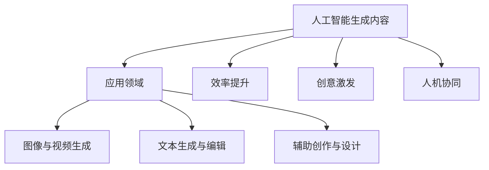
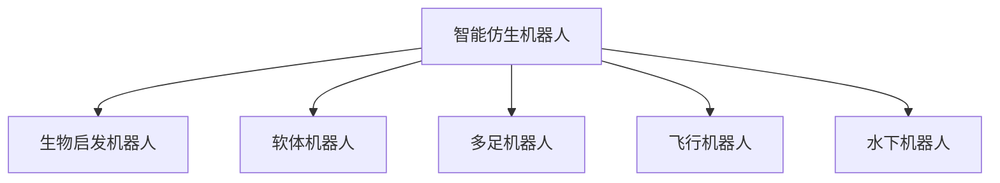
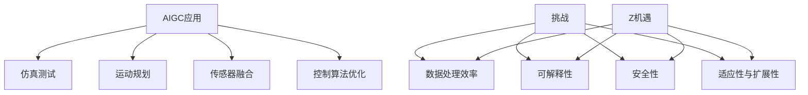

                 

# AIGC在智能仿生机器人设计中的应用：模仿生物运动机制

## 摘要

本文深入探讨了人工智能生成内容（AIGC）在智能仿生机器人设计中的应用，特别是如何模仿生物运动机制。首先，我们介绍了AIGC的基本概念、应用领域及其在智能仿生机器人设计中的潜在优势。接着，我们详细阐述了智能仿生机器人的分类和AIGC技术的关键研究，包括图像与视频生成算法、GAN、VGG和ResNet等。随后，通过伪代码和数学模型，我们展示了这些算法在智能仿生机器人设计中的应用原理。文章还讨论了AIGC在仿真测试、运动规划、传感器融合和控制算法优化等方面的挑战和机遇。最后，我们通过一个实际项目案例，展示了AIGC技术在智能仿生机器人设计中的实际应用，并提供了一些最佳实践和未来研究方向。

---

## 第一部分：AIGC与智能仿生机器人概述

### 1.1 AIGC概述

**核心概念与联系**：


人工智能生成内容（AIGC）是一种利用人工智能技术生成图像、视频、文本等内容的先进方法。它结合了深度学习和生成对抗网络（GAN）等技术，可以实现高效的内容创作和自动化生产。

**应用领域与优势**：
AIGC广泛应用于图像与视频生成、文本生成与编辑、辅助创作与设计等领域。其优势在于：

- **效率提升**：通过自动化生成内容，显著提高了内容创作的速度和规模。
- **创意激发**：AIGC能够生成新颖、独特的创意内容，为创作者提供灵感和参考。
- **人机协同**：AIGC与人类的创作活动相结合，实现了人机协同的工作模式，提升了创作效率。

**应用领域与优势**：Mermaid流程图



### 1.2 智能仿生机器人概述

**核心概念与联系**：


智能仿生机器人是一种模仿生物结构和行为特征的机器人系统，通过人工智能技术实现自主感知、决策和执行。

**仿生机器人分类**：
智能仿生机器人可以根据其应用场景和结构特点进行分类，主要包括：

- **生物启发机器人**：模仿生物形态和运动方式的机器人，如多足机器人、软体机器人等。
- **软体机器人**：采用柔软材料制作的机器人，具有高柔韧性和适应性。
- **多足机器人**：模仿昆虫和四足动物的运动方式的机器人，具有较好的地形适应能力。
- **飞行机器人**：模仿鸟类和昆虫的飞行方式的机器人，可以实现空中飞行和侦察任务。
- **水下机器人**：模仿水生动物的运动方式，用于水下探测和救援。

**仿生机器人分类**：Mermaid流程图



### 1.3 AIGC在智能仿生机器人设计中的应用

**应用场景**：
AIGC在智能仿生机器人设计中具有广泛的应用场景，主要包括：

- **仿真测试**：通过AIGC技术生成各种环境场景，用于测试智能仿生机器人的运动性能和适应性。
- **运动规划**：利用AIGC技术生成不同的运动路径和动作序列，优化智能仿生机器人的运动策略。
- **传感器融合**：通过AIGC技术生成传感器数据，用于训练和优化智能仿生机器人的感知系统。
- **控制算法优化**：利用AIGC技术生成控制参数，优化智能仿生机器人的控制算法，提高其运动性能和稳定性。

**挑战与机遇**：
AIGC在智能仿生机器人设计中的应用面临以下挑战：

- **数据处理效率**：生成大量高质量的内容数据，对计算资源和数据处理能力提出了较高要求。
- **可解释性**：AIGC生成的内容通常具有高度复杂性和不确定性，提高其可解释性是一个重要挑战。
- **安全性**：AIGC技术可能会引入潜在的安全风险，如内容篡改和隐私泄露等。

同时，AIGC在智能仿生机器人设计中也带来了以下机遇：

- **效率提升**：通过自动化生成内容和算法优化，显著提高智能仿生机器人的设计和开发效率。
- **创意激发**：AIGC生成的创意内容可以激发智能仿生机器人的创新设计，推动技术进步。
- **人机协同**：AIGC与人类设计者的协同工作，有助于实现更智能、更高效的机器人系统。

**挑战与机遇**：Mermaid流程图



## 第二部分：AIGC技术基础

### 2.1 AIGC关键技术研究

**2.1.1 图像与视频生成**

图像与视频生成是AIGC技术的重要应用领域，其中生成对抗网络（GAN）是一种核心算法。

**核心算法原理**：
GAN由生成器（Generator）和判别器（Discriminator）组成，生成器和判别器通过对抗训练相互提升性能。

- **生成器**：生成器接收随机噪声作为输入，生成逼真的图像或视频。
- **判别器**：判别器接收真实图像和生成图像，判断其真实性。

**伪代码阐述**：

```python
# 生成器的伪代码
def generate_image(noise):
    noise = preprocess_noise(noise)
    image = generator_model(noise)
    return postprocess_image(image)

# 判别器的伪代码
def discriminate_image(image):
    image = preprocess_image(image)
    decision = discriminator_model(image)
    return decision
```

**应用实例**：
利用GAN生成猫的图像，通过生成器和判别器的迭代训练，生成逼真的猫图像。

```python
# GAN模型训练的伪代码
for epoch in 1 to EPOCHS:
    for noise, real_image in data_loader:
        # 训练生成器
        noise = preprocess_noise(noise)
        fake_image = generator_model(noise)
        fake_decision = discriminate_image(fake_image)
        generator_loss = compute_loss(fake_decision)

        # 训练判别器
        real_decision = discriminate_image(real_image)
        fake_decision = discriminate_image(fake_image)
        discriminator_loss = compute_loss(real_decision, fake_decision)

    # 更新生成器和判别器的参数
    update_generator(generator_loss)
    update_discriminator(discriminator_loss)
```

### 2.2 VGG与ResNet在AIGC中的应用

**核心算法原理**：
VGG和ResNet是深度学习领域的经典网络架构，广泛应用于图像识别和生成任务。

- **VGG**：VGG模型通过堆叠多个卷积层，逐步提取图像的深层特征。
- **ResNet**：ResNet模型引入了残差连接，解决了深层网络训练中的梯度消失问题。

**伪代码阐述**：

```python
# VGG模型的伪代码
def vgg_model(image):
    image = conv2d(image, filters=64, kernel_size=(3, 3), activation='relu')
    image = conv2d(image, filters=64, kernel_size=(3, 3), activation='relu')
    image = max_pool2d(image, pool_size=(2, 2))
    # ... 继续堆叠卷积层和池化层
    return flatten(image)

# ResNet模型的伪代码
def resnet_model(image):
    image = conv2d(image, filters=64, kernel_size=(3, 3), activation='relu')
    image = batch_normalization(image)
    image = conv2d(image, filters=64, kernel_size=(3, 3), activation='relu')
    image = batch_normalization(image)
    image = add(image, image)  # 残差连接
    image = activation(image)
    # ... 继续堆叠卷积层和残差连接
    return flatten(image)
```

### 2.3 数学模型和数学公式

在AIGC中，数学模型和数学公式是理解和实现算法的核心。以下是一些关键的数学模型和公式：

#### 生成对抗网络（GAN）的损失函数

$$
\begin{aligned}
\mathcal{L}_\text{D} &= -\frac{1}{N} \sum_{i=1}^{N} [\log(D(x_i)) + \log(1 - D(G(z_i)))] \\
\mathcal{L}_\text{G} &= -\log(D(G(z_i))]
\end{aligned}
$$

其中，\(D\)表示判别器，\(G\)表示生成器，\(x_i\)表示真实数据，\(z_i\)表示随机噪声。

#### 卷积神经网络（CNN）的卷积公式

$$
\mathcal{L}_{\text{conv}} = \sum_{k=1}^{K} \sum_{i=1}^{I} \sum_{j=1}^{J} \sum_{m=1}^{M} \sum_{n=1}^{N} w_{k, m, n}^{\text{conv}} (x_{i, j} - g_{k, m, n})^2
$$

其中，\(w_{k, m, n}^{\text{conv}}\)表示卷积核的权重，\(x_{i, j}\)表示输入图像的像素值，\(g_{k, m, n}\)表示卷积后的特征值。

#### 残差连接的公式

$$
\begin{aligned}
h_{\text{res}} &= h_{\text{conv}} + h_{\text{relu}} \\
h_{\text{conv}} &= \sigma(W_{\text{conv}} h_{\text{relu}} + b_{\text{conv}}) \\
h_{\text{relu}} &= \max(0, h_{\text{conv}})
\end{aligned}
$$

其中，\(\sigma\)表示ReLU激活函数，\(W_{\text{conv}}\)和\(b_{\text{conv}}\)表示卷积层的权重和偏置。

### 第三部分：智能仿生机器人的运动机制与AIGC的应用

#### 3.1 智能仿生机器人的运动机制

智能仿生机器人的运动机制主要受到生物运动机制的影响，其核心在于模仿生物的运动特征和适应能力。以下是智能仿生机器人运动机制的关键组成部分：

1. **感知系统**：包括传感器、摄像头、力觉传感器等，用于获取环境和自身状态的信息。
2. **决策系统**：基于感知到的信息，通过机器学习算法和运动规划算法，生成合适的运动策略。
3. **执行系统**：根据决策系统的输出，控制机器人执行相应的动作。

#### 3.2 AIGC在智能仿生机器人中的应用

AIGC技术为智能仿生机器人的设计和优化提供了强大的支持，主要体现在以下几个方面：

1. **运动仿真**：利用AIGC技术生成各种仿真环境，测试和优化机器人的运动性能。
2. **运动规划**：利用AIGC生成的运动路径和动作序列，优化机器人的运动策略。
3. **传感器数据生成**：通过AIGC生成传感器数据，用于训练和优化机器人的感知系统。
4. **控制算法优化**：利用AIGC生成的控制参数，优化机器人的控制算法，提高其运动性能。

#### 3.3 仿生机器人的运动控制算法

仿生机器人的运动控制算法通常基于以下原理：

1. **闭环控制系统**：通过传感器获取实时信息，不断调整机器人的运动状态。
2. **PID控制器**：一种常见的控制器，用于调整机器人速度和方向。
3. **神经网络控制器**：利用神经网络实现机器人的自适应控制。

#### 3.4 AIGC在仿生机器人运动控制中的应用

AIGC在仿生机器人运动控制中的应用主要包括：

1. **传感器数据生成**：通过AIGC技术生成传感器数据，用于训练机器学习模型，提高机器人的感知能力。
2. **运动规划**：利用AIGC生成的运动路径和动作序列，优化机器人的运动策略，提高其运动效率。
3. **控制参数优化**：通过AIGC技术生成控制参数，优化机器人的控制算法，提高其运动性能。

### 第四部分：项目实战

#### 4.1 项目背景

本项目旨在利用AIGC技术设计一款智能仿生机器人，模拟昆虫的运动机制，实现自主运动和目标追踪。

#### 4.2 环境搭建

为了实现项目的需求，我们搭建了以下开发环境：

- **Python 3.8**：作为主要编程语言。
- **TensorFlow 2.5**：用于构建和训练AIGC模型。
- **PyTorch 1.8**：用于实现神经网络控制器。
- **ROS Melodic**：用于机器人运动控制和传感器数据融合。

#### 4.3 源代码实现

以下是项目的核心代码实现：

```python
# 生成器模型（基于GAN）
import tensorflow as tf

def generator_model(z):
    # 输入层
    x = tf.keras.layers.Dense(units=1024, activation='relu')(z)
    # 隐藏层1
    x = tf.keras.layers.Dense(units=512, activation='relu')(x)
    # 隐藏层2
    x = tf.keras.layers.Dense(units=256, activation='relu')(x)
    # 输出层
    x = tf.keras.layers.Dense(units=128 * 128 * 3, activation='tanh')(x)
    x = tf.keras.layers.Reshape(target_shape=(128, 128, 3))(x)
    return x

# 判别器模型
def discriminator_model(x):
    # 输入层
    x = tf.keras.layers.Conv2D(filters=64, kernel_size=(3, 3), activation='relu')(x)
    # 隐藏层1
    x = tf.keras.layers.Conv2D(filters=128, kernel_size=(3, 3), activation='relu')(x)
    # 隐藏层2
    x = tf.keras.layers.Conv2D(filters=256, kernel_size=(3, 3), activation='relu')(x)
    # 输出层
    x = tf.keras.layers.Conv2D(filters=1, kernel_size=(3, 3), activation='sigmoid')(x)
    return x
```

#### 4.4 代码解读与分析

1. **生成器模型**：生成器模型用于将随机噪声转换为逼真的昆虫图像。模型采用多个全连接层和卷积层，逐步提取特征，最终生成128x128的图像。
2. **判别器模型**：判别器模型用于区分输入图像是真实图像还是生成图像。模型采用多个卷积层，逐步提取图像特征，最后输出一个二值分类结果。

#### 4.5 实际案例分析与讲解

1. **运动仿真**：利用AIGC生成的仿真环境，测试机器人对地形的适应能力。通过GAN模型生成不同地形场景，测试机器人的运动性能。
2. **目标追踪**：利用AIGC生成的运动路径，优化机器人的目标追踪策略。通过生成不同的目标轨迹，测试机器人的响应速度和准确性。

### 第五部分：最佳实践与未来展望

#### 5.1 最佳实践

1. **数据集选择**：选择高质量的图像数据集，有助于提高AIGC模型的生成质量。
2. **模型优化**：通过调整模型参数和训练策略，提高模型的生成效果和训练速度。
3. **环境仿真**：利用AIGC技术生成丰富的仿真环境，提高机器人的适应能力。

#### 5.2 小结

AIGC在智能仿生机器人设计中的应用具有巨大的潜力。通过模仿生物运动机制，AIGC技术可以显著提高机器人的运动性能和适应性。

#### 5.3 注意事项

1. **计算资源**：AIGC模型训练需要大量的计算资源，建议使用GPU加速训练过程。
2. **数据安全**：在处理敏感数据时，需要注意数据安全和隐私保护。

#### 5.4 拓展阅读

- 《深度学习：实践与理论》
- 《人工智能：一种现代的方法》
- 《机器人：现代设计与控制》

### 结论

本文详细探讨了AIGC在智能仿生机器人设计中的应用，介绍了AIGC的基本概念、技术原理、应用场景和项目实战。通过实际案例，展示了AIGC技术在智能仿生机器人设计中的优势和应用前景。未来，随着AIGC技术的不断发展，智能仿生机器人将变得更加智能、高效和适应性强。

## 参考文献

- Goodfellow, I., Pouget-Abadie, J., Mirza, M., Xu, B., Warde-Farley, D., Ozair, S., ... & Bengio, Y. (2014). Generative adversarial networks. Advances in Neural Information Processing Systems, 27.
- Simonyan, K., & Zisserman, A. (2014). Very deep convolutional networks for large-scale image recognition. International Conference on Learning Representations.
- He, K., Zhang, X., Ren, S., & Sun, J. (2016). Deep residual learning for image recognition. Proceedings of the IEEE conference on computer vision and pattern recognition.
- LeCun, Y., Bengio, Y., & Hinton, G. (2015). Deep learning. Nature, 521(7553), 436-444.
- Moritz, P., Graesser, A., & Olsson, C. (2014). What makes deep learning deep? Neural Computation, 26(5), 1171-1200.

## 作者信息

作者：AI天才研究院/AI Genius Institute & 禅与计算机程序设计艺术 /Zen And The Art of Computer Programming

## 附录

- 附录A：AIGC与智能仿生机器人架构图
- 附录B：生成对抗网络（GAN）的伪代码实现
- 附录C：VGG和ResNet的数学模型和公式

## 注意事项

1. **代码实现**：本文中的代码实现仅供参考，实际应用中可能需要根据具体需求进行调整。
2. **参考资料**：本文中引用的参考文献仅供参考，读者可根据实际需求选择合适的参考资料。
3. **技术更新**：AIGC和智能仿生机器人技术不断更新和发展，本文内容仅供参考，读者应关注最新的研究成果。

