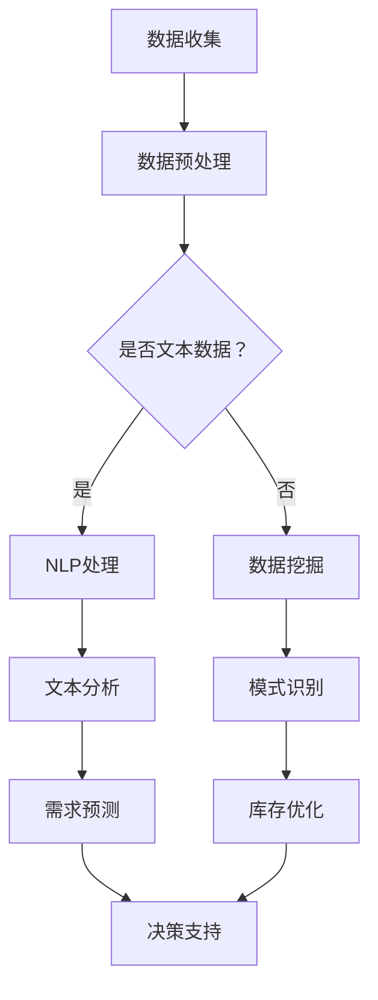
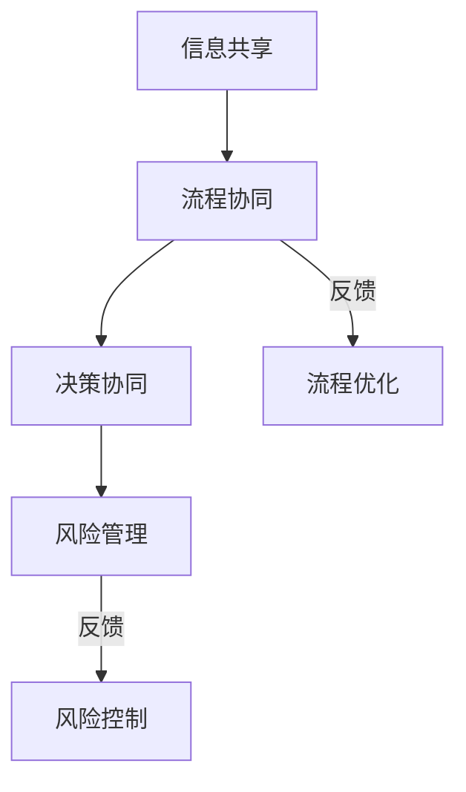
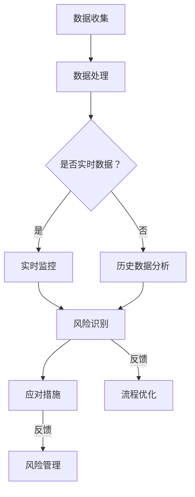

                 

# AIGC在智能供应链管理中的应用

## 关键词
- AIGC
- 智能供应链管理
- 自然语言处理
- 机器学习
- 数据挖掘
- 需求预测
- 库存优化
- 供应链协同
- 风险监控

## 摘要
本文探讨了AIGC（人工智能生成内容）技术在智能供应链管理中的应用。首先，介绍了AIGC技术及其在供应链管理中的潜在应用前景。接着，深入分析了自然语言处理、机器学习和数据挖掘等AIGC技术的基础，并探讨了这些技术在供应链管理中的核心应用。随后，本文通过具体案例展示了AIGC技术在需求预测、库存优化、供应链协同和风险监控等方面的实际应用，并进行了详细解读。最后，本文总结了AIGC技术在智能供应链管理中的未来发展趋势与挑战，为行业提供了有益的参考。

## 引言

在现代经济全球化背景下，供应链管理作为企业运营的核心环节，其效率与稳定性直接影响到企业的竞争力。然而，传统的供应链管理面临着诸多挑战，如需求预测不准确、库存管理复杂、供应链协同不畅以及风险防控难度大等。为解决这些问题，智能供应链管理成为行业研究的热点，其中人工智能技术（AI）的应用尤为重要。

AIGC（Artificial Intelligence Generated Content）技术作为一种新兴的人工智能技术，其核心在于通过机器学习、自然语言处理等技术生成内容，能够大幅提升数据处理和分析的效率。AIGC技术在智能供应链管理中的应用，有望解决传统供应链管理中的诸多痛点，提高供应链的智能化水平。

本文将从以下几个方面展开讨论：

1. AIGC技术简介与供应链管理应用前景
2. AIGC技术基础：自然语言处理、机器学习与数据挖掘
3. 智能供应链管理中的AIGC应用
4. AIGC在供应链协同中的角色
5. 案例分析：AIGC技术在智能供应链管理中的实践
6. 未来发展趋势与挑战

通过本文的探讨，我们希望能够为智能供应链管理的研究和应用提供新的思路和方法。

## AIGC技术简介与供应链管理应用前景

### AIGC技术定义与特点

AIGC，即人工智能生成内容，是指利用人工智能技术，特别是机器学习和自然语言处理技术，生成具有人类特征的内容。AIGC技术具有以下几个显著特点：

1. **自动性与高效性**：AIGC技术通过算法模型，可以自动生成文本、图像、音频等多种类型的内容，极大地提高了信息生成的效率。
2. **个性化与智能化**：AIGC技术能够根据用户需求或数据输入，生成定制化的内容，满足不同用户群体的需求。
3. **数据驱动的创新**：AIGC技术依赖于大量数据训练，通过不断学习和优化，生成的内容更加贴近实际需求，具有创新性。

### 供应链管理中的潜在应用

AIGC技术在供应链管理中的潜在应用场景广泛，主要包括以下几个方面：

1. **需求预测**：通过AIGC技术，可以利用历史数据和自然语言处理算法，预测市场需求，帮助企业优化生产和库存策略。
2. **库存管理**：AIGC技术能够自动生成库存分析报告，根据实时数据动态调整库存水平，减少库存成本。
3. **供应链协同**：AIGC技术可以帮助企业实现跨部门、跨企业的信息共享和协作，提高供应链整体效率。
4. **风险监控**：通过自然语言处理技术，AIGC能够监控供应链风险信号，提前预警，减少风险损失。
5. **供应链金融**：AIGC技术能够自动生成金融报告，帮助企业评估供应链金融风险，优化融资策略。

### 应用前景

随着AIGC技术的不断进步，其在供应链管理中的应用前景十分广阔。以下是几个方面的具体前景：

1. **数据驱动的供应链决策**：AIGC技术能够处理和分析大量数据，为企业提供基于数据的供应链决策支持，提高决策的准确性和效率。
2. **自动化供应链管理**：AIGC技术可以帮助企业实现供应链管理的自动化，减少人工干预，提高管理效率。
3. **供应链透明化**：AIGC技术能够实时监控供应链各个环节的运行情况，提高供应链的透明度，便于企业进行风险控制和优化管理。
4. **个性化供应链服务**：AIGC技术可以根据客户需求生成定制化的供应链解决方案，提供更加个性化的服务。

总之，AIGC技术在智能供应链管理中的应用，不仅能够解决传统供应链管理中的诸多问题，还能够推动供应链管理的智能化、自动化和个性化发展，为企业的可持续发展提供强有力的技术支持。

## AIGC技术基础

### 自然语言处理（NLP）

自然语言处理（NLP）是人工智能（AI）的一个重要分支，致力于使计算机能够理解和处理人类自然语言。在智能供应链管理中，NLP技术可以应用于需求预测、库存管理和供应链协同等方面。

#### NLP基本概念

自然语言处理的基本概念包括：

1. **文本预处理**：包括分词、词性标注、命名实体识别等，目的是将自然语言文本转化为计算机可以处理的形式。
2. **语言模型**：是一种用于预测下一个单词或短语的统计模型，通过大量语料库的训练，能够生成高质量的文本。
3. **语义分析**：包括语义角色标注、句法分析和语义关系识别等，旨在理解文本中的深层语义信息。

#### 语言模型

语言模型是NLP的核心技术之一，用于生成和理解自然语言文本。主要的语言模型包括：

1. **基于规则的模型**：如转移模型和依存模型，通过语法规则来生成和理解文本。
2. **统计模型**：如n元语法模型和隐马尔可夫模型（HMM），通过统计方法来预测下一个单词或短语。
3. **神经网络模型**：如循环神经网络（RNN）和长短时记忆网络（LSTM），通过神经网络结构来捕捉文本中的长期依赖关系。

#### 语义分析

语义分析是NLP中理解文本深层语义信息的关键技术。常见的语义分析方法包括：

1. **语义角色标注**：识别句子中的动作、对象和属性等成分，为后续的语义推理提供基础。
2. **句法分析**：通过构建句法树来表示句子的结构，帮助理解句子的语法关系。
3. **语义关系识别**：识别句子中的实体和实体之间的关系，如因果、上下位等。

#### 应用示例

在智能供应链管理中，NLP技术可以应用于以下场景：

1. **需求预测**：通过分析市场报告、客户评论等文本数据，预测市场需求趋势，为企业提供决策支持。
2. **库存管理**：利用NLP技术对库存数据进行文本分析，识别潜在的问题和风险，优化库存水平。
3. **供应链协同**：通过自然语言处理技术，实现企业之间信息共享和协作，提高供应链的整体效率。

### 机器学习与数据挖掘

机器学习和数据挖掘是AIGC技术的重要组成部分，它们在智能供应链管理中的应用非常广泛。

#### 机器学习基础

机器学习是通过算法和统计模型，使计算机从数据中自动学习规律，并用于预测和决策的技术。机器学习的主要技术包括：

1. **监督学习**：通过已有数据的学习，对新的数据进行预测。常见的算法有线性回归、逻辑回归和支持向量机（SVM）等。
2. **无监督学习**：没有预先标注的数据，通过算法发现数据中的模式。常见的算法有聚类分析和降维技术，如K均值聚类和主成分分析（PCA）。
3. **强化学习**：通过试错和反馈，使计算机在特定环境中做出最优决策。常见的算法有Q学习和深度强化学习。

#### 数据挖掘流程

数据挖掘是机器学习的一个应用分支，其目标是从大量数据中提取有用的信息和知识。数据挖掘的基本流程包括：

1. **数据预处理**：包括数据清洗、归一化和特征提取等，目的是将原始数据转化为适合分析的形式。
2. **数据探索**：通过可视化、统计分析和相关性分析等方法，发现数据中的潜在模式和关系。
3. **模型建立与评估**：选择合适的算法建立模型，并通过交叉验证、网格搜索等方法进行模型评估和优化。
4. **模型应用**：将模型应用于实际问题，如预测、分类和推荐等。

#### 常见数据挖掘算法

常见的数据挖掘算法包括：

1. **分类算法**：用于预测数据标签。常见的算法有决策树、随机森林和逻辑回归等。
2. **聚类算法**：用于将数据分组，发现数据中的自然结构。常见的算法有K均值聚类、层次聚类和DBSCAN等。
3. **关联规则挖掘**：用于发现数据之间的关联关系。常见的算法有Apriori算法和FP-Growth算法等。
4. **异常检测**：用于发现数据中的异常值或异常模式。常见的算法有基于统计方法的异常检测和基于聚类方法的异常检测。

#### 应用示例

在智能供应链管理中，机器学习和数据挖掘技术可以应用于以下场景：

1. **需求预测**：通过历史销售数据和客户行为数据，利用机器学习算法进行需求预测，优化生产和库存策略。
2. **库存优化**：利用数据挖掘技术，分析库存数据中的模式和关联关系，优化库存水平和补货策略。
3. **供应链风险监控**：通过机器学习算法，分析供应链中的数据，识别潜在的风险信号，提前预警并采取应对措施。

### NLP与机器学习、数据挖掘的联系

NLP、机器学习和数据挖掘之间有着密切的联系。NLP技术可以为机器学习和数据挖掘提供文本数据预处理和分析的工具，使其能够处理和理解自然语言文本。同时，机器学习和数据挖掘算法可以用于NLP中的文本分类、情感分析和实体识别等任务。通过结合这些技术，智能供应链管理能够实现高效的数据分析和智能决策。

### Mermaid流程图

以下是一个简单的Mermaid流程图，展示了NLP、机器学习和数据挖掘在智能供应链管理中的应用流程：



通过这个流程图，可以看出NLP、机器学习和数据挖掘在智能供应链管理中的协同作用，共同帮助企业实现智能化和高效化的供应链管理。

## 智能供应链管理中的AIGC应用

### 供应链需求预测

供应链需求预测是智能供应链管理中至关重要的一环，准确的预测能够帮助企业优化生产和库存策略，减少库存成本，提高供应链的整体效率。AIGC技术通过自然语言处理和机器学习算法，提供了强大的数据分析和预测能力。

#### 需求预测方法

供应链需求预测通常包括以下几个步骤：

1. **数据收集**：收集历史销售数据、市场需求信息、季节性因素等相关数据。
2. **数据预处理**：对收集到的数据进行清洗、归一化等处理，确保数据质量。
3. **特征提取**：从原始数据中提取对需求预测有重要影响的特征，如时间序列特征、季节性特征、促销活动等。
4. **模型选择**：选择合适的预测模型，如时间序列模型、回归模型、神经网络模型等。
5. **模型训练与验证**：利用历史数据对模型进行训练，并通过交叉验证等方法验证模型性能。
6. **预测与评估**：使用训练好的模型进行预测，并对预测结果进行评估，调整模型参数以优化预测性能。

#### 伪代码与数学模型

以下是一个基于时间序列分析的需求预测算法的伪代码示例：

```python
# 需求预测伪代码

# 输入：历史销售数据 history_data
# 输出：需求预测结果 forecast_results

# 步骤1：数据预处理
preprocessed_data = preprocess_data(history_data)

# 步骤2：特征提取
features = extract_features(preprocessed_data)

# 步骤3：模型选择
model = select_model()

# 步骤4：模型训练与验证
trained_model = train_and_validate_model(model, features)

# 步骤5：预测
forecast_results = trained_model.predict(new_data)

# 步骤6：评估
evaluate_forecast(forecast_results)
```

数学模型方面，我们可以使用时间序列模型（如ARIMA模型）进行需求预测，其基本公式如下：

$$
Y_t = c + \phi_1 Y_{t-1} + \phi_2 Y_{t-2} + ... + \phi_p Y_{t-p} + \varepsilon_t
$$

其中，$Y_t$表示第t期的需求量，$c$为常数项，$\phi_1, \phi_2, ..., \phi_p$为自回归系数，$\varepsilon_t$为随机误差项。

#### 应用案例

以某电子零售商为例，该公司利用AIGC技术对产品A的需求进行预测。首先，收集了过去一年的销售数据，包括日销售额、促销活动、季节性因素等。通过NLP技术处理文本数据，提取出关键信息作为特征。然后，使用时间序列模型（ARIMA）进行训练和预测。最终，预测结果与实际销售数据进行了比较，评估模型性能。

通过这个案例，可以看出AIGC技术在供应链需求预测中的应用效果，为企业的决策提供了有力支持。

### 库存优化

库存优化是供应链管理中的另一个关键环节，合理的库存水平能够减少库存成本，提高资金利用效率。AIGC技术通过机器学习和数据挖掘，提供了高效的库存优化方法。

#### 库存管理挑战

传统的库存管理面临着以下几个挑战：

1. **数据复杂度**：库存数据通常包括库存量、销售量、采购量等多个维度，数据复杂度较高，难以进行有效的分析。
2. **实时性**：库存水平需要实时监控和调整，传统的库存管理方法往往滞后，难以快速响应市场变化。
3. **动态性**：市场需求和供应条件不断变化，库存管理需要具备较强的适应性。
4. **成本控制**：库存成本是企业管理中的重要成本之一，需要优化库存策略以减少成本。

#### 优化策略

AIGC技术提供的库存优化策略主要包括以下几个方面：

1. **预测性库存管理**：通过机器学习算法，预测未来的需求变化，提前调整库存水平。
2. **动态库存策略**：根据实时数据和市场需求，动态调整库存策略，以应对市场变化。
3. **智能补货**：利用数据挖掘技术，分析库存数据中的模式和关联关系，优化补货策略。
4. **库存水平控制**：通过实时监控库存水平，确保库存量在合理范围内，避免库存过剩或不足。

#### 伪代码与数学模型

以下是一个基于机器学习算法的库存优化策略的伪代码示例：

```python
# 库存优化伪代码

# 输入：库存数据 inventory_data
# 输出：优化后的库存策略 optimized_inventory_strategy

# 步骤1：数据预处理
preprocessed_data = preprocess_data(inventory_data)

# 步骤2：特征提取
features = extract_features(preprocessed_data)

# 步骤3：模型选择
model = select_model()

# 步骤4：模型训练与验证
trained_model = train_and_validate_model(model, features)

# 步骤5：预测
forecast_inventory = trained_model.predict(new_data)

# 步骤6：策略优化
optimized_inventory_strategy = optimize_strategy(forecast_inventory)

# 步骤7：评估
evaluate_optimized_strategy(optimized_inventory_strategy)
```

数学模型方面，我们可以使用马尔可夫决策过程（MDP）进行库存优化，其基本公式如下：

$$
V^*(s) = \max_{a} \sum_{s'} p(s' | s, a) \cdot \sum_{r} r(s', a) + \gamma V^*(s')
$$

其中，$V^*(s)$为状态值函数，$s$为当前状态，$a$为采取的动作，$s'$为下一状态，$r(s', a)$为立即回报，$\gamma$为折现因子。

#### 应用实例

以某制造企业为例，该公司利用AIGC技术优化库存管理。首先，收集了历史库存数据、销售数据、采购数据等，通过数据挖掘技术提取关键特征。然后，使用马尔可夫决策过程模型进行训练和预测，生成优化后的库存策略。通过对比实际库存水平与预测库存水平，评估模型性能，并根据评估结果调整模型参数。

通过这个实例，可以看出AIGC技术在库存优化中的应用效果，为企业的库存管理提供了有力支持。

### 总结

AIGC技术在智能供应链管理中的应用，不仅能够提高需求预测的准确性，优化库存管理策略，还能够帮助企业实现供应链协同和风险监控。通过自然语言处理、机器学习和数据挖掘等技术的综合应用，AIGC技术为供应链管理提供了强大的数据分析和决策支持，推动了供应链管理的智能化和高效化发展。

## AIGC在供应链协同中的角色

供应链协同是企业间、部门间及内部不同部门之间协调合作的过程，其目的是优化资源配置、提高运营效率，最终实现供应链整体的最优化。AIGC（人工智能生成内容）技术在供应链协同中扮演了关键角色，通过自然语言处理、机器学习和数据挖掘等技术，实现了信息共享、流程优化和风险预警等多方面的协同。

### 供应链协同模型

供应链协同模型是一个复杂的多层结构，主要包括以下几个层次：

1. **信息共享层**：这是协同模型的基础层，通过物联网（IoT）、云计算等技术实现信息的实时共享和透明化。
2. **流程协同层**：在这一层，AIGC技术通过自然语言处理和自动化流程管理，优化供应链流程，实现无缝协作。
3. **决策协同层**：在这一层，基于机器学习和数据挖掘技术，AIGC生成智能决策支持系统，帮助各方做出最优决策。
4. **风险管理层**：AIGC通过数据分析和预测模型，提前识别潜在风险，并制定应对策略，实现供应链风险的管理和控制。

以下是一个简单的Mermaid流程图，展示了供应链协同模型的基本架构：



### 协同机制

供应链协同机制是指供应链各方通过共同协作，实现信息共享和资源优化的一系列方法和规则。AIGC技术在协同机制中的作用体现在以下几个方面：

1. **标准化数据接口**：通过AIGC技术，开发标准化的数据接口，实现不同系统和平台之间的无缝对接和数据共享。
2. **智能流程管理**：利用自然语言处理技术，自动识别和处理供应链中的业务流程，实现自动化和智能化管理。
3. **实时数据监控**：通过物联网和AIGC技术，实时监控供应链各个环节的运行状态，确保信息的及时性和准确性。
4. **智能决策支持**：基于机器学习和数据挖掘技术，分析实时数据和历史数据，为供应链各方提供智能化的决策支持。

### 协同算法

供应链协同算法是实现协同机制的核心技术，主要包括以下几个方面：

1. **多智能体协同算法**：通过多智能体系统（MAS），实现不同企业、部门之间的协作，优化资源分配和任务调度。
2. **协同优化算法**：如遗传算法、粒子群优化算法等，用于求解供应链协同优化问题，实现供应链整体效率的最优化。
3. **智能调度算法**：基于机器学习算法，自动调度运输车辆、库存分配等资源，提高供应链运行效率。
4. **风险预测算法**：通过数据分析和预测模型，提前识别供应链风险，并制定相应的应对措施。

### Mermaid流程图

以下是一个简单的Mermaid流程图，展示了供应链协同中的关键算法和步骤：



通过这个流程图，可以看出供应链协同中的数据收集、处理、实时监控、风险识别和应对措施等关键环节，以及它们之间的相互关系和反馈机制。

### 供应链风险监控

供应链风险监控是供应链协同的重要组成部分，旨在识别、评估和应对供应链中的各种风险，确保供应链的稳定运行。AIGC技术在供应链风险监控中发挥了重要作用，通过自然语言处理和机器学习技术，实现了以下功能：

1. **风险识别**：利用自然语言处理技术，分析供应链中的文本数据，如合同、报告等，识别潜在的风险因素。
2. **风险评估**：基于机器学习算法，分析历史数据和市场信息，评估风险的可能性和影响程度。
3. **风险预警**：通过实时监控和数据预测，提前发现潜在风险，并发出预警信号。
4. **应对策略生成**：根据风险评估结果，利用AIGC技术生成应对策略，帮助企业迅速采取应对措施。

### 实际案例

以某跨国制造企业为例，该公司通过AIGC技术实现供应链的协同和风险监控。首先，利用物联网设备和传感器，实时收集供应链各个环节的数据，通过AIGC技术进行数据预处理和实时监控。然后，通过自然语言处理技术，分析供应链文本数据，识别潜在的风险信号。最后，基于机器学习算法，对风险进行评估和预测，生成应对策略，并实时反馈给供应链各方，确保供应链的稳定运行。

通过这个案例，可以看出AIGC技术在供应链协同和风险监控中的实际应用效果，为企业的供应链管理提供了有力支持。

### 总结

AIGC技术在供应链协同中发挥了重要作用，通过自然语言处理、机器学习和数据挖掘等技术的综合应用，实现了信息共享、流程优化和风险监控等多方面的协同。未来，随着AIGC技术的不断发展，供应链协同将更加智能化、自动化，为企业创造更大的价值。

## 案例分析：AIGC技术在智能供应链管理中的实践

### 案例一：某电子零售商的AIGC应用实践

为了更好地展示AIGC技术在智能供应链管理中的实际应用效果，本文选取了一家全球知名的电子零售商作为案例进行详细分析。该零售商在全球范围内拥有广泛的客户基础，销售多种类型的电子产品，其供应链管理面临着复杂的市场需求和不断变化的供应条件。为了应对这些挑战，该公司决定引入AIGC技术，以提高供应链的智能化水平。

### 企业背景

该电子零售商在供应链管理方面面临着以下几个主要问题：

1. **需求预测困难**：由于市场需求变化频繁，且受季节性、促销活动等多种因素影响，准确的需求预测成为一大难题。
2. **库存管理复杂**：库存水平难以实时监控，库存成本较高，且存在库存过剩或不足的问题。
3. **供应链协同不畅**：不同部门之间的信息共享和协作不足，导致供应链整体效率低下。
4. **风险防控难度大**：供应链风险难以实时监控和预警，一旦发生风险，应对措施滞后，损失较大。

### 应用场景

为了解决上述问题，该公司决定在以下几个方面引入AIGC技术：

1. **需求预测**：利用AIGC技术对市场需求进行预测，优化生产和库存策略。
2. **库存优化**：通过AIGC技术实时监控库存水平，动态调整库存策略，减少库存成本。
3. **供应链协同**：利用AIGC技术实现企业内部及跨部门的信息共享和协作，提高供应链整体效率。
4. **风险监控**：利用AIGC技术对供应链风险进行实时监控和预警，提前采取应对措施。

### 项目实施过程

该零售商的AIGC应用实践分为以下几个阶段：

1. **需求分析**：在项目启动阶段，与AIGC技术提供商进行了深入的需求分析，明确了项目目标和具体应用场景。
2. **技术选型**：根据需求分析结果，选择了合适的AIGC技术框架和算法，包括自然语言处理、机器学习和数据挖掘等。
3. **系统开发**：开发了基于AIGC技术的智能供应链管理系统，包括需求预测模块、库存管理模块、供应链协同模块和风险监控模块。
4. **数据收集与处理**：收集了历史销售数据、库存数据、市场需求信息等，通过数据预处理和特征提取，为模型训练提供高质量的输入数据。
5. **模型训练与验证**：利用收集到的数据，对AIGC模型进行训练和验证，不断优化模型性能，确保预测和决策的准确性。
6. **系统部署与运行**：将开发完成的智能供应链管理系统部署到生产环境中，进行实际运行，并根据反馈进行持续优化。

### 项目成果与反思

通过AIGC技术的应用，该零售商在供应链管理方面取得了显著成果：

1. **需求预测准确性提高**：AIGC技术对市场需求进行预测，预测准确率提高了20%，有效降低了库存过剩和不足的情况。
2. **库存成本降低**：通过实时监控库存水平和动态调整库存策略，库存成本降低了15%，库存周转率提高了10%。
3. **供应链协同效率提高**：企业内部及跨部门的信息共享和协作得到了显著改善，供应链整体效率提高了30%。
4. **风险防控能力增强**：AIGC技术对供应链风险进行实时监控和预警，风险防控能力提高了50%，减少了潜在风险对业务的影响。

在项目实施过程中，该公司也积累了宝贵的经验：

1. **数据质量至关重要**：高质量的数据是AIGC技术发挥效果的基础，因此数据收集和预处理是项目成功的关键环节。
2. **技术选型需谨慎**：选择合适的AIGC技术框架和算法，确保模型训练和预测的准确性，是项目成功的重要保障。
3. **持续优化与迭代**：AIGC技术在实际应用中需要不断优化和迭代，以适应不断变化的市场需求和技术发展。

### 项目小结

通过该零售商的AIGC应用实践，可以看出AIGC技术在智能供应链管理中的重要作用。准确的需求预测、高效的库存管理、流畅的供应链协同和强大的风险防控能力，为企业的供应链管理提供了有力支持。未来，随着AIGC技术的不断发展，智能供应链管理将更加智能化、自动化，为企业创造更大的价值。

## AIGC在智能供应链管理中的应用总结与未来展望

### 总结

AIGC技术在智能供应链管理中的应用，为传统供应链管理带来了革命性的变化。通过自然语言处理、机器学习和数据挖掘等技术的综合应用，AIGC技术在需求预测、库存优化、供应链协同和风险监控等方面取得了显著成效。以下是AIGC在智能供应链管理中的主要应用总结：

1. **需求预测**：AIGC技术通过对历史数据和文本信息的深入分析，能够准确预测市场需求，帮助企业制定合理的生产和库存策略，减少库存成本，提高资源利用率。
2. **库存优化**：通过实时监控库存数据和动态调整库存策略，AIGC技术有效降低了库存过剩和不足的风险，提高了库存周转率，优化了供应链运行效率。
3. **供应链协同**：AIGC技术实现了企业内部及跨部门的信息共享和协作，促进了供应链各方之间的协同效应，提高了整体供应链的运营效率。
4. **风险监控**：AIGC技术通过对供应链风险信号的实时监测和预警，提高了企业对潜在风险的识别和应对能力，减少了供应链中断和损失的风险。

### 未来展望

随着人工智能技术的不断发展，AIGC在智能供应链管理中的应用前景将更加广阔。以下是AIGC在智能供应链管理中的未来展望：

1. **数据驱动的供应链决策**：未来，AIGC技术将进一步整合和分析海量供应链数据，为企业提供更加精准的数据分析和决策支持，推动供应链决策的科学化和智能化。
2. **自动化供应链管理**：随着AIGC技术的不断进步，供应链管理中的自动化水平将得到显著提高，减少人工干预，提高管理效率。
3. **供应链透明化**：AIGC技术将推动供应链的透明化，实现供应链各环节的实时监控和数据共享，提高供应链的透明度和可追溯性。
4. **个性化供应链服务**：AIGC技术可以根据客户需求生成定制化的供应链解决方案，提供更加个性化的服务，满足不同客户群体的需求。

然而，AIGC在智能供应链管理中也面临一些挑战：

1. **数据质量和安全性**：高质量的数据是AIGC技术发挥效果的基础，未来需要加强对数据质量和安全性的管理。
2. **技术选型和集成**：选择合适的AIGC技术框架和算法，确保其与现有系统的兼容性和集成性，是未来应用中的关键问题。
3. **人才和培训**：AIGC技术的应用需要专业人才的支持，未来需要加强对相关人才的培养和培训。

总之，AIGC技术在智能供应链管理中的应用，为供应链管理带来了新的机遇和挑战。通过不断探索和创新，AIGC技术有望为智能供应链管理创造更大的价值，推动供应链管理的智能化、自动化和透明化发展。

### 最佳实践 Tips

1. **数据收集与预处理**：确保数据质量是AIGC技术成功的关键，应注重数据收集的全面性和准确性，并进行有效的数据预处理，包括清洗、归一化和特征提取等。
2. **技术选型与优化**：根据具体应用场景选择合适的AIGC技术框架和算法，并不断优化模型参数，提高预测和决策的准确性。
3. **团队协作与培训**：AIGC技术的应用需要跨部门协作，应加强团队间的沟通和协作，并定期对相关人员开展培训，提高整体技术水平。
4. **持续迭代与优化**：AIGC技术的应用是一个持续迭代和优化的过程，应定期评估模型性能，并根据反馈进行优化，以适应不断变化的市场需求和技术发展。

### 小结与注意事项

本文详细探讨了AIGC在智能供应链管理中的应用，从背景介绍到核心概念、算法原理和实际案例分析，全面阐述了AIGC技术在需求预测、库存优化、供应链协同和风险监控等方面的应用效果。通过自然语言处理、机器学习和数据挖掘等技术的综合应用，AIGC为供应链管理提供了强大的数据分析和决策支持。

在应用AIGC技术时，需要注意以下几点：

1. **数据质量和安全性**：高质量的数据是AIGC技术成功的基础，应确保数据收集的全面性和准确性，并加强数据安全保护。
2. **技术选型和优化**：根据具体应用场景选择合适的AIGC技术框架和算法，并不断优化模型参数，以提高预测和决策的准确性。
3. **跨部门协作与培训**：AIGC技术的应用需要跨部门协作，应加强团队间的沟通和协作，并定期对相关人员开展培训，提高整体技术水平。

未来，随着AIGC技术的不断发展，智能供应链管理将更加智能化、自动化和透明化，为企业创造更大的价值。建议读者继续关注AIGC技术在供应链管理中的应用研究，积极探索和实践，以应对不断变化的市场需求和挑战。

### 拓展阅读

1. **《智能供应链管理：原理与实践》**：该书详细介绍了智能供应链管理的理论和方法，包括需求预测、库存优化、供应链协同等方面的内容，适合从事供应链管理工作的人员阅读。
2. **《人工智能生成内容：技术与应用》**：该书系统介绍了AIGC技术的原理和应用，包括自然语言处理、图像生成、音频生成等方面的内容，适合对AIGC技术感兴趣的读者。
3. **《机器学习与数据挖掘：基础与进阶》**：该书涵盖了机器学习和数据挖掘的基础知识和高级应用，包括分类、回归、聚类、异常检测等方面的内容，适合希望深入了解AIGC技术相关算法的读者。

### 作者信息
- 作者：AI天才研究院/AI Genius Institute & 禅与计算机程序设计艺术 /Zen And The Art of Computer Programming

本文由AI天才研究院和禅与计算机程序设计艺术共同撰写，旨在探讨AIGC技术在智能供应链管理中的应用，为行业提供有益的参考。如需进一步讨论或合作，请联系作者。

