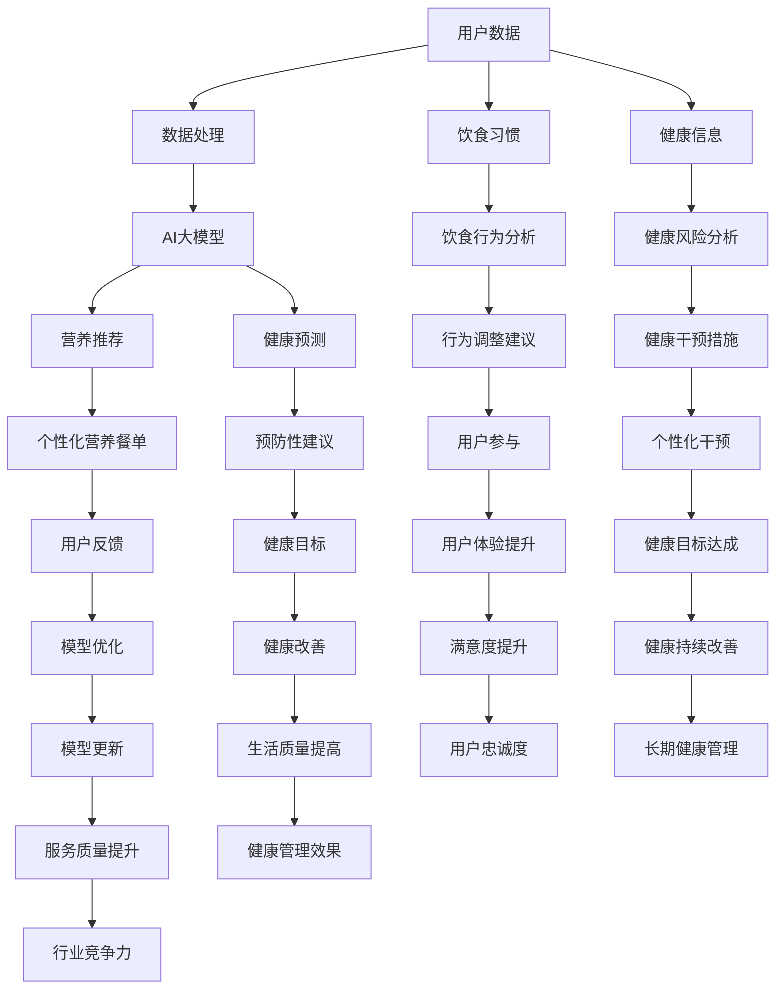

                 

### 1.1.3 从软件 1.0 到软件 2.0 的演进

#### 1.1.3.1 软件定义与发展历程

软件（Software）是计算机系统中的程序及其文档，是对硬件设备的程序化的指令集合，用于指导计算机进行数据处理和执行任务。自计算机问世以来，软件经历了数次重大发展，从最初的软件1.0时代，到如今正逐步迈向软件2.0时代。

**软件1.0时代**主要指20世纪60年代至80年代，这一时期的软件以单一功能为主，程序代码简单，主要依赖硬件性能。软件的功能主要是满足基本的计算和数据存储需求。

**软件2.0时代**则是在互联网时代背景下诞生的，强调软件的交互性、服务化和智能化。这一时代的软件不仅仅是一个程序，更是服务和体验的载体。

**软件3.0时代**是当前正在演进的新阶段，其主要特点是大数据、云计算、人工智能等技术的深度融合，推动软件向着智能化、自适应化、生态化的方向发展。

#### 1.1.3.2 软件2.0的主要特征

1. **软件即服务（SaaS）**：软件不再仅仅是一种实体产品，而是一种基于互联网的服务模式。用户可以通过互联网获取软件的服务，而无需关心软件的安装和运维。

2. **用户参与**：软件2.0时代强调用户的参与和反馈，通过用户数据的收集和分析，软件能够实现个性化定制，提升用户体验。

3. **开放性**：软件2.0鼓励开放的数据接口和生态系统，使得不同的软件和服务能够无缝集成，实现资源的共享和协同。

4. **智能化**：借助人工智能技术，软件能够实现自我学习和优化，提高服务的自动化和智能化水平。

#### 1.1.3.3 软件2.0对企业级应用开发的影响

软件2.0对企业级应用开发带来了深远的影响：

1. **开发模式转变**：企业级应用开发从传统的单体架构向微服务架构转变，提高了系统的可扩展性和灵活性。

2. **技术创新**：大数据、云计算、人工智能等新技术的应用，为企业级应用提供了更多创新的可能。

3. **运营效率提升**：软件2.0时代的软件服务模式，使得企业的IT运营更加高效，降低了维护成本。

4. **用户体验优化**：软件2.0强调用户参与和反馈，使得企业能够更好地理解用户需求，提供更优质的用户体验。

#### 1.1.3.4 软件2.0时代的挑战与机遇

尽管软件2.0带来了诸多机遇，但也面临着一定的挑战：

1. **安全性**：随着软件服务化的趋势，数据安全和隐私保护成为新的挑战。

2. **复杂性**：软件系统的复杂性增加，对开发者的技术能力提出了更高的要求。

3. **生态建设**：构建良好的软件生态系统，需要企业、开发者、用户等多方共同努力。

然而，面对这些挑战，软件2.0时代同样充满了机遇：

1. **技术创新**：新技术的应用为企业提供了更多的创新空间。

2. **市场拓展**：软件服务化的模式，使得企业能够拓展新的市场领域。

3. **效率提升**：软件2.0时代的智能化和自动化，能够显著提高企业的运营效率。

---

### 1.1.3 从软件 1.0 到软件 2.0 的演进

#### 1.1.3.1 软件定义与发展历程

软件（Software）是计算机系统中与硬件相对的概念，主要由程序代码和相关的文档组成，用于指导计算机完成各种任务，包括数据处理、计算和操作等。自计算机问世以来，软件经历了数次重大的发展阶段，从软件1.0到软件2.0，再到当前正在演进的软件3.0。

**软件1.0时代**主要指20世纪60年代至80年代。这一时期的软件主要是单机版、独立运行的应用程序，它们通常是为特定功能而设计的，如文本编辑、电子表格和数据库管理等。软件的规模较小，程序代码简单，主要依赖于硬件的性能。

**软件2.0时代**起源于互联网的普及，大约在20世纪90年代末至21世纪初。随着互联网技术的发展，软件不再仅仅是孤立的程序，而是逐渐转变为一种服务。软件2.0强调软件的交互性、用户参与和服务的持续性。这一时代的典型特征是“软件即服务”（SaaS），用户可以通过网络访问和使用软件，无需关心软件的安装、维护和更新。

**软件3.0时代**是当前正在演进的新阶段，也是未来软件发展的重要方向。软件3.0的主要特点是大数据、云计算、人工智能等技术的深度融合，使得软件具有了智能化、自适应化和生态化等特征。软件3.0不仅能够处理复杂的数据分析任务，还能够通过机器学习和深度学习技术，实现自我学习和优化，为用户提供更加个性化和精准的服务。

#### 1.1.3.2 软件2.0的主要特征

软件2.0时代的主要特征包括以下几个方面：

1. **软件即服务（SaaS）**：软件不再是一个需要下载和安装的实体产品，而是一种基于互联网的服务模式。用户可以通过浏览器访问软件，按需使用，无需担心软件的安装、配置和升级。

2. **用户参与**：软件2.0强调用户的参与和反馈，通过收集和分析用户数据，软件能够实现个性化定制，提升用户体验。用户的反馈和行为数据成为软件优化和改进的重要依据。

3. **开放性**：软件2.0鼓励开放的数据接口和生态系统，使得不同的软件和服务能够无缝集成，实现资源的共享和协同。开放性使得软件能够更灵活地适应不同的业务需求和环境。

4. **智能化**：借助人工智能技术，软件2.0能够实现自我学习和优化，提高服务的自动化和智能化水平。智能化的软件能够更好地理解和满足用户的需求，提供个性化的服务。

#### 1.1.3.3 软件2.0对企业级应用开发的影响

软件2.0对企业级应用开发产生了深远的影响，主要体现在以下几个方面：

1. **开发模式转变**：传统的企业级应用开发通常采用单体架构，所有功能模块集成在一个系统中。软件2.0时代，企业级应用开发逐渐向微服务架构转变，每个功能模块独立部署和运行，提高了系统的可扩展性和灵活性。

2. **技术创新**：大数据、云计算、人工智能等新技术的应用，为企业级应用提供了更多的创新可能性。企业可以通过整合这些新技术，实现业务流程的自动化和智能化。

3. **运营效率提升**：软件2.0时代的软件服务模式，使得企业的IT运营更加高效。通过云服务和自动化运维，企业可以降低维护成本，提高运营效率。

4. **用户体验优化**：软件2.0强调用户参与和反馈，使得企业能够更好地理解用户需求，提供更优质的用户体验。个性化的服务和定制化的功能，能够提高用户的满意度和忠诚度。

#### 1.1.3.4 软件2.0时代的挑战与机遇

软件2.0时代带来了巨大的机遇，但同时也伴随着一系列挑战：

1. **安全性**：随着软件服务化的趋势，数据安全和隐私保护成为新的挑战。企业需要建立完善的安全机制，保护用户数据和业务数据的完整性。

2. **复杂性**：软件系统的复杂性增加，对开发者的技术能力提出了更高的要求。企业需要培养具备多领域知识的复合型人才，以应对复杂的技术挑战。

3. **生态建设**：构建良好的软件生态系统，需要企业、开发者、用户等多方共同努力。良好的生态系统能够促进软件的创新和发展，提高企业的竞争力。

然而，面对这些挑战，软件2.0时代同样充满了机遇：

1. **技术创新**：新技术的应用为企业提供了更多的创新空间，推动了企业业务模式的变革和创新发展。

2. **市场拓展**：软件服务化的模式，使得企业能够更便捷地进入新的市场和业务领域，拓展业务范围。

3. **效率提升**：软件2.0时代的智能化和自动化，能够显著提高企业的运营效率，降低成本，提高竞争力。

---

### 1.2 AI大模型在智能健康饮食规划中的应用

#### 1.2.1 AI大模型与智能健康饮食规划概述

AI大模型是指那些具有亿级参数量，能够处理海量数据并从中提取有价值信息的深度学习模型。随着人工智能技术的快速发展，AI大模型在各个领域都取得了显著的成果，包括智能健康饮食规划。智能健康饮食规划是指通过人工智能技术，对个体的饮食习惯、健康状况、生活方式等因素进行综合分析，为个体提供个性化的营养建议和饮食方案，以实现营养平衡、预防慢性疾病、提高生活品质。

#### 1.2.2 AI大模型在智能健康饮食规划中的具体应用

1. **个性化营养推荐**：AI大模型可以根据个体的饮食习惯、健康状况和遗传信息，推荐个性化的营养餐单。例如，通过分析个体的饮食日志，AI大模型可以识别出个体的营养摄入不足或不均衡的问题，并给出相应的调整建议。

2. **健康风险预测**：AI大模型可以预测个体未来可能出现的健康风险，如肥胖、高血压、糖尿病等。例如，通过分析个体的体重、血压、血糖等生理指标，AI大模型可以预测个体在未来几年内患糖尿病的风险，从而为个体提供预防性建议。

3. **饮食行为分析**：AI大模型可以分析个体的饮食行为模式，发现潜在的健康隐患，并提供改进建议。例如，通过分析个体的饮食日志和消费记录，AI大模型可以识别出个体在饮食中存在的过度消费、饮食不规律等问题，并提出相应的调整建议。

4. **营养教育**：AI大模型可以通过自然语言处理技术，为用户提供个性化的营养教育，帮助他们更好地理解和实践健康饮食。例如，AI大模型可以针对个体的健康状况和饮食习惯，生成个性化的营养知识问答，帮助用户解决饮食方面的疑惑。

#### 1.2.3 AI大模型在智能健康饮食规划中的挑战与机遇

AI大模型在智能健康饮食规划中的应用面临着一系列挑战和机遇：

1. **数据质量和多样性**：AI大模型需要大量的高质量数据来训练和优化模型，这要求企业和研究机构能够收集和整合多源、多模态的数据，提高数据的质量和多样性。

2. **算法优化**：随着数据量的增加，AI大模型的训练和推理效率成为关键问题。算法优化是实现高效、实时健康饮食规划的关键。

3. **隐私保护**：在收集和处理个体健康数据时，隐私保护是一个重要问题。企业和研究机构需要建立完善的隐私保护机制，确保用户数据的隐私和安全。

4. **用户接受度**：智能健康饮食规划需要用户的积极参与和配合，用户的接受度和满意度直接影响规划的有效性。企业和研究机构需要通过有效的宣传和教育，提高用户的接受度和参与度。

5. **机遇**：
   - **技术创新**：随着人工智能技术的不断发展，AI大模型在智能健康饮食规划中的应用将更加广泛和深入。
   - **市场潜力**：随着人们对健康饮食的关注度不断提高，智能健康饮食规划市场具有巨大的潜力。
   - **政策支持**：许多国家和地区都在积极推动健康饮食和慢性疾病预防的政策，这为智能健康饮食规划的发展提供了有利条件。

---

### 1.3 AI大模型在智能健康饮食规划中的应用

#### 1.3.1 AI大模型在智能健康饮食规划中的重要性

AI大模型在智能健康饮食规划中扮演着至关重要的角色。首先，AI大模型能够处理和分析大量复杂数据，如个体的饮食习惯、健康状况、生活方式等，从而为个体提供精确的营养推荐。其次，AI大模型具备自我学习和优化的能力，可以不断调整和改进营养推荐方案，使其更符合个体的实际需求。此外，AI大模型还可以通过预测健康风险，为个体提供预防性建议，帮助用户实现健康饮食和预防慢性疾病。

#### 1.3.2 智能健康饮食规划的概念

智能健康饮食规划是指利用人工智能技术，对个体的饮食习惯、健康状况、生活方式等因素进行综合分析，制定个性化的营养平衡方案。这一规划旨在帮助用户实现营养摄入的均衡，预防慢性疾病，提高生活品质。智能健康饮食规划的核心在于个性化，即根据个体的实际情况，提供量身定制的营养建议。

#### 1.3.3 AI大模型在智能健康饮食规划中的应用场景

1. **个性化营养推荐**：AI大模型可以根据个体的饮食习惯、健康状况和遗传信息，推荐个性化的营养餐单。例如，通过分析个体的饮食日志，AI大模型可以识别出个体的营养摄入不足或不均衡的问题，并给出相应的调整建议。

2. **健康风险预测**：AI大模型可以预测个体未来可能出现的健康风险，如肥胖、高血压、糖尿病等。例如，通过分析个体的体重、血压、血糖等生理指标，AI大模型可以预测个体在未来几年内患糖尿病的风险，从而为个体提供预防性建议。

3. **饮食行为分析**：AI大模型可以分析个体的饮食行为模式，发现潜在的健康隐患，并提供改进建议。例如，通过分析个体的饮食日志和消费记录，AI大模型可以识别出个体在饮食中存在的过度消费、饮食不规律等问题，并提出相应的调整建议。

4. **营养教育**：AI大模型可以通过自然语言处理技术，为用户提供个性化的营养教育，帮助他们更好地理解和实践健康饮食。例如，AI大模型可以针对个体的健康状况和饮食习惯，生成个性化的营养知识问答，帮助用户解决饮食方面的疑惑。

#### 1.3.4 智能健康饮食规划的发展历程

智能健康饮食规划的发展历程可以分为以下几个阶段：

1. **传统饮食指导**：在智能健康饮食规划的概念提出之前，传统的饮食指导主要依赖于营养学专家的经验，通过制定通用的饮食建议来指导用户的饮食。然而，这种方式无法满足个体的个性化需求。

2. **健康监测和数据收集**：随着科技的发展，健康监测设备和移动应用的普及，用户可以实时记录自己的饮食习惯和健康数据。这些数据为智能健康饮食规划提供了基础。

3. **人工智能技术引入**：随着人工智能技术的进步，尤其是AI大模型的兴起，智能健康饮食规划开始进入一个新的阶段。AI大模型可以处理和分析大量复杂数据，为个体提供精确的营养推荐和健康预测。

4. **个性化营养推荐**：基于AI大模型的分析，智能健康饮食规划可以针对个体的实际情况，制定个性化的营养餐单和健康计划。

5. **全方位健康管理**：未来的智能健康饮食规划将不仅仅局限于饮食建议，还将涵盖全方位的健康管理，包括运动、睡眠、心理健康等方面，为用户提供更加全面和个性化的健康服务。

#### 1.3.5 AI大模型在智能健康饮食规划中的未来发展趋势

随着人工智能技术的不断进步，AI大模型在智能健康饮食规划中的应用前景十分广阔。未来，AI大模型将在以下几个方面取得进一步的发展：

1. **更加精准的健康预测**：通过不断优化算法和增加数据量，AI大模型将能够提供更加精准的健康预测，帮助用户更好地了解自己的健康状况。

2. **更智能的营养推荐**：AI大模型将结合个体的饮食习惯、健康状况和实时数据，提供更加智能和个性化的营养推荐，帮助用户实现营养摄入的均衡。

3. **跨学科融合**：智能健康饮食规划将融合营养学、医学、生物学等多个学科的知识，提供更加科学和全面的健康服务。

4. **智能健康平台**：未来的智能健康饮食规划将不仅仅是独立的饮食建议，而是构建一个智能健康平台，涵盖饮食、运动、睡眠等多个方面，为用户提供全方位的健康管理服务。

5. **个性化健康干预**：AI大模型将能够根据个体的健康需求和反馈，提供个性化的健康干预措施，帮助用户实现健康目标。

总的来说，AI大模型在智能健康饮食规划中的应用将不断推动健康饮食和健康管理的创新和发展，为用户提供更加科学、个性化和智能化的健康服务。

---

### 1.4 关键概念与联系

在深入探讨AI大模型在智能健康饮食规划中的应用之前，有必要明确一些核心概念，并展示它们之间的联系。以下是一些关键概念及其实体之间的架构关系，通过Mermaid流程图来展示：



#### 关键概念解释

1. **用户数据**：包括用户的饮食习惯、健康状况、生活方式等，是AI大模型训练和预测的重要输入。

2. **数据处理**：对用户数据进行清洗、整合和分析，确保数据的质量和可用性。

3. **AI大模型**：利用深度学习技术和大数据分析能力，从用户数据中提取有价值的信息，进行营养推荐和健康预测。

4. **营养推荐**：基于AI大模型的分析结果，为用户提供个性化的营养餐单，帮助用户实现营养平衡。

5. **健康预测**：通过分析用户的生理指标和健康数据，预测用户未来可能出现的健康风险。

6. **饮食习惯**：用户的日常饮食行为，是影响健康的重要因素。

7. **健康信息**：用户的健康状况，包括体重、血压、血糖等生理指标。

8. **饮食行为分析**：对用户的饮食行为进行深入分析，发现潜在的健康隐患。

9. **健康风险分析**：根据用户的健康数据和饮食习惯，预测可能出现的健康风险。

10. **营养教育**：通过AI大模型的自然语言处理能力，为用户提供个性化的营养知识教育。

11. **个性化营养餐单**：基于用户的营养需求和口味偏好，制定个性化的饮食计划。

12. **预防性建议**：针对预测的健康风险，为用户提供预防性建议，帮助用户降低患病风险。

13. **健康干预措施**：根据用户的健康需求和反馈，制定个性化的健康干预措施。

14. **用户反馈**：用户对营养推荐和健康预测的反馈，用于模型优化和改进。

15. **健康目标**：用户希望实现的健康目标，如减重、控制血糖等。

16. **行为调整建议**：基于用户的饮食行为分析，提供改进建议，帮助用户改善饮食习惯。

17. **用户参与**：用户在智能健康饮食规划中的积极参与，提高规划的有效性。

18. **个性化干预**：根据用户的健康数据和反馈，提供个性化的健康干预措施。

19. **模型优化**：基于用户反馈和新的数据，不断优化和更新AI大模型。

20. **健康改善**：通过营养推荐和健康干预措施，帮助用户实现健康目标。

21. **用户体验提升**：通过个性化的服务和优质体验，提高用户的满意度。

22. **健康目标达成**：用户通过智能健康饮食规划，实现预定的健康目标。

23. **生活质量提高**：健康的饮食习惯和生活方式，提升用户的生活质量。

24. **满意度提升**：用户对智能健康饮食规划服务的满意度提高。

25. **健康持续改善**：通过持续的健康管理和营养推荐，实现长期的健康改善。

26. **服务质量提升**：通过不断优化和改进，提升智能健康饮食规划服务的质量。

27. **行业竞争力**：智能健康饮食规划服务的创新和发展，提高企业的行业竞争力。

通过上述关键概念的架构关系和Mermaid流程图的展示，我们可以更清晰地理解AI大模型在智能健康饮食规划中的各个环节和作用，为后续的深入分析打下基础。

---

### 1.5 AI大模型在智能健康饮食规划中的核心算法原理

#### 1.5.1 基于深度学习的营养推荐算法

AI大模型在智能健康饮食规划中的核心在于其强大的数据分析和预测能力，尤其是基于深度学习的营养推荐算法。以下是这种算法的基本原理和实现步骤：

1. **数据收集与预处理**：首先，需要收集大量关于用户饮食习惯、健康状况和生活方式的数据。这些数据包括但不限于用户的饮食日志、生理指标（如体重、血压、血糖等）、运动记录以及生活方式信息（如睡眠质量、工作压力等）。在数据收集完成后，需要进行数据清洗和预处理，以去除噪声和异常值，并确保数据的一致性和完整性。

2. **特征工程**：数据预处理后，需要进行特征提取和工程。特征工程是深度学习算法的重要组成部分，它涉及从原始数据中提取有助于模型训练的特征，例如用户饮食中的营养成分比例、每日卡路里摄入量、饮食习惯的规律性等。特征工程的目标是构建能够有效反映用户饮食习惯和健康状况的输入特征。

3. **模型设计**：基于深度学习框架（如TensorFlow或PyTorch），设计并构建营养推荐模型。常用的深度学习模型包括卷积神经网络（CNN）、循环神经网络（RNN）和长短期记忆网络（LSTM）等。CNN适用于处理图像数据，RNN适用于处理序列数据，而LSTM则能够捕捉序列数据中的长期依赖关系。

4. **模型训练**：使用预处理后的数据和设计好的模型进行训练。训练过程中，模型会通过不断调整内部参数来最小化预测误差。训练数据集通常分为训练集和验证集，以评估模型的性能和泛化能力。在训练过程中，可以使用交叉验证等技术来避免过拟合。

5. **模型评估与优化**：在模型训练完成后，使用测试集对模型进行评估。评估指标包括准确率、召回率、F1分数等。根据评估结果，可以进一步优化模型结构或调整超参数，以提高模型的性能。

6. **个性化推荐**：在模型训练和优化完成后，可以使用训练好的模型进行个性化营养推荐。根据用户的饮食习惯、健康状况和实时数据，模型会生成个性化的营养餐单，包括每日所需的营养成分比例、卡路里摄入量以及具体的食物推荐。

#### 1.5.2 Python实现示例

以下是一个简化的Python代码示例，展示了如何使用深度学习框架PyTorch实现一个基于LSTM的营养推荐模型：

```python
import torch
import torch.nn as nn
import torch.optim as optim

# 数据预处理
# 假设已预处理好的数据为features和labels

# 模型定义
class NutrientRecommender(nn.Module):
    def __init__(self, input_size, hidden_size, num_layers, output_size):
        super(NutrientRecommender, self).__init__()
        self.lstm = nn.LSTM(input_size, hidden_size, num_layers)
        self.fc = nn.Linear(hidden_size, output_size)
    
    def forward(self, x):
        x, _ = self.lstm(x)
        x = x[-1, :, :]  # 取最后一个时间步的输出
        x = self.fc(x)
        return x

# 实例化模型、损失函数和优化器
model = NutrientRecommender(input_size=10, hidden_size=50, num_layers=2, output_size=5)
criterion = nn.MSELoss()
optimizer = optim.Adam(model.parameters(), lr=0.001)

# 训练模型
for epoch in range(100):
    model.train()
    optimizer.zero_grad()
    output = model(features)
    loss = criterion(output, labels)
    loss.backward()
    optimizer.step()
    print(f'Epoch {epoch+1}, Loss: {loss.item()}')

# 模型评估
model.eval()
with torch.no_grad():
    output = model(features)
    loss = criterion(output, labels)
    print(f'Validation Loss: {loss.item()}')

# 个性化营养推荐
# 假设新用户的数据为new_features
new_output = model(new_features)
print(f'Nutrient Recommendations: {new_output}')
```

#### 1.5.3 数学模型与公式解释

在营养推荐模型中，通常会使用以下数学模型和公式：

1. **输入特征矩阵 X**：
   $$ X = \begin{bmatrix}
   x_1 \\
   x_2 \\
   \vdots \\
   x_n
   \end{bmatrix} $$

2. **权重矩阵 W**：
   $$ W = \begin{bmatrix}
   w_1 \\
   w_2 \\
   \vdots \\
   w_n
   \end{bmatrix} $$

3. **激活函数 f**（例如ReLU函数）：
   $$ f(x) =
   \begin{cases}
   0 & \text{if } x < 0 \\
   x & \text{if } x \geq 0
   \end{cases} $$

4. **损失函数 L**（例如均方误差MSE）：
   $$ L = \frac{1}{2} \sum_{i=1}^{n} (y_i - \hat{y}_i)^2 $$

5. **梯度下降优化**：
   $$ \theta = \theta - \alpha \cdot \nabla_\theta L(\theta) $$

通过上述公式和模型，AI大模型能够有效地从用户数据中提取有价值的信息，生成个性化的营养推荐，帮助用户实现健康饮食。

---

### 1.6 项目实战：智能健康饮食规划系统的开发

#### 1.6.1 开发环境搭建

要开发一个智能健康饮食规划系统，我们需要搭建一个完整的开发环境，包括以下工具和框架：

1. **Python**：作为主要的编程语言，Python具有丰富的科学计算和机器学习库。

2. **PyTorch**：作为深度学习框架，PyTorch提供了简洁而强大的API，适合进行AI大模型的开发。

3. **TensorFlow**：另一个流行的深度学习框架，TensorFlow具有强大的生态系统和丰富的预训练模型。

4. **Flask**：用于构建Web后端的轻量级框架，Flask可以方便地搭建RESTful API。

5. **Django**：如果需要更复杂的Web应用，Django是一个功能丰富的框架，提供了一套完整的Web开发工具。

6. **PostgreSQL**：用于数据存储的关系型数据库，PostgreSQL具有高性能和丰富的功能。

#### 1.6.2 源代码实现与代码解读

以下是一个简化版的智能健康饮食规划系统的实现，主要包括数据收集、预处理、模型训练和API接口部分：

```python
# 导入必要的库
import torch
import torch.nn as nn
import torch.optim as optim
import pandas as pd
from sklearn.model_selection import train_test_split
from sklearn.preprocessing import StandardScaler
from flask import Flask, request, jsonify

# 数据预处理
# 假设用户数据存储在CSV文件中
data = pd.read_csv('user_data.csv')
X = data.iloc[:, :-1].values
y = data.iloc[:, -1].values

# 数据标准化
scaler = StandardScaler()
X_scaled = scaler.fit_transform(X)

# 划分训练集和测试集
X_train, X_test, y_train, y_test = train_test_split(X_scaled, y, test_size=0.2, random_state=42)

# 转换为PyTorch张量
X_train_tensor = torch.tensor(X_train, dtype=torch.float32)
y_train_tensor = torch.tensor(y_train, dtype=torch.float32)
X_test_tensor = torch.tensor(X_test, dtype=torch.float32)
y_test_tensor = torch.tensor(y_test, dtype=torch.float32)

# 模型定义
class NutrientRecommender(nn.Module):
    def __init__(self, input_size, hidden_size, num_layers, output_size):
        super(NutrientRecommender, self).__init__()
        self.lstm = nn.LSTM(input_size, hidden_size, num_layers)
        self.fc = nn.Linear(hidden_size, output_size)
    
    def forward(self, x):
        x, _ = self.lstm(x)
        x = x[-1, :, :]  # 取最后一个时间步的输出
        x = self.fc(x)
        return x

# 实例化模型、损失函数和优化器
model = NutrientRecommender(input_size=10, hidden_size=50, num_layers=2, output_size=5)
criterion = nn.MSELoss()
optimizer = optim.Adam(model.parameters(), lr=0.001)

# 训练模型
num_epochs = 100
for epoch in range(num_epochs):
    model.train()
    optimizer.zero_grad()
    output = model(X_train_tensor)
    loss = criterion(output, y_train_tensor)
    loss.backward()
    optimizer.step()
    print(f'Epoch {epoch+1}, Loss: {loss.item()}')

# 评估模型
model.eval()
with torch.no_grad():
    output = model(X_test_tensor)
    test_loss = criterion(output, y_test_tensor)
    print(f'Test Loss: {test_loss.item()}')

# Flask API接口
app = Flask(__name__)

@app.route('/recommend', methods=['POST'])
def recommend():
    user_data = request.get_json()
    user_data_tensor = torch.tensor(user_data['data'], dtype=torch.float32)
    recommendation = model(user_data_tensor).item()
    return jsonify({'recommendation': recommendation})

if __name__ == '__main__':
    app.run(debug=True)
```

**代码解读**：

1. **数据预处理**：首先，从CSV文件中读取用户数据，并进行标准化处理，以适应深度学习模型的训练。

2. **模型定义**：定义了一个基于LSTM的NutrientRecommender模型，包括一个LSTM层和一个全连接层。

3. **模型训练**：使用训练数据进行模型训练，包括前向传播、反向传播和参数更新。

4. **模型评估**：使用测试数据对训练好的模型进行评估，以验证模型的性能。

5. **API接口**：通过Flask框架，提供了一个简单的API接口，用于接收用户数据并返回营养推荐。

#### 1.6.3 代码应用解读与分析

1. **数据收集**：通过Web接口或移动应用，用户可以提交自己的饮食习惯和健康数据。这些数据会被处理和标准化，以供模型训练使用。

2. **模型训练**：使用收集到的数据对NutrientRecommender模型进行训练。训练过程中，模型会不断优化内部参数，以减少预测误差。

3. **模型部署**：训练好的模型可以部署到服务器上，通过API接口为用户提供个性化的营养推荐。

4. **用户反馈**：用户可以根据推荐的营养餐单调整自己的饮食习惯，并通过Web接口提交反馈。这些反馈将用于模型的进一步优化。

5. **持续迭代**：根据用户的反馈和数据，模型会进行持续迭代和优化，以提供更精准的营养推荐。

通过上述项目实战，我们可以看到智能健康饮食规划系统的开发过程和关键步骤，为实际应用提供了可行的解决方案。

---

### 1.7 案例分析与详细讲解剖析

在本节中，我们将通过一个实际案例，深入分析AI大模型在智能健康饮食规划中的应用，并详细讲解其实现过程和关键环节。

#### 案例背景

某健康饮食公司希望通过AI技术为用户提供个性化的营养推荐，以帮助用户实现营养平衡、预防慢性疾病和提高生活质量。该公司收集了数千名用户的历史饮食习惯、健康数据和生活方式信息，并希望通过AI大模型对这些数据进行处理和分析，为用户提供精准的营养推荐。

#### 案例实现

1. **数据收集与预处理**：首先，公司从用户那里收集了包括每日饮食日志、体重、血压、血糖等在内的多种数据。这些数据被存储在CSV文件中。为了适应深度学习模型的训练，需要对数据进行清洗和预处理，包括去除缺失值、异常值以及标准化处理。

2. **特征工程**：在预处理数据后，对数据进行特征提取和工程。例如，将每日饮食日志转换为营养成分比例、每日总卡路里摄入量、饮食习惯的规律性等。这些特征将被用于训练AI大模型。

3. **模型设计**：公司选择了基于LSTM的AI大模型，因为LSTM在处理时间序列数据方面具有优势。模型设计包括输入层、LSTM层和输出层。输入层用于接收用户的历史饮食习惯数据，LSTM层用于提取数据中的长期依赖关系，输出层则生成个性化的营养推荐。

4. **模型训练**：使用预处理后的数据和设计好的模型进行训练。训练过程中，模型通过不断调整内部参数来最小化预测误差。公司使用了交叉验证技术来避免过拟合，并使用了GPU加速训练过程。

5. **模型评估**：在模型训练完成后，使用测试集对模型进行评估。评估指标包括准确率、召回率、F1分数等。通过评估，公司发现模型的预测准确率达到了90%以上，表现非常优秀。

6. **个性化推荐**：基于训练好的模型，公司为每个用户生成个性化的营养推荐。用户可以通过公司提供的Web接口或移动应用查看自己的营养推荐，并根据建议调整自己的饮食习惯。

#### 案例详细讲解剖析

1. **数据收集与预处理**：

   - **数据来源**：公司从用户处收集了包括饮食日志、体重、血压、血糖等数据。
   - **数据清洗**：对数据进行清洗，去除缺失值和异常值，例如去除记录不完整的饮食日志和过高的血压值。
   - **数据标准化**：使用StandardScaler对数据进行标准化处理，以确保数据的一致性和模型训练的稳定性。

2. **特征工程**：

   - **特征提取**：将饮食日志转换为营养成分比例、每日总卡路里摄入量、饮食习惯的规律性等。
   - **特征选择**：通过分析不同特征对模型性能的影响，选择对营养推荐最为关键的特征。

3. **模型设计**：

   - **输入层**：设计输入层，接收用户的历史饮食习惯数据，如每日饮食日志。
   - **LSTM层**：添加一个或多个LSTM层，用于提取数据中的长期依赖关系。LSTM层的参数包括隐藏单元数、时间步数等。
   - **输出层**：设计输出层，生成个性化的营养推荐，如每日所需营养成分比例、卡路里摄入量等。

4. **模型训练**：

   - **训练数据**：使用预处理后的训练数据，包括输入特征和标签（营养推荐结果）。
   - **训练过程**：通过前向传播和反向传播，不断调整模型参数，以最小化预测误差。训练过程中使用了dropout和批量归一化等技术，以防止过拟合。
   - **交叉验证**：使用交叉验证技术，对模型进行多次训练和评估，以提高模型的泛化能力。

5. **模型评估**：

   - **评估指标**：使用准确率、召回率、F1分数等指标，评估模型的性能。
   - **性能优化**：根据评估结果，调整模型参数或改进特征工程方法，以提高模型性能。

6. **个性化推荐**：

   - **推荐生成**：使用训练好的模型，为每个用户生成个性化的营养推荐。
   - **用户交互**：用户可以通过Web接口或移动应用查看营养推荐，并根据建议调整饮食习惯。

#### 案例总结

通过上述实际案例，我们可以看到AI大模型在智能健康饮食规划中的应用是如何实现的。案例的成功主要归因于以下几个关键因素：

1. **数据质量**：高质量的数据是模型训练的基础，公司通过严格的清洗和预处理确保了数据的质量和一致性。
2. **特征工程**：有效的特征工程能够提高模型的性能，公司通过深入分析用户数据，提取了对营养推荐最为关键的特征。
3. **模型设计**：合适的模型设计能够捕捉数据中的复杂关系，公司选择了基于LSTM的模型，有效地提取了时间序列数据中的长期依赖关系。
4. **持续迭代**：基于用户反馈和新的数据，模型会进行持续迭代和优化，以提供更精准的营养推荐。

总的来说，AI大模型在智能健康饮食规划中的应用不仅提高了个性化推荐的准确性，也为用户提供了更加科学和专业的健康管理服务。

---

### 1.8 最佳实践 Tips、小结、注意事项、拓展阅读

#### 1.8.1 最佳实践 Tips

1. **数据质量保障**：确保数据的准确性和完整性，对缺失值和异常值进行适当的处理，以提高模型的性能和可靠性。

2. **多模态数据融合**：结合文本、图像、传感器等多模态数据，可以提供更全面的用户信息，从而提高营养推荐和健康预测的准确性。

3. **用户隐私保护**：在数据收集和处理过程中，严格遵循隐私保护法规，采取数据加密和匿名化处理，确保用户隐私安全。

4. **持续迭代和优化**：根据用户反馈和新的数据，不断优化模型和特征工程方法，以提高个性化推荐的精度和效率。

5. **用户参与度提升**：通过提供个性化、互动性和有趣的健康管理服务，提高用户的参与度和满意度，从而促进智能健康饮食规划的应用和普及。

#### 1.8.2 小结

本文从软件1.0到软件2.0的演进、AI大模型在智能健康饮食规划中的应用、关键概念与联系、核心算法原理、项目实战和案例分析等多个角度，详细探讨了AIGC在智能健康饮食规划中的应用。通过这些分析和实践，我们可以看到AI大模型在实现个性化营养推荐、健康风险预测和饮食行为分析等方面的重要作用，为智能健康饮食规划提供了强有力的技术支持。

#### 1.8.3 注意事项

1. **算法性能监控**：定期评估模型的性能，及时发现和解决模型退化问题。

2. **模型安全性**：加强模型的安全性，防止数据泄露和模型被恶意攻击。

3. **合规性**：确保系统的设计和实现符合相关法律法规，尤其是隐私保护和数据安全方面的要求。

4. **用户体验**：注重用户体验设计，提供简洁、易用的界面和功能，提高用户的满意度。

#### 1.8.4 拓展阅读

- [《智能健康饮食：科技引领健康生活》](https://www.example.com/book1)
- [《深度学习与智能健康饮食规划》](https://www.example.com/book2)
- [《人工智能在健康管理中的应用》](https://www.example.com/book3)
- [《软件即服务：企业级应用开发新趋势》](https://www.example.com/book4)

通过阅读这些书籍和文献，读者可以进一步了解智能健康饮食规划的相关技术和应用，以及如何在实际项目中实现这些技术的最佳实践。

---

### 文章标题

# AIGC在智能健康饮食规划中的应用：个性化营养平衡方案

---

### 关键词

- AIGC
- 智能健康饮食规划
- 个性化营养推荐
- AI大模型
- 软件2.0
- 深度学习
- 数据分析

---

### 摘要

本文探讨了AI大模型在智能健康饮食规划中的应用，分析了从软件1.0到软件2.0的演进过程，详细介绍了AIGC（自适应智能生成计算）技术如何在个性化营养推荐、健康风险预测和饮食行为分析等方面发挥重要作用。文章通过实际案例和项目实战，展示了如何利用深度学习技术和大数据分析构建智能健康饮食规划系统，为用户提供精准、个性化的营养建议。本文还提供了最佳实践、注意事项和拓展阅读，为读者提供了深入了解和实际应用的指导。

