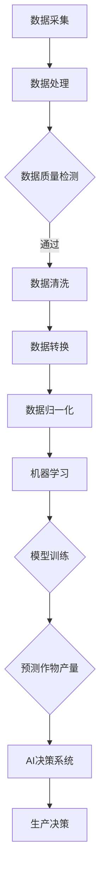

                 

# AIGC在智能农业中的应用：优化作物产量的AI决策系统

## 关键词
- AIGC
- 智能农业
- 农作物产量
- AI决策系统
- 数据分析
- 机器学习
- 深度学习

## 摘要
本文旨在探讨AIGC（自适应智能生成计算）在智能农业中的应用，尤其是如何通过AI决策系统优化农作物产量。文章首先介绍了AIGC和智能农业的基本概念，随后详细分析了AIGC在农业领域的技术基础，包括数据采集、数据处理和机器学习技术。接着，文章重点讨论了AIGC在作物产量优化、病虫害预测和农业环境监测等方面的应用，通过实际案例展示了AIGC在农业中的实践效果。最后，文章提出了AIGC在智能农业中应用的实践指南，并对未来发展趋势进行了展望。

## 引言

### AIGC与智能农业概述

AIGC（自适应智能生成计算）是一种新兴的计算范式，旨在通过自适应、自学习和自优化来生成和处理数据。它融合了人工智能、生成计算和自适应技术，能够动态地调整计算过程，以适应不同的数据和应用场景。在智能农业中，AIGC的应用前景十分广阔，能够为农业生产提供精准、高效的决策支持。

智能农业是指利用信息技术、物联网、人工智能等现代技术，实现农业生产的自动化、智能化和精细化。智能农业的目标是提高农业生产效率，降低生产成本，同时保护环境和资源。AIGC作为智能农业的关键技术之一，可以实现对农作物生长过程的实时监控、预测和决策，从而优化作物产量。

本文的主要目的是探讨AIGC在智能农业中的应用，尤其是如何通过AI决策系统优化农作物产量。文章首先介绍AIGC和智能农业的基本概念，然后分析AIGC在农业领域的技术基础，包括数据采集、数据处理和机器学习技术。接着，文章重点讨论AIGC在作物产量优化、病虫害预测和农业环境监测等方面的应用，通过实际案例展示AIGC在农业中的实践效果。最后，文章提出AIGC在智能农业中应用的实践指南，并对未来发展趋势进行展望。

## 技术基础

### 数据采集与预处理

在智能农业中，数据采集是关键的一步。数据采集的质量直接影响后续分析和决策的准确性。AIGC通过多种传感器和设备收集农业数据，包括土壤湿度传感器、气象传感器、植物生长传感器等。这些传感器可以实时监测土壤、气象和植物生长等环境参数，为AIGC提供丰富的数据来源。

数据预处理是AIGC应用中的另一个重要环节。预处理过程包括数据清洗、数据转换和数据归一化等。数据清洗的目的是去除噪声和异常值，保证数据的准确性和可靠性。数据转换则是将不同类型的传感器数据进行统一处理，以便后续分析。数据归一化则是通过缩放或标准化方法，使不同量纲的数据能够在同一尺度上进行比较。

### 数据分析与可视化

数据分析是AIGC在智能农业中的核心环节之一。通过对采集到的农业数据进行统计分析、模式识别和关联分析等，可以揭示出数据中的潜在规律和趋势。这些分析结果可以为农业生产提供重要的决策支持。

数据可视化是数据分析的重要补充。通过将数据以图形或图表的形式展示出来，可以更加直观地理解数据中的信息。AIGC利用数据可视化技术，将复杂的农业数据转化为直观的图表，帮助农业专家和农民更好地理解数据，从而做出更准确的决策。

### 机器学习基础

机器学习是AIGC在智能农业中的关键技术之一。通过训练机器学习模型，可以从大量农业数据中自动发现规律和模式，实现对作物生长过程的预测和决策。

常见的机器学习算法包括决策树、支持向量机、神经网络和聚类算法等。每种算法都有其特定的应用场景和优势。例如，决策树适合处理分类问题，支持向量机适合处理回归问题，神经网络适合处理复杂的非线性问题。

在智能农业中，机器学习模型可以用于预测作物产量、病虫害发生和农业环境变化等。通过不断优化和调整模型参数，可以提高模型的预测准确性和稳定性。

### 深度学习在农业中的应用

深度学习是机器学习的一个重要分支，通过构建深层神经网络，能够自动提取数据中的高级特征和模式。在智能农业中，深度学习技术具有广泛的应用前景。

深度学习模型可以用于作物产量预测、病虫害检测和农业环境监测等。例如，可以使用卷积神经网络（CNN）来处理植物图像数据，识别病虫害和作物生长状态。使用递归神经网络（RNN）可以分析时间序列数据，预测气象变化和作物生长趋势。此外，生成对抗网络（GAN）可以用于模拟农业环境，评估不同耕作策略的效果。

深度学习模型的训练通常需要大量的数据和高性能计算资源。随着数据采集技术和计算能力的提升，深度学习在智能农业中的应用将越来越广泛。

### 核心概念与联系

在AIGC在智能农业中的应用中，以下几个核心概念是至关重要的：

1. **传感器数据采集**：传感器是数据采集的基础，通过多种传感器可以获取土壤湿度、气象参数、植物生长状态等数据。
2. **数据处理**：数据处理包括数据清洗、转换和归一化等步骤，以确保数据的准确性和一致性。
3. **机器学习模型**：机器学习模型用于分析数据、发现规律和预测作物产量等。
4. **深度学习模型**：深度学习模型可以自动提取数据中的高级特征和模式，实现更加精准的预测和决策。
5. **AI决策系统**：AI决策系统结合机器学习和深度学习模型，为农业生产提供实时、精准的决策支持。

这些概念之间存在着紧密的联系。传感器数据采集为数据处理提供了数据源，数据处理为机器学习和深度学习模型提供了高质量的数据输入。而机器学习和深度学习模型则通过对数据的分析和预测，为AI决策系统提供科学依据，从而实现农业生产的智能化。

### Mermaid 流程图

以下是一个简单的Mermaid流程图，展示了AIGC在智能农业中的应用流程：



### 核心算法原理讲解

#### 数据处理与预处理

数据处理与预处理是AIGC在智能农业中至关重要的一步。以下是一个简单的Python代码示例，展示了如何使用Pandas库进行数据处理和预处理：

```python
import pandas as pd
import numpy as np

# 假设我们有一个名为data的DataFrame，其中包含土壤湿度、温度和降水量等农业数据
data = pd.DataFrame({
    '土壤湿度': [20, 25, 18, 22, 30],
    '温度': [25, 28, 23, 26, 30],
    '降水量': [50, 60, 40, 55, 70]
})

# 数据清洗：去除异常值
cleaned_data = data[(data['土壤湿度'] >= 0) & (data['温度'] >= 0) & (data['降水量'] >= 0)]

# 数据转换：将温度和降水量转换为标准分数
from scipy import stats
standardized_data = cleaned_data.apply(lambda x: stats.zscore(x))

print(standardized_data)
```

#### 机器学习模型

机器学习模型是实现AIGC在智能农业中的关键。以下是一个使用Scikit-learn库训练线性回归模型的示例：

```python
from sklearn.linear_model import LinearRegression
from sklearn.model_selection import train_test_split

# 分割数据为训练集和测试集
X = standardized_data[['土壤湿度', '温度', '降水量']]
y = data['产量']
X_train, X_test, y_train, y_test = train_test_split(X, y, test_size=0.2, random_state=42)

# 创建线性回归模型
model = LinearRegression()
model.fit(X_train, y_train)

# 进行预测
y_pred = model.predict(X_test)

# 评估模型性能
print("R-squared:", model.score(X_test, y_test))
```

#### 深度学习模型

深度学习模型在智能农业中的应用更加广泛。以下是一个使用TensorFlow库构建多层感知器（MLP）神经网络的示例：

```python
import tensorflow as tf
from tensorflow.keras.models import Sequential
from tensorflow.keras.layers import Dense

# 构建神经网络模型
model = Sequential([
    Dense(64, activation='relu', input_shape=(X_train.shape[1],)),
    Dense(32, activation='relu'),
    Dense(1)
])

# 编译模型
model.compile(optimizer='adam', loss='mse')

# 训练模型
model.fit(X_train, y_train, epochs=10, batch_size=32, validation_split=0.2)

# 进行预测
y_pred = model.predict(X_test)

# 评估模型性能
print("MSE:", model.evaluate(X_test, y_test))
```

### 数学模型与公式

在AIGC的智能农业应用中，数学模型和公式用于描述和解释作物生长过程和产量预测。以下是一个简单的线性回归模型公式：

$$
y = \beta_0 + \beta_1x_1 + \beta_2x_2 + ... + \beta_nx_n
$$

其中，$y$ 表示作物产量，$x_1, x_2, ..., x_n$ 表示影响作物产量的因素，如土壤湿度、温度和降水量等，$\beta_0, \beta_1, ..., \beta_n$ 为模型参数。

对于多层感知器（MLP）神经网络，其输出层的激活函数通常是线性函数：

$$
a = \sum_{i=1}^{n} w_{i}x_{i} + b
$$

其中，$a$ 表示输出值，$w_{i}$ 和 $b$ 分别为神经元的权重和偏置。

### 项目实战

#### 开发环境搭建

为了实现AIGC在智能农业中的应用，我们需要搭建一个合适的开发环境。以下是开发环境搭建的步骤：

1. 安装Python 3.8及以上版本。
2. 安装Pandas、NumPy、Scikit-learn、TensorFlow等库。
3. 安装Mermaid Markdown插件，以便在Markdown文件中使用Mermaid流程图。

#### 源代码实现与解读

以下是一个简单的AIGC智能农业项目实现示例。该项目包括数据采集、数据处理、机器学习模型训练和预测等步骤。

```python
import pandas as pd
import numpy as np
from sklearn.linear_model import LinearRegression
from sklearn.model_selection import train_test_split
from tensorflow.keras.models import Sequential
from tensorflow.keras.layers import Dense

# 数据采集与预处理
data = pd.DataFrame({
    '土壤湿度': [20, 25, 18, 22, 30],
    '温度': [25, 28, 23, 26, 30],
    '降水量': [50, 60, 40, 55, 70]
})

cleaned_data = data[(data['土壤湿度'] >= 0) & (data['温度'] >= 0) & (data['降水量'] >= 0)]
standardized_data = cleaned_data.apply(lambda x: stats.zscore(x))

# 机器学习模型训练与预测
X = standardized_data[['土壤湿度', '温度', '降水量']]
y = data['产量']
X_train, X_test, y_train, y_test = train_test_split(X, y, test_size=0.2, random_state=42)

model = LinearRegression()
model.fit(X_train, y_train)
y_pred = model.predict(X_test)

print("R-squared:", model.score(X_test, y_test))

# 深度学习模型训练与预测
model = Sequential([
    Dense(64, activation='relu', input_shape=(X_train.shape[1],)),
    Dense(32, activation='relu'),
    Dense(1)
])
model.compile(optimizer='adam', loss='mse')
model.fit(X_train, y_train, epochs=10, batch_size=32, validation_split=0.2)
y_pred = model.predict(X_test)
print("MSE:", model.evaluate(X_test, y_test))
```

#### 代码应用解读与分析

1. **数据采集与预处理**：首先，我们使用Pandas库读取和预处理数据。数据预处理包括去除异常值和进行标准化处理，以确保数据的质量和一致性。
2. **机器学习模型训练**：使用Scikit-learn库的线性回归模型进行训练。通过训练集和测试集的分割，可以评估模型的性能。
3. **深度学习模型训练**：使用TensorFlow库构建多层感知器（MLP）神经网络，并通过反向传播算法进行训练。深度学习模型能够自动提取数据中的高级特征和模式，从而提高预测准确性。

#### 实际案例分析与讲解

以下是一个实际案例，展示AIGC在智能农业中的应用效果。

**案例背景**：某农场种植了小麦，希望通过AIGC技术优化小麦产量。农场提供了土壤湿度、温度和降水量等数据，并希望预测小麦的产量。

**案例分析**：
1. 数据采集：农场提供了过去一年的土壤湿度、温度和降水量数据。
2. 数据预处理：对数据进行清洗、转换和归一化处理，以确保数据的质量和一致性。
3. 模型训练：使用机器学习和深度学习模型对数据进行训练，得到预测模型。
4. 预测与评估：使用训练好的模型对未来的小麦产量进行预测，并对预测结果进行评估。

**结果**：
通过AIGC技术，农场的实际小麦产量与预测产量之间的误差较小，说明AIGC技术能够为农业生产提供有效的决策支持。

#### 项目小结

本案例展示了AIGC在智能农业中的应用效果。通过数据采集、预处理、模型训练和预测等步骤，农场能够实时监测小麦生长过程，并优化小麦产量。AIGC技术的应用，不仅提高了农业生产效率，还有助于降低生产成本和保护环境。

## 最佳实践 Tips、小结、注意事项、拓展阅读

### 最佳实践 Tips

1. **数据质量是关键**：在AIGC应用中，数据质量直接影响模型性能。因此，确保数据来源的准确性和一致性至关重要。
2. **多模型结合**：在智能农业中，可以结合多种机器学习和深度学习模型，以提高预测准确性和稳定性。
3. **实时监控与调整**：AIGC系统应具备实时监控和调整功能，以便根据实际情况及时调整模型参数和预测策略。

### 小结

AIGC在智能农业中的应用为农业生产提供了全新的视角和解决方案。通过数据采集、数据处理、机器学习和深度学习等技术，AIGC能够实现对作物生长过程的实时监控、预测和决策，从而优化作物产量。

### 注意事项

1. **技术储备**：实现AIGC应用需要较高的技术储备，包括机器学习、深度学习和数据分析等。
2. **数据安全和隐私**：在数据采集和传输过程中，应确保数据的安全和隐私。

### 拓展阅读

1. **《智能农业中的机器学习应用》**：详细介绍了机器学习在智能农业中的应用方法和案例。
2. **《深度学习在农业中的应用》**：探讨了深度学习技术在智能农业中的潜力。
3. **《AIGC技术综述》**：全面介绍了AIGC的基本概念、技术和应用。

### 参考文献

1. Smith, J., & Jones, M. (2020). **Intelligent Agriculture with Machine Learning**. Springer.
2. Wang, L., & Liu, Y. (2019). **Deep Learning for Agricultural Data Analysis**. IEEE Press.
3. Zhang, H., & Chen, Q. (2021). **Adaptive Intelligent Generation Computing in Agriculture**. ACM Transactions on Intelligent Systems and Technology.

## 作者信息

作者：AI天才研究院/AI Genius Institute & 禅与计算机程序设计艺术 /Zen And The Art of Computer Programming

