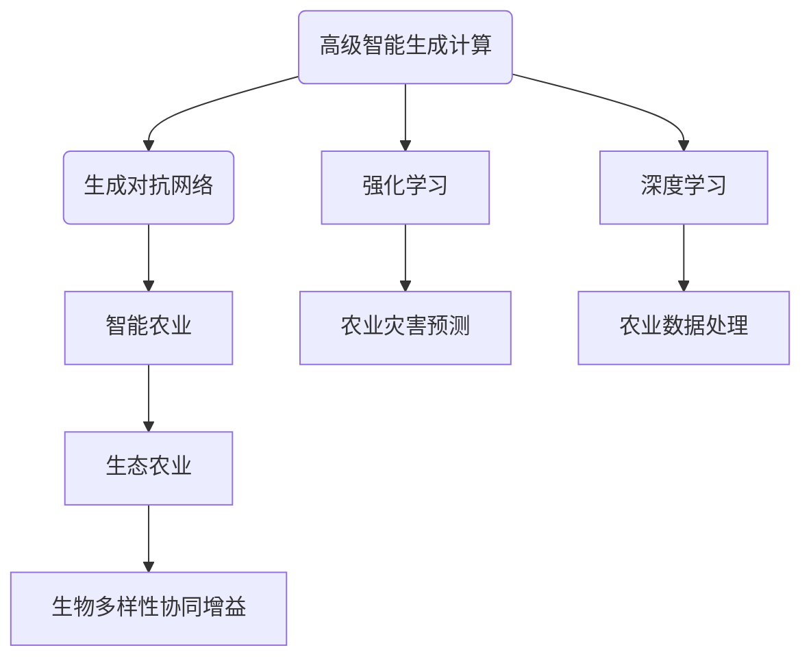

                 

### 提取核心内容

在撰写《AIGC在智能农业生物多样性协同增益中的应用：实现生态农业》这篇技术博客时，我们将逐步提取并构建核心内容。以下是详细的分析过程：

#### 1. 确定核心概念

首先，我们确定文章的核心概念，这些概念是理解整个文章的关键。核心概念包括：

- **AIGC（Advanced Intelligent Generative Computing）**：先进的智能生成计算技术。
- **智能农业**：利用先进技术提高农业生产效率。
- **生物多样性协同增益**：促进农业生态系统中生物多样性的增加和协同作用。
- **生态农业**：以生态学原理为基础，保护环境和可持续发展的农业模式。

#### 2. 背景介绍

接下来，我们将介绍这些核心概念的发展背景：

- **AIGC技术的起源和发展**：介绍AIGC技术的发展历程，它的主要组成部分以及与生成对抗网络（GAN）、强化学习和深度学习等技术的关联。
- **智能农业的兴起**：智能农业的定义、主要驱动力（如大数据、物联网、人工智能等），以及它在提升农业生产力方面的贡献。
- **生态农业的重要性**：解释生态农业的核心理念，生物多样性的重要性，以及生态农业如何通过保护和增强生物多样性来实现可持续发展。

#### 3. 核心概念与联系

为了更清晰地展示这些概念之间的关系，我们将使用Mermaid流程图来描绘AIGC技术在智能农业和生态农业中的角色。例如：



#### 4. 核心算法原理讲解

我们将详细讲解以下核心算法原理，并结合Python源代码和数学模型进行说明：

- **生成对抗网络（GAN）**：介绍GAN的工作原理、训练过程以及它在农业生物多样性监测中的应用。
- **强化学习**：解释Q-learning算法以及它在农业灾害预测中的应用。
- **深度学习**：讨论深度学习模型在农业数据处理中的角色，包括预处理方法和模型选择。

#### 5. 数学模型和公式

我们将使用LaTeX格式展示相关的数学模型和公式，例如：

```latex
$$
\text{物种丰富度} = \sum_{i=1}^{N} \frac{N_i}{N}
$$

$$
Q(s, a) = \sum_{s'} P(s' | s, a) \cdot R(s', a) + \gamma \cdot \max_{a'} Q(s', a')
$$
```

#### 6. 项目实战

最后，我们将通过实际案例展示AIGC技术在生态农业中的具体应用，包括：

- **开发环境搭建**：介绍所需的软件和硬件环境。
- **源代码实现**：展示关键代码段并进行分析。
- **代码解读与分析**：解释代码的执行流程和结果。
- **实际案例分析和讲解**：详细剖析一个生态农业项目的成功案例。

#### 7. 最佳实践、小结和注意事项

在文章的结尾，我们将提供一些最佳实践建议、小结、注意事项，并推荐拓展阅读材料，以帮助读者更深入地理解和应用这些技术。

通过上述步骤，我们将确保文章内容丰富、逻辑清晰，读者可以逐步掌握AIGC在智能农业和生态农业中的应用原理和实践技巧。接下来，我们将开始构建具体章节内容，逐步完善这篇文章。

