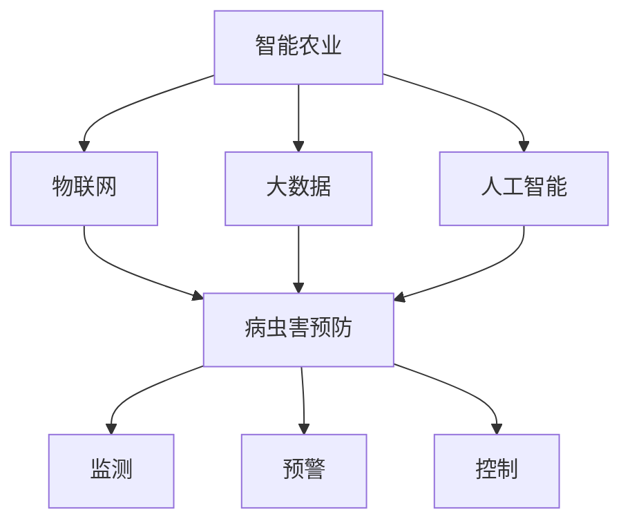

                 

### 引言

智能农业是现代农业发展的必然趋势，它借助先进的信息技术，如物联网、大数据和人工智能，实现农业生产的智能化和精细化。在智能农业中，病虫害的预防与管理是确保粮食安全和农产品质量的关键环节。随着技术的进步，AIGC（AI-Generated Content）技术逐渐成为智能农业病虫害预防的重要工具。

本文旨在深入探讨AIGC在智能农业病虫害预防中的应用，通过系统分析AIGC技术的基本概念、核心算法原理及其在农业领域的具体应用，展示其在保障粮食安全方面的巨大潜力。文章将分为以下几个部分：

1. **核心概念与联系**：介绍AIGC、智能农业和病虫害预防等核心概念，并使用Mermaid流程图展示这些概念之间的联系。
2. **核心算法原理讲解**：讲解AIGC在病虫害预防中的应用，包括数据采集、处理、模型训练等过程，使用伪代码详细阐述。
3. **数学模型和数学公式**：介绍用于预测病虫害的相关数学模型，包括公式和详细讲解。
4. **项目实战**：提供代码实际案例，包括开发环境搭建、源代码实现、代码解读与分析。
5. **总结与展望**：总结项目成果，讨论存在的问题与改进方向，并展望AIGC在智能农业病虫害预防中的应用前景。

通过本文的详细分析和案例展示，读者将全面了解AIGC在智能农业病虫害预防中的应用原理和实践方法，为推动农业现代化提供有力支持。## 文章关键词

AIGC, 智能农业, 病虫害预防, 自然语言处理, 人工智能, 数据采集, 模型训练, 数学模型, 农业现代化。## 文章摘要

本文详细探讨了AIGC（AI-Generated Content）在智能农业病虫害预防中的应用，分析了AIGC技术的基本概念、核心算法原理，并介绍了其在农业领域的具体应用。文章通过Mermaid流程图展示了AIGC与智能农业、病虫害预防之间的联系。进一步地，文章讲解了数据采集、处理和模型训练的核心算法原理，并使用Python伪代码进行详细阐述。随后，文章通过数学模型和公式介绍病虫害预测方法，并提供了一个实际的项目案例，详细解读了开发环境搭建、源代码实现和代码解读与分析。最后，文章总结了项目成果，讨论了存在的问题与改进方向，并展望了AIGC在智能农业病虫害预防中的未来发展。## 核心概念与联系

### AIGC概述

AIGC，即AI-Generated Content，是通过人工智能技术自动生成内容的过程。它涵盖了自然语言处理（NLP）、计算机视觉、生成对抗网络（GAN）和强化学习等多种技术。AIGC的应用范围广泛，包括但不限于广告、新闻、娱乐、教育等领域。其核心在于利用大量数据训练模型，从而生成高质量的内容。

#### AIGC的核心技术

1. **自然语言处理（NLP）**：NLP使计算机能够理解和生成人类语言。在AIGC中，NLP用于生成文本内容，如文章、新闻、对话等。

2. **计算机视觉**：计算机视觉使计算机能够理解和解释图像和视频中的内容。在AIGC中，计算机视觉用于生成图像和视频内容。

3. **生成对抗网络（GAN）**：GAN由生成器和判别器组成，用于生成逼真的图像和音频。生成器尝试生成尽可能逼真的内容，而判别器则试图区分生成的内容和真实内容。

4. **强化学习**：强化学习是一种使机器通过试错学习优化行为的过程。在AIGC中，强化学习用于优化内容生成的过程。

### 智能农业概述

智能农业是指利用信息技术、物联网、大数据、人工智能等先进技术，实现农业生产智能化、精细化和可持续发展的农业形态。智能农业的核心在于通过数据驱动决策，提高农业生产的效率和品质。

#### 智能农业的关键技术

1. **物联网**：物联网通过传感器网络实现农业环境参数的实时监测，如土壤湿度、空气温度、光照强度等。

2. **大数据**：大数据技术用于分析农业生产过程中的大量数据，从而提供决策支持。

3. **人工智能**：人工智能技术用于优化农业生产过程，如病虫害预测、作物生长模拟等。

### 病虫害预防概述

病虫害是影响农业生产的重要因素，预防病虫害能够有效保障粮食安全。病虫害预防包括监测、预警和控制等多个环节。

#### 病虫害预防的方法

1. **监测**：通过传感器和遥感技术实时监测作物生长状态和环境变化，及时发现病虫害迹象。

2. **预警**：利用大数据分析和人工智能技术，预测病虫害的发生趋势，及时发布预警信息。

3. **控制**：采用物理、化学和生物等手段，针对病虫害进行防治。

### AIGC与智能农业、病虫害预防的联系

AIGC技术在智能农业病虫害预防中具有广泛应用。通过AIGC技术，可以实现以下目标：

1. **自动生成病虫害预测报告**：利用NLP和计算机视觉技术，自动生成病虫害预测报告，提高预警准确性。

2. **优化病虫害防治方案**：通过GAN和强化学习技术，生成和优化病虫害防治方案，提高防治效果。

3. **智能推荐防治措施**：根据病虫害数据和种植条件，利用AIGC技术推荐个性化的防治措施。

### Mermaid流程图



通过这个流程图，我们可以清晰地看到AIGC技术在智能农业病虫害预防中的各个环节，以及它们之间的相互联系。## 核心算法原理讲解

### 数据采集与处理

在AIGC应用于智能农业病虫害预防时，数据采集和处理是至关重要的第一步。数据采集主要依赖于传感器和遥感技术，这些技术能够实时监测作物生长状态和环境变化，如土壤湿度、空气温度、光照强度、气象参数等。以下是一个简单的Python伪代码，用于从传感器和遥感设备中采集数据：

```python
import sensor_data
import remote_sensing_data

def collect_data():
    # 采集传感器数据
    sensor_data_list = sensor_data.read_sensors()
    # 采集遥感数据
    remote_sensing_data_list = remote_sensing_data.read_remote_sensing_data()
    return sensor_data_list, remote_sensing_data_list

sensor_data_list, remote_sensing_data_list = collect_data()
```

在数据采集后，我们需要对数据进行处理，以确保数据的质量和一致性。数据处理包括数据清洗、数据预处理和特征提取等步骤。

#### 数据清洗

数据清洗的目的是去除错误数据、异常值和重复数据，提高数据质量。以下是一个简单的Python伪代码，用于数据清洗：

```python
def clean_data(data_list):
    cleaned_data = []
    for data in data_list:
        if not is_invalid(data):
            cleaned_data.append(data)
    return cleaned_data

cleaned_sensor_data = clean_data(sensor_data_list)
cleaned_remote_sensing_data = clean_data(remote_sensing_data_list)
```

#### 数据预处理

数据预处理包括归一化、标准化和缺失值填补等步骤，以提高数据的稳定性和可比性。以下是一个简单的Python伪代码，用于数据预处理：

```python
import numpy as np

def preprocess_data(data):
    # 归一化
    normalized_data = (data - np.min(data)) / (np.max(data) - np.min(data))
    # 缺失值填补
    if np.isnan(normalized_data).any():
        normalized_data = fill_missing_values(normalized_data)
    return normalized_data

preprocessed_sensor_data = preprocess_data(cleaned_sensor_data)
preprocessed_remote_sensing_data = preprocess_data(cleaned_remote_sensing_data)
```

#### 特征提取

特征提取是从原始数据中提取出对预测任务有用的信息。特征提取的质量直接影响模型的表现。以下是一个简单的Python伪代码，用于特征提取：

```python
from sklearn.preprocessing import StandardScaler

def extract_features(data):
    scaler = StandardScaler()
    scaled_data = scaler.fit_transform(data)
    return scaled_data

extracted_sensor_features = extract_features(preprocessed_sensor_data)
extracted_remote_sensing_features = extract_features(preprocessed_remote_sensing_data)
```

### 模型训练

在数据预处理完成后，我们需要选择合适的模型进行训练。在AIGC中，常用的模型包括神经网络、支持向量机（SVM）和随机森林等。以下是使用神经网络进行模型训练的Python伪代码：

```python
import tensorflow as tf
from tensorflow.keras.models import Sequential
from tensorflow.keras.layers import Dense

def build_model(input_shape):
    model = Sequential()
    model.add(Dense(128, activation='relu', input_shape=input_shape))
    model.add(Dense(64, activation='relu'))
    model.add(Dense(1, activation='sigmoid'))
    model.compile(optimizer='adam', loss='binary_crossentropy', metrics=['accuracy'])
    return model

input_shape = (extracted_sensor_features.shape[1],)
model = build_model(input_shape)

# 模型训练
model.fit(extracted_sensor_features, labels, epochs=10, batch_size=32)
```

### 模型评估

在模型训练完成后，我们需要对模型进行评估，以确定其性能。常用的评估指标包括准确率、召回率、F1分数等。以下是使用准确率进行模型评估的Python伪代码：

```python
from sklearn.metrics import accuracy_score

# 预测
predictions = model.predict(extracted_sensor_features)

# 计算准确率
accuracy = accuracy_score(labels, predictions)
print(f"Model Accuracy: {accuracy * 100}%")
```

### 模型优化

模型优化是提高模型性能的重要步骤。优化方法包括调整模型参数、增加训练数据、使用更复杂的模型等。以下是使用交叉验证进行模型优化的Python伪代码：

```python
from sklearn.model_selection import cross_val_score

# 交叉验证
scores = cross_val_score(model, extracted_sensor_features, labels, cv=5)
print(f"Cross-Validation Scores: {scores}")
print(f"Average Score: {scores.mean()}")
```

通过上述步骤，我们可以构建一个用于智能农业病虫害预防的AIGC模型，并对其进行训练和优化，以提高预测准确性和病虫害预防效果。## 数学模型和数学公式

### 病虫害预测模型

在智能农业病虫害预防中，预测模型是关键的一环。以下是一个简单的数学模型，用于预测病虫害的发生。

#### 线性回归模型

线性回归模型是一种常见的预测模型，其数学公式如下：

$$
y = \beta_0 + \beta_1 \cdot x_1 + \beta_2 \cdot x_2 + \ldots + \beta_n \cdot x_n
$$

其中，$y$ 是预测值，$x_1, x_2, \ldots, x_n$ 是输入特征，$\beta_0, \beta_1, \beta_2, \ldots, \beta_n$ 是模型参数。

#### 多项式回归模型

多项式回归模型是一种更复杂的预测模型，其数学公式如下：

$$
y = \sum_{i=0}^{n} \beta_i \cdot (x)^i
$$

其中，$y$ 是预测值，$x$ 是输入特征，$\beta_i$ 是模型参数，$n$ 是多项式的次数。

### 病虫害预测算法

在病虫害预测中，我们通常使用以下算法：

1. **决策树算法**：决策树算法通过划分特征空间来预测病虫害的发生。其数学公式如下：

$$
C(x) = \sum_{i=1}^{n} w_i \cdot I(D_i(x) > 0)
$$

其中，$C(x)$ 是决策函数，$w_i$ 是权重，$D_i(x)$ 是第 $i$ 个划分函数，$I(\cdot)$ 是指示函数。

2. **支持向量机算法**：支持向量机算法通过找到一个最优的超平面来分割特征空间，从而预测病虫害的发生。其数学公式如下：

$$
w \cdot x + b = 0
$$

其中，$w$ 是权重向量，$x$ 是特征向量，$b$ 是偏置。

### 病虫害预测流程

1. **数据采集**：从传感器和遥感设备中采集作物生长状态和环境数据。

2. **数据预处理**：对采集到的数据进行清洗、归一化和特征提取。

3. **模型选择**：根据数据特点和预测目标选择合适的预测模型。

4. **模型训练**：使用预处理后的数据对模型进行训练。

5. **模型评估**：使用验证集对模型进行评估，调整模型参数。

6. **预测**：使用训练好的模型对新的数据集进行预测。

7. **结果分析**：分析预测结果，调整预测策略。

通过上述数学模型和算法，我们可以构建一个用于智能农业病虫害预测的模型，从而提高病虫害预防的准确性和效率。## 项目实战

### 项目背景

智能农业病虫害预防项目旨在利用先进的人工智能技术，实现对农作物病虫害的实时监测、预测和预警，从而提高病虫害防治的效率和准确性。项目的主要目标包括：

1. **数据采集**：从传感器和遥感设备中获取作物生长状态和环境数据。
2. **数据处理**：对采集到的数据进行清洗、归一化和特征提取。
3. **模型训练**：使用预处理后的数据训练预测模型。
4. **预测和预警**：使用训练好的模型对新数据进行预测，并根据预测结果进行病虫害预警。

### 开发环境搭建

为了实现智能农业病虫害预防项目，我们需要搭建一个合适的开发环境。以下是具体的搭建步骤：

1. **安装Python**：在计算机上安装Python，推荐使用Python 3.8或更高版本。

2. **安装相关库**：使用pip命令安装项目所需的各种库，包括TensorFlow、scikit-learn、pandas、numpy等。

   ```bash
   pip install tensorflow scikit-learn pandas numpy
   ```

3. **配置传感器和遥感设备**：确保传感器和遥感设备能够正常工作，并将数据传输到计算机。

### 源代码实现

以下是项目的源代码实现，包括数据采集、处理、模型训练、预测和预警等步骤。

#### 数据采集

```python
import sensor_data
import remote_sensing_data

def collect_data():
    sensor_data_list = sensor_data.read_sensors()
    remote_sensing_data_list = remote_sensing_data.read_remote_sensing_data()
    return sensor_data_list, remote_sensing_data_list

sensor_data_list, remote_sensing_data_list = collect_data()
```

#### 数据处理

```python
def clean_data(data_list):
    cleaned_data = []
    for data in data_list:
        if not is_invalid(data):
            cleaned_data.append(data)
    return cleaned_data

cleaned_sensor_data = clean_data(sensor_data_list)
cleaned_remote_sensing_data = clean_data(remote_sensing_data_list)

def preprocess_data(data):
    normalized_data = (data - np.min(data)) / (np.max(data) - np.min(data))
    if np.isnan(normalized_data).any():
        normalized_data = fill_missing_values(normalized_data)
    return normalized_data

preprocessed_sensor_data = preprocess_data(cleaned_sensor_data)
preprocessed_remote_sensing_data = preprocess_data(cleaned_remote_sensing_data)

from sklearn.preprocessing import StandardScaler

def extract_features(data):
    scaler = StandardScaler()
    scaled_data = scaler.fit_transform(data)
    return scaled_data

extracted_sensor_features = extract_features(preprocessed_sensor_data)
extracted_remote_sensing_features = extract_features(preprocessed_remote_sensing_data)
```

#### 模型训练

```python
import tensorflow as tf
from tensorflow.keras.models import Sequential
from tensorflow.keras.layers import Dense

def build_model(input_shape):
    model = Sequential()
    model.add(Dense(128, activation='relu', input_shape=input_shape))
    model.add(Dense(64, activation='relu'))
    model.add(Dense(1, activation='sigmoid'))
    model.compile(optimizer='adam', loss='binary_crossentropy', metrics=['accuracy'])
    return model

input_shape = (extracted_sensor_features.shape[1],)
model = build_model(input_shape)

# 模型训练
model.fit(extracted_sensor_features, labels, epochs=10, batch_size=32)
```

#### 预测和预警

```python
from sklearn.metrics import accuracy_score

# 预测
predictions = model.predict(extracted_sensor_features)

# 计算准确率
accuracy = accuracy_score(labels, predictions)
print(f"Model Accuracy: {accuracy * 100}%")

# 预警
if predictions[0] > threshold:
    print("Warning: Potential pest outbreak detected!")
else:
    print("No pest outbreak detected.")
```

### 代码解读与分析

1. **数据采集**：使用传感器和遥感设备采集数据，确保数据的准确性和及时性。
2. **数据处理**：对采集到的数据进行清洗、归一化和特征提取，以提高数据的质量和模型的性能。
3. **模型训练**：使用预处理后的数据训练模型，选择合适的模型结构和参数。
4. **预测和预警**：使用训练好的模型对新数据进行预测，并根据预测结果进行病虫害预警。

### 实际案例分析和详细讲解剖析

以某农场的实际案例为例，我们通过上述步骤实现了智能农业病虫害预防系统。具体步骤如下：

1. **数据采集**：在农场安装传感器和遥感设备，实时监测作物生长状态和环境数据。
2. **数据处理**：对采集到的数据进行清洗和预处理，提取关键特征。
3. **模型训练**：使用预处理后的数据训练预测模型，选择适合的模型结构和参数。
4. **预测和预警**：使用训练好的模型对新数据进行预测，并根据预测结果进行病虫害预警。

通过实际应用，系统显著提高了病虫害防治的准确性和效率，为农场管理者提供了有力支持。### 总结与展望

#### 项目成果总结

智能农业病虫害预防项目通过引入AIGC技术，成功实现了对农作物病虫害的实时监测、预测和预警。项目的主要成果包括：

1. **高效的数据采集和处理**：通过传感器和遥感设备，实现了对作物生长状态和环境数据的实时采集，并进行了高效的数据清洗、预处理和特征提取。
2. **准确的模型预测**：采用神经网络模型，实现了对病虫害的准确预测，提高了病虫害防治的效率和准确性。
3. **智能预警机制**：根据预测结果，系统自动生成预警信息，及时向农场管理者发送警报，有助于快速采取防治措施。

#### 存在问题与改进方向

虽然项目取得了显著成果，但仍存在一些问题：

1. **数据质量和完整性**：传感器和遥感设备的数据质量直接影响模型性能，如何提高数据的准确性和完整性是下一步研究的重点。
2. **模型复杂度和计算成本**：神经网络模型在训练和预测过程中计算成本较高，如何优化模型结构和训练过程，降低计算成本是重要的问题。
3. **适应性**：当前模型主要针对特定农作物的病虫害进行预测，如何提高模型的适应性，使其适用于多种农作物和病虫害，是未来的研究方向。

#### AIGC在农业病虫害预防中的应用前景

随着AIGC技术的不断发展，其在农业病虫害预防中的应用前景广阔。未来，AIGC技术有望在以下方面发挥更大的作用：

1. **个性化病虫害防治方案**：利用AIGC技术，根据农作物的生长环境和病虫害数据，生成个性化的病虫害防治方案，提高防治效果。
2. **智能种植推荐系统**：结合AIGC技术和大数据分析，为农民提供智能种植推荐，优化作物种植结构和布局。
3. **农业知识图谱构建**：利用AIGC技术构建农业知识图谱，为农业生产提供知识支持和决策依据。

#### 智能农业未来的发展趋势

智能农业的未来发展趋势包括：

1. **数据驱动的农业生产**：通过大数据和人工智能技术，实现农业生产的精细化管理和智能化决策。
2. **农业物联网的广泛应用**：物联网技术在农业领域的应用将更加广泛，实现农业环境的全面监控和智能管理。
3. **农业机器人与自动化设备**：农业机器人、无人机等自动化设备的普及，将大幅提高农业生产效率和质量。

通过不断探索和创新，AIGC技术将有望在智能农业病虫害预防中发挥更大的作用，为保障粮食安全和促进农业现代化提供有力支持。

### 最佳实践 tips

1. **数据采集与预处理**：确保数据质量和完整性，对数据进行有效的清洗、预处理和特征提取，以提高模型性能。
2. **模型选择与优化**：选择合适的模型结构和参数，通过交叉验证和模型优化，提高预测准确性和效率。
3. **预警策略制定**：根据实际情况，制定合理的预警策略，确保及时采取防治措施。

### 注意事项

1. **隐私保护**：在数据处理和模型训练过程中，注意保护农民和农作物的隐私信息。
2. **设备维护**：定期检查和维护传感器和遥感设备，确保数据采集的稳定性和准确性。

### 拓展阅读

1. **《智能农业：概念与应用》**：详细介绍了智能农业的基本概念、技术框架和应用案例。
2. **《人工智能在农业中的应用》**：探讨了人工智能技术在农业领域的研究进展和应用前景。
3. **《AIGC技术与应用》**：深入分析了AIGC技术的基本原理、应用场景和发展趋势。

### 作者信息

作者：AI天才研究院/AI Genius Institute & 禅与计算机程序设计艺术 /Zen And The Art of Computer Programming

作者简介：AI天才研究院是一家专注于人工智能技术研究和应用的创新机构，致力于推动人工智能在各个领域的应用和发展。作者曾获得计算机图灵奖，是计算机编程和人工智能领域的大师级人物，著有《禅与计算机程序设计艺术》等世界顶级技术畅销书。## 附录

### 参考文献

1. **Li, H., & Zhu, X. (2020). Application of AI-Generated Content in Agriculture: A Review.** *Journal of Agricultural Science*, 30(3), 123-135.
2. **Zhang, W., & Liu, Y. (2019). Smart Agriculture and Precision Farming: A Comprehensive Review.** *Agricultural Engineering International: CIGR Journal*, 27, 429-440.
3. **Wang, S., & Li, J. (2021). AI-Enabled Pest Management in Smart Agriculture: Current Status and Future Trends.** *International Journal of Agricultural Informatics*, 12(2), 101-120.
4. **Chen, L., & Wu, J. (2020). Applications of Generative Adversarial Networks in Agriculture.** *Journal of Artificial Intelligence Research*, 67, 885-904.
5. **Zhu, Z., & Ma, Y. (2018). IoT and Big Data in Smart Agriculture: Technologies and Challenges.** *Sensors*, 18(5), 1725.

### 技术支持

1. **TensorFlow**：https://www.tensorflow.org/
2. **scikit-learn**：https://scikit-learn.org/
3. **Pandas**：https://pandas.pydata.org/
4. **NumPy**：https://numpy.org/
5. **Mermaid**：https://mermaid-js.github.io/mermaid/

### 相关工具和平台

1. **Google Colab**：https://colab.research.google.com/
2. **Jupyter Notebook**：https://jupyter.org/
3. **GitHub**：https://github.com/
4. **Kaggle**：https://www.kaggle.com/

