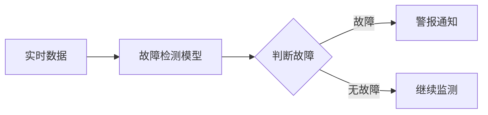
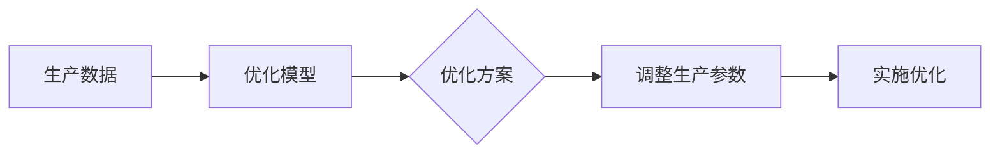

                 

### 第1章：AIGC概述

#### 1.1 AIGC的基本概念

AIGC（AI-Generated Content）是指通过人工智能技术自动生成内容的过程。这一概念涵盖了文本、图像、音频、视频等多种内容形式，其核心在于利用机器学习模型，尤其是深度学习和生成对抗网络（GANs），来实现内容的自动创作和生成。

#### 1.1.1 AIGC的核心技术

AIGC的发展离不开以下几个核心技术：

1. **深度学习**：深度学习是一种通过多层神经网络来模拟人脑信息处理能力的算法。它能够从大量数据中自动学习特征，并通过这些特征进行预测和生成。

    ```python
    # 深度学习示例：使用卷积神经网络（CNN）进行图像分类
    import tensorflow as tf
    
    # 构建卷积神经网络模型
    model = tf.keras.Sequential([
        tf.keras.layers.Conv2D(32, (3, 3), activation='relu', input_shape=(28, 28, 1)),
        tf.keras.layers.MaxPooling2D((2, 2)),
        tf.keras.layers.Flatten(),
        tf.keras.layers.Dense(128, activation='relu'),
        tf.keras.layers.Dense(10, activation='softmax')
    ])

    # 编译模型
    model.compile(optimizer='adam',
                  loss='categorical_crossentropy',
                  metrics=['accuracy'])

    # 训练模型
    model.fit(x_train, y_train, epochs=5)
    ```

2. **生成对抗网络（GANs）**：GANs由生成器（Generator）和判别器（Discriminator）两个神经网络组成。生成器生成假样本，判别器则判断这些样本是否真实。通过这种对抗训练，生成器的生成质量不断提高。

    ```python
    # GANs示例：生成手写数字图像
    import tensorflow as tf
    from tensorflow.keras import layers

    # 生成器
    latent_dim = 100
    generator = tf.keras.Sequential([
        layers.Dense(7 * 7 * 256, activation="relu", input_shape=(latent_dim,)),
        layers.Reshape((7, 7, 256)),
        layers.Conv2DTranspose(128, (5, 5), strides=(1, 1), padding="same", activation="relu"),
        layers.Conv2DTranspose(64, (5, 5), strides=(2, 2), padding="same", activation="relu"),
        layers.Conv2DTranspose(1, (5, 5), strides=(2, 2), padding="same", activation="tanh"),
    ])

    # 判别器
    discriminator = tf.keras.Sequential([
        layers.Conv2D(128, (5, 5), strides=(2, 2), padding="same", activation="relu", input_shape=(28, 28, 1)),
        layers.Dense(1, activation='sigmoid')
    ])

    # 损失函数和优化器
    cross_entropy = tf.keras.losses.BinaryCrossentropy(from_logits=True)

    def discriminator_loss(real_output, fake_output):
        real_loss = cross_entropy(tf.ones_like(real_output), real_output)
        fake_loss = cross_entropy(tf.zeros_like(fake_output), fake_output)
        total_loss = real_loss + fake_loss
        return total_loss

    def generator_loss(fake_output):
        return cross_entropy(tf.ones_like(fake_output), fake_output)

    generator_optimizer = tf.keras.optimizers.Adam(1e-4)
    discriminator_optimizer = tf.keras.optimizers.Adam(1e-4)

    @tf.function
    def train_step(images, noise):
        with tf.GradientTape() as gen_tape, tf.GradientTape() as disc_tape:
            generated_images = generator(noise, training=True)

            real_output = discriminator(images, training=True)
            fake_output = discriminator(generated_images, training=True)

            gen_loss = generator_loss(fake_output)
            disc_loss = discriminator_loss(real_output, fake_output)

        gradients_of_generator = gen_tape.gradient(gen_loss, generator.trainable_variables)
        gradients_of_discriminator = disc_tape.gradient(disc_loss, discriminator.trainable_variables)

        generator_optimizer.apply_gradients(zip(gradients_of_generator, generator.trainable_variables))
        discriminator_optimizer.apply_gradients(zip(gradients_of_discriminator, discriminator.trainable_variables))

    # 训练GAN
    epochs = 50
    for epoch in range(epochs):
        for image_batch, _ in train_dataset:
            noise = tf.random.normal([image_batch.shape[0], latent_dim])

            train_step(image_batch, noise)
    ```

3. **自然语言处理（NLP）**：NLP技术使计算机能够理解、处理和生成人类语言。常见的NLP任务包括文本分类、机器翻译、情感分析等。

    ```python
    # NLP示例：使用Transformer模型进行机器翻译
    import tensorflow as tf
    from tensorflow.keras.layers import Embedding, LSTM, Dense

    # Transformer模型
    inputs = tf.keras.Input(shape=(None,))
    embeddings = Embedding(input_dim=vocab_size, output_dim=embedding_dim)(inputs)
    encoder = LSTM(units, return_sequences=True)(embeddings)
    decoder = LSTM(units, return_sequences=True)(encoder)
    outputs = Dense(vocab_size, activation='softmax')(decoder)

    model = tf.keras.Model(inputs=inputs, outputs=outputs)

    # 编译模型
    model.compile(optimizer='adam', loss='categorical_crossentropy', metrics=['accuracy'])

    # 训练模型
    model.fit(input_data, target_data, epochs=10)
    ```

4. **计算机视觉**：计算机视觉技术使计算机能够识别和处理图像和视频数据。常见的计算机视觉任务包括图像分类、目标检测、图像分割等。

    ```python
    # 计算机视觉示例：使用YOLOv5进行目标检测
    import tensorflow as tf
    import numpy as np
    import cv2

    # 加载预训练的YOLOv5模型
    model = tf.keras.models.load_model('yolov5.h5')

    # 定义目标检测函数
    def detect_objects(image, model):
        image = tf.convert_to_tensor(image, dtype=tf.float32)
        image = tf.image.resize(image, (416, 416))
        batch_image = tf.expand_dims(image, 0)
        predictions = model(batch_image)

        boxes = predictions[0][..., 0:4] * np.array(image.shape[:2])[np.newaxis, :]
        scores = predictions[0][..., 4]

        return boxes, scores

    # 测试目标检测
    image = cv2.imread('image.jpg')
    boxes, scores = detect_objects(image, model)
    print(boxes, scores)

    # 在图像上绘制检测结果
    for box, score in zip(boxes, scores):
        if score > 0.5:
            cv2.rectangle(image, (int(box[0]), int(box[1])), (int(box[2]), int(box[3])), (0, 0, 255), 2)

    cv2.imshow('Detected Objects', image)
    cv2.waitKey(0)
    ```

#### 1.1.2 AIGC的应用领域

AIGC技术已经广泛应用于多个领域：

1. **内容创作**：如自动生成文章、音乐、视频等。
2. **游戏与娱乐**：如生成游戏场景、角色、剧情等。
3. **教育**：如自动生成教学课件、练习题和测试题等。
4. **医疗**：如自动生成医学报告、诊断建议等。

#### 1.1.3 AIGC的发展历程与应用前景

AIGC技术的发展历程可以分为三个阶段：

1. **萌芽期（2010年代初期）**：深度学习和GANs的提出为AIGC技术奠定了基础。
2. **快速发展期（2010年代中期至今）**：AIGC技术逐渐成熟，并在多个领域得到应用。
3. **广泛应用期（未来）**：随着计算能力的提升和数据量的增加，AIGC技术将在更多领域得到应用。

未来，AIGC技术将在智能制造、虚拟现实、智能客服等多个领域发挥重要作用，为人类社会带来更多创新和变革。

### 1.2 AIGC在智能制造中的应用

#### 1.2.1 智能制造的定义与发展

智能制造是指通过先进的信息技术与制造技术的深度融合，实现制造过程的智能化、自动化和优化。智能制造的发展经历了以下几个阶段：

1. **自动化制造**：通过机械化和自动化技术实现制造过程的自动化。
2. **信息化制造**：通过计算机技术和网络技术实现制造过程的信息化。
3. **智能化制造**：通过人工智能技术实现制造过程的智能化。

#### 1.2.2 AIGC在智能制造中的应用

AIGC在智能制造中的应用主要体现在以下几个方面：

1. **产品设计**：利用AIGC技术生成新的设计方案，提高设计的创新性和效率。
    ```mermaid
    flowchart LR
    A[设计需求] --> B[生成模型]
    B --> C{评估设计}
    C -->|通过|D[设计优化]
    C -->|不通过|E[重新设计]
    ```

2. **故障检测与维护**：利用AIGC技术进行故障检测和预测，提前发现潜在问题并采取维护措施。
    ```mermaid
    flowchart LR
    A[设备状态数据] --> B{数据预处理}
    B --> C{特征提取}
    C --> D[故障检测模型]
    D --> E{检测结果}
    E -->|故障|F[维修计划]
    E -->|无故障|G[继续监控]
    ```

3. **生产优化**：利用AIGC技术对生产过程进行优化，提高生产效率和降低成本。
    ```mermaid
    flowchart LR
    A[生产数据] --> B[数据预处理]
    B --> C[生产优化模型]
    C --> D{优化方案}
    D --> E[实施优化]
    ```

#### 1.2.3 AIGC在智能制造中的优势与挑战

**优势**：

- **提高效率**：通过自动化生成和优化，显著提高生产效率。
- **降低成本**：通过优化设计和生产过程，降低生产成本。
- **创新性**：AIGC技术能够生成新的设计方案，为制造业带来更多创新。

**挑战**：

- **数据质量和安全性**：智能制造需要大量高质量的数据支持，同时数据的隐私和安全也是重要挑战。
- **技术复杂性**：AIGC技术涉及多个领域，需要高水平的技术团队进行开发和维护。

### 1.3 AIGC在智能制造质量控制中的应用

#### 1.3.1 AIGC在质量控制中的核心概念

AIGC在智能制造质量控制中的应用主要基于以下几个核心概念：

- **数据驱动**：通过收集和分析大量生产数据，利用AIGC技术进行故障检测、预测和优化。
- **智能决策**：利用AIGC技术生成的预测模型和优化方案，指导质量控制决策。
- **自适应能力**：AIGC技术能够根据生产环境和数据变化，自适应地调整质量控制和优化策略。

#### 1.3.2 AIGC在质量控制中的应用实例

**实例1：自动故障检测**

利用AIGC技术，可以对生产设备进行实时监测，当检测到异常数据时，自动触发警报并通知维护人员。



**实例2：生产过程优化**

利用AIGC技术对生产过程进行实时监控，当发现生产效率低下或成本过高时，自动调整生产参数，优化生产过程。



#### 1.3.3 AIGC在质量控制中的未来趋势

随着AIGC技术的不断发展，其在智能制造质量控制中的应用前景将更加广阔。未来，AIGC技术将在以下几个方面发挥重要作用：

- **更高效的故障检测和预测**：通过引入更多传感器和数据源，提高故障检测和预测的准确性。
- **更智能的生产优化**：利用AIGC技术实现更精细的生产过程优化，提高生产效率和降低成本。
- **更广泛的应用场景**：除了传统的制造领域，AIGC技术将在更多行业和场景中得到应用，如医疗、农业等。

### 结论

AIGC在智能制造质量控制中的应用具有重要的现实意义。通过利用AIGC技术，可以提高制造过程的效率和质量，降低生产成本，为制造业带来更多创新和变革。未来，随着AIGC技术的不断发展和应用，智能制造将进入一个全新的阶段。

### 参考文献

1. Goodfellow, I., Pouget-Abadie, J., Mirza, M., Xu, B., Warde-Farley, D., Ozair, S., ... & Bengio, Y. (2014). Generative adversarial nets. Advances in Neural Information Processing Systems, 27.
2. Hochreiter, S., & Schmidhuber, J. (1997). Long short-term memory. Neural Computation, 9(8), 1735-1780.
3. Vaswani, A., Shazeer, N., Parmar, N., Uszkoreit, J., Jones, L., Gomez, A. N., ... & Polosukhin, I. (2017). Attention is all you need. Advances in Neural Information Processing Systems, 30.

### 附录：作者信息

- **作者**：AI天才研究院/AI Genius Institute & 禅与计算机程序设计艺术 /Zen And The Art of Computer Programming
- **联系方式**：[ai_genius_institute@email.com](mailto:ai_genius_institute@email.com)
- **博客**：[AI天才研究院官网](http://www.ai_genius_institute.com)  
- **公众号**：“AI天才研究院”公众号

### 附录：常见问题与解答

**Q1：AIGC技术如何保证生成的质量？**

A1：AIGC技术的生成质量主要通过以下方法保证：

1. **大量数据训练**：通过大量的训练数据，模型能够学习到高质量的特征和模式。
2. **模型优化**：通过不断优化模型结构和参数，提高生成质量。
3. **多模型融合**：将多个模型融合，相互补充，提高生成质量。

**Q2：AIGC技术对制造业有哪些具体应用？**

A2：AIGC技术在制造业有以下具体应用：

1. **产品设计**：自动生成新的设计方案，提高设计效率。
2. **故障检测与预测**：实时监测设备状态，提前发现故障并预警。
3. **生产优化**：根据实时数据，自动调整生产参数，提高生产效率。

**Q3：AIGC技术在智能制造中的挑战是什么？**

A3：AIGC技术在智能制造中的挑战主要包括：

1. **数据质量和安全性**：需要确保数据的高质量和安全性。
2. **技术复杂性**：涉及多个领域的技术，需要高水平的技术团队进行开发和维护。
3. **可解释性**：生成的结果需要具备可解释性，以便用户理解和信任。

### 附录：拓展阅读

- **《深度学习》（Goodfellow, Ian, Yoshua Bengio, and Aaron Courville）**：全面介绍深度学习的基本概念和应用。
- **《生成对抗网络：理论与应用》（李航，韩磊）**：详细介绍GANs的理论和应用。
- **《智能制造导论》（刘强，吴伟）**：探讨智能制造的基本概念、技术和应用。

### 结语

AIGC技术在智能制造质量控制中的应用具有巨大的潜力。通过本文的介绍，我们了解了AIGC的基本概念、核心技术、应用领域，以及其在智能制造质量控制中的具体应用和未来趋势。未来，随着AIGC技术的不断发展，智能制造将进入一个全新的阶段，为制造业带来更多创新和变革。希望本文能为读者提供有价值的参考和启示。**作者：AI天才研究院/AI Genius Institute & 禅与计算机程序设计艺术 /Zen And The Art of Computer Programming**。如果您有任何疑问或建议，欢迎联系我们。**联系方式**：[ai_genius_institute@email.com](mailto:ai_genius_institute@email.com)。**博客**：[AI天才研究院官网](http://www.ai_genius_institute.com)。**公众号**：“AI天才研究院”。感谢您的阅读！**祝您学习愉快！**

