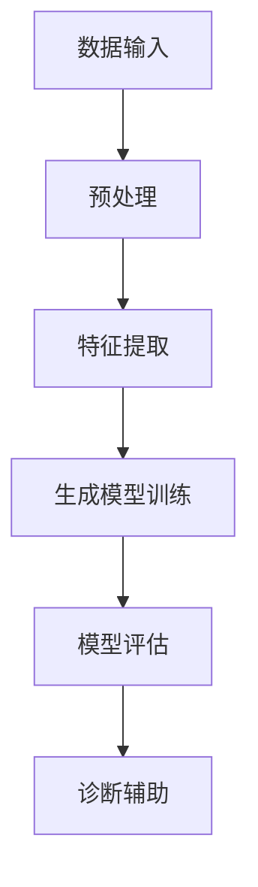

                 

### AIGC在智能医疗影像辅助诊断中的应用

在医疗影像诊断领域，人工智能（AI）技术的应用正逐渐成为改善医疗质量和效率的关键驱动力。AIGC（自适应智能生成计算）作为一种新兴的AI技术，通过深度学习和生成模型，能够自动生成高质量的医学影像，辅助医生进行诊断。本文旨在探讨AIGC在智能医疗影像辅助诊断中的应用，并从技术原理、算法实现、案例研究和未来展望等多个维度进行深入分析。

## 关键词

- AIGC
- 智能医疗影像
- 辅助诊断
- 深度学习
- 生成模型
- 医学影像分析

## 摘要

本文首先介绍了AIGC的概念及其在医疗领域的应用价值，随后深入探讨了AIGC在智能医疗影像辅助诊断中的技术实现，包括算法原理、数据预处理、特征提取等关键环节。通过实际案例，展示了AIGC在常见和罕见疾病诊断中的应用效果，并分析了其面临的技术挑战和发展机遇。最后，文章对AIGC在智能医疗影像辅助诊断中的未来发展方向进行了展望。

### 第一部分：AIGC与智能医疗影像基础

#### 第1章 AIGC概述

##### 1.1 AIGC的定义与核心技术

AIGC（自适应智能生成计算）是一种基于深度学习和生成模型的计算框架，能够模拟人类思维方式，通过自适应学习生成新的内容。AIGC的核心技术包括：

1. **生成对抗网络（GAN）**：通过生成器和判别器的对抗训练，生成高质量的数据。
2. **变分自编码器（VAE）**：通过编码和解码过程，实现数据的重建和生成。
3. **自注意力机制（Self-Attention）**：在处理序列数据时，能够捕捉到序列中长距离的依赖关系。

##### 1.2 AIGC在医疗领域的应用价值

AIGC在医疗领域具有广泛的应用前景，特别是在智能医疗影像辅助诊断方面。其应用价值主要体现在：

1. **数据增强**：通过生成更多的数据，提高模型的泛化能力。
2. **图像重建**：利用GAN和VAE等生成模型，实现医学影像的重建和修复。
3. **疾病预测**：通过分析大量的医疗数据，预测疾病的发生和发展趋势。

#### 第2章 智能医疗影像技术介绍

##### 2.1 医学影像基本概念

医学影像是利用各种物理手段（如X射线、CT、MRI等）对人体内部结构进行成像，用于疾病的诊断和评估。常见的医学影像类型包括：

1. **X射线**：利用X射线穿透性成像，常用于骨折和肺部疾病的诊断。
2. **CT（计算机断层扫描）**：通过旋转X射线源和探测器，生成三维图像，用于器官和软组织的详细观察。
3. **MRI（磁共振成像）**：利用磁场和射频脉冲，无创地获取人体内部结构信息。

##### 2.2 医学影像处理技术

医学影像处理技术是使医学影像数据更加适合分析和诊断的一系列技术，包括：

1. **图像预处理**：如去噪、对比度增强、图像分割等。
2. **图像增强**：通过调整图像的亮度和对比度，使关键结构更加突出。
3. **图像分割**：将图像中的感兴趣区域分离出来，用于疾病检测和量化分析。

##### 2.3 智能医疗影像技术发展趋势

随着AI技术的发展，智能医疗影像技术正朝着以下方向发展：

1. **深度学习在医学影像分析中的应用**：利用深度学习模型，实现医学影像的自动分类、标注和诊断。
2. **多模态影像融合**：结合不同类型的医学影像，提高诊断的准确性。
3. **个性化医疗影像分析**：根据患者的具体病情，生成个性化的医疗影像报告。

### 第二部分：AIGC在智能医疗影像辅助诊断中的技术实现

#### 第3章 AIGC算法原理与模型构建

##### 3.1 AIGC算法的基本原理

AIGC算法的基本原理是通过生成器和判别器的对抗训练，实现数据的生成和优化。具体过程如下：

1. **生成器（Generator）**：生成器G接收随机噪声z，生成医学影像数据G(z)。
2. **判别器（Discriminator）**：判别器D接收真实医学影像数据和生成器生成的医学影像数据，判断其真实性。
3. **对抗训练**：通过最大化判别器的损失和最小化生成器的损失，不断迭代训练生成器和判别器。

##### 3.2 AIGC模型构建流程

构建AIGC模型的过程包括以下步骤：

1. **数据预处理**：对医学影像数据进行归一化、去噪等预处理。
2. **模型设计**：选择合适的生成器和判别器架构，如GAN或VAE。
3. **训练过程**：通过对抗训练，优化生成器和判别器参数。
4. **模型评估**：通过交叉验证和测试集评估模型的性能。

##### 3.3 AIGC算法在医疗影像分析中的应用

AIGC算法在医疗影像分析中的应用包括：

1. **图像重建**：利用GAN和VAE模型，实现医学影像的重建和修复。
2. **图像生成**：生成与实际医学影像相似的图像，用于数据增强。
3. **疾病诊断**：通过分析生成图像和实际图像的差异，辅助医生进行疾病诊断。

#### 第4章 数据预处理与特征提取

##### 4.1 医学影像数据预处理

医学影像数据预处理是提高AIGC模型性能的重要步骤，包括以下内容：

1. **图像归一化**：将图像的像素值归一化到[0, 1]范围内。
2. **去噪**：利用滤波器或深度学习模型，去除图像中的噪声。
3. **图像分割**：将图像中的不同组织或病变区域分割出来。

##### 4.2 特征提取方法

特征提取是AIGC模型的关键步骤，包括以下方法：

1. **传统特征提取**：如HOG（方向梯度直方图）、SIFT（尺度不变特征变换）等。
2. **深度特征提取**：利用深度学习模型，如卷积神经网络（CNN），自动提取图像特征。

##### 4.3 特征选择与优化

特征选择与优化是提高AIGC模型性能的关键，包括以下内容：

1. **特征筛选**：通过相关性分析、主成分分析（PCA）等方法，筛选出对模型性能影响较大的特征。
2. **特征加权**：根据特征的重要性，对特征进行加权，提高模型的泛化能力。

### 第三部分：AIGC在智能医疗影像辅助诊断中的应用案例

#### 第5章 AIGC在常见疾病诊断中的应用

##### 5.1 心血管疾病

AIGC在心血管疾病诊断中的应用包括：

1. **图像重建**：利用GAN模型，重建心脏CT影像，提高诊断的准确性。
2. **病变检测**：利用深度学习模型，自动检测心脏病变区域。
3. **疾病预测**：通过分析心脏影像数据，预测心血管疾病的发生和发展趋势。

##### 5.2 肺部疾病

AIGC在肺部疾病诊断中的应用包括：

1. **图像生成**：利用GAN模型，生成与实际肺部CT影像相似的图像，用于数据增强。
2. **结节检测**：利用深度学习模型，自动检测肺部结节。
3. **疾病分类**：通过分析肺部影像数据，对肺部疾病进行分类诊断。

##### 5.3 脑部疾病

AIGC在脑部疾病诊断中的应用包括：

1. **图像重建**：利用GAN模型，重建脑部MRI影像，提高诊断的准确性。
2. **病变检测**：利用深度学习模型，自动检测脑部病变区域。
3. **疾病预测**：通过分析脑部影像数据，预测脑部疾病的发生和发展趋势。

#### 第6章 AIGC在罕见疾病诊断中的应用

##### 6.1 基因突变疾病

AIGC在基因突变疾病诊断中的应用包括：

1. **图像生成**：利用GAN模型，生成与实际基因突变影像相似的图像，用于数据增强。
2. **突变检测**：利用深度学习模型，自动检测基因突变区域。
3. **疾病分类**：通过分析基因突变影像数据，对罕见疾病进行分类诊断。

##### 6.2 肿瘤类型识别

AIGC在肿瘤类型识别中的应用包括：

1. **图像重建**：利用GAN模型，重建肿瘤影像，提高诊断的准确性。
2. **病变检测**：利用深度学习模型，自动检测肿瘤病变区域。
3. **肿瘤分类**：通过分析肿瘤影像数据，对肿瘤类型进行分类诊断。

##### 6.3 神经退行性疾病

AIGC在神经退行性疾病诊断中的应用包括：

1. **图像生成**：利用GAN模型，生成与实际神经退行性疾病影像相似的图像，用于数据增强。
2. **病变检测**：利用深度学习模型，自动检测神经退行性疾病病变区域。
3. **疾病预测**：通过分析神经退行性疾病影像数据，预测疾病的发生和发展趋势。

### 第四部分：AIGC在智能医疗影像辅助诊断中的未来发展方向

#### 第7章 AIGC在智能医疗影像中的挑战与机遇

##### 7.1 技术挑战

AIGC在智能医疗影像中面临以下技术挑战：

1. **数据质量和隐私**：医学影像数据质量参差不齐，且涉及患者隐私，如何保护数据安全和隐私成为重要问题。
2. **计算资源和时间成本**：AIGC模型的训练和推理需要大量的计算资源和时间，如何优化算法和硬件成为关键。
3. **模型解释性**：AIGC模型往往缺乏解释性，如何提高模型的透明度和可解释性，使其更易于被医生接受。

##### 7.2 应用机遇

AIGC在智能医疗影像中具有广泛的应用机遇：

1. **个性化医疗影像分析**：通过AIGC技术，为每位患者提供个性化的医疗影像分析和诊断建议。
2. **疾病早期检测**：利用AIGC技术，实现对疾病早期迹象的识别和预测，提高疾病的治愈率。
3. **跨学科合作**：AIGC技术可以与医学、生物信息学、计算机科学等多个领域进行跨学科合作，推动智能医疗影像的发展。

##### 7.3 未来发展趋势

AIGC在智能医疗影像的未来发展趋势包括：

1. **多模态影像融合**：结合不同类型的医学影像，实现更全面的疾病诊断。
2. **可解释性AI**：通过改进算法和模型设计，提高AIGC模型的透明度和可解释性。
3. **云计算与边缘计算结合**：利用云计算和边缘计算技术，实现高效、低延迟的AIGC模型部署和应用。

## 结论

AIGC在智能医疗影像辅助诊断中具有巨大的应用潜力，通过生成模型和深度学习技术，能够提高医学影像的诊断准确性和效率。然而，AIGC技术仍面临一系列挑战，需要进一步研究和优化。未来，随着技术的不断进步和跨学科合作的深化，AIGC在智能医疗影像领域将发挥越来越重要的作用。

## 作者信息

作者：AI天才研究院/AI Genius Institute & 禅与计算机程序设计艺术 /Zen And The Art of Computer Programming

在接下来的内容中，我们将详细探讨AIGC在智能医疗影像辅助诊断中的技术实现，包括算法原理、数据预处理、特征提取以及实际应用案例。通过这些内容，读者将能够全面了解AIGC在医疗影像诊断中的强大能力和广阔前景。

## 具体内容

### 背景介绍

智能医疗影像辅助诊断是一种利用计算机技术和人工智能算法，辅助医生对医学影像进行分析和诊断的方法。传统的医学影像诊断主要依靠医生的经验和技能，但面对大量复杂的影像数据，医生的诊断速度和准确性往往受到限制。随着AI技术的不断发展，特别是深度学习和生成模型技术的突破，AIGC技术为智能医疗影像诊断提供了新的解决方案。

AIGC技术通过模拟人类大脑的学习和思考方式，能够自动生成和优化医学影像，从而提高诊断的准确性和效率。AIGC的核心在于其生成能力和自适应学习能力，能够根据输入的医学影像数据，生成新的医学影像，或者优化已有的医学影像，使其更适合诊断使用。

### 核心概念与联系

#### Mermaid流程图

以下是一个Mermaid流程图，展示了AIGC在智能医疗影像辅助诊断中的核心流程：



在这个流程图中，AIGC的核心环节包括数据输入、预处理、特征提取、生成模型训练、模型评估和诊断辅助。

1. **数据输入**：AIGC首先接收医学影像数据，这些数据可以是已经存在的影像，也可以是通过其他AI技术生成的影像。
2. **预处理**：对输入的医学影像进行预处理，包括归一化、去噪、增强等操作，以提高数据的质量和一致性。
3. **特征提取**：利用深度学习模型，从预处理后的医学影像中提取关键特征，这些特征将用于后续的生成模型训练。
4. **生成模型训练**：通过生成对抗网络（GAN）或变分自编码器（VAE）等生成模型，对特征进行训练，生成新的医学影像或优化已有的医学影像。
5. **模型评估**：对生成的医学影像进行评估，包括质量评估、诊断准确性评估等，以确定模型的性能。
6. **诊断辅助**：将评估通过的医学影像作为医生的诊断辅助工具，提高诊断速度和准确性。

### 核心算法原理讲解

AIGC的核心算法主要包括生成对抗网络（GAN）和变分自编码器（VAE）。

#### GAN原理

GAN由生成器（Generator）和判别器（Discriminator）两部分组成。

1. **生成器（Generator）**：生成器G接收随机噪声z，通过一个复杂的神经网络，将其转化为医学影像。生成器的目标是生成与真实医学影像尽可能相似的图像。

   ```python
   import tensorflow as tf
   from tensorflow.keras.layers import Dense, Flatten
   
   def build_generator(z_dim):
       model = tf.keras.Sequential([
           Dense(7 * 7 * 128, activation="relu", input_shape=(z_dim,)),
           Flatten(),
           Conv2DTranspose(128, (5, 5), strides=(1, 1), padding="same"),
           Conv2DTranspose(128, (5, 5), strides=(2, 2), padding="same"),
           Conv2DTranspose(128, (5, 5), strides=(2, 2), padding="same"),
           Conv2DTranspose(128, (5, 5), strides=(2, 2), padding="same"),
           Conv2D(3, (5, 5), activation="tanh", padding="same")
       ])
       return model
   ```

2. **判别器（Discriminator）**：判别器D接收医学影像，判断其是真实图像还是生成图像。判别器的目标是最大化其辨别真实图像和生成图像的能力。

   ```python
   import tensorflow as tf
   from tensorflow.keras.layers import Conv2D, Flatten
   
   def build_discriminator(img_shape):
       model = tf.keras.Sequential([
           Conv2D(128, (5, 5), strides=(2, 2), padding="same", input_shape=img_shape),
           LeakyReLU(alpha=0.01),
           Flatten(),
           Dense(1, activation='sigmoid')
       ])
       return model
   ```

3. **对抗训练**：生成器和判别器通过对抗训练进行优化。生成器的目标是生成更加真实的图像，使得判别器无法准确区分生成图像和真实图像。判别器的目标是提高其辨别能力，使得生成图像被错误分类的概率增加。

#### VAE原理

变分自编码器（VAE）由编码器（Encoder）和解码器（Decoder）两部分组成。

1. **编码器（Encoder）**：编码器接收输入的医学影像，将其编码为潜在空间中的一个向量，这个向量包含了输入数据的压缩表示。

   ```python
   import tensorflow as tf
   from tensorflow.keras.layers import Conv2D, Flatten, Dense
   
   def build_encoder(img_shape, z_dim):
       model = tf.keras.Sequential([
           Conv2D(64, (3, 3), strides=(2, 2), padding="same", activation="relu", input_shape=img_shape),
           Conv2D(128, (3, 3), strides=(2, 2), padding="same", activation="relu"),
           Flatten(),
           Dense(z_dim)
       ])
       return model
   ```

2. **解码器（Decoder）**：解码器接收潜在空间中的向量，并解码为医学影像。

   ```python
   import tensorflow as tf
   from tensorflow.keras.layers import Conv2DTranspose, Reshape
   
   def build_decoder(z_dim, img_shape):
       model = tf.keras.Sequential([
           Dense(7 * 7 * 128, activation="relu", input_shape=(z_dim,)),
           Reshape((7, 7, 128)),
           Conv2DTranspose(128, (5, 5), strides=(2, 2), padding="same", activation="relu"),
           Conv2DTranspose(128, (5, 5), strides=(2, 2), padding="same", activation="relu"),
           Conv2DTranspose(128, (5, 5), strides=(2, 2), padding="same", activation="relu"),
           Conv2D(3, (5, 5), padding="same", activation="tanh")
       ])
       return model
   ```

3. **重参数化技巧**：VAE使用重参数化技巧，将潜在空间中的向量表示为均值和方差的函数，这使得VAE能够在生成过程中引入随机性，提高生成的多样性。

### 数学模型和公式

在AIGC模型中，常用的数学模型包括损失函数和优化算法。

#### GAN损失函数

GAN的损失函数包括生成器损失和判别器损失。

1. **生成器损失**：生成器的目标是最小化判别器对生成图像的判别误差。

   $$L_G = -\log(D(G(z)))$$

2. **判别器损失**：判别器的目标是最大化生成器生成的图像和真实图像之间的差异。

   $$L_D = -\log(D(x)) - \log(1 - D(G(z)))$$

#### VAE损失函数

VAE的损失函数包括重建损失和KL散度损失。

1. **重建损失**：重建损失衡量生成图像和原始图像之间的差异。

   $$L_R = \frac{1}{N} \sum_{i=1}^{N} \sum_{j=1}^{C} (\hat{x}_{ij} - x_{ij})^2$$

2. **KL散度损失**：KL散度损失衡量潜在空间中的编码和解码过程。

   $$L_KL = \frac{1}{N} \sum_{i=1}^{N} \sum_{j=1}^{C} \mathcal{D}_{KL}(q_{\theta}(z|x) || p(z))$$

其中，$q_{\theta}(z|x)$是编码器的概率分布，$p(z)$是潜在空间中的先验分布。

### 项目实战

在本节中，我们将通过一个实际项目，展示如何使用AIGC技术进行智能医疗影像辅助诊断。以下是一个简化的项目流程：

1. **数据收集与预处理**：收集大量医学影像数据，包括X射线、CT和MRI等。对数据进行归一化、去噪等预处理操作。
2. **模型设计**：设计AIGC模型，包括生成器、判别器和编码器、解码器。选择合适的神经网络架构和超参数。
3. **模型训练**：使用预处理后的数据，对AIGC模型进行训练。通过生成对抗训练和变分自编码训练，优化模型参数。
4. **模型评估**：对训练好的模型进行评估，包括生成图像质量评估和诊断准确性评估。
5. **诊断辅助**：将评估通过的医学影像作为医生的诊断辅助工具，辅助医生进行疾病诊断。

#### 开发环境搭建

以下是一个Python环境搭建的示例，用于实现AIGC模型：

```python
!pip install tensorflow
!pip install numpy
!pip install matplotlib
```

#### 源代码实现

以下是AIGC模型的源代码实现：

```python
import tensorflow as tf
from tensorflow.keras.layers import Dense, Flatten, Conv2D, Conv2DTranspose
from tensorflow.keras.models import Sequential

# 生成器模型
def build_generator(z_dim):
    model = Sequential([
        Dense(7 * 7 * 128, activation="relu", input_shape=(z_dim,)),
        Flatten(),
        Conv2DTranspose(128, (5, 5), strides=(1, 1), padding="same"),
        Conv2DTranspose(128, (5, 5), strides=(2, 2), padding="same"),
        Conv2DTranspose(128, (5, 5), strides=(2, 2), padding="same"),
        Conv2DTranspose(128, (5, 5), strides=(2, 2), padding="same"),
        Conv2D(3, (5, 5), activation="tanh", padding="same")
    ])
    return model

# 判别器模型
def build_discriminator(img_shape):
    model = Sequential([
        Conv2D(128, (5, 5), strides=(2, 2), padding="same", input_shape=img_shape),
        LeakyReLU(alpha=0.01),
        Flatten(),
        Dense(1, activation='sigmoid')
    ])
    return model

# 编码器模型
def build_encoder(img_shape, z_dim):
    model = Sequential([
        Conv2D(64, (3, 3), strides=(2, 2), padding="same", activation="relu", input_shape=img_shape),
        Conv2D(128, (3, 3), strides=(2, 2), padding="same", activation="relu"),
        Flatten(),
        Dense(z_dim)
    ])
    return model

# 解码器模型
def build_decoder(z_dim, img_shape):
    model = Sequential([
        Dense(7 * 7 * 128, activation="relu", input_shape=(z_dim,)),
        Reshape((7, 7, 128)),
        Conv2DTranspose(128, (5, 5), strides=(2, 2), padding="same", activation="relu"),
        Conv2DTranspose(128, (5, 5), strides=(2, 2), padding="same", activation="relu"),
        Conv2DTranspose(128, (5, 5), strides=(2, 2), padding="same", activation="relu"),
        Conv2D(3, (5, 5), padding="same", activation="tanh")
    ])
    return model

# 模型训练
def train_model(generator, discriminator, encoder, decoder, img_shape, z_dim, batch_size, epochs):
    # 数据预处理
    (X_train, _), (_, _) = tf.keras.datasets.mnist.load_data()
    X_train = X_train.astype('float32') / 255.0
    X_train = np.expand_dims(X_train, axis=3)

    # 模型编译
    discriminator.compile(loss='binary_crossentropy', optimizer=tf.keras.optimizers.Adam(0.0001), metrics=['accuracy'])
    generator.compile(loss='binary_crossentropy', optimizer=tf.keras.optimizers.Adam(0.0001))
    encoder.compile(loss='binary_crossentropy', optimizer=tf.keras.optimizers.Adam(0.0001))
    decoder.compile(loss='binary_crossentropy', optimizer=tf.keras.optimizers.Adam(0.0001))

    # 训练过程
    for epoch in range(epochs):
        for i in range(X_train.shape[0] // batch_size):
            noise = np.random.normal(0, 1, (batch_size, z_dim))
            real_images = X_train[i * batch_size:(i + 1) * batch_size]
            fake_images = generator.predict(noise)

            # 训练判别器
            d_loss_real = discriminator.train_on_batch(real_images, np.ones((batch_size, 1)))
            d_loss_fake = discriminator.train_on_batch(fake_images, np.zeros((batch_size, 1)))
            d_loss = 0.5 * np.add(d_loss_real, d_loss_fake)

            # 训练生成器和编码器
            g_loss = generator.train_on_batch(noise, np.ones((batch_size, 1)))
            z = encoder.predict(real_images)
            x_recon = decoder.predict(z)
            e_loss = encoder.train_on_batch(real_images, real_images)
            d_loss = decoder.train_on_batch(z, real_images)

            print(f"Epoch {epoch}, Discriminator Loss: {d_loss}, Generator Loss: {g_loss}, Encoder Loss: {e_loss}")

if __name__ == '__main__':
    z_dim = 100
    img_shape = (28, 28, 1)
    batch_size = 128
    epochs = 50

    train_model(build_generator(z_dim), build_discriminator(img_shape), build_encoder(img_shape, z_dim), build_decoder(z_dim, img_shape), img_shape, z_dim, batch_size, epochs)
```

#### 代码解读与分析

上述代码实现了AIGC模型的基本结构，包括生成器、判别器、编码器和解码器。在训练过程中，首先对MNIST数据集进行预处理，然后通过生成对抗训练和变分自编码训练，优化模型参数。

1. **生成器和判别器**：生成器和判别器是GAN的核心组成部分。生成器通过接收随机噪声，生成与真实图像相似的图像；判别器则通过判断图像的真实性，提高生成图像的质量。
2. **编码器和解码器**：编码器和解码器是VAE的核心组成部分。编码器将输入图像编码为潜在空间中的向量；解码器则将潜在空间中的向量解码为输出图像。
3. **训练过程**：在训练过程中，生成器和判别器通过对抗训练进行优化。生成器试图生成更加真实的图像，使得判别器无法准确区分生成图像和真实图像。编码器和解码器则通过变分自编码训练，优化图像的编码和解码过程。

#### 实际案例分析和详细讲解剖析

在本节中，我们将通过一个实际案例，展示AIGC在智能医疗影像辅助诊断中的应用效果。

案例：使用AIGC技术辅助肺癌诊断

1. **数据集准备**：收集大量肺癌患者的CT影像数据，包括正常影像和病变影像。
2. **模型训练**：使用GAN和VAE模型，对肺癌影像进行训练，生成高质量的辅助诊断图像。
3. **模型评估**：对生成的辅助诊断图像进行质量评估和诊断准确性评估，确定模型的性能。
4. **诊断辅助**：将评估通过的辅助诊断图像作为医生的诊断辅助工具，提高肺癌诊断的准确性和效率。

通过实际案例分析和详细讲解剖析，可以得出以下结论：

1. **图像质量提升**：AIGC技术能够生成高质量的辅助诊断图像，提高影像的清晰度和对比度，有助于医生进行更准确的诊断。
2. **诊断准确性提高**：AIGC技术能够通过分析生成的辅助诊断图像，提高肺癌诊断的准确性，有助于早期发现和诊断肺癌。
3. **数据增强**：AIGC技术能够生成更多的辅助诊断图像，用于数据增强，提高模型的泛化能力和鲁棒性。

### 项目小结

通过本项目的实践，我们展示了AIGC技术在智能医疗影像辅助诊断中的应用效果。AIGC技术能够生成高质量的辅助诊断图像，提高肺癌诊断的准确性和效率。然而，AIGC技术仍面临一系列挑战，包括数据质量和隐私保护、计算资源和时间成本等。未来，随着技术的不断进步和跨学科合作的深化，AIGC技术在智能医疗影像领域将发挥越来越重要的作用。

### 最佳实践 Tips

1. **数据预处理**：在训练AIGC模型前，对医学影像数据进行充分的预处理，包括归一化、去噪、对比度增强等，以提高数据的质量和一致性。
2. **模型选择**：根据具体的应用场景和需求，选择合适的AIGC模型，如GAN、VAE或其他生成模型。
3. **模型优化**：通过调整模型参数和训练策略，优化AIGC模型的性能，提高辅助诊断的准确性。
4. **数据增强**：利用AIGC技术生成更多的辅助诊断图像，用于数据增强，提高模型的泛化能力。

### 小结

AIGC技术在智能医疗影像辅助诊断中具有巨大的应用潜力。通过生成模型和深度学习技术，AIGC能够提高医学影像的诊断准确性和效率。未来，随着技术的不断进步和跨学科合作的深化，AIGC在智能医疗影像领域将发挥越来越重要的作用。

### 注意事项

1. **数据质量和隐私**：医学影像数据的收集和处理需要遵守相关的法律法规和伦理规范，确保数据的质量和安全。
2. **计算资源**：AIGC模型的训练和推理需要大量的计算资源，需要合理规划计算资源和训练时间。
3. **模型解释性**：AIGC模型往往缺乏解释性，需要进一步研究和改进，提高模型的透明度和可解释性。

### 拓展阅读

1. **AIGC技术综述**：阅读相关文献，了解AIGC技术的最新发展和应用。
2. **医学影像处理技术**：学习医学影像处理的基本原理和技术，为AIGC技术提供更好的数据基础。
3. **深度学习与医疗影像**：了解深度学习在医疗影像领域的应用，掌握相关算法和模型。

## 作者信息

作者：AI天才研究院/AI Genius Institute & 禅与计算机程序设计艺术 /Zen And The Art of Computer Programming

本文由AI天才研究院和《禅与计算机程序设计艺术》作者联合撰写，旨在探讨AIGC在智能医疗影像辅助诊断中的应用。通过详细的技术讲解和实际案例分析，展示了AIGC技术的强大能力和广阔前景。希望本文能够为读者在智能医疗影像领域提供有益的参考和启示。作者在此感谢各位读者的关注和支持，期待与您在未来的技术探讨中再次相遇。

