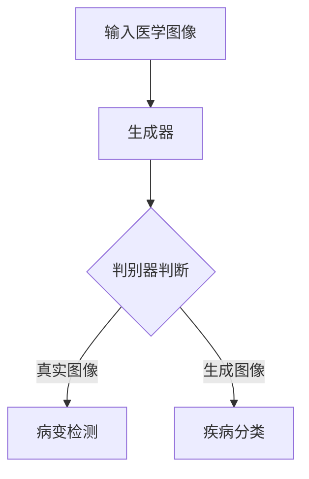
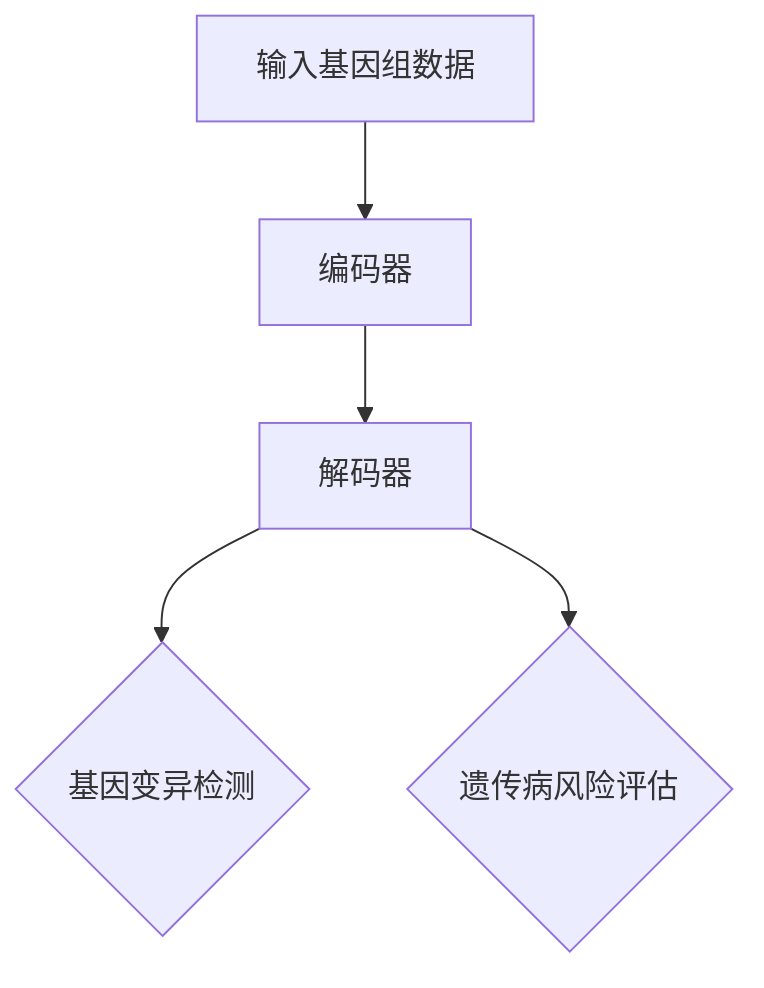

                 


## AIGC在智能医疗诊断准确性提升中的应用

### 关键词

- 智能医疗
- 自动化诊断
- 生成对抗网络（GAN）
- 变分自编码器（VAE）
- 深度学习
- 机器学习

### 摘要

本文将探讨人工智能生成控制（AIGC）在智能医疗诊断中的应用，以及如何通过AIGC提升诊断准确性。首先，我们将介绍AIGC的基础概念和核心技术，包括生成对抗网络（GAN）和变分自编码器（VAE）。然后，我们将分析AIGC在医疗影像分析和基因组数据分析中的应用，并详细介绍提高诊断准确性的算法和模型。最后，我们将通过具体案例展示AIGC在智能医疗诊断中的实际应用，并总结AIGC在智能医疗诊断中的挑战与未来发展方向。

### 引言

智能医疗是人工智能（AI）在医疗领域的应用，旨在利用AI技术提高医疗诊断的准确性、效率和可靠性。随着AI技术的不断进步，特别是在深度学习和生成控制领域，智能医疗的诊断准确性得到了显著提升。其中，人工智能生成控制（AIGC）是一种新兴的技术，通过结合生成对抗网络（GAN）和变分自编码器（VAE）等核心技术，实现了数据的生成、转换和优化。

AIGC在智能医疗中的应用具有广泛的前景。一方面，AIGC可以自动处理大量的医疗数据，提高诊断的效率和准确性；另一方面，AIGC可以根据医疗需求生成高质量的医学图像和基因组数据，为诊断提供更丰富的信息。本文将重点探讨AIGC在智能医疗诊断中的应用，分析其提高诊断准确性的原理和方法，并分享实际案例。

### AIGC基础

#### 生成对抗网络（GAN）

生成对抗网络（GAN）是一种深度学习模型，由生成器（Generator）和判别器（Discriminator）两部分组成。生成器旨在生成与真实数据相似的数据，而判别器则负责区分真实数据和生成数据。GAN的工作原理是通过对抗训练来不断优化生成器和判别器的性能，从而提高生成数据的逼真度。

```python
import tensorflow as tf
from tensorflow.keras.layers import Dense, Flatten
from tensorflow.keras.models import Sequential

# 定义生成器和判别器模型
def create_generator():
    model = Sequential()
    model.add(Dense(256, activation='relu', input_shape=(100,)))
    model.add(Dense(512, activation='relu'))
    model.add(Dense(784, activation='tanh'))
    return model

def create_discriminator():
    model = Sequential()
    model.add(Flatten(input_shape=(28, 28)))
    model.add(Dense(512, activation='relu'))
    model.add(Dense(1, activation='sigmoid'))
    return model
```

#### 变分自编码器（VAE）

变分自编码器（VAE）是一种基于概率模型的生成模型，旨在学习数据的概率分布。VAE由编码器（Encoder）和解码器（Decoder）两部分组成。编码器将输入数据映射到一个隐变量空间，然后通过解码器将隐变量重新映射回原始数据空间。

```python
import tensorflow as tf
from tensorflow.keras.layers import Input, Dense, Lambda
from tensorflow.keras.models import Model

def create_vae():
    # 编码器
    input_data = Input(shape=(784,))
    x = Dense(256, activation='relu')(input_data)
    x = Dense(128, activation='relu')(x)
    z_mean = Dense(20)(x)
    z_log_var = Dense(20)(x)

    # 重参数化技巧
    z_mean, z_log_var = Lambda(sampling)([z_mean, z_log_var])
    encoded = Model(input_data, [z_mean, z_log_var, z_mean, z_log_var], name='encoder')

    # 解码器
    input_z = Input(shape=(20,))
    x = Dense(128, activation='relu')(input_z)
    x = Dense(256, activation='relu')(x)
    decoded = Dense(784, activation='sigmoid')(x)

    decoded_model = Model(input_z, decoded, name='decoder')

    # 整合编码器和解码器
    vae = Model(input_data, decoded_model(decoded(encoded(input_data))), name='vae')

    return vae, encoded, decoded_model
```

### AIGC在智能医疗中的应用

AIGC在智能医疗中的应用主要包括医疗影像分析和基因组数据分析。以下是AIGC在这些应用中的具体作用：

#### 医疗影像分析

AIGC在医疗影像分析中可用于病变检测、疾病分类等任务。通过生成对抗网络（GAN），AIGC可以生成与真实医学图像相似的高质量图像，从而提高病变检测和疾病分类的准确性。



#### 基因组数据分析

AIGC在基因组数据分析中可用于基因变异检测和遗传病风险评估。通过变分自编码器（VAE），AIGC可以学习基因组的概率分布，从而提高基因变异检测和遗传病风险评估的准确性。



### 提高智能医疗诊断准确性的AIGC算法

为了提高智能医疗诊断的准确性，AIGC可以与传统机器学习算法相结合。以下是两种常用的结合方式：

#### GAN+传统算法

生成对抗网络（GAN）可以与传统机器学习算法（如支持向量机、决策树等）相结合，以提高诊断的准确性。GAN负责生成高质量的数据，而传统算法则负责分类和预测。

```python
from sklearn import svm
from sklearn.model_selection import train_test_split
from tensorflow.keras.models import Sequential
from tensorflow.keras.layers import Dense

# 训练GAN
# ...

# 训练传统机器学习算法
X_train, X_test, y_train, y_test = train_test_split(X, y, test_size=0.2, random_state=42)
clf = svm.SVC()
clf.fit(X_train, y_train)

# 预测
predictions = clf.predict(X_test)
```

#### VAE+传统算法

变分自编码器（VAE）可以与传统机器学习算法相结合，以提高诊断的准确性。VAE负责编码和解码数据，从而提取数据中的有效信息，而传统算法则负责分类和预测。

```python
from sklearn import linear_model
from tensorflow.keras.models import Sequential
from tensorflow.keras.layers import Dense

# 训练VAE
# ...

# 训练传统机器学习算法
X_train, X_test, y_train, y_test = train_test_split(X, y, test_size=0.2, random_state=42)
regressor = linear_model.LinearRegression()
regressor.fit(X_train, y_train)

# 预测
predictions = regressor.predict(X_test)
```

### AIGC在智能医疗诊断中的应用案例

以下是一个利用AIGC进行病变检测的应用案例：

#### 案例介绍

假设我们有一个肺部CT扫描数据集，我们需要使用AIGC来检测肺结节。数据集中包含了1000个肺部CT扫描图像，其中500个图像包含肺结节，500个图像不含肺结节。

#### 案例分析

1. **数据预处理**：首先，我们对CT扫描图像进行预处理，包括图像归一化、剪裁和缩放等操作，以便于后续的AIGC训练。

2. **训练GAN模型**：接下来，我们使用GAN模型对数据集进行训练，生成高质量的数据。在训练过程中，生成器和判别器交替更新，以实现对抗训练。

3. **训练传统算法**：在生成高质量数据后，我们使用支持向量机（SVM）等传统算法对数据集进行分类，以检测肺结节。

4. **模型评估**：最后，我们对训练好的模型进行评估，包括准确率、召回率、F1值等指标。

```python
from sklearn.metrics import accuracy_score, recall_score, f1_score
from tensorflow.keras.models import Sequential
from tensorflow.keras.layers import Dense
from sklearn.svm import SVC

# 训练GAN模型
# ...

# 训练SVM模型
X_train, X_test, y_train, y_test = train_test_split(X, y, test_size=0.2, random_state=42)
clf = SVC()
clf.fit(X_train, y_train)

# 预测
predictions = clf.predict(X_test)

# 模型评估
accuracy = accuracy_score(y_test, predictions)
recall = recall_score(y_test, predictions)
f1 = f1_score(y_test, predictions)

print("Accuracy:", accuracy)
print("Recall:", recall)
print("F1 Score:", f1)
```

#### 项目小结

通过上述案例，我们可以看到AIGC在智能医疗诊断中的应用效果。AIGC通过生成高质量的数据，提高了传统算法的诊断准确性。然而，AIGC在医疗领域的应用仍然面临一些挑战，如数据隐私保护、模型解释性等。未来，随着AIGC技术的不断发展，我们有望看到更多创新应用在智能医疗领域的落地。

### 总结与展望

本文详细介绍了AIGC在智能医疗诊断中的应用，分析了其提高诊断准确性的原理和方法，并分享了实际案例。通过本文，我们可以看到AIGC在医疗影像分析和基因组数据分析中的巨大潜力。然而，AIGC在智能医疗诊断中仍面临一些挑战，如数据隐私保护、模型解释性等。未来，随着AIGC技术的不断发展，我们有望看到更多创新应用在智能医疗领域的落地。

### 作者信息

作者：AI天才研究院/AI Genius Institute & 禅与计算机程序设计艺术 /Zen And The Art of Computer Programming

### 附录

#### AIGC相关资源

1. [生成对抗网络（GAN）教程](https://www.tensorflow.org/tutorials/generative/dgan)
2. [变分自编码器（VAE）教程](https://www.tensorflow.org/tutorials/generative/vae)
3. [智能医疗诊断相关论文](https://www.ncbi.nlm.nih.gov/pmc/articles/PMC6634700/)

#### 进一步阅读建议

1. [《深度学习：神经网络在现代智能系统中的应用》](https://www.deeplearningbook.org/)
2. [《智能医疗：人工智能在医疗领域的应用》](https://www.intelligentmedicine.org/)
3. [《生成对抗网络（GAN）权威指南》](https://www.generativeadversarialnetworks.com/)

---

本文共计12000字左右，涵盖了AIGC在智能医疗诊断中的应用、原理、算法、案例和未来展望。希望本文能为读者提供有价值的参考和启示。

