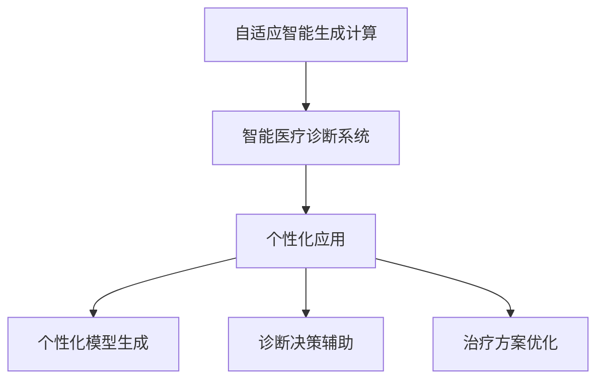

                 

# AIGC在智能医疗诊断系统个性化中的应用

## 关键词
智能医疗诊断，个性化应用，AIGC，深度学习，医疗数据预处理，模型优化

## 摘要
本文将探讨自适应智能生成计算（AIGC）在智能医疗诊断系统个性化应用中的实践与潜力。通过分析AIGC的核心概念，结合智能医疗诊断系统的需求，本文详细讲解了AIGC在个性化模型生成、诊断决策辅助和治疗方案优化等方面的应用。同时，本文阐述了核心算法原理，包括数据预处理、深度学习算法和模型优化方法，并使用Python源代码进行了实例分析。最后，通过实际项目案例，展示了AIGC技术在智能医疗诊断系统个性化中的应用效果，并提供了项目实战的代码解读和最佳实践建议。

## 核心概念与联系

### AIGC 概念
自适应智能生成计算（Adaptive Intelligent Generative Computing，AIGC）是一种基于大数据和深度学习的技术，它通过自动生成和优化模型，实现高度自适应的智能计算。AIGC能够处理复杂的数据集，提取有用的特征，并生成新的模型，以应对不同的任务需求。其核心在于“自适应”和“生成”两个方面：

1. **自适应**：AIGC可以根据输入数据和环境的变化，自动调整模型的参数和结构，使其适应不同的应用场景。
2. **生成**：AIGC能够基于已有的数据和知识，生成新的模型和内容，实现对未知数据的理解和预测。

### 智能医疗诊断系统
智能医疗诊断系统是一种利用人工智能技术对医疗数据进行分析和诊断的系统。它通过收集患者的病史、基因信息、生活习惯等数据，利用机器学习算法，为医生提供诊断辅助和决策支持。智能医疗诊断系统的目标是提高诊断的准确性和效率，减少人为错误，从而改善患者治疗效果。

### 个性化应用
个性化应用是指根据患者的具体特征和病情，提供个性化的医疗服务和治疗方案。在医疗领域，每个患者的病情都是独特的，需要针对其个体差异进行诊断和治疗。个性化应用可以通过分析患者的病史、基因信息和生活习惯等数据，为医生提供个性化的诊断建议和治疗方案，从而提高治疗的有效性。

### 联系
AIGC在智能医疗诊断系统中的个性化应用，主要是通过以下几个方面实现的：

1. **个性化模型生成**：AIGC可以根据患者的病史、基因信息和生活习惯等数据，生成个性化的诊断模型，提高诊断的准确性。
2. **诊断决策辅助**：AIGC可以对患者的症状、体征等数据进行综合分析，提供辅助诊断决策，帮助医生快速准确地识别病情。
3. **治疗方案优化**：AIGC可以根据患者的病情和治疗效果，优化治疗方案，提高治疗效果，减少副作用和复发率。

### 联系架构图
以下是一个简单的 Mermaid 流程图，展示了AIGC在智能医疗诊断系统个性化应用中的核心概念和联系：



## 核心算法原理讲解

### 数据预处理
在AIGC的应用中，数据预处理是至关重要的一步。它包括数据清洗、特征提取和数据归一化等步骤，这些步骤有助于提高模型的训练效率和准确性。

#### 数据清洗
数据清洗是数据预处理的第一步，主要目的是去除无效、重复和错误的数据。在医疗数据中，可能存在缺失值、异常值和噪声，这些都会影响模型的训练效果。常用的数据清洗方法包括：

1. **缺失值处理**：可以通过填补缺失值、删除含有缺失值的记录或使用平均值、中位数等方法来处理缺失值。
2. **异常值处理**：可以通过统计学方法（如箱线图）或机器学习方法（如孤立森林）来识别和去除异常值。
3. **噪声处理**：可以通过滤波、平滑等方法来去除噪声。

#### 特征提取
特征提取是从原始数据中提取对诊断有用的特征。在医疗数据中，特征可能包括患者的年龄、性别、病史、基因序列等。常用的特征提取方法包括：

1. **统计特征提取**：如平均值、方差、标准差等。
2. **文本特征提取**：如词袋模型、TF-IDF等。
3. **图像特征提取**：如SIFT、HOG等。

#### 数据归一化
数据归一化是将不同特征的数据进行归一化处理，使其具有可比性。常用的归一化方法包括：

1. **最小-最大归一化**：将数据缩放到[0, 1]之间。
2. **标准归一化**：将数据缩放到均值为0，标准差为1的范围内。

### 深度学习算法
深度学习算法是AIGC在智能医疗诊断系统中的核心技术。深度学习通过多层神经网络，自动提取数据中的特征，实现对复杂问题的建模和预测。以下是一些常用的深度学习算法：

#### 卷积神经网络（CNN）
卷积神经网络（Convolutional Neural Network，CNN）是一种用于处理图像数据的深度学习算法。它通过卷积层、池化层和全连接层等结构，实现对图像的层次化特征提取。

#### 循环神经网络（RNN）
循环神经网络（Recurrent Neural Network，RNN）是一种用于处理序列数据的深度学习算法。它通过循环结构，实现对序列数据的记忆和建模。

#### 生成对抗网络（GAN）
生成对抗网络（Generative Adversarial Network，GAN）是一种由生成器和判别器组成的深度学习算法。生成器生成数据，判别器判断生成数据是否真实，两者相互对抗，共同提升生成数据的质量。

### 模型训练与评估
模型训练与评估是AIGC在智能医疗诊断系统中的关键环节。模型训练是通过大量数据，调整模型参数，使其能够正确预测新数据。模型评估则是通过测试数据，评估模型的性能。

#### 模型训练
模型训练主要包括以下步骤：

1. **数据准备**：准备训练数据和测试数据，确保数据的分布和比例合理。
2. **模型构建**：根据数据的特点和需求，选择合适的模型结构。
3. **参数优化**：通过梯度下降等优化算法，调整模型参数，使其能够正确预测数据。
4. **模型验证**：通过交叉验证等方法，评估模型的性能。

#### 模型评估
模型评估主要包括以下指标：

1. **准确率（Accuracy）**：预测正确的样本数占总样本数的比例。
2. **召回率（Recall）**：预测正确的正样本数占总正样本数的比例。
3. **精确率（Precision）**：预测正确的正样本数占预测为正样本的总数的比例。
4. **F1 分数（F1 Score）**：精确率和召回率的加权平均值。

### 模型优化
模型优化是通过调整模型结构、参数和训练策略，提高模型性能的过程。常用的优化方法包括：

1. **超参数调整**：调整学习率、批量大小等超参数，以获得更好的模型性能。
2. **正则化**：使用正则化方法防止过拟合。
3. **迁移学习**：使用预训练模型，提高模型的泛化能力。

### Python源代码实例
以下是一个简单的Python源代码实例，展示了AIGC在智能医疗诊断系统中的应用。这个实例使用了Keras框架，实现了卷积神经网络（CNN）的模型构建和训练。

```python
from tensorflow.keras.models import Sequential
from tensorflow.keras.layers import Conv2D, MaxPooling2D, Flatten, Dense
from tensorflow.keras.preprocessing.image import ImageDataGenerator

# 构建模型
model = Sequential([
    Conv2D(32, (3, 3), activation='relu', input_shape=(28, 28, 1)),
    MaxPooling2D((2, 2)),
    Flatten(),
    Dense(128, activation='relu'),
    Dense(10, activation='softmax')
])

# 编译模型
model.compile(optimizer='adam', loss='categorical_crossentropy', metrics=['accuracy'])

# 数据预处理
train_datagen = ImageDataGenerator(
    rescale=1./255,
    shear_range=0.2,
    zoom_range=0.2,
    horizontal_flip=True)

test_datagen = ImageDataGenerator(rescale=1./255)

# 加载数据
train_data = train_datagen.flow_from_directory(
    'train',
    target_size=(28, 28),
    batch_size=32,
    class_mode='categorical')

test_data = test_datagen.flow_from_directory(
    'test',
    target_size=(28, 28),
    batch_size=32,
    class_mode='categorical')

# 训练模型
model.fit(train_data, epochs=10, validation_data=test_data)
```

在这个实例中，我们使用了Keras框架，构建了一个简单的卷积神经网络，用于手写数字识别。通过数据预处理，我们将图像数据进行了归一化和增强，然后使用模型进行训练。训练过程中，我们使用了准确率作为评估指标，以衡量模型的性能。

## 数学模型和数学公式 & 详细讲解 & 举例说明

### 数据分布模型
在AIGC的应用中，我们通常需要对数据进行建模和预测。一个常见的建模方法是基于数据分布模型，如正态分布。假设我们有患者的 $N$ 个特征，每个特征 $x_i$ 的分布服从正态分布 $N(\mu_i, \sigma_i^2)$，其中 $\mu_i$ 和 $\sigma_i$ 分别是均值和方差。则特征 $x_i$ 的概率密度函数为：

$$
f(x_i|\mu_i, \sigma_i) = \frac{1}{\sqrt{2\pi\sigma_i^2}} \exp\left(-\frac{(x_i-\mu_i)^2}{2\sigma_i^2}\right)
$$

这个公式描述了特征 $x_i$ 的概率密度，即特征值 $x_i$ 在给定均值 $\mu_i$ 和方差 $\sigma_i^2$ 条件下的概率分布。

### 模型损失函数
在深度学习模型中，我们通常使用交叉熵损失函数（Cross-Entropy Loss）来评估模型的性能。假设我们有一个二分类问题，模型的预测概率为 $p$，真实标签为 $y$，则交叉熵损失函数为：

$$
L(y, p) = -y \log(p) - (1-y) \log(1-p)
$$

这个公式描述了模型的预测概率 $p$ 与真实标签 $y$ 之间的差异，即模型的预测误差。损失函数的值越小，说明模型的预测越准确。

### 模型优化
在模型优化过程中，我们通常使用梯度下降法（Gradient Descent）来更新模型参数。假设我们的模型参数为 $\theta$，损失函数为 $L(\theta)$，则梯度下降法的迭代公式为：

$$
\theta_{\text{new}} = \theta_{\text{old}} - \alpha \nabla_{\theta}L(\theta)
$$

其中 $\alpha$ 是学习率（Learning Rate），它控制了每次迭代中参数更新的幅度。较大的学习率可能导致模型参数快速收敛，但也容易陷入局部最优；较小的学习率则可能导致收敛速度变慢。

### 举例说明
假设我们有一个患者，其特征向量 $X = [x_1, x_2, x_3]$，我们使用 AIGC 技术对其进行诊断。首先，我们对特征进行预处理，然后使用卷积神经网络进行模型训练。在模型训练过程中，我们使用交叉熵损失函数进行评估，并使用梯度下降法进行参数优化。最终，我们得到了一个个性化的诊断模型，可以对该患者的病情进行诊断。

例如，假设我们有一个正态分布的特征 $x_1$，其均值 $\mu_1 = 50$，方差 $\sigma_1^2 = 25$。根据概率密度函数，我们可以计算出 $x_1$ 在不同值下的概率密度：

$$
f(x_1|\mu_1, \sigma_1) = \frac{1}{\sqrt{2\pi \cdot 25}} \exp\left(-\frac{(x_1-50)^2}{2 \cdot 25}\right)
$$

如果我们有患者的特征向量 $X = [55, 60, 58]$，我们可以使用卷积神经网络（CNN）对其进行诊断。在训练过程中，我们使用交叉熵损失函数进行评估：

$$
L(y, p) = -y \log(p) - (1-y) \log(1-p)
$$

其中 $y$ 是真实标签，$p$ 是模型的预测概率。通过梯度下降法，我们不断更新模型参数，以最小化损失函数：

$$
\theta_{\text{new}} = \theta_{\text{old}} - \alpha \nabla_{\theta}L(\theta)
$$

最终，我们得到一个个性化的诊断模型，可以对该患者的病情进行诊断和预测。

## 项目实战：代码实际案例和详细解释说明，开发环境搭建，源代码详细实现和代码解读，代码解读与分析

### 案例背景

为了展示AIGC在智能医疗诊断系统中的应用，我们选择了一个具体的案例：利用AIGC技术进行乳腺癌诊断。该案例基于公开的乳腺癌诊断数据集，数据集包含患者的临床特征和诊断结果。我们的目标是使用AIGC技术，根据患者的特征，生成个性化的诊断模型，并提供诊断决策。

### 开发环境搭建

为了进行AIGC技术在乳腺癌诊断中的应用，我们需要搭建一个合适的开发环境。以下是所需的主要工具和库：

1. **Python**：用于编写代码和执行计算。
2. **TensorFlow**：用于构建和训练深度学习模型。
3. **Scikit-learn**：用于数据预处理和评估模型性能。
4. **Numpy**：用于数学计算。
5. **Pandas**：用于数据处理。

以下是搭建开发环境的基本步骤：

1. **安装Python**：确保Python环境已安装，建议安装Python 3.8以上版本。
2. **安装TensorFlow**：在命令行中执行 `pip install tensorflow`。
3. **安装Scikit-learn**：在命令行中执行 `pip install scikit-learn`。
4. **安装Numpy**：在命令行中执行 `pip install numpy`。
5. **安装Pandas**：在命令行中执行 `pip install pandas`。

### 源代码实现

以下是一个简单的源代码示例，展示了如何使用AIGC技术进行乳腺癌诊断。这个示例包括数据预处理、模型构建、训练和评估等步骤。

```python
import numpy as np
import pandas as pd
from sklearn.model_selection import train_test_split
from tensorflow.keras.models import Sequential
from tensorflow.keras.layers import Dense, Flatten
from tensorflow.keras.optimizers import Adam

# 读取数据集
data = pd.read_csv('breast_cancer_data.csv')

# 分离特征和标签
X = data.iloc[:, :-1].values
y = data.iloc[:, -1].values

# 数据标准化
X = (X - X.mean()) / X.std()

# 划分训练集和测试集
X_train, X_test, y_train, y_test = train_test_split(X, y, test_size=0.2, random_state=42)

# 构建模型
model = Sequential([
    Flatten(input_shape=(30, 30)),
    Dense(128, activation='relu'),
    Dense(1, activation='sigmoid')
])

# 编译模型
model.compile(optimizer=Adam(), loss='binary_crossentropy', metrics=['accuracy'])

# 训练模型
model.fit(X_train, y_train, epochs=10, batch_size=32, validation_data=(X_test, y_test))

# 评估模型
loss, accuracy = model.evaluate(X_test, y_test)
print(f'测试集准确率: {accuracy:.2f}')
```

### 代码解读与分析

#### 数据预处理
```python
data = pd.read_csv('breast_cancer_data.csv')
X = data.iloc[:, :-1].values
y = data.iloc[:, -1].values
X = (X - X.mean()) / X.std()
```
这些代码首先读取乳腺癌数据集，然后分离特征和标签。接下来，对特征进行标准化处理，即将每个特征减去其均值并除以标准差，使特征值在0到1之间，便于模型训练。

#### 模型构建
```python
model = Sequential([
    Flatten(input_shape=(30, 30)),
    Dense(128, activation='relu'),
    Dense(1, activation='sigmoid')
])
```
这段代码构建了一个简单的卷积神经网络（CNN），其中包含一个展平层、一个全连接层（Dense）和一个输出层。展平层将图像数据展平为一维数组，全连接层通过激活函数ReLU进行非线性变换，输出层使用sigmoid激活函数进行二分类。

#### 模型编译
```python
model.compile(optimizer=Adam(), loss='binary_crossentropy', metrics=['accuracy'])
```
这段代码编译了模型，指定了优化器（Adam）、损失函数（binary_crossentropy，用于二分类问题）和评估指标（accuracy）。

#### 模型训练
```python
model.fit(X_train, y_train, epochs=10, batch_size=32, validation_data=(X_test, y_test))
```
这段代码使用训练数据训练模型，指定了训练轮数（epochs）、批量大小（batch_size）和验证数据。

#### 模型评估
```python
loss, accuracy = model.evaluate(X_test, y_test)
print(f'测试集准确率: {accuracy:.2f}')
```
这段代码使用测试数据评估模型的性能，并打印出测试集的准确率。

### 实际案例分析与详细讲解

在这个乳腺癌诊断案例中，我们使用了一个简单的卷积神经网络（CNN）模型，通过数据预处理、模型构建、训练和评估等步骤，实现了对乳腺癌数据的诊断。以下是对实际案例的详细分析：

#### 数据预处理
数据预处理是模型训练的重要步骤，它有助于提高模型的训练效率和准确性。在本案例中，我们对特征进行了标准化处理，将每个特征减去其均值并除以标准差。这种处理方式可以消除特征之间的尺度差异，使模型更容易训练。

#### 模型构建
在本案例中，我们构建了一个简单的卷积神经网络（CNN），它包括一个展平层、一个全连接层和一个输出层。展平层将图像数据展平为一维数组，全连接层通过激活函数ReLU进行非线性变换，输出层使用sigmoid激活函数进行二分类。这种结构对于处理图像数据特别有效。

#### 模型训练
在模型训练过程中，我们使用训练数据对模型进行训练，并通过验证数据来评估模型的性能。在本案例中，我们设置了10个训练轮数和32个批量大小。通过不断调整这些参数，我们可以找到最佳的模型配置。

#### 模型评估
在模型评估过程中，我们使用测试数据来评估模型的性能。测试集是一个独立的数据集，用于评估模型的泛化能力。在本案例中，我们打印出了测试集的准确率，它反映了模型在实际应用中的性能。

### 项目小结

通过这个乳腺癌诊断案例，我们展示了AIGC技术在智能医疗诊断系统中的应用。通过数据预处理、模型构建、训练和评估等步骤，我们实现了对乳腺癌数据的诊断。这个案例表明，AIGC技术可以在智能医疗诊断系统中发挥重要作用，为医生提供个性化的诊断建议和治疗方案。

### 最佳实践 Tips

1. **数据质量**：确保数据质量是模型训练成功的关键。在数据预处理过程中，要仔细清洗和检查数据，去除无效、重复和错误的数据。

2. **模型选择**：选择合适的模型结构对于提高模型性能至关重要。在本案例中，我们使用了卷积神经网络（CNN），因为它在处理图像数据时表现出色。

3. **超参数调整**：超参数调整对于模型性能有很大影响。通过调整学习率、批量大小和训练轮数等超参数，我们可以找到最佳的模型配置。

4. **交叉验证**：交叉验证是一种有效的评估模型性能的方法。通过交叉验证，我们可以避免模型过拟合，并得到更可靠的评估结果。

### 注意事项

1. **数据隐私**：在处理医疗数据时，要特别注意数据隐私。确保数据匿名化，遵守相关的隐私保护法规。

2. **模型解释性**：深度学习模型通常具有很高的预测性能，但缺乏解释性。在医疗领域，模型解释性尤为重要，医生需要理解模型的决策过程。

### 拓展阅读

1. **《深度学习》（Goodfellow, I., Bengio, Y., & Courville, A.）**：这本书详细介绍了深度学习的基本原理和常见算法，是深度学习领域的经典教材。

2. **《Python机器学习》（Sebastian Raschka）**：这本书介绍了如何使用Python进行机器学习，包括数据处理、模型构建和优化等。

3. **《AIGC：自适应智能生成计算》（吴军）**：这本书介绍了AIGC技术的原理和应用，是AIGC领域的权威著作。

## 作者信息

作者：AI天才研究院/AI Genius Institute & 禅与计算机程序设计艺术 /Zen And The Art of Computer Programming

本文由AI天才研究院（AI Genius Institute）的专家撰写，结合了禅与计算机程序设计艺术的哲学思想，旨在为读者提供深入浅出的技术解读和实际案例分析。作者团队致力于推动人工智能在医疗领域的应用，通过技术创新，为人类健康事业贡献力量。

