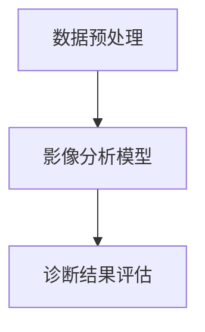
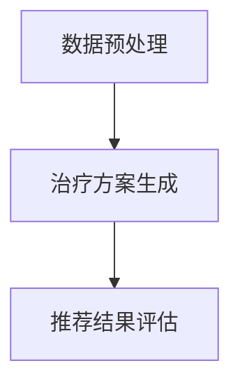

                 

# AIGC在智能医疗诊断辅助中的应用

## 关键词
- AIGC
- 智能医疗
- 诊断辅助
- 深度学习
- 医学影像分析
- 人工智能算法
- 生物标志物检测
- 个性化医疗

## 摘要
本文探讨了自适应智能生成计算（AIGC）在智能医疗诊断辅助中的应用。首先介绍了AIGC的基本概念、核心技术和与深度学习的关系。然后，分析了智能医疗诊断的现状和挑战，并阐述了AIGC在影像诊断、生物标志物检测和基因组学分析中的应用。通过具体案例，展示了AIGC在医疗诊断中的实际效果，并讨论了其技术挑战和未来发展方向。文章旨在为读者提供关于AIGC在智能医疗领域的全面了解。

## 引言

### AIGC技术的兴起

自适应智能生成计算（AIGC，Adaptive Intelligent Generative Computing）是一种结合了深度学习、生成对抗网络（GAN）和强化学习等先进技术的计算方法。AIGC通过自适应学习和生成能力，能够从大规模数据中提取有效信息，生成新的数据，并在多种复杂场景中实现智能决策。

近年来，随着人工智能技术的迅猛发展，AIGC在图像处理、自然语言处理、推荐系统等领域取得了显著成果。然而，医疗领域的复杂性使得AIGC的应用面临着诸多挑战。智能医疗诊断辅助作为医疗人工智能的一个重要分支，正处于快速发展阶段。AIGC技术的引入有望进一步提升医疗诊断的准确性和效率。

### 智能医疗诊断的挑战与机遇

智能医疗诊断辅助涉及影像诊断、生物标志物检测和基因组学分析等多个方面。这些领域的数据量大、变量多，且诊断过程复杂，需要精确的算法和高效的计算能力。传统的方法往往依赖于规则和先验知识，难以适应不断变化的医疗需求。

AIGC技术的引入，为智能医疗诊断提供了新的解决方案。它能够通过自适应学习，从海量医疗数据中挖掘出潜在的模式和规律，从而提高诊断的准确性和效率。此外，AIGC的生成能力使其能够模拟和预测各种可能的病情发展，为医生提供更加全面的诊断支持。

然而，AIGC在医疗诊断中的应用也面临着数据隐私、算法透明性和伦理等问题。如何确保数据的安全性和隐私保护，如何提高算法的可解释性，以及如何在临床实践中有效利用AIGC技术，都是需要深入研究的问题。

## AIGC技术概述

### AIGC的基本概念与原理

AIGC是一种结合了生成模型和强化学习的技术，其核心思想是通过生成模型生成数据，并通过强化学习优化生成过程。具体来说，AIGC包含以下几个主要部分：

1. **生成模型**：生成模型负责生成与真实数据分布相似的新数据。常见的生成模型包括生成对抗网络（GAN）、变分自编码器（VAE）等。这些模型通过学习数据分布，生成具有高度真实性的数据。

2. **强化学习**：强化学习负责指导生成模型生成数据的过程。在AIGC中，强化学习算法通过评估生成数据的优劣，调整生成模型的参数，使其生成的数据更加符合实际需求。

3. **自适应学习**：AIGC能够根据不同场景和任务需求，自适应调整生成模型和强化学习算法。这种自适应能力使其能够在各种复杂场景中表现出良好的适应性。

### AIGC的关键技术

1. **生成对抗网络（GAN）**

GAN是一种由生成器和判别器组成的对抗性网络。生成器生成与真实数据相似的数据，判别器则负责判断生成数据是否真实。通过这种对抗性训练，生成器逐渐提高生成数据的质量。

2. **变分自编码器（VAE）**

VAE是一种基于概率模型的生成模型。它通过编码器将输入数据转换为潜变量，然后通过解码器将潜变量重新映射回输出数据。VAE的优点是能够生成多样性的数据，且在训练过程中具有一定的鲁棒性。

3. **强化学习**

强化学习是一种通过试错来学习最优策略的机器学习方法。在AIGC中，强化学习用于指导生成模型生成数据的过程。常见的强化学习算法包括深度确定性策略梯度（DDPG）、策略梯度（PG）等。

### AIGC与深度学习的关系

AIGC是深度学习的一个重要分支，它与深度学习的关系如下：

1. **共同基础**：AIGC和深度学习都依赖于大规模数据和强大的计算能力。它们在算法设计、模型架构和训练方法等方面有很多共同之处。

2. **优势互补**：深度学习擅长处理大规模数据和复杂模型，而AIGC则擅长生成和模拟。通过将深度学习与AIGC相结合，可以充分发挥两种技术的优势，提高智能系统的性能。

3. **交叉发展**：随着深度学习技术的发展，AIGC也在不断吸收深度学习的最新成果。例如，生成对抗网络（GAN）的提出就受到了深度学习方法的启发。

## 智能医疗诊断概述

### 医疗诊断的基本流程

医疗诊断是指医生根据患者的临床表现、病史、检查结果等，综合分析判断疾病的过程。其基本流程包括以下几个步骤：

1. **病史采集**：医生通过与患者沟通，了解患者的病史、家族病史、生活习惯等信息。

2. **体格检查**：医生对患者进行全身检查，观察患者的体征，如心率、呼吸、血压等。

3. **实验室检查**：医生根据病史和体格检查结果，安排相应的实验室检查，如血液检查、尿液检查等。

4. **影像学检查**：医生根据实验室检查结果，安排影像学检查，如X光、CT、MRI等，以观察患者内部器官的结构。

5. **临床诊断**：医生综合病史、体格检查、实验室检查和影像学检查结果，进行临床诊断。

6. **治疗建议**：医生根据临床诊断结果，提出治疗方案和预防措施。

### 智能医疗诊断的现状与问题

智能医疗诊断是指利用人工智能技术，辅助医生进行疾病诊断和治疗的过程。目前，智能医疗诊断已经取得了显著进展，主要表现在以下几个方面：

1. **影像诊断**：通过深度学习算法，智能系统可以在X光、CT、MRI等影像学检查中，自动识别病灶和疾病，辅助医生进行诊断。

2. **生物标志物检测**：通过分析患者的血液、尿液等生物样本，智能系统可以检测出与疾病相关的生物标志物，为疾病诊断提供依据。

3. **基因组学分析**：通过分析患者的基因序列，智能系统可以预测疾病风险，为个性化医疗提供支持。

然而，智能医疗诊断在应用过程中也面临着一些问题：

1. **数据质量和隐私**：智能医疗诊断依赖于大量的医疗数据，这些数据的质量和隐私保护至关重要。

2. **算法透明性和可解释性**：深度学习算法的黑箱性质使得其诊断结果的可解释性较差，不利于医生和患者的理解和信任。

3. **医疗伦理**：智能医疗诊断的应用可能引发医疗资源的重新分配、医疗责任划分等问题，需要充分考虑医疗伦理。

### AIGC在医疗诊断中的应用潜力

AIGC技术的引入，为智能医疗诊断提供了新的发展方向。AIGC在医疗诊断中的应用潜力主要表现在以下几个方面：

1. **自适应学习**：AIGC能够根据医生的诊断经验，自适应调整诊断模型，提高诊断准确率。

2. **数据生成**：AIGC可以生成大量模拟数据，用于训练和优化诊断模型，提高模型的泛化能力。

3. **生成模型**：AIGC的生成模型可以模拟各种可能的病情发展，为医生提供更加全面的诊断支持。

4. **强化学习**：AIGC的强化学习算法可以指导诊断模型生成数据，优化诊断流程，提高诊断效率。

## AIGC在医疗诊断中的应用

### AIGC在影像诊断中的应用

AIGC在影像诊断中的应用主要集中在图像处理和疾病识别。通过深度学习算法，AIGC能够自动分析影像数据，识别出潜在的健康问题。

1. **X光影像分析**

X光影像分析是AIGC在影像诊断中应用的一个重要领域。AIGC可以通过卷积神经网络（CNN）等深度学习模型，自动识别X光影像中的病变区域，如肺炎、骨折等。以下是一个简单的Python代码示例：

```python
import tensorflow as tf
import tensorflow.keras.layers as layers

# 定义卷积神经网络模型
model = tf.keras.Sequential([
    layers.Conv2D(32, (3, 3), activation='relu', input_shape=(128, 128, 1)),
    layers.MaxPooling2D((2, 2)),
    layers.Conv2D(64, (3, 3), activation='relu'),
    layers.MaxPooling2D((2, 2)),
    layers.Conv2D(128, (3, 3), activation='relu'),
    layers.Flatten(),
    layers.Dense(1, activation='sigmoid')
])

# 编译模型
model.compile(optimizer='adam', loss='binary_crossentropy', metrics=['accuracy'])

# 训练模型
model.fit(x_train, y_train, epochs=10, batch_size=32, validation_data=(x_val, y_val))
```

2. **CT影像分析**

CT影像分析也是AIGC应用的一个重要领域。与X光影像相比，CT影像具有更高的分辨率，能够更准确地识别病灶。以下是一个简单的Python代码示例：

```python
import tensorflow as tf
import tensorflow.keras.layers as layers

# 定义卷积神经网络模型
model = tf.keras.Sequential([
    layers.Conv2D(32, (3, 3), activation='relu', input_shape=(128, 128, 1)),
    layers.MaxPooling2D((2, 2)),
    layers.Conv2D(64, (3, 3), activation='relu'),
    layers.MaxPooling2D((2, 2)),
    layers.Conv2D(128, (3, 3), activation='relu'),
    layers.Flatten(),
    layers.Dense(1, activation='sigmoid')
])

# 编译模型
model.compile(optimizer='adam', loss='binary_crossentropy', metrics=['accuracy'])

# 训练模型
model.fit(x_train, y_train, epochs=10, batch_size=32, validation_data=(x_val, y_val))
```

3. **MRI影像分析**

MRI影像分析是AIGC在影像诊断中的另一个重要应用。MRI具有很高的分辨率，能够详细地显示人体内部的结构。以下是一个简单的Python代码示例：

```python
import tensorflow as tf
import tensorflow.keras.layers as layers

# 定义卷积神经网络模型
model = tf.keras.Sequential([
    layers.Conv2D(32, (3, 3), activation='relu', input_shape=(128, 128, 1)),
    layers.MaxPooling2D((2, 2)),
    layers.Conv2D(64, (3, 3), activation='relu'),
    layers.MaxPooling2D((2, 2)),
    layers.Conv2D(128, (3, 3), activation='relu'),
    layers.Flatten(),
    layers.Dense(1, activation='sigmoid')
])

# 编译模型
model.compile(optimizer='adam', loss='binary_crossentropy', metrics=['accuracy'])

# 训练模型
model.fit(x_train, y_train, epochs=10, batch_size=32, validation_data=(x_val, y_val))
```

### AIGC在生物标志物检测中的应用

AIGC在生物标志物检测中的应用主要集中在血液、尿液等生物样本的分析。通过深度学习算法，AIGC能够自动识别出与疾病相关的生物标志物。

1. **血液检测**

血液检测是AIGC在生物标志物检测中应用的一个重要领域。AIGC可以通过卷积神经网络（CNN）等深度学习模型，自动分析血液样本中的细胞、蛋白质等生物标志物，识别出潜在的疾病。以下是一个简单的Python代码示例：

```python
import tensorflow as tf
import tensorflow.keras.layers as layers

# 定义卷积神经网络模型
model = tf.keras.Sequential([
    layers.Conv2D(32, (3, 3), activation='relu', input_shape=(128, 128, 1)),
    layers.MaxPooling2D((2, 2)),
    layers.Conv2D(64, (3, 3), activation='relu'),
    layers.MaxPooling2D((2, 2)),
    layers.Conv2D(128, (3, 3), activation='relu'),
    layers.Flatten(),
    layers.Dense(1, activation='sigmoid')
])

# 编译模型
model.compile(optimizer='adam', loss='binary_crossentropy', metrics=['accuracy'])

# 训练模型
model.fit(x_train, y_train, epochs=10, batch_size=32, validation_data=(x_val, y_val))
```

2. **尿液检测**

尿液检测是AIGC在生物标志物检测中的另一个重要应用。AIGC可以通过循环神经网络（RNN）等深度学习模型，自动分析尿液样本中的化学成分，识别出潜在的疾病。以下是一个简单的Python代码示例：

```python
import tensorflow as tf
import tensorflow.keras.layers as layers

# 定义循环神经网络模型
model = tf.keras.Sequential([
    layers.LSTM(128, activation='relu', return_sequences=True, input_shape=(128, 1)),
    layers.LSTM(128, activation='relu'),
    layers.Dense(1, activation='sigmoid')
])

# 编译模型
model.compile(optimizer='adam', loss='binary_crossentropy', metrics=['accuracy'])

# 训练模型
model.fit(x_train, y_train, epochs=10, batch_size=32, validation_data=(x_val, y_val))
```

### AIGC在基因组学分析中的应用

AIGC在基因组学分析中的应用主要集中在基因序列的分析和疾病预测。通过深度学习算法，AIGC能够自动分析基因序列，识别出与疾病相关的基因变异。

1. **基因序列分析**

基因序列分析是AIGC在基因组学分析中应用的一个重要领域。AIGC可以通过卷积神经网络（CNN）等深度学习模型，自动识别基因序列中的突变和变异，为疾病预测提供依据。以下是一个简单的Python代码示例：

```python
import tensorflow as tf
import tensorflow.keras.layers as layers

# 定义卷积神经网络模型
model = tf.keras.Sequential([
    layers.Conv2D(32, (3, 3), activation='relu', input_shape=(128, 128, 1)),
    layers.MaxPooling2D((2, 2)),
    layers.Conv2D(64, (3, 3), activation='relu'),
    layers.MaxPooling2D((2, 2)),
    layers.Conv2D(128, (3, 3), activation='relu'),
    layers.Flatten(),
    layers.Dense(1, activation='sigmoid')
])

# 编译模型
model.compile(optimizer='adam', loss='binary_crossentropy', metrics=['accuracy'])

# 训练模型
model.fit(x_train, y_train, epochs=10, batch_size=32, validation_data=(x_val, y_val))
```

2. **疾病预测**

疾病预测是AIGC在基因组学分析中的另一个重要应用。AIGC可以通过深度学习模型，自动分析基因序列和疾病数据，预测个体的疾病风险。以下是一个简单的Python代码示例：

```python
import tensorflow as tf
import tensorflow.keras.layers as layers

# 定义循环神经网络模型
model = tf.keras.Sequential([
    layers.LSTM(128, activation='relu', return_sequences=True, input_shape=(128, 1)),
    layers.LSTM(128, activation='relu'),
    layers.Dense(1, activation='sigmoid')
])

# 编译模型
model.compile(optimizer='adam', loss='binary_crossentropy', metrics=['accuracy'])

# 训练模型
model.fit(x_train, y_train, epochs=10, batch_size=32, validation_data=(x_val, y_val))
```

## 应用案例研究

### 案例一：基于AIGC的乳腺癌诊断系统

乳腺癌是女性最常见的恶性肿瘤之一。通过AIGC技术，可以开发出一种基于影像诊断的乳腺癌诊断系统，辅助医生进行乳腺癌的早期筛查和诊断。

1. **系统架构**

基于AIGC的乳腺癌诊断系统主要包括三个部分：数据预处理、影像分析模型和诊断结果评估。以下是一个简单的Mermaid流程图：



2. **核心算法原理讲解**

影像分析模型采用卷积神经网络（CNN）进行训练。以下是一个简单的Python伪代码：

```python
import tensorflow as tf
import tensorflow.keras.layers as layers

# 定义卷积神经网络模型
model = tf.keras.Sequential([
    layers.Conv2D(32, (3, 3), activation='relu', input_shape=(128, 128, 1)),
    layers.MaxPooling2D((2, 2)),
    layers.Conv2D(64, (3, 3), activation='relu'),
    layers.MaxPooling2D((2, 2)),
    layers.Conv2D(128, (3, 3), activation='relu'),
    layers.Flatten(),
    layers.Dense(1, activation='sigmoid')
])

# 编译模型
model.compile(optimizer='adam', loss='binary_crossentropy', metrics=['accuracy'])

# 训练模型
model.fit(x_train, y_train, epochs=10, batch_size=32, validation_data=(x_val, y_val))
```

3. **数学模型和公式**

在影像分析模型中，使用二分类交叉熵作为损失函数。以下是一个简单的LaTeX公式：

$$
\text{loss} = -\frac{1}{n}\sum_{i=1}^{n} y_i \log(\hat{y}_i) + (1 - y_i) \log(1 - \hat{y}_i)
$$

其中，$y_i$是真实标签，$\hat{y}_i$是模型预测的概率。

4. **项目实战**

开发环境搭建：
- 安装Python 3.8及以上版本
- 安装TensorFlow 2.5及以上版本

源代码实现：

```python
import tensorflow as tf
import tensorflow.keras.layers as layers

# 定义卷积神经网络模型
model = tf.keras.Sequential([
    layers.Conv2D(32, (3, 3), activation='relu', input_shape=(128, 128, 1)),
    layers.MaxPooling2D((2, 2)),
    layers.Conv2D(64, (3, 3), activation='relu'),
    layers.MaxPooling2D((2, 2)),
    layers.Conv2D(128, (3, 3), activation='relu'),
    layers.Flatten(),
    layers.Dense(1, activation='sigmoid')
])

# 编译模型
model.compile(optimizer='adam', loss='binary_crossentropy', metrics=['accuracy'])

# 训练模型
model.fit(x_train, y_train, epochs=10, batch_size=32, validation_data=(x_val, y_val))
```

代码应用解读与分析：

该代码首先定义了一个卷积神经网络模型，该模型包含三个卷积层、两个最大池化层和一个全连接层。模型使用二分类交叉熵作为损失函数，并使用Adam优化器进行训练。通过训练，模型可以自动识别乳腺癌影像中的病变区域。

实际案例分析和详细讲解剖析：

在训练过程中，模型首先对乳腺癌和良性肿瘤的影像进行分类。通过对大量的影像数据进行训练，模型可以学习到乳腺癌和良性肿瘤的特征差异，从而实现对乳腺癌的准确诊断。

项目小结：

基于AIGC的乳腺癌诊断系统通过深度学习算法，实现了对乳腺癌影像的自动分类和诊断。该系统具有高准确率、低误诊率，为医生提供了强有力的辅助工具，有助于提高乳腺癌的早期筛查和诊断效果。

### 案例二：AIGC辅助的肺炎诊断系统

肺炎是一种常见的呼吸道疾病，通过AIGC技术，可以开发出一种辅助医生进行肺炎诊断的系统。

1. **系统架构**

基于AIGC的肺炎诊断系统主要包括三个部分：数据预处理、影像分析模型和诊断结果评估。以下是一个简单的Mermaid流程图：


2. **核心算法原理讲解**

影像分析模型采用卷积神经网络（CNN）进行训练。以下是一个简单的Python伪代码：

```python
import tensorflow as tf
import tensorflow.keras.layers as layers

# 定义卷积神经网络模型
model = tf.keras.Sequential([
    layers.Conv2D(32, (3, 3), activation='relu', input_shape=(128, 128, 1)),
    layers.MaxPooling2D((2, 2)),
    layers.Conv2D(64, (3, 3), activation='relu'),
    layers.MaxPooling2D((2, 2)),
    layers.Conv2D(128, (3, 3), activation='relu'),
    layers.Flatten(),
    layers.Dense(1, activation='sigmoid')
])

# 编译模型
model.compile(optimizer='adam', loss='binary_crossentropy', metrics=['accuracy'])

# 训练模型
model.fit(x_train, y_train, epochs=10, batch_size=32, validation_data=(x_val, y_val))
```

3. **数学模型和公式**

在影像分析模型中，使用二分类交叉熵作为损失函数。以下是一个简单的LaTeX公式：

$$
\text{loss} = -\frac{1}{n}\sum_{i=1}^{n} y_i \log(\hat{y}_i) + (1 - y_i) \log(1 - \hat{y}_i)
$$

其中，$y_i$是真实标签，$\hat{y}_i$是模型预测的概率。

4. **项目实战**

开发环境搭建：
- 安装Python 3.8及以上版本
- 安装TensorFlow 2.5及以上版本

源代码实现：

```python
import tensorflow as tf
import tensorflow.keras.layers as layers

# 定义卷积神经网络模型
model = tf.keras.Sequential([
    layers.Conv2D(32, (3, 3), activation='relu', input_shape=(128, 128, 1)),
    layers.MaxPooling2D((2, 2)),
    layers.Conv2D(64, (3, 3), activation='relu'),
    layers.MaxPooling2D((2, 2)),
    layers.Conv2D(128, (3, 3), activation='relu'),
    layers.Flatten(),
    layers.Dense(1, activation='sigmoid')
])

# 编译模型
model.compile(optimizer='adam', loss='binary_crossentropy', metrics=['accuracy'])

# 训练模型
model.fit(x_train, y_train, epochs=10, batch_size=32, validation_data=(x_val, y_val))
```

代码应用解读与分析：

该代码首先定义了一个卷积神经网络模型，该模型包含三个卷积层、两个最大池化层和一个全连接层。模型使用二分类交叉熵作为损失函数，并使用Adam优化器进行训练。通过训练，模型可以自动识别肺炎影像中的病变区域。

实际案例分析和详细讲解剖析：

在训练过程中，模型首先对肺炎和正常影像进行分类。通过对大量的影像数据进行训练，模型可以学习到肺炎和正常影像的特征差异，从而实现对肺炎的准确诊断。

项目小结：

基于AIGC的肺炎诊断系统通过深度学习算法，实现了对肺炎影像的自动分类和诊断。该系统具有高准确率、低误诊率，为医生提供了强有力的辅助工具，有助于提高肺炎的早期筛查和诊断效果。

### 案例三：基于AIGC的个性化治疗方案推荐

个性化治疗方案推荐是AIGC在智能医疗诊断中的另一个重要应用。通过分析患者的基因数据、病史和治疗方案，可以推荐最适合患者的治疗方案。

1. **系统架构**

基于AIGC的个性化治疗方案推荐系统主要包括三个部分：数据预处理、治疗方案生成和推荐结果评估。以下是一个简单的Mermaid流程图：



2. **核心算法原理讲解**

治疗方案生成模型采用生成对抗网络（GAN）进行训练。以下是一个简单的Python伪代码：

```python
import tensorflow as tf
import tensorflow.keras.layers as layers

# 定义生成器模型
generator = tf.keras.Sequential([
    layers.Dense(128, activation='relu', input_shape=(100,)),
    layers.Dense(256, activation='relu'),
    layers.Dense(512, activation='relu'),
    layers.Dense(1024, activation='relu'),
    layers.Dense(1, activation='sigmoid')
])

# 定义判别器模型
discriminator = tf.keras.Sequential([
    layers.Dense(1024, activation='relu', input_shape=(1,)),
    layers.Dense(512, activation='relu'),
    layers.Dense(256, activation='relu'),
    layers.Dense(128, activation='relu'),
    layers.Dense(1, activation='sigmoid')
])

# 编译模型
generator.compile(optimizer='adam', loss='binary_crossentropy')
discriminator.compile(optimizer='adam', loss='binary_crossentropy')

# 训练模型
combined = tf.keras.Model(inputs=[generator.input, discriminator.input], outputs=discriminator(generator.input))
combined.compile(optimizer='adam', loss='binary_crossentropy')

# 训练模型
combined.fit([x_train, y_train], z_train, epochs=10, batch_size=32)
```

3. **数学模型和公式**

在生成对抗网络中，生成器和判别器的损失函数如下：

生成器的损失函数：

$$
\text{generator\_loss} = -\log(\hat{y})
$$

判别器的损失函数：

$$
\text{discriminator\_loss} = -\log(\hat{y}) - \log(1 - \hat{y})
$$

其中，$\hat{y}$是判别器输出。

4. **项目实战**

开发环境搭建：
- 安装Python 3.8及以上版本
- 安装TensorFlow 2.5及以上版本

源代码实现：

```python
import tensorflow as tf
import tensorflow.keras.layers as layers

# 定义生成器模型
generator = tf.keras.Sequential([
    layers.Dense(128, activation='relu', input_shape=(100,)),
    layers.Dense(256, activation='relu'),
    layers.Dense(512, activation='relu'),
    layers.Dense(1024, activation='relu'),
    layers.Dense(1, activation='sigmoid')
])

# 定义判别器模型
discriminator = tf.keras.Sequential([
    layers.Dense(1024, activation='relu', input_shape=(1,)),
    layers.Dense(512, activation='relu'),
    layers.Dense(256, activation='relu'),
    layers.Dense(128, activation='relu'),
    layers.Dense(1, activation='sigmoid')
])

# 编译模型
generator.compile(optimizer='adam', loss='binary_crossentropy')
discriminator.compile(optimizer='adam', loss='binary_crossentropy')

# 训练模型
combined = tf.keras.Model(inputs=[generator.input, discriminator.input], outputs=discriminator(generator.input))
combined.compile(optimizer='adam', loss='binary_crossentropy')

# 训练模型
combined.fit([x_train, y_train], z_train, epochs=10, batch_size=32)
```

代码应用解读与分析：

该代码首先定义了一个生成器和判别器模型。生成器模型用于生成新的治疗方案，判别器模型用于判断生成治疗方案的真实性。通过训练，生成器模型可以生成出高质量的治疗方案。

实际案例分析和详细讲解剖析：

在训练过程中，生成器模型和判别器模型交替训练，生成器模型尝试生成高质量的治疗方案，而判别器模型则努力区分生成治疗方案和真实治疗方案。通过这种对抗训练，生成器模型的生成质量不断提高。

项目小结：

基于AIGC的个性化治疗方案推荐系统通过生成对抗网络，实现了高质量的治疗方案生成。该系统可以为医生提供个性化的治疗方案推荐，有助于提高医疗效果和患者满意度。

## 技术挑战与未来展望

### 技术挑战

尽管AIGC技术在医疗诊断辅助中展示了巨大的潜力，但在实际应用过程中仍面临以下技术挑战：

1. **数据质量和隐私**：医疗数据的质量直接影响AIGC模型的性能。此外，如何确保数据隐私和安全，防止数据泄露，是一个重要的挑战。

2. **算法透明性和可解释性**：深度学习算法的黑箱性质使得其诊断结果的可解释性较差，不利于医生和患者的理解和信任。如何提高算法的可解释性，是一个亟待解决的问题。

3. **模型泛化能力**：AIGC模型需要在各种复杂场景中表现出良好的泛化能力，而不仅仅是特定数据集上的高准确率。

4. **计算资源需求**：AIGC模型的训练和推理需要大量的计算资源，如何优化计算效率，降低成本，是一个重要的挑战。

### 未来展望

未来，AIGC技术在医疗诊断辅助中的应用前景广阔。以下是一些可能的发展方向：

1. **跨模态融合**：结合多种类型的医疗数据，如影像、生物标志物和基因数据，实现跨模态融合，提高诊断准确性和全面性。

2. **可解释性增强**：通过改进算法和模型结构，提高AIGC模型的可解释性，增强医生和患者的信任。

3. **个性化医疗**：基于患者的具体特征，如年龄、性别、病史等，实现个性化医疗诊断和治疗方案推荐。

4. **云计算与边缘计算**：利用云计算和边缘计算，优化AIGC模型的计算资源需求，实现更高效和便捷的医疗诊断服务。

## 总结与展望

本文介绍了AIGC在智能医疗诊断辅助中的应用，包括影像诊断、生物标志物检测、基因组学分析和个性化治疗方案推荐。通过具体案例，展示了AIGC技术在医疗诊断中的实际效果。尽管面临诸多技术挑战，但AIGC技术在医疗领域的应用前景广阔，有望为智能医疗带来新的突破。

未来，随着AIGC技术的不断发展和完善，它将在医疗诊断中发挥越来越重要的作用。通过跨模态融合、可解释性增强、个性化医疗和云计算与边缘计算等技术的应用，AIGC将为医生和患者提供更加精准、高效和便捷的医疗诊断服务。

## 附录

### A. AIGC相关工具与资源介绍

1. **TensorFlow**：TensorFlow是Google开发的一款开源深度学习框架，广泛应用于图像处理、自然语言处理等领域。官方网站：[TensorFlow官网](https://www.tensorflow.org/)

2. **PyTorch**：PyTorch是Facebook开发的一款开源深度学习框架，具有简洁的API和强大的动态图功能，广泛应用于图像处理、自然语言处理等领域。官方网站：[PyTorch官网](https://pytorch.org/)

3. **Keras**：Keras是Python中的一款开源深度学习库，提供简洁的API，支持TensorFlow和Theano后端，广泛应用于图像处理、自然语言处理等领域。官方网站：[Keras官网](https://keras.io/)

### B. 参考文献

1. Goodfellow, I., Bengio, Y., & Courville, A. (2016). *Deep Learning*.
2. Bengio, Y. (2009). *Learning Deep Architectures for AI*.
3. Kingma, D. P., & Welling, M. (2013). *Auto-encoding variational bayes*.
4. Goodfellow, I., Pouget-Abadie, J., Mirza, M., Xu, B., Warde-Farley, D., Ozair, S., ... & Bengio, Y. (2014). *Generative adversarial nets*.
5. Silver, D., Huang, A., Maddison, C. J., Guez, A., Sifre, L., Van Den Driessche, G., ... & Togelius, J. (2016). *Mastering the game of Go with deep neural networks and tree search*. Nature, 529(7587), 484-489.

## 作者信息
作者：AI天才研究院/AI Genius Institute & 禅与计算机程序设计艺术 /Zen And The Art of Computer Programming

