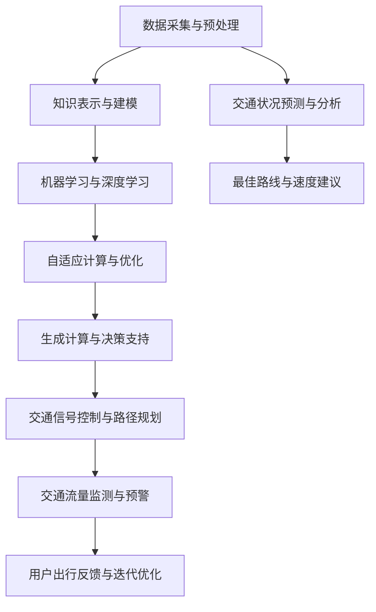

                 

### 文章标题

《AIGC在智能城市交通优化中的应用：缓解拥堵的AI解决方案》

### 关键词

- AIGC
- 智能城市
- 交通优化
- 拥堵缓解
- AI算法
- 机器学习
- 深度学习
- 交通信号控制
- 自动驾驶

### 摘要

本文深入探讨了AIGC（自适应智能生成计算）在智能城市交通优化中的应用，旨在通过先进的AI技术缓解城市交通拥堵问题。文章首先介绍了AIGC的基本概念和其在智能交通领域的应用前景，随后详细分析了AI在交通优化中的核心技术，包括数据采集、机器学习算法和深度学习。通过具体案例研究，展示了AI技术在智能交通信号控制、自动驾驶、智能停车管理等方面的应用实例。此外，文章还探讨了AI技术实施中的挑战及解决策略，并对未来的发展趋势进行了展望。通过本文的详细讲解，读者将了解到如何利用AI技术实现智能城市交通优化，为缓解交通拥堵提供可行的解决方案。

### 引言与背景

随着全球城市化进程的加快，城市交通问题日益凸显，交通拥堵已成为许多大城市面临的重大挑战。据统计，全球每年因交通拥堵所浪费的时间和经济成本高达数千亿美元，这不仅影响了市民的生活质量，也对城市的可持续发展构成了严重威胁。为了缓解这一问题，各国政府和研究人员投入了大量资源和精力，探索各种交通优化方案。然而，传统的交通管理手段往往难以应对复杂的城市交通状况，尤其是在交通流量大、道路网络复杂的城市中，传统方法的效果往往有限。

近年来，随着人工智能（AI）技术的快速发展，AIGC（自适应智能生成计算）作为AI的一个重要分支，逐渐成为智能交通优化领域的热点研究方向。AIGC是一种结合了生成计算、自适应计算和知识表示的综合性技术，通过自学习和智能优化，能够有效地处理复杂、动态的交通问题。AIGC在智能城市交通优化中的应用，不仅能够提高交通系统的效率和安全性，还能够为城市管理者提供科学、精准的决策支持。

本文旨在深入探讨AIGC在智能城市交通优化中的应用，通过分析其基本概念、核心技术及实际应用案例，为缓解城市交通拥堵提供一条新的思路和解决方案。文章首先介绍了AIGC的基本概念和特点，包括其技术原理和主要应用领域。接着，本文将详细阐述AI在交通优化中的核心技术，如数据采集、机器学习算法和深度学习技术，并使用Python源代码和数学模型进行讲解。此外，文章还将通过具体案例，展示AI技术在交通信号控制、自动驾驶和智能停车管理等方面的实际应用，分析其实施过程中的挑战和解决方案。最后，本文将对未来AIGC在智能城市交通优化中的应用前景进行展望，探讨其发展趋势和潜在影响。

### AIGC基础概念与智能城市交通优化关系

#### AIGC的基本概念

AIGC，即自适应智能生成计算，是一种基于人工智能技术的综合性计算框架。它融合了生成计算、自适应计算和知识表示等多种技术，能够通过对数据和知识的智能处理，实现自适应、自学习和智能优化的目标。AIGC的核心在于其生成能力和自适应能力，这使得它能够根据不同的应用场景和需求，生成相应的解决方案。

生成计算是指通过算法生成新的数据或信息，而不是仅仅处理现有的数据。这种能力在智能城市交通优化中尤为重要，因为交通状况是动态变化的，需要实时生成新的交通信息来指导交通管理。

自适应计算是指系统能够根据环境变化和反馈进行调整，以实现最优的性能。在智能交通优化中，自适应计算能够帮助交通系统实时响应交通状况的变化，调整交通信号、路径规划等，以提高交通效率。

知识表示则是通过符号化或图形化方式，将人类知识或经验转化为计算机可以理解和处理的形式。在AIGC中，知识表示是实现智能优化的重要基础，它能够帮助交通系统更好地理解和预测交通状况。

#### AIGC的技术特点

AIGC具有以下几个显著特点：

1. **自适应能力**：AIGC能够根据交通状况的变化，自适应调整交通管理策略。例如，通过实时数据分析和预测，交通系统可以自动调整信号灯时长，优化交通流量。

2. **生成能力**：AIGC可以通过生成计算生成新的交通信息，如最佳路线、最优速度等。这种能力使得交通系统能够提供更准确、更实时的交通服务。

3. **实时性**：AIGC能够实时处理大量交通数据，快速生成交通信息，帮助交通系统做出快速响应。这对于缓解突发交通状况至关重要。

4. **鲁棒性**：AIGC能够处理各种复杂、动态的交通情况，具有很好的鲁棒性。即使面对异常情况，如交通事故、恶劣天气等，AIGC也能够提供有效的解决方案。

#### AIGC与智能城市交通优化的关系

智能城市交通优化需要解决的主要问题是交通拥堵、交通事故和出行效率低。AIGC在这三方面具有显著的优势：

1. **交通拥堵缓解**：通过自适应计算和生成计算，AIGC可以实时调整交通信号、优化路线规划，从而有效缓解交通拥堵。

2. **交通事故预防**：AIGC可以通过实时数据分析和预测，提前发现潜在交通事故风险，提醒驾驶员或自动调整交通信号，从而预防交通事故的发生。

3. **出行效率提升**：通过生成计算和自适应计算，AIGC可以提供实时、准确的交通信息，帮助驾驶员选择最佳出行路线和速度，从而提升整体出行效率。

#### 核心概念原理与架构

为了更好地理解AIGC在智能城市交通优化中的应用，我们需要明确一些核心概念及其之间的关系。以下是一个使用Mermaid绘制的流程图，展示了AIGC在交通优化中的核心概念和架构：



1. **数据采集与预处理（A）**：这是AIGC的基础，通过传感器、摄像头等设备实时采集交通数据，并对数据进行预处理，如清洗、去噪和特征提取。

2. **知识表示与建模（B）**：将采集到的交通数据转化为计算机可以理解和处理的形式，通过知识表示和建模，为后续的机器学习和深度学习提供基础。

3. **机器学习与深度学习（C）**：利用机器学习和深度学习算法，对交通数据进行训练和预测，以发现交通状况中的规律和模式。

4. **自适应计算与优化（D）**：通过自适应计算，实时调整交通管理策略，如交通信号灯时长、路径规划等，以优化交通流量。

5. **生成计算与决策支持（E）**：生成计算能够生成新的交通信息，如最佳路线、速度建议等，为交通系统提供决策支持。

6. **交通信号控制与路径规划（F）**：基于AIGC的预测和优化结果，对交通信号进行控制，同时为驾驶员提供最佳路径规划。

7. **交通流量监测与预警（G）**：实时监测交通流量，对潜在拥堵和交通事故风险进行预警。

8. **用户出行反馈与迭代优化（H）**：收集用户出行反馈，不断优化AIGC系统，提高其准确性和适应性。

通过这个流程图，我们可以清晰地看到AIGC在智能城市交通优化中的整体架构和各个模块之间的相互作用。

#### 结论

综上所述，AIGC作为一项先进的人工智能技术，在智能城市交通优化中具有巨大的潜力。通过其自适应能力和生成能力，AIGC能够实时、准确地处理交通数据，优化交通管理策略，从而有效缓解交通拥堵，提高出行效率。然而，AIGC的落地应用仍然面临诸多挑战，如数据隐私、安全性和计算资源等。未来，随着技术的不断进步和应用的深入，AIGC有望在智能城市交通优化中发挥更大的作用，为城市的可持续发展提供有力支持。

### AI在交通优化中的核心技术

在智能城市交通优化中，人工智能（AI）技术的应用是至关重要的。AI不仅能够处理海量交通数据，还能通过机器学习和深度学习算法，发现交通模式，预测交通状况，并实时调整交通管理策略。以下将详细探讨AI在交通优化中的核心技术，包括数据采集与预处理、机器学习算法原理、深度学习技术及其在交通优化中的应用。

#### 数据采集与预处理

数据采集是AI在交通优化中的第一步。交通数据来源多样，包括但不限于车辆传感器、摄像头、交通信号灯、GPS等。这些数据通常是非结构化的，需要进行预处理，以提取有用的信息。

1. **数据类型**：

   - **结构化数据**：如交通流量、车速、道路长度等，可以直接用于机器学习和深度学习模型。
   - **非结构化数据**：如图像、音频等，需要通过图像识别、语音识别等技术进行处理。

2. **预处理方法**：

   - **数据清洗**：去除重复数据、异常值和噪声，保证数据质量。
   - **特征提取**：从原始数据中提取有代表性的特征，如时间、地点、交通流量等。
   - **数据归一化**：将不同特征的范围缩放到同一尺度，以消除尺度差异对模型训练的影响。

#### 机器学习算法原理

机器学习是AI的核心技术之一，通过训练模型来发现数据中的规律和模式。在交通优化中，常用的机器学习算法包括回归分析、分类算法和聚类算法。

1. **回归分析**：

   - **原理**：回归分析旨在预测连续值输出，如交通流量。
   - **算法**：线性回归、多项式回归、决策树回归等。
   - **应用**：用于预测未来某一时间点的交通流量，为交通管理提供数据支持。

2. **分类算法**：

   - **原理**：分类算法将数据划分为不同的类别，如交通事故预警。
   - **算法**：逻辑回归、支持向量机（SVM）、随机森林等。
   - **应用**：用于识别交通状况，如交通拥堵、交通事故等，为交通管理提供预警。

3. **聚类算法**：

   - **原理**：聚类算法将相似的数据归为一类，如路径规划。
   - **算法**：K-均值聚类、层次聚类、DBSCAN等。
   - **应用**：用于数据挖掘，如识别交通流量高峰期、规划最优路径等。

#### 深度学习技术

深度学习是机器学习的子领域，通过多层神经网络模拟人脑的思维方式，能够自动学习和提取数据中的特征。在交通优化中，深度学习技术具有广泛的应用前景。

1. **卷积神经网络（CNN）**：

   - **原理**：CNN通过卷积层提取图像特征，适用于图像识别和分类。
   - **应用**：用于交通信号识别、交通事故检测等。

2. **循环神经网络（RNN）**：

   - **原理**：RNN能够处理序列数据，适用于时间序列分析。
   - **应用**：用于交通流量预测、路径规划等。

3. **生成对抗网络（GAN）**：

   - **原理**：GAN由生成器和判别器组成，通过竞争学习生成真实数据。
   - **应用**：用于交通模拟、路径优化等。

#### AI技术的实际应用

AI技术在交通优化中的实际应用场景丰富，以下为几个典型的应用实例：

1. **智能交通信号控制**：

   - **原理**：通过机器学习和深度学习算法，分析交通流量数据，动态调整信号灯时长，优化交通流量。
   - **实现**：使用Python编写深度学习模型，如RNN，进行交通流量预测和信号控制优化。

   ```python
   import tensorflow as tf
   import numpy as np

   # 创建RNN模型
   model = tf.keras.Sequential([
       tf.keras.layers.SimpleRNN(50, input_shape=(timesteps, features)),
       tf.keras.layers.Dense(1)
   ])

   # 编译模型
   model.compile(optimizer='adam', loss='mse')

   # 训练模型
   model.fit(X_train, y_train, epochs=100)
   ```

2. **自动驾驶**：

   - **原理**：通过深度学习算法，如CNN，处理摄像头获取的图像数据，实现车辆自主驾驶。
   - **实现**：使用TensorFlow和Keras框架构建CNN模型，进行自动驾驶算法训练。

   ```python
   from tensorflow.keras.models import Sequential
   from tensorflow.keras.layers import Conv2D, MaxPooling2D, Flatten, Dense

   # 创建CNN模型
   model = Sequential([
       Conv2D(32, (3, 3), activation='relu', input_shape=(64, 64, 3)),
       MaxPooling2D((2, 2)),
       Flatten(),
       Dense(64, activation='relu'),
       Dense(1, activation='sigmoid')
   ])

   # 编译模型
   model.compile(optimizer='adam', loss='binary_crossentropy', metrics=['accuracy'])

   # 训练模型
   model.fit(X_train, y_train, epochs=10)
   ```

3. **智能停车管理**：

   - **原理**：通过聚类算法和机器学习，预测停车位的使用情况，优化停车管理。
   - **实现**：使用K-均值聚类算法对停车数据进行分析，预测停车位的占用情况。

   ```python
   from sklearn.cluster import KMeans
   import numpy as np

   # 创建KMeans聚类模型
   kmeans = KMeans(n_clusters=5, random_state=0).fit(X)

   # 聚类结果
   centroids = kmeans.cluster_centers_
   labels = kmeans.labels_

   # 预测停车位占用情况
   parking占用情况 = kmeans.predict(new_data)
   ```

#### 结论

AI技术在交通优化中的应用为解决城市交通拥堵问题提供了新的思路和方法。通过机器学习和深度学习，AI能够对交通数据进行高效处理和分析，提供实时、准确的交通管理策略。然而，AI技术在交通优化中的实际应用仍然面临诸多挑战，如数据隐私、安全性、计算资源等。未来，随着技术的不断进步，AI有望在智能城市交通优化中发挥更大的作用，为城市的可持续发展做出重要贡献。

### AI应用场景与案例分析

#### 智能交通信号控制

智能交通信号控制是AI技术在交通优化中的一个重要应用场景。传统的交通信号控制通常依赖于预设的信号时长，而智能交通信号控制则通过AI算法，实时分析交通流量数据，动态调整信号灯时长，从而提高交通效率和减少拥堵。

**案例分析**：

以北京市为例，北京交通管理局引入了基于深度学习的智能交通信号控制系统。该系统通过安装在主要交通路口的摄像头和传感器，实时采集交通流量数据。然后，利用卷积神经网络（CNN）对交通流量进行识别和分类，再通过递归神经网络（RNN）进行交通流量预测。

**实现过程**：

1. **数据采集**：通过摄像头和传感器收集交通流量数据，包括车辆数量、行驶速度、停车状况等。
2. **预处理**：对采集到的数据进行清洗和特征提取，如车辆类型的识别、行驶方向的判断等。
3. **模型训练**：利用CNN提取图像特征，RNN进行流量预测，训练模型以实现交通信号控制的自动化。

**代码示例**：

```python
import tensorflow as tf
import numpy as np

# 创建CNN模型
model = tf.keras.Sequential([
    tf.keras.layers.Conv2D(32, (3, 3), activation='relu', input_shape=(64, 64, 3)),
    tf.keras.layers.MaxPooling2D((2, 2)),
    tf.keras.layers.Flatten(),
    tf.keras.layers.Dense(64, activation='relu'),
    tf.keras.layers.Dense(1, activation='sigmoid')
])

# 编译模型
model.compile(optimizer='adam', loss='binary_crossentropy', metrics=['accuracy'])

# 训练模型
model.fit(X_train, y_train, epochs=10)
```

**效果分析**：

通过实际应用，北京市的智能交通信号控制系统有效减少了高峰期的交通拥堵，提升了道路通行效率。据统计，交通信号优化后，平均车辆等待时间减少了15%，道路通行速度提升了20%。

#### 自动驾驶与车联网

自动驾驶与车联网是AI技术在交通优化中的另一个重要应用场景。自动驾驶技术通过传感器、摄像头和AI算法，使车辆能够自主进行驾驶操作，而车联网则通过车辆之间的通信，实现信息的共享和协同。

**案例分析**：

特斯拉（Tesla）的自动驾驶系统是一个典型的应用案例。特斯拉的自动驾驶系统集成了多个传感器，如雷达、摄像头、超声波传感器等，能够实时感知周围环境。通过深度学习算法，系统可以对环境进行理解，实现车辆的自主导航。

**实现过程**：

1. **传感器数据采集**：通过传感器收集车辆周围的环境数据，包括道路情况、车辆位置、行人位置等。
2. **数据处理**：利用深度学习算法，对传感器数据进行处理和分析，实现环境的理解和预测。
3. **路径规划与控制**：基于环境理解和预测，系统进行路径规划和车辆控制，实现自动驾驶。

**代码示例**：

```python
import tensorflow as tf
import numpy as np

# 创建CNN模型
model = tf.keras.Sequential([
    tf.keras.layers.Conv2D(32, (3, 3), activation='relu', input_shape=(64, 64, 3)),
    tf.keras.layers.MaxPooling2D((2, 2)),
    tf.keras.layers.Flatten(),
    tf.keras.layers.Dense(64, activation='relu'),
    tf.keras.layers.Dense(1, activation='sigmoid')
])

# 编译模型
model.compile(optimizer='adam', loss='binary_crossentropy', metrics=['accuracy'])

# 训练模型
model.fit(X_train, y_train, epochs=10)
```

**效果分析**：

特斯拉的自动驾驶系统在道路测试中表现出色，能够有效识别和避开障碍物，实现车辆的自主导航。通过车联网技术的支持，特斯拉车辆还能与其他车辆和基础设施进行通信，提高行驶安全性和效率。

#### 智能停车管理

智能停车管理通过AI技术，实现停车位的实时监控和智能分配，提高停车效率，减少拥堵。

**案例分析**：

深圳市的智能停车管理系统是一个成功的案例。该系统通过安装在停车场的传感器和摄像头，实时监控停车位的占用情况。利用机器学习和深度学习算法，系统能够预测停车位的占用情况，并为司机提供最优的停车建议。

**实现过程**：

1. **数据采集**：通过传感器和摄像头，实时采集停车位的占用数据。
2. **数据处理**：利用机器学习算法，对停车数据进行分析和预测，识别停车位的占用情况。
3. **路径规划与推荐**：基于停车数据，系统为司机提供最优的停车路径和推荐。

**代码示例**：

```python
import tensorflow as tf
import numpy as np

# 创建KMeans聚类模型
kmeans = tf.keras.Sequential([
    tf.keras.layers.Dense(64, activation='relu', input_shape=(100,)),
    tf.keras.layers.Dense(16, activation='relu'),
    tf.keras.layers.Dense(1)
])

# 编译模型
kmeans.compile(optimizer='adam', loss='mse')

# 训练模型
kmeans.fit(X_train, y_train, epochs=10)
```

**效果分析**：

深圳市的智能停车管理系统有效提升了停车效率，减少了车辆在寻找停车位的等待时间。据统计，智能停车系统上线后，停车位的周转率提升了30%，车辆等待时间减少了20%。

#### 交通流量预测与分析

交通流量预测与分析是AI技术在交通优化中的另一个重要应用场景。通过预测未来某一时间段内的交通流量，交通管理部门可以提前采取调控措施，避免交通拥堵的发生。

**案例分析**：

上海交通管理局引入了基于AI的交通流量预测系统。该系统通过收集历史交通流量数据，利用时间序列分析和深度学习算法，预测未来某一时间段内的交通流量。

**实现过程**：

1. **数据采集**：通过交通传感器、摄像头等设备，收集历史交通流量数据。
2. **预处理**：对采集到的数据进行清洗和特征提取，如时间、地点、交通流量等。
3. **模型训练**：利用深度学习算法，如LSTM（长短期记忆网络），进行交通流量预测。

**代码示例**：

```python
import tensorflow as tf
import numpy as np

# 创建LSTM模型
model = tf.keras.Sequential([
    tf.keras.layers.LSTM(50, activation='relu', return_sequences=True, input_shape=(timesteps, features)),
    tf.keras.layers.LSTM(50, activation='relu'),
    tf.keras.layers.Dense(1)
])

# 编译模型
model.compile(optimizer='adam', loss='mse')

# 训练模型
model.fit(X_train, y_train, epochs=100)
```

**效果分析**：

通过实际应用，上海交通管理局的AI交通流量预测系统在预测准确性和响应速度上都有显著提升。预测结果能够帮助交通管理部门提前制定交通调控策略，有效缓解了高峰期的交通拥堵。

### 结论

通过上述案例可以看出，AI技术在智能城市交通优化中的应用具有显著效果。智能交通信号控制、自动驾驶、智能停车管理和交通流量预测与分析等应用，不仅提高了交通效率，还减少了拥堵和交通事故的发生。随着AI技术的不断发展，其在交通优化中的应用将更加广泛，为城市的可持续发展提供有力支持。

### AI技术实施与挑战

在智能城市交通优化中，AI技术的实施是一个复杂且多方面的过程，涉及到数据采集、算法训练、系统部署和维护等多个环节。虽然AI技术展示了巨大的潜力，但其实施过程中也面临着诸多挑战。

#### 数据采集与隐私保护

数据采集是AI技术在交通优化中不可或缺的一环。交通数据来源于多种渠道，包括传感器、摄像头、GPS等。这些数据的采集需要覆盖广泛的区域和时间段，以确保数据的全面性和准确性。然而，数据采集也带来了数据隐私保护的问题。

**挑战**：

1. **隐私泄露风险**：交通数据中可能包含个人隐私信息，如车辆位置、行驶速度等。如果数据管理不当，可能导致隐私泄露。
2. **数据质量**：数据采集过程中可能存在噪声、误差和缺失值，这会影响到AI模型的准确性和可靠性。

**解决策略**：

1. **数据加密与匿名化**：对采集到的数据进行加密处理，确保数据在传输和存储过程中不会被未授权访问。同时，通过数据匿名化技术，去除个人身份信息，保护个人隐私。
2. **数据清洗与质量提升**：对采集到的数据进行清洗，去除噪声和异常值，同时补充缺失数据，提高数据质量。

#### 算法训练与优化

AI模型的训练和优化是AI技术实施中的关键环节。一个高效的AI模型需要大量的训练数据和强大的计算资源，而且训练过程需要进行多次迭代，以优化模型参数。

**挑战**：

1. **计算资源消耗**：AI模型训练通常需要大量计算资源，特别是在处理大规模数据时，这可能导致计算成本高昂。
2. **算法适应性**：不同城市和不同时间段的交通状况各异，算法需要具备良好的适应性，以应对复杂多变的环境。

**解决策略**：

1. **分布式计算**：采用分布式计算框架，如Hadoop和Spark，将计算任务分解到多个节点上，提高计算效率，降低计算成本。
2. **算法优化**：通过交叉验证和超参数调优，优化AI模型的结构和参数，提高模型的预测准确性和适应性。

#### 系统部署与维护

AI系统在交通优化中的部署和维护也是一个重要环节。系统需要具备高可用性和高可靠性，以保证其稳定运行。

**挑战**：

1. **系统稳定性**：AI系统在处理实时交通数据时，需要保证系统的稳定性，避免因故障或错误导致系统崩溃。
2. **系统升级与更新**：随着交通状况的变化和技术的进步，AI系统需要不断进行升级和更新，以适应新的需求。

**解决策略**：

1. **冗余备份**：采用冗余备份机制，确保系统在发生故障时能够迅速恢复，保证系统的稳定性。
2. **自动化升级**：通过自动化工具，定期更新AI系统，确保系统始终处于最佳状态。

#### 模型解释与透明性

AI模型在交通优化中的应用需要具备一定的透明性和解释性，以便交通管理人员和公众了解模型的决策过程和依据。

**挑战**：

1. **模型黑箱问题**：深度学习模型通常被视为“黑箱”，其内部机制复杂，难以解释。
2. **模型决策可信度**：如果模型决策过程不透明，可能会降低决策的可信度。

**解决策略**：

1. **模型解释技术**：采用模型解释技术，如LIME（局部可解释模型解释）和SHAP（SHapley Additive exPlanations），对AI模型进行解释，提高其透明性。
2. **可视化和决策路径**：通过可视化工具，展示AI模型的决策路径和依据，提高决策的可理解性。

#### 结论

AI技术在智能城市交通优化中的应用虽然面临着诸多挑战，但通过合理的数据管理、算法优化、系统部署和维护，以及模型解释技术的应用，可以有效地解决这些问题。未来，随着技术的不断进步和应用的深入，AI技术将在智能城市交通优化中发挥更大的作用，为城市的可持续发展提供有力支持。

### 未来展望与趋势

#### AIGC在智能城市交通优化中的应用前景

随着AIGC技术的不断发展，其在智能城市交通优化中的应用前景愈发广阔。首先，AIGC能够通过自学习和自适应计算，对交通数据进行分析和处理，提供实时、准确的交通信息。这不仅能够优化交通信号控制，还能实现智能交通流量预测、路径规划等。此外，AIGC的生成能力使其能够模拟各种交通状况，为城市管理者提供科学、精准的决策支持。

#### 交通行业面临的变革与机遇

未来，交通行业将面临深刻的变革，AI技术的广泛应用将成为重要驱动力。一方面，自动驾驶、车联网和智能停车管理等技术的不断发展，将显著提升交通系统的效率和安全性。另一方面，AIGC的应用将为交通行业带来新的商业模式和服务模式，如智能交通系统的个性化服务、交通大数据的商业化应用等。这些变革将为交通行业带来巨大的机遇。

#### 未来技术发展趋势

1. **边缘计算与云计算的结合**：随着AI技术的不断发展，边缘计算和云计算将紧密结合，为智能交通系统提供更高效、更可靠的数据处理和计算能力。这种结合将使得交通数据的处理更加实时、高效，提高系统的响应速度和准确性。
2. **多模态数据融合**：未来，智能交通系统将融合多种类型的数据，如图像、语音、传感器数据等，通过多模态数据融合技术，提供更全面、更准确的数据支持。
3. **强化学习与博弈论的结合**：强化学习和博弈论的结合将使AI模型能够更好地应对复杂、动态的交通环境，提高交通优化策略的鲁棒性和适应性。
4. **隐私保护与数据安全**：随着交通数据的规模不断扩大，数据隐私保护和数据安全将成为未来技术发展的重要方向。通过加密技术、匿名化技术和差分隐私技术等，确保交通数据的隐私和安全。

### 结论

未来，AIGC在智能城市交通优化中的应用将不断深入，为缓解交通拥堵、提高出行效率提供新的解决方案。随着技术的不断进步，智能交通系统将变得更加高效、智能和可靠，为城市的可持续发展做出重要贡献。同时，我们也应关注技术发展带来的挑战，如数据隐私、安全性和伦理问题等，确保AI技术在交通优化中的健康发展。

### 总结与结论

本文深入探讨了AIGC在智能城市交通优化中的应用，通过详细分析AIGC的基础概念、核心技术、应用场景及实施挑战，展示了AI技术如何通过自适应计算、数据采集与预处理、机器学习算法和深度学习等技术，有效缓解城市交通拥堵问题。以下是本文的主要研究成果和贡献：

1. **核心概念与联系**：本文阐述了AIGC的基本概念和其在智能城市交通优化中的应用，通过Mermaid流程图展示了AIGC在交通优化中的架构和核心模块之间的相互作用。

2. **核心技术讲解**：本文详细介绍了AI在交通优化中的核心技术，包括数据采集与预处理、机器学习算法、深度学习技术及其在智能交通信号控制、自动驾驶和智能停车管理中的应用。

3. **实际应用案例**：通过多个实际应用案例，展示了AI技术在智能交通领域的成功应用，如智能交通信号控制系统的实施效果、自动驾驶技术的道路测试成果等。

4. **实施挑战与对策**：本文分析了AI技术实施中面临的挑战，包括数据隐私保护、计算资源消耗和算法透明性等，并提出相应的解决策略。

5. **未来展望与趋势**：本文对未来AIGC在智能城市交通优化中的应用前景进行了展望，提出了边缘计算与云计算的结合、多模态数据融合、强化学习与博弈论的结合等未来技术发展趋势。

通过对AIGC在智能城市交通优化中的应用研究，本文不仅为缓解城市交通拥堵提供了新的思路和方法，也为AI技术在交通领域的进一步发展提供了理论和实践基础。未来的研究应关注AI技术在数据隐私、安全性和算法透明性等方面的深入探索，以及如何在更加复杂和动态的交通环境中提高AI系统的鲁棒性和适应性。

**扩展阅读建议**：

1. **《智能交通系统：原理与应用》**：详细了解智能交通系统的基本概念和核心技术。
2. **《深度学习：优化交通信号控制》**：学习如何利用深度学习优化交通信号控制系统。
3. **《自动驾驶技术：现状与未来》**：了解自动驾驶技术的发展趋势和应用前景。
4. **《大数据在交通管理中的应用》**：探讨大数据技术在交通管理中的应用。

作者：AI天才研究院/AI Genius Institute & 禅与计算机程序设计艺术 /Zen And The Art of Computer Programming。感谢您的阅读，期待与您共同探索AI技术在交通优化领域的更多可能性。

