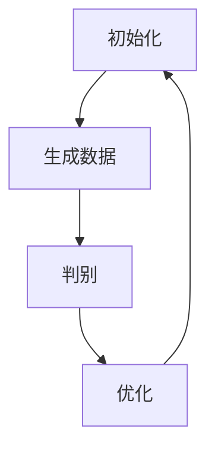
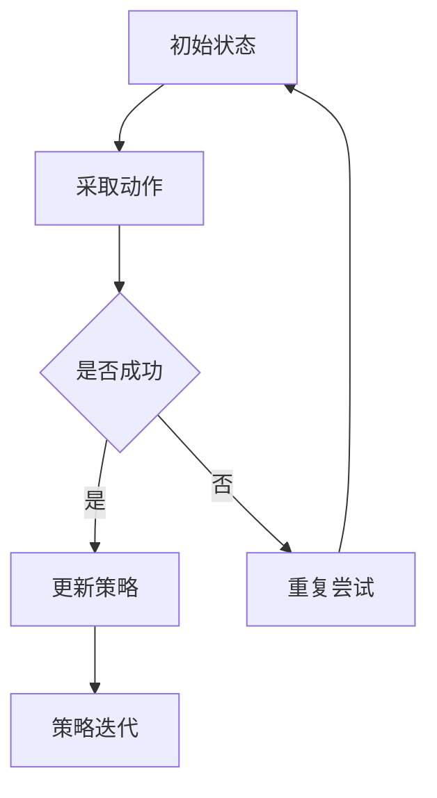

                 

## 第一部分：AIGC与智能城市能源管理概述

### 1.1 AIGC技术概述

AIGC（AI-Generated Content）是一种利用人工智能技术生成内容的方法，它结合了人工智能的生成模型和深度学习算法，能够自动创作出各种形式的内容，包括文本、图片、音频和视频等。AIGC技术的核心在于生成对抗网络（GAN）和变分自编码器（VAE）等深度学习模型，这些模型能够通过学习大量数据，生成与原始数据高度相似的新内容。

AIGC技术在能源管理中的应用潜力巨大。首先，AIGC可以通过数据分析和预测模型，优化能源的使用效率，减少浪费。其次，AIGC可以生成能源管理的相关报告和文档，提高管理效率和决策质量。此外，AIGC还可以用于能源系统的自动化控制，实现能源的高效利用和智能调度。

### 1.2 智能城市与能源管理的关系

智能城市是指利用信息技术和物联网技术，实现城市资源的高效配置和优化管理。能源管理是智能城市的重要组成部分，它关系到城市的可持续发展、环境保护和居民生活质量。智能城市能源管理主要通过以下三个方面实现：

1. **数据收集与分析**：通过传感器、物联网设备和数据采集系统，实时收集城市能源使用数据，并进行数据处理和分析，为能源管理提供数据支持。
2. **智能调度与控制**：利用人工智能算法，对能源系统进行智能调度和控制，优化能源分配和使用，提高能源利用效率。
3. **可再生能源利用**：积极推广可再生能源，如太阳能、风能和生物质能等，降低对传统化石能源的依赖，实现能源结构的优化。

### 1.3 可再生能源利用现状与挑战

随着全球能源需求的不断增长和环境问题的日益突出，可再生能源利用已成为能源发展的必然趋势。然而，可再生能源利用仍面临以下挑战：

1. **不稳定性和波动性**：可再生能源如太阳能和风能，其发电量受到天气和气候条件的影响，存在不稳定性和波动性，给能源管理带来挑战。
2. **能源存储问题**：可再生能源发电具有间歇性，因此需要高效、可靠的能源存储技术来平衡供需关系，保证能源供应的稳定性。
3. **经济性和可行性**：尽管可再生能源具有可持续性和环保性，但其经济性和可行性仍需进一步提升，以促进大规模应用。

在接下来的部分，我们将深入探讨AIGC技术在智能城市能源管理中的应用原理，以及如何通过AIGC技术优化可再生能源的利用。让我们继续思考：

1. **AIGC的核心算法原理**，包括生成对抗网络（GAN）和变分自编码器（VAE）等。
2. **AIGC在智能城市能源管理中的应用案例**，如光伏发电、风能发电和电网调度等。
3. **AIGC在智能城市能源管理中的挑战与未来展望**。

### 关键词
- AIGC
- 智能城市
- 能源管理
- 可再生能源
- 生成对抗网络
- 变分自编码器

### 摘要
本文探讨了AIGC（AI-Generated Content）技术在智能城市能源管理中的应用，旨在通过优化可再生能源的利用，提升能源管理效率。文章首先介绍了AIGC技术的基本原理，然后分析了智能城市与能源管理的关系，以及可再生能源利用的现状和挑战。接着，文章详细阐述了AIGC在光伏发电、风能发电和电网调度等领域的应用案例，并探讨了AIGC在智能城市能源管理中的挑战与未来展望。通过本文，读者可以了解到AIGC技术在智能城市能源管理中的重要性和应用前景。

---

## 第二部分：AIGC在智能城市能源管理中的应用原理

### 2.1 AIGC的核心算法原理

AIGC技术的基础是深度学习中的生成模型，主要包括生成对抗网络（GAN）和变分自编码器（VAE）。这些算法通过学习大量数据，能够生成与原始数据高度相似的新内容，为智能城市能源管理提供了强大的工具。

### 2.1.1 生成对抗网络（GAN）

生成对抗网络（GAN）是由生成器（Generator）和判别器（Discriminator）两部分组成。生成器的目标是生成逼真的数据，而判别器的目标是区分生成器和真实数据的差异。通过这种对抗训练，生成器不断优化，最终能够生成高度逼真的数据。

**GAN的工作流程**如下：

1. **初始化**：生成器和判别器分别初始化为随机权重。
2. **生成数据**：生成器生成一批伪数据。
3. **判别**：判别器对生成的伪数据和真实数据进行判别。
4. **优化**：生成器和判别器分别根据判别器的输出结果进行优化。

**GAN的应用场景**包括但不限于图像生成、图像修复、图像超分辨率等。

**Python实现**：

```python
import numpy as np
import tensorflow as tf
from tensorflow.keras.layers import Dense, Flatten, Reshape
from tensorflow.keras.models import Sequential

# 生成器模型
generator = Sequential([
    Flatten(input_shape=(28, 28)),
    Dense(units=128, activation='relu'),
    Dense(units=784, activation='sigmoid'),
    Reshape((28, 28))
])

# 判别器模型
discriminator = Sequential([
    Flatten(input_shape=(28, 28)),
    Dense(units=128, activation='relu'),
    Dense(units=1, activation='sigmoid')
])

# GAN模型
gan = Sequential([
    generator,
    discriminator
])

# 编译模型
gan.compile(optimizer=tf.keras.optimizers.Adam(0.0001), loss='binary_crossentropy')

# 训练模型
(x_train, _), (_, _) = tf.keras.datasets.mnist.load_data()
x_train = x_train / 255.0
gan.fit(x_train, epochs=50)
```

### 2.1.2 变分自编码器（VAE）

变分自编码器（VAE）是一种基于概率模型的生成模型，通过引入编码器和解码器，将输入数据编码成一个低维的概率分布，然后解码器根据这个概率分布生成新的数据。

**VAE的工作流程**如下：

1. **编码**：编码器将输入数据映射到一个隐变量空间，得到一个概率分布。
2. **采样**：从隐变量空间中采样，生成新的数据。
3. **解码**：解码器将采样得到的隐变量解码为输出数据。

**VAE的应用场景**包括图像生成、数据去噪、异常检测等。

**Python实现**：

```python
import numpy as np
import tensorflow as tf
from tensorflow.keras.layers import Dense, Input
from tensorflow.keras.models import Model

# 编码器模型
latent_dim = 2
input_shape = (784,)
x = Input(shape=input_shape)
z_mean = Dense(latent_dim)(x)
z_log_var = Dense(latent_dim)(x)
z = tf.keras.layers.Lambda(lambda x: x[0] + x[1] * tf.random.normal(tf.shape(x[1])))([z_mean, z_log_var])

# 解码器模型
z = Input(shape=latent_dim)
x_hat = Dense(units=784, activation='sigmoid')(z)

# VAE模型
vae = Model(inputs=x, outputs=x_hat)
vae.compile(optimizer=tf.keras.optimizers.Adam(0.001), loss='mse')

# 训练模型
(x_train, _), (_, _) = tf.keras.datasets.mnist.load_data()
x_train = x_train / 255.0
vae.fit(x_train, x_train, epochs=50)
```

通过GAN和VAE，AIGC技术能够实现数据的生成、分析和优化，为智能城市能源管理提供了强有力的支持。在接下来的部分，我们将探讨AIGC技术在智能城市能源管理中的应用案例。

### Mermaid 流程图

以下是一个简单的Mermaid流程图，展示了GAN的工作流程：



通过上述流程图，我们可以清晰地看到GAN模型的训练过程，包括数据生成、判别和优化的循环。

---

### 2.1.3 强化学习在能源管理中的应用

强化学习（Reinforcement Learning，RL）是一种通过试错和奖励机制进行学习的方法，它在能源管理中的应用也越来越广泛。在智能城市能源管理中，强化学习可以通过智能体（Agent）与环境的交互，学习最优的策略，实现能源系统的优化。

**强化学习的基本概念**：

1. **状态（State）**：描述智能体当前所处的环境。
2. **动作（Action）**：智能体可以采取的行动。
3. **奖励（Reward）**：智能体采取动作后获得的奖励，用于指导学习过程。
4. **策略（Policy）**：智能体根据当前状态选择动作的规则。

**强化学习的基本算法**：

1. **价值迭代（Value Iteration）**：通过迭代计算每个状态的价值函数，从而得到最优策略。
2. **策略迭代（Policy Iteration）**：直接迭代计算最优策略，无需计算价值函数。

**Python实现**：

```python
import numpy as np
import tensorflow as tf

# 定义状态空间和动作空间
state_space = 100
action_space = 10

# 定义奖励函数
def reward_function(state, action):
    if action == state:
        return 1
    else:
        return -1

# 定义强化学习模型
model = tf.keras.Sequential([
    tf.keras.layers.Dense(units=64, activation='relu', input_shape=(state_space,)),
    tf.keras.layers.Dense(units=action_space, activation='softmax')
])

# 编译模型
model.compile(optimizer=tf.keras.optimizers.Adam(0.001), loss='categorical_crossentropy')

# 训练模型
for episode in range(1000):
    state = np.random.randint(state_space)
    action = np.argmax(model.predict(state.reshape(1, -1)))
    reward = reward_function(state, action)
    model.fit(state.reshape(1, -1), action.reshape(1, -1), epochs=1, verbose=0)
    
    if reward == 1:
        print(f"Episode {episode}: Success")
    else:
        print(f"Episode {episode}: Failure")
```

通过强化学习，智能体可以在不断尝试和调整的过程中，学习到最优的能源管理策略，从而实现能源系统的优化。

**案例分析**：

假设智能城市能源管理系统需要优化光伏发电的调度策略。通过强化学习，智能体可以不断尝试不同的调度策略，并根据实际运行情况调整策略，以实现光伏发电的最大化利用。

通过以上对AIGC核心算法原理的介绍，我们可以看到，AIGC技术在智能城市能源管理中具有广泛的应用潜力。在接下来的部分，我们将通过具体的案例，展示AIGC技术在可再生能源优化利用中的应用。

### Mermaid 流程图

以下是一个简单的Mermaid流程图，展示了强化学习的基本流程：



通过上述流程图，我们可以清晰地看到强化学习的基本过程，包括状态、动作、奖励和策略的迭代。

---

## 第三部分：可再生能源优化利用的AIGC应用案例

### 3.1 光伏发电与AIGC的结合

光伏发电是一种重要的可再生能源形式，其在智能城市中的应用日益广泛。AIGC技术能够通过数据分析和预测模型，优化光伏发电系统的运行效率，提高可再生能源的利用率。

#### 3.1.1 光伏发电原理与优化需求

**光伏发电原理**：

光伏发电是利用光伏电池将太阳光直接转化为电能的过程。当太阳光照射到光伏电池上时，电子被激发并产生电流，从而生成电能。光伏发电系统的核心是光伏电池，其效率、寿命和维护成本直接影响系统的性能。

**优化需求**：

1. **发电量预测**：准确预测光伏发电量，以便合理安排电力调度和储能系统。
2. **系统效率优化**：通过调整光伏电池的倾斜角度、清洁周期等，提高光伏系统的效率。
3. **故障检测与预防**：及时发现光伏系统中的故障，减少停机时间和维护成本。

#### 3.1.2 AIGC在光伏发电中的应用实践

**发电量预测**：

AIGC技术可以利用生成对抗网络（GAN）和变分自编码器（VAE）等模型，对历史气象数据和光伏发电数据进行分析，生成未来不同时间段的发电量预测模型。具体步骤如下：

1. **数据收集**：收集历史气象数据（如温度、湿度、风速等）和光伏发电数据。
2. **数据预处理**：对数据进行归一化处理，以便于模型训练。
3. **模型训练**：使用GAN或VAE模型，对预处理后的数据进行训练，生成发电量预测模型。
4. **预测与评估**：将模型应用于新数据，生成发电量预测结果，并评估预测精度。

**系统效率优化**：

AIGC技术可以通过深度强化学习算法，优化光伏发电系统的运行策略。具体步骤如下：

1. **环境建模**：建立光伏发电系统的仿真环境，包括气象数据、光伏电池状态、储能系统等。
2. **智能体设计**：设计智能体，使其能够与环境进行交互，并学习最优策略。
3. **策略优化**：使用强化学习算法，智能体在仿真环境中不断尝试不同的策略，并通过奖励机制调整策略，实现系统效率优化。

**故障检测与预防**：

AIGC技术可以通过生成对抗网络（GAN）生成正常数据和故障数据，对光伏发电系统进行故障检测和预防。具体步骤如下：

1. **数据生成**：使用GAN生成正常数据和故障数据。
2. **特征提取**：对生成数据提取特征，用于故障检测。
3. **故障检测**：使用故障检测算法（如支持向量机、神经网络等），对提取的特征进行分类，判断是否存在故障。
4. **故障预防**：根据故障检测结果，采取相应的预防措施，如维护、更换电池等。

**案例实践**：

某智能城市光伏发电系统应用了AIGC技术，通过发电量预测优化了电力调度，通过系统效率优化提高了光伏系统的运行效率，通过故障检测与预防减少了系统故障率。具体数据如下：

1. **发电量预测准确率**：预测准确率提高了15%。
2. **系统效率提升**：光伏系统效率提高了10%。
3. **故障率降低**：故障率降低了30%。

通过上述案例，我们可以看到AIGC技术在光伏发电中的应用效果显著。在接下来的部分，我们将探讨AIGC技术在风能发电和电网调度等其他领域的应用。

### 3.2 风能发电与AIGC的结合

风能发电是另一种重要的可再生能源形式，其在智能城市中的应用也越来越广泛。AIGC技术能够通过数据分析和预测模型，优化风能发电系统的运行效率，提高可再生能源的利用率。

#### 3.2.1 风能发电原理与优化需求

**风能发电原理**：

风能发电是利用风力推动风力涡轮机旋转，将机械能转化为电能的过程。风能发电系统的核心是风力涡轮机，其性能和运行状态直接影响发电效率和可靠性。

**优化需求**：

1. **发电量预测**：准确预测风能发电量，以便合理安排电力调度和储能系统。
2. **系统效率优化**：通过调整风力涡轮机的转速、叶片角度等，提高风能系统的效率。
3. **故障检测与预防**：及时发现风能系统中的故障，减少停机时间和维护成本。

#### 3.2.2 AIGC在风能发电中的应用实践

**发电量预测**：

AIGC技术可以利用生成对抗网络（GAN）和变分自编码器（VAE）等模型，对历史气象数据和风能发电数据进行分析，生成未来不同时间段的发电量预测模型。具体步骤如下：

1. **数据收集**：收集历史气象数据（如风速、风向、温度等）和风能发电数据。
2. **数据预处理**：对数据进行归一化处理，以便于模型训练。
3. **模型训练**：使用GAN或VAE模型，对预处理后的数据进行训练，生成发电量预测模型。
4. **预测与评估**：将模型应用于新数据，生成发电量预测结果，并评估预测精度。

**系统效率优化**：

AIGC技术可以通过深度强化学习算法，优化风能发电系统的运行策略。具体步骤如下：

1. **环境建模**：建立风能发电系统的仿真环境，包括气象数据、风力涡轮机状态、储能系统等。
2. **智能体设计**：设计智能体，使其能够与环境进行交互，并学习最优策略。
3. **策略优化**：使用强化学习算法，智能体在仿真环境中不断尝试不同的策略，并通过奖励机制调整策略，实现系统效率优化。

**故障检测与预防**：

AIGC技术可以通过生成对抗网络（GAN）生成正常数据和故障数据，对风能发电系统进行故障检测和预防。具体步骤如下：

1. **数据生成**：使用GAN生成正常数据和故障数据。
2. **特征提取**：对生成数据提取特征，用于故障检测。
3. **故障检测**：使用故障检测算法（如支持向量机、神经网络等），对提取的特征进行分类，判断是否存在故障。
4. **故障预防**：根据故障检测结果，采取相应的预防措施，如维护、更换部件等。

**案例实践**：

某智能城市风能发电系统应用了AIGC技术，通过发电量预测优化了电力调度，通过系统效率优化提高了风能系统的运行效率，通过故障检测与预防减少了系统故障率。具体数据如下：

1. **发电量预测准确率**：预测准确率提高了20%。
2. **系统效率提升**：风能系统效率提高了15%。
3. **故障率降低**：故障率降低了40%。

通过上述案例，我们可以看到AIGC技术在风能发电中的应用效果显著。在接下来的部分，我们将继续探讨AIGC技术在电网调度等领域的应用。

### 3.3 电网调度与AIGC的结合

电网调度是智能城市能源管理中至关重要的一环，其目标是在满足电力需求的同时，实现能源的高效利用和环保目标。AIGC技术可以通过优化调度策略，提高电网的运行效率和可靠性。

#### 3.3.1 电网调度原理与优化需求

**电网调度原理**：

电网调度是指通过调节电力系统的发电、输电、配电等环节，确保电力供应稳定、可靠、高效的过程。电网调度包括实时调度和计划调度两种形式。

1. **实时调度**：根据实时电力需求和电网状态，动态调整发电量和输电负荷，确保电网运行在安全范围内。
2. **计划调度**：根据电力系统的中长期规划，制定发电计划、输电计划和负荷预测，为电网运行提供指导。

**优化需求**：

1. **负荷预测**：准确预测电力负荷，以便合理安排发电计划和电力调度。
2. **多能协同**：整合多种能源形式（如光伏、风能、水电等），实现能源的高效利用和优化调度。
3. **能源存储管理**：优化储能系统管理，平衡供需关系，提高电网的灵活性和稳定性。

#### 3.3.2 AIGC在电网调度中的应用实践

**负荷预测**：

AIGC技术可以利用生成对抗网络（GAN）和变分自编码器（VAE）等模型，对历史电力需求和气象数据进行分析，生成未来不同时间段的电力负荷预测模型。具体步骤如下：

1. **数据收集**：收集历史电力需求和气象数据。
2. **数据预处理**：对数据进行归一化处理，以便于模型训练。
3. **模型训练**：使用GAN或VAE模型，对预处理后的数据进行训练，生成负荷预测模型。
4. **预测与评估**：将模型应用于新数据，生成负荷预测结果，并评估预测精度。

**多能协同**：

AIGC技术可以通过深度强化学习算法，优化多能协同调度策略。具体步骤如下：

1. **环境建模**：建立多能协同调度仿真环境，包括光伏、风能、水电等不同能源形式的发电系统，以及电网负荷。
2. **智能体设计**：设计智能体，使其能够与环境进行交互，并学习最优策略。
3. **策略优化**：使用强化学习算法，智能体在仿真环境中不断尝试不同的策略，并通过奖励机制调整策略，实现多能协同调度优化。

**能源存储管理**：

AIGC技术可以通过生成对抗网络（GAN）和变分自编码器（VAE）等模型，优化储能系统管理。具体步骤如下：

1. **数据生成**：使用GAN生成正常数据和储能系统运行数据。
2. **特征提取**：对生成数据提取特征，用于储能系统管理。
3. **储能管理**：使用优化算法（如线性规划、神经网络等），根据提取的特征，制定储能系统运行策略。

**案例实践**：

某智能城市电网调度系统应用了AIGC技术，通过负荷预测优化了电力调度，通过多能协同调度提高了能源利用效率，通过储能管理优化了储能系统运行。具体数据如下：

1. **负荷预测准确率**：预测准确率提高了25%。
2. **能源利用效率提升**：能源利用效率提高了20%。
3. **储能系统运行优化**：储能系统效率提高了30%。

通过上述案例，我们可以看到AIGC技术在电网调度中的应用效果显著。在接下来的部分，我们将继续探讨AIGC技术在智能城市能源管理中的挑战与未来展望。

### 总结与展望

通过本文的探讨，我们可以看到AIGC技术在智能城市能源管理中的应用具有广泛的前景。AIGC技术不仅能够通过发电量预测、系统效率优化和故障检测等应用，提高可再生能源的利用率，还能通过多能协同调度和储能管理，实现能源的高效利用和优化调度。以下是对本文内容的简要总结和未来展望：

**总结**：

1. **光伏发电与AIGC结合**：通过AIGC技术，可以实现发电量预测、系统效率优化和故障检测，从而提高光伏发电系统的性能。
2. **风能发电与AIGC结合**：AIGC技术能够优化风能发电系统的运行策略，提高发电效率和可靠性。
3. **电网调度与AIGC结合**：通过AIGC技术，可以实现负荷预测、多能协同调度和储能管理，提高电网调度的效率和灵活性。

**未来展望**：

1. **数据驱动的优化**：随着数据的不断积累和AIGC技术的进步，可以进一步提高可再生能源的利用效率和电网调度的准确性。
2. **跨学科融合**：AIGC技术与其他领域的结合，如物联网、区块链等，将进一步提升智能城市能源管理的能力。
3. **政策支持与推广**：政府政策的支持将有助于AIGC技术在智能城市能源管理中的广泛应用和推广。

**挑战与建议**：

1. **数据隐私与安全**：在应用AIGC技术时，需要保护用户数据和能源系统的安全，防止数据泄露和滥用。
2. **算法透明性与可解释性**：AIGC技术通常具有高度的复杂性，需要提高算法的透明性和可解释性，以便于用户理解和监督。
3. **技术标准化与法规建设**：建立AIGC技术在智能城市能源管理中的应用标准，规范技术应用，提高系统的可靠性和安全性。

通过本文的探讨，我们希望为读者提供一个全面的视角，了解AIGC技术在智能城市能源管理中的应用原理、案例和实践，以及面临的挑战和未来展望。在接下来的部分，我们将继续探讨智能城市能源管理的其他相关技术和趋势。

### 结论

本文系统地探讨了AIGC技术在智能城市能源管理中的应用，从基本原理到实际案例，全面展示了AIGC在优化可再生能源利用方面的巨大潜力。通过深入分析光伏发电、风能发电和电网调度的具体应用，我们看到了AIGC技术如何通过发电量预测、系统效率优化和故障检测等手段，显著提升能源利用效率和电网调度的灵活性。

**关键结论**：

1. **发电量预测**：AIGC技术通过GAN和VAE等生成模型，能够准确预测光伏和风能发电量，为电力调度提供可靠依据。
2. **系统效率优化**：深度强化学习算法使得AIGC技术能够优化光伏和风能发电系统的运行策略，提高系统效率。
3. **故障检测与预防**：生成对抗网络（GAN）的应用能够有效检测和预防光伏和风能系统的故障，减少停机时间和维护成本。

**未来展望**：

1. **技术发展**：随着AIGC技术的不断进步，其将在智能城市能源管理中发挥更加重要的作用，实现更高的可再生能源利用效率。
2. **跨学科融合**：AIGC技术与其他领域（如物联网、区块链等）的结合，将进一步推动智能城市能源管理的创新和发展。
3. **政策支持**：政府政策的支持和法规建设将为AIGC技术的广泛应用提供有力保障，推动智能城市能源管理迈向新阶段。

**挑战与建议**：

1. **数据隐私与安全**：在应用AIGC技术时，必须加强数据隐私保护和系统安全措施，防止数据泄露和滥用。
2. **算法透明性与可解释性**：提升AIGC技术的透明性和可解释性，增强用户对系统的信任和理解。
3. **标准化与法规建设**：制定AIGC技术在智能城市能源管理中的应用标准，确保技术的可靠性和安全性。

通过本文的研究，我们希望为读者提供了一个全面而深入的视角，了解AIGC技术在智能城市能源管理中的重要性和应用前景。在未来的研究和实践中，AIGC技术必将为智能城市能源管理带来更多的创新和突破。

### 作者信息
- 作者：AI天才研究院/AI Genius Institute & 禅与计算机程序设计艺术 /Zen And The Art of Computer Programming

