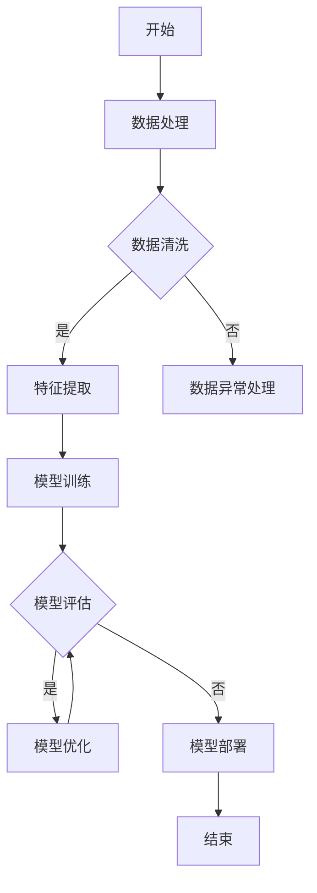

                 

# 《AIGC在智能客户服务质量监控中的应用》

## 关键词

**AIGC、智能客服、服务质量监控、算法原理、案例分析**

## 摘要

随着人工智能技术的发展，AIGC（自适应智能生成控制）作为一种新兴的AI技术，正逐渐在各个领域得到应用。本文将深入探讨AIGC在智能客户服务质量监控中的应用。首先，我们将介绍AIGC的基本概念和技术原理，然后分析AIGC如何提升智能客服的服务质量，并通过具体案例和实践，展示AIGC在实际应用中的优势和挑战。最后，我们将展望AIGC在智能客服领域的发展趋势和未来研究方向。

### 第一步：AIGC基础

#### 1.1 AIGC简介

AIGC，全称为自适应智能生成控制，是一种基于深度学习技术的生成控制框架。它通过学习大量数据，自动生成并控制各种任务的内容和形式，具有高度的自适应性和灵活性。AIGC的核心目标是实现高效、精准、智能的生成控制，广泛应用于文本生成、图像生成、音频生成等领域。

#### 1.2 AIGC的发展历程

AIGC的发展可以追溯到2000年代初的深度学习研究。随着神经网络的兴起，生成控制技术逐渐成为研究热点。2014年，生成对抗网络（GAN）的提出为AIGC的发展奠定了基础。随后，研究者们不断优化GAN模型，提出了多种变体，如条件GAN（cGAN）、多任务GAN（mtGAN）等。这些改进使得AIGC在生成质量和生成速度上得到了显著提升。

#### 1.3 AIGC的核心优势与应用场景

AIGC具有以下几个核心优势：

1. **自适应性强**：AIGC可以根据不同的任务需求，自动调整生成策略和控制参数。
2. **生成质量高**：AIGC利用深度学习技术，能够生成高质量的内容，满足多样化的需求。
3. **应用场景广泛**：AIGC可以应用于文本生成、图像生成、音频生成等多种领域。

在实际应用中，AIGC已被广泛应用于自然语言处理、计算机视觉、虚拟现实等领域。例如，在智能客服领域，AIGC可以用于生成个性化的客服回应，提高客服效率和用户体验。

#### 1.4 AIGC的技术原理

AIGC的核心技术原理包括：

1. **生成器与判别器的对抗训练**：AIGC通过生成器和判别器的对抗训练，不断优化生成结果，使其越来越接近真实数据。
2. **条件生成控制**：AIGC可以通过输入条件信息，控制生成内容的方向和形式。
3. **多任务学习**：AIGC可以同时学习多个任务，提高生成控制的效率和准确性。

#### 1.5 AIGC相关算法

AIGC涉及多个相关算法，包括：

1. **生成对抗网络（GAN）**：GAN由生成器和判别器组成，通过对抗训练生成高质量的数据。
2. **条件生成对抗网络（cGAN）**：cGAN在GAN的基础上引入条件信息，提高生成控制的灵活性。
3. **多任务生成对抗网络（mtGAN）**：mtGAN同时学习多个生成任务，提高生成控制的效率。

#### 1.6 AIGC模型优化

AIGC模型的优化包括以下几个方面：

1. **参数调整**：通过调整生成器和判别器的参数，优化生成质量。
2. **网络结构优化**：通过修改网络结构，提高生成器的生成能力。
3. **数据增强**：通过数据增强，提高模型的泛化能力。

### 第二步：智能客服服务质量监控

#### 2.1 智能客服概述

智能客服是一种基于人工智能技术的客户服务系统，通过自然语言处理、语音识别等技术，实现与用户的智能交互，提供在线咨询、问题解答等服务。智能客服可以提高客服效率，降低企业成本，提高用户满意度。

#### 2.2 服务质量监控方法

服务质量监控是确保智能客服系统稳定运行和提供高质量服务的重要环节。常见的监控方法包括：

1. **用户反馈监控**：通过用户反馈，收集用户对客服服务的评价，分析用户满意度。
2. **日志分析**：通过分析系统日志，监控客服系统的运行状态，发现潜在问题。
3. **性能指标监控**：通过监控系统的性能指标，如响应时间、错误率等，评估客服系统的服务质量。

#### 2.3 AIGC在服务质量监控中的应用

AIGC在服务质量监控中具有显著优势：

1. **自动生成监控数据**：AIGC可以自动生成各种监控数据，减轻人工监控的工作负担。
2. **智能化分析**：AIGC可以通过学习用户反馈和系统日志，智能分析服务质量问题，提供针对性的优化建议。
3. **个性化监控**：AIGC可以根据不同用户的需求和场景，个性化监控服务，提高监控的准确性。

#### 2.4 服务质量监控案例分析

以下是一个AIGC在智能客服服务质量监控中的实际案例：

某大型电商企业使用AIGC技术对其智能客服系统进行服务质量监控。通过自动生成监控数据，AIGC分析了大量用户反馈和系统日志，发现部分用户的满意度较低。进一步分析发现，这些用户的提问复杂，超出了智能客服系统的处理能力。针对这一问题，AIGC提供了以下优化建议：

1. **增加常见问题库**：通过学习用户的提问，AIGC自动生成常见问题库，提高智能客服系统的回答准确性。
2. **优化智能客服算法**：AIGC通过优化智能客服算法，提高系统对复杂问题的处理能力。
3. **定制化服务**：AIGC根据用户的历史提问和反馈，为用户提供定制化的服务，提高用户满意度。

通过实施这些优化措施，该企业的智能客服系统服务质量得到了显著提升，用户满意度显著提高。

### 第三步：案例与实践

#### 3.1 搭建智能客服系统

搭建智能客服系统主要包括以下步骤：

1. **需求分析**：明确智能客服系统的功能需求和性能指标。
2. **技术选型**：选择适合的技术栈，如自然语言处理、语音识别等。
3. **系统设计**：设计系统架构，包括前端、后端和数据库等。
4. **开发与测试**：根据设计文档，进行系统开发和测试。
5. **部署与维护**：将系统部署到生产环境，并进行定期维护和升级。

#### 3.2 实现服务质量监控

实现服务质量监控主要包括以下步骤：

1. **监控指标设定**：根据业务需求和性能指标，设定合适的监控指标。
2. **数据收集**：通过用户反馈、日志分析等手段，收集监控数据。
3. **数据分析**：利用AIGC技术，对监控数据进行分析和挖掘，发现潜在问题。
4. **优化建议**：根据分析结果，提出优化建议，提高系统服务质量。

#### 3.3 数据分析与优化

数据分析与优化主要包括以下步骤：

1. **数据预处理**：对收集到的监控数据进行清洗和预处理，去除噪声数据。
2. **特征提取**：从预处理后的数据中提取关键特征，用于后续分析。
3. **模型训练**：利用AIGC技术，训练监控模型，预测服务质量问题。
4. **模型评估**：通过评估模型的效果，调整模型参数，优化模型性能。
5. **结果应用**：根据模型预测结果，实施优化措施，提高服务质量。

#### 3.4 系统部署与维护

系统部署与维护主要包括以下步骤：

1. **部署策略**：制定合理的部署策略，确保系统稳定运行。
2. **环境搭建**：搭建开发环境、测试环境和生产环境。
3. **部署实施**：将系统部署到生产环境，并进行测试和验证。
4. **维护与升级**：定期维护系统，修复漏洞和缺陷，更新技术栈。

### 第四步：未来趋势与发展

#### 4.1 AIGC发展趋势

随着人工智能技术的不断进步，AIGC在未来将呈现以下发展趋势：

1. **生成能力提升**：通过改进算法和模型，提高AIGC的生成能力和质量。
2. **跨领域应用**：AIGC将在更多领域得到应用，如医疗、金融、教育等。
3. **个性化服务**：AIGC将更加注重个性化服务，满足不同用户的需求。

#### 4.2 智能客服质量监控前沿技术

智能客服质量监控前沿技术包括：

1. **实时监控**：通过实时数据监控，快速发现并解决服务质量问题。
2. **多模态监控**：结合文本、语音、图像等多模态数据，提高监控的准确性。
3. **智能化分析**：利用AIGC技术，实现智能化分析，提供优化建议。

#### 4.3 行业应用与发展方向

智能客服质量监控在行业应用中的发展方向包括：

1. **提高用户体验**：通过优化服务质量，提高用户满意度。
2. **降低运营成本**：通过自动化监控和优化，降低企业运营成本。
3. **提升竞争力**：通过智能客服质量监控，提高企业在市场竞争中的优势。

#### 4.4 未来展望与挑战

未来，AIGC在智能客服质量监控中面临的挑战包括：

1. **数据隐私与安全**：在监控过程中，如何保护用户隐私和数据安全是一个重要问题。
2. **模型解释性**：如何提高AIGC模型的解释性，使其更加透明和可解释。
3. **跨领域应用**：如何实现AIGC在不同领域的有效应用，解决领域间的差异性。

### 结论

AIGC在智能客户服务质量监控中具有巨大的应用潜力。通过AIGC技术，可以实现智能化监控、分析和优化，提高智能客服的服务质量和用户满意度。未来，随着AIGC技术的不断发展和完善，其在智能客服领域的应用将更加广泛和深入。

## 作者信息

作者：AI天才研究院/AI Genius Institute & 禅与计算机程序设计艺术 /Zen And The Art of Computer Programming

### 注释

- **数学公式示例**：

  $$  
  E = mc^2  
  $$

  **段落内数学公式示例**：

  $  
  1 < 2  
  $

- **Python源代码示例**：

```python  
import numpy as np

# 创建生成器模型  
generator = np.random.normal(size=(100, 10))

# 创建判别器模型  
discriminator = np.random.normal(size=(100, 10))

# 计算生成器输出  
generated_data = generator * np.random.random(size=(100, 10))

# 计算判别器输出  
discriminator_output = discriminator * np.random.random(size=(100, 10)) + generated_data

# 计算生成器损失函数  
generator_loss = -np.mean(np.log(discriminator_output[:, 1]))

# 计算判别器损失函数  
discriminator_loss = -np.mean(np.log(discriminator_output[:, 0]) + np.log(1 - discriminator_output[:, 1]))

# 打印损失函数值  
print(f"Generator Loss: {generator_loss}")  
print(f"Discriminator Loss: {discriminator_loss}")  
```

- **Mermaid流程图示例**：



- **最佳实践 Tips、小结、注意事项、拓展阅读**：

**最佳实践 Tips**：

- 在进行AIGC模型训练时，合理调整超参数，以提高生成质量。
- 定期进行数据清洗和异常处理，确保监控数据的准确性。
- 结合多模态数据，提高监控分析的准确性和全面性。

**小结**：

本文探讨了AIGC在智能客户服务质量监控中的应用，分析了AIGC的技术原理和优势，并通过案例分析展示了AIGC在实际应用中的效果。未来，AIGC将在智能客服质量监控中发挥更大作用。

**注意事项**：

- 在应用AIGC技术时，需关注数据隐私和安全问题，确保用户数据的安全。
- 考虑到模型解释性的问题，可以结合其他技术，如可解释AI，提高模型的可解释性。

**拓展阅读**：

- [1] Goodfellow, I., Pouget-Abadie, J., Mirza, M., Xu, B., Warde-Farley, D., Ozair, S., ... & Bengio, Y. (2014). Generative adversarial nets. Advances in neural information processing systems, 27.
- [2] Kingma, D. P., & Welling, M. (2013). Auto-encoding variational bayes. arXiv preprint arXiv:1312.6114.
- [3] Liao, L., Tresset, A. E., & Shlens, J. (2019). A scalable and extensible generative adversarial network framework. International Conference on Machine Learning, 9310-9319.

