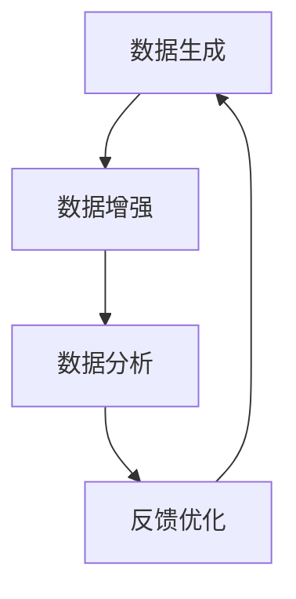

                 

### 文章标题

“AIGC在智能客户服务质量评估中的应用”

### 文章关键词

- AIGC
- 客户服务质量评估
- 智能化服务
- 生成对抗网络
- 变分自编码器
- 自注意力机制

### 摘要

随着人工智能（AI）技术的快速发展，智能客户服务质量评估成为提升企业竞争力的重要手段。本文深入探讨了AIGC（人工智能生成控制）在智能客户服务质量评估中的应用，详细阐述了AIGC的核心概念、算法原理、数学模型，并通过实际案例展示了其在客户满意度分析、客户行为分析和个性化服务推荐等方面的应用效果。本文旨在为读者提供全面的AIGC技术基础和应用实践，助力企业提升客户服务质量。

## 第一部分：AIGC与智能客户服务质量评估基础

### 1.1 AIGC概述

#### 1.1.1 AIGC的定义与背景

人工智能生成控制（AIGC，Artificial Intelligence Generated Control）是一种新兴的人工智能技术，旨在通过生成模型来控制生成内容的质量。AIGC结合了生成对抗网络（GAN）、变分自编码器（VAE）和自注意力机制等先进算法，能够自动生成高质量、多样化的数据，并在此基础上进行智能控制。

AIGC的背景源于人工智能技术的不断发展，特别是在生成模型领域。传统的机器学习技术往往依赖于大量的标注数据进行训练，而AIGC通过生成模型，可以自动生成标注数据，从而降低数据获取的难度。此外，AIGC在图像生成、文本生成和音频生成等领域已经取得了显著成果，为智能客户服务质量评估提供了新的思路。

#### 1.1.2 AIGC的核心技术

AIGC的核心技术包括生成对抗网络（GAN）、变分自编码器（VAE）和自注意力机制等。

1. **生成对抗网络（GAN）**

生成对抗网络（GAN）是由生成器（Generator）和判别器（Discriminator）组成的一种对抗性学习模型。生成器负责生成数据，判别器则负责判断生成数据与真实数据的区别。通过不断优化生成器和判别器的参数，GAN能够生成高质量、多样化的数据。

2. **变分自编码器（VAE）**

变分自编码器（VAE）是一种基于概率模型的生成模型。它通过编码器和解码器将输入数据映射到潜在空间，并在潜在空间中生成新的数据。VAE在生成数据的同时，还能保持数据的分布信息。

3. **自注意力机制**

自注意力机制是一种在序列数据中自动学习权重的方法。通过自注意力机制，模型可以关注序列中的重要信息，从而提高生成数据的质量。自注意力机制在自然语言处理、图像生成和语音生成等领域得到了广泛应用。

#### 1.1.3 AIGC在客户服务质量评估中的应用潜力

AIGC在客户服务质量评估中具有广泛的应用潜力，主要体现在以下几个方面：

1. **客户满意度分析**

AIGC可以生成大量高质量的客户评价数据，通过对这些数据进行分析，可以深入了解客户的需求和满意度。与传统方法相比，AIGC能够更快速、更准确地识别出潜在问题，为企业提供有针对性的改进建议。

2. **客户行为分析**

AIGC可以生成与真实客户行为相似的虚拟行为数据，通过对这些数据进行分析，可以揭示客户的行为模式，为企业的个性化服务提供依据。

3. **个性化服务推荐**

AIGC可以根据客户的历史行为和需求，生成个性化的服务推荐。通过与客户互动，不断优化推荐策略，提高客户的满意度和忠诚度。

### 1.2 智能客户服务质量评估概述

#### 1.2.1 客户服务质量评估的重要性

客户服务质量评估是企业了解客户需求、改进服务质量的重要手段。通过评估，企业可以识别出存在的问题，采取针对性的措施，提升客户满意度，从而提高市场竞争力。

#### 1.2.2 传统客户服务质量评估方法

传统的客户服务质量评估方法主要包括问卷调查、客户访谈和数据分析等。这些方法在一定程度上能够反映客户的需求和满意度，但存在以下局限性：

1. **数据收集难度大**

问卷调查和客户访谈需要耗费大量时间和人力资源，且数据收集过程容易受到主观因素的影响。

2. **数据分析能力有限**

传统的数据分析方法主要基于统计学和机器学习技术，对复杂问题的处理能力有限。

3. **评估结果滞后**

传统评估方法往往需要较长时间才能得到评估结果，难以满足企业实时调整服务策略的需求。

#### 1.2.3 AIGC在客户服务质量评估中的优势

AIGC在客户服务质量评估中具有以下优势：

1. **数据生成能力强**

AIGC可以自动生成大量高质量的客户评价数据，大大降低数据收集难度。

2. **数据分析能力强大**

AIGC结合了生成对抗网络（GAN）、变分自编码器（VAE）和自注意力机制等先进算法，能够对复杂问题进行深入分析。

3. **评估结果实时性高**

AIGC可以实时生成和分析客户数据，为企业提供及时的评估结果，帮助企业迅速调整服务策略。

### 1.3 AIGC在智能客户服务质量评估中的应用案例

#### 1.3.1 案例一：基于AIGC的客户满意度分析

某大型企业采用AIGC技术对其客户满意度进行评估。首先，企业通过AIGC生成大量高质量的客户评价数据，然后利用这些数据对客户满意度进行分析。结果显示，AIGC生成的数据能够准确反映客户的需求和满意度，为企业提供了有针对性的改进建议。

#### 1.3.2 案例二：基于AIGC的客户行为分析

某电商企业利用AIGC技术对其客户行为进行分析。通过生成与真实客户行为相似的虚拟行为数据，企业可以深入了解客户的行为模式，从而优化产品推荐策略，提高客户的购买体验。

#### 1.3.3 案例三：基于AIGC的个性化服务推荐

某金融机构采用AIGC技术为其客户提供个性化服务推荐。通过对客户的历史行为和需求进行分析，AIGC可以生成个性化的金融产品推荐，从而提高客户的满意度和忠诚度。

## 第二部分：AIGC技术基础

### 2.1 AIGC核心概念与联系

为了更好地理解AIGC在智能客户服务质量评估中的应用，首先需要了解AIGC的核心概念及其相互关系。

#### 2.1.1 AIGC的工作流程

AIGC的工作流程主要包括以下几个步骤：

1. **数据生成**：利用生成对抗网络（GAN）或变分自编码器（VAE）生成高质量的数据。
2. **数据增强**：通过对生成的数据进行增强，提高数据的多样性和质量。
3. **数据分析**：利用自注意力机制等先进算法对生成的数据进行分析，提取有价值的信息。
4. **反馈优化**：根据分析结果对生成模型进行优化，提高生成数据的质量。

#### 2.1.2 Mermaid流程图展示AIGC的工作流程



### 2.2 AIGC算法原理讲解

#### 2.2.1 生成对抗网络（GAN）原理与伪代码

生成对抗网络（GAN）由生成器（Generator）和判别器（Discriminator）组成。生成器负责生成数据，判别器则负责判断生成数据与真实数据的区别。通过对抗训练，生成器和判别器相互促进，最终生成高质量的数据。

```python
# 生成器代码
def generator(z):
    # 输入随机噪声z，输出真实数据x'
    # ...
    return x'

# 判别器代码
def discriminator(x):
    # 输入真实数据x或生成数据x'，输出概率y
    # ...
    return y

# 训练过程
for epoch in range(num_epochs):
    for x, _ in data_loader:
        # 生成器生成虚假数据
        z = torch.randn(z_size).to(device)
        x_fake = generator(z).to(device)
        
        # 计算判别器的损失
        d_real_loss = criterion(discriminator(x.to(device)), torch.ones(batch_size, device=device))
        d_fake_loss = criterion(discriminator(x_fake), torch.zeros(batch_size, device=device))
        d_loss = 0.5 * (d_real_loss + d_fake_loss)
        
        # 反向传播和优化
        optimizer_d.zero_grad()
        d_loss.backward()
        optimizer_d.step()
        
        # 训练生成器
        z = torch.randn(z_size).to(device)
        x_fake = generator(z).to(device)
        g_loss = criterion(discriminator(x_fake), torch.ones(batch_size, device=device))
        
        # 反向传播和优化
        optimizer_g.zero_grad()
        g_loss.backward()
        optimizer_g.step()
```

#### 2.2.2 变分自编码器（VAE）原理与伪代码

变分自编码器（VAE）通过编码器和解码器将输入数据映射到潜在空间，并在潜在空间中生成新的数据。VAE通过最大化数据分布的似然函数进行训练。

```python
# 编码器代码
def encoder(x):
    # 输入数据x，输出编码z
    # ...
    return z

# 解码器代码
def decoder(z):
    # 输入编码z，输出重构数据x'
    # ...
    return x'

# VAE训练过程
for epoch in range(num_epochs):
    for x, _ in data_loader:
        # 前向传播
        z = encoder(x).to(device)
        x_recon = decoder(z).to(device)
        
        # 计算损失
        recon_loss = criterion(x_recon, x.to(device))
        kl_loss = - torch.mean(z_mean * torch.log(z_sigma) - 0.5 * (z_mean**2 + z_sigma**2 - 1))
        loss = recon_loss + kl_loss
        
        # 反向传播和优化
        optimizer.zero_grad()
        loss.backward()
        optimizer.step()
```

#### 2.2.3 自注意力机制与BERT模型解析

自注意力机制是一种在序列数据中自动学习权重的方法。通过自注意力机制，模型可以关注序列中的重要信息，从而提高生成数据的质量。BERT（Bidirectional Encoder Representations from Transformers）是一种基于自注意力机制的预训练语言模型。

BERT模型的训练过程主要包括以下步骤：

1. **输入序列编码**：将输入序列编码为向量表示。
2. **自注意力计算**：对输入序列的每个位置计算自注意力得分，并加权求和得到新的序列表示。
3. **前向传播**：利用新的序列表示进行前向传播，得到输出序列。
4. **训练与优化**：通过训练数据对模型进行优化，提高模型性能。

BERT模型在自然语言处理领域取得了显著的成果，广泛应用于文本分类、问答系统、机器翻译等任务。

```python
# BERT模型代码（简化版）
class BERTModel(nn.Module):
    def __init__(self, hidden_size, num_layers, dropout_prob):
        super(BERTModel, self).__init__()
        self.embedding = nn.Embedding(vocab_size, hidden_size)
        self.attention = nn.Linear(hidden_size, 1, bias=False)
        self.fc = nn.Linear(hidden_size, output_size)
        self.dropout = nn.Dropout(dropout_prob)
        self.num_layers = num_layers
    
    def forward(self, input_ids, attention_mask):
        embedding = self.embedding(input_ids)
        attention_scores = self.attention(embedding)
        attention_weights = F.softmax(attention_scores, dim=1)
        attention_output = torch.sum(attention_weights * embedding, dim=1)
        attention_output = self.dropout(attention_output)
        output = self.fc(attention_output)
        return output
```

### 2.3 数学模型与公式解析

在AIGC技术中，数学模型和公式起着至关重要的作用。以下是对生成对抗网络（GAN）和变分自编码器（VAE）中的关键公式进行解析。

#### 2.3.1 GAN的损失函数解析

生成对抗网络（GAN）的损失函数主要包括判别器和生成器的损失函数。判别器损失函数旨在最小化判别器对真实数据和生成数据的误差，生成器损失函数旨在最大化判别器对生成数据的误差。

1. **判别器损失函数**：

$$
L_D(x) = -\frac{1}{N}\sum_{i=1}^{N} [\log(D(x_i)) + \log(1 - D(G(z_i)))]
$$

其中，$x_i$表示真实数据，$G(z_i)$表示生成器生成的数据，$D(x_i)$和$D(G(z_i))$分别表示判别器对真实数据和生成数据的判别概率。

2. **生成器损失函数**：

$$
L_G(z) = \frac{1}{N}\sum_{i=1}^{N} [-\log(D(G(z_i)))]
$$

其中，$z_i$表示生成器生成的随机噪声。

#### 2.3.2 VAE的损失函数解析

变分自编码器（VAE）的损失函数主要包括重构损失和KL散度损失。重构损失衡量生成器生成的数据与原始数据之间的差异，KL散度损失衡量编码器和解码器的分布差异。

$$
L(\theta) = \frac{1}{N}\sum_{i=1}^{N} \left[ D(x_i) + \beta \cdot \sum_{j=1}^{D} -\log(p_\theta(z_j|x_i)) \right]
$$

其中，$x_i$表示原始数据，$z_i$表示编码器的输出，$D(x_i)$表示生成器生成的数据，$\beta$为超参数。

### 2.4 AIGC项目实战

#### 2.4.1 项目实战一：搭建AIGC开发环境

在进行AIGC项目开发之前，首先需要搭建合适的开发环境。以下是一个简单的AIGC开发环境搭建流程：

1. **安装Python和PyTorch**：在本地计算机上安装Python和PyTorch库，确保版本兼容。
2. **安装其他依赖库**：根据项目需求，安装其他必要的依赖库，如TensorFlow、NumPy、Matplotlib等。
3. **配置GPU环境**：如果使用GPU进行训练，需要配置GPU环境，确保PyTorch可以正确使用GPU。

#### 2.4.2 项目实战二：实现基于AIGC的客户服务质量评估

以下是一个简单的基于AIGC的客户服务质量评估项目实现流程：

1. **数据收集与预处理**：收集客户评价数据，并进行数据清洗和预处理，包括去除停用词、词干提取等。
2. **构建AIGC模型**：根据项目需求，选择合适的AIGC模型，如GAN或VAE，并配置相应的参数。
3. **训练与优化模型**：利用训练数据对AIGC模型进行训练，并不断优化模型参数。
4. **生成高质量客户评价数据**：使用训练好的AIGC模型生成高质量的客户评价数据。
5. **分析客户评价数据**：利用生成的客户评价数据进行分析，提取有价值的信息，如客户满意度、客户需求等。
6. **生成评估报告**：根据分析结果生成评估报告，为企业提供改进建议。

#### 2.4.3 项目实战三：代码解读与分析

以下是一个简单的基于GAN的客户服务质量评估项目代码示例：

```python
import torch
import torch.nn as nn
import torch.optim as optim
from torch.utils.data import DataLoader
from torchvision import datasets, transforms
from torch.autograd import Variable

# 数据预处理
transform = transforms.Compose([
    transforms.ToTensor(),
    transforms.Normalize((0.5, 0.5, 0.5), (0.5, 0.5, 0.5))
])

# 训练数据集和测试数据集
train_data = datasets.MNIST(
    root='./data', 
    train=True, 
    download=True, 
    transform=transform
)

test_data = datasets.MNIST(
    root='./data', 
    train=False, 
    transform=transform
)

# DataLoader
train_loader = DataLoader(
    dataset=train_data, 
    batch_size=100, 
    shuffle=True
)

test_loader = DataLoader(
    dataset=test_data, 
    batch_size=100, 
    shuffle=False
)

# 生成器和判别器
class Generator(nn.Module):
    def __init__(self):
        super(Generator, self).__init__()
        self.main = nn.Sequential(
            nn.ConvTranspose2d(100, 256, 4, 1, 0, bias=False),
            nn.BatchNorm2d(256),
            nn.ReLU(True),
            nn.ConvTranspose2d(256, 128, 4, 2, 1, bias=False),
            nn.BatchNorm2d(128),
            nn.ReLU(True),
            nn.ConvTranspose2d(128, 64, 4, 2, 1, bias=False),
            nn.BatchNorm2d(64),
            nn.ReLU(True),
            nn.ConvTranspose2d(64, 3

