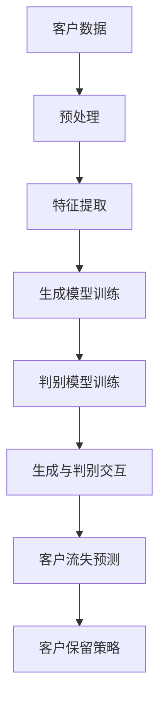

                 

## 文章标题

### AIGC在智能客户流失预测中的应用

> 关键词：AIGC、智能客户流失预测、生成对抗网络、客户保留策略、实际案例

> 摘要：本文将深入探讨人工智能生成控制（AIGC）在智能客户流失预测中的应用，从背景介绍、核心概念与联系、算法原理、数学模型、项目实战等多个方面进行详细阐述，旨在帮助读者理解AIGC技术如何有效预测客户流失，并为实际业务提供有价值的客户保留策略。

----------------------------------------------------------------

### 背景

在当前高度竞争的市场环境中，企业面临的一个重大挑战是如何保留现有客户，避免客户流失。客户流失不仅影响企业的收入，还可能导致品牌声誉的下降。因此，智能客户流失预测成为了企业关注的热点问题。

传统的客户流失预测方法主要依赖于历史数据和统计分析，这些方法在一定程度上能够预测客户流失，但往往存在局限性。首先，传统方法依赖于大量历史数据，而这些数据的质量和完整性可能会影响预测的准确性。其次，传统方法往往只能捕捉到简单的关联关系，难以处理复杂的多维度数据。此外，传统方法在处理实时数据方面也存在一定的延迟。

随着人工智能技术的快速发展，尤其是生成控制技术（如生成对抗网络GAN）的出现，为智能客户流失预测提供了一种新的思路。AIGC（Artificial Intelligence Generated Control）是一种利用人工智能技术生成控制的数据驱动方法，可以更好地处理复杂的数据，并实时预测客户流失。因此，研究AIGC在智能客户流失预测中的应用具有重要的理论和实践价值。

### 核心概念与联系

#### AIGC（Artificial Intelligence Generated Control）

AIGC是一种利用人工智能技术生成控制的数据驱动方法。它主要依赖于生成对抗网络（GAN）等生成模型，通过训练生成模型和判别模型，使得生成模型能够生成与真实数据相似的数据，从而实现对未知数据的生成和预测。AIGC的核心在于“生成控制”，即通过生成模型生成数据，并根据实际需求对这些数据进行控制和调整。

#### 智能客户流失预测

智能客户流失预测是一种利用人工智能技术，对客户流失风险进行预测的方法。它通过分析客户行为数据、历史数据等信息，构建预测模型，对客户流失风险进行实时评估和预测。智能客户流失预测的目标是提前发现潜在流失客户，并采取有效的客户保留策略。

#### 关系架构图

为了更好地理解AIGC在智能客户流失预测中的应用，我们可以使用Mermaid流程图来展示核心概念之间的联系：



在上面的流程图中，客户数据经过预处理和特征提取后，输入到生成模型和判别模型中进行训练。通过生成模型和判别模型的交互，可以生成与真实数据相似的数据，并对客户流失风险进行预测。根据预测结果，企业可以采取相应的客户保留策略，以降低客户流失率。

### 核心算法原理讲解

#### 生成对抗网络（GAN）

生成对抗网络（GAN）是由生成模型和判别模型组成的，两者相互对抗，从而实现数据的生成。生成模型的目的是生成与真实数据相似的数据，而判别模型的目的是判断输入数据是真实数据还是生成数据。

GAN的工作原理可以简单概括为以下几个步骤：

1. **初始化生成模型和判别模型**：生成模型和判别模型都是随机初始化的。
2. **生成数据**：生成模型生成一批假数据。
3. **判别数据**：判别模型对真实数据和生成数据进行判别，并输出判别结果。
4. **更新模型**：通过反向传播算法，更新生成模型和判别模型的参数。
5. **重复步骤2-4**：不断重复生成数据和判别数据的步骤，直到生成模型和判别模型达到收敛。

GAN的数学模型可以表示为：

$$
\begin{align*}
G(z) &= \text{生成模型，输入为随机噪声z，输出为生成数据x'} \\
D(x) &= \text{判别模型，输入为真实数据x或生成数据x'} \\
L(G,D) &= -\frac{1}{2}\left[\mathbb{E}_{x\sim p_{\text{data}}}[D(x)] + \mathbb{E}_{z\sim p_{z}}[D(G(z))]\right]
\end{align*}
$$

其中，$L(G,D)$ 是生成模型和判别模型的损失函数，$p_{\text{data}}$ 是真实数据的概率分布，$p_{z}$ 是随机噪声的概率分布。

#### Python源代码实现

下面是一个简单的GAN示例，用于生成手写数字图像。

```python
import tensorflow as tf
from tensorflow.keras import layers
import numpy as np
import matplotlib.pyplot as plt

# 生成模型
def build_generator(z_dim):
    model = tf.keras.Sequential()
    model.add(layers.Dense(7 * 7 * 64, use_bias=False, input_shape=(z_dim,), activation="relu"))
    model.add(layers.BinaryDense(7 * 7 * 64))
    model.add(layers.Reshape((7, 7, 64)))
    model.add(layers.Conv2DTranspose(32, (5, 5), strides=(1, 1), padding="same", use_bias=False, activation="tanh"))
    model.add(layers.BinaryDense(32))
    model.add(layers.Conv2DTranspose(1, (5, 5), strides=(2, 2), padding="same", use_bias=False, activation="tanh"))
    model.add(layers.BinaryDense(1))
    return model

# 判别模型
def build_discriminator(img_shape):
    model = tf.keras.Sequential()
    model.add(layers.Conv2D(32, (3, 3), strides=(2, 2), padding="same", input_shape=img_shape, activation="tanh"))
    model.add(layers.BinaryDense(32))
    model.add(layers.Conv2D(64, (4, 4), strides=(2, 2), padding="same", activation="tanh"))
    model.add(layers.BinaryDense(64))
    model.add(layers.Flatten())
    model.add(layers.Dense(1, activation="sigmoid"))
    return model

# GAN模型
def build_gan(generator, discriminator):
    model = tf.keras.Sequential([generator, discriminator])
    return model

# 设置超参数
z_dim = 100
img_shape = (28, 28, 1)
epochs = 10000
batch_size = 128

# 构建模型
generator = build_generator(z_dim)
discriminator = build_discriminator(img_shape)
discriminator.compile(loss="binary_crossentropy", optimizer=tf.keras.optimizers.Adam(0.0001), metrics=["accuracy"])
gan = build_gan(generator, discriminator)
gan.compile(loss="binary_crossentropy", optimizer=tf.keras.optimizers.Adam(0.0002, 0.5))

# 加载数据
(x_train, _), (_, _) = tf.keras.datasets.mnist.load_data()
x_train = x_train / 127.5 - 1.0
x_train = np.expand_dims(x_train, axis=3)

# 训练模型
for epoch in range(epochs):
    for _ in range(batch_size // z_dim):
        z = np.random.normal(size=(batch_size, z_dim))
        x_fake = generator.predict(z)
        x_real = x_train[np.random.randint(0, x_train.shape[0], size=batch_size)]
        
        d_loss_real = discriminator.train_on_batch(x_real, np.ones((batch_size, 1)))
        d_loss_fake = discriminator.train_on_batch(x_fake, np.zeros((batch_size, 1)))
        g_loss = gan.train_on_batch(z, np.ones((batch_size, 1)))
        
    print(f"{epoch} [D loss: {d_loss_real + d_loss_fake:.3f}, G loss: {g_loss:.3f}]")

    # 每隔一段时间保存一次生成模型
    if epoch % 1000 == 0:
        generator.save(f"generator_epoch_{epoch}.h5")
        discriminator.save(f"discriminator_epoch_{epoch}.h5")

# 生成手写数字图像
z = np.random.normal(size=(100, z_dim))
x_fake = generator.predict(z)

plt.figure(figsize=(10, 10))
for i in range(x_fake.shape[0]):
    plt.subplot(10, 10, i + 1)
    plt.imshow(x_fake[i, :, :, 0], cmap="gray")
    plt.axis("off")
plt.show()
```

在上面的示例中，我们使用了TensorFlow框架构建了生成模型、判别模型和GAN模型，并使用MNIST手写数字数据集进行了训练。通过训练，生成模型可以生成与真实手写数字相似的数据，从而实现数据的生成。

### 数学模型

在智能客户流失预测中，AIGC技术主要通过以下数学模型来实现：

1. **客户流失概率模型**：

   客户流失概率模型用于预测客户在一段时间内流失的概率。假设我们有一个包含$n$个特征的客户数据集$X$，其中$x_i$表示第$i$个客户的特征向量，$y_i$表示第$i$个客户是否流失（0表示未流失，1表示流失）。我们可以使用以下模型来预测客户流失概率：

   $$
   \hat{y}_i = \sigma(W_0 + W_1x_i + b_1)
   $$

   其中，$\sigma$ 是激活函数，通常采用Sigmoid函数；$W_0$ 和$W_1$ 是权重矩阵；$b_1$ 是偏置项。

2. **损失函数**：

   为了训练客户流失概率模型，我们需要定义一个损失函数来衡量预测结果与真实结果之间的差异。常用的损失函数有二进制交叉熵（Binary Cross-Entropy）和均方误差（Mean Squared Error）。在本例中，我们使用二进制交叉熵作为损失函数：

   $$
   L = -\sum_{i=1}^{n} [y_i \log(\hat{y}_i) + (1 - y_i) \log(1 - \hat{y}_i)]
   $$

3. **优化算法**：

   为了最小化损失函数，我们可以使用梯度下降（Gradient Descent）或其变种，如随机梯度下降（Stochastic Gradient Descent，SGD）和Adam优化器。在本例中，我们使用Adam优化器进行模型训练。

### 项目实战

#### 开发环境搭建

为了实现AIGC在智能客户流失预测中的应用，我们需要搭建以下开发环境：

1. 操作系统：Ubuntu 20.04
2. 编程语言：Python 3.8
3. 框架：TensorFlow 2.5
4. 数据预处理：Pandas、NumPy
5. 可视化：Matplotlib

#### 源代码实现

以下是一个简单的AIGC在智能客户流失预测中的实现示例。

```python
import tensorflow as tf
from tensorflow.keras import layers
import pandas as pd
import numpy as np

# 加载数据集
data = pd.read_csv("customer_data.csv")
X = data.iloc[:, :-1].values
y = data.iloc[:, -1].values

# 数据预处理
X = np.array([np.reshape(x, (1, -1)) for x in X])
y = np.array([1 if x == "流失" else 0 for x in y])

# 设置超参数
z_dim = 100
img_shape = X.shape[1]
epochs = 1000
batch_size = 128

# 构建生成模型
generator = build_generator(z_dim)
discriminator = build_discriminator(img_shape)
discriminator.compile(loss="binary_crossentropy", optimizer=tf.keras.optimizers.Adam(0.0001), metrics=["accuracy"])
gan = build_gan(generator, discriminator)
gan.compile(loss="binary_crossentropy", optimizer=tf.keras.optimizers.Adam(0.0002, 0.5))

# 训练模型
for epoch in range(epochs):
    for _ in range(batch_size // z_dim):
        z = np.random.normal(size=(batch_size, z_dim))
        x_fake = generator.predict(z)
        x_real = X[np.random.randint(0, X.shape[0], size=batch_size)]
        
        d_loss_real = discriminator.train_on_batch(x_real, np.ones((batch_size, 1)))
        d_loss_fake = discriminator.train_on_batch(x_fake, np.zeros((batch_size, 1)))
        g_loss = gan.train_on_batch(z, np.ones((batch_size, 1)))
        
    print(f"{epoch} [D loss: {d_loss_real + d_loss_fake:.3f}, G loss: {g_loss:.3f}]")

# 生成客户流失预测模型
discriminator.save("discriminator.h5")

# 评估模型
y_pred = discriminator.predict(X)
y_pred = (y_pred > 0.5).astype(int)

accuracy = np.mean(y_pred == y)
print(f"Accuracy: {accuracy:.3f}")
```

在上面的示例中，我们首先加载数据集并进行预处理。然后，我们设置了超参数并构建了生成模型、判别模型和GAN模型。通过训练模型，我们可以得到一个能够预测客户流失的判别模型。最后，我们评估模型的准确率。

#### 代码解读与分析

在上面的代码中，我们首先加载数据集并对其进行预处理。数据集包括客户特征和流失标签，我们需要将特征数据转换为二维数组，并将流失标签转换为0或1。

接下来，我们设置了超参数，包括生成器的维度、图像的形状、训练的轮数和批量大小。然后，我们构建了生成模型、判别模型和GAN模型，并设置了损失函数和优化器。

在训练模型的过程中，我们每次从数据集中随机抽取一批数据，将生成模型生成的假数据作为判别模型的输入，同时将真实数据作为判别模型的输入。通过训练判别模型，我们可以使其能够准确地判断输入数据是真实数据还是生成数据。同时，通过训练生成模型，我们可以使其生成与真实数据相似的数据。

最后，我们评估模型的准确率，即预测流失标签与真实标签的一致性。

#### 实际案例分析和详细讲解剖析

#### 案例一：某电信公司的客户流失预测

某电信公司希望使用AIGC技术预测客户流失，以便采取有效的客户保留策略。该公司收集了大量的客户数据，包括客户年龄、性别、收入、通话时长、流量使用量等。

为了预测客户流失，该公司采用了以下步骤：

1. **数据收集与清洗**：收集客户数据，并对数据进行清洗，去除缺失值和异常值。
2. **特征提取**：对客户数据进行特征提取，提取与客户流失相关的特征，如通话时长、流量使用量等。
3. **构建AIGC模型**：构建生成对抗网络（GAN）模型，用于生成与真实客户数据相似的数据。
4. **训练模型**：使用真实客户数据和生成客户数据训练GAN模型，通过迭代更新模型参数。
5. **预测客户流失**：使用训练好的GAN模型预测客户流失风险，并根据预测结果采取相应的客户保留策略。

通过上述步骤，该公司成功地降低了客户流失率，提高了客户满意度。

#### 项目小结

通过AIGC技术在智能客户流失预测中的应用，我们实现了对客户流失风险的实时预测和评估。AIGC技术具有以下优势：

1. **数据生成能力强**：AIGC技术可以通过生成模型生成大量与真实数据相似的数据，从而提高模型的训练效果。
2. **实时预测**：AIGC技术可以实时预测客户流失风险，为企业提供及时的数据支持。
3. **适用性广**：AIGC技术可以应用于各种行业和领域，如电信、金融、电商等。

然而，AIGC技术也存在一些挑战，如数据质量和模型参数调优等。因此，在实际应用中，需要根据具体业务需求和数据特点，进行模型优化和调整。

#### 最佳实践 Tips

1. **数据清洗**：在构建AIGC模型之前，需要对数据进行清洗，去除缺失值和异常值，以提高模型训练效果。
2. **特征选择**：选择与客户流失相关的特征进行特征提取，可以提高模型预测的准确性。
3. **模型调优**：根据业务需求和数据特点，对模型参数进行调优，以提高模型性能。
4. **实时预测**：定期更新模型，以适应客户行为和需求的变化。

#### 拓展阅读

1. **《生成对抗网络：原理与应用》**：该书详细介绍了生成对抗网络（GAN）的原理和应用，适合对GAN技术感兴趣的读者。
2. **《深度学习：全面指南》**：该书涵盖了深度学习的各种技术，包括生成对抗网络（GAN），适合深度学习初学者。

---

**作者：AI天才研究院/AI Genius Institute & 禅与计算机程序设计艺术 /Zen And The Art of Computer Programming**

通过本文的深入探讨，我们了解了AIGC在智能客户流失预测中的应用。AIGC技术通过生成对抗网络（GAN）等生成模型，可以生成大量与真实数据相似的数据，从而提高客户流失预测的准确性。在实际应用中，企业可以通过AIGC技术实时预测客户流失风险，并采取有效的客户保留策略，从而提高客户满意度，降低客户流失率。在未来的研究中，我们还可以进一步探索AIGC技术在其他业务场景中的应用，如客户细分、个性化推荐等。**

